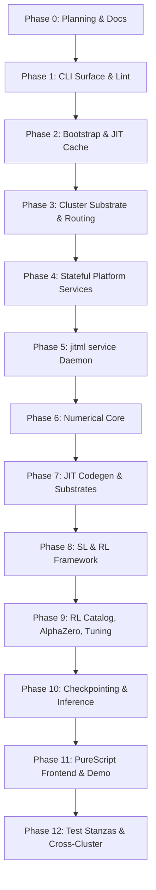

# jitML Development Plan

**Status**: Authoritative source
**Supersedes**: N/A
**Referenced by**: [../README.md](../README.md), [../AGENTS.md](../AGENTS.md),
[../CLAUDE.md](../CLAUDE.md), [../HASKELL_CLI_TOOL.md](../HASKELL_CLI_TOOL.md),
[development_plan_standards.md](development_plan_standards.md),
[00-overview.md](00-overview.md), [system-components.md](system-components.md),
[legacy-tracking-for-deletion.md](legacy-tracking-for-deletion.md),
[phase-0-planning-documentation.md](phase-0-planning-documentation.md),
[phase-1-haskell-cli-surface.md](phase-1-haskell-cli-surface.md),
[phase-2-bootstrap-reconciler-and-jit-cache.md](phase-2-bootstrap-reconciler-and-jit-cache.md),
[phase-3-cluster-substrate-and-routing.md](phase-3-cluster-substrate-and-routing.md),
[phase-4-stateful-platform-services.md](phase-4-stateful-platform-services.md),
[phase-5-jitml-service-daemon.md](phase-5-jitml-service-daemon.md),
[phase-6-numerical-core.md](phase-6-numerical-core.md),
[phase-7-jit-codegen-and-substrates.md](phase-7-jit-codegen-and-substrates.md),
[phase-8-supervised-and-rl-framework.md](phase-8-supervised-and-rl-framework.md),
[phase-9-rl-catalog-alphazero-and-tuning.md](phase-9-rl-catalog-alphazero-and-tuning.md),
[phase-10-checkpointing-and-inference.md](phase-10-checkpointing-and-inference.md),
[phase-11-purescript-frontend-and-demo.md](phase-11-purescript-frontend-and-demo.md),
[phase-12-test-stanzas-and-cross-cluster.md](phase-12-test-stanzas-and-cross-cluster.md),
[../documents/documentation_standards.md](../documents/documentation_standards.md)
**Generated sections**: none

> **Purpose**: Provide the single execution-ordered development plan for the jitML
> Haskell CLI, the three substrates (`apple-silicon`, `linux-cpu`, `linux-cuda`), the
> `jitml service` daemon, the SL/RL training stack including AlphaZero and
> hyperparameter tuning, the PureScript frontend, and the cross-cluster parity test
> surface — including phase status, validation gates, and cleanup ownership.

## Standards

See [development_plan_standards.md](development_plan_standards.md) for the
maintenance rules that govern this plan suite.

## Closure Status

The plan is mid-build. Phases `0` (planning and documentation topology), `1`
(Haskell CLI surface, lint stack, and code-quality gate), `2` (bootstrap
reconciler, prerequisite DAG, JIT cache, outer-container builds), `3`
(cluster substrate and routing), `4` (stateful platform services), and `6`
(numerical core) are `✅ Done` — every Exit Definition obligation those phases
own is met in the worktree and validated
by their sprints' `### Validation` blocks. Sprint `1.4` now owns the
container-owned style-tool rule: `jitml:local` image construction installs the
separate style GHC/tools, runs `jitml check-code`, and runtime lint reports an
image-rebuild remedy instead of installing missing style tools through host
`ghcup`.
Phases `5`, `7`, `8`, `9`, `10`, `11`, and `12` are `🔄 Active`:
each owns at least one Exit Definition obligation that requires live runtime
behaviour (cluster apply, real service clients, real kernel execution,
checkpoint storage, browser flow, cross-substrate parity) which the worktree
does not yet exercise. The active phases have all materially advanced
their typed scaffolds: the family-aware JIT codegen surface
(`JitML.Codegen.KernelFamily`), the per-substrate knob spaces
(`JitML.Engines.Tuning`), the 14 RL algorithm modules under
`JitML.RL.Algorithms.*`, the AlphaZero MCTS / SelfPlay / Arena substack,
the four-game `PerfectInformation` typeclass, the typed proto envelopes
under `JitML.Proto.{Training,Rl,Tune}`, the typed daemon capability
surface with full `HasMinIO` / `HasPulsar` / `HasHarbor` / `HasKubectl`
methods + per-domain `HandlerRouter` + filesystem-backed `HasMinIO`
instance (`JitML.Service.FilesystemMinIO`) + subprocess-backed
`HasMinIO` / `HasPulsar` / `HasHarbor` / `HasKubectl` instances
(`JitML.Service.MinIOSubprocess`, `JitML.Service.HarborSubprocess`,
`JitML.Service.PulsarWebSocketSubprocess`,
`JitML.Service.KubectlSubprocess`), plus
`JitML.Service.Clients` deriving daemon-owned MinIO, Pulsar WebSocket,
Harbor, and kubectl settings from the loaded `BootConfig` and exposing the
combined `DaemonServiceClient` interpreter for those four capability classes,
with explicit Harbor settings, live routed MinIO conditional-write validation,
routed Pulsar WebSocket publish/consume validation, and stdin-piped YAML
`kubectlApply` validated against a live Kind cluster,
the typed Consumer IO loop
(`JitML.Service.Consumer.{consumerStep,runConsumerLoop,ConsumerOutcome}`)
exercising HasPulsar subscribe/consume/ack + per-domain dedup against
a synthetic broker in `jitml-daemon-lifecycle`, plus
`daemonSubscriptionsForBootConfig` / `subscribeDaemonTopics` deriving the
cluster and Apple-host subscription plan from `BootConfig` and accepting live
`persistent://public/default/...` broker topic names, with `DaemonRuntime`
rendering that plan under `pulsar_subscriptions` and startup acquisition under
`pulsar_subscription_status` after the routed WebSocket subscribe probe,
bounded acquired-subscription batching via
`JitML.Service.Runtime.daemonConsumerBatch`, the LiveConfig-derived dedup cache
size used by the handler router, the
typed phased Helm rollout
(`JitML.Cluster.Helm.helmPhasedRolloutPlan`) plus
`pulsarTopicCreateSubprocesses` registering the same 26-topic
substrate-scoped Pulsar family and actually invoked through
`JitML.Bootstrap.liveExecutePhasedRollout` from
`jitml bootstrap --<substrate>`,
the service-Postgres registry lint wired into `JitML.Lint.Chart` plus the
live-validated `harbor-pg` Percona cluster readiness path and the checked-in
Harbor direct values file that points at `harbor-pg-pgbouncer.platform.svc`
plus the MinIO `harbor-registry` S3 backend after pre-Harbor readiness waits,
with 2026-05-19 live validation proving Harbor starts against the external
database and writes registry objects into that MinIO S3 backend, plus
2026-05-19 live validation proving routed `HasMinIO` `If-None-Match` /
`If-Match` conflicts map to `SEConflict` through `/minio/s3`, plus
2026-05-19 live validation proving `/pulsar/ws` targets the broker-embedded
WebSocket service and `JitML.Service.PulsarWebSocketSubprocess` publishes and
consumes through the edge, plus 2026-05-20 live validation proving the current
26-topic substrate-scoped Pulsar family is registered and routed publish/consume
works on `training.command.linux-cpu` from `jitml:local`, plus 2026-05-20 live
Linux CUDA validation proving the checked-in Kind config wires the worker
containerd `nvidia` runtime handler and runs an `nvidia-smi -L` probe through
`RuntimeClass/nvidia`,
the optimizer/RNG/metric/parent-lineage CheckpointManifest shape
with typed `AdvancePredicate` and `RetentionPolicy` +
`JitML.App.runInternalGc` reconciler exiting `3` on no-op +
`JitML.App.runInspectReplay` for `jitml inspect replay
<manifest-sha>`, the TFRecord wire format with Castagnoli CRC32C
(`JitML.Observability.TensorBoard.{encodeTfRecord,crc32cCastagnoli,maskedCrc32c}`)
validated against canonical CRC vectors, the TensorBoard scalar-event codec
(`JitML.Proto.TensorBoard.encodeTensorBoardEventProto`), the write-once shard
writer (`JitML.Observability.TensorBoard.writeTensorBoardEvent`), and live
routed TensorBoard scalar readback from a Haskell-written shard, the AVX2 /
AVX-512 CPU
detection (`JitML.Engines.CpuFeatures`) probing the host through the
typed `Subprocess` boundary, the MCTS transposition table
(`JitML.RL.AlphaZero.Mcts.{TranspositionTable,runSearchWithTable}`)
deduplicating equivalent search subtrees, per-game AlphaZero golden
replays (`test/golden/alphazero/{connect4,othello,hex,gomoku}-transcript.txt`)
bound by `JitML.RL.AlphaZero.selfPlayTranscriptFor` and validated by
`jitml-rl-canonicals`, the SelfPlayBuffer round-trip through the
filesystem-backed `HasMinIO` instance, the same-host bit-equality of
the linux-cpu identity kernel across three successive FFI runs plus the
linux-cpu reduction-smoke generated FFI path validated by
`jitml-cross-backend`, the Dhall numerics schema decode
that round-trips the full Haskell catalog
(`JitML.Numerics.Schema.loadNumericsCatalog`), the generated
TensorBoard Service renderer
(`JitML.Observability.TensorBoard.renderTensorBoardService`) plus the
checked-in `chart/local/tensorboard/templates/service.yaml`, the six
PureScript panel payload modules under `web/src/Panels/`, the seven-test
Playwright matrix represented in `jitml-e2e` through the typed
`Subprocess` boundary against inline DOM stubs, the `spago test` and
`purs-tidy check` command shapes represented from `jitml-purescript-style`
through typed `Subprocess` values, the demo route logic that serves
`web/dist/Main/index.js` when a local `spago build --output web/dist`
has produced it, the real-binary `./.build/jitml` spawn matrix
(`--help`, `bootstrap --linux-cpu --dry-run`, `cluster up --substrate
linux-cpu --dry-run`, `internal gc <hash>` exiting `3`) through the
typed boundary in a temp workdir covered by `jitml-integration`, the
spin-up path through `kindCreateSubprocess` that writes
`./.build/jitml.kubeconfig` without polluting `~/.kube/config`, the
post-teardown `no jitml-e2e-* Kind clusters survive` assertion in
`jitml-e2e` when `kind` is installed, the typed Pulumi ephemeral-Kind
orchestrator under `infra/pulumi/index.ts`, the typed Tune resume
surface (`JitML.Tune.Resume.{persistTrialTranscript,replaySweep}`)
round-tripping through filesystem-backed `HasMinIO`, the TbSidecar
writer and dispatcher
(`JitML.Observability.TbSidecar.{writeCheckpointSidecar,dispatchCheckpointPayload}`)
plus the `renderTensorBoardService` renderer, the typed Docker
image-publication plans (`JitML.Cluster.DockerImage.{dockerBuildAndKindLoadPlan,kindLoadDockerImageSubprocess,dockerMirrorPlan,docker{Build,Tag,Push,Login}Subprocess}`)
wired into `JitML.Bootstrap.livePhasedRolloutSubprocesses`, the
edge-port lease (`JitML.Cluster.EdgePort.leaseEdgePort`) wired into the
live publication writer and Apple host Dhall patch, the lifecycle-exit
wiring (`JitML.Service.Runtime.consumerLoopExit`)
surfacing typed `AppError` from the consumer outcome batch, the
two-worker Kind renderer (`JitML.Cluster.Kind.kindConfigWithWorkerCount`) and
2026-05-20 live `jitml-service` anti-affinity validation placing two replicas
on distinct Kind workers, the
demo bundle-serving path (`JitML.Web.Server.{loadBundleEntry,demoHttpRoutesWithBundle}`)
serving the compiled Halogen `web/dist/Main/index.js` when
present, the `loadInferenceCheckpointWith` hook plus
`JitML.Engines.Local.runLinuxCpuCheckpointInference` validating the local
latest-pointer → manifest → generated-kernel FFI path, the
`JitML.Test.Report.parseReportCardKnobs` cabal.project knob parser consumed by
`jitml test all`, and the per-problem SL convergence goldens under
`test/golden/sl/<problem-key>/curve.txt` for all 11 canonical SL
problems are all checked in. The remaining
live runtime behaviours (CUDA JIT execution, Tart VM, live daemon Pulsar
at-least-once redelivery, live training-to-convergence on real hardware,
and live training/inference service-client effects) remain
gated by absent infrastructure per the per-sprint `### Remaining
Work` blocks. The `Some Tuning::{ ... }` Dhall worked example now decodes
through the local tuning ADT and `jitml tune experiments/mnist-tune.dhall`
renders `sampler: TPE`; Sprint `9.7` remains Active for proto-lens bindings,
daemon-side tune handling, live trial persistence, and report-card knob
consumption.

Against the eighteen-item [Exit Definition](#exit-definition), the
following items currently pass: 4 (stage-0 scripts + typed prerequisite
DAG), 10 (toolchain pin), 11 (every enumerated Plan/Apply command —
`jitml bootstrap`, `jitml train`, `jitml tune`, `jitml rl train`,
`jitml cluster up`, `jitml test all`, `jitml service`, `jitml internal
gc` — supports `--dry-run` and `--plan-file <path>`), 12 (typed
`Subprocess` boundary), 13 (one `prerequisiteRegistry`), 14 (single
`AppError` ADT and `renderError`), 16 (`CommandSpec` as implementation source),
17 (`src/JitML/Routes.hs` registry). Items 1, 2, 3, 5, 6, 7, 8, 9, 15, 18 are
partial or unmet; the
owning sprints list the open work in their `### Remaining Work` blocks
per
[development_plan_standards.md → C. Honest Completion Tracking](development_plan_standards.md#c-honest-completion-tracking).

## Execution Roadmap

The remaining Exit-Definition obligations are ordered by dependency, not by
phase number. Each item links to the owning sprint's `### Remaining Work`
block, where the validation gate lives:

1. **Toolchain bounds refresh (Exit 10 follow-up).** The scoped `allow-newer`
   block in `cabal.project` survives only while upstream Dhall/CBOR releases
   reject GHC `9.14.1`'s `base-4.22`. See
   [legacy-tracking-for-deletion.md → Pending Removal](legacy-tracking-for-deletion.md#pending-removal).
2. **Real daemon runtime (Exit 2).** See
   [phase-5-jitml-service-daemon.md](phase-5-jitml-service-daemon.md)
   Sprints `5.4` / `5.5` / `5.6` `Remaining Work`.
3. **Real per-substrate JIT execution (Exit 1, 5, 12).** See
   [phase-7-jit-codegen-and-substrates.md](phase-7-jit-codegen-and-substrates.md)
   Sprints `7.3` / `7.4` / `7.5` / `7.6` `Remaining Work`.
4. **Real SL/RL/AlphaZero/tuning loops and live tuner execution (Exit 6).** See
   [phase-8-supervised-and-rl-framework.md](phase-8-supervised-and-rl-framework.md)
   and [phase-9-rl-catalog-alphazero-and-tuning.md](phase-9-rl-catalog-alphazero-and-tuning.md)
   sprint `Remaining Work` blocks.
5. **Live MinIO checkpoint storage and inference (Exit 7).** See
   [phase-10-checkpointing-and-inference.md](phase-10-checkpointing-and-inference.md)
   Sprints `10.1`–`10.4` `Remaining Work`.
6. **Stateful frontend E2E and Playwright (Exit 8).** See
   [phase-11-purescript-frontend-and-demo.md](phase-11-purescript-frontend-and-demo.md)
   Sprints `11.3` / `11.4` / `11.5` / `11.6` `Remaining Work`.
7. **`jitml-e2e` live Pulumi-orchestrated cross-cluster validation (Exit 9).** See
   [phase-12-test-stanzas-and-cross-cluster.md](phase-12-test-stanzas-and-cross-cluster.md)
   Sprints `12.2`–`12.6` and `12.8` / `12.9` `Remaining Work`.
8. **Empty legacy ledger (Exit 18).** Closes after items 1–7 close and
    the remaining cleanup rows in
    [legacy-tracking-for-deletion.md → Pending Removal](legacy-tracking-for-deletion.md#pending-removal)
    are moved to `Completed`.

## Document Index

| Document | Purpose |
|----------|---------|
| [development_plan_standards.md](development_plan_standards.md) | Conventions for maintaining the development plan |
| [00-overview.md](00-overview.md) | Vision, target outcome, doctrine scope, and hard constraints |
| [system-components.md](system-components.md) | Authoritative target component inventory for the jitML Haskell CLI, the three substrates, the daemon, the platform services, the training surfaces, and the test stanzas |
| [phase-0-planning-documentation.md](phase-0-planning-documentation.md) | Phase 0: Planning and documentation topology |
| [phase-1-haskell-cli-surface.md](phase-1-haskell-cli-surface.md) | Phase 1: Haskell CLI surface, `CommandSpec`, lint stack |
| [phase-2-bootstrap-reconciler-and-jit-cache.md](phase-2-bootstrap-reconciler-and-jit-cache.md) | Phase 2: Bootstrap reconciler, prerequisite DAG, JIT cache discipline, outer-container builds |
| [phase-3-cluster-substrate-and-routing.md](phase-3-cluster-substrate-and-routing.md) | Phase 3: Kind cluster substrate, Helm umbrella chart, Envoy Gateway, `Routes.hs` registry |
| [phase-4-stateful-platform-services.md](phase-4-stateful-platform-services.md) | Phase 4: Harbor, MinIO, Pulsar, PostgreSQL, observability stack |
| [phase-5-jitml-service-daemon.md](phase-5-jitml-service-daemon.md) | Phase 5: `jitml service` daemon (BootConfig/LiveConfig, hot reload, capability classes, at-least-once Pulsar consumer) |
| [phase-6-numerical-core.md](phase-6-numerical-core.md) | Phase 6: Local layer/activation/optimizer/scheduler/loss catalog, Dhall mirrors, and audit |
| [phase-7-jit-codegen-and-substrates.md](phase-7-jit-codegen-and-substrates.md) | Phase 7: Per-substrate JIT codegen (Metal, oneDNN, CUDA), content-addressed cache, hardware auto-tuning |
| [phase-8-supervised-and-rl-framework.md](phase-8-supervised-and-rl-framework.md) | Phase 8: Supervised learning loops, canonical SL problems, RL framework primitives |
| [phase-9-rl-catalog-alphazero-and-tuning.md](phase-9-rl-catalog-alphazero-and-tuning.md) | Phase 9: RL algorithm catalog, AlphaZero self-play, hyperparameter tuning |
| [phase-10-checkpointing-and-inference.md](phase-10-checkpointing-and-inference.md) | Phase 10: Split-blob checkpoint format, manifest, inference-only read path |
| [phase-11-purescript-frontend-and-demo.md](phase-11-purescript-frontend-and-demo.md) | Phase 11: PureScript shell, generated browser contracts, demo shim, Playwright scaffold |
| [phase-12-test-stanzas-and-cross-cluster.md](phase-12-test-stanzas-and-cross-cluster.md) | Phase 12: Ten Cabal test stanzas, lint matrix, Pulumi metadata scaffold, report-card knobs |
| [legacy-tracking-for-deletion.md](legacy-tracking-for-deletion.md) | Cleanup ledger |

## Status Vocabulary

| Status | Meaning | Emoji |
|--------|---------|-------|
| **Done** | Every Exit-Definition obligation the sprint owns is met in the worktree, validated by the sprint's `### Validation` commands, and the listed docs are aligned. A sprint whose entire obligation is documentation, typed scaffolding, schema/ADT, generated-section, or pure-Haskell catalog work is legitimately Done when that surface is in place and tested; a sprint whose obligation includes live runtime behaviour (cluster up, Helm apply, Pulsar subscribe, MinIO put, kernel compile-and-execute, browser interaction, etc.) is Done only after that live behaviour is exercised through the sprint's validation. | ✅ |
| **Active** | Work has started and at least one owned Exit-Definition obligation is unmet. The sprint body lists those gaps in an explicit `### Remaining Work` block. | 🔄 |
| **Planned** | All upstream sprint dependencies are Done. The sprint has not yet started. It must list no unmet blockers. | 📋 |
| **Blocked** | At least one upstream sprint or external prerequisite required for this sprint's owned obligations is not Done. The sprint body lists the blockers in a `**Blocked by**:` line. | ⏸️ |

## Definition of Done

A sprint moves to `Done` only when all of the following are true:

1. Every Exit Definition obligation the sprint owns is met in the worktree.
   The owned obligations are named in the sprint's `### Objective` /
   `### Deliverables` blocks.
2. The validation commands in the sprint's `### Validation` block pass through
   the canonical `jitml` surface (or, for Phase `0`, through the manual lint
   and grep audits named in this plan).
3. The docs listed in `Docs to update` are aligned with the implemented
   behavior.
4. Sprint-owned doctrine deviations or compatibility helpers (not the primary
   obligations themselves) are reflected in
   [legacy-tracking-for-deletion.md](legacy-tracking-for-deletion.md).
5. No sprint-owned blocker or remaining work survives.
6. The doctrine sections the sprint adopts (when any) are cited by name in the
   `### Deliverables` block per standards rule L.

A sprint whose entire owned obligation is documentation, typed scaffolding,
generated-section, schema/ADT, or pure-Haskell catalog work is `✅ Done` when
that surface is in place and tested. A sprint whose owned obligation includes
live runtime behaviour is `🔄 Active` with `### Remaining Work` until that
runtime is exercised, even if a typed renderer or local materializer for the
obligation exists.

## Phase Overview

| Phase | Name | Status | Document |
|-------|------|--------|----------|
| 0 | Planning and Documentation Topology | ✅ Done | [phase-0-planning-documentation.md](phase-0-planning-documentation.md) |
| 1 | Haskell CLI Surface, `CommandSpec`, Lint Stack | ✅ Done | [phase-1-haskell-cli-surface.md](phase-1-haskell-cli-surface.md) |
| 2 | Bootstrap Reconciler, Prerequisite DAG, JIT Cache | ✅ Done | [phase-2-bootstrap-reconciler-and-jit-cache.md](phase-2-bootstrap-reconciler-and-jit-cache.md) |
| 3 | Cluster Substrate and Routing | ✅ Done | [phase-3-cluster-substrate-and-routing.md](phase-3-cluster-substrate-and-routing.md) |
| 4 | Stateful Platform Services | ✅ Done | [phase-4-stateful-platform-services.md](phase-4-stateful-platform-services.md) |
| 5 | `jitml service` Daemon | 🔄 Active | [phase-5-jitml-service-daemon.md](phase-5-jitml-service-daemon.md) |
| 6 | Numerical Core | ✅ Done | [phase-6-numerical-core.md](phase-6-numerical-core.md) |
| 7 | JIT Codegen and Per-Substrate Execution | 🔄 Active | [phase-7-jit-codegen-and-substrates.md](phase-7-jit-codegen-and-substrates.md) |
| 8 | Supervised Learning and RL Framework | 🔄 Active | [phase-8-supervised-and-rl-framework.md](phase-8-supervised-and-rl-framework.md) |
| 9 | RL Algorithm Catalog, AlphaZero, and Hyperparameter Tuning | 🔄 Active | [phase-9-rl-catalog-alphazero-and-tuning.md](phase-9-rl-catalog-alphazero-and-tuning.md) |
| 10 | Checkpointing and Inference-Only Read Path | 🔄 Active | [phase-10-checkpointing-and-inference.md](phase-10-checkpointing-and-inference.md) |
| 11 | PureScript Frontend and Demo | 🔄 Active | [phase-11-purescript-frontend-and-demo.md](phase-11-purescript-frontend-and-demo.md) |
| 12 | Test Stanzas, Lint Matrix, Cross-Cluster Parity | 🔄 Active | [phase-12-test-stanzas-and-cross-cluster.md](phase-12-test-stanzas-and-cross-cluster.md) |

## Current Plan Status

Phases `0`, `1`, `2`, `3`, `4`, and `6` are `✅ Done`. Phase `0` owns the plan
suite, the governed `documents/` doctrine suite, and the doctrine envelope.
Phase `1` owns the `CommandSpec` registry, typed `Subprocess` / `Plan` /
`apply` / `Env` / `AppError` boundaries, lint surfaces, warning-clean build
gate, and the container-owned Haskell style-tool gate; runtime Haskell lint uses
prebuilt image tools or reports an image-rebuild remedy instead of bootstrapping
style tools through host `ghcup`. Phase `2` owns the stage-0 scripts, the typed
prerequisite DAG (with effectful remediation), the content-addressed JIT
cache key/layout/manifest/symlink layer, the one-service
`compose.yaml`, the baseline `jitml:local` image, the Tart command
scaffold, and the script-side `status` / `test` / `down` / `purge` /
`purge --full` wrappers. Phase `3` owns the per-substrate Kind configs,
repo-local kubeconfig discipline, manual PV/storage-class surface, Envoy
Gateway listener, typed route registry, live phased bootstrap, and typed
cluster teardown path. Phase `4` owns Harbor, MinIO, Pulsar, service Postgres,
observability, TensorBoard, and the Linux CUDA NVIDIA RuntimeClass wiring,
including the clean 2026-05-20 `nvidia-smi` pod probe through
`RuntimeClass/nvidia`. Phase `6` owns the numerical-core catalog
(`src/JitML/Numerics/Catalog.hs`), its Dhall mirror, and the cross-type lint
audit. These Done phases cover [Exit Definition](#exit-definition)
items 4, 10, 11, 12, 13, 14, 16, and 17 plus Phase `4`'s owned platform
service portion of item 3.

Phases `5` (jitml service daemon), `7` (JIT codegen and per-substrate execution), `8`
(supervised and RL framework), `9` (RL catalog, AlphaZero, tuning), `10`
(checkpointing and inference), `11` (PureScript frontend and demo), and `12`
(test stanzas and cross-cluster) are `🔄 Active`. Each has materialized its
typed renderers, catalogs, command summaries, or test bodies in the
worktree, but at least one owned Exit-Definition obligation requires live
runtime behaviour that the worktree does not exercise. The unmet runtime
obligations are: live validation and effectful workload use of the
daemon-acquired MinIO/Harbor/kubectl clients, Pulsar at-least-once redelivery,
and event flow from the running service (Exit
2, 7); real
per-substrate kernel compile-and-execute beyond the Linux CPU identity
fixture in `JitML.Engines.Local` (Exit 1, 5, 12); real SL / RL / AlphaZero
training loops with golden convergence and reward fixtures, plus live tuner
trial execution / persistence beyond the local TPE Dhall render path (Exit 6);
the live `jitml-e2e` Pulumi + Helm + Playwright path against an ephemeral Kind
stack (Exit 8, 9); and the empty legacy ledger that closes after the remaining
runtime gates and toolchain cleanup close (Exit 18). Each gap is logged in the
owning sprint's `### Remaining Work` block; the dependency-ordered sequence is
in [Execution Roadmap](#execution-roadmap) above.

The local worktree implementation that backs the six Done phases and the typed
scaffolding inside the seven Active phases
comprises: `app/Main.hs` and
`app/Demo.hs` (six-line shims into the library-first `src/JitML/` tree);
three stage-0 bootstrap scripts that delegate to `jitml bootstrap
--<substrate>`; one Dockerfile and one root `compose.yaml` service (`jitml`)
producing image `jitml:local`; the
umbrella Helm chart at `chart/` with subchart deps for Harbor, Pulsar,
MinIO, Percona Postgres, Envoy Gateway, and kube-prometheus-stack; typed
chart/Kind renderers (including the typed `kindCreateSubprocess` /
`helmInstallSubprocess` / `helmPhasedRolloutPlan` / typed
service-Postgres registry plus the live Docker build / Kind image-load phase in
`JitML.Bootstrap.livePhasedRolloutSubprocesses` and the retry-hardened in-pod
MinIO bucket readiness check in `JitML.Cluster.Readiness`);
`src/JitML/Routes.hs` as the HTTPRoute registry, including Harbor `/v2` and
`/service` registry/token routes plus `/pulsar/ws` to `pulsar-broker:8080`;
the `jitml service` daemon's BootConfig / LiveConfig / endpoints
/ structured log / retry / at-least-once helper / in-binary HTTP listener
/ POSIX signal wiring (with `HandlerRouter` + per-domain `DedupCache`);
the full four-class capability surface
(`HasMinIO.{minioPutIfAbsent,minioReadObject,minioReadBytes,putBlobIfAbsent,putBlobBytesIfAbsent,casPointer,listObjects,deleteObject}`,
`HasPulsar.{pulsarPublish,pulsarAcknowledge,pulsarSubscribe,pulsarConsume,pulsarSeek}`,
`HasHarbor.{harborImageExists,harborPromoteImage,harborPushImage,harborPullImage,harborListImages}`,
`HasKubectl.{kubectlApply,kubectlStatus,kubectlGet,kubectlDelete}`) plus `ETag` / `SubscriptionId`
newtypes; the numerical-core Haskell catalog and Dhall mirror; per-substrate
JIT source renderers under `src/JitML/Codegen/` with the
`KernelFamily`-aware variants and the per-substrate `KnobSpace` from
`JitML.Engines.Tuning`; the Linux CPU identity-kernel compile/load/run
path in `JitML.Engines.Local`; the deterministic SL canonical summaries
plus the typed pipeline (`JitML.SL.{Dataset,Loop,Train}`); the RL
algorithm catalog with one module per algorithm
(`JitML.RL.Algorithms.{Ppo,A2c,Trpo,MaskablePpo,RecurrentPpo,Dqn,QrDqn,Ddpg,Td3,Sac,CrossQ,Tqc,Ars,Her}`)
aggregated through `Registry.algorithmModuleRegistry`; the runtime RL
primitives (`Policy`, `VecEnv`, `ReplayBuffer`, `RLLoop`); the AlphaZero
substack (`Mcts`, `SelfPlay`, `Arena`) plus the `PerfectInformation`
typeclass admitting Connect 4 / Othello / Hex / Gomoku; the tuning
catalog, trial-key surface, and the canonical
`experiments/mnist-tune.dhall` worked example; the typed proto
envelopes under `proto/jitml/{training,rl,tune}.proto` mirrored by
`JitML.Proto.{Training,Rl,Tune}`; the extended checkpoint
manifest (optimizer state, RNG streams, monotonic step, metrics,
parent lineage), the typed `AdvancePredicate` ADT, the
`deriveExperimentHash` function, the `RetentionPolicy` + `walkLiveSet`
+ `buildGcPlan` GC reconciler surface, and the
`inferWeightsOnlyFromLatestCheckpoint` inference path; the PureScript
scaffold with six panel payload modules under `web/src/Panels/` and the
generated contracts; the `jitml-demo` HTTP server; the Playwright
canonical panel matrix at `playwright/jitml-demo.spec.ts`; the typed
ephemeral-Kind Pulumi orchestrator at `infra/pulumi/index.ts`; and the
ten Cabal test-suite stanzas with deterministic bodies that
`jitml test all` invokes through the typed `Subprocess` boundary.

## Sprint Dependencies

The substrate buildout (Phases `1`–`5`) precedes any ML code so that the typed
`Subprocess`, `Plan`/`apply`, prerequisite DAG, capability-class, and at-least-once
event-processing patterns are in place before SL/RL workloads consume them. Phase `6`
(numerical core) precedes Phase `7` (JIT codegen) so the type-level layer and
optimizer catalogs are fixed before per-substrate compilers consume them. Phase `8`
owns the SL stack and the RL *framework*; Phase `9` builds on those primitives to
deliver the algorithm catalog, AlphaZero, and tuning. Phase `10` (checkpoints +
inference-only read path) precedes Phase `11` (frontend) because the frontend's REST
surfaces consume the inference-only path. Phase `12` owns testing horizontally,
gating the overall closure on the cross-substrate `jitml-cross-backend` stanza.

## Exit Definition

This plan is complete only when all of the following are true:

1. The repository holds three substrate-specific JIT source renderers behind one
   `jitml` Haskell binary built by Cabal under GHC `9.14.1` and Cabal `3.16.1.0`:
   `apple-silicon` via generated Metal / Swift sources, `linux-cpu` via
   generated oneDNN C++ sources, and `linux-cuda` via generated CUDA sources.
2. `jitml service` is the canonical long-running daemon, parameterised by Dhall
   `BootConfig` / `LiveConfig`, hot-reloadable via SIGHUP, exposing `/healthz`,
   `/readyz`, and `/metrics`, emitting structured JSON logs on stderr, processing
   Pulsar events at-least-once with the typed retry policy.
3. `jitml bootstrap --apple-silicon|--linux-cpu|--linux-cuda` deploys the
   umbrella Helm chart against the per-substrate Kind cluster shape with no
   kubeconfig pollution (`~/.kube/config` untouched), brings Harbor up before
   later image rollouts, exposes exactly one `127.0.0.1:<edge-port>` Envoy
   Gateway socket, and routes every HTTPRoute through the `src/JitML/Routes.hs`
   registry.
4. The bootstrap script for each substrate is a stage-0 entrypoint: Apple checks
   macOS/arm64, Xcode Command Line Tools, and Homebrew before building
   `./.build/jitml`; Linux checks Docker without `sudo`, with CUDA additionally
   checking NVIDIA runtime and compute capability. All package reconciliation
   after stage-0 is owned by the typed Haskell prerequisite DAG; failure emits
   `AppError PrerequisiteUnmet` carrying the failing `nodeId`, description, and
   remedy hint.
5. The numerical core (layer catalog, real+complex activations, optimizers,
   schedulers, losses, spectral ops) is exposed in Dhall, the Haskell-owned JIT
   source renderers are content-addressed by `(model shape, kind, substrate,
   toolchain)`, no static JIT source/build files are checked in, and the
   per-substrate determinism contract from
   [../documents/engineering/determinism_contract.md](../documents/engineering/determinism_contract.md)
   holds.
6. `jitml train`, `jitml rl train`, and `jitml tune` Plan/Apply commands run the
   full SL/RL/AlphaZero workloads, hyperparameter tuning is `Some Tuning::{ … }`-shaped per the worked
   Dhall example in [../README.md → Concrete Dhall worked
   example](../README.md), and golden tests for SL convergence and RL trajectories
   pass under `jitml test all`.
7. Checkpoints write the split-blob `.jmw1` format with the typed manifest and the
   inference-only read path; the bit-determinism contract holds within the per-
   substrate ULP tolerance methodology.
8. The PureScript frontend under `web/` is generated from
   `src/JitML/Web/Contracts.hs` via `purescript-bridge`, the live MNIST handwriting
   panel, CIFAR/ImageNet upload panel, and the AlphaZero-vs-human Connect 4 panel
   are exercised end-to-end by Playwright, and `jitml-demo` serves the bundle.
9. `jitml test all` runs every Cabal test-suite stanza (`jitml-unit`,
   `jitml-integration`, `jitml-sl-canonicals`, `jitml-rl-canonicals`,
   `jitml-hyperparameter`, `jitml-cross-backend`, `jitml-daemon-lifecycle`,
   `jitml-e2e`, `jitml-haskell-style`, `jitml-purescript-style`) with the
   report-card knobs pinned in `cabal.project`; the `jitml-e2e` stanza
   orchestrates an ephemeral Kind stack via the `infra/pulumi/` TypeScript
   program.
10. The toolchain is pinned at GHC `9.14.1` and Cabal `3.16.1.0`. `jitml.cabal`
    declares `tested-with: ghc ==9.14.1` and `cabal.project` declares
    `with-compiler: ghc-9.14.1`.
11. Every Plan/Apply command (`jitml bootstrap`, `jitml train`, `jitml tune`,
    `jitml rl train`, `jitml cluster up`, `jitml test all`, `jitml service`
    startup-as-plan, `jitml internal gc`) supports `--dry-run` and
    `--plan-file <path>`.
12. `Subprocess` is the only IO boundary for subprocess execution; `kubectl`,
    `helm`, `kind`, `docker`, and the per-substrate kernel compilers
    (`metal`, `nvcc`, `g++` over oneDNN) are wrapped through the typed boundary.
13. One `prerequisiteRegistry` spans every substrate's toolchain, the cluster
    lifecycle, the platform services, and the daemon's startup contract.
14. Single `AppError` ADT with `renderError :: AppError -> Text` as the only Text
    rendering at the CLI boundary; the canonical `AppError` variants are enumerated
    in [system-components.md → CLI Doctrine
    Components](system-components.md#cli-doctrine-components) and instantiated by
    Sprint `1.9`.
15. `fourmolu.yaml` at repo root pins the twelve doctrine-mandated settings;
    `docker/Dockerfile` installs the separate style-tools GHC and pinned
    `fourmolu` / `hlint` binaries for `jitml:local`; the image build runs the
    Haskell style/code-quality gate; `jitml-haskell-style` uses the prebuilt tools
    without host `ghcup` bootstrap; and `jitml-purescript-style` extends the lint
    surface to PureScript `purs format` round-trip and `purescript-spec` smoke
    tests.
16. `CommandSpec` is the implementation source for the parser, the command tree
    (`jitml commands --tree`), the JSON command schema (`jitml commands --json`),
    the markdown command reference, the manpages, and the shell completion scripts.
17. The route registry `src/JitML/Routes.hs` is the source of truth for every
    HTTPRoute resource emitted by the umbrella chart's renderer.
18. [legacy-tracking-for-deletion.md](legacy-tracking-for-deletion.md) contains no
    unresolved cleanup once the final handoff gate closes.

## Related Documents

- [00-overview.md](00-overview.md)
- [development_plan_standards.md](development_plan_standards.md)
- [system-components.md](system-components.md)
- [legacy-tracking-for-deletion.md](legacy-tracking-for-deletion.md)
- [../HASKELL_CLI_TOOL.md](../HASKELL_CLI_TOOL.md)
- [../documents/documentation_standards.md](../documents/documentation_standards.md)
