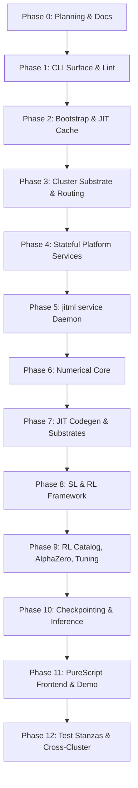

# jitML Development Plan

**Status**: Authoritative source
**Supersedes**: N/A
**Referenced by**: [../README.md](../README.md), [../AGENTS.md](../AGENTS.md),
[../CLAUDE.md](../CLAUDE.md), [../HASKELL_CLI_TOOL.md](../HASKELL_CLI_TOOL.md),
[development_plan_standards.md](development_plan_standards.md),
[00-overview.md](00-overview.md), [system-components.md](system-components.md),
[legacy-tracking-for-deletion.md](legacy-tracking-for-deletion.md),
[phase-0-planning-documentation.md](phase-0-planning-documentation.md),
[phase-1-haskell-cli-surface.md](phase-1-haskell-cli-surface.md),
[phase-2-bootstrap-reconciler-and-jit-cache.md](phase-2-bootstrap-reconciler-and-jit-cache.md),
[phase-3-cluster-substrate-and-routing.md](phase-3-cluster-substrate-and-routing.md),
[phase-4-stateful-platform-services.md](phase-4-stateful-platform-services.md),
[phase-5-jitml-service-daemon.md](phase-5-jitml-service-daemon.md),
[phase-6-numerical-core.md](phase-6-numerical-core.md),
[phase-7-jit-codegen-and-substrates.md](phase-7-jit-codegen-and-substrates.md),
[phase-8-supervised-and-rl-framework.md](phase-8-supervised-and-rl-framework.md),
[phase-9-rl-catalog-alphazero-and-tuning.md](phase-9-rl-catalog-alphazero-and-tuning.md),
[phase-10-checkpointing-and-inference.md](phase-10-checkpointing-and-inference.md),
[phase-11-purescript-frontend-and-demo.md](phase-11-purescript-frontend-and-demo.md),
[phase-12-test-stanzas-and-cross-cluster.md](phase-12-test-stanzas-and-cross-cluster.md),
[../documents/documentation_standards.md](../documents/documentation_standards.md)
**Generated sections**: none

> **Purpose**: Provide the single execution-ordered development plan for the jitML
> Haskell CLI, the three substrates (`apple-silicon`, `linux-cpu`, `linux-cuda`), the
> `jitml service` daemon, the SL/RL training stack including AlphaZero and
> hyperparameter tuning, the PureScript frontend, and the cross-cluster parity test
> surface — including phase status, validation gates, and cleanup ownership.

## Standards

See [development_plan_standards.md](development_plan_standards.md) for the
maintenance rules that govern this plan suite.

## Closure Status

Phase `0` (planning and documentation topology) is `✅ Done`: Sprint `0.1`
(canonical plan suite bootstrap) and Sprint `0.2` (doctrine-driven scheduling
audit) are both validated. Phase `1` (Haskell CLI surface) is `✅ Done`:
Sprints `1.1` through `1.9` have landed the CLI registry, generated docs, typed
subprocess/plan/prerequisite/env/error boundaries, style-tool bootstrap, and
`jitml check-code` gate. Phase `2` is `✅ Done`: Sprints `2.1` through `2.7`
have landed the stage-0 scripts, typed prerequisite DAG, JIT cache layer,
`docker/compose.yaml`, `docker/Dockerfile`, lazy Tart command surface, and
script-side `status`, `test`, `down`, `purge`, and `purge --full` wrappers.
Phases `3` through `12` are now `✅ Done` for their local typed renderer,
catalog, command, runtime-source, and Cabal-stanza surfaces. Live multi-service
Kind rollout remains covered by the cross-cluster validation narrative.

Source-code scaffolds, deterministic local test bodies, the external style-tool
gate, and Haskell-owned runtime JIT source generation have landed through Phase
`12`, but the overall handoff remains incomplete until the live cross-cluster
validation chain is exercised. Status remains scoped to each phase-owned local
surface per [development_plan_standards.md → C. Honest Completion
Tracking](development_plan_standards.md#c-honest-completion-tracking).

## Current Reality Boundary

Rows marked `✅ Done` for Phases `1` through `12` mean the
checked-in local renderer, catalog, command-summary, contract, or Cabal-stanza
surface exists and is testable in the current worktree. They do **not** mean the
live Kind/Helm stack, real Pulsar/MinIO event flow, real training kernels, real
HTTP serving, or cross-cluster substrate execution has been exercised end to
end. Those live behaviours remain part of the overall handoff gates called out
above.

## Document Index

| Document | Purpose |
|----------|---------|
| [development_plan_standards.md](development_plan_standards.md) | Conventions for maintaining the development plan |
| [00-overview.md](00-overview.md) | Vision, target outcome, doctrine scope, and hard constraints |
| [system-components.md](system-components.md) | Authoritative target component inventory for the jitML Haskell CLI, the three substrates, the daemon, the platform services, the training surfaces, and the test stanzas |
| [phase-0-planning-documentation.md](phase-0-planning-documentation.md) | Phase 0: Planning and documentation topology |
| [phase-1-haskell-cli-surface.md](phase-1-haskell-cli-surface.md) | Phase 1: Haskell CLI surface, `CommandSpec`, lint stack |
| [phase-2-bootstrap-reconciler-and-jit-cache.md](phase-2-bootstrap-reconciler-and-jit-cache.md) | Phase 2: Bootstrap reconciler, prerequisite DAG, JIT cache discipline, outer-container builds |
| [phase-3-cluster-substrate-and-routing.md](phase-3-cluster-substrate-and-routing.md) | Phase 3: Kind cluster substrate, Helm umbrella chart, Envoy Gateway, `Routes.hs` registry |
| [phase-4-stateful-platform-services.md](phase-4-stateful-platform-services.md) | Phase 4: Harbor, MinIO, Pulsar, PostgreSQL, observability stack |
| [phase-5-jitml-service-daemon.md](phase-5-jitml-service-daemon.md) | Phase 5: `jitml service` daemon (BootConfig/LiveConfig, hot reload, capability classes, at-least-once Pulsar consumer) |
| [phase-6-numerical-core.md](phase-6-numerical-core.md) | Phase 6: Layer catalog, real+complex activations, optimizers, schedulers, losses, Dhall types |
| [phase-7-jit-codegen-and-substrates.md](phase-7-jit-codegen-and-substrates.md) | Phase 7: Per-substrate JIT codegen (Metal, oneDNN, CUDA), content-addressed cache, hardware auto-tuning |
| [phase-8-supervised-and-rl-framework.md](phase-8-supervised-and-rl-framework.md) | Phase 8: Supervised learning loops, canonical SL problems, RL framework primitives |
| [phase-9-rl-catalog-alphazero-and-tuning.md](phase-9-rl-catalog-alphazero-and-tuning.md) | Phase 9: RL algorithm catalog, AlphaZero self-play, hyperparameter tuning |
| [phase-10-checkpointing-and-inference.md](phase-10-checkpointing-and-inference.md) | Phase 10: Split-blob checkpoint format, manifest, inference-only read path |
| [phase-11-purescript-frontend-and-demo.md](phase-11-purescript-frontend-and-demo.md) | Phase 11: PureScript frontend, generated browser contracts, demo HTTP server, Playwright E2E |
| [phase-12-test-stanzas-and-cross-cluster.md](phase-12-test-stanzas-and-cross-cluster.md) | Phase 12: Ten Cabal test stanzas, lint matrix, Pulumi-orchestrated cross-cluster parity, report-card knobs |
| [legacy-tracking-for-deletion.md](legacy-tracking-for-deletion.md) | Cleanup ledger |

## Status Vocabulary

| Status | Meaning | Emoji |
|--------|---------|-------|
| **Done** | Deliverables implemented for the sprint-owned surface, validated, and aligned in docs | ✅ |
| **Active** | Work has started and remaining implementation or documentation work is explicitly listed | 🔄 |
| **Planned** | Ready to start once execution reaches the sprint in sequence | 📋 |
| **Blocked** | Closure depends on an unmet prerequisite or prior sprint closure | ⏸️ |

## Definition of Done

A sprint can move to `Done` only when all of the following are true:

1. Its deliverables are implemented in the worktree.
2. Its validation commands pass through the canonical `jitml` surface (or, for Phase
   `0`, through the manual lint and grep audits named in this plan until Phase `1`
   lands the `jitml check-code` command).
3. The docs listed in `Docs to update` are aligned with the implemented behavior.
4. Sprint-owned cleanup or stand-in entries are reflected in
   [legacy-tracking-for-deletion.md](legacy-tracking-for-deletion.md).
5. No sprint-owned blocker or remaining work survives.
6. The doctrine sections the sprint adopts (when any) are cited by name in the
   `Deliverables` block per standards rule L.

## Phase Overview

| Phase | Name | Status | Document |
|-------|------|--------|----------|
| 0 | Planning and Documentation Topology | ✅ Done | [phase-0-planning-documentation.md](phase-0-planning-documentation.md) |
| 1 | Haskell CLI Surface, `CommandSpec`, Lint Stack | ✅ Done | [phase-1-haskell-cli-surface.md](phase-1-haskell-cli-surface.md) |
| 2 | Bootstrap Reconciler, Prerequisite DAG, JIT Cache | ✅ Done (Sprints 2.1–2.7 ✅) | [phase-2-bootstrap-reconciler-and-jit-cache.md](phase-2-bootstrap-reconciler-and-jit-cache.md) |
| 3 | Cluster Substrate and Routing | ✅ Done (local renderer/materialization surface) | [phase-3-cluster-substrate-and-routing.md](phase-3-cluster-substrate-and-routing.md) |
| 4 | Stateful Platform Services | ✅ Done (local chart/service registry surface) | [phase-4-stateful-platform-services.md](phase-4-stateful-platform-services.md) |
| 5 | `jitml service` Daemon | ✅ Done (local daemon/config/lifecycle surface) | [phase-5-jitml-service-daemon.md](phase-5-jitml-service-daemon.md) |
| 6 | Numerical Core | ✅ Done | [phase-6-numerical-core.md](phase-6-numerical-core.md) |
| 7 | JIT Codegen and Per-Substrate Execution | ✅ Done | [phase-7-jit-codegen-and-substrates.md](phase-7-jit-codegen-and-substrates.md) |
| 8 | Supervised Learning and RL Framework | ✅ Done (local deterministic workload surface) | [phase-8-supervised-and-rl-framework.md](phase-8-supervised-and-rl-framework.md) |
| 9 | RL Algorithm Catalog, AlphaZero, and Hyperparameter Tuning | ✅ Done (local deterministic catalog surface) | [phase-9-rl-catalog-alphazero-and-tuning.md](phase-9-rl-catalog-alphazero-and-tuning.md) |
| 10 | Checkpointing and Inference-Only Read Path | ✅ Done (local format/read-path surface) | [phase-10-checkpointing-and-inference.md](phase-10-checkpointing-and-inference.md) |
| 11 | PureScript Frontend and Demo | ✅ Done (local contract/demo scaffold surface) | [phase-11-purescript-frontend-and-demo.md](phase-11-purescript-frontend-and-demo.md) |
| 12 | Test Stanzas, Lint Matrix, Cross-Cluster Parity | ✅ Done (local Cabal stanza/report-card surface) | [phase-12-test-stanzas-and-cross-cluster.md](phase-12-test-stanzas-and-cross-cluster.md) |

## Current Plan Status

Phase `1` is now done. Sprint `1.1` has landed the Cabal package,
`cabal.project`, `app/Main.hs`, `app/Demo.hs`, `src/JitML/App.hs`, ignore files,
and the ten Cabal test-suite stanzas that Phase `12` now expands with
dedicated deterministic bodies. Sprint `1.2` has landed the
registry-backed CLI parser, command tree, JSON schema, focused help renderer, and
`jitml-unit` parser/registry tests. Sprint `1.3` has landed `jitml docs check`,
`jitml docs generate`, generated README marker regions, `documents/cli/commands.md`,
`share/man/man1/jitml.1`, and bash/zsh/fish completion scripts. Sprint `1.4`
has landed `fourmolu.yaml`, `.hlint.yaml`, the in-repo lint stack, isolated
style-tool bootstrap under `.build/jitml-style-tools/`, external Fourmolu /
HLint / `cabal format` runners through typed `Subprocess`, chart-shape checks,
`jitml lint`, `jitml check-code`, the warning-clean build gate, and the
`jitml-haskell-style` stanza. Sprint `1.5` is now done with
`src/JitML/Plan/{Plan,Apply,Render}.hs`,
`--dry-run`, `--plan-file`, and unit coverage. Sprint `1.6` is now done with
`src/JitML/Sub/{Subprocess,Render,Stream}.hs`, unit
render goldens, subprocess lint enforcement, and an integration subprocess
fixture. Sprint `1.7` is now done with `src/JitML/Prerequisite/{Registry,Reconcile}.hs`,
`internal list-prereqs`, and prerequisite unit coverage. Sprint `1.8` is now done
with `src/JitML/Env/{Env,Build}.hs`, the `ReaderT Env IO` alias, default/env/CLI
directory resolution, and unit coverage. Sprint `1.9` is now done with
`src/JitML/AppError/{AppError,Render}.hs`, `src/JitML/CLI/Output.hs`, the
17-variant `AppError` golden, global format/color flag parsing, JSON/plain
command output, and structured error rendering for Phase `1` non-zero paths.
Sprint `2.1` is now done with the registered
`jitml bootstrap --apple-silicon|--linux-cpu|--linux-cuda` parser/docs surface,
the rewritten stage-0 scripts, script tests, and Apple lifecycle validation.
Apple stage-0 verifies only macOS/Apple Silicon, Xcode Command Line Tools, and
Homebrew, then builds `./.build/jitml` and delegates to
`jitml bootstrap --apple-silicon`; Linux stage-0 verifies Docker without `sudo`
plus CUDA runtime/device capability for the CUDA substrate, then delegates
through `docker compose run --rm jitml jitml bootstrap --linux-cpu|--linux-cuda`.
Sprint `2.2` is now done with prerequisite node modules, scoped `jitml doctor`
reconciliation, typed Homebrew remediation plans, effectful remediation apply
with postcondition validation, `jitml doctor --remediate`, the lazy `tart`
cache-miss root, and positive toolchain validation on this Apple Silicon host.
Sprint `2.3` is now done with `src/JitML/Cache/{Key,Layout,Manifest,Symlink}.hs`,
the SHA-256 cache-key golden, typed `./.build/jit/<substrate>/<hash>.<ext>`
layout, atomic `manifest.json` writes, and Apple stable-FFI symlink repointing.
Sprints `2.4` through `2.7` are now done with `docker/Dockerfile`,
`docker/compose.yaml`, the `jitml:local` one-service Compose shape,
`JitML.Bootstrap`, `JitML.Tart.{Lifecycle,Exec}`, `jitml build`,
`jitml internal vm exec`, and script-side `status`, `test`, `down`, `purge`,
and `purge --full` wrappers. The worktree now includes the first `chart/`,
`kind/`, `docker/`, `web/`, `infra/`, `proto/`, documentation-only
`codegen-cuda/`, `codegen-metal/`, `codegen-onednn/`, and `experiments/`
surfaces. Sprint `7.7` is now done with Haskell-rendered source emitted on
demand into `./.build/jit-src/<substrate>/<hash>/` and static JIT source/build
artefacts removed from the checked-in `codegen-*` build path. Phases `3`
through `12` now own their local renderer, catalog, command, runtime-source,
and test-stanza surfaces; live multi-service rollout remains an explicit
validation follow-up.

The implemented local end state is:

- `app/Main.hs` (six-line shim into `App.main`) and `app/Demo.hs` (six-line shim for
  `jitml-demo`) plus the library-first `src/JitML/` source tree owning the CLI, the
  daemon, the cluster lifecycle, the SL/RL/AlphaZero/tuning logic, the per-substrate
  engines, the observability surfaces, and the browser-contract source.
- Three substrate bootstrap scripts (`bootstrap/{apple-silicon,linux-cpu,linux-cuda}.sh`)
  that perform only stage-0 host gates and delegate to the Haskell
  `jitml bootstrap --apple-silicon|--linux-cpu|--linux-cuda` reconciler, plus
  the typed prerequisite DAG that performs lazy package validation/remediation.
- A single Dockerfile (`docker/Dockerfile`) producing one image (`jitml:local`) and a
  one-service `docker/compose.yaml` (service: `jitml`); substrate is a runtime Dhall
  choice, never an image-name dimension.
- The umbrella Helm chart at `chart/` with subchart dependencies for Harbor, Apache
  Pulsar, MinIO, Percona PostgreSQL, Envoy Gateway, and kube-prometheus-stack,
  plus typed local renderers for the TensorBoard, observability, route, storage,
  service, and demo chart surfaces. The current command path materializes chart
  and Kind inputs; live deployment remains an overall validation gate.
- The single `127.0.0.1:<edge-port>` Envoy Gateway socket as the only exposed
  listener; the typed route registry in `src/JitML/Routes.hs` as the source of truth
  for every HTTPRoute manifest.
- The `jitml service` command renders the daemon lifecycle, Dhall `BootConfig` /
  `LiveConfig`, endpoint responses, structured JSON log shape, at-least-once
  deduplication helper, and typed retry policy. The current binary does not run
  a real long-lived HTTP/Pulsar daemon.
- The current numerical core is a local Haskell catalog for layers,
  real/complex activation names, optimizers, schedulers, losses, and spectral
  ops. Dhall mirrors for every constructor remain target work.
- The current JIT engine surface is `src/JitML/Engines/Engine.hs` plus
  `src/JitML/Codegen/{RuntimeSource,Cuda,OneDnn,Metal,SourceFile}.hs`, which
  map each substrate to a backend name, artifact extension, determinism flags,
  generated runtime source bundle, generated-source cache-key payload, and
  typed compiler `Subprocess` plan. Checked-in `codegen-*` directories contain
  documentation only.
- The current SL/RL workload surface is deterministic local catalog and summary
  code: canonical SL problem summaries, RL algorithm catalog rows, deterministic
  trajectory generation, AlphaZero Connect 4 transcript helpers, and tuning trial
  sequences. Real daemon-backed training loops, environment stepping, replay
  buffers, MinIO transcript persistence, and Pulsar event publication remain
  target runtime work.
- The current checkpoint surface is a small typed manifest, a simplified `.jmw1`
  text encoder, manifest pointer rendering, and deterministic inference summary.
  Full MinIO write-once/CAS pointer logic and real kernel-handle loading remain
  target runtime work.
- The current PureScript/frontend surface is a minimal PureScript entrypoint,
  generated contract file, typed bundle/panel manifest, Playwright scaffold,
  chart deployment template, and `jitml-demo` executable shim that prints a
  status line. There is no checked-in Halogen dependency, compiled browser
  bundle, or real HTTP server yet.
- Ten Cabal test-suite stanzas (`jitml-unit`, `jitml-integration`,
  `jitml-sl-canonicals`, `jitml-rl-canonicals`, `jitml-hyperparameter`,
  `jitml-cross-backend`, `jitml-daemon-lifecycle`, `jitml-e2e`,
  `jitml-haskell-style`, `jitml-purescript-style`) with local deterministic
  bodies. `jitml test all --dry-run` renders the aggregate plan and non-dry-run
  `jitml test all` / `jitml test <stanza>` invokes Cabal through the typed
  `Subprocess` boundary before emitting the report-card summary.
  The Pulumi program at `infra/pulumi/` exports stack metadata only, not a live
  ephemeral Kind orchestrator.

No reopened local sprints remain. Live cross-cluster rollout remains the
outstanding validation gate for the overall handoff, not an unowned plan
surface.

## Sprint Dependencies

The substrate buildout (Phases `1`–`5`) precedes any ML code so that the typed
`Subprocess`, `Plan`/`apply`, prerequisite DAG, capability-class, and at-least-once
event-processing patterns are in place before SL/RL workloads consume them. Phase `6`
(numerical core) precedes Phase `7` (JIT codegen) so the type-level layer and
optimizer catalogs are fixed before per-substrate compilers consume them. Phase `8`
owns the SL stack and the RL *framework*; Phase `9` builds on those primitives to
deliver the algorithm catalog, AlphaZero, and tuning. Phase `10` (checkpoints +
inference-only read path) precedes Phase `11` (frontend) because the frontend's REST
surfaces consume the inference-only path. Phase `12` owns testing horizontally,
gating the overall closure on the cross-substrate `jitml-cross-backend` stanza.

## Exit Definition

This plan is complete only when all of the following are true:

1. The repository holds three substrate-specific JIT source renderers behind one
   `jitml` Haskell binary built by Cabal under GHC `9.14.1` and Cabal `3.16.1.0`:
   `apple-silicon` via generated Metal / Swift sources, `linux-cpu` via
   generated oneDNN C++ sources, and `linux-cuda` via generated CUDA sources.
2. `jitml service` is the canonical long-running daemon, parameterised by Dhall
   `BootConfig` / `LiveConfig`, hot-reloadable via SIGHUP, exposing `/healthz`,
   `/readyz`, and `/metrics`, emitting structured JSON logs on stderr, processing
   Pulsar events at-least-once with the typed retry policy.
3. `jitml bootstrap --apple-silicon|--linux-cpu|--linux-cuda` deploys the
   umbrella Helm chart against the per-substrate Kind cluster shape with no
   kubeconfig pollution (`~/.kube/config` untouched), brings Harbor up before
   later image rollouts, exposes exactly one `127.0.0.1:<edge-port>` Envoy
   Gateway socket, and routes every HTTPRoute through the `src/JitML/Routes.hs`
   registry.
4. The bootstrap script for each substrate is a stage-0 entrypoint: Apple checks
   macOS/arm64, Xcode Command Line Tools, and Homebrew before building
   `./.build/jitml`; Linux checks Docker without `sudo`, with CUDA additionally
   checking NVIDIA runtime and compute capability. All package reconciliation
   after stage-0 is owned by the typed Haskell prerequisite DAG; failure emits
   `AppError PrerequisiteUnmet` carrying the failing `nodeId`, description, and
   remedy hint.
5. The numerical core (layer catalog, real+complex activations, optimizers,
   schedulers, losses, spectral ops) is exposed in Dhall, the Haskell-owned JIT
   source renderers are content-addressed by `(model shape, kind, substrate,
   toolchain)`, no static JIT source/build files are checked in, and the
   per-substrate determinism contract from
   [../documents/engineering/determinism_contract.md](../documents/engineering/determinism_contract.md)
   holds.
6. `jitml train`, `jitml rl train`, and `jitml tune` Plan/Apply commands run the
   full SL/RL/AlphaZero workloads, hyperparameter tuning is `Some Tuning::{ … }`-shaped per the worked
   Dhall example in [../README.md → Concrete Dhall worked
   example](../README.md), and golden tests for SL convergence and RL trajectories
   pass under `jitml test all`.
7. Checkpoints write the split-blob `.jmw1` format with the typed manifest and the
   inference-only read path; the bit-determinism contract holds within the per-
   substrate ULP tolerance methodology.
8. The PureScript frontend under `web/` is generated from
   `src/JitML/Web/Contracts.hs` via `purescript-bridge`, the live MNIST handwriting
   panel, CIFAR/ImageNet upload panel, and the AlphaZero-vs-human Connect 4 panel
   are exercised end-to-end by Playwright, and `jitml-demo` serves the bundle.
9. `jitml test all` runs every Cabal test-suite stanza (`jitml-unit`,
   `jitml-integration`, `jitml-sl-canonicals`, `jitml-rl-canonicals`,
   `jitml-hyperparameter`, `jitml-cross-backend`, `jitml-daemon-lifecycle`,
   `jitml-e2e`, `jitml-haskell-style`, `jitml-purescript-style`) with the
   report-card knobs pinned in `cabal.project`; the `jitml-e2e` stanza
   orchestrates an ephemeral Kind stack via the `infra/pulumi/` TypeScript
   program.
10. The toolchain is pinned at GHC `9.14.1` and Cabal `3.16.1.0`. `jitml.cabal`
    declares `tested-with: ghc ==9.14.1` and `cabal.project` declares
    `with-compiler: ghc-9.14.1`.
11. Every Plan/Apply command (`jitml bootstrap`, `jitml train`, `jitml tune`,
    `jitml rl train`, `jitml cluster up`, `jitml test all`, `jitml service`
    startup-as-plan, `jitml internal gc`) supports `--dry-run` and
    `--plan-file <path>`.
12. `Subprocess` is the only IO boundary for subprocess execution; `kubectl`,
    `helm`, `kind`, `docker`, and the per-substrate kernel compilers
    (`metal`, `nvcc`, `g++` over oneDNN) are wrapped through the typed boundary.
13. One `prerequisiteRegistry` spans every substrate's toolchain, the cluster
    lifecycle, the platform services, and the daemon's startup contract.
14. Single `AppError` ADT with `renderError :: AppError -> Text` as the only Text
    rendering at the CLI boundary; the canonical `AppError` variants are enumerated
    in [system-components.md → CLI Doctrine
    Components](system-components.md#cli-doctrine-components) and instantiated by
    Sprint `1.9`.
15. `fourmolu.yaml` at repo root pins the twelve doctrine-mandated settings; the
    `jitml-haskell-style` stanza enforces them plus the `cabal format` temp-file
    round-trip byte-equality check, and `jitml-purescript-style` extends the lint
    surface to PureScript `purs format` round-trip and `purescript-spec` smoke
    tests.
16. `CommandSpec` is the implementation source for the parser, the command tree
    (`jitml commands --tree`), the JSON command schema (`jitml commands --json`),
    the markdown command reference, the manpages, and the shell completion scripts.
17. The route registry `src/JitML/Routes.hs` is the source of truth for every
    HTTPRoute resource emitted by the umbrella chart's renderer.
18. [legacy-tracking-for-deletion.md](legacy-tracking-for-deletion.md) contains no
    unresolved cleanup once Phase `12` closes.

## Related Documents

- [00-overview.md](00-overview.md)
- [development_plan_standards.md](development_plan_standards.md)
- [system-components.md](system-components.md)
- [legacy-tracking-for-deletion.md](legacy-tracking-for-deletion.md)
- [../HASKELL_CLI_TOOL.md](../HASKELL_CLI_TOOL.md)
- [../documents/documentation_standards.md](../documents/documentation_standards.md)
