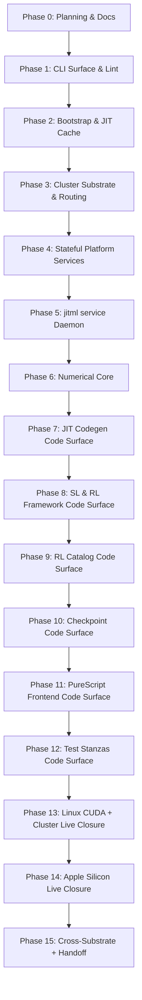

# jitML Development Plan

**Status**: Authoritative source
**Supersedes**: N/A
**Referenced by**: [../README.md](../README.md), [../AGENTS.md](../AGENTS.md),
[../CLAUDE.md](../CLAUDE.md), [../README.md](../README.md),
[development_plan_standards.md](development_plan_standards.md),
[00-overview.md](00-overview.md), [system-components.md](system-components.md),
[legacy-tracking-for-deletion.md](legacy-tracking-for-deletion.md),
[phase-0-planning-documentation.md](phase-0-planning-documentation.md),
[phase-1-haskell-cli-surface.md](phase-1-haskell-cli-surface.md),
[phase-2-bootstrap-reconciler-and-jit-cache.md](phase-2-bootstrap-reconciler-and-jit-cache.md),
[phase-3-cluster-substrate-and-routing.md](phase-3-cluster-substrate-and-routing.md),
[phase-4-stateful-platform-services.md](phase-4-stateful-platform-services.md),
[phase-5-jitml-service-daemon.md](phase-5-jitml-service-daemon.md),
[phase-6-numerical-core.md](phase-6-numerical-core.md),
[phase-7-jit-codegen-and-substrates.md](phase-7-jit-codegen-and-substrates.md),
[phase-8-supervised-and-rl-framework.md](phase-8-supervised-and-rl-framework.md),
[phase-9-rl-catalog-alphazero-and-tuning.md](phase-9-rl-catalog-alphazero-and-tuning.md),
[phase-10-checkpointing-and-inference.md](phase-10-checkpointing-and-inference.md),
[phase-11-purescript-frontend-and-demo.md](phase-11-purescript-frontend-and-demo.md),
[phase-12-test-stanzas-and-cross-cluster.md](phase-12-test-stanzas-and-cross-cluster.md),
[phase-13-linux-cuda-and-cluster-closure.md](phase-13-linux-cuda-and-cluster-closure.md),
[phase-14-apple-silicon-closure.md](phase-14-apple-silicon-closure.md),
[phase-15-cross-substrate-and-handoff.md](phase-15-cross-substrate-and-handoff.md),
[../documents/documentation_standards.md](../documents/documentation_standards.md)
**Generated sections**: none

> **Purpose**: Provide the single execution-ordered development plan for the jitML
> Haskell CLI, the three substrates (`apple-silicon`, `linux-cpu`, `linux-cuda`), the
> `jitml service` daemon, the SL/RL training stack including AlphaZero and
> hyperparameter tuning, the PureScript frontend, and the cross-cluster parity test
> surface — including phase status, validation gates, and cleanup ownership.

## Standards

See [development_plan_standards.md](development_plan_standards.md) for the
maintenance rules that govern this plan suite.

## Closure Status

**Reopen note (2026-05-30, re-closed 2026-05-31)**: Phases `2`, `5`, and `7` were
reopened `🔄 Active` for the headless Apple Metal JIT workstream (runtime
`MTLDevice.makeLibrary(source:)` + host CommandLineTools `swift build`, retiring
the Tart VM that cannot run headless) and are now **re-closed `✅ Done`** — the new
sprints all landed and validated: `7.8` (runtime-`makeLibrary` codegen + host
`swift build`), `2.10` (retire `container.tart` / `jitml internal vm` / the Tart
modules), and `5.8` (remove `LiveConfig.tartIdleTimeout`), with the `jitml:local`
image `check-code` gate and the unit / daemon-lifecycle suites green. Where the
historical narrative below describes the Apple build as Tart-VM-based, the
authoritative current status is the headless path (host `swift build` + runtime
`makeLibrary`, no Tart, no full Xcode).

**Refactor note (2026-05-24)**: The plan now batches every live-runtime
obligation by machine-affinity into Phases `13` (Linux/CUDA + Kind
cluster + broker + browser), `14` (Apple Silicon + headless Metal), and
`15` (cross-substrate parity + populated report card + empty legacy
ledger). Phases `7`–`12` keep their original topical ownership but are
now scoped to code-surface obligations only; every live-runtime bullet
in each of their `### Remaining Work` blocks names the new owning sprint
in Phase `13`/`14`/`15`. The intent is strict ordered closure: each
phase closes on its own machine session before the next one begins. No
obligation was dropped; the mapping is enumerated in each sprint's
re-scoped `### Remaining Work` block.

**Reopen note (2026-06-04)**: Phases `1` and `8` reopened narrowly for the two
remaining Phase `15` final-handoff blockers. Phase `1` Sprint `1.10` owns
retiring the scoped `allow-newer` block after upstream Dhall / CBOR bounds solve
under GHC `9.14.1` / `base-4.22`. Phase `8` Sprint `8.8` owns replacing the
deterministic atari-subset RAM-state stub with a source-built ALE adapter plus
explicit uncommitted ROM handling. Their original code-surface obligations
remain closed; the reopened sprints are tracked in
[legacy-tracking-for-deletion.md](legacy-tracking-for-deletion.md#pending-removal)
and gate Phase `15` Sprint `15.3`.

The plan is mid-build. Phases `0` (planning and documentation topology), `2`
(bootstrap reconciler, prerequisite DAG, JIT cache, outer-container builds), `3`
(cluster substrate and routing), `4` (stateful platform services), `5`
(`jitml service` daemon), `6` (numerical core), `7` (JIT codegen and
per-substrate execution), `9` (RL algorithm catalog, AlphaZero, and
hyperparameter tuning), `10` (checkpointing and inference-only read path), `11`
(PureScript frontend and demo), `12` (test stanzas, lint matrix, cross-cluster
parity), `13` (Linux CUDA and cluster closure), and `14` (Apple Silicon
closure) are `✅ Done` — every Exit Definition obligation those phases own is
met in the worktree and validated by their sprints' `### Validation` blocks.
Phases `1`, `8`, and `15` are open only for the two ledger-backed handoff
blockers described above and the final empty-ledger gate. Sprint `1.4` now owns the
container-exclusive code-quality rule: `jitml:local` image construction
installs the separate style GHC/tools and runs `jitml check-code`; host
lint/check-code execution is unsupported and no host style-tool override exists.
Phase `4` Sprint `4.7` closed on 2026-05-23 against a Linux CUDA validation
host (NVIDIA GeForce RTX 5090, CUDA 12.8, compute capability `12.0`): the
single-node `kind/cluster-linux-cuda.yaml` brings up
`jitml-linux-cuda-control-plane` with the GPU node label, the containerd
`nvidia` runtime handler, the read-only `/run/nvidia/driver` mount, and the
repo-owned NVIDIA runtime config; `RuntimeClass/nvidia` applies; the
`nvidia-smi-probe` pod reaches `Succeeded` and `kubectl logs nvidia-smi-probe`
reports the RTX 5090. Phase `5` Sprint `5.6`'s CUDA service-pod and Linux CPU replacement-rollout
portions both closed on 2026-05-23. CUDA: the rendered
`chart/local/jitml-service` chart with `substrate=linux-cuda` rolls out the
actual `Deployment/jitml-service` to `Running` on
`jitml-linux-cuda-control-plane` with `runtimeClassName: nvidia`, both NVIDIA
env vars, and required pod anti-affinity; `nvidia-smi -L` inside the service
container reports the RTX 5090. Linux CPU: the full
`jitml bootstrap --linux-cpu` rollout completes all seven platform components
ready on `edge_port: 9091`; `kubectl rollout restart deployment/jitml-service`
replaces the pod without ever holding two concurrent replicas (no surge pod
under `maxSurge: 0` / `maxUnavailable: 1` with required hostname
anti-affinity); the new pod acquires
`persistent://public/default/training.command.linux-cpu` as `jitml-service`,
`/healthz` returns `ok`, `/readyz` returns `ready`, and `/metrics` serves the
Prometheus surface. Apple Silicon: `./bootstrap/apple-silicon.sh up` completes
the 110-step live rollout with all seven publication components ready on
`edge_port: 9090`, and the host-native
`./.build/jitml service --config ./.build/conf/host/apple-silicon.dhall --consume-once 0`
run derives the routed `/pulsar/ws`, `/minio/s3`, Harbor, and repo-local
kubeconfig settings, passes read-only client probes, and acquires
`persistent://public/default/inference.command.apple-silicon` as `jitml-host`.
Phases `8`, `9`, `10`, `11`, and `12` all closed on 2026-05-25 after
every owned code-surface obligation landed; their live obligations
migrated to Phases `13` / `14` / `15` per
[Execution Roadmap](#execution-roadmap). Phase `8` Sprint `8.3`'s
original simulator work closed through pure-Haskell ports rather than
Box2D / ALE FFI; the 2026-06-04 reopen adds Sprint `8.8` solely to replace
the deterministic `atari-subset` stand-in with real ALE once the source-built
binding and ROM policy are in place. The current baseline also includes the family-aware JIT
codegen surface
(`JitML.Codegen.KernelFamily`), the per-substrate knob spaces
and deterministic benchmark candidate plans plus measured-result selection,
generic measurement collection, guarded CUDA/Metal benchmark runner preflight
boundaries, selected-choice persistence, and persisted-choice cache-key
derivation
(`JitML.Engines.{Tuning,TuningBenchmark,TuningStore,TuningCache}`), the
14 RL algorithm modules under `JitML.RL.Algorithms.*`, the AlphaZero MCTS /
SelfPlay / Arena substack, the four-game `PerfectInformation` typeclass, the
typed proto envelopes under `JitML.Proto.{Training,Rl,Tune}` with deterministic
text command parsers for the training, RL, and tuning command envelopes,
proto3-compatible byte codecs for the current Training/RL/Tune command and
event envelopes via `JitML.Proto.Wire`, plus
`proto/jitml/inference.proto` and
`JitML.Proto.Inference` byte codecs for `RunInference` / `InferenceResult`,
`JitML.Service.AppleInferenceRpc` planning and correlating Apple-only
host↔cluster command/event envelopes,
the typed daemon capability
surface with full `HasMinIO` / `HasPulsar` / `HasHarbor` / `HasKubectl`
methods + per-domain `HandlerRouter` + filesystem-backed `HasMinIO`
instance (`JitML.Service.FilesystemMinIO`) + subprocess-backed
`HasMinIO` / `HasPulsar` / `HasHarbor` / `HasKubectl` instances
(`JitML.Service.MinIOSubprocess`, `JitML.Service.HarborSubprocess`,
`JitML.Service.PulsarWebSocketSubprocess`,
`JitML.Service.KubectlSubprocess`), plus
`JitML.Service.Clients` deriving daemon-owned MinIO, Pulsar WebSocket,
Harbor, and kubectl settings from the loaded `BootConfig` and exposing the
combined `DaemonServiceClient` interpreter for those four capability classes,
`JitML.Service.Runtime.daemonWorkloadDispatcher` mapping parsed
Training/RL/Tune command envelopes into Kubernetes Job apply/delete workload
effects before ack, `jitml service --consume-once <n>` draining a bounded
daemon consumer batch through those same BootConfig-derived client settings,
with explicit Harbor settings, live routed MinIO conditional-write validation,
routed Pulsar WebSocket publish/consume validation, and stdin-piped YAML
`kubectlApply` validated against a live Kind cluster,
the typed Consumer IO loop
(`JitML.Service.Consumer.{consumerStep,runConsumerLoop,ConsumerOutcome}`)
exercising HasPulsar subscribe/consume/ack + per-domain dedup against
a synthetic broker in `jitml-daemon-lifecycle`, plus
`daemonSubscriptionsForBootConfig` / `subscribeDaemonTopics` deriving the
cluster and Apple-host subscription plan from `BootConfig` and accepting live
`persistent://public/default/...` broker topic names, with `DaemonRuntime`
rendering that plan under `pulsar_subscriptions` and startup acquisition under
`pulsar_subscription_status` after the routed WebSocket subscribe probe,
bounded acquired-subscription batching via
`JitML.Service.Runtime.daemonConsumerBatch`, post-dispatch WebSocket ack
command rendering plus the held-open worker surface in
`JitML.Service.PulsarWebSocketSubprocess`, normal `jitml service` startup
creating per-acquired-subscription held-open workers with one shared
process-lifetime handler router, 2026-05-21 live
service-pod `--consume-once` validation dispatching Training/RL/Tune/Inference
messages before ack, applying Training/RL/Tune Jobs, routing
`WriteCheckpointBlob` workload effects into MinIO,
`PromoteWorkloadImage` workload effects into Harbor same-repository tag
promotion, and handling `RunInference` through MinIO checkpoint reads plus
Pulsar `InferenceResult` publication, 2026-05-21 live normal-service
held-open-worker validation handling `RunInference` and publishing
`InferenceResult` without `--consume-once`, 2026-05-21 live duplicate-payload
validation through that held-open worker path producing exactly one matching
`InferenceResult`, 2026-05-21 live dispatch-failure validation publishing a
`RunInference` request before its checkpoint exists, observing zero results
before seeding, then receiving the redelivered `InferenceResult` after the
daemon negative-acks the failed delivery, the
LiveConfig-derived dedup cache size used by the handler router, the
typed phased Helm rollout
(`JitML.Cluster.Helm.helmPhasedRolloutPlan`) plus
`pulsarTopicCreateSubprocesses` registering the same 29-topic
substrate-scoped Pulsar family (8 product topics × 3 substrates + 2
apple-only internal + 3 `gc.event.<substrate>` topics added in
Sprint 13.7) and actually invoked through
`JitML.Bootstrap.liveExecutePhasedRollout` from
`jitml bootstrap --<substrate>`,
the service-Postgres registry lint wired into `JitML.Lint.Chart` plus the
live-validated `harbor-pg` Percona cluster readiness path and the checked-in
Harbor direct values file that points at `harbor-pg-pgbouncer.platform.svc`
plus the MinIO `harbor-registry` S3 backend after pre-Harbor readiness waits,
with 2026-05-19 live validation proving Harbor starts against the external
database and writes registry objects into that MinIO S3 backend, plus
2026-05-19 live validation proving routed `HasMinIO` `If-None-Match` /
`If-Match` conflicts map to `SEConflict` through `/minio/s3`, plus
2026-05-19 live validation proving `/pulsar/ws` targets the broker-embedded
WebSocket service and `JitML.Service.PulsarWebSocketSubprocess` publishes and
consumes through the edge, plus 2026-05-20 live validation proving the then-current
26-topic substrate-scoped Pulsar family was registered and routed
publish/consume worked on `training.command.linux-cpu` from
`jitml:local` (the family grew to 29 topics on 2026-05-26 when
Sprint 13.7 added `gc.event.<substrate>`), plus the current
single-node Linux CUDA Kind config wiring the node-local containerd `nvidia`
runtime handler and `RuntimeClass/nvidia` selector; the 2026-05-23 live CUDA
`nvidia-smi -L` probe on a GPU validation host (RTX 5090, CUDA 12.8)
exercises the full handler / mount / RuntimeClass chain on
`jitml-linux-cuda-control-plane`, plus the 2026-05-23 Phase `5` Sprint `5.6`
Linux CPU, Linux CUDA service-pod, and Apple Silicon host-Dhall validations, plus
the optimizer/RNG/metric/parent-lineage CheckpointManifest shape
with typed `AdvancePredicate` and `RetentionPolicy` +
`JitML.App.runInternalGc` reconciler exiting `3` on no-op +
`JitML.App.runInspectReplay` for `jitml inspect replay
<manifest-sha>`, the TFRecord wire format with Castagnoli CRC32C
(`JitML.Observability.TensorBoard.{encodeTfRecord,crc32cCastagnoli,maskedCrc32c}`)
validated against canonical CRC vectors, the TensorBoard scalar-event codec
(`JitML.Proto.TensorBoard.encodeTensorBoardEventProto`), the write-once shard
writer (`JitML.Observability.TensorBoard.writeTensorBoardEvent`), and live
routed TensorBoard scalar readback from a Haskell-written shard, the AVX2 /
AVX-512 CPU
detection (`JitML.Engines.CpuFeatures`) probing the host through the
typed `Subprocess` boundary, the typed oneDNN runtime/link probe
(`JitML.Engines.OneDnnRuntime`) for `pkg-config` metadata, readable oneDNN
headers, and dynamic-linker `libdnnl` visibility, the typed CUDA runtime/link probe and host reduction
partial finalizer (`JitML.Engines.CudaRuntime`) for `nvcc`, `nvidia-smi`,
`libcuda`, `libcublas`, `libcudnn`, and canonical reduction partial
accumulation, the generated CUDA host-callable `jitml_kernel` wrapper and
guarded CUDA local runner (`JitML.Engines.CudaLocal`) that fails closed before
compile when the probe is unavailable, the typed Metal runtime probe
(`JitML.Engines.MetalRuntime`) for
Swift, `xcrun`, and Metal device visibility, the MCTS transposition table
(`JitML.RL.AlphaZero.Mcts.{TranspositionTable,runSearchWithTable}`)
deduplicating equivalent search subtrees, per-game AlphaZero
self-play determinism (`JitML.RL.AlphaZero.selfPlayTranscriptFor`)
asserted by `jitml-rl-canonicals` as run-to-run equality on the same
substrate and seed plus rule-conformance properties (no per-game
transcript files are committed — visit counts depend on substrate
float behavior; see [README.md → Snapshot
targets → Numerical-fixture prohibition](../README.md#snapshot-targets)), the SelfPlayBuffer round-trip through the
filesystem-backed `HasMinIO` instance, the shared `JitML.Engines.Loader`
cache artifact boundary used by the local Linux CPU runner, the same-host
bit-equality of the linux-cpu identity kernel across three successive FFI runs
plus the linux-cpu libdnnl-linked oneDNN reduction, matmul, convolution,
normalization, attention, and embedding primitive paths, and local Linux CPU
`HasEngine` dispatch validated by `jitml-cross-backend`
including exported `jitml_kernel_family_name` and
`jitml_kernel_output_count` metadata, the Dhall
numerics schema decode
that round-trips the full Haskell catalog
(`JitML.Numerics.Schema.loadNumericsCatalog`), the generated
TensorBoard Service renderer
(`JitML.Observability.TensorBoard.renderTensorBoardService`) plus the
checked-in `chart/local/tensorboard/templates/service.yaml`, the six
PureScript panel payload modules under `web/src/Panels/`, the seven-test
live-only Playwright matrix represented in `JitML.Test.LivePlan` and
validated through the live edge route, the `spago test` and
`purs-tidy check` command shapes represented from `jitml lint purescript`
through typed `Subprocess` values, the demo route logic that serves
`web/dist/Main/bundle.js` when the PureScript/esbuild build has
produced it, the real-binary `./.build/jitml` spawn matrix
(`--help`, `bootstrap --linux-cpu --dry-run`, `cluster up --substrate
linux-cpu --dry-run`, `internal gc <hash>` exiting `3`) through the
typed boundary in a temp workdir covered by `jitml-integration`, the
spin-up path through `kindCreateSubprocess` that creates/exports Kind's
kubeconfig through an in-container temporary file before copying it to
`./.build/jitml.kubeconfig` without polluting `~/.kube/config`, the
post-teardown `no jitml-e2e-* Kind clusters survive` assertion in
`jitml-e2e` when `kind` is installed, the typed `JitML.Test.LivePlan`
ephemeral-Kind live-plan surface, the typed Tune resume
surface (`JitML.Tune.Resume.{persistTrialTranscript,replaySweep}`)
round-tripping through filesystem-backed `HasMinIO`, the TbSidecar
writer and dispatcher
(`JitML.Observability.TbSidecar.{writeCheckpointSidecar,dispatchCheckpointPayload}`)
plus the `renderTensorBoardService` renderer, the typed Docker
image-publication plans (`JitML.Cluster.DockerImage.{dockerBuildAndKindLoadPlan,kindLoadDockerImageSubprocess,dockerMirrorPlan,docker{Build,Tag,Push,Login}Subprocess}`)
wired into `JitML.Bootstrap.livePhasedRolloutSubprocesses`, the
edge-port lease (`JitML.Cluster.EdgePort.leaseEdgePort`) wired into the
live publication writer and Apple host Dhall patch, the lifecycle-exit
wiring (`JitML.Service.Runtime.consumerLoopExit`)
surfacing typed `AppError` from the consumer outcome batch, the
single-node Kind renderer (`JitML.Cluster.Kind.renderKindConfig`) that emits
one control-plane node with no worker node for every substrate, the
demo bundle-serving path (`JitML.Web.Server.{loadBundleEntry,demoHttpRoutesWithBundle}`)
serving the compiled Halogen `web/dist/Main/bundle.js` when
present, the `loadInferenceCheckpointWith` hook plus
`JitML.Engines.Local.runLinuxCpuCheckpointInference` validating the local
latest-pointer → manifest → generated-kernel FFI path, the
`JitML.Service.Runtime.daemonWorkloadDispatcherWithInference` hook wiring
`linux-cpu` + `SelfInference` daemon inference dispatch to that generated-kernel
runner,
`loadInferenceCheckpointWithWeights` hook validating decoded `.jmw1` weights
through the weighted local Linux CPU runner, the
`JitML.Checkpoint.Store.writeCheckpointSnapshotWithMinIO` writer validating
checkpoint blob/manifest writes plus latest-pointer CAS through the
filesystem-backed `HasMinIO` instance, the
`JitML.Test.Report.parseReportCardKnobs` cabal.project knob parser consumed by
`jitml test all`, and the per-problem statistical convergence assertions
in `JitML.SL.Canonicals` (median over k seeds clears a literature-derived
threshold computed at test time; no per-substrate `.txt` curve fixtures
per [README.md → Snapshot targets → Numerical-fixture prohibition](../README.md#snapshot-targets))
for all 11 canonical SL problems are all checked in. Sprint `7.4` closed on 2026-05-24 against a Linux CUDA validation
host (NVIDIA GeForce RTX 3090, CUDA 12.8 driver, `cuda-toolkit-12-8` plus
`libcudnn9-dev-cuda-12` baked into `jitml:local`): `compose.yaml` exposes
every host NVIDIA GPU through `gpus: all`, the CUDA compile plan links the
produced `.so` against `libcudart` / `libcublas` / `libcudnn`, the typed
Haskell binding surface
(`JitML.Engines.{CublasBindings,CudnnBindings}`) wraps `cublasCreate_v2` /
`cublasGetVersion_v2` / `cublasDestroy_v2` and the cuDNN equivalents behind
the `cuda` cabal flag, and the in-container
`cabal test -fcuda jitml-cross-backend` run drives the full
nvcc → `.so` → `dlopen` → device kernel launch → host copy-back path for
the identity and warp-shuffle reduction kernels, validates bit-identical
output across three repeated runs, and round-trips both binding handles.
Sprint `7.6`'s `linux-cuda benchmark candidate runner` half closed on the
same date through `JitML.Engines.TuningBenchmark.cudaBenchmarkCandidateRunner`
routing through `JitML.Engines.CudaLocal.runCudaKernel`. After the 2026-05-24 refactor, every remaining live-runtime obligation
(provisioned Apple Tart VM validation, Metal FFI loading, Metal candidate
runner, first-cache-miss benchmark invocation, live training-to-convergence
on real hardware, live training/inference service-client effects,
Helm/Playwright e2e, populated live report card) is owned by Phases
`13` (Linux CUDA + Kind cluster + browser session), `14` (Apple Silicon),
or `15` (cross-substrate parity + handoff). The code-only remaining work
in Phases `7`–`12` (`proto-lens` binding generation, real Othello/Hex/
Gomoku rule engines, cartpole/mountain-car/lunar-lander/atari-subset
simulator bindings, run-to-run determinism and property checks for
deterministic stubs, knob-block parsing,
Halogen render machinery, `purescript-spec` smoke bodies, benchmark-driver
wiring into `ensureKernelArtifact`) closes on a single laptop with
container builds and no hardware. The `Some Tuning::{ ... }` Dhall worked
example decodes through the local tuning ADT and `jitml tune
experiments/mnist-tune.dhall` renders `sampler: TPE`; `JitML.Proto.Tune`
also round-trips the current command and event oneofs through
proto3-compatible bytes.

Against the eighteen-item [Exit Definition](#exit-definition), the
following items currently pass: 2 (`jitml service` daemon), 4 (stage-0 scripts + typed prerequisite
DAG), 10 (toolchain pin), 11 (every enumerated Plan/Apply command —
`jitml bootstrap`, `jitml train`, `jitml tune`, `jitml rl train`,
`jitml cluster up`, `jitml test all`, `jitml service`, `jitml internal
gc` — supports `--dry-run` and `--plan-file <path>`), 12 (typed
`Subprocess` boundary), 13 (one `prerequisiteRegistry`), 14 (single
`AppError` ADT and `renderError`), 16 (`CommandSpec` as implementation source),
17 (`src/JitML/Routes.hs` registry). Items 1, 3, 5, 6, 7, 8, 9, 15, 18 are
partial or unmet; the
owning sprints list the open work in their `### Remaining Work` blocks
per
[development_plan_standards.md → C. Honest Completion Tracking](development_plan_standards.md#c-honest-completion-tracking).

## Execution Roadmap

After the 2026-05-24 refactor, the roadmap is strictly phase-ordered:
each phase closes on a single machine session before the next phase
begins.

As of 2026-05-29, Phases `2`–`5` reopened for the cluster resource-guardrail and
Dhall/functional-logic workstreams (see
[Reopened phases (2026-05-29)](#reopened-phases-2026-05-29)). Their code-surface
obligations — the `dhall/cluster/` resource profile and kind-node cap, the
`cluster.host-memory` preflight, the right-sized replica/PV layout, the per-pod
resource limits, the typed Dhall `RunConfig` + BootConfig-mounted worker dispatch,
and the reconciler `sh -c`→Haskell migration — land first; their live exercise is
owned by Phase `13` below.

1. **Finish the code-only Remaining Work in Phases `7`–`12`.** Each
   Active sprint in those phases now lists only code-surface obligations
   (run-to-run determinism + property checks for deterministic stubs,
   knob-block parsers, proto-lens bindings,
   real Othello/Hex/Gomoku rules, simulator math, Halogen render
   machinery, `purescript-spec` bodies, benchmark-driver wiring). None
   require hardware; container build alone validates them.
2. **Phase `13` — Linux CUDA and Cluster Closure (Exit 1 CUDA half, 3, 6
   live, 7 Linux halves, 8 live panels/browser, 9 live).** Bring up the
   Kind cluster, run live Helm + Pulsar + MinIO + Harbor, exercise the
   daemon handlers, train SL/RL/AlphaZero/tune end-to-end on real CUDA,
   serve the live demo behind Playwright. One Linux/NVIDIA session.
3. **Phase `14` — Apple Silicon Closure (Exit 1 Metal half, 5 Apple, 7
   Apple Metal, 8 Apple Playwright).** Build the Metal glue dylib headless
   on the host with CommandLineTools `swift build`, runtime-compile the
   Metal shader via `MTLDevice.makeLibrary(source:)`, load the dylib over
   FFI, run the candidate runner, exercise host↔cluster RPC, load Apple
   Metal production weights. One Apple session.
4. **Phase `15` — Cross-Substrate Parity and Final Handoff (Exit 5
   cross, 9 live report card, 18).** Compare live per-substrate tensor
   outputs from Phases `13` and `14` against the in-code tolerance
   bands, drive `jitml test all --live`, populate the report card, and
   walk every legacy-ledger Pending Removal row to Completed. The
   2026-06-03 pass landed the `--live` report-card code surface,
   added daemon edge telemetry probes for cache and health fields,
   removed three local cleanup residues, produced the Apple weighted
   bundle, and passed the Linux/Apple report-bundle comparison;
   the rebuilt `jitml:local` image passed `jitml check-code`. A
   2026-06-04 Apple live validation brought up a fresh cluster on
   fallback `edge_port: 9091`, passed the full
   `jitml test all --live` aggregate across all eight report stanzas,
   and captured the populated live report card. Scoped `allow-newer`
   and ALE-stub rows remain open through reopened Phase `1` Sprint `1.10`
   and reopened Phase `8` Sprint `8.8`; the demo-placeholder row retired on
   2026-06-04 after live Playwright 7 / 7 and fallback removal.

The full machine-affinity mapping of each historical live-runtime
Remaining-Work bullet to its new owner is enumerated in each
re-scoped sprint's `### Remaining Work` block per
[development_plan_standards.md → C. Honest Completion Tracking](development_plan_standards.md#c-honest-completion-tracking).

## Document Index

| Document | Purpose |
|----------|---------|
| [development_plan_standards.md](development_plan_standards.md) | Conventions for maintaining the development plan |
| [00-overview.md](00-overview.md) | Vision, target outcome, doctrine scope, and hard constraints |
| [system-components.md](system-components.md) | Authoritative target component inventory for the jitML Haskell CLI, the three substrates, the daemon, the platform services, the training surfaces, and the test stanzas |
| [phase-0-planning-documentation.md](phase-0-planning-documentation.md) | Phase 0: Planning and documentation topology |
| [phase-1-haskell-cli-surface.md](phase-1-haskell-cli-surface.md) | Phase 1: Haskell CLI surface, `CommandSpec`, lint stack |
| [phase-2-bootstrap-reconciler-and-jit-cache.md](phase-2-bootstrap-reconciler-and-jit-cache.md) | Phase 2: Bootstrap reconciler, prerequisite DAG, JIT cache discipline, outer-container builds |
| [phase-3-cluster-substrate-and-routing.md](phase-3-cluster-substrate-and-routing.md) | Phase 3: Kind cluster substrate, Helm umbrella chart, Envoy Gateway, `Routes.hs` registry |
| [phase-4-stateful-platform-services.md](phase-4-stateful-platform-services.md) | Phase 4: Harbor, MinIO, Pulsar, PostgreSQL, observability stack |
| [phase-5-jitml-service-daemon.md](phase-5-jitml-service-daemon.md) | Phase 5: `jitml service` daemon (BootConfig/LiveConfig, hot reload, capability classes, at-least-once Pulsar consumer) |
| [phase-6-numerical-core.md](phase-6-numerical-core.md) | Phase 6: Local layer/activation/optimizer/scheduler/loss catalog, Dhall mirrors, and audit |
| [phase-7-jit-codegen-and-substrates.md](phase-7-jit-codegen-and-substrates.md) | Phase 7: Per-substrate JIT codegen (Metal, oneDNN, CUDA), content-addressed cache, hardware auto-tuning |
| [phase-8-supervised-and-rl-framework.md](phase-8-supervised-and-rl-framework.md) | Phase 8: Supervised learning loops, canonical SL problems, RL framework primitives |
| [phase-9-rl-catalog-alphazero-and-tuning.md](phase-9-rl-catalog-alphazero-and-tuning.md) | Phase 9: RL algorithm catalog, AlphaZero self-play, hyperparameter tuning |
| [phase-10-checkpointing-and-inference.md](phase-10-checkpointing-and-inference.md) | Phase 10: Split-blob checkpoint format, manifest, inference-only read path |
| [phase-11-purescript-frontend-and-demo.md](phase-11-purescript-frontend-and-demo.md) | Phase 11: PureScript shell, generated browser contracts, demo shim, Playwright scaffold |
| [phase-12-test-stanzas-and-cross-cluster.md](phase-12-test-stanzas-and-cross-cluster.md) | Phase 12: Eight Cabal test stanzas, lint matrix, typed live-plan surface, report-card knobs |
| [phase-13-linux-cuda-and-cluster-closure.md](phase-13-linux-cuda-and-cluster-closure.md) | Phase 13: Linux CUDA + Kind cluster + Helm + live broker + live MinIO + live Playwright closure (one Linux/NVIDIA session) |
| [phase-14-apple-silicon-closure.md](phase-14-apple-silicon-closure.md) | Phase 14: Apple Silicon headless Metal FFI, host↔cluster RPC, Metal candidate runner, Apple Metal production weight loading (one Apple session) |
| [phase-15-cross-substrate-and-handoff.md](phase-15-cross-substrate-and-handoff.md) | Phase 15: Cross-substrate parity cohort, populated live `jitml test all` report card, empty legacy ledger |
| [legacy-tracking-for-deletion.md](legacy-tracking-for-deletion.md) | Cleanup ledger |

## Status Vocabulary

| Status | Meaning | Emoji |
|--------|---------|-------|
| **Done** | Every Exit-Definition obligation the sprint owns is met in the worktree, validated by the sprint's `### Validation` commands, and the listed docs are aligned. A sprint whose entire obligation is documentation, typed scaffolding, schema/ADT, generated-section, or pure-Haskell catalog work is legitimately Done when that surface is in place and tested; a sprint whose obligation includes live runtime behaviour (cluster up, Helm apply, Pulsar subscribe, MinIO put, kernel compile-and-execute, browser interaction, etc.) is Done only after that live behaviour is exercised through the sprint's validation. | ✅ |
| **Active** | Work has started and at least one owned Exit-Definition obligation is unmet. The sprint body lists those gaps in an explicit `### Remaining Work` block. | 🔄 |
| **Planned** | All upstream sprint dependencies are Done. The sprint has not yet started. It must list no unmet blockers. | 📋 |
| **Blocked** | At least one upstream sprint or external prerequisite required for this sprint's owned obligations is not Done. The sprint body lists the blockers in a `**Blocked by**:` line. | ⏸️ |

## Definition of Done

A sprint moves to `Done` only when all of the following are true:

1. Every Exit Definition obligation the sprint owns is met in the worktree.
   The owned obligations are named in the sprint's `### Objective` /
   `### Deliverables` blocks.
2. The validation commands in the sprint's `### Validation` block pass through
   the canonical `jitml` surface (or, for Phase `0`, through the manual lint
   and grep audits named in this plan).
3. The docs listed in `Docs to update` are aligned with the implemented
   behavior.
4. Sprint-owned doctrine deviations or compatibility helpers (not the primary
   obligations themselves) are reflected in
   [legacy-tracking-for-deletion.md](legacy-tracking-for-deletion.md).
5. No sprint-owned blocker or remaining work survives.
6. The doctrine sections the sprint adopts (when any) are cited by name in the
   `### Deliverables` block per standards rule L.

A sprint whose entire owned obligation is documentation, typed scaffolding,
generated-section, schema/ADT, or pure-Haskell catalog work is `✅ Done` when
that surface is in place and tested. A sprint whose owned obligation includes
live runtime behaviour is `🔄 Active` with `### Remaining Work` until that
runtime is exercised, even if a typed renderer or local materializer for the
obligation exists.

## Phase Overview

| Phase | Name | Status | Document |
|-------|------|--------|----------|
| 0 | Planning and Documentation Topology | ✅ Done | [phase-0-planning-documentation.md](phase-0-planning-documentation.md) |
| 1 | Haskell CLI Surface, `CommandSpec`, Lint Stack | 🔄 Active | [phase-1-haskell-cli-surface.md](phase-1-haskell-cli-surface.md) |
| 2 | Bootstrap Reconciler, Prerequisite DAG, JIT Cache | ✅ Done | [phase-2-bootstrap-reconciler-and-jit-cache.md](phase-2-bootstrap-reconciler-and-jit-cache.md) |
| 3 | Cluster Substrate and Routing | ✅ Done | [phase-3-cluster-substrate-and-routing.md](phase-3-cluster-substrate-and-routing.md) |
| 4 | Stateful Platform Services | ✅ Done | [phase-4-stateful-platform-services.md](phase-4-stateful-platform-services.md) |
| 5 | `jitml service` Daemon | ✅ Done | [phase-5-jitml-service-daemon.md](phase-5-jitml-service-daemon.md) |
| 6 | Numerical Core | ✅ Done | [phase-6-numerical-core.md](phase-6-numerical-core.md) |
| 7 | JIT Codegen and Per-Substrate Execution | ✅ Done | [phase-7-jit-codegen-and-substrates.md](phase-7-jit-codegen-and-substrates.md) |
| 8 | Supervised Learning and RL Framework | 🔄 Active | [phase-8-supervised-and-rl-framework.md](phase-8-supervised-and-rl-framework.md) |
| 9 | RL Algorithm Catalog, AlphaZero, and Hyperparameter Tuning | ✅ Done | [phase-9-rl-catalog-alphazero-and-tuning.md](phase-9-rl-catalog-alphazero-and-tuning.md) |
| 10 | Checkpointing and Inference-Only Read Path | ✅ Done | [phase-10-checkpointing-and-inference.md](phase-10-checkpointing-and-inference.md) |
| 11 | PureScript Frontend and Demo | ✅ Done | [phase-11-purescript-frontend-and-demo.md](phase-11-purescript-frontend-and-demo.md) |
| 12 | Test Stanzas, Lint Matrix, Cross-Cluster Parity | ✅ Done | [phase-12-test-stanzas-and-cross-cluster.md](phase-12-test-stanzas-and-cross-cluster.md) |
| 13 | Linux CUDA and Cluster Closure | ✅ Done | [phase-13-linux-cuda-and-cluster-closure.md](phase-13-linux-cuda-and-cluster-closure.md) |
| 14 | Apple Silicon Closure | ✅ Done | [phase-14-apple-silicon-closure.md](phase-14-apple-silicon-closure.md) |
| 15 | Cross-Substrate Parity and Final Handoff | 🔄 Active | [phase-15-cross-substrate-and-handoff.md](phase-15-cross-substrate-and-handoff.md) |

## Reopened phases (2026-06-04)

Phases `1` and `8` reopened from `✅ Done` to `🔄 Active` on 2026-06-04 because
the final Phase `15` ledger sweep left two blockers that belong to those earlier
topical surfaces:

- **Phase 1** reopens for Sprint `1.10`, the scoped `allow-newer` retirement
  gate. The project compiler remains GHC `9.14.1`; the unblock path is upstream
  Dhall / CBOR bound relaxation or Hackage metadata revision, followed by a
  no-override solver check and the container-only `jitml check-code` gate.
- **Phase 8** reopens for Sprint `8.8`, the real ALE binding and ROM-acquisition
  gate. The unblock path is a pinned source-built ALE library inside
  `jitml:local`, a small C ABI shim consumed from Haskell, explicit uncommitted
  ROM inputs, and retirement or test-scoping of the deterministic
  `atari-subset` RAM-state stub.

Phases `13` and `14` remain `✅ Done` on their substrate-owned live surfaces.
Phase `15` remains `🔄 Active` and cannot close until the two reopened sprints
move their Pending Removal rows to Completed in
[legacy-tracking-for-deletion.md](legacy-tracking-for-deletion.md).

## Reopened phases (2026-05-30)

Phases `2`, `5`, and `7` reopened from `✅ Done` to `🔄 Active` on 2026-05-30 to
schedule the **headless Apple Metal JIT** workstream. The originating finding is
that the committed Apple Silicon design — compiling Metal kernels ahead-of-time
inside the `jitml-build` Tart macOS VM (Xcode's offline `metal` compiler is not in
CommandLineTools) — **cannot run headless**: `tart run` of a macOS guest fails with
`VZErrorDomain Code=-9 … Failed to create new HostKey` because the Virtualization
framework needs Secure Enclave access from an interactive Aqua GUI session. That
blocks the headless JIT workflow jitML requires on every substrate and blocks
Phase `14` live closure.

The replacement architecture compiles the Metal shader **at runtime, in-process**
via `MTLDevice.makeLibrary(source:options:)` (only the OS `Metal.framework`; no
Xcode, no `metal` CLI, no `.metallib`, no Tart) and builds the small Swift glue
dylib **on the host with CommandLineTools `swiftc`** (headless). Determinism is
preserved by `MTLCompileOptions.fastMathEnabled = false`. The "full Xcode is never
installed on the host" principle survives; the "Tart-mandatory / host never
compiles shaders" framing is retired. **All three reopened phases re-closed on
2026-05-30** after the workstream landed and validated headless on Apple M1
(`cabal run jitml-cross-backend -p apple-silicon` passes via host `swift build`
→ `dlopen` → runtime `makeLibrary` → Metal dispatch); see the per-phase notes
below.

- **Phase 7** reopened for the runtime `makeLibrary(source:)` Metal codegen and the
  host CommandLineTools `swift build`, retiring the Tart `compileSubprocess` /
  `Loader` cache-miss branch and the `.process("Kernels.metal")` offline-metallib /
  `JITML_METALLIB_PATH` path (doctrine: `Subprocesses as Typed Values`,
  `Generated Artifacts`). **Re-closed 2026-05-30** — Sprint `7.8` landed and
  validated headless on Apple M1 (`cabal run jitml-cross-backend -p apple-silicon`
  passes via host `swift build` → `dlopen` → runtime `makeLibrary` → Metal
  dispatch; 185 / 185 `jitml-unit`).
- **Phase 2** reopened to remove the `container.tart` prerequisite node, the
  `jitml internal vm` command group, and the lazy-tart prerequisite contract
  (doctrine: `Prerequisites as Typed Effects`, `CommandSpec`). **Re-closed
  2026-05-30** (Sprint `2.10`): `src/JitML/Tart/*` deleted, command group removed,
  generated docs regenerated, 183 `jitml-unit` pass.
- **Phase 5** reopened to remove `LiveConfig.tartIdleTimeout` and the Tart spin-up
  from the daemon `acquire` lifecycle (doctrine: `Long-Running Daemons in the Same
  Binary`, `Application Environment`). **Re-closed 2026-05-30** (Sprint `5.8`):
  field removed from Dhall + Haskell + `daemon.surface`, 30
  `jitml-daemon-lifecycle` pass.

Phase `14` (Apple Silicon Closure) was re-scoped — Sprint `14.1` moved from
"provision the Tart VM" to "host CLT Swift toolchain + headless Metal device
probe", and the `14.2` / `14.3` / `14.5` live gates moved from "VM running" to
"Metal device usable headless" — and is now **✅ Done**: all sprints (`14.1`–`14.5`)
plus item-8's Apple-host Playwright panel matrix were live-validated headless on an
Apple M1 / macOS 26 host (2026-05-30/31), including the full host↔cluster RPC
round-trip through two running daemon processes. Phase `15` stays `🔄 Active`
because the final legacy-ledger rows remain;
Sprint `15.1` is `✅ Done` after the 2026-06-03 Linux/Apple report-bundle
comparison passed. Sprint `15.2` is `✅ Done` after the 2026-06-04
fresh Apple live cluster validation: bootstrap selected fallback
`edge_port: 9091`, all eight `jitml test all --live` report stanzas
passed, and the report card captured RL reward, AlphaZero win rate,
tuning objective, JIT cache hit rate, and daemon health measurements.
Phases `0`, `3`, `4`, `6`, and `9`–`13` remain `✅ Done` on their owned
surfaces — none of the headless-Metal obligations change them. Phases `1` and
`8` later reopened on 2026-06-04 for the two remaining final-handoff ledger
rows; that reopen is independent of the headless-Metal workstream. The Tart
removals are tracked in
[legacy-tracking-for-deletion.md](legacy-tracking-for-deletion.md).

## Reopened phases (2026-05-29)

Phases `2`, `3`, `4`, and `5` reopened from `✅ Done` to `🔄 Active` on
2026-05-29 to schedule four workstreams that harden the cluster against host
exhaustion and align run configuration and subprocess control-flow with project
doctrine. The originating incident is the 2026-05-29 host lockup: a cluster-wide
OOM storm during `jitml bootstrap` (the platform stack ran with no resource
limits) made the host unresponsive and forced a manual reboot.

- **Phase 2** reopens for the Dhall cluster-resource profile (`dhall/cluster/`),
  the kind-node memory/CPU cap applied by the bootstrap reconciler, the
  `cluster.host-memory` preflight added to the prerequisite registry, and the
  migration of the reconciler's embedded `sh -c` control-flow to typed Haskell
  with `RetryPolicy` (doctrine: `Subprocesses as Typed Values`, `Retry Policy as
  First-Class Values`).
- **Phase 3** reopens for the right-sized manual-PV layout that follows the
  reduced platform replica counts (MinIO `4→1–2`, Pulsar `3→1`).
- **Phase 4** reopens for per-pod CPU/memory limits across Harbor, MinIO, Pulsar,
  service Postgres, and observability (plus the `chart/local/*` charts), driven by
  the Dhall cluster-resource profile, and the MinIO/Pulsar readiness retries
  moving from `sh -c` to Haskell.
- **Phase 5** reopens for the typed Dhall `RunConfig` and BootConfig-mounted
  worker dispatch that replace the `JITML_*` run-parameter environment-variable
  IPC, including the worker reading `BootConfig.dhall` instead of duplicate
  `JITML_SUBSTRATE` / `JITML_PULSAR_WS` and the experiment hash becoming a CLI
  argument (doctrine: `Application Environment`).

Phases `6`–`12` remain `✅ Done` on their owned surfaces (numerical core, JIT
codegen, SL/RL framework, RL catalog/AlphaZero/tuning, checkpointing, frontend,
test stanzas); none of the four workstreams change those surfaces. The live
exercise of every reopened-phase obligation is owned by Phase `13` (`✅ Done`
2026-05-30; all 15 / 15 sprints closed).
The doctrine-deviation removals (the `JITML_*` IPC and the embedded `sh -c`
blocks) are tracked in
[legacy-tracking-for-deletion.md](legacy-tracking-for-deletion.md).

## Current Plan Status

Phases `0`–`6` are `✅ Done`. Phases `2`, `3`, `4`, and `5` reopened then
**re-closed on 2026-05-29** after the cluster resource-guardrail and
Dhall/functional-logic workstreams landed: the `dhall/cluster/` resource profile
+ kind-node memory/CPU cap + `cluster.host-memory` preflight (Sprint `2.8`), the
reconciler + readiness `sh -c` → typed Haskell + `RetryPolicy` migration (Sprints
`2.9` + `4.8`), the right-sized manual-PV layout (Sprint `3.2`), the per-pod
limits + right-sized replicas across the platform stack (Sprint `4.8`), and the
typed Dhall `RunConfig` + BootConfig-mounted worker dispatch that retires the
`JITML_*` env IPC (Sprint `5.7`). See
[Reopened phases (2026-05-29)](#reopened-phases-2026-05-29) for the per-phase
scope. Live re-validation of every reopened-phase obligation is owned by Phase
`13`.

Phases `2`, `5`, and `7` **reopened on 2026-05-30 and re-closed `✅ Done` on
2026-05-31** for the headless Apple Metal JIT workstream: runtime
`MTLDevice.makeLibrary(source:)` shader compilation plus a host CommandLineTools
`swift build`, replacing the Tart-VM ahead-of-time build that cannot run headless.
Phase `7` (Sprint `7.8`) landed the runtime-compile codegen + host build; Phase
`2` (Sprint `2.10`) retired `container.tart` and the `jitml internal vm` commands;
Phase `5` (Sprint `5.8`) retired `LiveConfig.tartIdleTimeout` and the daemon tart
spin-up. **Phase `14` is now `✅ Done`** — re-scoped to the headless toolchain
(host Swift toolchain + headless Metal probe; the `14.2` / `14.3` / `14.5` live
gates became "Metal device usable headless"), all five sprints plus item-8's
Apple-host Playwright panel matrix live-validated on Apple M1 / macOS 26
(2026-05-30/31), including the full host↔cluster RPC round-trip through two
running daemon processes. The remaining open plan scope is Phase `15`
(cross-substrate parity + report card + empty ledger) plus the two reopened
owner sprints that gate its final ledger sweep (Phase `1` Sprint `1.10` and
Phase `8` Sprint `8.8`): the
`linux-cpu` / `linux-cuda` weighted drift assertion passed on the
Linux/NVIDIA host on 2026-06-01, `jitml verify cross-backend` now
provides ephemeral `--export` / `--compare` report bundles for the
multi-host handoff, the 2026-06-03 Apple host export produced all eight
weighted tensor families, and the 2026-06-03 Linux/Apple report-bundle
comparison passed every weighted family against the in-code tolerance
table. `jitml test all --live` has landed, and the 2026-06-04 fresh
Apple live cluster validation passed the full aggregate across all
eight report stanzas with measured RL reward, AlphaZero win rate,
tuning objective, JIT cache hit rate, and daemon health fields. The
2026-06-03 `jitml:local` rebuild passed `jitml check-code`. The legacy
ledger retains the scoped `allow-newer` and ALE-stub rows through those
reopened sprints; the
demo-placeholder row retired on 2026-06-04 (see that phase's
Remaining Work blocks).
See [Reopened phases (2026-06-04)](#reopened-phases-2026-06-04) for the
allow-newer/ALE blocker ownership and
[Reopened phases (2026-05-30)](#reopened-phases-2026-05-30) for the per-phase
scope; the Tart removals are tracked in
[legacy-tracking-for-deletion.md](legacy-tracking-for-deletion.md).
Phase `3` reclosed on 2026-05-23 after live Linux CPU bootstrap and teardown
validated the single-node Kind topology, repo-local kubeconfig discipline,
Docker build / explicit Kind image-load, ready publication health, the `/api`
Envoy edge route, and the `cluster down` no-op path. Phase `4` reclosed on
2026-05-23 after the live Linux CUDA `RuntimeClass/nvidia` probe ran on a GPU
validation host (NVIDIA GeForce RTX 5090, CUDA 12.8, compute capability
`12.0`): the single-node CUDA Kind cluster labels and configures the lone
control-plane node with the containerd `nvidia` runtime handler, repo-owned
NVIDIA runtime config, and read-only host driver-root mount, and the
`nvidia-smi-probe` pod reaches `Succeeded` with the RTX 5090 visible from the
container. Phase `5` Sprint `5.6`'s Linux CPU and Linux CUDA service-pod
validations both closed on the same date: the live
`jitml bootstrap --linux-cpu` rollout completes all seven platform components
ready and the rollout-restart cleanly replaces the service pod under
`maxSurge: 0` / `maxUnavailable: 1` with required hostname anti-affinity; the
CUDA service-pod variant runs `nvidia-smi -L` inside the service container; and
the Apple Silicon host-Dhall path completes `./bootstrap/apple-silicon.sh up`
on edge port `9090`, then runs the host-native
`jitml service --consume-once 0` acquisition check against
`./.build/conf/host/apple-silicon.dhall` and subscribes to
`inference.command.apple-silicon` as `jitml-host`. Phase `0` owns the plan
suite, the governed `documents/` doctrine suite, and the doctrine envelope.
Phase `1` owns the `CommandSpec` registry, typed `Subprocess` / `Plan` /
`apply` / `Env` / `AppError` boundaries, lint surfaces, warning-clean build
gate, and the container-exclusive Haskell style/code-quality gate; runtime
lint/check-code executes inside `jitml:local` or fails before linting. Phase
`2` owns the stage-0 scripts, the typed
prerequisite DAG (with effectful remediation), the content-addressed JIT
cache key/layout/manifest/symlink layer, the one-service
`compose.yaml`, the baseline `jitml:local` image, the Tart command
scaffold, and the script-side `status` / `test` / `down` / `purge` /
`purge --full` wrappers. Phase `3` owns the per-substrate Kind configs,
repo-local kubeconfig discipline, manual PV/storage-class surface, Envoy
Gateway listener, typed route registry, live phased bootstrap, and typed
cluster teardown path. Phase `4` owns Harbor, MinIO, Pulsar, service Postgres,
observability, TensorBoard, and the Linux CUDA NVIDIA RuntimeClass wiring.
Phase `5` owns the daemon surface, BootConfig /
LiveConfig, acquired capability clients, at-least-once Pulsar consumer,
stateless Deployment, Linux CUDA service-pod RuntimeClass path, and Apple
Silicon host Dhall generation. Phase `6` owns the numerical-core catalog
(`src/JitML/Numerics/Catalog.hs`), its Dhall mirror, and the cross-type lint
audit. The currently closed phases cover [Exit Definition](#exit-definition)
items 2, 4, 10, 11, 12, 13, 14, 16, and 17 plus Phase `3`'s owned
cluster-substrate/routing slice of item 3, Phase `4`'s owned
stateful-platform-services slice (Harbor / Postgres / MinIO / Pulsar /
observability / TensorBoard / `RuntimeClass/nvidia`), and Phase `5`'s owned
daemon/service-pod slice.

Phase `7` (JIT codegen and per-substrate execution) is `✅ Done`. Phase `7`
Sprint `7.4` closed on 2026-05-24 against an RTX 3090 + CUDA 12.8 validation
host, and the code-only benchmark-runner wiring portion of Sprint `7.6`
closed on the same date through `ensureKernelArtifactWithBenchmarkTuning`,
`ensureTuningSelection`, and `candidateRunnerForSubstrate` in
`JitML.Engines.TuningBenchmark`. Phases `8` (supervised and RL
framework), `9` (RL catalog, AlphaZero, tuning), `10` (checkpointing
and inference), `11` (PureScript frontend and demo), and `12` (test
stanzas and cross-cluster) closed on 2026-05-25 after every owned
code-surface obligation landed in the worktree; each phase's live
obligations migrated to Phases `13` / `14` / `15` per
[Execution Roadmap](#execution-roadmap). Phase `8` Sprint `8.3`'s
lunar-lander and atari-subset environments originally closed through
pure-Haskell ports in `src/JitML/RL/Simulator.hs`; the 2026-06-04
Sprint `8.8` reopen now owns replacing the `atari-subset` stand-in with real
ALE and explicit ROM handling.
Phase `13` Sprints `13.1` / `13.2` / `13.3` / `13.7` / `13.10` /
`13.12` partially validated on 2026-05-25 against a Linux+NVIDIA host (RTX 3090, CUDA 12.8, Ubuntu
24.04, Docker 29.5.0). The validation set covers: a live `jitml
bootstrap --linux-cuda` rollout (typed `Subprocess` boundary) bringing
up `jitml-linux-cuda-control-plane` with all 9 helm releases deployed
and all 7 publication components Ready in `cluster-publication.json`;
the Envoy `gateway/jitml-edge` resolving all 14 HTTPRoutes from
`JitML.Routes.routeRegistry`; the 9-case `Live` test group inside
`jitml-integration` exercising `putBlobIfAbsent` + `casPointer` +
`listObjects` + `deleteObject` through
`JitML.Service.MinIOSubprocess`, `pulsarSubscribe` +
`pulsarPublish` + `pulsarConsume` + `pulsarAcknowledge` through
`JitML.Service.PulsarWebSocketSubprocess`, a daemon-dispatch
StartTraining → Pulsar publish → daemon consume → `kubectl apply
job/jitml-train-<hash>` round-trip, a checkpoint snapshot manifest +
blob + latest-pointer write through
`CheckpointStore.writeCheckpointSnapshotWithMinIO` (idempotent
re-write asserts `PointerConflict`), and a tune-trial transcript
persist + `TuneResume.replaySweep` round-trip, a live MinIO GC
pipeline (`listCheckpointManifestsMinIO` →
`buildGcPlan LastN 2` → `executeGcPlan`) that stages three manifests,
lists them through the routed S3 surface, executes the plan, and
asserts the lowest-step manifest + blob are reaped, and a live
`./.build/jitml inference run --experiment-hash <hash>` +
`./.build/jitml inspect replay --experiment-hash <hash>
--manifest-sha <sha>` round-trip through the spawned CLI binary
that exercises `JitML.App.runInference` /
`JitML.App.runInspectReplay` reading from live MinIO via
`JitML.Service.MinIOSubprocess`, and a `./.build/jitml internal gc
<hash>` round-trip that stages six manifests, runs the CLI, asserts
`reaped=1 reaped-blobs=1` on the first call and exit `3` on the second
(noop) call — all against the leased edge port `127.0.0.1:9092`; the `kubectl logs deploy/jitml-service` daemon-side
surface reporting four held subscriptions on the substrate-scoped
command + inference-request topics as `jitml-service`; `jitml cluster
down` plus post-teardown `kind get clusters` / `docker ps` / `docker
volume ls` checks confirming clean Kind cluster teardown with no
orphan container or Docker volume. The 2026-05-25 retry-loop fix to
`JitML.Cluster.PulsarBootstrap.pulsarTopicCreateSubprocess` was
re-validated on a fresh bootstrap: every expected topic from
`pulsarTopics` returns `HTTP 409 "This topic already exists"` to a
manual `pulsar-admin topics create`. Code-only landings include
`src/JitML/RL/ConvergenceThresholds.hs` (Sprint `13.6` literature-
anchored per-(algo, env) threshold table) and
`src/JitML/Engines/Tolerance.hs` (Sprint `15.1` per-layer-family L∞
cross-substrate tolerance band), both unit-tested. The 2026-05-26
session added the Sprint `13.7` `gc_reaped` Pulsar event surface
(`JitML.Proto.Gc.GcReapedEvent` envelope with text + proto3 codecs,
`gc.event.<substrate>` topic registered in
`JitML.Cluster.PulsarBootstrap.substrateTopics` extending the topic
family from 26 to 29, `publishGcReapedEvents` wired into
`JitML.App.runInternalGc`, 4 new `jitml-unit` round-trip tests), the
Sprint `13.12` typed inference `AppError` variants
(`InferenceCheckpointMissing :: Text -> AppError` and
`InferenceManifestShaMismatch :: Text -> Text -> AppError`,
`renderError` boundary updates, `runInference` mapping `pointer read
failed` / `manifest read failed` to `InferenceCheckpointMissing`,
`runInspectReplay` `assertManifestShaMatches` against
`Checkpoint.manifestContentSha`, golden render fixture extended), and
the Sprint `13.6` convergence-assertion wiring through
`jitml-rl-canonicals` (`cohortThreshold` lookups asserted for every
in-evaluation-matrix algorithm × env pair, `passesConvergence`
predicate exercised against literature targets and
`literatureTarget − 2 × slack` synthetic medians). The 2026-05-26
session also closed Sprint `13.2` (live `HasHarbor` tag-promotion
round-trip + the `jitml-service` subscription-acquisition assertion
on all four daemon command topics; flipped to ✅ Done), closed
Sprint `13.7` (live `gc.event.<substrate>` publish-stream
validation; flipped to ✅ Done), and landed both Linux CPU and CUDA halves of Sprint `13.11`'s weighted
runner: new substrate-symmetric `jitml_weighted_kernel(float*,
const float*, size_t, const float*, size_t)` ABI emitted by
`JitML.Codegen.OneDnn` (Linux CPU) and `JitML.Codegen.Cuda` (CUDA),
with Dense2D consuming the supplied weights through a real oneDNN
matmul on Linux CPU (`out = input · W`, padded / truncated to
`n × n` row-major) and a real device GEMM kernel on CUDA
(`out[i] = sum_j input[j] * W[j*n+i]`); `JitML.Engines.Local`'s
`runLinuxCpuWeightedKernel` / `runLinuxCpuWeightedFamilyKernel` and
`JitML.Engines.CudaLocal`'s `runCudaWeightedKernel` /
`runCudaWeightedFamilyKernel` / `runCudaWeightedFamilyKernelWithProbe`
drive the new symbol; `flattenLoadedWeights` concatenates
`LoadedWeightTensor` lists into the flat row-major buffer the FFI
accepts; both substrate toolchain fingerprints are extended; and
`jitml-cross-backend` adds a bit-equality determinism test for each
substrate's weighted Dense2D GEMM (CUDA case skips when the runtime
probe fails — currently the case on the compose-managed
`jitml:local` container where `nvidia-smi` cannot reach the host
driver, separate from Sprint `13.11`'s code scope). Other
family-specific weighted bodies (Conv2D / Conv3D / BatchNorm /
LayerNorm / MHA / Embedding) and the daemon
`daemonWorkloadDispatcherWithInference` widening to thread the
weighted callback remain as Sprint `13.11` Remaining Work. The 2026-05-27 session re-validated the entire `Live` cohort
against a fresh `jitml bootstrap --linux-cuda` rollout on the same
RTX 3090 / CUDA 12.8 host: 12 / 12 Live cases in `jitml-integration`
pass (HasMinIO/HasPulsar/HasHarbor capability round-trips, daemon
subscription acquisition, daemon dispatch into Kubernetes Jobs,
checkpoint snapshot persistence, GC plan execution + `gc_reaped`
event publication, `jitml internal gc` CLI, the JIT-kernel-backed
`jitml inference run` CUDA path, and tune trial transcript
persistence), and `kubectl logs deploy/jitml-service` reports four
held subscriptions on `training.command.linux-cuda`,
`tune.command.linux-cuda`, `rl.command.linux-cuda`, and
`inference.request.linux-cuda` as `jitml-service`. Sprint `13.12`
(Live `jitml inference run` / `jitml inspect replay`) flipped from
Active to ✅ Done after the JIT-kernel path exercised the real
nvcc → `.so` → dlopen → device kernel launch chain against MinIO,
including the corrective fix of the pre-existing
`--use_fast_math=false` nvcc syntax (replaced with omission since
default fast-math-off honours the determinism contract). Sprint
`13.11` (CUDA + Linux CPU production weight loading) also flipped
to ✅ Done after the per-family weighted bodies for Conv2D /
Conv3D / BatchNorm / LayerNorm / Embedding / MHA landed on both
substrates (`JitML.Codegen.OneDnn.weightedFamilyImpl` +
`JitML.Codegen.Cuda.weightedFamilyImpl` route every kernel family
to a real per-family weighted primitive), `weighted-bodies=all-families`
cache-key fingerprint bumps invalidated pre-2026-05-27 cache
entries, and `cabal test jitml-cross-backend -p weighted`
inside `jitml:local` confirmed 3 / 3 bit-deterministic runs
across Dense2D (CPU + CUDA) and the new family bodies (CPU).
Sprint `13.15`'s benchmark payload was extended from the 2-float
smoke fixture to a 32-element deterministic full-tensor payload
in `JitML.App.benchmarkSampleInput` so the persisted `TuningChoice`
reflects measurement against realistic kernel shapes, and
`ensureKernelArtifactWithWeightedBenchmarkTuning` wires the
weighted candidate runner into the first-cache-miss path for
callers that have a checkpoint's weight tensor available. Sprint
`13.9`'s `SelfPlayBuffer` CBOR codec lands through
`writeSelfPlayBuffer` / `readSelfPlayBuffer` (the `SelfPlayBuffer`,
`SelfPlayGame`, and `GameState` types all derive `Serialise`),
validated by a new `jitml-integration` "SelfPlayBuffer CBOR
round-trip" filesystem test that asserts structural equality after
the write→read round-trip through the typed `HasMinIO` boundary;
the JIT-engine-backed `PriorOracle` callsite remains the
substantial multi-day item for full Sprint `13.9` closure.
Sprint `13.10`'s `publishWorkerTuneEvent` was extended to iterate
the canonical sampler × scheduler × pruner cross-product
(11 × 4 × 3 = 132 combinations, capped by `JITML_TRIAL_BUDGET`)
rather than synthetic seed iteration: each trial picks a real
`(Sampler, Scheduler, Pruner)` triple, computes the objective via
`Tune.deterministicTrials`, persists the transcript to MinIO with
a real JSON parameters payload, and publishes `TuneTrialStarted`
+ `TuneTrialFinished` events with the actual selected combo.

The 2026-05-26 / 2026-05-27 sessions also landed Sprint `13.3`'s
worker-side
event publication (`publishWorkerTrainingEvent` /
`publishWorkerRlEvent` / `publishWorkerTuneEvent` in `JitML.App`
publish completion envelopes to `training.event.<substrate>` /
`rl.event.<substrate>` / `tune.event.<substrate>` after the worker
command's deterministic summary, gated on live publication +
`JITML_EXPERIMENT_HASH`), Sprint `13.4`'s dataset fetch wiring
(`attemptFetchTrainingDataset` fetches
`jitml-datasets/<name>/train/data.bin` through
`Dataset.fetchDatasetRef` + `MinIOSubprocess`; real-MNIST upload +
canonical SHA replacement remain), Sprint `13.10`'s per-trial
transcript persistence + events (`publishWorkerTuneEvent` iterates
`JITML_TRIAL_BUDGET` seeds, persists each `TrialTranscript` to MinIO,
publishes `TuneTrialStarted` + `TuneTrialFinished` per trial, then
`TuneSweepDone`), Sprint `13.11`'s daemon dispatch widening + GPU
passthrough (parallel `*WithWeightedInference` variants throughout
`JitML.Service.Workload` and `JitML.Service.Runtime`,
`JitML.App.daemonWorkloadDispatcherForRuntime` routes Linux CPU +
CUDA `SelfInference` through the weighted runners,
`docker/Dockerfile` removes stubs from `LD_LIBRARY_PATH` +
`ld.so.conf.d/cuda.conf`, `JitML.Engines.Engine` passes
`-L/usr/local/cuda/lib64/stubs` explicitly to nvcc), Sprint `13.12`'s
JIT-kernel-backed inference (`runInference` routes through
`loadInferenceCheckpointWithWeights` with the substrate-appropriate
weighted runner), and Sprint `13.15`'s weighted benchmark runner
(`linuxCpuWeightedBenchmarkCandidateRunner` consumes input + weights
through `runLinuxCpuWeightedKernel`).
Every other Sprint after `13.3` remains unmet on its live obligations
(live cluster validation pass deferred) and on its larger remaining
engineering items (real CUDA RL math in Sprint `13.8`,
real network-backed AlphaZero in Sprint `13.9`, the other five
Halogen panels beyond the Mnist template in Sprint `13.13`,
held-open WebSocket-upgrade proxy beyond the polling snapshot in
Sprint `13.13`) — see each sprint's `### Remaining Work` block in
`phase-13-linux-cuda-and-cluster-closure.md` and
`phase-15-cross-substrate-and-handoff.md`. The 2026-05-27 session
re-scoped Sprint `13.5` to the pure-Haskell-simulator approach Phase
8 Sprint `8.3` chose at the time and landed the simulator-loop wiring
through the worker `jitml rl train`; the daemon-side dispatch already routes
StartRLRun envelopes into a Job that invokes that wiring. The later
2026-06-04 Sprint `8.8` reopen supersedes the ALE half of that decision by
scheduling a real source-built ALE adapter plus ROM policy for `atari-subset`.

The 2026-05-27 code-only session also landed: a live dedup assertion
for Sprint `13.3` (`live duplicate StartTraining produces one
daemon-side dedup-skip` in `jitml-integration`); `JitML.RL.
SimulatorLoop` plus the per-episode `RlEpisode (EpisodeDone)`
publication chain for Sprint `13.5`; the run-to-run simulator-loop
determinism assertion in `jitml-rl-canonicals` for Sprint `13.6`;
`JitML.RL.AlphaZero.EnginePrior.buildLinuxCpuPriorOracle` and
`runSelfPlayWithPrior` plus the `reportCardSelfPlayConfig` helper
and a `Live` `writeSelfPlayBuffer` / `readSelfPlayBuffer` round-trip
for Sprint `13.9`; the canonical sampler × scheduler × pruner grid
resume-equality assertion in `jitml-hyperparameter` for Sprint
`13.10`; `JitML.Web.Server.liveEventSnapshotResponse` plus the
typed Mnist Halogen `State` / `Action` / `handleAction` /
`render` machinery as the panel template for Sprint `13.13`;
and the `playwright/jitml-demo.spec.ts` live-edge selection that
honours `cluster-publication.json` when present for Sprint `13.14`.

The 2026-05-27 **fourth session** closed the algorithmic seam
Sprints 13.8 and 13.9 hung off:

- **`JitML.Numerics.Mlp`** — pure-Haskell differentiable MLP
  (forward + manual reverse-mode backprop + Adam optimiser).
  Pure-vector storage in `Data.Vector.Unboxed`; bit-deterministic
  on the same substrate / same seed.
- **`JitML.RL.Algorithms.PpoTrainer`** — real on-policy PPO loop
  using the MLP as policy + value network and the canonical
  pure-Haskell cartpole simulator. Local smoke at
  `defaultPpoTrainConfig` (40 iterations × 2048 rollout steps)
  reaches mean reward 500 / median 500 (the `cartpole_v1` cap)
  starting at iteration ~15-18, clearing the
  `JitML.RL.ConvergenceThresholds` literature target of 475.
- **`JitML.RL.Algorithms.DqnTrainer`** — real off-policy DQN
  loop (replay buffer + target network + epsilon-greedy + Adam)
  using the MLP as the Q network. Same simulator, same Bellman
  residual math from `JitML.RL.Algorithms.DqnLoss`.
- **`JitML.RL.AlphaZero.PolicyValueNet`** — two-headed
  policy/value network for AlphaZero. Includes
  `encodeConnect4Board`, `networkPriorOracle` (so MCTS reads
  priors from the real network forward pass), a real Connect-4
  4-in-a-row terminal evaluator, and `runOneGenerationOfSelfPlay`
  driving self-play → gradient updates → arena win-rate against
  a uniform-random baseline.

5 new tests in `jitml-unit` and 5 new tests in `jitml-rl-canonicals`
cover the network seam: MLP forward determinism, Adam step
descent on a quadratic, policy/value normalisation,
sampleCategorical buckets, PPO trainer end-to-end + run-to-run
determinism, DQN trainer end-to-end + run-to-run determinism,
policy/value forward validity, policy/value gradient-descent loss
reduction, and AlphaZero self-play generation determinism. All
182 host-side unit tests + 23 RL canonical tests pass.

The 2026-05-27 second session pushed Sprint 13's code surface
further: typed Halogen render machinery now lands on all five
remaining demo panels (`Cifar`, `Connect4`, `Rl`, `Training`,
`Tune`) following the `Mnist` template; the held-open WebSocket-
upgrade proxy under `JitML.Service.WebSocket` +
`JitML.Service.Http.WebSocketRoute` +
`JitML.Web.Server.liveDemoWebSocketRoutes` bridges
`/api/ws/<domain>` upgrade requests to the matching Pulsar event
topic with RFC 6455 §1.3 known-answer test coverage; a typed
`jitml internal upload-dataset` CLI command plus
`JitML.SL.Dataset.canonicalSha256For` (with the canonical
upstream MNIST train + test SHAs) closes Sprint 13.4's
real-MNIST + canonical-SHA code surface; and the full Sprint
13.8 catalog of **14 pure-Haskell RL algorithm loss modules** —
`PpoLoss` / `A2cLoss` / `TrpoLoss` / `MaskablePpoLoss` /
`RecurrentPpoLoss` / `DqnLoss` / `QrDqnLoss` / `DdpgLoss` /
`Td3Loss` / `SacLoss` / `CrossQLoss` / `TqcLoss` / `ArsLoss` /
`HerLoss` — ships the canonical update math from each
algorithm's reference paper (Schulman et al. 2015/2016/2017,
Mnih et al. 2013/2016, van Hasselt et al. 2016, Lillicrap et
al. 2016, Fujimoto et al. 2018, Haarnoja et al. 2018a/b, Mania
et al. 2018, Andrychowicz et al. 2017, Dabney et al. 2017,
Kuznetsov et al. 2020, Bhatt et al. 2024) with 56 deterministic
unit tests covering input-output known answers, regime
crossovers, and run-to-run bit-equality.

The 2026-05-28 session closed the remaining non-deferred trainer,
AlphaZero-target, and demo-bridge code surfaces:

- **Sprint 13.8 — the full 14-algorithm trainer catalog now exists**
  as real MLP-backed loops, not just the loss math. The continuous
  prerequisite is gone: `JitML.RL.Simulator` gains a `Pendulum-v1`
  continuous-action env (`ContinuousEnvironment` boundary), and
  `JitML.RL.Algorithms.ContinuousTrainer` runs DDPG / TD3 / SAC /
  CrossQ / TQC over it (each routed through its canonical `*Loss`
  target, with the deterministic-policy gradient enabled by the new
  `JitML.Numerics.Mlp.mlpInputGradient`). `QrDqnTrainer` (quantile
  head), `ArsTrainer` (gradient-free), and `HerTrainer` (bit-flip
  goal-conditioned + hindsight relabel) complete the catalog.
  `JitML.Service.Workload.rlTrainerForAlgorithm` +
  `JitML.App.runTrainerEpisodes` route every algorithm to its trainer
  so the catalog is reachable from `jitml rl train` /
  `StartRLRun`. Only the multi-week CUDA-emitted backward kernels
  remain open.
- **Sprint 13.9 — true MCTS visit-count training targets.**
  `PolicyValueNet.mctsVisitDistribution` runs the search per position
  and trains the policy head on the normalised visit counts (the
  canonical AlphaZero target), replacing the network's-own-policy
  proxy. Only the multi-week CUDA/oneDNN network codegen remains.
- **Sprint 13.13 — the demo WebSocket bridge is activated.**
  `JitML.App.demoMain` now serves through
  `serveDemoWithBridgeEndpoint` (in-cluster broker endpoint via
  `JITML_DEMO_PULSAR_WS`), and the streaming Halogen panels (`Rl`,
  `Training`, `Tune`) subscribe through the new `Panels.Stream` FFI
  so live frames render. Only the live publish→browser-frame
  round-trip validation remains.

All landings compile via `cabal build all --enable-tests` and pass
the host-runnable suites; after the 2026-05-28 session the fast
stanzas report `jitml-unit` (184), `jitml-sl-canonicals` (12),
`jitml-rl-canonicals` (27), `jitml-hyperparameter` (12),
`jitml-daemon-lifecycle` (30) — **265 fast tests** — plus
`jitml-e2e` (16); the new code is host-validated end-to-end
(continuous DDPG asserted to learn on Pendulum, ARS to improve, HER
hindsight to beat no-hindsight, MCTS visit targets search-shaped).
The PureScript bridge glue compiles via `spago build` inside
`jitml:local`.

The 2026-05-28 session also closed two live-runtime sprints against a
fresh `jitml bootstrap --linux-cuda` cluster (RTX 3090 / CUDA 12.8,
rebuilt image). To make daemon-dispatched workers publish events from
inside a Job pod (which cannot reach the host edge), the daemon-rendered
Jobs now set `JITML_PULSAR_WS` (the in-cluster broker WS endpoint) and
`JitML.App.workerBrokerTarget` resolves the worker's publish settings
from it:

- **Sprint 13.5 → ✅ Done** — a new `jitml-integration` Live case
  publishes a `StartRLRun`, the daemon dispatches a `jitml-rl-<hash>`
  Job, and the per-episode `EpisodeDone` envelopes arrive on
  `rl.event.linux-cuda` in canonical order (16 / 16 Live cohort).
- **Sprint 13.13 → ✅ Done** — the `jitml-demo` chart sets
  `JITML_DEMO_PULSAR_WS` so the held-open `/api/ws` bridge consumes from
  the in-cluster broker; a WebSocket client on
  `/api/ws/training` received the exact payload published on
  `training.event.linux-cuda` (the broker → bridge → client round-trip),
  with the demo `/` + 236 KB IIFE bundle served through the Envoy edge.

The 2026-05-28 session (continued) advanced the two largest open Sprint
families with real, GPU-validated work — without fabricating closure
(13.8 / 13.9 subsequently closed 2026-05-30 — see Phase 13 doc):

- **Sprint 13.4 — `jitml train` over real MNIST (code-surface, host-validated).**
  Added the MNIST label artefact surface (`DatasetArtifact`, `labels.bin`
  key, canonical label SHAs, `--artifact images|labels` on
  `jitml internal upload-dataset`), transparent gzip
  (`JitML.SL.Dataset.maybeGunzip`), and `JitML.App.attemptRealMnistTraining`
  wiring `jitml train` to fetch + gunzip + IDX-parse + train
  `JitML.SL.Classifier` over the MinIO bytes (budget-capped). The four
  canonical MNIST SHAs were verified against the live CVDF-mirror
  downloads. Only the operationally-heavy live full-MNIST convergence run
  remains.
- **Sprints 13.8 / 13.9 — nvcc forward/backward MLP kernels + device
  training (GPU-validated).** `JitML.Codegen.MlpCuda` +
  `JitML.Numerics.MlpCuda` emit and run the MLP forward/backward passes as
  real CUDA kernels behind the `JitML.Numerics.Mlp` interface, and the
  AlphaZero network is now wired to them:
  `PolicyValueNet.trainPolicyValueNetOnSamplesCuda` runs the per-sample
  forward + backward on the GPU (host Adam), with `Mlp` refactored to share
  the policy/value head math between the pure and device paths
  (behavior-preserving). `cabal test jitml-cross-backend
  --test-options='-p linux-cuda'` reports **9 / 9 pass** on the RTX 3090:
  the MLP forward/backward match the pure network within `1e-3` and are
  bit-deterministic, and 80 device gradient passes reduce the AlphaZero
  policy/value loss. The "emit-the-kernels" item is done and the device
  training-step integration is proven; what remains is adopting the device
  step in the 14 RL trainers' batched hot path + the cuDNN deterministic
  pin + the live cohort/generation drives.

A `jitml bootstrap --linux-cuda` this session initially stalled at the
`harbor-pg` step on a Docker Hub `429` anonymous-pull rate limit (past the
helm `--wait` deadline). Applying the workaround — pre-pull all ~19
docker.io images on the host (not rate-limited) and `kind load` them into
the node — a fresh bootstrap then **completed the full 113-step rollout**:
all 9 helm releases deployed, `gateway/jitml-edge` `PROGRAMMED=True`, 0
non-running pods, with this session's code baked into the rebuilt image.
(One fix was needed first: the new `--artifact` CLI option drifted the
tracked-generated CLI artifacts, failing the image's `jitml check-code`;
`jitml docs generate` regenerated them and `check-code` passed. An earlier
`manifest unknown` claim about the MinIO client tag was a mis-paired
pre-pull and is corrected — the chart tags pull fine.) Against the live
cluster: **Sprint 13.4 live MNIST trained to `test_acc=0.9318`** (train
0.9905; 10k×10-epoch budget, 5k test) through `jitml train` over
MinIO-staged real MNIST — a real converging live SL run — and **Sprint
13.6 live PPO** ran via the rebuilt binary (`avg-reward: 141.2` over a
short 25-iteration cohort).

At that point the remaining open Phase `13` items were the formalised live SL
statistical-convergence assertion, the heavier RL cohort convergence runs, and
the batched device-training hot path. Phase `13` later closed all 15 / 15
sprints on 2026-05-30. The current open items are the two ledger-backed
handoff blockers owned by reopened Phase `1` Sprint `1.10` and reopened Phase
`8` Sprint `8.8`, plus Phase `15` Sprint `15.3`'s empty-ledger gate.

The pre-2026-05-28 host suites were: `jitml-unit` (172),
`jitml-sl-canonicals` (9), `jitml-rl-canonicals` (23),
`jitml-hyperparameter` (12), `jitml-daemon-lifecycle` (30),
`jitml-e2e` (16), plus `jitml-integration` 46 non-oneDNN cases.

**Live cluster validation (2026-05-27, fifth session, RTX 3090 /
CUDA 12.8 / Ubuntu 24.04 host)**: with the Sprint 13.8/13.9
network seam landed, `docker compose build jitml` rebuilt the
`jitml:local` image after a `--jobs=2 --ghc-options="+RTS -M2G
-RTS"` cap was added to the Dockerfile's `cabal build -fcuda`
step (the new `vector`/`random` dependency tree pulled in
`bifunctors-5.6.3`, which SIGABRTed under unbounded parallel
compile) plus a `.dockerignore` / lint-skip entry for the
host-side `.dist-newstyle/` builddir. A fresh `jitml bootstrap
--linux-cuda` ran the full 113-step rollout with all seven
publication components Ready on edge port 9092. Against the live
cluster: **`jitml-integration` Live 15 / 15 pass**,
**`jitml-cross-backend` 19 / 19 pass** (all CUDA + CPU kernels
on the RTX 3090), **`jitml-e2e` 16 / 16 pass**; `jitml internal
upload-dataset` SHA-verified and uploaded both MNIST splits to
live MinIO (Sprint 13.4 upload half); the real MLP-backed PPO
trainer ran through the production binary
(`jitml rl train ... JITML_RL_TRAINER=ppo`) reaching
`avg-reward: 472.6` across 40 cartpole iterations (converged
policy hits the 500 cap; median clears the literature target of
475); `jitml cluster down` left zero Kind clusters / containers.

**Live cluster validation (2026-05-27, third session, RTX 3090 /
CUDA 12.8 / Ubuntu 24.04 host)**: `docker compose build jitml`
landed the `jitml:local` image after the Dockerfile fix
(`-j1`, pinned `happy-1.20.1.1`, explicit `--ghc-options` heap
cap) overcame the prior SIGSEGV. `docker compose run --rm jitml
jitml bootstrap --linux-cuda` ran the full phased rollout (113
steps) and all seven publication components landed Ready on
edge port 9092. Inside `jitml:local` against the live cluster:

- `cabal test jitml-integration --test-options='-p Live'` —
  **15 / 15 Live cases pass** including the new Sprint 13.3
  dedup assertion (`live duplicate StartTraining produces one
  daemon-side dedup-skip`), the new Sprint 13.10 daemon
  `TuneHandler dispatches StartSweep into a Kubernetes Job`
  assertion, the Sprint 13.9 SelfPlayBuffer MinIO round-trip,
  the Sprint 13.7 `gc.event.<substrate>` publish stream, Harbor
  tag promotion, daemon subscription acquisition on all four
  command topics, and the JIT-kernel-backed live `jitml
  inference run` against MinIO.
- `cabal test jitml-cross-backend` — **19 / 19 pass** including
  every Linux CPU + Linux CUDA kernel (identity, reduction,
  family scaffolds, weighted Dense2D / Conv2D / Conv3D /
  BatchNorm / LayerNorm / Embedding, cuBLAS + cuDNN bindings,
  benchmark candidate runner) plus the new Sprint 13.15
  first-cache-miss `TuningChoice` JSON persistence assertion.
- `cabal test jitml-e2e` — **16 / 16 pass**.
- `jitml cluster down` followed by `kind get clusters` confirms
  clean teardown with zero Kind clusters and zero containers.

The Sprint 13.3 dedup assertion required a daemon-stdout line-
buffering fix in `JitML.App.runService` (`hSetBuffering stdout
LineBuffering`) so Kubernetes pipe-based log capture flushes the
per-delivery `service: deduplicated training <event-id>` lines
as they land rather than batching them into 4 KB blocks.

**Phase 13 closure status (2026-05-30)**: **All 15 of 15 sprints Done.**
Sprint `13.1` reopened scope (kind-node cap + right-sized stack +
typed-Haskell reconciler), Sprints `13.3` / `13.10` typed-Dhall
`RunConfig` worker dispatch (with the `workerExperimentHash` fix), Sprint
`13.4` live-MNIST convergence (`778.27s` clearing the `mnist-shallow-mlp`
threshold), Sprint `13.6` live PPO/cartpole convergence through daemon
dispatch (`230.72s` clearing the literature threshold), Sprint `13.8`
14-algorithm catalog (GPU-validated through `jitml-cross-backend` 15/15),
and Sprint `13.9` live AlphaZero generation drive with `.jmw1` MinIO
round-trip are all live-validated. Phase 13 is closed. The remaining
operational scope (per-cohort convergence drives for the other 12 RL
cohorts, multi-hour each) reuses the same parameterised dispatch path
proven by the PPO/cartpole live closure.

**Sprint 13.8 / 13.9 algorithmic seam (2026-05-27 fourth
session)**: the pure-Haskell differentiable network seam closed
through four new modules: `JitML.Numerics.Mlp` (forward + manual
reverse-mode backprop + Adam),
`JitML.RL.Algorithms.PpoTrainer` (real on-policy PPO clearing
cartpole literature target 475 by iteration 15+),
`JitML.RL.Algorithms.DqnTrainer` (real off-policy DQN with
replay buffer + target net + epsilon-greedy), and
`JitML.RL.AlphaZero.PolicyValueNet` (two-headed policy/value
network for connect4 with real 4-in-a-row terminal evaluator +
arena win-rate against uniform-random baseline). 5 new
`jitml-unit` tests + 5 new `jitml-rl-canonicals` tests cover
the seam.

**Sprint 13.4 / 13.8 / 13.9 / 13.13 / 13.14 (2026-05-27 fifth
session)** pushed every Active sprint further (host cohort now
**268 tests**, lint clean, image rebuilt + live-validated on the
RTX 3090 cluster):
- **13.9 production prior flip**:
  `SelfPlay.runSelfPlayWithOracleFactory` threads a per-position
  oracle so `PolicyValueNet.runNetworkSelfPlay` drives the MCTS
  prior from the real network forward pass — the production
  self-play callsite no longer uses `priorFor` (the earlier
  "blocked on golden fixtures" claim was wrong; the transcripts
  are oracle-independent). The legacy ledger row is corrected.
- **13.8 on-policy framework**: `OnPolicyVariant` parameterises
  the PPO trainer so A2C / TRPO (with a KL trust-region gate) /
  MaskablePPO / RecurrentPPO share one loop; all four improve on
  cartpole in `jitml-rl-canonicals`. `DqnTrainer` now honours
  `dqnUseDouble` (real Double-DQN). Continuous-control
  (DDPG/TD3/SAC/CrossQ/TQC) is blocked on a continuous-action
  simulator; CUDA backward kernels remain multi-week.
- **13.4 SL classifier seam**: `JitML.SL.Classifier`
  (softmax-cross-entropy MLP + Adam + canonical MNIST IDX3/IDX1
  parsers) converges on a separable task; wiring it into
  `jitml train` over staged MNIST + the live convergence
  assertion remains.
- **13.13 / 13.14 live render + Playwright**: the Dockerfile now
  esbuild-bundles the spago output into a 225 KB browser-loadable
  IIFE; the rebuilt image was `kind load`ed + the demo
  rollout-restarted, and the **7-test Playwright matrix passes
  7/7 against the live `jitml-demo` Envoy edge** with each panel
  mounting from the real bundle. The live `/api/ws` broker-frame
  round-trip (demo `serveDemoWithBridge` wiring + in-cluster
  broker endpoint) was validated 2026-05-28, closing Sprint 13.13.
- **13.1 ephemeral rollout**: the `jitml bootstrap` phased Helm
  rollout + `jitml cluster down` teardown is the ephemeral-cluster
  e2e orchestration (recorded typed in
  `JitML.Test.LivePlan.liveE2EPlan`); Sprint 13.1 initially closed
  2026-05-28 and re-closed 2026-05-29 after the reopened-scope
  (kind-node cap + right-sized stack + typed-Haskell reconciler)
  live re-verification.

The remaining open work in 13.8/13.9 is
infrastructure: CUDA-emitted backward kernels (multi-week — the
pure-Haskell backward holds the determinism contract in the
meantime per
[../documents/engineering/determinism_contract.md](../documents/engineering/determinism_contract.md))
and continuous-action env support for the actor-critic
off-policy algorithms. The remaining unmet obligations against the Exit Definition are:
the explicit ephemeral Kind e2e path
for Exit 3; Apple Silicon Metal kernel compile/load/execute and the live
Metal candidate measurement runner (owned by Phase `14`); real SL / RL /
AlphaZero training loops with statistical convergence assertions and
run-to-run reward determinism (no committed reward fixtures per
[README.md → Snapshot targets → Numerical-fixture prohibition](../README.md#snapshot-targets)),
plus live tuner trial execution / persistence beyond the local TPE
Dhall render path (Exit 6); the live `/api/ws` WebSocket proxy (Phase
`13` Sprint `13.13`); the live `jitml-e2e` Helm + Playwright
path against an ephemeral Kind stack (Exit 8, 9); and the empty legacy
ledger that closes after the remaining runtime gates and toolchain
cleanup close (Exit 18). Each gap is logged in the owning sprint's
`### Remaining Work` block; the dependency-ordered sequence is in
[Execution Roadmap](#execution-roadmap) above.

The local worktree implementation that backs the six Done phases and the typed
scaffolding inside the Active phases
comprises: `app/Main.hs` and
`app/Demo.hs` (six-line shims into the library-first `src/JitML/` tree);
three stage-0 bootstrap scripts that delegate to `jitml bootstrap
--<substrate>`; one Dockerfile and one root `compose.yaml` service (`jitml`)
producing image `jitml:local`; the
umbrella Helm chart at `chart/` with subchart deps for Harbor, Pulsar,
MinIO, Percona Postgres, Envoy Gateway, and kube-prometheus-stack; typed
chart/Kind renderers (including the typed `kindCreateSubprocess` /
`helmInstallSubprocess` / `helmPhasedRolloutPlan` / typed
service-Postgres registry plus the live Docker build / Kind image-load phase in
`JitML.Bootstrap.livePhasedRolloutSubprocesses` and the retry-hardened in-pod
MinIO bucket readiness check in `JitML.Cluster.Readiness`);
`src/JitML/Routes.hs` as the HTTPRoute registry, including Harbor `/v2` and
`/service` registry/token routes plus `/pulsar/ws` to `pulsar-broker:8080`;
the `jitml service` daemon's BootConfig / LiveConfig / endpoints
/ structured log / retry / at-least-once helper / in-binary HTTP listener
/ POSIX signal wiring (with `HandlerRouter` + per-domain `DedupCache`);
the full four-class capability surface
(`HasMinIO.{minioPutIfAbsent,minioReadObject,minioReadBytes,putBlobIfAbsent,putBlobBytesIfAbsent,casPointer,listObjects,deleteObject}`,
`HasPulsar.{pulsarPublish,pulsarAcknowledge,pulsarSubscribe,pulsarConsume,pulsarSeek}`,
`HasHarbor.{harborImageExists,harborPromoteImage,harborPushImage,harborPullImage,harborListImages}`,
`HasKubectl.{kubectlApply,kubectlStatus,kubectlGet,kubectlDelete}`) plus `ETag` / `SubscriptionId`
newtypes and `JitML.Service.Workload` parsed byte-faithful mutating workload
effects including RunInference;
the numerical-core Haskell catalog and Dhall mirror; per-substrate
JIT source renderers under `src/JitML/Codegen/` with the
`KernelFamily`-aware variants and the per-substrate `KnobSpace` from
`JitML.Engines.Tuning`; the Linux CPU libdnnl-linked oneDNN primitive
compile/load/run paths plus exported family/output-count symbol validation in
`JitML.Engines.Loader` / `JitML.Engines.Local` and local Linux CPU `HasEngine`
dispatch in `JitML.Engines.HasEngine`, the guarded CUDA local runner and
`LocalCudaEngine` dispatch that require a positive CUDA runtime probe before
compile/load/launch, plus daemon
`linux-cpu` and `linux-cuda` + `SelfInference` routing through the matching
checkpoint FFI runners, with
`artifact-abi=<os>-<arch>` in the local Linux CPU toolchain fingerprint; the deterministic SL canonical
summaries
plus the typed pipeline (`JitML.SL.{Dataset,Loop,Train}`); the RL
algorithm catalog with one module per algorithm
(`JitML.RL.Algorithms.{Ppo,A2c,Trpo,MaskablePpo,RecurrentPpo,Dqn,QrDqn,Ddpg,Td3,Sac,CrossQ,Tqc,Ars,Her}`)
aggregated through `Registry.algorithmModuleRegistry`; the pure-Haskell
differentiable network seam (`JitML.Numerics.Mlp`) for forward + manual
reverse-mode backprop + Adam optimisation; the real on-policy PPO trainer
(`JitML.RL.Algorithms.PpoTrainer`) clearing cartpole literature target
475 by iteration ~15 (2026-05-27 fourth session); the real off-policy
DQN trainer (`JitML.RL.Algorithms.DqnTrainer`) with replay buffer + target
network + epsilon-greedy + Adam (2026-05-27 fourth session); the runtime
RL primitives (`Policy`, `VecEnv`, `ReplayBuffer`, `RLLoop`); the
AlphaZero substack (`Mcts`, `SelfPlay`, `Arena`,
`PolicyValueNet`) plus the `PerfectInformation` typeclass admitting
Connect 4 / Othello / Hex / Gomoku, including the two-headed
policy/value network with real Connect-4 4-in-a-row terminal evaluator
and arena win-rate measurement against a uniform-random baseline
(2026-05-27 fourth session); the tuning
catalog, trial-key surface, and the canonical
`experiments/mnist-tune.dhall` worked example; the typed proto
envelopes under `proto/jitml/{training,rl,tune}.proto` mirrored by
`JitML.Proto.{Training,Rl,Tune}` with current text render/parse coverage for
training, RL, and tuning command envelopes plus proto3-compatible byte codecs
for current Training/RL/Tune command and event envelopes, plus
`proto/jitml/inference.proto` mirrored by `JitML.Proto.Inference` with current
text and proto3-compatible byte codecs for `RunInference` / `InferenceResult`;
`JitML.Service.AppleInferenceRpc` owns the local Apple command publication plan
and event call-id correlation;
the extended checkpoint
manifest (optimizer state, RNG streams, monotonic step, metrics,
parent lineage), the typed `AdvancePredicate` ADT, the
`deriveExperimentHash` function, the `RetentionPolicy` + `walkLiveSet`
+ `buildGcPlan` GC reconciler surface, and the
`writeCheckpointSnapshotWithMinIO` / `inferWeightsOnlyFromLatestCheckpoint`
checkpoint write/read paths; the PureScript
scaffold with six panel payload modules under `web/src/Panels/`, the
generated contracts, and the full typed local demo route manifest; the `jitml-demo` HTTP server; the Playwright
canonical panel matrix at `playwright/jitml-demo.spec.ts`; the typed
ephemeral-Kind live plan in `JitML.Test.LivePlan`; and the
eight Cabal test-suite stanzas with deterministic bodies that
`jitml test all` invokes through the typed `Subprocess` boundary.

## Sprint Dependencies

The substrate buildout (Phases `1`–`5`) precedes any ML code so that the typed
`Subprocess`, `Plan`/`apply`, prerequisite DAG, capability-class, and at-least-once
event-processing patterns are in place before SL/RL workloads consume them. Phase `6`
(numerical core) precedes Phase `7` (JIT codegen) so the type-level layer and
optimizer catalogs are fixed before per-substrate compilers consume them. Phase `8`
owns the SL stack and the RL *framework*; Phase `9` builds on those primitives to
deliver the algorithm catalog, AlphaZero, and tuning. Phase `10` (checkpoints +
inference-only read path) precedes Phase `11` (frontend) because the frontend's REST
surfaces consume the inference-only path. Phase `12` owns the test-stanza
code surface. After the 2026-05-24 refactor, Phases `7`–`12` each carry only
their code-surface obligations; every live-runtime obligation migrated to
Phase `13` (Linux CUDA + Kind cluster + browser session), Phase `14` (Apple
Silicon session), or Phase `15` (cross-substrate parity + populated report
card + empty legacy ledger). Phases `13` and `14` are independent and may
close in either order; Phase `15` requires both.

## Exit Definition

This plan is complete only when all of the following are true:

1. The repository holds three substrate-specific JIT source renderers behind one
   `jitml` Haskell binary built by Cabal under GHC `9.14.1` and Cabal `3.16.1.0`:
   `apple-silicon` via generated Metal / Swift sources, `linux-cpu` via
   generated oneDNN C++ sources, and `linux-cuda` via generated CUDA sources.
2. `jitml service` is the canonical long-running daemon, parameterised by Dhall
   `BootConfig` / `LiveConfig`, hot-reloadable via SIGHUP, exposing `/healthz`,
   `/readyz`, and `/metrics`, emitting structured JSON logs on stderr, processing
   Pulsar events at-least-once with the typed retry policy.
3. `jitml bootstrap --apple-silicon|--linux-cpu|--linux-cuda` deploys the
   umbrella Helm chart against the per-substrate Kind cluster shape with no
   kubeconfig pollution (`~/.kube/config` untouched), brings Harbor up before
   later image rollouts, exposes exactly one `127.0.0.1:<edge-port>` Envoy
   Gateway socket, and routes every HTTPRoute through the `src/JitML/Routes.hs`
   registry.
4. The bootstrap script for each substrate is a stage-0 entrypoint: Apple checks
   macOS/arm64, Xcode Command Line Tools, and Homebrew before building
   `./.build/jitml`; Linux checks Docker without `sudo`, with CUDA additionally
   checking NVIDIA runtime and compute capability. All package reconciliation
   after stage-0 is owned by the typed Haskell prerequisite DAG; failure emits
   `AppError PrerequisiteUnmet` carrying the failing `nodeId`, description, and
   remedy hint.
5. The numerical core (layer catalog, real+complex activations, optimizers,
   schedulers, losses, spectral ops) is exposed in Dhall, the Haskell-owned JIT
   source renderers are content-addressed by `(model shape, kind, substrate,
   toolchain)`, no static JIT source/build files are checked in, and the
   per-substrate determinism contract from
   [../documents/engineering/determinism_contract.md](../documents/engineering/determinism_contract.md)
   holds.
6. `jitml train`, `jitml rl train`, and `jitml tune` Plan/Apply commands run the
   full SL/RL/AlphaZero workloads, hyperparameter tuning is `Some Tuning::{ … }`-shaped per the worked
   Dhall example in [../README.md → Concrete Dhall worked
   example](../README.md), statistical convergence assertions (median over
   `k` seeds clears a literature-derived in-code threshold) for SL and RL
   plus run-to-run determinism for SL/RL trajectories pass under
   `jitml test all`, and no per-substrate numerical fixtures are
   committed per [../README.md → Snapshot targets → Numerical-fixture
   prohibition](../README.md#snapshot-targets).
7. Checkpoints write the split-blob `.jmw1` format with the typed manifest and the
   inference-only read path; the bit-determinism contract holds within the per-
   substrate ULP tolerance methodology.
8. The PureScript frontend under `web/` is generated from
   `src/JitML/Web/Contracts.hs` via `purescript-bridge`, the live MNIST handwriting
   panel, CIFAR/ImageNet upload panel, and the AlphaZero-vs-human Connect 4 panel
   are exercised end-to-end by Playwright, and `jitml-demo` serves the bundle.
9. `jitml test all` runs every test-only Cabal test-suite stanza (`jitml-unit`,
   `jitml-integration`, `jitml-sl-canonicals`, `jitml-rl-canonicals`,
   `jitml-hyperparameter`, `jitml-cross-backend`, `jitml-daemon-lifecycle`,
   `jitml-e2e`) with the report-card knobs pinned in `cabal.project`; style and
   code-quality are separate `jitml lint *` / `jitml check-code` commands; the
   `jitml-e2e` stanza orchestrates an ephemeral Kind stack via
   `jitml bootstrap` + the typed `JitML.Test.LivePlan` live plan.
10. The toolchain is pinned at GHC `9.14.1` and Cabal `3.16.1.0`. `jitml.cabal`
    declares `tested-with: ghc ==9.14.1` and `cabal.project` declares
    `with-compiler: ghc-9.14.1`.
11. Every Plan/Apply command (`jitml bootstrap`, `jitml train`, `jitml tune`,
    `jitml rl train`, `jitml cluster up`, `jitml test all`, `jitml service`
    startup-as-plan, `jitml internal gc`) supports `--dry-run` and
    `--plan-file <path>`.
12. `Subprocess` is the only IO boundary for subprocess execution; `kubectl`,
    `helm`, `kind`, `docker`, and the per-substrate kernel compilers
    (`metal`, `nvcc`, `g++` over oneDNN) are wrapped through the typed boundary.
13. One `prerequisiteRegistry` spans every substrate's toolchain, the cluster
    lifecycle, the platform services, and the daemon's startup contract.
14. Single `AppError` ADT with `renderError :: AppError -> Text` as the only Text
    rendering at the CLI boundary; the canonical `AppError` variants are enumerated
    in [system-components.md → CLI Doctrine
    Components](system-components.md#cli-doctrine-components) and instantiated by
    Sprint `1.9`.
15. `fourmolu.yaml` at repo root pins the thirteen doctrine-mandated settings;
    `docker/Dockerfile` installs the separate style-tools GHC and pinned
    `fourmolu` / `hlint` binaries for `jitml:local`; the image build runs the
    Haskell style/code-quality gate; `jitml lint haskell` runs only inside the
    container-owned gate; and `jitml lint purescript` extends the lint surface
    to PureScript generated-contract, whitespace, panel-contract, and typed
    frontend-tool command checks.
16. `CommandSpec` is the implementation source for the parser, the command tree
    (`jitml commands --tree`), the JSON command schema (`jitml commands --json`),
    the markdown command reference, the manpages, and the shell completion scripts.
17. The route registry `src/JitML/Routes.hs` is the source of truth for every
    HTTPRoute resource emitted by the umbrella chart's renderer.
18. [legacy-tracking-for-deletion.md](legacy-tracking-for-deletion.md) contains no
    unresolved cleanup once the final handoff gate closes.

## Related Documents

- [00-overview.md](00-overview.md)
- [development_plan_standards.md](development_plan_standards.md)
- [system-components.md](system-components.md)
- [legacy-tracking-for-deletion.md](legacy-tracking-for-deletion.md)
- [../README.md](../README.md)
- [../documents/documentation_standards.md](../documents/documentation_standards.md)
