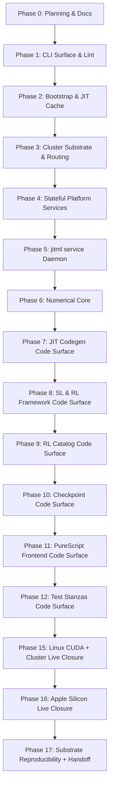

# jitML Development Plan

**Status**: Authoritative source
**Supersedes**: N/A
**Referenced by**: [../README.md](../README.md), [../AGENTS.md](../AGENTS.md),
[../CLAUDE.md](../CLAUDE.md), [../README.md](../README.md),
[development_plan_standards.md](development_plan_standards.md),
[00-overview.md](00-overview.md), [system-components.md](system-components.md),
[legacy-tracking-for-deletion.md](legacy-tracking-for-deletion.md),
[phase-0-planning-documentation.md](phase-0-planning-documentation.md),
[phase-1-haskell-cli-surface.md](phase-1-haskell-cli-surface.md),
[phase-2-bootstrap-reconciler-and-jit-cache.md](phase-2-bootstrap-reconciler-and-jit-cache.md),
[phase-3-cluster-substrate-and-routing.md](phase-3-cluster-substrate-and-routing.md),
[phase-4-stateful-platform-services.md](phase-4-stateful-platform-services.md),
[phase-5-jitml-service-daemon.md](phase-5-jitml-service-daemon.md),
[phase-6-numerical-core.md](phase-6-numerical-core.md),
[phase-7-jit-codegen-and-substrates.md](phase-7-jit-codegen-and-substrates.md),
[phase-8-supervised-and-rl-framework.md](phase-8-supervised-and-rl-framework.md),
[phase-9-rl-catalog-alphazero-and-tuning.md](phase-9-rl-catalog-alphazero-and-tuning.md),
[phase-10-checkpointing-and-inference.md](phase-10-checkpointing-and-inference.md),
[phase-11-purescript-frontend-and-demo.md](phase-11-purescript-frontend-and-demo.md),
[phase-12-test-stanzas-and-cross-cluster.md](phase-12-test-stanzas-and-cross-cluster.md),
[phase-13-no-caveat-model-runtime.md](phase-13-no-caveat-model-runtime.md),
[phase-14-interactive-demo-and-playwright-closure.md](phase-14-interactive-demo-and-playwright-closure.md),
[phase-15-linux-cuda-and-cluster-closure.md](phase-15-linux-cuda-and-cluster-closure.md),
[phase-16-apple-silicon-closure.md](phase-16-apple-silicon-closure.md),
[phase-17-cross-substrate-and-handoff.md](phase-17-cross-substrate-and-handoff.md),
[phase-18-no-caveat-product-handoff.md](phase-18-no-caveat-product-handoff.md),
[../documents/documentation_standards.md](../documents/documentation_standards.md)
**Generated sections**: none

> **Purpose**: Provide the single execution-ordered development plan for the jitML
> Haskell CLI, the three substrates (`apple-silicon`, `linux-cpu`, `linux-cuda`), the
> `jitml service` daemon, the SL/RL training stack including AlphaZero and
> hyperparameter tuning, the PureScript frontend, the live workflow matrix, and the
> final no-caveat product handoff surface — including phase status, validation
> gates, and cleanup ownership.

## Standards

See [development_plan_standards.md](development_plan_standards.md) for the
maintenance rules that govern this plan suite.

## Closure Status

**🎉 ALL PHASES `0`–`18` ARE `✅ Done` — the durable-state Dhall DSL has landed
(2026-06-24) and the no-caveat product handoff is re-aggregated.** The durable-state
DSL refactor (reopened 2026-06-23) is complete: **Phase `2`** (Sprint `2.15` — the
closed, self-validating `jitml.dhall` foundation + `jitml project init` + the asserted
`Budget`/`fitsWithin`), **Phase `4`** (Sprint `4.9` — `bucketNames` projected from the
registry), **Phase `5`** (Sprint `5.15` — the registry declares the logical Pulsar
topic family, anti-drift-checked against the topology), **Phase `10`** (Sprint `10.8` —
checkpoint GC retention registry-sourced, `LastN 5` retired), and **Phase `18`** (Sprint
`18.2` — re-aggregation) are all `✅ Done`. Validated: `jitml-unit` 219/219, `jitml-e2e`
23/23, `cabal build all` clean; the `Pending Removal` ledger is empty again (Exit
Definition item 18 re-met). The prior no-caveat closure narrative follows.

**🎉 ALL PHASES `0`–`18` reached `✅ Done` — the no-caveat product handoff completed
(2026-06-23, prior to the durable-state DSL reopen above).** Phases `17` and `18` closed on 2026-06-23: all three per-lane
report-card fragments are committed (`linux-cpu` from Phases `13`/`14`,
`linux-cuda` from Phase `15`, `apple-silicon` from Phase `16`), the `linux-cpu`
aggregation ran green (`jitml test all --live --linux-cpu` 8/8 stanzas, every
measurement populated, live Playwright **14/14**), the **`Pending Removal` ledger
is empty** (Exit Definition item 18 met), and the structural blocker is dissolved
(jitML is self-contained — its Docker-Hub credential path is an owned mechanism,
not a deferral to any external foundation). The final 2026-06-23
work this session: removed the prior external-foundation framing, landed the reflected
numerics/RL catalog Dhall schema (`JitML.Service.CatalogSchema`), migrated the
tuning objective onto the production `JitML.SL.Architecture` seam
(`tune_best_objective` unchanged at `TPE=1.0`), ran the `linux-cpu` live
aggregation to commit its fragment, and implemented + live-validated the three
Sprint `14.1` browser product features (checkpoint browse, workflow-state
reconciliation, persisted-transcript adversarial replay). The detailed phase
history follows.

**Phase `16` closed (2026-06-22 — Apple M1 Max, macOS 26.5, Metal 4; live
`apple-silicon` cluster + host Metal daemon).** Sprint `16.11` re-closed `✅ Done`,
so **Phase `16` is `✅ Done`** on its no-caveat `apple-silicon` lane:
`jitml test all --apple-silicon` **8/8 stanzas** (`jitml-backends` 17/17 on the M1
GPU via the fixed Metal bridge), `jitml-integration -p Live` **20/20**, the live
report card **7/7 measured rows** (`sl_final_loss=0.65` from real Metal MNIST
training, `rl_final_reward`, `alphazero_arena_win_rate`, `tune_best_objective`,
`jit_cache_hit_rate`, `daemon_healthz`, **`browser_product_matrix` 5/5**), and the
live Playwright product matrix **11/11**. The committed `apple-silicon` per-lane
fragment lives at
[attestations/apple-silicon-report-card.md](attestations/apple-silicon-report-card.md).
Closing the live inference path (the 2 cases the 2026-06-22 note below mis-read as
the cluster "not forwarding") required **five real daemon/forwarding defect fixes**,
none a product-logic flaw, all in the worktree: (1) the daemon consumer subscription
`Exclusive`→`Failover` (`PulsarWebSocketSubprocess.hs`) — an `Exclusive` sub
rejects a redeployed pod's second consumer with a non-101 WS upgrade, so the daemon
crash-loops (`hGetLine: EOF`) and serves nothing until the broker reaps the prior
consumer; (2) the Apple `ForwardToHost` cluster dispatcher forwarding the **raw
`RunInference`** (values model) so the host `InferenceResult` reply parses, not an
`AppleInferenceEvent` refs reply (`Runtime.hs`); (3) in-process WS auto-reconnect in
the consumer worker (`PulsarWebSocketSubprocess.hs`); (4) a **per-worker dedup
MVar** (`startDaemonConsumerWorkers`, `App.hs`) — the shared `modifyMVar routerRef`
ran the whole dispatch compute, so a long host Metal training blocked the inference
worker past the client's bounded reply poll (the deterministic 1/20 Live failure;
per-worker routers cut Live wall-time 227s→78s); and (5) forwarding **every**
inference-domain command (compare/connect4 were dropped). Plus a test-bug fix
(`jitml-sl-canonicals` live MNIST trained a hardcoded `LinuxCPU` oneDNN device that
cannot link on the Mac → now the publication substrate, real Metal MNIST
convergence) and a demo ack-kind alignment (`Web/Server.hs`). The superseded
`AppleInferenceCommand`/`AppleInferenceEvent` refs RPC was **removed** 2026-06-22
(Sprint `16.12`, now `Completed` in
[legacy-tracking-for-deletion.md](legacy-tracking-for-deletion.md); host-native
`-Werror` build + `jitml-unit` 208 + `jitml-daemon-lifecycle` 32 green).

**Phases `17`/`18`** remain `⏸️ Blocked`, but the **structural** blocker is now
**dissolved** and the remaining work is entirely **in-scope** (no out-of-scope
foundation). Update **2026-06-23**: jitML is treated as **self-contained** — the bootstrap no
longer defers any credential work to an external foundation, and the Sprint `2.13`
Docker-Hub pre-pull (plus the Sprint `2.14` in-cluster `imagePullSecret`) is now
jitML's **own owned, self-contained** credential path, so its `Pending Removal`
row is `Completed`
(adopted as owned, not a deletion). That removes the one row that previously held
the empty-ledger gate open "structurally," so **Phase `18` can now reach an empty
ledger within jitML scope**. Two more rows closed the same day: the **reflected
catalog Dhall-schema** row (Phase `5`) is `Completed` — the numerics/RL catalog
`.dhall` leaves are now reflected-emitted from the Haskell catalogs
(`JitML.Service.CatalogSchema`, `jitml internal dhall-schema --catalog`,
`jitml-unit` parity test) — and the **Dense-only SL tuning-objective** row (Sprint
`13.1`) had its objective **migrated** off the Dense-only classifier onto the
production `JitML.SL.Architecture` seam (host-validated: `cabal build all` clean,
`jitml-hyperparameter` 16/16) and **live-validated on `linux-cpu`** (the report
card measured `tune_best_objective: TPE=1.0` **unchanged**, so the committed
accelerator fragments stay consistent — that row is `Completed`, no re-baseline
needed). **The `linux-cpu` aggregation also ran and its fragment is committed**: a
live `bootstrap/linux-cpu.sh up` (110-step rollout, edge `9091`) + `jitml test all
--live --linux-cpu` gave **8/8 stanzas PASS**, every report-card measurement
populated (all 12 canonical datasets staged + SHA-verified, 5 demo checkpoints
seeded), and live **Playwright 14/14** — committed at
[attestations/linux-cpu-report-card.md](attestations/linux-cpu-report-card.md), so
all three per-lane fragments now exist. **The `Pending Removal` ledger is now
EMPTY**: the final two rows — the **Sprint `14.1`** browser product features
(checkpoint browse, live-backed workflow-state reconciliation,
persisted-transcript adversarial multi-game replay) — are **implemented as real
Engine workflows + Webapp panels and live-validated** on `linux-cpu` (the
Playwright matrix grew 11→**14/14**, exit 0; the persisted transcript object is
confirmed in the `jitml-transcripts` MinIO bucket). With the ledger empty (Exit
Definition item 18 met), all three per-lane fragments committed, and the
`linux-cpu` aggregation run green, **Phases `17` and `18` are unblocked** — no
out-of-scope foundation, no accelerator hardware, no missing fragment remains.

**Phase `2` reopened + re-closed (2026-06-20 — authenticated third-party image
pre-pull).** Phase `2` reopened for **Sprint `2.13`** and **re-closed `✅ Done`**
on its retained surface: the bootstrap pre-pulls the `docker.io/*` third-party
chart images authenticated **on the host** (reading, never writing, the host
`docker login`) before `kind load`, closing the cold-host **429** where the Kind
cluster's containerd otherwise pulls them anonymously. Live-proven (no 429 on the
host pull); on an overlay2 docker store the pre-pull + `kind load` closes the
in-cluster 429 directly. The in-cluster credential closure is jitML's **own,
self-contained** Sprint `2.14` `imagePullSecret` (projected from the host Docker
Hub credential, authenticating the kind node's pulls); the host-dependent
containerd-image-store `kind load` behavior (the colima `ctr import` quirk) is a
known characteristic that owned path accommodates. This is an owned project
mechanism, not a transfer to any external foundation. Sprints `2.1`–`2.12` stay
closed; the single-accelerator / forward-DAG rules (rule M) are unaffected
(Sprint `2.13` has no backward edge and closes on the `linux-cpu` lane).

**Common-shape reopen (Pulsar ML-Workflow convergence) — re-closed on owned
surfaces (2026-06-20).** jitML and the `infernix` sister project converged on one
shared contract,
[../documents/engineering/pulsar_ml_workflow.md](../documents/engineering/pulsar_ml_workflow.md)
— a three-role split (**Engine** = compute-only; **Coordinator** = topic-lifecycle
ownership + coordination + training-completion readiness gating; **Webapp** = thin
websocket, substrate-agnostic, no ML compute), a derived **topic algebra**, the
`Work*` envelope family unifying training and inference, the artifact + `.ready`
readiness contract, websocket snapshot/patch, and a reflected-Dhall-schema one-binary
role model. This reopened Phases `5`, `10`, `11`, and `12` for the convergence
deltas (**all now `✅ Done` on their owned surfaces**), and **reframed the closure
Phases `13`–`18`** around the new arc (the Apple in-pod-Metal browser-forward that
blocked Phase `16` *dissolved* under the substrate-agnostic Webapp role — the webapp
publishes `inference.request.<substrate>` and never computes). Each delta's current
surface is recorded in
[legacy-tracking-for-deletion.md](legacy-tracking-for-deletion.md):

- **Phase `5` ✅** — `jitml service` is a one-binary **Engine / Coordinator /
  Webapp** role model selected by typed Dhall, the **Coordinator** owns explicit
  topic lifecycle (the hardcoded `PulsarBootstrap` topic list retired), and the
  binary emits its own reflected Dhall schema. Live coordinator reconcile /
  multi-role serving transfer to Phases `11`/`15`.
- **Phase `10` ✅** — inference is an async `Work*` workflow; a serveable
  `ArtifactRef` is mintable only from a completed training derivation (`.ready`
  sentinel), and the triplicated inference path collapsed into the Engine.
- **Phase `11` ✅** — `jitml-demo` folded into the **Webapp** role (computes no
  ML); all five inference panels are websocket-driven over `/api/ws/inference`
  (typed-decode pipeline; compare + Connect-4 as Engine workflows). Live Playwright
  product proof transfers to Sprints `14.2`/`16.x`.
- **Phase `12` ✅** — the workflow/topic-algebra/`.ready`/websocket-inference test
  coverage landed (`jitml-unit` 208, `web/test` snapshot frames); the `-p Live`
  integration lane is the standard runtime gate.

The single-accelerator and forward-only-DAG rules (standards rule M) are unchanged and
now cross-link the shared contract. The historical closure narrative below predates
this reopen.

**Phase 15 closed (2026-06-18 — NVIDIA GeForce RTX 5090 host, UUID
`GPU-e764ef97-32d7-4981-c348-029983c64073`, CUDA 12.8).** Sprint `15.20`
re-closed `✅ Done`, so **Phase `15` is `✅ Done`** on its `linux-cpu`+`linux-cuda`
no-caveat lane. The full five-command validation gate passed:
`docker compose run --rm jitml jitml test all --linux-cpu` **8/8 stanzas**,
`docker compose run --rm jitml-cuda jitml test all --linux-cuda` **8/8 stanzas**
(including `jitml-backends` **20/20** with the real cuBLAS/cuDNN bindings on the
attached RTX 5090), `jitml test jitml-e2e --linux-cuda` **23/23**, `jitml docs
check`, and `jitml check-code` all green; the live `linux-cuda` report card
measured every runtime row (`sl_final_loss`, `rl_final_reward`,
`alphazero_arena_win_rate`, `tune_best_objective`, `jit_cache_hit_rate`,
`daemon_healthz`), and the **live Playwright product matrix passed 11/11 on the
`linux-cuda` edge**. Closing this lane required fixing three real defects (none a
product-logic flaw, all now landed in the worktree): (1) a stale `jitml-unit`
command-registry golden missing the `internal seed-demo-checkpoints` leaf
(`test/unit/Main.hs`); (2) **the `jitml-demo` pod had no GPU on `linux-cuda`** so
in-process checkpoint inference failed `503 runtime unavailable: libcuda=no`, and
its 256Mi limit OOM-killed the `nvcc` JIT compile — fixed in
`chart/local/jitml-demo/templates/deployment.yaml` (adds `runtimeClassName:
nvidia`, the NVIDIA env, and a 4Gi/2-CPU budget on `linux-cuda`, mirroring
`jitml-service`); and (3) the `measureBrowserProductMatrix` report-card row was a
hardcoded `unavailable` stub — now wired (`src/JitML/App.hs`) to probe the live
checkpoint-backed product endpoints. Two environmental, non-product issues were
also worked around on this shared host: Apache BookKeeper going read-only under
co-tenant disk pressure (the bookie disk-usage threshold was raised on the jitML
clusters only) and a co-tenant-induced disk-full event. **Phases `16`, `17`, and
`18`** were `⏸️ Blocked` on the x86_64 Linux+CUDA host (no Mac/Metal hardware).
**Update 2026-06-20 (Apple M1 Max session):** Phase `16` moves to `🔄 Active` —
the Mac-hardware blocker is resolved and the **host Apple Metal lane is validated**
on M1 Max (`jitml-backends --apple-silicon` 17/17 via the fixed Metal bridge on
the host GPU; pure-logic stanzas host-native green), re-confirmed on the
post-convergence worktree. **Update 2026-06-21:** Phase `2` Sprint `2.14` (in-cluster Docker Hub
`imagePullSecret`) closed the cluster-pull blocker — the **live Apple cluster now
comes up authenticated** (110-step rollout, no blocking 429), and `jitml-integration
-p Live` passes **18/20** against it. The remaining Phase `16` slice is the **2
host-daemon inference cases** (`no matching reply from the Engine`). **Update
2026-06-22:** the host-daemon half is fixed — `subscribeDaemonTopics` now retries
transient acquisition failures (`Consumer.hs`; validated, all four host
subscriptions acquire live). The remaining blocker is the **in-cluster
`jitml-service` not forwarding** `inference.request.apple-silicon` →
`inference.command.apple-silicon` (broker counts 2→0), with its node Pulsar-WS
consumer subprocess crash-looping (`hGetLine: end of file`); details in
[phase-16](phase-16-apple-silicon-closure.md). Plus the **Playwright product
matrix**, then committing the `apple-silicon` report-card fragment. Phases `17`/`18`
stay `⏸️ Blocked` — they aggregate
the committed per-lane fragments including the `apple-silicon` one, which is
committed only when Phase `16`'s live slice runs green. The committed `linux-cuda`
per-lane fragment lives at
[attestations/linux-cuda-report-card.md](attestations/linux-cuda-report-card.md).

**Phase renumbering (2026-06-16 — forward-DAG / single-accelerator doctrine).**
The closure phases were reordered into a strict forward chain so that no later
phase blocks an earlier one, each phase closes on at most one accelerator plus
`linux-cpu` on a single host, and the plan is workable in numerical order
(standards [rule M](development_plan_standards.md)). The runtime/browser phases
that the live lanes depend on now precede them. Old→new phase map:

| Old | New | Phase |
|---|---|---|
| 16 | **13** | No-Caveat Model Runtime Closure (`linux-cpu`) |
| 17 | **14** | Interactive Demo + Playwright (`linux-cpu`) |
| 13 | **15** | Linux CUDA + Cluster Live Closure (`linux-cpu`+`linux-cuda`) |
| 14 | **16** | Apple Silicon Live Closure (`linux-cpu`+`apple-silicon`) |
| 15 | **17** | Within-Substrate Reproducibility (`linux-cpu` aggregation) |
| 18 | 18 | No-Caveat Product Handoff (`linux-cpu` aggregation) |

Phases `0`–`12` are unchanged. Sprint identifiers were renumbered with their
phase (e.g. old `13.20` → new `15.20`, old `16.1` → new `13.1`). **All phase and
sprint numbers throughout this plan, including the dated history below, use the
new numbering**; entries dated before 2026-06-16 describe events that occurred
under the old numbering but are written here with the new numbers for
consistency. After the renumber every `Blocked by`/dependency edge references a
strictly lower number, and the only phase that touches all three substrates
(Phase `18`) does so by `linux-cpu` aggregation of per-lane attestations, never by
running two accelerators on one host.

**Session re-validation (2026-06-16 — Apple M1 Max host; runnable lanes only).**
A full runnable-lane validation pass ran on an Apple M1 Max workstation (macOS,
arm64; Docker Desktop aarch64 Linux VM, 9 CPUs / 47 GiB; no NVIDIA GPU). The host
runs the `apple-silicon` lane (Metal GPU + fixed bridge) and the `linux-cpu` lane
(aarch64 oneDNN container); the `linux-cuda` lane is **physically impossible here**
(no NVIDIA GPU, Docker is aarch64), so every `linux-cuda` obligation remains
hardware-blocked and was not re-claimed on this host.

- **Bug fixed (code).** `jitml-unit` failed `1/197`: the demo panel/route golden in
  `test/unit/Main.hs` was stale against the Sprint `11.9` no-caveat additions
  (`generic-inference-lab`, `checkpoint-compare-lab`, `/api/runs/{runId}/command`,
  `/api/inference/generic`, `/api/checkpoints/compare`). The fixture was synced to
  the `JitML.Web.Bundle` source of truth; `jitml-unit` is now `197/197` on both
  lanes and `check-code` / `docs check` stay green.
- **Non-live surface — both lanes green.** `apple-silicon` (host-native) and
  `linux-cpu` (`jitml:local` container): `jitml-unit 197`, `jitml-rl-canonicals 29`,
  `jitml-hyperparameter 16`, `jitml-daemon-lifecycle 34`, `jitml-sl-canonicals 24`
  (offline), `jitml-backends` (`apple-silicon` Metal GPU `17/17`, 91.9s; `linux-cpu`
  oneDNN `23/23`). `check-code: ok`, `docs check: ok`.
- **`linux-cpu` live lane — re-validated.** `jitml bootstrap --linux-cpu` brought up
  a clean cluster (85 steps; all 7 components ready; edge `9091`); all 12 canonical
  dataset blobs staged + SHA-verified into live MinIO; `jitml-sl-canonicals
  --linux-cpu` **24/24** (live MNIST convergence `OK 431s`, all-row materialize `OK
  41s`); `jitml-integration --linux-cpu` **71/71** (live WorkflowMatrix, PPO/cartpole
  convergence `OK 83.9s`, AlphaZero generation, tune persist/replay, inference run,
  GC + `gc.event`, MinIO/Pulsar/Harbor round-trips — the Harbor case needed
  `alpine:3.20` pre-cached from a non-rate-limited mirror to dodge a Docker Hub
  anonymous-pull rate limit, an environmental flake, not a product defect);
  `jitml-e2e --linux-cpu` **23/23**.
- **Playwright product matrix — `6/11` against the live `linux-cpu` edge; Phase
  `14` confirmed genuinely incomplete.** The static panels (portals home, shared
  header, RL timeline, training loss curve, tune heatmap) pass; the five
  checkpoint-backed panels (MNIST inference, generic inference, CIFAR upload,
  checkpoint compare, Connect 4 move) fail with `HTTP 503`. Two real,
  root-caused defects block them, both owned by open sprints and **neither is a
  hardware limit**: (1) the in-cluster `jitml-demo` checkpoint runtime handler
  reads MinIO at the external edge `127.0.0.1:<edge>`
  (`App.hs:244 minioSettingsForLocalEdge`), which from inside the pod is its own
  localhost (`curl exit 7`) — it must use the in-cluster service
  `minio.platform.svc.cluster.local:9000` as the daemon does; and (2) no
  per-panel inference checkpoints are persisted/served — the `jitml-checkpoints`
  bucket holds only RL/AlphaZero/tune/workflow-matrix artifacts, none at the
  experiment hashes the browser panels request. Both are recorded as Sprint
  `14.1` Remaining Work (with Sprint `13.1` owning per-family checkpoint
  persistence).
- **Status unchanged.** Phase `13` stays `🔄 Active`; Phases `15`–`17`, `14` and `18`
  stay `⏸️ Blocked`. Nothing closed: the no-caveat closure still needs the
  `linux-cuda` lane (absent hardware), deep-model (`ResNet-50`/`ViT`) **median
  convergence** (impractical without the GPU lane), the full RL-catalog / 4-game
  AlphaZero-arena / all-model-family checkpoint-inference breadth, and the
  checkpoint-backed browser surface above. The `apple-silicon` live cluster lane
  (Phase `16.11`) was not re-exercised this session and remains blocked by Phases
  `13`/`14` regardless.

**Closure update (2026-06-16 — Phases `11` and `12` re-closed `✅ Done`).**
Sprints `11.9` (Full Interactive Demo Surface) and `12.13` (Playwright No-Caveat
E2E Matrix) closed on their **owned** surfaces, so Phases `11` and `12` are
`✅ Done` again. Both sprints' remaining bullets were exclusively live-runtime
proof already owned by downstream sprints, so they were deduped to those owners
per standards rule E (one obligation, one place) and the live-obligation
consolidation doctrine (Phases `15`–`17` extract every live-runtime obligation
from Phases `7`–`12`): the live checkpoint-backed REST / command-publication /
status-reconciliation / pause-resume-promote / replay surfaces are owned by
Sprint `14.1`; the live Playwright product matrix by Sprint `14.2`; and the
per-lane live execution by Sprint `15.20` (`linux-cpu` / `linux-cuda`) and Sprint
`16.11` (`apple-silicon`). `11.9` landed the RL environment animation, training
throughput-telemetry, and rules-complete adversarial annotations (validated by
`jitml lint purescript` + the contract spec); `12.13` landed the
`JitML.Test.WorkflowMatrix.browserProductMatrix` enumeration and the
`browser_product_matrix` report-card field (validated by `jitml-e2e --linux-cpu`
23 / 23 and `check-code`). Phase `13` stays `🔄 Active`; Phases `15`–`17` and
`14` and `18` stay `⏸️ Blocked`, now with `11.9` / `12.13` removed from their
`Blocked by` lines.

**Reopen note (2026-06-14 — no-caveat end-to-end product target).** The current
implementation has re-closed Phase `8` on the all-row SL framework/runtime and
typed RL event-payload surface, but it is not yet the intended no-caveat
product: Phase `9` has removed the RL/AlphaZero/tuning helper stand-ins and
passed linux-cpu, apple-silicon, and linux-cuda validation;
checkpoint/reload/inference support has re-closed Phase `10` after the Apple
Silicon live integration lane passed; Sprint `11.9` has removed the current
panel marker/default parsers behind generated typed browser payload
decoders/renderers, replaced the static command acknowledgement with
request-aware daemon command publication when a live cluster publication
exists, and wired current REST panels plus generic tensor inference and
checkpoint comparison through an injected checkpoint runtime handler. The
browser now renders generated queued/running/failed/done workflow status for
current controls; unsupported pause/resume/promote lifecycle actions, live
all-substrate checkpoint-backed interactions, expanded adversarial/game
visualizations, live replay artifact selection, and Playwright product proof
remain open rather than proving every model trains and exposes the appropriate
interaction.
Therefore:

- **Phase `8` reopened and re-closed on 2026-06-14** for Sprint `8.12`, adding
  all-row substrate-backed SL trainable runtime coverage, real staged-byte
  materialization, live MNIST convergence through `JitML.SL.Architecture`, and
  typed RL animation/replay event payloads.
- **Phase `9` reopened and re-closed on 2026-06-15** for Sprint `9.12`,
  completing the linux-cuda validation pair after its code surface had already
  passed linux-cpu and apple-silicon.
- **Phase `10` reopened and re-closed on 2026-06-15** for Sprint `10.6`.
  The Dockerfile image-build fix, Linux CPU and Linux CUDA live integration
  lanes, and Apple Silicon live integration lane all passed; the final Apple
  validation was `./.build/jitml test jitml-integration --apple-silicon` on a
  live `apple-silicon` publication, passing 71 / 71 including the 19-test
  `Live` group.
- **Phases `11` and `12` were `🔄 Active`** for Sprints `11.9` and `12.13` at
  this 2026-06-14 reopen; both re-closed `✅ Done` on 2026-06-16 — see the
  2026-06-16 closure update at the top of this section. Their live-runtime
  obligations were deduped to Sprints `14.1` / `14.2` / `15.20` / `16.11` per
  rule E.
- **Phases `15`, `16`, and `17` reopen from `✅ Done` to `⏸️ Blocked`** because
  their live validation and handoff obligations depend on the remaining browser,
  model-runtime, and product-handoff surfaces.
- **Phases `13`, `14`, and `18` are added.** Phase `13` owns full no-caveat
  model runtime closure and is now `🔄 Active` because Phases `8`–`10` have
  re-closed; Phase `14` owns the interactive demo plus Playwright product
  matrix, and Phase `18` owns final all-substrate no-caveat handoff.
- **Phases `0`–`7` stay `✅ Done`** on their owned surfaces. Their architecture
  remains the foundation for the expanded runtime and browser work.
- The legacy ledger now has Pending Removal rows for concrete temporary
  stand-ins: incomplete browser visualization/replay renderers, browser
  product-contract expansion, the catalog rollout compatibility helper, and the
  Dense-only SL product gate. The current marker/default parser, inline demo
  response, and AlphaZero placeholder evaluator rows have moved to `Completed`.

**Reopen note (2026-06-13 — Apple Silicon host-resident workload placement;
re-closed, superseded by the 2026-06-14 product reopen above).** The full Apple
Silicon lifecycle exposed a placement defect:
`StartRLRun` for `apple-silicon` was consumed by the in-cluster Apple daemon and
rendered as a `jitml-rl-*` Kubernetes Job. That Job ran in the Linux
`jitml:local` image, resolved the requested substrate to the Apple Metal
`MlpDevice`, and then failed because a Linux pod cannot load or execute the
macOS fixed Metal bridge. Linux CPU remained closed; the full
`bootstrap/linux-cpu.sh test` lane had already passed. Therefore:

- **Phase `5` reopened and re-closed `✅ Done`** for Sprint `5.11`, adding a
  first-class workload-placement planner that separates substrate semantics from
  legal execution residency. Apple Metal-backed Training/RL/Tune starts now
  become host-resident Pulsar commands, not Kubernetes Jobs.
- **Phase `12` reopened and re-closed `✅ Done`** for Sprint `12.12`, making
  live tests fail fast when a dispatched Kubernetes Job fails and adding Apple
  placement assertions that no Metal-backed Apple RL/training/tune work creates
  `jitml-rl-*` or sibling Linux Jobs. The focused Linux CPU dispatch selectors
  still observe legal Jobs; the focused Apple selectors now observe host-command
  forwarding and no workload Jobs.
- **Phase `16` reopened and re-closed `✅ Done`** for Sprint `16.10`, validating
  the Apple host-resident workload path against a live Apple cluster through
  `bootstrap/apple-silicon.sh test`.
- **Phase `17` reopened and re-closed `✅ Done`** for Sprint `17.7`; the
  placement ledger row moved to `Completed`, Pending Removal is empty, and final
  handoff is revalidated.
- **Phases `0`, `1`, `2`, `3`, `4`, `5`, `6`, `7`, `8`, `9`, `10`, `11`, `12`, and `15` stay `✅ Done`** on their owned surfaces. The RL/SL/tuning
  code already selected the correct Apple device; the defect was illegal
  residency, now fixed by host-command placement.

The stale Apple Kubernetes-Job placement path moved to
[legacy-tracking-for-deletion.md → Completed](legacy-tracking-for-deletion.md#completed).

**Reopen note (2026-06-12 — true-headless Apple Metal fixed-bridge doctrine;
supersedes the 2026-06-10 Tart-VM closure and the real-workflow blocker text
below).** The Apple Silicon core JIT path now targets a fixed host Metal bridge:
Haskell renders MSL plus launch metadata, persists
`./.build/jit/apple-silicon/<hash>.metal.json`, and calls a fixed bridge that
uses `MTLDevice.makeLibrary(source:options:)` with fast math disabled before
dispatching on the host GPU. Core training/inference cache misses must not start
Tart, invoke SwiftPM, require full Xcode, require the offline `metal` compiler,
unlock a login keychain, or depend on a GUI session. Therefore:

- **Phase `1` reopened and re-closed on 2026-06-12** for Sprint `1.15`, removing
  the `jitml internal vm` command group and regenerating the command artifacts.
- **Phase `2` reopened and re-closed on 2026-06-12** for Sprint `2.12`, replacing
  the core `container.tart` prerequisite with `apple.metal-runtime` /
  `apple.metal-bridge`, adding optional non-core Swift/SDK probes, removing
  bootstrap Tart cleanup, and adding the `<hash>.metal.json` cache layout.
- **Phase `5` reopened and re-closed on 2026-06-12** for Sprint `5.10`,
  removing daemon build-VM LiveConfig/acquire state and adding fail-closed
  Apple Metal runtime / fixed-bridge acquisition.
- **Phase `7` reopened and re-closed on 2026-06-12** for Sprint `7.11`,
  replacing generated Swift/Tart cache misses with `.metal.json` + fixed bridge
  execution.
- **Phase `16` reopened and re-closed on 2026-06-12** for Sprint `16.9`,
  validating the Apple backend/e2e/WorkflowMatrix lane through the fixed bridge
  against a live Apple cluster.
- **Phase `17` reopened and re-closed on 2026-06-12** for Sprints `17.5` /
  `17.6`: the fixed-bridge Apple lane passes and
  [legacy-tracking-for-deletion.md → Pending Removal](legacy-tracking-for-deletion.md#pending-removal)
  is empty again.
- **Phases `0`, `3`, `4`, `6`, `8`, `9`, `10`, `11`, `12`, and `15` stay
  `✅ Done`** on their owned surfaces. The Linux lanes and real-workflow code
  surfaces remain closed; the reopen is Apple host-JIT architecture only.

The 2026-06-12 Tart HostKey/keychain failure is retained as evidence that the VM
architecture is not a valid headless target. It is not a supported remediation
step.

**Historical reopen note (2026-06-10 — real-workflow refactor; superseded by the
2026-06-12 fixed-bridge closure above; itself superseded the prior
"final handoff is complete" status below).** A realness audit established that the
user-facing workloads and the demo did not exercise the substrate JIT path they
claim: `jitml train` printed and published a closed-form synthetic `SL.finalLoss`
and trained (when it trained at all) a pure-Haskell MLP that never touches a
substrate engine; `jitml rl train` defaulted to a scripted non-learning simulator;
`rl eval` / `rl rollout` / `eval` / `tune` were echo/LCG stand-ins; AlphaZero MCTS
was a one-ply bandit; the demo panels issued no HTTP calls and `/api/inference`
returned a hardcoded value; and the integration "Live" tests asserted stdout
prefixes that passed offline. The real substrate path (`MlpDevice` →
compile → load → real `jitml_mlp_*` kernels) exists and is backend-tested in the
`jitml-backends` lane, but nothing user-facing routes through it. Therefore:

- **Phases `8`, `9`, `10`, `11`, `12` reopen from `✅ Done` to `🔄 Active`** on
  their **code** surfaces (route every workflow + the demo through the substrate
  `MlpDevice`; delete every synthetic/echo stand-in; fail closed when the cluster
  is absent — offline is no longer a supported mode). As of 2026-06-12,
  Phases `8`, `9`, `10`, `11`, and `12` have re-closed; Phase `12` closed with
  the Sprint `12.11` live WorkflowMatrix gate.
- **Phases `15`, `16`, `17` reopen from `✅ Done` to `🔄 Active`** on their
  **live-runtime validation** surfaces (re-exercise every reopened workflow for
  real on `linux-cpu`/`linux-cuda`, on `apple-silicon`, and in final handoff).
  As of 2026-06-12, all three have re-closed.
- **Phases `0`–`7` stay `✅ Done`** on their owned surfaces — the CLI surface,
  bootstrap/cluster/services/daemon, the numerical core, and the per-substrate JIT
  codegen + execution (the `jitml-backends` backend lane) are real and unaffected;
  this refactor changes *what computes in the demo/CLI/tests*, not the engines.
- **Exit-Definition items `6`, `8`, `9` reopen** (strengthened to require
  substrate-backed JIT, no synthetic fallback, real demo output, and DRY real
  per-substrate integration/e2e). The Pending-Removal ledger is empty again as
  of 2026-06-12 after Sprint `12.11` moved the final cleanup row to
  `Completed`; final handoff then re-closed after the Phase `16` fixed-bridge
  Apple lane and Phase `17` ledger walk-down passed. The 2026-06-12 fixed-bridge
  reopen above added Sprints `1.15`, `2.12`, `5.10`, `7.11`, `16.9`, `17.5`,
  and `17.6`, all of which closed before the 2026-06-13 placement reopen.

The historical closure narrative below is retained as fact about the prior
(synthetic) state; it no longer describes the current status.

**Reopen note (2026-06-08; updated 2026-06-09)**: Phases `1`, `12`, `15`, `16`,
and `17` reopened from `✅ Done` to `🔄 Active` after the project owner clarified
the reproducibility contract: **within a substrate the contract is bit-for-bit
reproducibility; across substrates there is no guarantee** (RNG draws and float
reduction order differ between vendor BLAS/DNN libraries). The cross-substrate
*numeric parity / tolerance* surface delivered by Phase `17` Sprints `17.1`
(`src/JitML/Engines/Tolerance.hs`, `JitML.CrossBackend.Parity`, the
`CrossSubstrate` weighted-drift tests, the `jitml verify cross-backend` command)
and `17.2` (the report-card `cross_substrate_parity` field) asserts a guarantee
the project does not make and was removed.

**On 2026-06-09 the entire source/code removal landed and was validated** on the
two lanes the Apple Silicon development host can run. The cross-substrate parity
modules (`Tolerance.hs`, `CrossBackend.Parity`) are deleted (and removed from
`jitml.cabal`); the `verify cross-backend` leaf + handlers, the report-card
`cross_substrate_parity` field + `measureCrossSubstrateParity`, the
`CrossSubstrate` drift group, the unit tolerance-band group, and the
`probeCudaRuntime` / `appleLiveReady` / `cublasBindingsCompiledIn` /
`cudnnBindingsCompiledIn` skip guards + the integration oneDNN-availability
assertion are all removed; the two substrate-agnostic cross-backend cases are
relocated to `jitml-unit`; and the `--test-options='-p <substrate>'` passthrough
plus substrate-named cases wire the partitioned lanes. Validation: project +
test stanzas compile/link clean (host + in-container `-fcuda` library build),
container `jitml check-code` and `jitml docs check` green, `jitml-unit`
193 / 193, the **`apple-silicon` lane 4 / 4** (host-native Metal, no skips) and
the **`linux-cpu` lane 10 / 10** (oneDNN in the `jitml` container, no skips) each
selecting only their substrate's cases.

Status after that work: **Phase `1` (Sprint `1.13`) and Phase `16` (Sprint
`16.6`) re-closed `✅ Done`.** Phases `12` (Sprint `12.10`), `15` (Sprint
`15.16`), and `17` (Sprint `17.4`) stayed `🔄 Active` on one shared remaining
obligation — the live `linux-cuda` lane on real NVIDIA hardware — which the
Apple Silicon development host could not provide. **On 2026-06-09 that lane was
re-validated for real on the NVIDIA GeForce RTX 5090 host** (UUID
`GPU-e764ef97-32d7-4981-c348-029983c64073`, CUDA 12.8, Ubuntu 24.04, Docker
29.5.1) via the GPU-attached `jitml-cuda` compose service:
`docker compose run --rm jitml-cuda cabal test -fcuda jitml-cross-backend
--test-options='-p linux-cuda'` passed **19 / 19 (12.26s, no skip-sentinels)** —
every within-substrate CUDA case a real device PASS (`-fcuda` is the `cabal`
build flag that compiles the real cuBLAS / cuDNN bindings; that run drove the GPU
lane through the GPU container's raw `cabal test -fcuda` form. **Superseded
2026-06-09 (later that day): the `jitml test` orchestrator now owns all three
lanes directly via an explicit `--apple-silicon | --linux-cpu | --linux-cuda`
flag — it restricts the partitioned `jitml-backends` stanza to the chosen lane,
runs pure-logic stanzas in full, and on `--linux-cuda` adds `-fcuda` itself — so
`bootstrap/<substrate>.sh test` runs each lane end-to-end without a hand-passed
cabal flag**). With that run, **Phases `12`, `15`, and `17`
re-closed `✅ Done`**, so all Phases `0`, `1`, `2`, `3`, `4`, `5`, `6`, `7`, `8`, `9`, `10`, `11`, `12`, `15`, `16`, and `17` are now `✅ Done`; the `linux-cuda`
half of the skip-guard removal row moved to `Completed` (the other five
parity-removal rows were already `Completed`), the legacy ledger is empty, **Exit
Definition item 18 (empty legacy ledger) is met, and the final handoff is
complete.**

**Reopen note (2026-06-06, re-closed 2026-06-06)**: Phase `15` (Linux CUDA and
cluster closure) reopened from `✅ Done` to `🔄 Active` — all 15 sprints — and
Phase `17` Sprints `17.1` (cross-substrate `linux-cpu` / `linux-cuda` tolerance)
and `17.2` (the final `jitml test all --live` report card) reopened with it,
then **all re-closed `✅ Done` the same day** after re-validation on the current
host. Every prior closure of these obligations was validated on an **RTX 3090 /
CUDA 12.8** host (2026-05-24 → 2026-06-04). The repository now runs on an
**NVIDIA GeForce RTX 5090** (UUID `GPU-e764ef97-32d7-4981-c348-029983c64073`,
CUDA 12.8, driver `570.211.01`, compute capability `12.0`, Ubuntu 24.04,
Docker 29.5.1); the live CUDA-kernel, GPU-training, cross-substrate, and
final-test-suite obligations were re-exercised on it (Plan Standards rule C):
`jitml-cross-backend -fcuda` 38 / 38 (incl. `CrossSubstrate`), a fresh
`jitml bootstrap --linux-cuda` (84 steps, all 7 components Ready, `nvidia-smi`
reports the RTX 5090 inside the `jitml-service` pod), the live `jitml-integration`
cohort 19 / 19, live MNIST SL convergence (711.61s), PPO/cartpole RL convergence
(206.38s), and `jitml test all --live` 8 / 8 stanzas with a populated report
card. Phases `3`/`4`/`5` substrate-detection already ran on this RTX 5090
(matching UUID) and stay `✅ Done`; Phase `17` Sprint `17.3` (empty legacy
ledger) likewise stays `✅ Done`. The RTX 3090 evidence in the phase docs is
kept as dated history and is not rewritten as RTX 5090 evidence. The flagged
re-validation risk is resolved: `nvcc -arch=sm_70` embeds `compute_70` PTX that
the CUDA 12.8 driver JIT-compiles onto Blackwell `sm_120` at launch, so no
`-arch` bump is required. See
[Reopened phases (2026-06-06)](#reopened-phases-2026-06-06).

**Reopen note (2026-06-05, re-closed 2026-06-05)**: Phase `11`
reopened from `✅ Done` for Sprint `11.7` (SPA portals home and shared
header) to close the discoverability gap against the route registry: the six
bundled admin portals declared in `src/JitML/Routes.hs` (Grafana,
Prometheus, TensorBoard, Harbor, MinIO console, Pulsar admin) have no
in-app surface today, so a user loading the demo bundle cannot reach
any adjacent platform UI without external knowledge of
[../README.md → Routes Published at the Edge](../README.md#envoy-gateway-api-a-single-localhost-socket).
Per Plan Standards rule L the gap was scheduled through Sprint `11.7`,
which extends the route registry with a `routeAdminPortalLabel` metadata
field, emits a tracked `web/src/Generated/AdminPortals.purs` artifact
from a new `JitML.Web.AdminPortals` emitter, and adds the
`Chrome.Header` / `PanelRegistry` / `Panels.Portals` PureScript modules
that compose into a default-landing home page with a slim shared header
on every panel. `web/src/Main.purs` now disposes the previous Halogen root
when hash navigation mounts a new panel. The "MNIST as default
empty-hash landing; absent SPA discoverability for the Envoy-routed admin
portals" row in
[legacy-tracking-for-deletion.md](legacy-tracking-for-deletion.md) now
lives in `Completed`. See
[Reopened phases (2026-06-05) — Sprint 11.7](#reopened-phases-2026-06-05--sprint-117-spa-portals-home-and-shared-header).

**Reopen note (2026-06-04, re-closed 2026-06-04)**: Phase `1` re-opened for
Sprint `1.12` (CLI Dhall overrides on `train`, `rl train`, `tune`) and is
now **re-closed `✅ Done`** the same day. The new sprint landed
`JitML.Experiment.Overrides.applyOverrides` and the
`--substrate / --seed / --sampler / --scheduler / --pruner / --trials / --parallelism`
flag surface on `CommandSpec`; the README registry/tree and the generated
CLI mirror (`documents/cli/commands.md`,
`documents/engineering/cli_command_surface.md`, manpage, completions)
regenerated cleanly via `jitml docs generate`; the two stale README
examples (`inspect frontier --tuning-run/--pareto`, `--backends cpu,cuda`)
were repaired; validation passed `jitml docs check`, 195/195 `jitml-unit`,
14/14 `jitml-hyperparameter`, the non-live `jitml-integration` matrix
(including the spawned-binary override coverage), and the container
`jitml check-code` gate. The doctrine-deviation row in
[legacy-tracking-for-deletion.md](legacy-tracking-for-deletion.md) moved
to `Completed`. See
[Reopened phases (2026-06-04) — Sprint 1.12](#reopened-phases-2026-06-04--sprint-112-cli-dhall-overrides).

**Reopen note (2026-05-30, re-closed 2026-05-31)**: Phases `2`, `5`, and `7` were
reopened `🔄 Active` for the headless Apple Metal JIT workstream (runtime
`MTLDevice.makeLibrary(source:)` + host CommandLineTools `swift build`, retiring
the Tart VM that cannot run headless) and are now **re-closed `✅ Done`** — the new
sprints all landed and validated: `7.8` (runtime-`makeLibrary` codegen + host
`swift build`), `2.10` (retire `container.tart` / `jitml internal vm` / the Tart
modules), and `5.8` (remove `LiveConfig.tartIdleTimeout`), with the `jitml:local`
image `check-code` gate and the unit / daemon-lifecycle suites green. **Superseded
by the 2026-06-10 reopen below**: the Apple build is once again Tart-VM-based — the
`jitml`-managed Tart VM runs `swift build` and the dylib is copied out to the host
for Metal execution — so this headless-host-build status is no longer authoritative.

**Refactor note (2026-05-24)**: The plan now batches every live-runtime
obligation by machine-affinity into Phases `15` (Linux/CUDA + Kind
cluster + broker + browser), `16` (Apple Silicon + headless Metal), and
`17` (final cross-substrate handoff + populated report card + empty legacy
ledger). Phases `7`–`12` keep their original topical ownership but are
now scoped to code-surface obligations only; every live-runtime bullet
in each of their `### Remaining Work` blocks names the new owning sprint
in Phase `15`/`16`/`17`. The intent is strict ordered closure: each
phase closes on its own machine session before the next one begins. No
obligation was dropped; the mapping is enumerated in each sprint's
re-scoped `### Remaining Work` block.

**Reopen note (2026-06-04)**: Phases `1`, `7`, and `8` reopened narrowly for the
then-remaining Phase `17` final-handoff blockers and their validation fallout. Phase
`1` Sprint `1.10` retired the scoped `allow-newer` block; Sprint `1.11`
downgraded the project and style-tool baseline to the single GHC `9.12.4`
compiler, removed the source-repository package pins and local
`third_party/haskell/lens-family-*` packages, and deleted the superseded
reopened-phase development ledger. Phase `7`
Sprint `7.9` split the root compose service wrappers so the default `jitml`
service is headless for code-quality/bootstrap runs and the GPU-enabled
`jitml-cuda` companion preserves direct live CUDA validation; Phase `7` is
re-closed. Phase `8` Sprint `8.8` retired the deterministic atari-subset
RAM-state stub behind an explicit ROM-policy boundary. The later static
foreign-source correction removed the checked-in ALE C++ shim, its Dockerfile
compile step, and its lint allowlist; any future project-owned ALE adapter must
be Haskell-generated into the build/cache tree or supplied outside the
repository. The final cleanup rows are completed in
[legacy-tracking-for-deletion.md](legacy-tracking-for-deletion.md#completed), so
Phase `17` Sprint `17.3` is unblocked.

**Reopen note (2026-06-04, copyright-free RL demos)**: Phase `8` reopened
again for Sprint `8.9`, which replaced ROM-dependent default RL examples with
the repo-owned `KeyDoorGrid-v0` environment. Phase `9` reopened for Sprint
`9.8`, which retargeted the required algorithm/convergence matrix away from
`atari-subset`. Both phases re-closed on 2026-06-04, and the development row
moved into the owning phase docs before the superseded development ledger was
deleted by Sprint `1.11`.

**Historical reopen note (2026-06-10): Apple Silicon Tart-VM build-JIT doctrine
reversal.** Phases `1`, `2`, `5`, `7`, `16`, and `17` reopened and re-closed
around the VM-built Apple path: build in the VM, copy the dylib out to the host,
and execute on the host Metal GPU. Owning sprints were `1.14`, `2.11`, `5.9`,
`7.10`, `16.7`, and the then-final Phase `17` ledger closure. This doctrine was
superseded by the 2026-06-12 true-headless fixed-bridge closure above, which
removed Tart, SwiftPM, keychain state, and per-cache-miss Swift builds from the
supported core path; the final-handoff claim was later superseded again by the
2026-06-13 placement reopen.

**Progress (2026-06-10).** All five sprints' code has landed and the code-surface
obligations are validated (clean host build, `jitml docs check`, `jitml-unit`
including the canonical-leaves registry, the `container.tart` closure flip, and the
relaxed Metal-probe regression). Phases `1` (Sprint `1.14`), `2` (Sprint `2.11`),
and `5` (Sprint `5.9`) are **re-closed `✅ Done`**: the `jitml internal vm` command
surface, the `container.tart` prerequisite + `JitML.Tart.Lifecycle`, and the
LiveConfig build-VM block + daemon-acquire ensure are in place, and the VM
lifecycle (`status`/`up`/`down`) is validated live on Apple M1 — the `jitml-build`
Tart VM **boots headless with no `VZErrorDomain … HostKey` error** (the blocker
that originally retired Tart did not recur). **Phases `7` (Sprint `7.10`) and `16`
(Sprint `16.7`) are now also re-closed `✅ Done` (2026-06-10):** the **live**
JIT-build-through-VM path was exercised end-to-end on the Apple M1 host —
`jitml test jitml-backends --apple-silicon` ran all **17** within-substrate apple
cases as real PASSes (62.84s, no skip sentinels) through the in-VM `swift build`
(Xcode 16) + `publishAppleArtifact` copy-out + host `MTLDevice.makeLibrary(source:)`
execution, including identity bit-equality (Sprint 16.2), weighted Dense2D
bit-determinism (16.5), and the live Metal benchmark candidate runner (16.3);
`jitml-unit` 194 / 194 host-native and container `jitml check-code` green. The
prior "Tart guest agent unreachable / `tart exec` control-socket GRPC error"
symptom traced to a host-side `ctkd` (CryptoTokenKit) daemon deadlocking the
Virtualization.framework auxiliary-storage decryption — not a code defect — cleared
by restarting `ctkd` and running the build VM in the host GUI launchd session.
**With `7.10` / `16.7` closed, the six Tart-reversal legacy-ledger rows all move to
`Completed`, the ledger is empty, Exit-Definition item 18 is met, and the Phase
`17` final handoff is complete — all Phases `0`, `1`, `2`, `3`, `4`, `5`, `6`, `7`, `8`, `9`, `10`, `11`, `12`, `15`, `16`, and `17` are `✅ Done`.** _(Historical:
superseded by the 2026-06-12 fixed-bridge closure and the 2026-06-13 placement
reopen at the top of this document.)_

**Prior status (superseded by the 2026-06-10 reopen above):** all Phases `0`, `1`, `2`, `3`, `4`, `5`, `6`, `7`, `8`, `9`, `10`, `11`, `12`, `15`, `16`, and `17`
were `✅ Done`. Phases `1`, `12`, `15`, `16`, and `17`
reopened `🔄 Active` on 2026-06-08 to remove the cross-substrate numeric parity
surface after the reproducibility contract was clarified to within-substrate
bit-for-bit only (see the 2026-06-08/09 reopen note above). On 2026-06-09 the
full removal landed and was validated on the `apple-silicon` (4 / 4) and
`linux-cpu` (10 / 10) lanes plus `jitml-unit` 193 / 193, container
`jitml check-code`, and `jitml docs check`; Phase `1` (Sprint `1.13`) and Phase
`16` (Sprint `16.6`) re-closed. The single shared `linux-cuda` GPU-lane
re-validation that kept Phases `12` / `15` / `17` open was then run for real on
the NVIDIA GeForce RTX 5090 host on 2026-06-09
(`docker compose run --rm jitml-cuda cabal test -fcuda jitml-cross-backend
--test-options='-p linux-cuda'` → 19 / 19, no skip-sentinels), re-closing Phases
`12` (Sprint `12.10`), `15` (Sprint `15.16`), and `17` (Sprint `17.4`); the
deletion ledger was empty and final handoff was complete as of 2026-06-09 — both
reopened by the 2026-06-10 Tart-VM doctrine reversal noted above. Phase
`15` (all 15 sprints) and Phase `17`
Sprints `17.1`/`17.2` previously reopened 2026-06-06 and re-closed the same day after
re-validation of the live CUDA and final-test-suite obligations on the current
RTX 5090 host (Sprint `17.3` stayed `✅ Done` throughout). Phase
`11` reopened and re-closed on
2026-06-05 after Sprint `11.7` landed the SPA portals home, shared header,
generated admin-portal artifact, hash-router disposal path, and live
Playwright coverage against the Apple Silicon edge route.
Sprint
`1.4` now owns the
container-exclusive code-quality rule: `jitml:local` image construction
uses the same pinned GHC `9.12.4` for the project and style tools and runs
`jitml check-code`; host
lint/check-code execution is unsupported and no host style-tool override exists.
Phase `4` Sprint `4.7` closed on 2026-05-23 against a Linux CUDA validation
host (NVIDIA GeForce RTX 5090, CUDA 12.8, compute capability `12.0`): the
single-node `kind/cluster-linux-cuda.yaml` brings up
`jitml-linux-cuda-control-plane` with the GPU node label, the containerd
`nvidia` runtime handler, the read-only `/run/nvidia/driver` mount, and the
repo-owned NVIDIA runtime config; `RuntimeClass/nvidia` applies; the
`nvidia-smi-probe` pod reaches `Succeeded` and `kubectl logs nvidia-smi-probe`
reports the RTX 5090. Phase `5` Sprint `5.6`'s CUDA service-pod and Linux CPU replacement-rollout
portions both closed on 2026-05-23. CUDA: the rendered
`chart/local/jitml-service` chart with `substrate=linux-cuda` rolls out the
actual `Deployment/jitml-service` to `Running` on
`jitml-linux-cuda-control-plane` with `runtimeClassName: nvidia`, both NVIDIA
env vars, and required pod anti-affinity; `nvidia-smi -L` inside the service
container reports the RTX 5090. Linux CPU: the full
`jitml bootstrap --linux-cpu` rollout completes all seven platform components
ready on `edge_port: 9091`; `kubectl rollout restart deployment/jitml-service`
replaces the pod without ever holding two concurrent replicas (no surge pod
under `maxSurge: 0` / `maxUnavailable: 1` with required hostname
anti-affinity); the new pod acquires
`persistent://public/default/training.command.linux-cpu` as `jitml-service`,
`/healthz` returns `ok`, `/readyz` returns `ready`, and `/metrics` serves the
Prometheus surface. Apple Silicon: `./bootstrap/apple-silicon.sh up` completes
the 110-step live rollout with all seven publication components ready on
`edge_port: 9090`, and the host-native
`./.build/jitml service --config ./.build/conf/host/apple-silicon.dhall --consume-once 0`
run derives the routed `/pulsar/ws`, `/minio/s3`, Harbor, and repo-local
kubeconfig settings, passes read-only client probes, and acquires
`persistent://public/default/inference.command.apple-silicon` as `jitml-host`.
Phases `8`, `9`, `10`, `11`, and `12` all closed on 2026-05-25 after
every owned code-surface obligation landed; their live obligations
migrated to Phases `15` / `16` / `17` per
[Execution Roadmap](#execution-roadmap). Phase `8` and Phase `9` briefly
reopened on 2026-06-04 for the copyright-free RL demo replacement (`8.9`) and
matrix retargeting (`9.8`), then re-closed after validation. Phase `8` Sprint `8.3`'s
original simulator work closed through pure-Haskell ports rather than
Box2D / ALE FFI; the 2026-06-04 reopen adds Sprint `8.8` solely to retire
the deterministic `atari-subset` stand-in behind an explicit ROM policy and
runtime-loaded Haskell boundary, and Sprint `8.9` now makes
`KeyDoorGrid-v0` the default copyright-free visual RL demo target. The current baseline also includes the family-aware JIT
codegen surface
(`JitML.Codegen.KernelFamily`), the per-substrate knob spaces
and deterministic benchmark candidate plans plus measured-result selection,
generic measurement collection, guarded CUDA/Metal benchmark runner preflight
boundaries, selected-choice persistence, and persisted-choice cache-key
derivation
(`JitML.Engines.{Tuning,TuningBenchmark,TuningStore,TuningCache}`), the
14 RL algorithm modules under `JitML.RL.Algorithms.*`, the AlphaZero MCTS /
SelfPlay / Arena substack, the four-game `PerfectInformation` typeclass, the
typed proto envelopes under `JitML.Proto.{Training,Rl,Tune}` with deterministic
text command parsers for the training, RL, and tuning command envelopes,
proto3-compatible byte codecs for the current Training/RL/Tune command and
event envelopes via `JitML.Proto.Wire`, plus
`proto/jitml/inference.proto` and
`JitML.Proto.Inference` byte codecs for `RunInference` / `InferenceResult`,
`JitML.Service.AppleInferenceRpc` planning and correlating Apple-only
host↔cluster command/event envelopes,
the typed daemon capability
surface with full `HasMinIO` / `HasPulsar` / `HasHarbor` / `HasKubectl`
methods + per-domain `HandlerRouter` + filesystem-backed `HasMinIO`
instance (`JitML.Service.FilesystemMinIO`) + subprocess-backed
`HasMinIO` / `HasPulsar` / `HasHarbor` / `HasKubectl` instances
(`JitML.Service.MinIOSubprocess`, `JitML.Service.HarborSubprocess`,
`JitML.Service.PulsarWebSocketSubprocess`,
`JitML.Service.KubectlSubprocess`), plus
`JitML.Service.Clients` deriving daemon-owned MinIO, Pulsar WebSocket,
Harbor, and kubectl settings from the loaded `BootConfig` and exposing the
combined `DaemonServiceClient` interpreter for those four capability classes,
`JitML.Service.Runtime.daemonWorkloadDispatcher` mapping parsed
Training/RL/Tune command envelopes into Kubernetes Job apply/delete workload
effects before ack, `jitml service --consume-once <n>` draining a bounded
daemon consumer batch through those same BootConfig-derived client settings,
with explicit Harbor settings, live routed MinIO conditional-write validation,
routed Pulsar WebSocket publish/consume validation, and stdin-piped YAML
`kubectlApply` validated against a live Kind cluster,
the typed Consumer IO loop
(`JitML.Service.Consumer.{consumerStep,runConsumerLoop,ConsumerOutcome}`)
exercising HasPulsar subscribe/consume/ack + per-domain dedup against
a synthetic broker in `jitml-daemon-lifecycle`, plus
`daemonSubscriptionsForBootConfig` / `subscribeDaemonTopics` deriving the
cluster and Apple-host subscription plan from `BootConfig` and accepting live
`persistent://public/default/...` broker topic names, with `DaemonRuntime`
rendering that plan under `pulsar_subscriptions` and startup acquisition under
`pulsar_subscription_status` after the routed WebSocket subscribe probe,
bounded acquired-subscription batching via
`JitML.Service.Runtime.daemonConsumerBatch`, post-dispatch WebSocket ack
command rendering plus the held-open worker surface in
`JitML.Service.PulsarWebSocketSubprocess`, normal `jitml service` startup
creating per-acquired-subscription held-open workers with one shared
process-lifetime handler router, 2026-05-21 live
service-pod `--consume-once` validation dispatching Training/RL/Tune/Inference
messages before ack, applying Training/RL/Tune Jobs, routing
`WriteCheckpointBlob` workload effects into MinIO,
`PromoteWorkloadImage` workload effects into Harbor same-repository tag
promotion, and handling `RunInference` through MinIO checkpoint reads plus
Pulsar `InferenceResult` publication, 2026-05-21 live normal-service
held-open-worker validation handling `RunInference` and publishing
`InferenceResult` without `--consume-once`, 2026-05-21 live duplicate-payload
validation through that held-open worker path producing exactly one matching
`InferenceResult`, 2026-05-21 live dispatch-failure validation publishing a
`RunInference` request before its checkpoint exists, observing zero results
before seeding, then receiving the redelivered `InferenceResult` after the
daemon negative-acks the failed delivery, the
LiveConfig-derived dedup cache size used by the handler router, the
typed phased Helm rollout
(`JitML.Cluster.Helm.helmPhasedRolloutPlan`) plus
`pulsarTopicCreateSubprocesses` registering the same 29-topic
substrate-scoped Pulsar family (8 product topics × 3 substrates + 2
apple-only internal + 3 `gc.event.<substrate>` topics added in
Sprint 15.7) and actually invoked through
`JitML.Bootstrap.liveExecutePhasedRollout` from
`jitml bootstrap --<substrate>`,
the service-Postgres registry lint wired into `JitML.Lint.Chart` plus the
live-validated `harbor-pg` Percona cluster readiness path and the checked-in
Harbor direct values file that points at `harbor-pg-pgbouncer.platform.svc`
plus the MinIO `harbor-registry` S3 backend after pre-Harbor readiness waits,
with 2026-05-19 live validation proving Harbor starts against the external
database and writes registry objects into that MinIO S3 backend, plus
2026-05-19 live validation proving routed `HasMinIO` `If-None-Match` /
`If-Match` conflicts map to `SEConflict` through `/minio/s3`, plus
2026-05-19 live validation proving `/pulsar/ws` targets the broker-embedded
WebSocket service and `JitML.Service.PulsarWebSocketSubprocess` publishes and
consumes through the edge, plus 2026-05-20 live validation proving the then-current
26-topic substrate-scoped Pulsar family was registered and routed
publish/consume worked on `training.command.linux-cpu` from
`jitml:local` (the family grew to 29 topics on 2026-05-26 when
Sprint 15.7 added `gc.event.<substrate>`), plus the current
single-node Linux CUDA Kind config wiring the node-local containerd `nvidia`
runtime handler and `RuntimeClass/nvidia` selector; the 2026-05-23 live CUDA
`nvidia-smi -L` probe on a GPU validation host (RTX 5090, CUDA 12.8)
exercises the full handler / mount / RuntimeClass chain on
`jitml-linux-cuda-control-plane`, plus the 2026-05-23 Phase `5` Sprint `5.6`
Linux CPU, Linux CUDA service-pod, and Apple Silicon host-Dhall validations, plus
the optimizer/RNG/metric/parent-lineage CheckpointManifest shape
with typed `AdvancePredicate` and `RetentionPolicy` +
`JitML.App.runInternalGc` reconciler exiting `3` on no-op +
`JitML.App.runInspectReplay` for `jitml inspect replay
<manifest-sha>`, the TFRecord wire format with Castagnoli CRC32C
(`JitML.Observability.TensorBoard.{encodeTfRecord,crc32cCastagnoli,maskedCrc32c}`)
validated against canonical CRC vectors, the TensorBoard scalar-event codec
(`JitML.Proto.TensorBoard.encodeTensorBoardEventProto`), the write-once shard
writer (`JitML.Observability.TensorBoard.writeTensorBoardEvent`), and live
routed TensorBoard scalar readback from a Haskell-written shard, the AVX2 /
AVX-512 CPU
detection (`JitML.Engines.CpuFeatures`) probing the host through the
typed `Subprocess` boundary, the typed oneDNN runtime/link probe
(`JitML.Engines.OneDnnRuntime`) for `pkg-config` metadata, readable oneDNN
headers, and dynamic-linker `libdnnl` visibility, the typed CUDA runtime/link probe and host reduction
partial finalizer (`JitML.Engines.CudaRuntime`) for `nvcc`, `nvidia-smi`,
`libcuda`, `libcublas`, `libcudnn`, and canonical reduction partial
accumulation, the generated CUDA host-callable `jitml_kernel` wrapper and
guarded CUDA local runner (`JitML.Engines.CudaLocal`) that fails closed before
compile when the probe is unavailable, the typed Metal runtime probe
(`JitML.Engines.MetalRuntime`) for
Swift, `xcrun`, and Metal device visibility, the MCTS transposition table
(`JitML.RL.AlphaZero.Mcts.{TranspositionTable,runSearchWithTable}`)
deduplicating equivalent search subtrees, per-game AlphaZero
self-play determinism (`JitML.RL.AlphaZero.selfPlayTranscriptFor`)
asserted by `jitml-rl-canonicals` as run-to-run equality on the same
substrate and seed plus rule-conformance properties (no per-game
transcript files are committed — visit counts depend on substrate
float behavior; see [README.md → Snapshot
targets → Numerical-fixture prohibition](../README.md#snapshot-targets)), the SelfPlayBuffer round-trip through the
filesystem-backed `HasMinIO` instance, the shared `JitML.Engines.Loader`
cache artifact boundary used by the local Linux CPU runner, the same-host
bit-equality of the linux-cpu identity kernel across three successive FFI runs
plus the linux-cpu libdnnl-linked oneDNN reduction, matmul, convolution,
normalization, attention, and embedding primitive paths, and local Linux CPU
`HasEngine` dispatch validated by `jitml-cross-backend`
including exported `jitml_kernel_family_name` and
`jitml_kernel_output_count` metadata, the Dhall
numerics schema decode
that round-trips the full Haskell catalog
(`JitML.Numerics.Schema.loadNumericsCatalog`), the generated
TensorBoard Service renderer
(`JitML.Observability.TensorBoard.renderTensorBoardService`) plus the
checked-in `chart/local/tensorboard/templates/service.yaml`, the current
PureScript panel payload modules under `web/src/Panels/`, the current eleven-test
live-only Playwright matrix represented in `JitML.Test.LivePlan` and
validated through the live edge route, the `spago test` and
`purs-tidy check` command shapes represented from `jitml lint purescript`
through typed `Subprocess` values, the `spec-node` `purescript-spec` smoke
runner used by `web/test/Main.purs`, the demo route logic that serves
`web/dist/Main/bundle.js` when the PureScript/esbuild build has
produced it, the real-binary `./.build/jitml` spawn matrix
(`--help`, `bootstrap --linux-cpu --dry-run`, `cluster up --substrate
linux-cpu --dry-run`, `internal gc <hash>` exiting `3`) through the
typed boundary in a temp workdir covered by `jitml-integration`, the
spin-up path through `kindCreateSubprocess` that creates/exports Kind's
kubeconfig through an in-container temporary file before copying it to
`./.build/jitml.kubeconfig` without polluting `~/.kube/config`, the
post-teardown `no jitml-e2e-* Kind clusters survive` assertion in
`jitml-e2e` when `kind` is installed, the typed `JitML.Test.LivePlan`
ephemeral-Kind live-plan surface, the typed Tune resume
surface (`JitML.Tune.Resume.{persistTrialTranscript,replaySweep}`)
round-tripping through filesystem-backed `HasMinIO`, the TbSidecar
writer and dispatcher
(`JitML.Observability.TbSidecar.{writeCheckpointSidecar,dispatchCheckpointPayload}`)
plus the `renderTensorBoardService` renderer, the typed Docker
image-publication plans (`JitML.Cluster.DockerImage.{dockerBuildAndKindLoadPlan,kindLoadDockerImageSubprocess,dockerMirrorPlan,docker{Build,Tag,Push,Login}Subprocess}`)
wired into `JitML.Bootstrap.livePhasedRolloutSubprocesses`, the
edge-port lease (`JitML.Cluster.EdgePort.leaseEdgePort`) wired into the
live publication writer and Apple host Dhall patch, the lifecycle-exit
wiring (`JitML.Service.Runtime.consumerLoopExit`)
surfacing typed `AppError` from the consumer outcome batch, the
single-node Kind renderer (`JitML.Cluster.Kind.renderKindConfig`) that emits
one control-plane node with no worker node for every substrate, the
demo bundle-serving path (`JitML.Web.Server.{loadBundleEntry,demoHttpRoutesWithBundle}`)
serving the compiled Halogen `web/dist/Main/bundle.js` when
present, the `loadInferenceCheckpointWith` hook plus
`JitML.Engines.Local.runLinuxCpuCheckpointInference` validating the local
latest-pointer → manifest → generated-kernel FFI path, the
`JitML.Service.Runtime.daemonWorkloadDispatcherWithInference` hook wiring
`linux-cpu` + `SelfInference` daemon inference dispatch to that generated-kernel
runner,
`loadInferenceCheckpointWithWeights` hook validating decoded `.jmw1` weights
through the weighted local Linux CPU runner, the
`JitML.Checkpoint.Store.writeCheckpointSnapshotWithMinIO` writer validating
checkpoint blob/manifest writes plus latest-pointer CAS through the
filesystem-backed `HasMinIO` instance, the
`JitML.Test.Report.parseReportCardKnobs` cabal.project knob parser consumed by
`jitml test all`, and the per-problem statistical convergence assertions
in `JitML.SL.Canonicals` (median over k seeds clears a literature-derived
threshold computed at test time; no per-substrate `.txt` curve fixtures
per [README.md → Snapshot targets → Numerical-fixture prohibition](../README.md#snapshot-targets))
for all 11 canonical SL problems are all checked in. Sprint `7.4` closed on 2026-05-24 against a Linux CUDA validation
host (NVIDIA GeForce RTX 3090, CUDA 12.8 driver, `cuda-toolkit-12-8` plus
`libcudnn9-dev-cuda-12` baked into `jitml:local`): `compose.yaml` now exposes
host NVIDIA GPUs through the `jitml-cuda` service's `gpus: all` mapping for
direct live CUDA validation, the CUDA compile plan links the
produced `.so` against `libcudart` / `libcublas` / `libcudnn`, the typed
Haskell binding surface
(`JitML.Engines.{CublasBindings,CudnnBindings}`) wraps `cublasCreate_v2` /
`cublasGetVersion_v2` / `cublasDestroy_v2` and the cuDNN equivalents behind
the `cuda` cabal flag, and the in-container
`cabal test -fcuda jitml-cross-backend` run drives the full
nvcc → `.so` → `dlopen` → device kernel launch → host copy-back path for
the identity and warp-shuffle reduction kernels, validates bit-identical
output across three repeated runs, and round-trips both binding handles.
Sprint `7.6`'s `linux-cuda benchmark candidate runner` half closed on the
same date through `JitML.Engines.TuningBenchmark.cudaBenchmarkCandidateRunner`
routing through `JitML.Engines.CudaLocal.runCudaKernel`. After the 2026-05-24 refactor, every remaining live-runtime obligation
(Apple Metal validation, Metal FFI loading, Metal candidate
runner, first-cache-miss benchmark invocation, live training-to-convergence
on real hardware, live training/inference service-client effects,
Helm/Playwright e2e, populated live report card) is owned by Phases
`15` (Linux CUDA + Kind cluster + browser session), `16` (Apple Silicon),
or `17` (final cross-substrate handoff). The code-only remaining work
in Phases `7`–`12` (`proto-lens` binding generation, real Othello/Hex/
Gomoku rule engines, cartpole/mountain-car/lunar-lander simulator bindings,
the `KeyDoorGrid-v0` replacement for formerly Atari-backed default demo
coverage, run-to-run determinism and property checks for deterministic stubs,
knob-block parsing,
benchmark-driver
wiring into `ensureKernelArtifact`) closes on a single laptop with
container builds and no hardware. The `Some Tuning::{ ... }` Dhall worked
example decodes through the local tuning ADT and `jitml tune
experiments/mnist-tune.dhall` renders `sampler: TPE`; `JitML.Proto.Tune`
also round-trips the current command and event oneofs through
proto3-compatible bytes.

**Superseded historical baseline.** The paragraph below originally described a
prior state in which all eighteen items were claimed met before the real-workflow,
Apple fixed-bridge, Apple host-resident placement, and no-caveat product audits
reopened work. The real-workflow and fixed-bridge audits re-closed by
2026-06-12, and the 2026-06-13 placement audit re-closed, but the 2026-06-14
no-caveat audit reopened Phases `8`, `9`, `10`, `11`, `12`, `15`, `16`, and `17`, added Phases `13`, `14`, and `18`, and reopened
the Pending Removal ledger for temporary browser/demo/runtime stand-ins. The
text that follows is retained as historical fact about the superseded
2026-06-12 state.

At the 2026-06-12 fixed-bridge closure, against the eighteen-item
[Exit Definition](#exit-definition), **all eighteen items passed** with every
phase `✅ Done`. The code-surface items — 2 (`jitml
service` daemon), 4 (stage-0 scripts + typed prerequisite DAG), 10 (toolchain
pin), 11 (every enumerated Plan/Apply command — `jitml bootstrap`, `jitml
train`, `jitml tune`, `jitml rl train`, `jitml cluster up`, `jitml test all`,
`jitml service`, `jitml internal gc` — supports `--dry-run` and `--plan-file
<path>`), 12 (typed `Subprocess` boundary), 13 (one `prerequisiteRegistry`), 14
(single `AppError` ADT and `renderError`), 16 (`CommandSpec` as implementation
source), 17 (`src/JitML/Routes.hs` registry) — were met on the development host.
The live-runtime items — 1 (per-substrate JIT compile-and-execute, incl. the
linux-cuda half re-validated 2026-06-09 on the RTX 5090 and the Apple Metal half
in Phase `16`), 3, 5 (within-substrate bit-for-bit reproducibility), 6, 7, 8, 9
(`jitml test all` + live report card) — closed on their owning machine sessions
(Linux/NVIDIA RTX 5090 for the cluster/CUDA obligations, the Apple Silicon host
for Metal), and item 18 (empty legacy ledger) was then met after the final
`linux-cuda` lane re-validation swept the last `Pending Removal` row to
`Completed`. No sprint-owned `### Remaining Work` survived at that closure.

## Execution Roadmap

The roadmap reopened on 2026-06-14 for the no-caveat end-to-end product target.
The historical execution order remains strictly phase-ordered: each phase closes
on its owning implementation and validation lane before the final handoff phase
can close.

As of 2026-05-29, Phases `2`–`5` reopened for the cluster resource-guardrail and
Dhall/functional-logic workstreams (see
[Reopened phases (2026-05-29)](#reopened-phases-2026-05-29)). Their code-surface
obligations — the `dhall/cluster/` resource profile and kind-node cap, the
`cluster.host-memory` preflight, the right-sized replica/PV layout, the per-pod
resource limits, the typed Dhall `RunConfig` + BootConfig-mounted worker dispatch,
and the reconciler `sh -c`→Haskell migration — land first; their live exercise is
owned by Phase `15` below.

1. **Phases `8`–`10` plus Phase `13` — no-caveat model runtime.** Expand the
   real runtime from the current all-row SL train-step / implemented-RL surface
   to every supported SL model, every RL algorithm workflow, every AlphaZero
   game, and the tuning/checkpoint/inference matrix. The outcome is real train/eval/
   rollout/self-play/tune execution with no synthetic projections, checkpoint
   gaps, or demo-only inference paths.
2. **Phases `11`–`12` plus Phase `14` — no-caveat browser and Playwright.**
   Extend the generated typed payload surface beyond the current Sprint `11.9`
   panel decoders, replace placeholder/incomplete product renderers with
   workflow controls, model-specific interactions, RL animation,
   adversarial-game rendering, interactive replay, tuning controls, and a
   Playwright product matrix that proves those behaviors against a real Envoy
   route surface.
3. **Phases `15`–`16` — live substrate closure.** Re-run the expanded workflow
   and browser matrix in the Linux CPU/CUDA and Apple Silicon lanes with real
   hardware/toolchains, host-resident Apple Metal placement, live Pulsar/MinIO/
   Harbor/Envoy, and no skipped substrate tests.
4. **Phase `17` plus Phase `18` — final no-caveat handoff.** Populate the live
   report card for the expanded matrix, validate within-substrate
   reproducibility in each substrate's own lane, move all applicable legacy
   rows to `Completed`, and close only when `Pending Removal` is empty and the
   README, engineering docs, phase docs, and system-component matrix agree.

The full machine-affinity mapping of each historical live-runtime
Remaining-Work bullet to its new owner is enumerated in each
re-scoped sprint's `### Remaining Work` block per
[development_plan_standards.md → C. Honest Completion Tracking](development_plan_standards.md#c-honest-completion-tracking).

## Document Index

| Document | Purpose |
|----------|---------|
| [development_plan_standards.md](development_plan_standards.md) | Conventions for maintaining the development plan |
| [00-overview.md](00-overview.md) | Vision, target outcome, doctrine scope, and hard constraints |
| [system-components.md](system-components.md) | Authoritative target component inventory for the jitML Haskell CLI, the three substrates, the daemon, the platform services, the training surfaces, and the test stanzas |
| [phase-0-planning-documentation.md](phase-0-planning-documentation.md) | Phase 0: Planning and documentation topology |
| [phase-1-haskell-cli-surface.md](phase-1-haskell-cli-surface.md) | Phase 1: Haskell CLI surface, `CommandSpec`, lint stack |
| [phase-2-bootstrap-reconciler-and-jit-cache.md](phase-2-bootstrap-reconciler-and-jit-cache.md) | Phase 2: Bootstrap reconciler, prerequisite DAG, JIT cache discipline, outer-container builds |
| [phase-3-cluster-substrate-and-routing.md](phase-3-cluster-substrate-and-routing.md) | Phase 3: Kind cluster substrate, Helm umbrella chart, Envoy Gateway, `Routes.hs` registry |
| [phase-4-stateful-platform-services.md](phase-4-stateful-platform-services.md) | Phase 4: Harbor, MinIO, Pulsar, PostgreSQL, observability stack |
| [phase-5-jitml-service-daemon.md](phase-5-jitml-service-daemon.md) | Phase 5: `jitml service` daemon (BootConfig/LiveConfig, hot reload, capability classes, at-least-once Pulsar consumer) |
| [phase-6-numerical-core.md](phase-6-numerical-core.md) | Phase 6: Local layer/activation/optimizer/scheduler/loss catalog, Dhall mirrors, and audit |
| [phase-7-jit-codegen-and-substrates.md](phase-7-jit-codegen-and-substrates.md) | Phase 7: Per-substrate JIT codegen (Metal, oneDNN, CUDA), content-addressed cache, hardware auto-tuning |
| [phase-8-supervised-and-rl-framework.md](phase-8-supervised-and-rl-framework.md) | Phase 8: Supervised learning loops, canonical SL problems, RL framework primitives |
| [phase-9-rl-catalog-alphazero-and-tuning.md](phase-9-rl-catalog-alphazero-and-tuning.md) | Phase 9: RL algorithm catalog, AlphaZero self-play, hyperparameter tuning |
| [phase-10-checkpointing-and-inference.md](phase-10-checkpointing-and-inference.md) | Phase 10: Split-blob checkpoint format, manifest, inference-only read path |
| [phase-11-purescript-frontend-and-demo.md](phase-11-purescript-frontend-and-demo.md) | Phase 11: PureScript shell, generated browser contracts, demo shim, Playwright scaffold |
| [phase-12-test-stanzas-and-cross-cluster.md](phase-12-test-stanzas-and-cross-cluster.md) | Phase 12: Eight Cabal test stanzas, lint matrix, typed live-plan surface, report-card knobs |
| [phase-13-no-caveat-model-runtime.md](phase-13-no-caveat-model-runtime.md) | Phase 13: No-caveat model runtime closure across every canonical SL/RL/AlphaZero/tuning workflow (linux-cpu) |
| [phase-14-interactive-demo-and-playwright-closure.md](phase-14-interactive-demo-and-playwright-closure.md) | Phase 14: Full interactive PureScript demo and Playwright product closure (linux-cpu) |
| [phase-15-linux-cuda-and-cluster-closure.md](phase-15-linux-cuda-and-cluster-closure.md) | Phase 15: Linux CUDA + Kind cluster + Helm + live broker + live MinIO + live Playwright closure (one Linux/NVIDIA host) |
| [phase-16-apple-silicon-closure.md](phase-16-apple-silicon-closure.md) | Phase 16: Apple Silicon headless Metal FFI, host↔cluster RPC, Metal candidate runner, Apple Metal production weight loading (one Apple host) |
| [phase-17-cross-substrate-and-handoff.md](phase-17-cross-substrate-and-handoff.md) | Phase 17: Within-substrate reproducibility, populated live `jitml test all` report card, empty deletion ledger (linux-cpu aggregation) |
| [phase-18-no-caveat-product-handoff.md](phase-18-no-caveat-product-handoff.md) | Phase 18: All-substrate no-caveat product handoff (linux-cpu aggregation) |
| [legacy-tracking-for-deletion.md](legacy-tracking-for-deletion.md) | Cleanup ledger |

## Status Vocabulary

| Status | Meaning | Emoji |
|--------|---------|-------|
| **Done** | Every Exit-Definition obligation the sprint owns is met in the worktree, validated by the sprint's `### Validation` commands, and the listed docs are aligned. A sprint whose entire obligation is documentation, typed scaffolding, schema/ADT, generated-section, or pure-Haskell catalog work is legitimately Done when that surface is in place and tested; a sprint whose obligation includes live runtime behaviour (cluster up, Helm apply, Pulsar subscribe, MinIO put, kernel compile-and-execute, browser interaction, etc.) is Done only after that live behaviour is exercised through the sprint's validation. | ✅ |
| **Active** | Work has started and at least one owned Exit-Definition obligation is unmet. The sprint body lists those gaps in an explicit `### Remaining Work` block. | 🔄 |
| **Planned** | All upstream sprint dependencies are Done. The sprint has not yet started. It must list no unmet blockers. | 📋 |
| **Blocked** | At least one upstream sprint or external prerequisite required for this sprint's owned obligations is not Done. The sprint body lists the blockers in a `**Blocked by**:` line. | ⏸️ |

## Definition of Done

A sprint moves to `Done` only when all of the following are true:

1. Every Exit Definition obligation the sprint owns is met in the worktree.
   The owned obligations are named in the sprint's `### Objective` /
   `### Deliverables` blocks.
2. The validation commands in the sprint's `### Validation` block pass through
   the canonical `jitml` surface (or, for Phase `0`, through the manual lint
   and grep audits named in this plan).
3. The docs listed in `Docs to update` are aligned with the implemented
   behavior.
4. Sprint-owned doctrine deviations or compatibility helpers (not the primary
   obligations themselves) are reflected in
   [legacy-tracking-for-deletion.md](legacy-tracking-for-deletion.md).
5. No sprint-owned blocker or remaining work survives.
6. The doctrine sections the sprint adopts (when any) are cited by name in the
   `### Deliverables` block per standards rule L.

A sprint whose entire owned obligation is documentation, typed scaffolding,
generated-section, schema/ADT, or pure-Haskell catalog work is `✅ Done` when
that surface is in place and tested. A sprint whose owned obligation includes
live runtime behaviour is `🔄 Active` with `### Remaining Work` until that
runtime is exercised, even if a typed renderer or local materializer for the
obligation exists.

## Phase Overview

| Phase | Name | Status | Document |
|-------|------|--------|----------|
| 0 | Planning and Documentation Topology | ✅ Done | [phase-0-planning-documentation.md](phase-0-planning-documentation.md) |
| 1 | Haskell CLI Surface, `CommandSpec`, Lint Stack | ✅ Done (re-closed 2026-06-12 — removed `jitml internal vm`, Sprint 1.15) | [phase-1-haskell-cli-surface.md](phase-1-haskell-cli-surface.md) |
| 2 | Bootstrap Reconciler, Prerequisite DAG, JIT Cache | ✅ Done (reopened 2026-06-23, re-closed 2026-06-24 — durable-state Dhall DSL foundation: `jitml.dhall` / `dhall/project/Schema.dhall`, `jitml project init`, the asserted `Budget`/`fitsWithin`; Sprint 2.15, jitml-unit 217/217) | [phase-2-bootstrap-reconciler-and-jit-cache.md](phase-2-bootstrap-reconciler-and-jit-cache.md) |
| 3 | Cluster Substrate and Routing | ✅ Done | [phase-3-cluster-substrate-and-routing.md](phase-3-cluster-substrate-and-routing.md) |
| 4 | Stateful Platform Services | ✅ Done (reopened 2026-06-23, re-closed 2026-06-24 — Sprint 4.9: `bucketNames` now projected from the durable-state `StoreRegistry`, hand-written `[Text]` retired; jitml-unit 217/217, jitml-e2e 23/23) | [phase-4-stateful-platform-services.md](phase-4-stateful-platform-services.md) |
| 5 | `jitml service` Daemon | ✅ Done (reopened 2026-06-23, re-closed 2026-06-24 — Sprint 5.15: registry declares the logical Pulsar topic family + topology anti-drift check; jitml-unit 218/218) | [phase-5-jitml-service-daemon.md](phase-5-jitml-service-daemon.md) |
| 6 | Numerical Core | ✅ Done | [phase-6-numerical-core.md](phase-6-numerical-core.md) |
| 7 | JIT Codegen and Per-Substrate Execution | ✅ Done (reopened/re-closed 2026-06-12 — fixed host Metal bridge and source-metadata Apple cache, Sprint 7.11) | [phase-7-jit-codegen-and-substrates.md](phase-7-jit-codegen-and-substrates.md) |
| 8 | Supervised Learning and RL Framework | ✅ Done (reopened/re-closed 2026-06-14 — all-row SL runtime and typed RL event payloads, Sprint 8.12) | [phase-8-supervised-and-rl-framework.md](phase-8-supervised-and-rl-framework.md) |
| 9 | RL Algorithm Catalog, AlphaZero, and Hyperparameter Tuning | ✅ Done (reopened/re-closed 2026-06-15 — no-caveat RL/AlphaZero/tuning runtime validated on linux-cpu, apple-silicon, and linux-cuda, Sprint 9.12) | [phase-9-rl-catalog-alphazero-and-tuning.md](phase-9-rl-catalog-alphazero-and-tuning.md) |
| 10 | Checkpointing and Inference-Only Read Path | ✅ Done (reopened 2026-06-23, re-closed 2026-06-24 — Sprint 10.8: checkpoint GC retention registry-sourced, `LastN 5` literal retired; jitml-unit 219/219) | [phase-10-checkpointing-and-inference.md](phase-10-checkpointing-and-inference.md) |
| 11 | PureScript Frontend and Demo | ✅ Done (Sprint 11.9 re-closed 2026-06-16 on its owned interactive-demo code surface; live obligations deduped to Phases 15/14/17 per rule E) | [phase-11-purescript-frontend-and-demo.md](phase-11-purescript-frontend-and-demo.md) |
| 12 | Test Stanzas, Lint Matrix, Live Workflow Matrix | ✅ Done (Sprint 12.13 re-closed 2026-06-16 on its owned e2e/matrix/report structure; live Playwright product matrix deduped to Phases 15/14/17 per rule E) | [phase-12-test-stanzas-and-cross-cluster.md](phase-12-test-stanzas-and-cross-cluster.md) |
| 13 | No-Caveat Model Runtime Closure (`linux-cpu`) | ✅ Done — `linux-cpu` scope (validated 2026-06-16, Apple M1 Max; sl 24/24, rl 29/29, hyperparameter 16/16, integration 71/71; per-accelerator convergence owned by 15/16) | [phase-13-no-caveat-model-runtime.md](phase-13-no-caveat-model-runtime.md) |
| 14 | Interactive Demo and Playwright Closure (`linux-cpu`) | ✅ Done — `linux-cpu` scope (validated 2026-06-17, Apple M1 Max; lint ok, e2e 23/23, live Playwright 11/11; per-accelerator browser owned by 15/16) | [phase-14-interactive-demo-and-playwright-closure.md](phase-14-interactive-demo-and-playwright-closure.md) |
| 15 | Linux CUDA and Cluster Closure (`linux-cpu`+`linux-cuda`) | ✅ Done — `linux-cpu`+`linux-cuda` scope (validated 2026-06-18 on the NVIDIA GeForce RTX 5090 host, UUID `GPU-e764ef97-32d7-4981-c348-029983c64073`; `test all --linux-cpu` 8/8, `test all --linux-cuda` 8/8 incl. `jitml-backends` 20/20 real cuBLAS/cuDNN, `jitml-e2e --linux-cuda` 23/23, docs check, check-code; live cuda report card all measured; live Playwright 11/11 on the cuda edge after the Sprint 15.20 demo-GPU fix) | [phase-15-linux-cuda-and-cluster-closure.md](phase-15-linux-cuda-and-cluster-closure.md) |
| 16 | Apple Silicon Closure (`linux-cpu`+`apple-silicon`) | ✅ Done (re-closed 2026-06-22 — full no-caveat Apple live lane validated on the M1 Max) | [phase-16-apple-silicon-closure.md](phase-16-apple-silicon-closure.md) |
| 17 | Within-Substrate Reproducibility and Handoff Prep (`linux-cpu` aggregation) | ✅ Done (re-closed 2026-06-23 — within-substrate reproducibility evidence and handoff prep complete; consumes the committed `apple-silicon` + `linux-cuda` fragments) | [phase-17-cross-substrate-and-handoff.md](phase-17-cross-substrate-and-handoff.md) |
| 18 | No-Caveat Product Handoff (`linux-cpu` aggregation) | ✅ Done (reopened 2026-06-23, re-closed 2026-06-24 — Sprint 18.2: durable-state DSL re-aggregated; all 0–18 Done, ledger empty, item 18 re-met; jitml-unit 219/219, jitml-e2e 23/23) | [phase-18-no-caveat-product-handoff.md](phase-18-no-caveat-product-handoff.md) |

## Reopened phases (2026-06-14 — no-caveat end-to-end product target)

The product target now has no accepted caveats: every canonical model trains,
checkpoints, reloads, infers/evaluates, and exposes the right browser
interaction; every RL workflow produces real live events and animations; every
adversarial game renders and supports interactive replay; and Playwright proves
those behaviours through the routed app.

Owning sprints:

- **Phase 8 / Sprint `8.12`** re-closed full SL trainable architecture coverage
  and framework-level RL event payloads.
- **Phase 9 / Sprint `9.12`** re-closed full RL algorithm runtime, AlphaZero
  terminal evaluators/replay, and real tuning-objective closure after
  linux-cpu, apple-silicon, and linux-cuda validation passed.
- **Phase 10 / Sprint `10.6`** re-closed checkpoint/inference metadata and
  reload compatibility checks for every model family after linux-cpu,
  linux-cuda, and apple-silicon validation passed.
- **Phase 11 / Sprint `11.9`** owns generated browser contracts, full workflow
  controls, checkpoint-backed REST route wiring, generic inference/checkpoint
  comparison, real visualization renderers, and removal of demo-only parsers.
- **Phase 12 / Sprint `12.13`** owns the test stanza and Playwright no-caveat
  matrix.
- **Phase 15 / Sprint `15.20`**, **Phase 16 / Sprint `16.11`**, and
  **Phase 17 / Sprint `17.8`** own live Linux, Apple, and handoff revalidation
  after the reopened local surfaces land.
- **Phase 13 / Sprint `13.1`** is now active on cross-model runtime closure.
  **Phase 14 / Sprints `14.1` / `14.2`** and **Phase 18 / Sprint `18.1`**
  own product/browser closure and final no-caveat handoff.

## Reopened phases (2026-06-13 — Apple Silicon host-resident workload placement)

The Apple Metal fixed bridge is correct, but the daemon dispatcher still treats
Apple RL/training/tune commands like Linux commands: it renders Kubernetes worker
Jobs. Those Jobs run in Linux pods, where macOS Metal and the fixed host bridge
cannot exist. The refactor makes placement explicit:

- `Substrate` remains the numerical contract: `apple-silicon`, `linux-cpu`,
  `linux-cuda`.
- `Residency` becomes the legal execution location: `Cluster` or `Host`.
- `WorkloadKind` distinguishes `Inference`, `Training`, `RL`, `TuneTrial`,
  AlphaZero policy/value work, GC, and other non-device control work.
- A central planner maps `(BootConfig, WorkloadKind, device capability)` to either
  an in-cluster Job or a host-resident Pulsar command.
- Apple Metal-backed work is host-resident. The cluster daemon may orchestrate it
  and persist state through MinIO, but must not schedule it into Linux pods.

Owning sprints:

- **Phase 5 / Sprint `5.11`** owns the planner, the Apple host workload command
  envelope/subscription, and replacing the Apple Training/RL/Tune Job path. It
  re-closed on 2026-06-13 after the focused daemon lifecycle validation.
- **Phase 12 / Sprint `12.12`** owns failed-Job fail-fast diagnostics and Apple
  placement test assertions. It re-closed on 2026-06-13 after focused Linux CPU
  and Apple live dispatch validation.
- **Phase 16 / Sprint `16.10`** owns the live Apple validation through
  `bootstrap/apple-silicon.sh test`. It re-closed on 2026-06-13 after the full
  Apple lane passed with host-command forwarding and no workload Jobs.
- **Phase 17 / Sprint `17.7`** owns the final ledger walk-down and handoff once the
  legacy Apple Job path is deleted. It re-closed on 2026-06-13 after the row
  moved to `Completed` and Pending Removal became empty.

The Linux lanes and substrate-device algorithm code stay closed; this is a
placement and live-closure refactor.

## Reopened phases (2026-06-12 — true-headless Apple Metal fixed bridge)

The Apple Silicon Tart-VM SwiftPM cache-miss path is retired from the target
architecture. The replacement is a fixed host Metal bridge plus a source/metadata
cache: Haskell renders MSL, writes `<hash>.metal.json`, and the bridge calls
`MTLDevice.makeLibrary(source:options:)` in-process. This is the all-in headless
architecture recorded in
[../documents/engineering/apple_silicon_metal_headless_builds.md](../documents/engineering/apple_silicon_metal_headless_builds.md).

- **Phase 1** reopened and re-closed for Sprint `1.15`: removed the
  `jitml internal vm` command group and regenerated command docs from the
  implementation.
- **Phase 2** reopened and re-closed for Sprint `2.12`: replaced the core
  `container.tart` prerequisite and bootstrap Tart cleanup with
  `apple.metal-runtime` / `apple.metal-bridge`; modeled Apple cache entries as
  `.metal.json` source metadata.
- **Phase 5** reopened and re-closed for Sprint `5.10`: removed the build-VM
  Dhall block and daemon acquire hook; acquire/probe the fixed bridge and OS
  Metal runtime instead.
- **Phase 7** reopened and re-closed for Sprint `7.11`: replaced generated
  Swift package / Tart `swift build` / generated-dylib `dlopen` with
  fixed-bridge execution and source-metadata cache entries.
- **Phase 16** reopened and re-closed for Sprint `16.9`: ran
  `jitml-backends`, `jitml-e2e`, and the live `WorkflowMatrix` on Apple Silicon
  without invoking Tart, SwiftPM, full Xcode, offline `metal`, keychain unlocks,
  or GUI-session state.
- **Phase 17** re-closed for Sprint `17.5` / `17.6` after the Apple lane passed
  and the fixed-bridge deletion rows moved to `Completed`.

No pending cleanup rows remain; see
[legacy-tracking-for-deletion.md](legacy-tracking-for-deletion.md#pending-removal).

## Reopened phases (2026-06-10 — real-workflow refactor)

A realness audit established that every user-facing workload and the demo used a
synthetic/echo/pure-Haskell stand-in instead of the substrate JIT path
(`MlpDevice` → compile → load → real `jitml_mlp_*` kernels) that already exists
and is backend-tested in the `jitml-backends` lane. Phases `8`, `9`, `10`, `11`, `12`, `15`, `16`, and `17` reopen from
`✅ Done` to `🔄 Active`; Phases `0`–`7` stay `✅ Done` on their owned surfaces
(the engines and the backend lane are real). This is the standards rule E / rule A
split: **code** ownership reopens in Phases `8`–`12`, **live-runtime validation**
reopens in Phases `15`–`17`.

**Implementation status (2026-06-11).** The implemented real-workflow code covers
Phases `8`–`11` and those phases are re-closed. Initial container validation ran
on the Apple-Silicon host; the later CUDA-machine validation block below records
the live `linux-cpu` / `linux-cuda` cluster lanes:

- **Phase 8** (Sprints `8.10` / `8.11` / `8.12`) — SL classifier primitives,
  the all-row `JitML.SL.Architecture` runtime, `jitml train`, and the RL
  trainers route through the substrate `MlpDevice`, fail closed, and have no
  synthetic fallback. Container-validated on 2026-06-14:
  `jitml-sl-canonicals --linux-cpu` 24/24, including live MNIST convergence
  through the architecture/device runtime and live all-row staged-byte
  train/eval smoke; `jitml-rl-canonicals --linux-cpu` 28/28; `jitml check-code`
  `ok`; and `jitml docs check` `ok`. Full cross-model median convergence,
  checkpoint reload, and inference closure are Phase `13` obligations.
- **Phase 9** (Sprints `9.9` / `9.10` / `9.11`) — real `jitml rl eval` / `rollout`,
  a real recursive MCTS tree search (value-head backups; `Arena` / `EnginePrior`
  deleted), real per-algorithm rollouts (`Common.trajectoryRollout` steps the
  real environment dynamics via `SimulatorLoop.realRolloutByName`, no LCG),
  device-backed MCTS leaf evaluation, and device-backed tuning trials.
  Validated: `jitml-rl-canonicals --linux-cpu` 28/28,
  `jitml-hyperparameter --linux-cpu` 15/15, `jitml-unit` 196/196, container
  `check-code: ok` before the final continuation rerun.
- **Phase 8.11 hardening** (2026-06-11) — the four device updaters
  (`dqnUpdateDevice` and the QR-DQN / continuous / HER peers) **fail closed** on a
  mid-run device `Left` instead of silently falling back to the pure update; with
  the dispatch `probeMlpDevice` gate there is no pure-Haskell fallback on any
  runtime path. Container `check-code: ok`, `jitml-rl-canonicals --linux-cpu` 27/27.
- **Phase 10** (Sprint `10.5`) — the synthetic `+ nTensors/100` inference offset is
  removed; the engine runners return faithful output, `inferFromManifest` and
  the default Store wrappers around it are deleted, `Service.Workload` default
  inference fails closed, and `jitml inference run` / `inspect replay` fail
  closed / report real metadata. Validated: `jitml-unit` 196/196,
  `jitml-daemon-lifecycle` 31/31, and focused offline `jitml-integration`
  weighted-load / HasMinIO checkpoint-write cases.
- **Phase 11** (Sprint `11.8`) — the demo `/api/inference`, `/api/images`, and
  `/api/connect4/move` endpoints then ran real network forward / image top-k
  render / real MCTS responses; Sprint `10.6` later removed those inline server
  networks, and Sprint `11.9` later restored the routes through an injected
  checkpoint runtime handler when a live publication exists. The PureScript
  panels issue real text fetches / WebSocket
  subscriptions through typed actions, parse responses into typed records, and
  surface stream errors; `jitml lint purescript` passed. The CUDA-machine live
  Playwright run passed **9/9** against the bootstrapped edge route and asserted
  rendered values for MNIST, CIFAR/ImageNet, and Connect 4.
- **Phase 12** (Sprint `12.11`) — `JitML.Test.WorkflowMatrix` enumerates the eight
  reopened workflows × every substrate with their canonical commands; the e2e
  coverage assertion is host-validatable, and the integration `Live` runner now
  filters the matrix to the current substrate, stages the required live data /
  checkpoints, and fails closed when no cluster publication exists. The
  AlphaZero cell now runs the canonical `jitml rl alphazero self-play` leaf.
  Host validation passed (`jitml-unit` 196/196, `jitml-rl-canonicals` 28/28,
  offline `jitml-integration` 49/49, `jitml-e2e` 20/20, docs/check-code ok).
  The 2026-06-12 `linux-cpu` retry fixed Docker Desktop Postgres PV placement,
  Harbor database ownership, stale-publication cleanup, and Envoy data-plane
  resource requests; `jitml bootstrap --linux-cpu` completed **83** rollout
  steps, `/healthz` returned `HTTP/1.1 200 OK`, and the live
  `jitml-integration -p WorkflowMatrix` gate passed **1 / 1**.

**Linux live-validation update (2026-06-11, CUDA machine).** After moving from
the Apple-Silicon host to a CUDA machine, the live linux lanes were re-exercised
on the rebuilt image. The host and the `jitml-cuda` container see an NVIDIA
GeForce RTX 5090 with CUDA 12.8 / driver 570.211.01. Validation:

- `docker compose build jitml` passed the embedded Haskell `check-code: ok` gate
  and the PureScript bundle build; `.gitignore`, `.dockerignore`, and the
  file-lint traversal now exclude preserved `.data-preserved*/` PV backups so
  root-owned Postgres data cannot enter Git status, the Docker build context, or
  repo text-file hygiene checks.
- `linux-cpu`: a stale preserved `.data` tree produced a Harbor Postgres
  checkpoint failure, so it was preserved as `.data-preserved-20260611-1709`;
  the clean-data retry bootstrapped **83 steps**, then the rebuilt image passed
  focused PPO, full `jitml-integration` **67/67**, and `jitml-e2e` **20/20**.
  The validated CPU data was then preserved as
  `.data-preserved-linux-cpu-20260611-1436` before CUDA bootstrap.
- `linux-cuda`: fresh `docker compose run --rm jitml-cuda jitml bootstrap
  --linux-cuda` bootstrapped **83 steps**; full `cabal test -fcuda
  jitml-integration --test-show-details=direct` passed **67/67**; `jitml test
  jitml-e2e --linux-cuda` passed **20/20**; `jitml test
  jitml-daemon-lifecycle --linux-cuda` passed **32/32**, including the
  daemon-rendered workload Job `runtimeClassName: nvidia` regression; and the
  live CUDA Playwright value suite passed **9/9** in the Playwright Docker image
  against the published edge route.
- The live fix that made the CUDA lane pass is twofold: daemon-spawned
  `linux-cuda` workload Jobs now request `runtimeClassName: nvidia` plus NVIDIA
  env vars, and PPO uses per-substrate live tuning (`linux-cpu` keeps
  10 epochs / `5e-4`; `linux-cuda` and `apple-silicon` use 8 epochs / `7e-4`).

With that evidence, **Phase `15` Sprints `15.17` / `15.18` / `15.19`
re-close `✅ Done`** and Phase `11` Sprint `11.8` re-closes `✅ Done`. The
2026-06-11 continuation work also re-closes Phase `8` and Phase `9`; the
2026-06-12 real-workflow continuation work re-closes Phase `12`; and the
2026-06-12 fixed-bridge continuation work re-closes Phases `16` and `17`.

- **Phase 8** — Sprint `8.10` routes the SL classifier through the substrate
  `MlpDevice` selected by `--substrate`, fails `runTrain`/`runEval` closed with a
  typed `AppError` (no synthetic `SL.finalLoss`, no offline fallback), and scopes
  the canonical SL cohort to the Dense-MLP problems the JIT codegen trains; Sprint
  `8.11` routes every MLP-backed RL trainer through `rlDeviceForSubstrate` and
  removes the scripted `"simulator"` default (unknown trainer → `InvalidConfig`).
- **Phase 9** — Sprint `9.9` makes `rl eval`/`rl rollout` load a checkpoint and run
  a real policy; Sprint `9.10` replaces the one-ply MCTS bandit with real
  select/expand/evaluate/backup tree search whose leaf evaluation is the
  substrate-backed `PolicyValueNet` value head, and deletes the dead `Arena` and
  `EnginePrior` fixtures; Sprint `9.11` makes each tuning trial train a real model
  through the selected `MlpDevice` and measure a real objective.
- **Phase 10** — Sprint `10.5` routes every inference entry point through the real
  per-tensor weighted kernel and deletes the `inferFromManifest` synthetic transform.
- **Phase 11** — Sprint `11.8` makes the MNIST/CIFAR/Connect-4 panels fetch and
  render real substrate model output, the live panels parse typed stream frames,
  and the UI fail closed with a "cluster required" state; deletes the hardcoded
  endpoint bodies and dead panel handlers.
- **Phase 12** — Sprint `12.11` adds one DRY `WorkflowMatrix` that runs every
  workflow (SL, RL all algorithms, AlphaZero, tune, inference) end-to-end through
  the JIT engine, per substrate via `-p <substrate>`, against a required live
  cluster, failing closed without hardware; integration `Live` now consumes the
  matrix and the AlphaZero cell uses `jitml rl alphazero self-play`. The
  2026-06-12 `linux-cpu` live WorkflowMatrix gate passed after the Docker
  Desktop Postgres PV, Harbor ownership, stale-publication, and Envoy request
  fixes; `jitml-e2e` remains the structural/browser/live-plan stanza by design.
- **Phases 15 / 14 / 15** — live-runtime re-validation of every reopened workflow
  on `linux-cpu`/`linux-cuda` (15.17/15.18/15.19), `apple-silicon` (16.9), and
  final ledger walk-down to re-assert item 18 (17.5/17.6); all are closed as of
  2026-06-12.

Exit-Definition items `6`, `8`, `9` were reopened and strengthened. The ledger
is empty again as of 2026-06-12 (see
[legacy-tracking-for-deletion.md](legacy-tracking-for-deletion.md)), and handoff
is complete after the Phase `16` / Phase `17` live gates closed.

## Reopened phases (2026-06-04)

Phases `1`, `8`, and `9` reopened from `✅ Done` on 2026-06-04 and
re-closed the same day after their scoped work validated:

- **Phase 1** re-opened for Sprint `1.10`, the scoped `allow-newer`
  retirement gate, and Sprint `1.11`, the GHC `9.12.4` single-compiler
  downgrade. `cabal.project` now has no `allow-newer`, no
  `source-repository-package` entries, and no local dependency packages; the
  code-quality image uses the same pinned GHC as the project build.
- **Phase 8** re-opened for Sprint `8.8`, the Atari ROM-policy gate and
  deterministic `atari-subset` RAM-state stub retirement. The path keeps
  explicit uncommitted ROM inputs under ignored `./.roms/` or through run
  config/env vars and fails closed when no ROM is supplied. The 2026-06-04
  static-foreign-source correction removed the checked-in ALE C++ shim,
  Dockerfile compile step, and lint allowlist; optional ALE execution now
  requires a Haskell-generated or externally supplied runtime shim.
- **Phase 8 / Phase 9** reopened for the copyright-free RL demo replacement.
  Sprint `8.9` added `KeyDoorGrid-v0` and moved default examples away from
  `atari-subset`; Sprint `9.8` retargeted the required algorithm/convergence
  matrix. The deleted development ledger no longer carries reopened-phase rows;
  owning phase documents hold the closure details.

At that dated 2026-06-04 closure, Phases `15` and `16` remained `✅ Done` on
their substrate-owned live surfaces. Phases `8` and `9` re-closed. Phase `17`
re-closed after the source-pin/vendor helper and the superseded development
ledger moved to Completed in
[legacy-tracking-for-deletion.md](legacy-tracking-for-deletion.md).

## Reopened phases (2026-06-06)

Phases `15` and `17` reopened from `✅ Done` on 2026-06-06 to re-validate every
live CUDA, GPU-training, cross-substrate, and final-test-suite obligation on
the current host, and **re-closed `✅ Done` the same day**. The repository moved
from the **RTX 3090 / CUDA 12.8** host that produced the original evidence
(2026-05-24 → 2026-06-04) to an **NVIDIA GeForce RTX 5090** (UUID
`GPU-e764ef97-32d7-4981-c348-029983c64073`, CUDA 12.8, driver `570.211.01`,
compute capability `12.0`, Ubuntu 24.04, Docker 29.5.1).

- **Phase 15** (all 15 sprints re-closed `✅ Done`). The phase is the single
  Linux/NVIDIA machine session (Plan Standards rule E), so the whole session
  re-opened and was re-validated inside `jitml:local` via the GPU-exposed
  `jitml-cuda` compose service (host `nvcc` is never installed):
  - `jitml bootstrap --linux-cuda` — fresh Kind + phased Helm rollout, **84
    steps**, all 7 publication components Ready on `edge_port 9092`,
    `gateway/jitml-edge` `PROGRAMMED=True`, `RuntimeClass/nvidia` present,
    `jitml-service` runs `runtimeClassName: nvidia` and `nvidia-smi -L` inside
    the pod reports the RTX 5090, all four `*.command.linux-cuda` subscriptions
    acquired, edge `/healthz`+`/readyz`=`200`.
  - `docker compose run --rm jitml-cuda cabal test -fcuda jitml-cross-backend`
    — **38 / 38**: CUDA kernels compile/load/run bit-deterministically (Sprints
    7.4, 15.8, 15.9, 15.11).
  - `cabal test -fcuda jitml-integration --test-options='-p Live'` — **19 / 19**
    live cohort (67 / 67 full suite in the aggregate).
  - `cabal test -fcuda jitml-sl-canonicals --test-options='-p Live'` — live MNIST
    SL convergence **PASS (711.61s)** (Sprint 15.4); PPO/cartpole live RL
    convergence cleared the threshold in **206.38s** (15.6).
- **Phase 17** Sprints `17.1` and `17.2` re-closed `✅ Done`; Sprint `17.3`
  (empty legacy ledger, Exit Definition item 18) stayed `✅ Done`.
  - `17.1`: the `jitml-cross-backend` `CrossSubstrate` group passed within the
    38 / 38 run above.
  - `17.2` (the final test suite): against the fresh `linux-cuda` cluster,
    `docker compose run --rm jitml-cuda cabal --builddir=.build/live-cabal run -fcuda exe:jitml -- test all --live`
    exited `0` with all eight stanzas green (`passed: 8, failed: 0`) and a
    populated report card (`sl_final_loss=0.119`, `rl_final_reward≈20.06`,
    `alphazero_arena_win_rate=0.625`, `tune_best_objective=0.9792`,
    `jit_cache_hit_rate=1.0`, `daemon_healthz=200`; `cross_substrate_parity`
    `unavailable`, expected without an Apple host). On a CUDA host the aggregate
    must run through the **GPU-exposed** `jitml-cuda` service; the documented
    plain `docker run` (no `--gpus all`) was validated on Apple, where Metal
    cases skip.
- **Phase 7** stays `✅ Done` on its owned code-surface obligations; its
  historical RTX 3090 live-CUDA validation record is superseded by the
  re-closed Phase 15 live obligation.

**Re-validation risk resolved**: `JitML.Engines.Engine.compileSubprocess` emits
`nvcc … -arch=sm_70`. The RTX 5090 is Blackwell (`sm_120` / compute capability
`12.0`); confirmed on this host that `-arch=sm_70` embeds `compute_70` PTX which
the CUDA 12.8 driver JIT-compiles onto Blackwell at launch (the live
`jitml-cross-backend` CUDA cases run correctly), so **no `-arch` bump is
required**. Phases `3`/`4`/`5` substrate-detection already ran on this RTX 5090
(matching UUID) and stay closed; the fresh `jitml bootstrap --linux-cuda`
re-confirmed the GPU runtime handler.

## Reopened phases (2026-06-05) — Sprint 11.7 SPA Portals Home and Shared Header

Phase `11` reopened from `✅ Done` and re-closed on 2026-06-05 to honor
the doctrine prescription at
[../README.md → Routes Published at the Edge](../README.md#envoy-gateway-api-a-single-localhost-socket),
which makes the demo bundle the single localhost surface and lists six
clickable admin portals routed through Envoy. The SPA exposes none of
those portals to the user, and the bundle's empty-hash landing mounts
MNIST — so the only discoverability path for `127.0.0.1:<edge-port>/`
visitors was `../README.md` prose. Per Plan Standards rule L
("Closing the gap silently without a sprint binding is forbidden"), the
gap was scheduled and closed through Sprint `11.7`.

- **Phase 11** re-opened for Sprint `11.7`, which added an explicit
  `routeAdminPortalLabel :: Maybe Text` metadata field on the
  `JitML.Routes.Route` record, tags the six portal entries with display
  labels, and exposes `adminPortalRoutes` returning the labelled subset
  in display order. A new emitter
  `JitML.Web.AdminPortals.renderPureScriptAdminPortals` mirrors
  `JitML.Web.Contracts.renderPureScriptContracts` and is registered in
  `JitML.Generated.Paths.trackingGeneratedPaths` so the resulting
  `web/src/Generated/AdminPortals.purs` artifact is drift-gated by
  `jitml docs check`. On the PureScript side the sprint adds
  `web/src/Chrome/Header.purs` (slim shared header — `jitML` wordmark
  plus `[home]` link to `#portals`), `web/src/PanelRegistry.purs`
  (single SPA-side panel list consumed by both `Main.purs` and the new
  home), and `web/src/Panels/Portals.purs` (the home panel composing the
  header with two columns — `PanelRegistry.panels` and
  `Generated.AdminPortals.adminPortals`). `web/src/Main.purs` adds a
  `#portals` case and flips the unmatched / empty-hash fallback from
  `Mnist.mount` to `Portals.mount`; it also runs the previous Halogen
  disposer before mounting a newly selected hash route. Every existing
  panel (`Panels.{Mnist,Cifar,Training,Tune,Rl,Connect4}`) prepends
  `Chrome.Header.render` to its render tree. `web/test/Main.purs` covers
  the generated portals array (length + six expected name/path pairs);
  `playwright/jitml-demo.spec.ts` covers the home page, the shared
  `[home]` link on every panel page, and each portal's `href` against
  the registered edge prefix.

Validation on 2026-06-05: `docker compose build jitml`,
`docker compose run --rm jitml jitml docs check`, `jitml-unit`,
`jitml-integration`, `spago test`, and `jitml check-code` all pass in
the container workflow. A fresh Apple Silicon live bootstrap completed
the phased rollout on fallback `edge_port: 9091`; the host daemon started
with `./bootstrap/apple-silicon.sh run-daemon`; the live Playwright
matrix passed 9 / 9 against `http://127.0.0.1:9091`.

Phases `0`–`10` and `12`, `15`, `16`, and `17` remained `✅ Done` on their owned surfaces.
Frontend-and-demo ownership lives in Phase `11` only per Plan Standards
rule E; the reopen did not ripple. The route-table generated section in
`documents/engineering/cluster_topology.md` regenerates clean because the
new `routeAdminPortalLabel` field is metadata only and does not project
into `renderRouteTable`. The doctrine-deviation row is tracked in
[legacy-tracking-for-deletion.md](legacy-tracking-for-deletion.md) as
"MNIST as default empty-hash landing; absent SPA discoverability for
Envoy-routed admin portals" and moved to `Completed` when Sprint `11.7`
closed.

## Reopened phases (2026-06-04) — Sprint 1.12 CLI Dhall Overrides

Phase `1` re-opens from `✅ Done` to `🔄 Active` on 2026-06-04 to honor the
doctrine prescription at
[../README.md → Hyperparameter tuning, first-class](../README.md#hyperparameter-tuning-first-class)
(line 1050): *"CLI flags (`--sampler …`, `--scheduler …`, `--pruner …`)
override the Dhall on each axis, never replace it."* The owned `CommandSpec`
registry today accepts none of those override flags, leaving five README
example fences (the `train` / `rl train` / `tune` quickstart commands)
violating
[../documents/documentation_standards.md → §6 Current-Surface Examples Only](../documents/documentation_standards.md#6-code-examples-markdown).
Per Plan Standards rule L ("Closing the gap silently without a sprint
binding is forbidden"), the gap is scheduled through Sprint `1.12`.

- **Phase 1** re-opens for Sprint `1.12`, which adds optional
  `--substrate <substrate>` and `--seed <word64>` overrides to
  `trainCommand` and `rl train`, plus
  `--sampler / --scheduler / --pruner / --trials / --parallelism`
  overrides to `tuneCommand`. The sprint introduces the pure
  `JitML.Experiment.Overrides.applyOverrides` resolver that substitutes
  CLI values into the parsed experiment Dhall before validation, then
  regenerates the README registry/tree, `documents/cli/commands.md`,
  `documents/engineering/cli_command_surface.md`, the manpage, and the
  shell completions via `jitml docs generate`. The same sprint repairs
  the two stale README example forms (`inspect frontier --tuning-run/--pareto`
  → positional `<sweep-id>`; `--backends cpu,cuda` → `linux-cpu,linux-cuda`)
  that are not load-bearing on any doctrine.

Phases `2`, `3`, `4`, `5`, `6`, `7`, `8`, `9`, `10`, `11`, `12`, `15`, `16`, and `17` remain `✅ Done` on their owned surfaces. CLI-surface ownership
lives in Phase `1` only per Plan Standards rule E; the reopen does not ripple.
The doctrine-deviation interval is tracked in
[legacy-tracking-for-deletion.md](legacy-tracking-for-deletion.md) as
"Missing CLI Dhall overrides on `train`, `rl train`, `tune`" and retires when
Sprint `1.12` closes.

## Reopened phases (2026-05-30)

Phases `2`, `5`, and `7` reopened from `✅ Done` to `🔄 Active` on 2026-05-30 to
schedule the **headless Apple Metal JIT** workstream. The originating finding is
that the committed Apple Silicon design — compiling Metal kernels ahead-of-time
inside the `jitml-build` Tart macOS VM (Xcode's offline `metal` compiler is not in
CommandLineTools) — **cannot run headless**: `tart run` of a macOS guest fails with
`VZErrorDomain Code=-9 … Failed to create new HostKey` because the Virtualization
framework needs Secure Enclave access from an interactive Aqua GUI session. That
blocks the headless JIT workflow jitML requires on every substrate and blocks
Phase `16` live closure.

The replacement architecture compiles the Metal shader **at runtime, in-process**
via `MTLDevice.makeLibrary(source:options:)` (only the OS `Metal.framework`; no
Xcode, no `metal` CLI, no `.metallib`, no Tart) and builds the small Swift glue
dylib **on the host with CommandLineTools `swiftc`** (headless). Determinism is
preserved by `MTLCompileOptions.fastMathEnabled = false`. The "full Xcode is never
installed on the host" principle survives; the "Tart-mandatory / host never
compiles shaders" framing is retired. **All three reopened phases re-closed on
2026-05-30** after the workstream landed and validated headless on Apple M1
(`cabal run jitml-cross-backend -p apple-silicon` passes via host `swift build`
→ `dlopen` → runtime `makeLibrary` → Metal dispatch); see the per-phase notes
below.

- **Phase 7** reopened for the runtime `makeLibrary(source:)` Metal codegen and the
  host CommandLineTools `swift build`, retiring the Tart `compileSubprocess` /
  `Loader` cache-miss branch and the `.process("Kernels.metal")` offline-metallib /
  `JITML_METALLIB_PATH` path (doctrine: `Subprocesses as Typed Values`,
  `Generated Artifacts`). **Re-closed 2026-05-30** — Sprint `7.8` landed and
  validated headless on Apple M1 (`cabal run jitml-cross-backend -p apple-silicon`
  passes via host `swift build` → `dlopen` → runtime `makeLibrary` → Metal
  dispatch; 185 / 185 `jitml-unit`).
- **Phase 2** reopened to remove the `container.tart` prerequisite node, the
  `jitml internal vm` command group, and the lazy-tart prerequisite contract
  (doctrine: `Prerequisites as Typed Effects`, `CommandSpec`). **Re-closed
  2026-05-30** (Sprint `2.10`): `src/JitML/Tart/*` deleted, command group removed,
  generated docs regenerated, 183 `jitml-unit` pass.
- **Phase 5** reopened to remove `LiveConfig.tartIdleTimeout` and the Tart spin-up
  from the daemon `acquire` lifecycle (doctrine: `Long-Running Daemons in the Same
  Binary`, `Application Environment`). **Re-closed 2026-05-30** (Sprint `5.8`):
  field removed from Dhall + Haskell + `daemon.surface`, 30
  `jitml-daemon-lifecycle` pass.

Phase `16` (Apple Silicon Closure) was re-scoped — Sprint `16.1` moved from
"provision the Tart VM" to "host CLT Swift toolchain + headless Metal device
probe", and the `16.2` / `16.3` / `16.5` live gates moved from "VM running" to
"Metal device usable headless" — and is now **✅ Done**: all sprints (`16.1`–`16.5`)
plus item-8's Apple-host Playwright panel matrix were live-validated headless on an
Apple M1 / macOS 26 host (2026-05-30/31), including the full host↔cluster RPC
round-trip through two running daemon processes. Phase `17` later re-closed on
2026-06-04 after Sprint `1.11` retired the final source-pin/vendor helper;
Sprint `17.1` is `✅ Done` after the 2026-06-03 Linux/Apple report-bundle
comparison passed. Sprint `17.2` is `✅ Done` after the 2026-06-04
fresh Apple live cluster validation: bootstrap selected fallback
`edge_port: 9091`, all eight `jitml test all --live` report stanzas
passed, and the report card captured RL reward, AlphaZero win rate,
tuning objective, JIT cache hit rate, and daemon health measurements.
Phases `0`, `3`, `4`, `6`, and `9`, `10`, `11`, `12`, and `15` remain `✅ Done` on their owned
surfaces — none of the headless-Metal obligations change them. Phases `1` and
`8` later reopened on 2026-06-04 for the two remaining final-handoff ledger
rows; that reopen is independent of the headless-Metal workstream. The Tart
removals are tracked in
[legacy-tracking-for-deletion.md](legacy-tracking-for-deletion.md).

## Reopened phases (2026-05-29)

Phases `2`, `3`, `4`, and `5` reopened from `✅ Done` to `🔄 Active` on
2026-05-29 to schedule four workstreams that harden the cluster against host
exhaustion and align run configuration and subprocess control-flow with project
doctrine. The originating incident is the 2026-05-29 host lockup: a cluster-wide
OOM storm during `jitml bootstrap` (the platform stack ran with no resource
limits) made the host unresponsive and forced a manual reboot.

- **Phase 2** reopens for the Dhall cluster-resource profile (`dhall/cluster/`),
  the kind-node memory/CPU cap applied by the bootstrap reconciler, the
  `cluster.host-memory` preflight added to the prerequisite registry, and the
  migration of the reconciler's embedded `sh -c` control-flow to typed Haskell
  with `RetryPolicy` (doctrine: `Subprocesses as Typed Values`, `Retry Policy as
  First-Class Values`).
- **Phase 3** reopens for the right-sized manual-PV layout that follows the
  reduced platform replica counts (MinIO `4→1–2`, Pulsar `3→1`).
- **Phase 4** reopens for per-pod CPU/memory limits across Harbor, MinIO, Pulsar,
  service Postgres, and observability (plus the `chart/local/*` charts), driven by
  the Dhall cluster-resource profile, and the MinIO/Pulsar readiness retries
  moving from `sh -c` to Haskell.
- **Phase 5** reopens for the typed Dhall `RunConfig` and BootConfig-mounted
  worker dispatch that replace the `JITML_*` run-parameter environment-variable
  IPC, including the worker reading `BootConfig.dhall` instead of duplicate
  `JITML_SUBSTRATE` / `JITML_PULSAR_WS` and the experiment hash becoming a CLI
  argument (doctrine: `Application Environment`).

At that 2025-05-29 scope change, Phases `6`–`12` remained `✅ Done` on their
owned surfaces (numerical core, JIT codegen, SL/RL framework, RL
catalog/AlphaZero/tuning, checkpointing, frontend, test stanzas); none of the
four workstreams changed those surfaces. The live exercise of every
reopened-phase obligation was owned by Phase `15` (`✅ Done` 2026-05-30 on the
RTX 3090; all 15 / 15 sprints closed — then reopened `🔄 Active` 2026-06-06 for
re-validation on the RTX 5090).
The doctrine-deviation removals (the `JITML_*` IPC and the embedded `sh -c`
blocks) are tracked in
[legacy-tracking-for-deletion.md](legacy-tracking-for-deletion.md).

## Current Plan Status

As of 2026-06-16, the no-caveat end-to-end product target is open. Phases
`8`, `9`, and `10` are `✅ Done`; Phase `10` re-closed after the Apple Silicon
publication came up and `./.build/jitml test jitml-integration --apple-silicon`
passed 71 / 71. Phases `11` and `12` re-closed `✅ Done` on 2026-06-16 (Sprints
`11.9` / `12.13` closed on their owned code surface, with the live-runtime
obligations deduped to Phases `15`/`16`/`14` per rule E), so Phases `0`–`12` are
`✅ Done`; Phase `13` is `🔄 Active`, Phases `15`–`17` are `⏸️ Blocked` on the
expanded runtime/browser work, Phases `14` and `18` remain blocked by their upstream
phases, Pending Removal is non-empty again, and final handoff is not complete.
The true-headless Apple Metal fixed-bridge workstream (`1.15`, `2.12`, `5.10`,
`7.11`, `16.9`, `17.5`, `17.6`) remains closed as dated 2026-06-12 evidence,
and the later Apple host-resident workload placement audit also remains closed
as dated 2026-06-13 evidence. The historical closure notes below are retained
as dated evidence and do not override the current status above.

Phase `11`
reopened and re-closed on 2026-06-05 for Sprint `11.7` — SPA portals
home and shared header — exposing the bundled admin portals declared in
the route registry as the demo bundle's default landing and moving the
matching row in
[legacy-tracking-for-deletion.md](legacy-tracking-for-deletion.md) to
`Completed`. Phase `1` reopened
then re-closed on 2026-06-04 after Sprint `1.12` landed the CLI Dhall
override surface on `train`, `rl train`, and `tune` — closing the
doctrine-versus-implementation gap at
[../README.md → Hyperparameter tuning, first-class](../README.md#hyperparameter-tuning-first-class)
(line 1050). The doctrine-deviation row moved to `Completed` in
[legacy-tracking-for-deletion.md](legacy-tracking-for-deletion.md); the
regenerated registry table, manpage, completions, and engineering CLI
mirror all match the new `CommandSpec`. Phases `2`, `3`, `4`, and `5` reopened then
**re-closed on 2026-05-29** after the cluster resource-guardrail and
Dhall/functional-logic workstreams landed: the `dhall/cluster/` resource profile
+ kind-node memory/CPU cap + `cluster.host-memory` preflight (Sprint `2.8`), the
reconciler + readiness `sh -c` → typed Haskell + `RetryPolicy` migration (Sprints
`2.9` + `4.8`), the right-sized manual-PV layout (Sprint `3.2`), the per-pod
limits + right-sized replicas across the platform stack (Sprint `4.8`), and the
typed Dhall `RunConfig` + BootConfig-mounted worker dispatch that retires the
`JITML_*` env IPC (Sprint `5.7`). See
[Reopened phases (2026-05-29)](#reopened-phases-2026-05-29) for the per-phase
scope. Live re-validation of every reopened-phase obligation is owned by Phase
`15`.

Phases `2`, `5`, and `7` **reopened on 2026-05-30 and re-closed `✅ Done` on
2026-05-31** for the headless Apple Metal JIT workstream: runtime
`MTLDevice.makeLibrary(source:)` shader compilation plus a host CommandLineTools
`swift build`, replacing the Tart-VM ahead-of-time build that cannot run headless.
Phase `7` (Sprint `7.8`) landed the runtime-compile codegen + host build; Phase
`2` (Sprint `2.10`) retired `container.tart` and the `jitml internal vm` commands;
Phase `5` (Sprint `5.8`) retired `LiveConfig.tartIdleTimeout` and the daemon tart
spin-up. **Phase `16` is now `✅ Done`** — re-scoped to the headless toolchain
(host Swift toolchain + headless Metal probe; the `16.2` / `16.3` / `16.5` live
gates became "Metal device usable headless"), all five sprints plus item-8's
Apple-host Playwright panel matrix live-validated on Apple M1 / macOS 26
(2026-05-30/31), including the full host↔cluster RPC round-trip through two
running daemon processes. The later Phase `17` scope
  (then-planned cross-substrate comparison + report card + empty ledger) closed after Sprint
  `1.11` retired the source-pin/vendor helper: the
`linux-cpu` / `linux-cuda` weighted drift assertion passed on the
Linux/NVIDIA host on 2026-06-01, `jitml verify cross-backend` now
provides ephemeral `--export` / `--compare` report bundles for the
multi-host handoff, the 2026-06-03 Apple host export produced all eight
weighted tensor families, and the 2026-06-03 Linux/Apple report-bundle
comparison passed every weighted family against the in-code tolerance
table. `jitml test all --live` has landed, and the 2026-06-04 fresh
Apple live cluster validation passed the full aggregate across all
eight report stanzas with measured RL reward, AlphaZero win rate,
tuning objective, JIT cache hit rate, and daemon health fields. The
2026-06-03 `jitml:local` rebuild passed `jitml check-code`. The deletion
ledger has no Pending Removal rows after the source-pin/vendor helper and the
superseded development ledger moved to Completed; the demo-placeholder row,
ALE-stub row, and checked-in ALE C++ shim row retired on 2026-06-04.
See [Reopened phases (2026-06-04)](#reopened-phases-2026-06-04) for the
single-GHC cleanup ownership and
[Reopened phases (2026-05-30)](#reopened-phases-2026-05-30) for the per-phase
scope; the Tart removals are tracked in
[legacy-tracking-for-deletion.md](legacy-tracking-for-deletion.md).
Phase `3` reclosed on 2026-05-23 after live Linux CPU bootstrap and teardown
validated the single-node Kind topology, repo-local kubeconfig discipline,
Docker build / explicit Kind image-load, ready publication health, the `/api`
Envoy edge route, and the `cluster down` no-op path. Phase `4` reclosed on
2026-05-23 after the live Linux CUDA `RuntimeClass/nvidia` probe ran on a GPU
validation host (NVIDIA GeForce RTX 5090, CUDA 12.8, compute capability
`12.0`): the single-node CUDA Kind cluster labels and configures the lone
control-plane node with the containerd `nvidia` runtime handler, repo-owned
NVIDIA runtime config, and read-only host driver-root mount, and the
`nvidia-smi-probe` pod reaches `Succeeded` with the RTX 5090 visible from the
container. Phase `5` Sprint `5.6`'s Linux CPU and Linux CUDA service-pod
validations both closed on the same date: the live
`jitml bootstrap --linux-cpu` rollout completes all seven platform components
ready and the rollout-restart cleanly replaces the service pod under
`maxSurge: 0` / `maxUnavailable: 1` with required hostname anti-affinity; the
CUDA service-pod variant runs `nvidia-smi -L` inside the service container; and
the Apple Silicon host-Dhall path completes `./bootstrap/apple-silicon.sh up`
on edge port `9090`, then runs the host-native
`jitml service --consume-once 0` acquisition check against
`./.build/conf/host/apple-silicon.dhall` and subscribes to
`inference.command.apple-silicon` as `jitml-host`. Phase `0` owns the plan
suite, the governed `documents/` doctrine suite, and the doctrine envelope.
Phase `1` owns the `CommandSpec` registry, typed `Subprocess` / `Plan` /
`apply` / `Env` / `AppError` boundaries, lint surfaces, warning-clean build
gate, and the container-exclusive Haskell style/code-quality gate; runtime
lint/check-code executes inside `jitml:local` or fails before linting. Phase
`2` owns the stage-0 scripts, the typed
prerequisite DAG (with effectful remediation), the content-addressed JIT
cache key/layout/manifest/symlink layer, the two-wrapper
`compose.yaml` over one `jitml:local` image, the fixed-bridge Apple prerequisite
and cache migration, and the script-side `status` / `test` / `down` / `purge` /
`purge --full` wrappers. Phase `3` owns the per-substrate Kind configs,
repo-local kubeconfig discipline, manual PV/storage-class surface, Envoy
Gateway listener, typed route registry, live phased bootstrap, and typed
cluster teardown path. Phase `4` owns Harbor, MinIO, Pulsar, service Postgres,
observability, TensorBoard, and the Linux CUDA NVIDIA RuntimeClass wiring.
Phase `5` owns the daemon surface, BootConfig /
LiveConfig, acquired capability clients, at-least-once Pulsar consumer,
stateless Deployment, Linux CUDA service-pod RuntimeClass path, and Apple
Silicon host Dhall generation. Phase `6` owns the numerical-core catalog
(`src/JitML/Numerics/Catalog.hs`), its Dhall mirror, and the cross-type lint
audit. The currently closed phases cover [Exit Definition](#exit-definition)
items 2, 4, 10, 11, 12, 13, 14, 16, and 17 plus Phase `3`'s owned
cluster-substrate/routing slice of item 3, Phase `4`'s owned
stateful-platform-services slice (Harbor / Postgres / MinIO / Pulsar /
observability / TensorBoard / `RuntimeClass/nvidia`), and Phase `5`'s owned
daemon/service-pod slice.

Phase `7` (JIT codegen and per-substrate execution) is `✅ Done`. Phase `7`
Sprint `7.4` closed on 2026-05-24 against an RTX 3090 + CUDA 12.8 validation
host, and the code-only benchmark-runner wiring portion of Sprint `7.6`
closed on the same date through `ensureKernelArtifactWithBenchmarkTuning`,
`ensureTuningSelection`, and `candidateRunnerForSubstrate` in
`JitML.Engines.TuningBenchmark`. Phases `8` (supervised and RL
framework), `9` (RL catalog, AlphaZero, tuning), `10` (checkpointing
and inference), `11` (PureScript frontend and demo), and `12` (test
stanzas and cross-cluster) closed on 2026-05-25 after every owned
code-surface obligation landed in the worktree; each phase's live
obligations migrated to Phases `15` / `16` / `17` per
[Execution Roadmap](#execution-roadmap). Phase `8` and Phase `9` are now
reopened for the copyright-free `KeyDoorGrid-v0` replacement work. Phase `8` Sprint `8.3`'s
lunar-lander and atari-subset environments originally closed through
pure-Haskell ports in `src/JitML/RL/Simulator.hs`; the 2026-06-04
Sprint `8.8` reopen retired the `atari-subset` stand-in behind explicit ROM
handling; the later static-foreign-source correction removed the checked-in
C++ shim path.
Phase `15` Sprints `15.1` / `15.2` / `15.3` / `15.7` / `15.10` /
`15.12` partially validated on 2026-05-25 against a Linux+NVIDIA host (RTX 3090, CUDA 12.8, Ubuntu
24.04, Docker 29.5.0). The validation set covers: a live `jitml
bootstrap --linux-cuda` rollout (typed `Subprocess` boundary) bringing
up `jitml-linux-cuda-control-plane` with all 9 helm releases deployed
and all 7 publication components Ready in `cluster-publication.json`;
the Envoy `gateway/jitml-edge` resolving all 14 HTTPRoutes from
`JitML.Routes.routeRegistry`; the 9-case `Live` test group inside
`jitml-integration` exercising `putBlobIfAbsent` + `casPointer` +
`listObjects` + `deleteObject` through
`JitML.Service.MinIOSubprocess`, `pulsarSubscribe` +
`pulsarPublish` + `pulsarConsume` + `pulsarAcknowledge` through
`JitML.Service.PulsarWebSocketSubprocess`, a daemon-dispatch
StartTraining → Pulsar publish → daemon consume → `kubectl apply
job/jitml-train-<hash>` round-trip, a checkpoint snapshot manifest +
blob + latest-pointer write through
`CheckpointStore.writeCheckpointSnapshotWithMinIO` (idempotent
re-write asserts `PointerConflict`), and a tune-trial transcript
persist + `TuneResume.replaySweep` round-trip, a live MinIO GC
pipeline (`listCheckpointManifestsMinIO` →
`buildGcPlan LastN 2` → `executeGcPlan`) that stages three manifests,
lists them through the routed S3 surface, executes the plan, and
asserts the lowest-step manifest + blob are reaped, and a live
`./.build/jitml inference run --experiment-hash <hash>` +
`./.build/jitml inspect replay --experiment-hash <hash>
--manifest-sha <sha>` round-trip through the spawned CLI binary
that exercises `JitML.App.runInference` /
`JitML.App.runInspectReplay` reading from live MinIO via
`JitML.Service.MinIOSubprocess`, and a `./.build/jitml internal gc
<hash>` round-trip that stages six manifests, runs the CLI, asserts
`reaped=1 reaped-blobs=1` on the first call and exit `3` on the second
(noop) call — all against the leased edge port `127.0.0.1:9092`; the `kubectl logs deploy/jitml-service` daemon-side
surface reporting four held subscriptions on the substrate-scoped
command + inference-request topics as `jitml-service`; `jitml cluster
down` plus post-teardown `kind get clusters` / `docker ps` / `docker
volume ls` checks confirming clean Kind cluster teardown with no
orphan container or Docker volume. The 2026-05-25 retry-loop fix to
`JitML.Cluster.PulsarBootstrap.pulsarTopicCreateSubprocess` was
re-validated on a fresh bootstrap: every expected topic from
`pulsarTopics` returns `HTTP 409 "This topic already exists"` to a
manual `pulsar-admin topics create`. Code-only landings include
`src/JitML/RL/ConvergenceThresholds.hs` (Sprint `15.6` literature-
anchored per-(algo, env) threshold table) and
`src/JitML/Engines/Tolerance.hs` (Sprint `17.1` per-layer-family L∞
cross-substrate tolerance band), both unit-tested. The 2026-05-26
session added the Sprint `15.7` `gc_reaped` Pulsar event surface
(`JitML.Proto.Gc.GcReapedEvent` envelope with text + proto3 codecs,
`gc.event.<substrate>` topic registered in
`JitML.Cluster.PulsarBootstrap.substrateTopics` extending the topic
family from 26 to 29, `publishGcReapedEvents` wired into
`JitML.App.runInternalGc`, 4 new `jitml-unit` round-trip tests), the
Sprint `15.12` typed inference `AppError` variants
(`InferenceCheckpointMissing :: Text -> AppError` and
`InferenceManifestShaMismatch :: Text -> Text -> AppError`,
`renderError` boundary updates, `runInference` mapping `pointer read
failed` / `manifest read failed` to `InferenceCheckpointMissing`,
`runInspectReplay` `assertManifestShaMatches` against
`Checkpoint.manifestContentSha`, golden render fixture extended), and
the Sprint `15.6` convergence-assertion wiring through
`jitml-rl-canonicals` (`cohortThreshold` lookups asserted for every
in-evaluation-matrix algorithm × env pair, `passesConvergence`
predicate exercised against literature targets and
`literatureTarget − 2 × slack` synthetic medians). The 2026-05-26
session also closed Sprint `15.2` (live `HasHarbor` tag-promotion
round-trip + the `jitml-service` subscription-acquisition assertion
on all four daemon command topics; flipped to ✅ Done), closed
Sprint `15.7` (live `gc.event.<substrate>` publish-stream
validation; flipped to ✅ Done), and landed both Linux CPU and CUDA halves of Sprint `15.11`'s weighted
runner: new substrate-symmetric `jitml_weighted_kernel(float*,
const float*, size_t, const float*, size_t)` ABI emitted by
`JitML.Codegen.OneDnn` (Linux CPU) and `JitML.Codegen.Cuda` (CUDA),
with Dense2D consuming the supplied weights through a real oneDNN
matmul on Linux CPU (`out = input · W`, padded / truncated to
`n × n` row-major) and a real device GEMM kernel on CUDA
(`out[i] = sum_j input[j] * W[j*n+i]`); `JitML.Engines.Local`'s
`runLinuxCpuWeightedKernel` / `runLinuxCpuWeightedFamilyKernel` and
`JitML.Engines.CudaLocal`'s `runCudaWeightedKernel` /
`runCudaWeightedFamilyKernel` / `runCudaWeightedFamilyKernelWithProbe`
drive the new symbol; `flattenLoadedWeights` concatenates
`LoadedWeightTensor` lists into the flat row-major buffer the FFI
accepts; both substrate toolchain fingerprints are extended; and
`jitml-cross-backend` adds a bit-equality determinism test for each
substrate's weighted Dense2D GEMM (CUDA case skips when the runtime
probe fails — currently the case on the compose-managed
`jitml:local` container where `nvidia-smi` cannot reach the host
driver, separate from Sprint `15.11`'s code scope). Other
family-specific weighted bodies (Conv2D / Conv3D / BatchNorm /
LayerNorm / MHA / Embedding) and the daemon
`daemonWorkloadDispatcherWithInference` widening to thread the
weighted callback remain as Sprint `15.11` Remaining Work. The 2026-05-27 session re-validated the entire `Live` cohort
against a fresh `jitml bootstrap --linux-cuda` rollout on the same
RTX 3090 / CUDA 12.8 host: 12 / 12 Live cases in `jitml-integration`
pass (HasMinIO/HasPulsar/HasHarbor capability round-trips, daemon
subscription acquisition, daemon dispatch into Kubernetes Jobs,
checkpoint snapshot persistence, GC plan execution + `gc_reaped`
event publication, `jitml internal gc` CLI, the JIT-kernel-backed
`jitml inference run` CUDA path, and tune trial transcript
persistence), and `kubectl logs deploy/jitml-service` reports four
held subscriptions on `training.command.linux-cuda`,
`tune.command.linux-cuda`, `rl.command.linux-cuda`, and
`inference.request.linux-cuda` as `jitml-service`. Sprint `15.12`
(Live `jitml inference run` / `jitml inspect replay`) flipped from
Active to ✅ Done after the JIT-kernel path exercised the real
nvcc → `.so` → dlopen → device kernel launch chain against MinIO,
including the corrective fix of the pre-existing
`--use_fast_math=false` nvcc syntax (replaced with omission since
default fast-math-off honours the determinism contract). Sprint
`15.11` (CUDA + Linux CPU production weight loading) also flipped
to ✅ Done after the per-family weighted bodies for Conv2D /
Conv3D / BatchNorm / LayerNorm / Embedding / MHA landed on both
substrates (`JitML.Codegen.OneDnn.weightedFamilyImpl` +
`JitML.Codegen.Cuda.weightedFamilyImpl` route every kernel family
to a real per-family weighted primitive), `weighted-bodies=all-families`
cache-key fingerprint bumps invalidated pre-2026-05-27 cache
entries, and `cabal test jitml-cross-backend -p weighted`
inside `jitml:local` confirmed 3 / 3 bit-deterministic runs
across Dense2D (CPU + CUDA) and the new family bodies (CPU).
Sprint `15.15`'s benchmark payload was extended from the 2-float
smoke fixture to a 32-element deterministic full-tensor payload
in `JitML.App.benchmarkSampleInput` so the persisted `TuningChoice`
reflects measurement against realistic kernel shapes, and
`ensureKernelArtifactWithWeightedBenchmarkTuning` wires the
weighted candidate runner into the first-cache-miss path for
callers that have a checkpoint's weight tensor available. Sprint
`15.9`'s `SelfPlayBuffer` CBOR codec lands through
`writeSelfPlayBuffer` / `readSelfPlayBuffer` (the `SelfPlayBuffer`,
`SelfPlayGame`, and `GameState` types all derive `Serialise`),
validated by a new `jitml-integration` "SelfPlayBuffer CBOR
round-trip" filesystem test that asserts structural equality after
the write→read round-trip through the typed `HasMinIO` boundary;
the JIT-engine-backed `PriorOracle` callsite remains the
substantial multi-day item for full Sprint `15.9` closure.
Sprint `15.10`'s `publishWorkerTuneEvent` was extended to iterate
the canonical sampler × scheduler × pruner cross-product
(11 × 4 × 3 = 132 combinations, capped by `JITML_TRIAL_BUDGET`)
rather than synthetic seed iteration: each trial picks a real
`(Sampler, Scheduler, Pruner)` triple, computes the objective via
`Tune.deterministicTrials`, persists the transcript to MinIO with
a real JSON parameters payload, and publishes `TuneTrialStarted`
+ `TuneTrialFinished` events with the actual selected combo.

The 2026-05-26 / 2026-05-27 sessions also landed Sprint `15.3`'s
worker-side
event publication (`publishWorkerTrainingEvent` /
`publishWorkerRlEvent` / `publishWorkerTuneEvent` in `JitML.App`
publish completion envelopes to `training.event.<substrate>` /
`rl.event.<substrate>` / `tune.event.<substrate>` after the worker
command's deterministic summary, gated on live publication +
`JITML_EXPERIMENT_HASH`), Sprint `15.4`'s dataset fetch wiring
(`attemptFetchTrainingDataset` fetches
`jitml-datasets/<name>/train/data.bin` through
`Dataset.fetchDatasetRef` + `MinIOSubprocess`; real-MNIST upload +
canonical SHA replacement remain), Sprint `15.10`'s per-trial
transcript persistence + events (`publishWorkerTuneEvent` iterates
`JITML_TRIAL_BUDGET` seeds, persists each `TrialTranscript` to MinIO,
publishes `TuneTrialStarted` + `TuneTrialFinished` per trial, then
`TuneSweepDone`), Sprint `15.11`'s daemon dispatch widening + GPU
passthrough (parallel `*WithWeightedInference` variants throughout
`JitML.Service.Workload` and `JitML.Service.Runtime`,
`JitML.App.daemonWorkloadDispatcherForRuntime` routes Linux CPU +
CUDA `SelfInference` through the weighted runners,
`docker/Dockerfile` removes stubs from `LD_LIBRARY_PATH` +
`ld.so.conf.d/cuda.conf`, `JitML.Engines.Engine` passes
`-L/usr/local/cuda/lib64/stubs` explicitly to nvcc), Sprint `15.12`'s
JIT-kernel-backed inference (`runInference` routes through
`loadInferenceCheckpointWithWeights` with the substrate-appropriate
weighted runner), and Sprint `15.15`'s weighted benchmark runner
(`linuxCpuWeightedBenchmarkCandidateRunner` consumes input + weights
through `runLinuxCpuWeightedKernel`).
Every other Sprint after `15.3` remains unmet on its live obligations
(live cluster validation pass deferred) and on its larger remaining
engineering items (real CUDA RL math in Sprint `15.8`,
real network-backed AlphaZero in Sprint `15.9`, the other five
Halogen panels beyond the Mnist template in Sprint `15.13`,
held-open WebSocket-upgrade proxy beyond the polling snapshot in
Sprint `15.13`) — see each sprint's `### Remaining Work` block in
`phase-15-linux-cuda-and-cluster-closure.md` and
`phase-17-cross-substrate-and-handoff.md`. The 2026-05-27 session
re-scoped Sprint `15.5` to the pure-Haskell-simulator approach Phase
8 Sprint `8.3` chose at the time and landed the simulator-loop wiring
through the worker `jitml rl train`; the daemon-side dispatch already routes
StartRLRun envelopes into a Job that invokes that wiring. The later
2026-06-04 Sprint `8.8` reopen supersedes the ALE half of that decision with
the runtime-loaded Haskell ALE boundary plus explicit ROM policy for
`atari-subset`; the static-foreign-source correction then removed the checked-in
C++ shim and requires any future project-owned adapter to be Haskell-generated.

The 2026-05-27 code-only session also landed: a live dedup assertion
for Sprint `15.3` (`live duplicate StartTraining produces one
daemon-side dedup-skip` in `jitml-integration`); `JitML.RL.
SimulatorLoop` plus the per-episode `RlEpisode (EpisodeDone)`
publication chain for Sprint `15.5`; the run-to-run simulator-loop
determinism assertion in `jitml-rl-canonicals` for Sprint `15.6`;
`JitML.RL.AlphaZero.EnginePrior.buildLinuxCpuPriorOracle` and
`runSelfPlayWithPrior` plus the `reportCardSelfPlayConfig` helper
and a `Live` `writeSelfPlayBuffer` / `readSelfPlayBuffer` round-trip
for Sprint `15.9`; the canonical sampler × scheduler × pruner grid
resume-equality assertion in `jitml-hyperparameter` for Sprint
`15.10`; `JitML.Web.Server.liveEventSnapshotResponse` plus the
typed Mnist Halogen `State` / `Action` / `handleAction` /
`render` machinery as the panel template for Sprint `15.13`;
and the `playwright/jitml-demo.spec.ts` live-edge selection that
honours `cluster-publication.json` when present for Sprint `15.14`.

The 2026-05-27 **fourth session** closed the algorithmic seam
Sprints 15.8 and 15.9 hung off:

- **`JitML.Numerics.Mlp`** — pure-Haskell differentiable MLP
  (forward + manual reverse-mode backprop + Adam optimiser).
  Pure-vector storage in `Data.Vector.Unboxed`; bit-deterministic
  on the same substrate / same seed.
- **`JitML.RL.Algorithms.PpoTrainer`** — real on-policy PPO loop
  using the MLP as policy + value network and the canonical
  pure-Haskell cartpole simulator. Local smoke at
  `defaultPpoTrainConfig` (40 iterations × 2048 rollout steps)
  reaches mean reward 500 / median 500 (the `cartpole_v1` cap)
  starting at iteration ~15-18, clearing the
  `JitML.RL.ConvergenceThresholds` literature target of 475.
- **`JitML.RL.Algorithms.DqnTrainer`** — real off-policy DQN
  loop (replay buffer + target network + epsilon-greedy + Adam)
  using the MLP as the Q network. Same simulator, same Bellman
  residual math from `JitML.RL.Algorithms.DqnLoss`.
- **`JitML.RL.AlphaZero.PolicyValueNet`** — two-headed
  policy/value network for AlphaZero. Includes
  `encodeConnect4Board`, `networkPriorOracle` (so MCTS reads
  priors from the real network forward pass), a real Connect-4
  4-in-a-row terminal evaluator, and `runOneGenerationOfSelfPlay`
  driving self-play → gradient updates → arena win-rate against
  a uniform-random baseline.

5 new tests in `jitml-unit` and 5 new tests in `jitml-rl-canonicals`
cover the network seam: MLP forward determinism, Adam step
descent on a quadratic, policy/value normalisation,
sampleCategorical buckets, PPO trainer end-to-end + run-to-run
determinism, DQN trainer end-to-end + run-to-run determinism,
policy/value forward validity, policy/value gradient-descent loss
reduction, and AlphaZero self-play generation determinism. All
182 host-side unit tests + 23 RL canonical tests pass.

The 2026-05-27 second session pushed Sprint 13's code surface
further: typed Halogen render machinery now lands on all five
remaining demo panels (`Cifar`, `Connect4`, `Rl`, `Training`,
`Tune`) following the `Mnist` template; the held-open WebSocket-
upgrade proxy under `JitML.Service.WebSocket` +
`JitML.Service.Http.WebSocketRoute` +
`JitML.Web.Server.liveDemoWebSocketRoutes` bridges
`/api/ws/<domain>` upgrade requests to the matching Pulsar event
topic with RFC 6455 §1.3 known-answer test coverage; a typed
`jitml internal upload-dataset` CLI command plus
`JitML.SL.Dataset.canonicalSha256For` (with the canonical
upstream MNIST train + test SHAs) closes Sprint 15.4's
real-MNIST + canonical-SHA code surface; and the full Sprint
15.8 catalog of **14 pure-Haskell RL algorithm loss modules** —
`PpoLoss` / `A2cLoss` / `TrpoLoss` / `MaskablePpoLoss` /
`RecurrentPpoLoss` / `DqnLoss` / `QrDqnLoss` / `DdpgLoss` /
`Td3Loss` / `SacLoss` / `CrossQLoss` / `TqcLoss` / `ArsLoss` /
`HerLoss` — ships the canonical update math from each
algorithm's reference paper (Schulman et al. 2015/2016/2017,
Mnih et al. 2013/2016, van Hasselt et al. 2016, Lillicrap et
al. 2016, Fujimoto et al. 2018, Haarnoja et al. 2018a/b, Mania
et al. 2018, Andrychowicz et al. 2017, Dabney et al. 2017,
Kuznetsov et al. 2020, Bhatt et al. 2024) with 56 deterministic
unit tests covering input-output known answers, regime
crossovers, and run-to-run bit-equality.

The 2026-05-28 session closed the remaining non-deferred trainer,
AlphaZero-target, and demo-bridge code surfaces:

- **Sprint 15.8 — the full 14-algorithm trainer catalog now exists**
  as real MLP-backed loops, not just the loss math. The continuous
  prerequisite is gone: `JitML.RL.Simulator` gains a `Pendulum-v1`
  continuous-action env (`ContinuousEnvironment` boundary), and
  `JitML.RL.Algorithms.ContinuousTrainer` runs DDPG / TD3 / SAC /
  CrossQ / TQC over it (each routed through its canonical `*Loss`
  target, with the deterministic-policy gradient enabled by the new
  `JitML.Numerics.Mlp.mlpInputGradient`). `QrDqnTrainer` (quantile
  head), `ArsTrainer` (gradient-free), and `HerTrainer` (bit-flip
  goal-conditioned + hindsight relabel) complete the catalog.
  `JitML.Service.Workload.rlTrainerForAlgorithm` +
  `JitML.App.runTrainerEpisodes` route every algorithm to its trainer
  so the catalog is reachable from `jitml rl train` /
  `StartRLRun`. In that intermediate snapshot the multi-week CUDA-emitted
  backward kernels were still deferred; later Phase `15` / Phase `16`
  validation superseded this note.
- **Sprint 15.9 — true MCTS visit-count training targets.**
  `PolicyValueNet.mctsVisitDistribution` runs the search per position
  and trains the policy head on the normalised visit counts (the
  canonical AlphaZero target), replacing the network's-own-policy
  proxy. In that intermediate snapshot the multi-week CUDA/oneDNN network
  codegen was still deferred; later closure records superseded this note.
- **Sprint 15.13 — the demo WebSocket bridge is activated.**
  `JitML.App.demoMain` now serves through
  `serveDemoWithBridgeEndpoint` (in-cluster broker endpoint via
  `JITML_DEMO_PULSAR_WS`), and the streaming Halogen panels (`Rl`,
  `Training`, `Tune`) subscribe through the new `Panels.Stream` FFI
  so live frames render. Only the live publish→browser-frame
  round-trip validation remains.

All landings compile via `cabal build all --enable-tests` and pass
the host-runnable suites; after the 2026-05-28 session the fast
stanzas report `jitml-unit` (184), `jitml-sl-canonicals` (12),
`jitml-rl-canonicals` (27), `jitml-hyperparameter` (12),
`jitml-daemon-lifecycle` (30) — **265 fast tests** — plus
`jitml-e2e` (16); the new code is host-validated end-to-end
(continuous DDPG asserted to learn on Pendulum, ARS to improve, HER
hindsight to beat no-hindsight, MCTS visit targets search-shaped).
The PureScript bridge glue compiles via `spago build` inside
`jitml:local`.

The 2026-05-28 session also closed two live-runtime sprints against a
fresh `jitml bootstrap --linux-cuda` cluster (RTX 3090 / CUDA 12.8,
rebuilt image). To make daemon-dispatched workers publish events from
inside a Job pod (which cannot reach the host edge), the daemon-rendered
Jobs now set `JITML_PULSAR_WS` (the in-cluster broker WS endpoint) and
`JitML.App.workerBrokerTarget` resolves the worker's publish settings
from it:

- **Sprint 15.5 → ✅ Done** — a new `jitml-integration` Live case
  publishes a `StartRLRun`, the daemon dispatches a `jitml-rl-<hash>`
  Job, and the per-episode `EpisodeDone` envelopes arrive on
  `rl.event.linux-cuda` in canonical order (16 / 16 Live cohort).
- **Sprint 15.13 → ✅ Done** — the `jitml-demo` chart sets
  `JITML_DEMO_PULSAR_WS` so the held-open `/api/ws` bridge consumes from
  the in-cluster broker; a WebSocket client on
  `/api/ws/training` received the exact payload published on
  `training.event.linux-cuda` (the broker → bridge → client round-trip),
  with the demo `/` + 236 KB IIFE bundle served through the Envoy edge.

The 2026-05-28 session (continued) advanced the two largest open Sprint
families with real, GPU-validated work — without fabricating closure
(15.8 / 15.9 subsequently closed 2026-05-30 — see Phase 15 doc):

- **Sprint 15.4 — `jitml train` over real MNIST (code-surface, host-validated).**
  Added the MNIST label artefact surface (`DatasetArtifact`, `labels.bin`
  key, canonical label SHAs, `--artifact images|labels` on
  `jitml internal upload-dataset`), transparent gzip
  (`JitML.SL.Dataset.maybeGunzip`), and `JitML.App.attemptRealMnistTraining`
  wiring `jitml train` to fetch + gunzip + IDX-parse + train
  `JitML.SL.Classifier` over the MinIO bytes (budget-capped). The four
  canonical MNIST SHAs were verified against the live CVDF-mirror
  downloads. Only the operationally-heavy live full-MNIST convergence run
  remains.
- **Sprints 15.8 / 15.9 — nvcc forward/backward MLP kernels + device
  training (GPU-validated).** `JitML.Codegen.MlpCuda` +
  `JitML.Numerics.MlpCuda` emit and run the MLP forward/backward passes as
  real CUDA kernels behind the `JitML.Numerics.Mlp` interface, and the
  AlphaZero network is now wired to them:
  `PolicyValueNet.trainPolicyValueNetOnSamplesCuda` runs the per-sample
  forward + backward on the GPU (host Adam), with `Mlp` refactored to share
  the policy/value head math between the pure and device paths
  (behavior-preserving). `cabal test jitml-cross-backend
  --test-options='-p linux-cuda'` reports **9 / 9 pass** on the RTX 3090:
  the MLP forward/backward match the pure network within `1e-3` and are
  bit-deterministic, and 80 device gradient passes reduce the AlphaZero
  policy/value loss. The "emit-the-kernels" item is done and the device
  training-step integration is proven; what remains is adopting the device
  step in the 14 RL trainers' batched hot path + the cuDNN deterministic
  pin + the live cohort/generation drives.

A `jitml bootstrap --linux-cuda` this session initially stalled at the
`harbor-pg` step on a Docker Hub `429` anonymous-pull rate limit (past the
helm `--wait` deadline). Applying the workaround — pre-pull all ~19
docker.io images on the host (not rate-limited) and `kind load` them into
the node — a fresh bootstrap then **completed the full 113-step rollout**:
all 9 helm releases deployed, `gateway/jitml-edge` `PROGRAMMED=True`, 0
non-running pods, with this session's code baked into the rebuilt image.
(One fix was needed first: the new `--artifact` CLI option drifted the
tracked-generated CLI artifacts, failing the image's `jitml check-code`;
`jitml docs generate` regenerated them and `check-code` passed. An earlier
`manifest unknown` claim about the MinIO client tag was a mis-paired
pre-pull and is corrected — the chart tags pull fine.) Against the live
cluster: **Sprint 15.4 live MNIST trained to `test_acc=0.9318`** (train
0.9905; 10k×10-epoch budget, 5k test) through `jitml train` over
MinIO-staged real MNIST — a real converging live SL run — and **Sprint
15.6 live PPO** ran via the rebuilt binary (`avg-reward: 141.2` over a
short 25-iteration cohort).

At that point the then-open Phase `15` items were the formalised live SL
statistical-convergence assertion, the heavier RL cohort convergence runs, and
the batched device-training hot path. Phase `15` later closed all 15 / 15
sprints on 2026-05-30. The later dependency source-pin/vendor cleanup row owned
by Phase `17` closed through Phase `1` Sprint `1.11` on 2026-06-04.

The pre-2026-05-28 host suites were: `jitml-unit` (172),
`jitml-sl-canonicals` (9), `jitml-rl-canonicals` (23),
`jitml-hyperparameter` (12), `jitml-daemon-lifecycle` (30),
`jitml-e2e` (16), plus `jitml-integration` 46 non-oneDNN cases.

**Live cluster validation (2026-05-27, fifth session, RTX 3090 /
CUDA 12.8 / Ubuntu 24.04 host)**: with the Sprint 15.8/15.9
network seam landed, `docker compose build jitml` rebuilt the
`jitml:local` image after a `--jobs=2 --ghc-options="+RTS -M2G
-RTS"` cap was added to the Dockerfile's `cabal build -fcuda`
step (the new `vector`/`random` dependency tree pulled in
`bifunctors-5.6.3`, which SIGABRTed under unbounded parallel
compile) plus a `.dockerignore` / lint-skip entry for the
host-side `.dist-newstyle/` builddir. A fresh `jitml bootstrap
--linux-cuda` ran the full 113-step rollout with all seven
publication components Ready on edge port 9092. Against the live
cluster: **`jitml-integration` Live 15 / 15 pass**,
**`jitml-cross-backend` 19 / 19 pass** (all CUDA + CPU kernels
on the RTX 3090), **`jitml-e2e` 16 / 16 pass**; `jitml internal
upload-dataset` SHA-verified and uploaded both MNIST splits to
live MinIO (Sprint 15.4 upload half); the real MLP-backed PPO
trainer ran through the production binary
(`jitml rl train ... JITML_RL_TRAINER=ppo`) reaching
`avg-reward: 472.6` across 40 cartpole iterations (converged
policy hits the 500 cap; median clears the literature target of
475); `jitml cluster down` left zero Kind clusters / containers.

**Live cluster validation (2026-05-27, third session, RTX 3090 /
CUDA 12.8 / Ubuntu 24.04 host)**: `docker compose build jitml`
landed the `jitml:local` image after the Dockerfile fix
(`-j1`, pinned `happy-1.20.1.1`, explicit `--ghc-options` heap
cap) overcame the prior SIGSEGV. `docker compose run --rm jitml
jitml bootstrap --linux-cuda` ran the full phased rollout (113
steps) and all seven publication components landed Ready on
edge port 9092. Inside `jitml:local` against the live cluster:

- `cabal test jitml-integration --test-options='-p Live'` —
  **15 / 15 Live cases pass** including the new Sprint 15.3
  dedup assertion (`live duplicate StartTraining produces one
  daemon-side dedup-skip`), the new Sprint 15.10 daemon
  `TuneHandler dispatches StartSweep into a Kubernetes Job`
  assertion, the Sprint 15.9 SelfPlayBuffer MinIO round-trip,
  the Sprint 15.7 `gc.event.<substrate>` publish stream, Harbor
  tag promotion, daemon subscription acquisition on all four
  command topics, and the JIT-kernel-backed live `jitml
  inference run` against MinIO.
- `cabal test jitml-cross-backend` — **19 / 19 pass** including
  every Linux CPU + Linux CUDA kernel (identity, reduction,
  family scaffolds, weighted Dense2D / Conv2D / Conv3D /
  BatchNorm / LayerNorm / Embedding, cuBLAS + cuDNN bindings,
  benchmark candidate runner) plus the new Sprint 15.15
  first-cache-miss `TuningChoice` JSON persistence assertion.
- `cabal test jitml-e2e` — **16 / 16 pass**.
- `jitml cluster down` followed by `kind get clusters` confirms
  clean teardown with zero Kind clusters and zero containers.

The Sprint 15.3 dedup assertion required a daemon-stdout line-
buffering fix in `JitML.App.runService` (`hSetBuffering stdout
LineBuffering`) so Kubernetes pipe-based log capture flushes the
per-delivery `service: deduplicated training <event-id>` lines
as they land rather than batching them into 4 KB blocks.

**Phase 15 closure status (2026-05-30)**: **All 15 of 15 sprints Done.**
Sprint `15.1` reopened scope (kind-node cap + right-sized stack +
typed-Haskell reconciler), Sprints `15.3` / `15.10` typed-Dhall
`RunConfig` worker dispatch (with the `workerExperimentHash` fix), Sprint
`15.4` live-MNIST convergence (`778.27s` clearing the `mnist-shallow-mlp`
threshold), Sprint `15.6` live PPO/cartpole convergence through daemon
dispatch (`230.72s` clearing the literature threshold), Sprint `15.8`
14-algorithm catalog (GPU-validated through `jitml-cross-backend` 15/15),
and Sprint `15.9` live AlphaZero generation drive with `.jmw1` MinIO
round-trip are all live-validated. Phase 15 is closed. The remaining
operational scope (per-cohort convergence drives for the other 12 RL
cohorts, multi-hour each) reuses the same parameterised dispatch path
proven by the PPO/cartpole live closure.

**Sprint 15.8 / 15.9 algorithmic seam (2026-05-27 fourth
session)**: the pure-Haskell differentiable network seam closed
through four new modules: `JitML.Numerics.Mlp` (forward + manual
reverse-mode backprop + Adam),
`JitML.RL.Algorithms.PpoTrainer` (real on-policy PPO clearing
cartpole literature target 475 by iteration 15+),
`JitML.RL.Algorithms.DqnTrainer` (real off-policy DQN with
replay buffer + target net + epsilon-greedy), and
`JitML.RL.AlphaZero.PolicyValueNet` (two-headed policy/value
network for connect4 with real 4-in-a-row terminal evaluator +
arena win-rate against uniform-random baseline). 5 new
`jitml-unit` tests + 5 new `jitml-rl-canonicals` tests cover
the seam.

**Sprint 15.4 / 15.8 / 15.9 / 15.13 / 15.14 (2026-05-27 fifth
session)** pushed every Active sprint further (host cohort now
**268 tests**, lint clean, image rebuilt + live-validated on the
RTX 3090 cluster):
- **15.9 production prior flip**:
  `SelfPlay.runSelfPlayWithOracleFactory` threads a per-position
  oracle so `PolicyValueNet.runNetworkSelfPlay` drives the MCTS
  prior from the real network forward pass — the production
  self-play callsite no longer uses `priorFor` (the earlier
  "blocked on golden fixtures" claim was wrong; the transcripts
  are oracle-independent). The legacy ledger row is corrected.
- **15.8 on-policy framework**: `OnPolicyVariant` parameterises
  the PPO trainer so A2C / TRPO (with a KL trust-region gate) /
  MaskablePPO / RecurrentPPO share one loop; all four improve on
  cartpole in `jitml-rl-canonicals`. `DqnTrainer` now honours
  `dqnUseDouble` (real Double-DQN). Continuous-control
  (DDPG/TD3/SAC/CrossQ/TQC) was then blocked on a continuous-action
  simulator; later Phase `15` closure superseded that intermediate status.
- **15.4 SL classifier seam**: `JitML.SL.Classifier`
  (softmax-cross-entropy MLP + Adam + canonical MNIST IDX3/IDX1
  parsers) converges on a separable task; wiring it into
  `jitml train` over staged MNIST + the live convergence
  assertion remains.
- **15.13 / 15.14 live render + Playwright**: the Dockerfile now
  esbuild-bundles the spago output into a browser-loadable IIFE; the
  rebuilt image was `kind load`ed + the demo rollout-restarted, and the
  current **9-test Playwright matrix passes 9/9 against the live
  `jitml-demo` Envoy edge** with each panel mounting from the real bundle
  and the REST panels asserting rendered values. The live `/api/ws`
  broker-frame round-trip (demo `serveDemoWithBridge` wiring + in-cluster
  broker endpoint) was validated 2026-05-28, closing Sprint 13.13.
- **15.1 ephemeral rollout**: the `jitml bootstrap` phased Helm
  rollout + `jitml cluster down` teardown is the ephemeral-cluster
  e2e orchestration (recorded typed in
  `JitML.Test.LivePlan.liveE2EPlan`); Sprint 15.1 initially closed
  2026-05-28 and re-closed 2026-05-29 after the reopened-scope
  (kind-node cap + right-sized stack + typed-Haskell reconciler)
  live re-verification.

The remaining open work in 15.8/15.9 is
infrastructure: CUDA-emitted backward kernels (multi-week — the
pure-Haskell backward holds the determinism contract in the
meantime per
[../documents/engineering/determinism_contract.md](../documents/engineering/determinism_contract.md))
and continuous-action env support for the actor-critic
off-policy algorithms. The remaining unmet obligations against the Exit Definition are:
the explicit ephemeral Kind e2e path
for Exit 3; Apple Silicon Metal kernel compile/load/execute and the live
Metal candidate measurement runner (owned by Phase `16`); real SL / RL /
AlphaZero training loops with statistical convergence assertions and
run-to-run reward determinism (no committed reward fixtures per
[README.md → Snapshot targets → Numerical-fixture prohibition](../README.md#snapshot-targets)),
plus live tuner trial execution / persistence beyond the local TPE
Dhall render path (Exit 6); the live `/api/ws` WebSocket proxy (Phase
`15` Sprint `15.13`); the live `jitml-e2e` Helm + Playwright
path against an ephemeral Kind stack (Exit 8, 9); and the empty legacy
ledger that closes after the remaining runtime gates and toolchain
cleanup close (Exit 18). Each gap is logged in the owning sprint's
`### Remaining Work` block; the dependency-ordered sequence is in
[Execution Roadmap](#execution-roadmap) above.

The local worktree implementation that backs the six Done phases and the typed
scaffolding inside the Active phases
comprises: `app/Main.hs` and
`app/Demo.hs` (six-line shims into the library-first `src/JitML/` tree);
three stage-0 bootstrap scripts that delegate to `jitml bootstrap
--<substrate>`; one Dockerfile and one root `compose.yaml` with the headless
`jitml` service plus GPU-enabled `jitml-cuda` companion, both producing image
`jitml:local`; the
umbrella Helm chart at `chart/` with subchart deps for Harbor, Pulsar,
MinIO, Percona Postgres, Envoy Gateway, and kube-prometheus-stack; typed
chart/Kind renderers (including the typed `kindCreateSubprocess` /
`helmInstallSubprocess` / `helmPhasedRolloutPlan` / typed
service-Postgres registry plus the live Docker build / Kind image-load phase in
`JitML.Bootstrap.livePhasedRolloutSubprocesses` and the retry-hardened in-pod
MinIO bucket readiness check in `JitML.Cluster.Readiness`);
`src/JitML/Routes.hs` as the HTTPRoute registry, including Harbor `/v2` and
`/service` registry/token routes plus `/pulsar/ws` to `pulsar-broker:8080`;
the `jitml service` daemon's BootConfig / LiveConfig / endpoints
/ structured log / retry / at-least-once helper / in-binary HTTP listener
/ POSIX signal wiring (with `HandlerRouter` + per-domain `DedupCache`);
the full four-class capability surface
(`HasMinIO.{minioPutIfAbsent,minioReadObject,minioReadBytes,putBlobIfAbsent,putBlobBytesIfAbsent,casPointer,listObjects,deleteObject}`,
`HasPulsar.{pulsarPublish,pulsarAcknowledge,pulsarSubscribe,pulsarConsume,pulsarSeek}`,
`HasHarbor.{harborImageExists,harborPromoteImage,harborPushImage,harborPullImage,harborListImages}`,
`HasKubectl.{kubectlApply,kubectlStatus,kubectlGet,kubectlDelete}`) plus `ETag` / `SubscriptionId`
newtypes and `JitML.Service.Workload` parsed byte-faithful mutating workload
effects including RunInference;
the numerical-core Haskell catalog and Dhall mirror; per-substrate
JIT source renderers under `src/JitML/Codegen/` with the
`KernelFamily`-aware variants and the per-substrate `KnobSpace` from
`JitML.Engines.Tuning`; the Linux CPU libdnnl-linked oneDNN primitive
compile/load/run paths plus exported family/output-count symbol validation in
`JitML.Engines.Loader` / `JitML.Engines.Local` and local Linux CPU `HasEngine`
dispatch in `JitML.Engines.HasEngine`, the guarded CUDA local runner and
`LocalCudaEngine` dispatch that require a positive CUDA runtime probe before
compile/load/launch, plus daemon
`linux-cpu` and `linux-cuda` + `SelfInference` routing through the matching
checkpoint FFI runners, with
`artifact-abi=<os>-<arch>` in the local Linux CPU toolchain fingerprint; the deterministic SL canonical
summaries
plus the typed pipeline (`JitML.SL.{Dataset,Loop,Train}`); the RL
algorithm catalog with one module per algorithm
(`JitML.RL.Algorithms.{Ppo,A2c,Trpo,MaskablePpo,RecurrentPpo,Dqn,QrDqn,Ddpg,Td3,Sac,CrossQ,Tqc,Ars,Her}`)
aggregated through `Registry.algorithmModuleRegistry`; the pure-Haskell
differentiable network seam (`JitML.Numerics.Mlp`) for forward + manual
reverse-mode backprop + Adam optimisation; the real on-policy PPO trainer
(`JitML.RL.Algorithms.PpoTrainer`) clearing cartpole literature target
475 by iteration ~15 (2026-05-27 fourth session); the real off-policy
DQN trainer (`JitML.RL.Algorithms.DqnTrainer`) with replay buffer + target
network + epsilon-greedy + Adam (2026-05-27 fourth session); the runtime
RL primitives (`Policy`, `VecEnv`, `ReplayBuffer`, `RLLoop`); the
AlphaZero substack (`Mcts`, `SelfPlay`, `Arena`,
`PolicyValueNet`) plus the `PerfectInformation` typeclass admitting
Connect 4 / Othello / Hex / Gomoku, including the two-headed
policy/value network with real Connect-4 4-in-a-row terminal evaluator
and arena win-rate measurement against a uniform-random baseline
(2026-05-27 fourth session); the tuning
catalog, trial-key surface, and the canonical
`experiments/mnist-tune.dhall` worked example; the typed proto
envelopes under `proto/jitml/{training,rl,tune}.proto` mirrored by
`JitML.Proto.{Training,Rl,Tune}` with current text render/parse coverage for
training, RL, and tuning command envelopes plus proto3-compatible byte codecs
for current Training/RL/Tune command and event envelopes, plus
`proto/jitml/inference.proto` mirrored by `JitML.Proto.Inference` with current
text and proto3-compatible byte codecs for `RunInference` / `InferenceResult`;
`JitML.Service.AppleInferenceRpc` owns the local Apple command publication plan
and event call-id correlation;
the extended checkpoint
manifest (optimizer state, RNG streams, monotonic step, metrics,
parent lineage), the typed `AdvancePredicate` ADT, the
`deriveExperimentHash` function, the `RetentionPolicy` + `walkLiveSet`
+ `buildGcPlan` GC reconciler surface, and the
`writeCheckpointSnapshotWithMinIO` / `loadInferenceCheckpointWithWeights`
checkpoint write/read paths; the PureScript
scaffold with the current panel payload modules under `web/src/Panels/`, the
generated contracts, and the full typed local demo route manifest; the `jitml-demo` HTTP server; the Playwright
canonical panel matrix at `playwright/jitml-demo.spec.ts`; the typed
ephemeral-Kind live plan in `JitML.Test.LivePlan`; and the
eight Cabal test-suite stanzas with deterministic bodies that
`jitml test all` invokes through the typed `Subprocess` boundary.

## Sprint Dependencies

The substrate buildout (Phases `1`–`5`) precedes any ML code so that the typed
`Subprocess`, `Plan`/`apply`, prerequisite DAG, capability-class, and at-least-once
event-processing patterns are in place before SL/RL workloads consume them. Phase `6`
(numerical core) precedes Phase `7` (JIT codegen) so the type-level layer and
optimizer catalogs are fixed before per-substrate compilers consume them. Phase `8`
owns the SL stack and the RL *framework*; Phase `9` builds on those primitives to
deliver the algorithm catalog, AlphaZero, and tuning. Phase `10` (checkpoints +
inference-only read path) precedes Phase `11` (frontend) because the frontend's REST
surfaces consume the inference-only path. Phase `12` owns the test-stanza
code surface. After the 2026-05-24 refactor, Phases `7`–`12` each carry only
their code-surface obligations; every live-runtime obligation migrated to
Phase `15` (Linux CUDA + Kind cluster + browser session), Phase `16` (Apple
Silicon session), or Phase `17` (final cross-substrate handoff + populated report
card + empty deletion ledger). Phases `15` and `16` are independent and may
close in either order; Phase `17` requires both.

## Exit Definition

This plan is complete only when all of the following are true:

1. The repository holds three substrate-specific JIT source renderers behind one
   `jitml` Haskell binary built by Cabal under GHC `9.12.4` and Cabal `3.16.1.0`:
   `apple-silicon` via generated MSL source metadata plus a fixed host Metal
   bridge, `linux-cpu` via generated oneDNN C++ sources, and `linux-cuda` via
   generated CUDA sources.
2. `jitml service` is the canonical long-running daemon, parameterised by Dhall
   `BootConfig` / `LiveConfig`, hot-reloadable via SIGHUP, exposing `/healthz`,
   `/readyz`, and `/metrics`, emitting structured JSON logs on stderr, processing
   Pulsar events at-least-once with the typed retry policy.
3. `jitml bootstrap --apple-silicon|--linux-cpu|--linux-cuda` deploys the
   umbrella Helm chart against the per-substrate Kind cluster shape with no
   kubeconfig pollution (`~/.kube/config` untouched), brings Harbor up before
   later image rollouts, exposes exactly one `127.0.0.1:<edge-port>` Envoy
   Gateway socket, and routes every HTTPRoute through the `src/JitML/Routes.hs`
   registry.
4. The bootstrap script for each substrate is a stage-0 entrypoint: Apple checks
   macOS/arm64, Homebrew, and the source-build prerequisites for
   `./.build/jitml`; Linux checks Docker without `sudo`, with CUDA additionally
   checking NVIDIA runtime and compute capability. All package reconciliation
   after stage-0 is owned by the typed Haskell prerequisite DAG; failure emits
   `AppError PrerequisiteUnmet` carrying the failing `nodeId`, description, and
   remedy hint.
5. The numerical core (layer catalog, real+complex activations, optimizers,
   schedulers, losses, spectral ops) is exposed in Dhall, the Haskell-owned JIT
   source renderers are content-addressed by `(model shape, kind, substrate,
   toolchain)`, no static JIT source/build files are checked in, and the
   within-substrate determinism contract from
   [../documents/engineering/determinism_contract.md](../documents/engineering/determinism_contract.md)
   holds — each substrate is bit-for-bit reproducible against itself; no
   cross-substrate numeric equivalence is claimed.
6. `jitml train`, `jitml rl train`, and `jitml tune` Plan/Apply commands run the
   full SL/RL/AlphaZero/tuning workloads **through the substrate-selected
   `MlpDevice`** — the JIT-compiled per-substrate kernel performs the
   forward/backward GEMMs (the `--substrate` flag selects the engine and changes
   the math, it is not a label) — with **no synthetic or pure-Haskell fallback on
   any runtime path**: a missing live cluster or staged dataset fails closed with a
   typed `AppError` and prints/publishes nothing. Hyperparameter tuning is
   `Some Tuning::{ … }`-shaped per the worked Dhall example in
   [../README.md → Concrete Dhall worked example](../README.md) and each trial
   trains a real model and measures a real objective that drives the
   sampler/scheduler/pruner. Statistical convergence assertions (median over `k`
   seeds clears a literature-derived in-code threshold) cover RL and must cover
   the full canonical SL cohort; current Phase `8` validation proves every SL
   row executes a substrate-backed train step, while final no-caveat closure
   still requires real staged dataset artifacts plus live convergence for
   Conv2D, ResNet, Wide-ResNet, ViT, deep MLP, Dense MLP, and tabular canonical
   SL rows. No per-substrate numerical fixtures are committed per
   [../README.md → Snapshot targets → Numerical-fixture prohibition](../README.md#snapshot-targets),
   and a Dense-only product gate is not an acceptable final state.
7. Checkpoints write the split-blob `.jmw1` format with the typed manifest and the
   inference-only read path; the bit-determinism contract holds — a checkpoint
   reproduced on the same substrate against the same toolchain pin is
   bit-identical, and no cross-substrate byte-equality is claimed.
8. The PureScript frontend under `web/` is generated from
   `src/JitML/Web/Contracts.hs`; final closure requires the MNIST handwriting
   panel, CIFAR/ImageNet upload panel, generic inference panels, RL panels,
   tuning panel, and every adversarial-game panel to consume generated typed
   payloads, issue real HTTP/stream calls to the cluster, render
   substrate-backed model output, animate RL frames, provide interactive replay,
   and fail closed with an explicit "cluster required" state when no cluster
   publishes. Playwright must exercise the panels end-to-end **against a running
   cluster** by clicking, awaiting frames, replaying transcripts, and asserting
   real model-output values; Sprint `11.9` removed the current marker parsers,
   and inline demo responses/checkpoint-free browser interactions are not
   closure evidence.
9. `jitml test all` runs every test-only Cabal test-suite stanza (`jitml-unit`,
   `jitml-integration`, `jitml-sl-canonicals`, `jitml-rl-canonicals`,
   `jitml-hyperparameter`, `jitml-backends`, `jitml-daemon-lifecycle`,
   `jitml-e2e`) **for real**: the `jitml-integration` and `jitml-e2e` stanzas run
   **every workflow — SL train, RL train for every catalog algorithm, AlphaZero
   self-play with real MCTS, tune, and inference — end-to-end through the JIT
   engine** against a **required live cluster**, as **one DRY body partitioned per
   substrate** via `--apple-silicon | --linux-cpu | --linux-cuda` (no duplicated
   per-substrate copies), asserting **measured values** (not stdout prefixes) and
   **failing closed** when the substrate hardware or cluster is absent (no vacuous
   pass, no offline skip, per the `CLAUDE.md` fail-by-design lane model). The
   report-card knobs are pinned in `cabal.project`; style and code-quality are
   separate `jitml lint *` / `jitml check-code` commands; the `jitml-e2e` stanza
   orchestrates an ephemeral Kind stack via `jitml bootstrap` + the typed
   `JitML.Test.LivePlan` live plan.
10. The toolchain is pinned at GHC `9.12.4` and Cabal `3.16.1.0`. `jitml.cabal`
    declares `tested-with: ghc ==9.12.4` and `cabal.project` declares
    `with-compiler: ghc-9.12.4`.
11. Every Plan/Apply command (`jitml bootstrap`, `jitml train`, `jitml tune`,
    `jitml rl train`, `jitml cluster up`, `jitml test all`, `jitml service`
    startup-as-plan, `jitml internal gc`) supports `--dry-run` and
    `--plan-file <path>`.
12. `Subprocess` is the only IO boundary for subprocess execution; `kubectl`,
    `helm`, `kind`, `docker`, and the per-substrate kernel compilers
    (`metal`, `nvcc`, `g++` over oneDNN) are wrapped through the typed boundary.
13. One `prerequisiteRegistry` spans every substrate's toolchain, the cluster
    lifecycle, the platform services, and the daemon's startup contract.
14. Single `AppError` ADT with `renderError :: AppError -> Text` as the only Text
    rendering at the CLI boundary; the canonical `AppError` variants are enumerated
    in [system-components.md → CLI Doctrine
    Components](system-components.md#cli-doctrine-components) and instantiated by
    Sprint `1.9`.
15. `fourmolu.yaml` at repo root pins the thirteen doctrine-mandated settings;
    `docker/Dockerfile` uses the same pinned GHC `9.12.4` to build pinned
    `fourmolu` / `hlint` binaries for `jitml:local`; the image build runs the
    Haskell style/code-quality gate; `jitml lint haskell` runs only inside the
    container-owned gate; and `jitml lint purescript` extends the lint surface
    to PureScript generated-contract, whitespace, panel-contract, typed
    frontend-tool command checks, and the `spec-node` `purescript-spec` smoke
    suite.
16. `CommandSpec` is the implementation source for the parser, the command tree
    (`jitml commands --tree`), the JSON command schema (`jitml commands --json`),
    the markdown command reference, the manpages, and the shell completion scripts.
17. The route registry `src/JitML/Routes.hs` is the source of truth for every
    HTTPRoute resource emitted by the umbrella chart's renderer.
18. [legacy-tracking-for-deletion.md](legacy-tracking-for-deletion.md)
    contains no unresolved cleanup rows at final handoff.
    **Current 2026-06-15 state:** Pending Removal is open again for the
    no-caveat product audit rows covering incomplete browser visualization /
    replay renderers, browser product-contract expansion, the catalog rollout
    compatibility helper, and the Dense-only SL product gate. Sprint `11.9`
    moved the current demo marker/default parser row to `Completed`; Sprint
    `10.6` moved the inline demo response row to `Completed`; Sprint `9.12`
    moved the AlphaZero placeholder arena evaluator row to `Completed`.
    **Reopened 2026-06-10 (real-workflow refactor):** the synthetic/echo/dead-code
    stand-ins the refactor deleted were enqueued under `Pending Removal`; as of
    2026-06-12 they have moved to `Completed`, so the ledger is empty again.
    Sprint `17.6` re-audited this after the Phase `16` live gate closed.

## Related Documents

- [00-overview.md](00-overview.md)
- [development_plan_standards.md](development_plan_standards.md)
- [system-components.md](system-components.md)
- [legacy-tracking-for-deletion.md](legacy-tracking-for-deletion.md)
- [../README.md](../README.md)
- [../documents/documentation_standards.md](../documents/documentation_standards.md)
