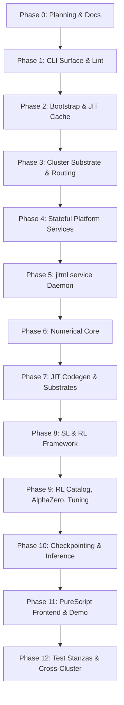

# jitML Development Plan

**Status**: Authoritative source
**Supersedes**: N/A
**Referenced by**: [../README.md](../README.md), [../AGENTS.md](../AGENTS.md),
[../CLAUDE.md](../CLAUDE.md), [../HASKELL_CLI_TOOL.md](../HASKELL_CLI_TOOL.md),
[development_plan_standards.md](development_plan_standards.md),
[00-overview.md](00-overview.md), [system-components.md](system-components.md),
[legacy-tracking-for-deletion.md](legacy-tracking-for-deletion.md),
[phase-0-planning-documentation.md](phase-0-planning-documentation.md),
[phase-1-haskell-cli-surface.md](phase-1-haskell-cli-surface.md),
[phase-2-bootstrap-reconciler-and-jit-cache.md](phase-2-bootstrap-reconciler-and-jit-cache.md),
[phase-3-cluster-substrate-and-routing.md](phase-3-cluster-substrate-and-routing.md),
[phase-4-stateful-platform-services.md](phase-4-stateful-platform-services.md),
[phase-5-jitml-service-daemon.md](phase-5-jitml-service-daemon.md),
[phase-6-numerical-core.md](phase-6-numerical-core.md),
[phase-7-jit-codegen-and-substrates.md](phase-7-jit-codegen-and-substrates.md),
[phase-8-supervised-and-rl-framework.md](phase-8-supervised-and-rl-framework.md),
[phase-9-rl-catalog-alphazero-and-tuning.md](phase-9-rl-catalog-alphazero-and-tuning.md),
[phase-10-checkpointing-and-inference.md](phase-10-checkpointing-and-inference.md),
[phase-11-purescript-frontend-and-demo.md](phase-11-purescript-frontend-and-demo.md),
[phase-12-test-stanzas-and-cross-cluster.md](phase-12-test-stanzas-and-cross-cluster.md),
[../documents/documentation_standards.md](../documents/documentation_standards.md)
**Generated sections**: none

> **Purpose**: Provide the single execution-ordered development plan for the jitML
> Haskell CLI, the three substrates (`apple-silicon`, `linux-cpu`, `linux-cuda`), the
> `jitml service` daemon, the SL/RL training stack including AlphaZero and
> hyperparameter tuning, the PureScript frontend, and the cross-cluster parity test
> surface — including phase status, validation gates, and cleanup ownership.

## Standards

See [development_plan_standards.md](development_plan_standards.md) for the
maintenance rules that govern this plan suite.

## Closure Status

Phase `0` (planning and documentation topology) is `🔄 Active` on Sprint `0.1`
(canonical plan suite bootstrap) at write time; Sprint `0.2` (doctrine-driven
scheduling audit) is `📋 Planned`. Phases `1` through `12` are all `⏸️ Blocked` on
Phase `0` closure per [development_plan_standards.md → C. Honest Completion
Tracking](development_plan_standards.md#c-honest-completion-tracking): no Haskell,
Dhall, Helm, PureScript, or shell source has been written. The repository currently
contains the project [../README.md](../README.md), the doctrine
[../HASKELL_CLI_TOOL.md](../HASKELL_CLI_TOOL.md), the agent guardrails
[../AGENTS.md](../AGENTS.md), [../CLAUDE.md](../CLAUDE.md), [../LICENSE](../LICENSE),
this `DEVELOPMENT_PLAN/` suite, and the governed docs under
[../documents/](../documents/).

This is the documentation phase. No source code lands until Sprint `0.2` closes and
the doctrine-driven scheduling audit confirms every in-scope identifier from
[../HASKELL_CLI_TOOL.md](../HASKELL_CLI_TOOL.md) is bound to an owning sprint in
Phases `1`–`12`.

## Document Index

| Document | Purpose |
|----------|---------|
| [development_plan_standards.md](development_plan_standards.md) | Conventions for maintaining the development plan |
| [00-overview.md](00-overview.md) | Vision, target outcome, doctrine scope, and hard constraints |
| [system-components.md](system-components.md) | Authoritative target component inventory for the jitML Haskell CLI, the three substrates, the daemon, the platform services, the training surfaces, and the test stanzas |
| [phase-0-planning-documentation.md](phase-0-planning-documentation.md) | Phase 0: Planning and documentation topology |
| [phase-1-haskell-cli-surface.md](phase-1-haskell-cli-surface.md) | Phase 1: Haskell CLI surface, `CommandSpec`, lint stack |
| [phase-2-bootstrap-reconciler-and-jit-cache.md](phase-2-bootstrap-reconciler-and-jit-cache.md) | Phase 2: Bootstrap reconciler, prerequisite DAG, JIT cache discipline, outer-container builds |
| [phase-3-cluster-substrate-and-routing.md](phase-3-cluster-substrate-and-routing.md) | Phase 3: Kind cluster substrate, Helm umbrella chart, Envoy Gateway, `Routes.hs` registry |
| [phase-4-stateful-platform-services.md](phase-4-stateful-platform-services.md) | Phase 4: Harbor, MinIO, Pulsar, PostgreSQL, observability stack |
| [phase-5-jitml-service-daemon.md](phase-5-jitml-service-daemon.md) | Phase 5: `jitml service` daemon (BootConfig/LiveConfig, hot reload, capability classes, at-least-once Pulsar consumer) |
| [phase-6-numerical-core.md](phase-6-numerical-core.md) | Phase 6: Layer catalog, real+complex activations, optimizers, schedulers, losses, Dhall types |
| [phase-7-jit-codegen-and-substrates.md](phase-7-jit-codegen-and-substrates.md) | Phase 7: Per-substrate JIT codegen (Metal, oneDNN, CUDA), content-addressed cache, hardware auto-tuning |
| [phase-8-supervised-and-rl-framework.md](phase-8-supervised-and-rl-framework.md) | Phase 8: Supervised learning loops, canonical SL problems, RL framework primitives |
| [phase-9-rl-catalog-alphazero-and-tuning.md](phase-9-rl-catalog-alphazero-and-tuning.md) | Phase 9: RL algorithm catalog, AlphaZero self-play, hyperparameter tuning |
| [phase-10-checkpointing-and-inference.md](phase-10-checkpointing-and-inference.md) | Phase 10: Split-blob checkpoint format, manifest, inference-only read path |
| [phase-11-purescript-frontend-and-demo.md](phase-11-purescript-frontend-and-demo.md) | Phase 11: PureScript frontend, generated browser contracts, demo HTTP server, Playwright E2E |
| [phase-12-test-stanzas-and-cross-cluster.md](phase-12-test-stanzas-and-cross-cluster.md) | Phase 12: Ten Cabal test stanzas, lint matrix, Pulumi-orchestrated cross-cluster parity, report-card knobs |
| [legacy-tracking-for-deletion.md](legacy-tracking-for-deletion.md) | Cleanup ledger |

## Status Vocabulary

| Status | Meaning | Emoji |
|--------|---------|-------|
| **Done** | Deliverables implemented for the sprint-owned surface, validated, and aligned in docs | ✅ |
| **Active** | Work has started and remaining implementation or documentation work is explicitly listed | 🔄 |
| **Planned** | Ready to start once execution reaches the sprint in sequence | 📋 |
| **Blocked** | Closure depends on an unmet prerequisite or prior sprint closure | ⏸️ |

## Definition of Done

A sprint can move to `Done` only when all of the following are true:

1. Its deliverables are implemented in the worktree.
2. Its validation commands pass through the canonical `jitml` surface (or, for Phase
   `0`, through the manual lint and grep audits named in this plan until Phase `1`
   lands the `jitml check-code` command).
3. The docs listed in `Docs to update` are aligned with the implemented behavior.
4. Sprint-owned cleanup or stand-in entries are reflected in
   [legacy-tracking-for-deletion.md](legacy-tracking-for-deletion.md).
5. No sprint-owned blocker or remaining work survives.
6. The doctrine sections the sprint adopts (when any) are cited by name in the
   `Deliverables` block per standards rule L.

## Phase Overview

| Phase | Name | Status | Document |
|-------|------|--------|----------|
| 0 | Planning and Documentation Topology | 🔄 Active (Sprint 0.1 🔄; Sprint 0.2 📋) | [phase-0-planning-documentation.md](phase-0-planning-documentation.md) |
| 1 | Haskell CLI Surface, `CommandSpec`, Lint Stack | ⏸️ Blocked (on Phase 0) | [phase-1-haskell-cli-surface.md](phase-1-haskell-cli-surface.md) |
| 2 | Bootstrap Reconciler, Prerequisite DAG, JIT Cache | ⏸️ Blocked (on Phase 0) | [phase-2-bootstrap-reconciler-and-jit-cache.md](phase-2-bootstrap-reconciler-and-jit-cache.md) |
| 3 | Cluster Substrate and Routing | ⏸️ Blocked (on Phase 0) | [phase-3-cluster-substrate-and-routing.md](phase-3-cluster-substrate-and-routing.md) |
| 4 | Stateful Platform Services | ⏸️ Blocked (on Phase 0) | [phase-4-stateful-platform-services.md](phase-4-stateful-platform-services.md) |
| 5 | `jitml service` Daemon | ⏸️ Blocked (on Phase 0) | [phase-5-jitml-service-daemon.md](phase-5-jitml-service-daemon.md) |
| 6 | Numerical Core | ⏸️ Blocked (on Phase 0) | [phase-6-numerical-core.md](phase-6-numerical-core.md) |
| 7 | JIT Codegen and Per-Substrate Execution | ⏸️ Blocked (on Phase 0) | [phase-7-jit-codegen-and-substrates.md](phase-7-jit-codegen-and-substrates.md) |
| 8 | Supervised Learning and RL Framework | ⏸️ Blocked (on Phase 0) | [phase-8-supervised-and-rl-framework.md](phase-8-supervised-and-rl-framework.md) |
| 9 | RL Algorithm Catalog, AlphaZero, and Hyperparameter Tuning | ⏸️ Blocked (on Phase 0) | [phase-9-rl-catalog-alphazero-and-tuning.md](phase-9-rl-catalog-alphazero-and-tuning.md) |
| 10 | Checkpointing and Inference-Only Read Path | ⏸️ Blocked (on Phase 0) | [phase-10-checkpointing-and-inference.md](phase-10-checkpointing-and-inference.md) |
| 11 | PureScript Frontend and Demo | ⏸️ Blocked (on Phase 0) | [phase-11-purescript-frontend-and-demo.md](phase-11-purescript-frontend-and-demo.md) |
| 12 | Test Stanzas, Lint Matrix, Cross-Cluster Parity | ⏸️ Blocked (on Phase 0) | [phase-12-test-stanzas-and-cross-cluster.md](phase-12-test-stanzas-and-cross-cluster.md) |

## Current Plan Status

The repository currently contains the project README, the doctrine, the agent
guardrails, the LICENSE, this `DEVELOPMENT_PLAN/` suite, and the governed docs
under `documents/`. There is no `app/`, `src/`, `cabal.project`, `*.cabal`,
`chart/`, `kind/`, `bootstrap/`, `docker/`, `web/`, `infra/`, `proto/`,
`codegen-cuda/`, `codegen-metal/`, `codegen-onednn/`, `experiments/`, or `test/`
directory yet. Every concrete deliverable below is a `Planned` end state, not a
current source-code artefact.

The implemented end state, once Phases `1`–`12` close, is:

- `app/Main.hs` (six-line shim into `App.main`) and `app/Demo.hs` (six-line shim for
  `jitml-demo`) plus the library-first `src/JitML/` source tree owning the CLI, the
  daemon, the cluster lifecycle, the SL/RL/AlphaZero/tuning logic, the per-substrate
  engines, the observability surfaces, and the browser-contract source.
- Three substrate bootstrap scripts (`bootstrap/{apple-silicon,linux-cpu,linux-cuda}.sh`)
  each idempotent under `help | doctor | build | up | status | test | down | purge`
  and the typed prerequisite DAG that they reconcile against.
- A single Dockerfile (`docker/Dockerfile`) producing one image (`jitml:local`) and a
  one-service `docker/compose.yaml` (service: `jitml`); substrate is a runtime Dhall
  choice, never an image-name dimension.
- The umbrella Helm chart at `chart/` with subchart dependencies for Harbor, Apache
  Pulsar, MinIO, Percona PostgreSQL, Envoy Gateway, kube-prometheus-stack, and
  TensorBoard, deployed against three per-substrate Kind cluster shapes
  (`kind/cluster-{apple-silicon,linux-cpu,linux-cuda}.yaml`).
- The single `127.0.0.1:<edge-port>` Envoy Gateway socket as the only exposed
  listener; the typed route registry in `src/JitML/Routes.hs` as the source of truth
  for every HTTPRoute manifest.
- The `jitml service` long-running daemon as the sole Pulsar consumer, parameterised
  by Dhall `BootConfig` / `LiveConfig` with mandatory SIGHUP hot reload, structured
  JSON stderr logging, recoverable-vs-fatal error kinds, at-least-once event
  processing, and a typed retry policy.
- The numerical core (layer catalog, real+complex activations, optimizers,
  schedulers, losses, spectral ops) with a Dhall type for every constructor.
- Per-substrate JIT codegen drivers (`codegen-cuda/`, `codegen-metal/`,
  `codegen-onednn/`) consuming the numerical-core types and writing into the content-
  addressed cache at `./.build/jit/<substrate>/<hash>.<ext>` with stable host-side
  symlinks at `./.build/host/apple-silicon/` for FFI dlopen stability.
- The full SL training loop, canonical SL problem set with golden curve fixtures, the
  RL framework primitives (Algorithm typeclass, Policy, Environment, VecEnv, buffers,
  schedules, action distributions, action noise, target networks, GAE, callbacks,
  multi-sink Logger, Evaluator, training loops as typed pipelines), the RL algorithm
  catalog (PPO, A2C, TRPO, MaskablePPO, RecurrentPPO, DQN, QR-DQN, DDPG, TD3, SAC,
  CrossQ, TQC, ARS, HER), AlphaZero-style self-play with persistent MCTS state, and
  the hyperparameter tuner (Sobol / random / GA / ES samplers × Fifo /
  SuccessiveHalving / Hyperband / ASHA schedulers × {none / median / percentile}
  pruners).
- The split-blob checkpoint format (`.jmw1` dense weight blob plus typed manifest)
  with the bit-determinism contract and cross-substrate tolerance methodology, the
  inference-only read path consumed by both the demo HTTP server and the PureScript
  panels.
- The PureScript frontend under `web/` (Halogen components, generated contracts from
  `src/JitML/Web/Contracts.hs` via `purescript-bridge`, `purescript-spec` unit
  tests, `playwright/` E2E suite, `dist/` bundle output) with the live MNIST
  handwriting panel, CIFAR/ImageNet upload panel, and the AlphaZero-vs-human Connect
  4 panel.
- Ten Cabal test-suite stanzas (`jitml-unit`, `jitml-integration`,
  `jitml-sl-canonicals`, `jitml-rl-canonicals`, `jitml-hyperparameter`,
  `jitml-cross-backend`, `jitml-daemon-lifecycle`, `jitml-e2e`,
  `jitml-haskell-style`, `jitml-purescript-style`), the `jitml test all`
  Plan/Apply orchestrator, the lint matrix (fourmolu + hlint + cabal format), the
  Pulumi-orchestrated ephemeral-Kind stack at `infra/pulumi/` driving the
  `jitml-e2e` stanza, and the report-card knobs pinned in `cabal.project`.

Until Phase `0` closes, these surfaces remain plan-level descriptions. No code-level
artefact is `Done`.

## Sprint Dependencies

The substrate buildout (Phases `1`–`5`) precedes any ML code so that the typed
`Subprocess`, `Plan`/`apply`, prerequisite DAG, capability-class, and at-least-once
event-processing patterns are in place before SL/RL workloads consume them. Phase `6`
(numerical core) precedes Phase `7` (JIT codegen) so the type-level layer and
optimizer catalogs are fixed before per-substrate compilers consume them. Phase `8`
owns the SL stack and the RL *framework*; Phase `9` builds on those primitives to
deliver the algorithm catalog, AlphaZero, and tuning. Phase `10` (checkpoints +
inference-only read path) precedes Phase `11` (frontend) because the frontend's REST
surfaces consume the inference-only path. Phase `12` owns testing horizontally,
gating the overall closure on the cross-substrate `jitml-cross-backend` stanza.

## Exit Definition

This plan is complete only when all of the following are true:

1. The repository holds three substrate-specific JIT codegen drivers behind one
   `jitml` Haskell binary built by Cabal under GHC `9.14.1` and Cabal `3.16.1.0`:
   `apple-silicon` via Metal codegen, `linux-cpu` via oneDNN, `linux-cuda` via CUDA.
2. `jitml service` is the canonical long-running daemon, parameterised by Dhall
   `BootConfig` / `LiveConfig`, hot-reloadable via SIGHUP, exposing `/healthz`,
   `/readyz`, and `/metrics`, emitting structured JSON logs on stderr, processing
   Pulsar events at-least-once with the typed retry policy.
3. `jitml cluster up` deploys the umbrella Helm chart against the per-substrate Kind
   cluster shape with no kubeconfig pollution (`~/.kube/config` untouched), exposes
   exactly one `127.0.0.1:<edge-port>` Envoy Gateway socket, and routes every
   HTTPRoute through the `src/JitML/Routes.hs` registry.
4. The bootstrap script for each substrate is idempotent under
   `help | doctor | build | up | status | test | down | purge` and reconciles the
   typed prerequisite DAG; failure emits `AppError PrerequisiteUnmet` carrying the
   failing `nodeId`, description, and remedy hint.
5. The numerical core (layer catalog, real+complex activations, optimizers,
   schedulers, losses, spectral ops) is exposed in Dhall, the JIT codegen drivers
   are content-addressed by `(model shape, kind, substrate, toolchain)`, and the
   per-substrate determinism contract from
   [../documents/engineering/determinism_contract.md](../documents/engineering/determinism_contract.md)
   holds.
6. `jitml train`, `jitml rl train`, and `jitml tune` Plan/Apply commands run the
   full SL/RL/AlphaZero workloads, hyperparameter tuning is `Some Tuning::{ … }`-shaped per the worked
   Dhall example in [../README.md → Concrete Dhall worked
   example](../README.md), and golden tests for SL convergence and RL trajectories
   pass under `jitml test all`.
7. Checkpoints write the split-blob `.jmw1` format with the typed manifest and the
   inference-only read path; the bit-determinism contract holds within the per-
   substrate ULP tolerance methodology.
8. The PureScript frontend under `web/` is generated from
   `src/JitML/Web/Contracts.hs` via `purescript-bridge`, the live MNIST handwriting
   panel, CIFAR/ImageNet upload panel, and the AlphaZero-vs-human Connect 4 panel
   are exercised end-to-end by Playwright, and `jitml-demo` serves the bundle.
9. `jitml test all` runs every Cabal test-suite stanza (`jitml-unit`,
   `jitml-integration`, `jitml-sl-canonicals`, `jitml-rl-canonicals`,
   `jitml-hyperparameter`, `jitml-cross-backend`, `jitml-daemon-lifecycle`,
   `jitml-e2e`, `jitml-haskell-style`, `jitml-purescript-style`) with the
   report-card knobs pinned in `cabal.project`; the `jitml-e2e` stanza
   orchestrates an ephemeral Kind stack via the `infra/pulumi/` TypeScript
   program.
10. The toolchain is pinned at GHC `9.14.1` and Cabal `3.16.1.0`. `jitml.cabal`
    declares `tested-with: ghc ==9.14.1` and `cabal.project` declares
    `with-compiler: ghc-9.14.1`.
11. Every Plan/Apply command (`jitml train`, `jitml tune`, `jitml rl train`,
    `jitml cluster up`, `jitml test all`, `jitml service` startup-as-plan,
    `jitml internal gc`) supports `--dry-run` and `--plan-file <path>`.
12. `Subprocess` is the only IO boundary for subprocess execution; `kubectl`,
    `helm`, `kind`, `docker`, and the per-substrate kernel compilers
    (`metal`, `nvcc`, `g++` over oneDNN) are wrapped through the typed boundary.
13. One `prerequisiteRegistry` spans every substrate's toolchain, the cluster
    lifecycle, the platform services, and the daemon's startup contract.
14. Single `AppError` ADT with `renderError :: AppError -> Text` as the only Text
    rendering at the CLI boundary; the canonical `AppError` variants are enumerated
    in [system-components.md → CLI Doctrine
    Components](system-components.md#cli-doctrine-components) and instantiated by
    Sprint `1.9`.
15. `fourmolu.yaml` at repo root pins the twelve doctrine-mandated settings; the
    `jitml-haskell-style` stanza enforces them plus the `cabal format` temp-file
    round-trip byte-equality check, and `jitml-purescript-style` extends the lint
    surface to PureScript `purs format` round-trip and `purescript-spec` smoke
    tests.
16. `CommandSpec` is the implementation source for the parser, the command tree
    (`jitml commands --tree`), the JSON command schema (`jitml commands --json`),
    the markdown command reference, the manpages, and the shell completion scripts.
17. The route registry `src/JitML/Routes.hs` is the source of truth for every
    HTTPRoute resource emitted by the umbrella chart's renderer.
18. [legacy-tracking-for-deletion.md](legacy-tracking-for-deletion.md) contains no
    unresolved cleanup once Phase `12` closes.

## Related Documents

- [00-overview.md](00-overview.md)
- [development_plan_standards.md](development_plan_standards.md)
- [system-components.md](system-components.md)
- [legacy-tracking-for-deletion.md](legacy-tracking-for-deletion.md)
- [../HASKELL_CLI_TOOL.md](../HASKELL_CLI_TOOL.md)
- [../documents/documentation_standards.md](../documents/documentation_standards.md)
