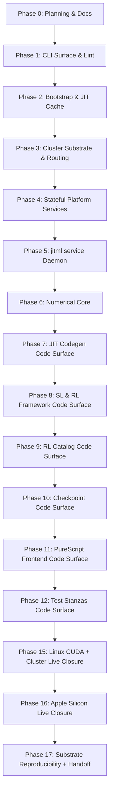

# jitML Development Plan

**Status**: Authoritative source
**Supersedes**: N/A
**Referenced by**: [../README.md](../README.md), [../AGENTS.md](../AGENTS.md), [../CLAUDE.md](../CLAUDE.md), [development_plan_standards.md](development_plan_standards.md), [00-overview.md](00-overview.md), [system-components.md](system-components.md), [legacy-tracking-for-deletion.md](legacy-tracking-for-deletion.md), [../documents/documentation_standards.md](../documents/documentation_standards.md), [../documents/engineering/run_contract.md](../documents/engineering/run_contract.md), [phase-1-canonical-plan-suite-bootstrap.md](phase-1-canonical-plan-suite-bootstrap.md), [phase-2-doctrine-driven-scheduling-audit.md](phase-2-doctrine-driven-scheduling-audit.md), [phase-3-governed-document-metadata-enforcement.md](phase-3-governed-document-metadata-enforcement.md), [phase-4-toolchain-pin-and-library-first-cabal-project.md](phase-4-toolchain-pin-and-library-first-cabal-project.md), [phase-5-commandspec-registry-and-generated-parser.md](phase-5-commandspec-registry-and-generated-parser.md), [phase-6-generated-sections-and-tracking-generated-paths.md](phase-6-generated-sections-and-tracking-generated-paths.md), [phase-7-lint-stack-fourmolu-hlint-cabal-format-forbiddenpathregistry.md](phase-7-lint-stack-fourmolu-hlint-cabal-format-forbiddenpathregistry.md), [phase-8-plan-apply-boundary-with-dry-run-and-plan-file.md](phase-8-plan-apply-boundary-with-dry-run-and-plan-file.md), [phase-9-subprocess-typed-values-runstreaming-capture-interpreter.md](phase-9-subprocess-typed-values-runstreaming-capture-interpreter.md), [phase-10-prerequisite-registry-as-typed-effects.md](phase-10-prerequisite-registry-as-typed-effects.md), [phase-11-env-record-and-readert-env-io-runner.md](phase-11-env-record-and-readert-env-io-runner.md), [phase-12-apperror-adt-rendererror-output-rules.md](phase-12-apperror-adt-rendererror-output-rules.md), [phase-13-scoped-allow-newer-retirement-gate.md](phase-13-scoped-allow-newer-retirement-gate.md), [phase-14-ghc-9-12-4-baseline-and-dependency-helper-retirement.md](phase-14-ghc-9-12-4-baseline-and-dependency-helper-retirement.md), [phase-15-cli-dhall-overrides.md](phase-15-cli-dhall-overrides.md), [phase-16-remove-verify-cross-backend-add-jitml-test-test-options-pass.md](phase-16-remove-verify-cross-backend-add-jitml-test-test-options-pass.md), [phase-17-reinstate-the-jitml-internal-vm-build-vm-command-surface.md](phase-17-reinstate-the-jitml-internal-vm-build-vm-command-surface.md), [phase-18-retire-vm-lifecycle-commands-for-fixed-bridge-apple-metal.md](phase-18-retire-vm-lifecycle-commands-for-fixed-bridge-apple-metal.md), [phase-19-remove-placeholder-top-level-cli-groups.md](phase-19-remove-placeholder-top-level-cli-groups.md), [phase-20-typed-numeric-cli-parsing-and-generated-only-command-referen.md](phase-20-typed-numeric-cli-parsing-and-generated-only-command-referen.md), [phase-21-structured-subprocess-outcomes.md](phase-21-structured-subprocess-outcomes.md), [phase-22-stage-0-bootstrap-gates-and-delegation.md](phase-22-stage-0-bootstrap-gates-and-delegation.md), [phase-23-populated-prerequisiteregistry-and-lazy-remediation.md](phase-23-populated-prerequisiteregistry-and-lazy-remediation.md), [phase-24-jit-cache-layout-and-content-addressing.md](phase-24-jit-cache-layout-and-content-addressing.md), [phase-25-outer-container-linux-builds-and-jitml-local-image.md](phase-25-outer-container-linux-builds-and-jitml-local-image.md), [phase-26-superseded-apple-silicon-vm-scaffold.md](phase-26-superseded-apple-silicon-vm-scaffold.md), [phase-27-bootstrap-script-wrappers-and-status.md](phase-27-bootstrap-script-wrappers-and-status.md), [phase-28-bootstrap-down-and-purge.md](phase-28-bootstrap-down-and-purge.md), [phase-29-dhall-cluster-resource-profile-kind-node-cap-and-host-ram-pr.md](phase-29-dhall-cluster-resource-profile-kind-node-cap-and-host-ram-pr.md), [phase-30-reconciler-sh-c-control-flow-typed-haskell.md](phase-30-reconciler-sh-c-control-flow-typed-haskell.md), [phase-31-retire-the-tart-prerequisite-and-jitml-internal-vm-commands.md](phase-31-retire-the-tart-prerequisite-and-jitml-internal-vm-commands.md), [phase-32-reinstate-the-tart-build-vm-prerequisite-and-lifecycle.md](phase-32-reinstate-the-tart-build-vm-prerequisite-and-lifecycle.md), [phase-33-replace-tart-prerequisites-with-fixed-bridge-apple-cache-pre.md](phase-33-replace-tart-prerequisites-with-fixed-bridge-apple-cache-pre.md), [phase-34-authenticated-third-party-image-pre-pull-before-kind-load.md](phase-34-authenticated-third-party-image-pre-pull-before-kind-load.md), [phase-35-in-cluster-docker-hub-imagepullsecret-authenticated-pod-pull.md](phase-35-in-cluster-docker-hub-imagepullsecret-authenticated-pod-pull.md), [phase-36-durable-state-dhall-dsl-foundation-and-jitml-project-init.md](phase-36-durable-state-dhall-dsl-foundation-and-jitml-project-init.md), [phase-37-per-substrate-kind-configs-and-extramounts.md](phase-37-per-substrate-kind-configs-and-extramounts.md), [phase-38-kubernetes-io-no-provisioner-storage-and-manual-pvs.md](phase-38-kubernetes-io-no-provisioner-storage-and-manual-pvs.md), [phase-39-envoy-gateway-and-single-127-0-0-1-edge-port-listener.md](phase-39-envoy-gateway-and-single-127-0-0-1-edge-port-listener.md), [phase-40-typed-route-registry-and-generated-httproute-manifests.md](phase-40-typed-route-registry-and-generated-httproute-manifests.md), [phase-41-cluster-lifecycle-reconciler-and-phased-deploy.md](phase-41-cluster-lifecycle-reconciler-and-phased-deploy.md), [phase-42-ha-kind-node-and-manual-pv-topology.md](phase-42-ha-kind-node-and-manual-pv-topology.md), [phase-43-live-cluster-lifecycle-and-publication-truth.md](phase-43-live-cluster-lifecycle-and-publication-truth.md), [phase-44-harbor-subchart-and-bootstrap-phase-install.md](phase-44-harbor-subchart-and-bootstrap-phase-install.md), [phase-45-percona-pg-operator-and-patroni-managed-service-postgres.md](phase-45-percona-pg-operator-and-patroni-managed-service-postgres.md), [phase-46-minio-subchart-bucket-provisioning-conditional-write-server.md](phase-46-minio-subchart-bucket-provisioning-conditional-write-server.md), [phase-47-apache-pulsar-ha-and-topic-bootstrap.md](phase-47-apache-pulsar-ha-and-topic-bootstrap.md), [phase-48-kube-prometheus-stack-and-provisioned-dashboards.md](phase-48-kube-prometheus-stack-and-provisioned-dashboards.md), [phase-49-tensorboard-with-minio-event-storage-and-checkpoint-sidecar.md](phase-49-tensorboard-with-minio-event-storage-and-checkpoint-sidecar.md), [phase-50-nvidia-runtimeclass-for-linux-cuda.md](phase-50-nvidia-runtimeclass-for-linux-cuda.md), [phase-51-per-pod-resource-limits-and-right-sized-replicas-from-the-dh.md](phase-51-per-pod-resource-limits-and-right-sized-replicas-from-the-dh.md), [phase-52-project-the-durable-state-storeregistry-over-minio-buckets.md](phase-52-project-the-durable-state-storeregistry-over-minio-buckets.md), [phase-53-ha-platform-service-topology.md](phase-53-ha-platform-service-topology.md), [phase-54-jitml-service-entry-point-and-lifecycle-summary.md](phase-54-jitml-service-entry-point-and-lifecycle-summary.md), [phase-55-bootconfig-liveconfig-dhall-and-hot-reload-schema-surface.md](phase-55-bootconfig-liveconfig-dhall-and-hot-reload-schema-surface.md), [phase-56-healthz-readyz-metrics-and-structured-logging.md](phase-56-healthz-readyz-metrics-and-structured-logging.md), [phase-57-retrypolicy-and-service-error-surface.md](phase-57-retrypolicy-and-service-error-surface.md), [phase-58-at-least-once-pulsar-consumer-with-message-hash-deduplicatio.md](phase-58-at-least-once-pulsar-consumer-with-message-hash-deduplicatio.md), [phase-59-stateless-deployment-pod-anti-affinity-per-substrate-dhall.md](phase-59-stateless-deployment-pod-anti-affinity-per-substrate-dhall.md), [phase-60-typed-dhall-runconfig-and-bootconfig-mounted-worker-dispatch.md](phase-60-typed-dhall-runconfig-and-bootconfig-mounted-worker-dispatch.md), [phase-61-retire-tart-vm-lifecycle-from-the-daemon.md](phase-61-retire-tart-vm-lifecycle-from-the-daemon.md), [phase-62-reinstate-the-dhall-configured-build-vm-block-and-daemon-acq.md](phase-62-reinstate-the-dhall-configured-build-vm-block-and-daemon-acq.md), [phase-63-replace-daemon-build-vm-acquire-with-metal-bridge-acquire.md](phase-63-replace-daemon-build-vm-acquire-with-metal-bridge-acquire.md), [phase-64-workload-placement-planner-and-apple-host-workload-dispatch.md](phase-64-workload-placement-planner-and-apple-host-workload-dispatch.md), [phase-65-reflected-dhall-schema.md](phase-65-reflected-dhall-schema.md), [phase-66-coordinator-topic-algebra.md](phase-66-coordinator-topic-algebra.md), [phase-67-one-binary-engine-coordinator-webapp-role-model.md](phase-67-one-binary-engine-coordinator-webapp-role-model.md), [phase-68-reconcile-the-pulsar-topic-family-with-the-storeregistry.md](phase-68-reconcile-the-pulsar-topic-family-with-the-storeregistry.md), [phase-69-one-numerical-worker-per-kubernetes-node.md](phase-69-one-numerical-worker-per-kubernetes-node.md), [phase-70-fail-closed-mounted-worker-runconfig.md](phase-70-fail-closed-mounted-worker-runconfig.md), [phase-71-receipt-bound-delivery-and-total-settlement.md](phase-71-receipt-bound-delivery-and-total-settlement.md), [phase-72-layer-catalog.md](phase-72-layer-catalog.md), [phase-73-activations-real-and-complex.md](phase-73-activations-real-and-complex.md), [phase-74-spectral-frequency-domain-operations.md](phase-74-spectral-frequency-domain-operations.md), [phase-75-optimizers-and-schedulers.md](phase-75-optimizers-and-schedulers.md), [phase-76-loss-functions.md](phase-76-loss-functions.md), [phase-77-dhall-schemas-and-cross-type-audit.md](phase-77-dhall-schemas-and-cross-type-audit.md), [phase-78-kernelspec-cache-key-inputs-ffi-loader-surface.md](phase-78-kernelspec-cache-key-inputs-ffi-loader-surface.md), [phase-79-engine-abi-and-engines-module-skeleton.md](phase-79-engine-abi-and-engines-module-skeleton.md), [phase-80-linux-cpu-engine-and-onednn-codegen-driver.md](phase-80-linux-cpu-engine-and-onednn-codegen-driver.md), [phase-81-linux-cuda-engine-and-cuda-codegen-driver.md](phase-81-linux-cuda-engine-and-cuda-codegen-driver.md), [phase-82-apple-silicon-engine-metal-codegen-host-forwarding-scaffoldi.md](phase-82-apple-silicon-engine-metal-codegen-host-forwarding-scaffoldi.md), [phase-83-hardware-auto-tuning-within-the-determinism-contract.md](phase-83-hardware-auto-tuning-within-the-determinism-contract.md), [phase-84-haskell-owned-runtime-jit-source-generation.md](phase-84-haskell-owned-runtime-jit-source-generation.md), [phase-85-headless-apple-metal-jit-runtime-compilation-host-swift-buil.md](phase-85-headless-apple-metal-jit-runtime-compilation-host-swift-buil.md), [phase-86-compose-gpu-service-split.md](phase-86-compose-gpu-service-split.md), [phase-87-route-the-apple-swift-build-through-the-tart-vm.md](phase-87-route-the-apple-swift-build-through-the-tart-vm.md), [phase-88-fixed-host-metal-bridge-and-source-metadata-apple-cache.md](phase-88-fixed-host-metal-bridge-and-source-metadata-apple-cache.md), [phase-89-local-supervised-canonical-summaries.md](phase-89-local-supervised-canonical-summaries.md), [phase-90-jitml-train-local-cli-summary.md](phase-90-jitml-train-local-cli-summary.md), [phase-91-rl-catalog-hook-for-canonical-tests.md](phase-91-rl-catalog-hook-for-canonical-tests.md), [phase-92-rl-metadata-primitives.md](phase-92-rl-metadata-primitives.md), [phase-93-rl-cli-summaries-and-report-hooks.md](phase-93-rl-cli-summaries-and-report-hooks.md), [phase-94-rl-training-plan-surface.md](phase-94-rl-training-plan-surface.md), [phase-95-rlrunlifecycle-gadt-retrofit.md](phase-95-rlrunlifecycle-gadt-retrofit.md), [phase-96-ale-boundary-and-rom-policy.md](phase-96-ale-boundary-and-rom-policy.md), [phase-97-copyright-free-visual-rl-demo-environment.md](phase-97-copyright-free-visual-rl-demo-environment.md), [phase-98-sl-substrate-backed-training-real-eval.md](phase-98-sl-substrate-backed-training-real-eval.md), [phase-99-rl-framework-substrate-routing.md](phase-99-rl-framework-substrate-routing.md), [phase-100-no-caveat-sl-rl-framework-runtime.md](phase-100-no-caveat-sl-rl-framework-runtime.md), [phase-101-real-sl-loss-validation-driven-selection-and-convergence-per.md](phase-101-real-sl-loss-validation-driven-selection-and-convergence-per.md), [phase-102-fixed-budget-training-witness-and-inference-ineligible-parti.md](phase-102-fixed-budget-training-witness-and-inference-ineligible-parti.md), [phase-103-typed-fail-closed-rl-device-errors.md](phase-103-typed-fail-closed-rl-device-errors.md), [phase-104-validated-runplan-and-pure-contract-algebra.md](phase-104-validated-runplan-and-pure-contract-algebra.md), [phase-105-on-policy-algorithm-metadata.md](phase-105-on-policy-algorithm-metadata.md), [phase-106-off-policy-algorithm-metadata.md](phase-106-off-policy-algorithm-metadata.md), [phase-107-specialised-algorithm-metadata.md](phase-107-specialised-algorithm-metadata.md), [phase-108-local-rl-canonical-tests.md](phase-108-local-rl-canonical-tests.md), [phase-109-alphazero-connect-4-transcript-surface.md](phase-109-alphazero-connect-4-transcript-surface.md), [phase-110-connect-4-local-game-surface.md](phase-110-connect-4-local-game-surface.md), [phase-111-hyperparameter-tuning-sampler-scheduler-pruner.md](phase-111-hyperparameter-tuning-sampler-scheduler-pruner.md), [phase-112-copyright-free-rl-matrix-retargeting.md](phase-112-copyright-free-rl-matrix-retargeting.md), [phase-113-real-rl-eval-rollout-and-per-algorithm-on-device-rollouts.md](phase-113-real-rl-eval-rollout-and-per-algorithm-on-device-rollouts.md), [phase-114-real-mcts-tree-search-with-substrate-backed-leaf-evaluation.md](phase-114-real-mcts-tree-search-with-substrate-backed-leaf-evaluation.md), [phase-115-real-hyperparameter-tuning-objective-executor.md](phase-115-real-hyperparameter-tuning-objective-executor.md), [phase-116-no-caveat-rl-alphazero-and-tuning-runtime.md](phase-116-no-caveat-rl-alphazero-and-tuning-runtime.md), [phase-117-real-rl-convergence-performance-metrics-and-the-alphazero-ar.md](phase-117-real-rl-convergence-performance-metrics-and-the-alphazero-ar.md), [phase-118-all-rl-fixed-budget-convergence-metrics.md](phase-118-all-rl-fixed-budget-convergence-metrics.md), [phase-119-typed-tuning-resume-decode-failures.md](phase-119-typed-tuning-resume-decode-failures.md), [phase-120-tuning-override-and-worker-axis-fidelity.md](phase-120-tuning-override-and-worker-axis-fidelity.md), [phase-121-resolved-alphazero-and-tuning-plans.md](phase-121-resolved-alphazero-and-tuning-plans.md), [phase-122-storage-layout-and-split-blob-schema.md](phase-122-storage-layout-and-split-blob-schema.md), [phase-123-jmw1-wire-format-and-manifest-cbor.md](phase-123-jmw1-wire-format-and-manifest-cbor.md), [phase-124-bit-determinism-contract-and-retention-reconciler.md](phase-124-bit-determinism-contract-and-retention-reconciler.md), [phase-125-inference-only-read-path.md](phase-125-inference-only-read-path.md), [phase-126-remove-the-synthetic-inference-offset.md](phase-126-remove-the-synthetic-inference-offset.md), [phase-127-exact-v2-supervised-runtime-artifact.md](phase-127-exact-v2-supervised-runtime-artifact.md), [phase-128-async-work-inference-workflow-and-ready-readiness-gate.md](phase-128-async-work-inference-workflow-and-ready-readiness-gate.md), [phase-129-typed-retentionpolicy-replaces-the-lastn-5-literal.md](phase-129-typed-retentionpolicy-replaces-the-lastn-5-literal.md), [phase-130-real-trained-demo-checkpoints-delete-the-synthetic-weight-ra.md](phase-130-real-trained-demo-checkpoints-delete-the-synthetic-weight-ra.md), [phase-131-inference-eligible-checkpoints-and-convergence-statistics.md](phase-131-inference-eligible-checkpoints-and-convergence-statistics.md), [phase-132-typed-checkpoint-object-key-validation.md](phase-132-typed-checkpoint-object-key-validation.md), [phase-133-persisted-checkpoint-proof-admission.md](phase-133-persisted-checkpoint-proof-admission.md), [phase-134-minimal-purescript-application-scaffold.md](phase-134-minimal-purescript-application-scaffold.md), [phase-135-browser-contract-adts-and-local-contract-rendering.md](phase-135-browser-contract-adts-and-local-contract-rendering.md), [phase-136-jitml-lint-purescript-generated-contract-smoke-target.md](phase-136-jitml-lint-purescript-generated-contract-smoke-target.md), [phase-137-interactive-endpoint-contract-surface.md](phase-137-interactive-endpoint-contract-surface.md), [phase-138-webapp-route-and-deployment-surface.md](phase-138-webapp-route-and-deployment-surface.md), [phase-139-playwright-e2e-suite.md](phase-139-playwright-e2e-suite.md), [phase-140-spa-portals-home-and-shared-header.md](phase-140-spa-portals-home-and-shared-header.md), [phase-141-demo-endpoints-render-real-substrate-output.md](phase-141-demo-endpoints-render-real-substrate-output.md), [phase-142-full-interactive-demo-surface.md](phase-142-full-interactive-demo-surface.md), [phase-143-webapp-role-and-websocket-driven-inference-panels.md](phase-143-webapp-role-and-websocket-driven-inference-panels.md), [phase-144-all-model-trained-artifact-ui-and-admin-navigation.md](phase-144-all-model-trained-artifact-ui-and-admin-navigation.md), [phase-145-jitml-unit-stanza.md](phase-145-jitml-unit-stanza.md), [phase-146-jitml-integration-stanza-subprocess-boundary-determinism.md](phase-146-jitml-integration-stanza-subprocess-boundary-determinism.md), [phase-147-jitml-sl-canonicals-stanza.md](phase-147-jitml-sl-canonicals-stanza.md), [phase-148-jitml-rl-canonicals-stanza.md](phase-148-jitml-rl-canonicals-stanza.md), [phase-149-jitml-hyperparameter-stanza.md](phase-149-jitml-hyperparameter-stanza.md), [phase-150-jitml-cross-backend-stanza.md](phase-150-jitml-cross-backend-stanza.md), [phase-151-jitml-daemon-lifecycle-stanza.md](phase-151-jitml-daemon-lifecycle-stanza.md), [phase-152-jitml-e2e-stanza-and-live-plan-orchestrator.md](phase-152-jitml-e2e-stanza-and-live-plan-orchestrator.md), [phase-153-jitml-test-all-orchestrator-and-report-card.md](phase-153-jitml-test-all-orchestrator-and-report-card.md), [phase-154-substrate-partitioned-test-lanes-remove-the-cross-substrate.md](phase-154-substrate-partitioned-test-lanes-remove-the-cross-substrate.md), [phase-155-dry-real-workflow-matrix-fail-closed.md](phase-155-dry-real-workflow-matrix-fail-closed.md), [phase-156-live-job-failure-observation-and-apple-placement-assertions.md](phase-156-live-job-failure-observation-and-apple-placement-assertions.md), [phase-157-playwright-no-caveat-e2e-matrix.md](phase-157-playwright-no-caveat-e2e-matrix.md), [phase-158-common-shape-workflow-topic-algebra-and-websocket-coverage.md](phase-158-common-shape-workflow-topic-algebra-and-websocket-coverage.md), [phase-159-per-model-integration-and-e2e-matrix.md](phase-159-per-model-integration-and-e2e-matrix.md), [phase-160-functional-core-live-workflow-interpreter.md](phase-160-functional-core-live-workflow-interpreter.md), [phase-161-full-canonical-model-matrix-runtime.md](phase-161-full-canonical-model-matrix-runtime.md), [phase-162-re-attest-the-no-caveat-runtime-with-real-losses-metrics.md](phase-162-re-attest-the-no-caveat-runtime-with-real-losses-metrics.md), [phase-163-fixed-budget-all-model-runtime-gate-linux-cpu.md](phase-163-fixed-budget-all-model-runtime-gate-linux-cpu.md), [phase-164-full-workflow-control-surface.md](phase-164-full-workflow-control-surface.md), [phase-165-playwright-no-caveat-product-matrix.md](phase-165-playwright-no-caveat-product-matrix.md), [phase-166-real-demo-inference-full-width-multi-layer-forward-real-inpu.md](phase-166-real-demo-inference-full-width-multi-layer-forward-real-inpu.md), [phase-167-all-model-browser-and-playwright-trained-artifact-matrix.md](phase-167-all-model-browser-and-playwright-trained-artifact-matrix.md), [phase-168-ephemeral-kind-helm-rollout.md](phase-168-ephemeral-kind-helm-rollout.md), [phase-169-live-capability-class-validation-minio-pulsar-harbor.md](phase-169-live-capability-class-validation-minio-pulsar-harbor.md), [phase-170-daemon-training-rl-tune-handlers-on-live-broker.md](phase-170-daemon-training-rl-tune-handlers-on-live-broker.md), [phase-171-live-sl-training-e2e-with-real-datasets.md](phase-171-live-sl-training-e2e-with-real-datasets.md), [phase-172-real-rl-environment-simulators-and-daemon-env-loop.md](phase-172-real-rl-environment-simulators-and-daemon-env-loop.md), [phase-173-live-rl-training-e2e-with-statistical-convergence-assertions.md](phase-173-live-rl-training-e2e-with-statistical-convergence-assertions.md), [phase-174-live-minio-checkpoint-round-trip-and-retention.md](phase-174-live-minio-checkpoint-round-trip-and-retention.md), [phase-175-real-cuda-rl-algorithm-losses-through-jit-engine.md](phase-175-real-cuda-rl-algorithm-losses-through-jit-engine.md), [phase-176-alphazero-with-real-network-priors.md](phase-176-alphazero-with-real-network-priors.md), [phase-177-live-tuning-sweep-with-minio-trial-persistence.md](phase-177-live-tuning-sweep-with-minio-trial-persistence.md), [phase-178-cuda-and-linux-cpu-production-weight-loading.md](phase-178-cuda-and-linux-cpu-production-weight-loading.md), [phase-179-live-jitml-inference-run-and-legacy-replay-helper.md](phase-179-live-jitml-inference-run-and-legacy-replay-helper.md), [phase-180-live-api-ws-websocket-proxy-and-compiled-halogen-bundle.md](phase-180-live-api-ws-websocket-proxy-and-compiled-halogen-bundle.md), [phase-181-live-playwright-on-demo-edge-route.md](phase-181-live-playwright-on-demo-edge-route.md), [phase-182-linux-cpu-full-tensor-benchmark-payloads-and-first-cache-mis.md](phase-182-linux-cpu-full-tensor-benchmark-payloads-and-first-cache-mis.md), [phase-183-re-validate-the-linux-cuda-lane-runs-for-real-with-the-skip.md](phase-183-re-validate-the-linux-cuda-lane-runs-for-real-with-the-skip.md), [phase-184-live-linux-cpu-exercise-of-the-reopened-workflows.md](phase-184-live-linux-cpu-exercise-of-the-reopened-workflows.md), [phase-185-live-linux-cuda-exercise-of-the-reopened-workflows.md](phase-185-live-linux-cuda-exercise-of-the-reopened-workflows.md), [phase-186-live-cluster-closure-of-the-reopened-workflows.md](phase-186-live-cluster-closure-of-the-reopened-workflows.md), [phase-187-linux-no-caveat-runtime-and-browser-lane.md](phase-187-linux-no-caveat-runtime-and-browser-lane.md), [phase-188-linux-cuda-all-model-trained-artifact-lane.md](phase-188-linux-cuda-all-model-trained-artifact-lane.md), [phase-189-linux-cuda-ha-cluster-revalidation.md](phase-189-linux-cuda-ha-cluster-revalidation.md), [phase-190-host-swift-toolchain-and-first-cache-miss-headless-build.md](phase-190-host-swift-toolchain-and-first-cache-miss-headless-build.md), [phase-191-metal-ffi-loading-and-host-kernel-launch.md](phase-191-metal-ffi-loading-and-host-kernel-launch.md), [phase-192-metal-benchmark-candidate-runner-live-execution.md](phase-192-metal-benchmark-candidate-runner-live-execution.md), [phase-193-apple-host-cluster-pulsar-rpc-live-flow.md](phase-193-apple-host-cluster-pulsar-rpc-live-flow.md), [phase-194-apple-metal-production-weight-loading.md](phase-194-apple-metal-production-weight-loading.md), [phase-195-re-validate-the-apple-silicon-lane-runs-for-real-with-the-sk.md](phase-195-re-validate-the-apple-silicon-lane-runs-for-real-with-the-sk.md), [phase-196-re-validate-the-apple-silicon-lane-through-the-tart-vm-built.md](phase-196-re-validate-the-apple-silicon-lane-through-the-tart-vm-built.md), [phase-197-retired-vm-path-apple-silicon-workflow-attempt.md](phase-197-retired-vm-path-apple-silicon-workflow-attempt.md), [phase-198-live-fixed-bridge-apple-silicon-workflow-closure.md](phase-198-live-fixed-bridge-apple-silicon-workflow-closure.md), [phase-199-live-apple-host-resident-workload-closure.md](phase-199-live-apple-host-resident-workload-closure.md), [phase-200-apple-no-caveat-runtime-and-browser-lane.md](phase-200-apple-no-caveat-runtime-and-browser-lane.md), [phase-201-apple-silicon-all-model-trained-artifact-lane.md](phase-201-apple-silicon-all-model-trained-artifact-lane.md), [phase-202-apple-silicon-ha-cluster-revalidation.md](phase-202-apple-silicon-ha-cluster-revalidation.md), [phase-203-cross-substrate-cohort-runs-and-in-code-tolerance-bands.md](phase-203-cross-substrate-cohort-runs-and-in-code-tolerance-bands.md), [phase-204-live-jitml-test-all-report-card-with-measured-metrics.md](phase-204-live-jitml-test-all-report-card-with-measured-metrics.md), [phase-205-empty-legacy-ledger-and-final-handoff.md](phase-205-empty-legacy-ledger-and-final-handoff.md), [phase-206-remove-the-cross-substrate-parity-surface-reframe-the-determ.md](phase-206-remove-the-cross-substrate-parity-surface-reframe-the-determ.md), [phase-207-cross-substrate-real-workflow-confirmation.md](phase-207-cross-substrate-real-workflow-confirmation.md), [phase-208-real-workflow-ledger-walk-down-and-final-handoff.md](phase-208-real-workflow-ledger-walk-down-and-final-handoff.md), [phase-209-apple-placement-ledger-walk-down-and-final-handoff.md](phase-209-apple-placement-ledger-walk-down-and-final-handoff.md), [phase-210-expanded-no-caveat-report-card-and-ledger-handoff.md](phase-210-expanded-no-caveat-report-card-and-ledger-handoff.md), [phase-211-expanded-all-model-lane-fragment-handoff.md](phase-211-expanded-all-model-lane-fragment-handoff.md), [phase-212-ha-topology-aggregation.md](phase-212-ha-topology-aggregation.md), [phase-213-three-substrate-no-caveat-handoff.md](phase-213-three-substrate-no-caveat-handoff.md), [phase-214-re-aggregate-the-no-caveat-handoff-after-the-durable-state-d.md](phase-214-re-aggregate-the-no-caveat-handoff-after-the-durable-state-d.md), [phase-215-re-aggregate-the-no-caveat-handoff-after-the-real-sl-rl-chai.md](phase-215-re-aggregate-the-no-caveat-handoff-after-the-real-sl-rl-chai.md), [phase-216-re-aggregate-after-fixed-budget-all-model-closure.md](phase-216-re-aggregate-after-fixed-budget-all-model-closure.md), [phase-217-ha-topology-product-handoff.md](phase-217-ha-topology-product-handoff.md), [phase-218-re-aggregate-after-typed-failure-and-docs-governance-remedia.md](phase-218-re-aggregate-after-typed-failure-and-docs-governance-remedia.md), [phase-219-re-aggregate-after-real-cluster-tuning-runconfig-remediation.md](phase-219-re-aggregate-after-real-cluster-tuning-runconfig-remediation.md), [phase-220-product-matrix-authority.md](phase-220-product-matrix-authority.md), [phase-221-phase-status-registry.md](phase-221-phase-status-registry.md), [phase-222-status-truth-enforcement.md](phase-222-status-truth-enforcement.md), [phase-223-product-registry-plan-and-admitted-evidence-projection.md](phase-223-product-registry-plan-and-admitted-evidence-projection.md), [phase-224-remove-fossils.md](phase-224-remove-fossils.md), [phase-225-scaffold-lint-reachability.md](phase-225-scaffold-lint-reachability.md), [phase-226-non-fabricable-training-evidence.md](phase-226-non-fabricable-training-evidence.md), [phase-227-type-state-pipeline-haskell.md](phase-227-type-state-pipeline-haskell.md), [phase-228-dhall-boundary-fail-closed-decode.md](phase-228-dhall-boundary-fail-closed-decode.md), [phase-229-phase-specific-product-evidence-payloads.md](phase-229-phase-specific-product-evidence-payloads.md), [phase-230-matrix-parity.md](phase-230-matrix-parity.md), [phase-231-per-row-runnable-dhall.md](phase-231-per-row-runnable-dhall.md), [phase-232-read-time-dataset-sha.md](phase-232-read-time-dataset-sha.md), [phase-233-typed-layer-ir-reverse-mode-autodiff.md](phase-233-typed-layer-ir-reverse-mode-autodiff.md), [phase-234-onednn-layer-kernels-for-training.md](phase-234-onednn-layer-kernels-for-training.md), [phase-235-one-self-describing-checkpoint-envelope.md](phase-235-one-self-describing-checkpoint-envelope.md), [phase-236-checkpoint-admission-single-path.md](phase-236-checkpoint-admission-single-path.md), [phase-237-supervised-serving-on-the-layer-graph-ir.md](phase-237-supervised-serving-on-the-layer-graph-ir.md), [phase-238-supervised-training-on-the-layer-graph-ir.md](phase-238-supervised-training-on-the-layer-graph-ir.md), [phase-239-checkpoint-construction-from-the-trained-graph.md](phase-239-checkpoint-construction-from-the-trained-graph.md), [phase-240-layer-graph-checkpoints-inference.md](phase-240-layer-graph-checkpoints-inference.md), [phase-241-onednn-device-training-kernels-for-correct-operators.md](phase-241-onednn-device-training-kernels-for-correct-operators.md), [phase-242-literal-architectures-dense-mlp-lenet.md](phase-242-literal-architectures-dense-mlp-lenet.md), [phase-243-literal-architectures-resnet-family.md](phase-243-literal-architectures-resnet-family.md), [phase-244-literal-architectures-vision-transformer.md](phase-244-literal-architectures-vision-transformer.md), [phase-245-convergence-and-evidence.md](phase-245-convergence-and-evidence.md), [phase-246-completedtraining-sl-manifests.md](phase-246-completedtraining-sl-manifests.md), [phase-247-real-environments.md](phase-247-real-environments.md), [phase-248-distinct-algorithms.md](phase-248-distinct-algorithms.md), [phase-249-per-row-convergence-and-evidence.md](phase-249-per-row-convergence-and-evidence.md), [phase-250-typed-rl-cohort-and-action-domain-compatibility.md](phase-250-typed-rl-cohort-and-action-domain-compatibility.md), [phase-251-trainingplan-evaluationplan-compiler-and-trainer-migration.md](phase-251-trainingplan-evaluationplan-compiler-and-trainer-migration.md), [phase-252-typed-measured-counters-and-evidence-separation.md](phase-252-typed-measured-counters-and-evidence-separation.md), [phase-253-per-game-self-play.md](phase-253-per-game-self-play.md), [phase-254-arena-convergence-evidence.md](phase-254-arena-convergence-evidence.md), [phase-255-train-and-publish-artifact-selectors.md](phase-255-train-and-publish-artifact-selectors.md), [phase-256-row-specific-renderers.md](phase-256-row-specific-renderers.md), [phase-257-browser-fail-closed.md](phase-257-browser-fail-closed.md), [phase-258-row-keyed-integration-matrix.md](phase-258-row-keyed-integration-matrix.md), [phase-259-row-complete-playwright.md](phase-259-row-complete-playwright.md), [phase-260-linux-cpu-report-card.md](phase-260-linux-cpu-report-card.md), [phase-261-contract-driven-live-execution-integration-journal.md](phase-261-contract-driven-live-execution-integration-journal.md), [phase-262-contract-driven-live-execution-browser-and-playwright.md](phase-262-contract-driven-live-execution-browser-and-playwright.md), [phase-263-contract-driven-live-execution-fragment-issuance.md](phase-263-contract-driven-live-execution-fragment-issuance.md), [phase-264-real-cudnn-cublas-kernels.md](phase-264-real-cudnn-cublas-kernels.md), [phase-265-cuda-row-device-evidence.md](phase-265-cuda-row-device-evidence.md), [phase-266-cuda-integration-e2e-and-attestation.md](phase-266-cuda-integration-e2e-and-attestation.md), [phase-267-gpu-performance-and-persistent-device-buffers.md](phase-267-gpu-performance-and-persistent-device-buffers.md), [phase-268-contract-driven-cuda-lane-revalidation.md](phase-268-contract-driven-cuda-lane-revalidation.md), [phase-270-real-metal-kernels.md](phase-270-real-metal-kernels.md), [phase-271-metal-row-device-evidence.md](phase-271-metal-row-device-evidence.md), [phase-272-apple-integration-e2e-and-attestation.md](phase-272-apple-integration-e2e-and-attestation.md), [phase-273-contract-driven-apple-lane-revalidation.md](phase-273-contract-driven-apple-lane-revalidation.md), [phase-274-attestation-join.md](phase-274-attestation-join.md), [phase-275-no-caveat-closure-guard.md](phase-275-no-caveat-closure-guard.md), [phase-276-journal-derived-product-aggregation.md](phase-276-journal-derived-product-aggregation.md), [phase-277-negative-control-suite.md](phase-277-negative-control-suite.md), [phase-278-external-bars-no-self-referential-gate-lint-and-exact-served.md](phase-278-external-bars-no-self-referential-gate-lint-and-exact-served.md), [phase-279-measured-declared-type-split-behavioral-scaffold-lint.md](phase-279-measured-declared-type-split-behavioral-scaffold-lint.md), [phase-280-runcontract-negative-controls-request-and-event-fixtures.md](phase-280-runcontract-negative-controls-request-and-event-fixtures.md), [phase-281-runcontract-negative-controls-journal-fixtures-and-reducer-p.md](phase-281-runcontract-negative-controls-journal-fixtures-and-reducer-p.md), [phase-282-runcontract-negative-controls-lifecycle-and-per-row-registra.md](phase-282-runcontract-negative-controls-lifecycle-and-per-row-registra.md), [phase-283-per-model-measured-convergence.md](phase-283-per-model-measured-convergence.md), [phase-284-inference-performance-determinism.md](phase-284-inference-performance-determinism.md), [phase-285-contract-driven-per-model-evidence.md](phase-285-contract-driven-per-model-evidence.md), [phase-286-evidence-derived-closure-guard.md](phase-286-evidence-derived-closure-guard.md), [phase-287-standing-adversarial-audit-thin-plan.md](phase-287-standing-adversarial-audit-thin-plan.md), [phase-288-journal-derived-status-registry.md](phase-288-journal-derived-status-registry.md), [phase-289-evidence-typed-report-measurements.md](phase-289-evidence-typed-report-measurements.md)
**Generated sections**: none

> **Purpose**: Provide the single execution-ordered development plan for the jitML
> Haskell CLI, the three substrates (`apple-silicon`, `linux-cpu`, `linux-cuda`), the
> `jitml service` daemon, the SL/RL training stack including AlphaZero and
> hyperparameter tuning, the typed run-plan/protocol/evidence boundary, the
> PureScript frontend, the live workflow matrix, and the
> final no-caveat product handoff surface — including phase status, validation
> gates, and cleanup ownership.

## Standards

See [development_plan_standards.md](development_plan_standards.md) for the
maintenance rules that govern this plan suite.

## Closure Status

**🔄 Active (2026-08-12).** An execution-architecture audit reopened fifteen phases
under standards rules `C` and `L`. The typed `LayerGraph` IR executes on the oneDNN
engine only — `linux-cuda` and `apple-silicon` serve it through the pure host
executor and train through those same oneDNN kernels — and per-row device evidence
is composed from the declared substrate and declared claim rather than from an
execution witness. Evidence gathered before the 2026-07-30 IR landing remains
historical evidence for the surface it exercised and cannot close the changed
obligation.

**Phase `229` closed `Done` on 2026-08-15.** Every artifact a witness reads now
exports the executed identity it is asked for: `JitML.Codegen.MlpOneDnn` and
`JitML.Codegen.MlpCuda` emit `jitml_kernel_family_name`, and
`Fingerprint.mlpHostEntryPoints` names it so Sprint `78.1`'s standing
entry-point case guards it. The persisted-evidence migration is stated in the
decoder itself — the hand-written `Serialise TrainingEvidence` accepts the
pre-witness five-field shape, so a legacy checkpoint fails at the admission gate
naming the missing device witness instead of at CBOR with a field count. It was
validated on the lane that exercises the MLP device path:
`jitml test jitml-sl-canonicals --linux-cpu` **36 / 36**, including `all eleven
trained canonical programs equal Store-loaded V2 inference on the same
substrate`. `california-housing-mlp` now mints a witness where it previously
could not. See
[Phase 229 → Completed in the 2026-08-15 closure](phase-229-phase-specific-product-evidence-payloads.md#completed-in-the-2026-08-15-closure).

Phase `241` closed `Done` the same day: the operator lowering is total over
`LayerOp` — `lowerLayerOp` has no wildcard arm, so a twelfth operator is a
compile error rather than a silent host fallback — every declared operator
executes a device kernel on `linux-cpu` including a real 3-D convolution over
its own `ncdhw`/`oidhw` oneDNN primitive triple, and `jitml_op_train` returns an
executed-opcode status so an unrecognised opcode fails closed instead of
returning the caller's untouched buffers. `failOpenPendingRegistry` held exactly
three sites, all owned by `241.1`; all three are closed and the registry is now
`[]`. See
[Phase 241 → Completed in the 2026-08-15 closure](phase-241-onednn-device-training-kernels-for-correct-operators.md#completed-in-the-2026-08-15-closure).

**Phase `263` closed `Done` on 2026-08-16.** The committed `DeviceEvidence`
column is the 55 measured device witnesses rather than one declaration-derived
string per row class, and the confirming run read the fragment *after* issuance
and reported zero drift: `jitml test all --live --linux-cpu` passed
**11 / 11 invocations, 0 failed, 0 NotRun** in 46,414.96s, including
`jitml-integration` **197 / 197**, `jitml-unit` **887 / 887**,
`jitml-sl-canonicals` **36 / 36**, and Playwright **77 passed**, with
`jitml docs check` and `jitml check-code` green on the same source state. See
[Phase 263 → Closure Evidence](phase-263-contract-driven-live-execution-fragment-issuance.md#closure-evidence).

**Phase `264` closed `Done` on 2026-08-16.** The typed layer graph has a CUDA
arm: `JitML.Codegen.LayerTraining` owns the operator layer both Linux lanes
splice, each lane supplies only its primitive layer (oneDNN `dnnl` versus cuBLAS
`CUBLAS_PEDANTIC_MATH` plus deterministic cuDNN), and
`JitML.Numerics.LayerGraphDevice` is parameterised on `Substrate` behind a
narrower `LayerTrainingBackend` that makes every function behind it total. The
`linux-cpu` rendered kernel is byte-identical
(`42f20f9acfe24021a1298a299b09fa43c1344bc9deb837b54b45b7dcd163c407`), which
Sprint `263.1` requires because its committed fragment pins a prefix of that
artifact's SHA-256. Validated on the attached RTX 5090:
`jitml test jitml-backends --linux-cuda` **25 / 25**. See
[Phase 264 → Closure Evidence](phase-264-real-cudnn-cublas-kernels.md#closure-evidence).

**Phase `272` reopened `Blocked` on 2026-08-16 under rule `C`.** It attests that
`jitml test all --apple-silicon` runs every Apple-supported row for real, but
Apple supervised rows execute the `linux-cpu` oneDNN layer-training artifact —
the same defect that reopened Phases `270` and `271` on 2026-08-12, not carried
through to this phase at the time. Sprint `264.1` makes it fail closed instead of
silently mis-attributing the run. It is blocked by Sprints `270.1` and `271.1`,
both lower-numbered, so the dependency edge stays forward-only.

**Phases `266`, `267`, and `78` reopened on 2026-08-16 under rule `C`.** Phase
`266` attested a row-complete `linux-cuda` lane on counts its own historical
section calls withdrawn; Phase `267` owns the every-row wall-clock obligation
([Exit Definition](#exit-definition) item `29`) whose evidence rests on those
same counts and which Phase `268` records as presently unreachable. Both are now
`Blocked` by Sprint `265.1` — forward-only, since `265` precedes both. Phase `78`
reopened `Active` the same day (`profileDeterminism` advertised an nvcc flag the
compile line does not pass and cuDNN/warp-shuffle choices the executed trainer
MLP kernel does not use, and that list feeds the toolchain fingerprint) and
re-closed `Done` on 2026-08-17, reopened once more on 2026-08-19 for artifact
reproducibility, and re-closed `Done` the same day — see below. Phase `265` was
the first executable owner at that point; it closed on 2026-08-18 and Phase `266`
now holds that position.

**Phase `78` re-closed `Done` on 2026-08-19, and Phase `266` is now the first
executable owner of the open chain.** A compiled artifact's bytes are a function
of its cache-key inputs on every substrate. The 2026-08-17 closure held one
direction — every fingerprint input derived from the surface it describes — and
this closes the converse: an input reaching the compiled **artifact** without
reaching the **cache key**. `nvcc` was injecting two (its own process id through
`tmpxft_<pid>_…` intermediate names, and a `cudafe` per-invocation random id for
anonymous-namespace symbols), so three full-lane runs on identical source had
produced three different artifact digests. Both are pinned, each substrate
declares its closed pin set in `JitML.Substrate.profileFor`, and a double-compile
gate discharges that set on **every** lane — including `linux-cpu` and
`apple-silicon`, whose sets are empty by positive claim rather than by omission.
Both lanes pass. A `DeviceEvidence` cell's `Text.take 16` of the compiled bytes
is therefore an identity, not a per-compile nonce.

**That unblocks Phase `266`**, whose `jitml test all --linux-cuda` gate had failed
at `jitml-integration` `1 / 197` on exactly that digest and fail-fast-blocked its
other eight stanzas. `linux-cpu` was never affected — `g++` output was measured
reproducible and that lane's rendered text is unchanged — so Phases `263` and
`264` keep their owned surfaces closed. Two further defects closed with it:
artifact publication is now atomic on every substrate, and a toolchain sidecar
makes a compiler upgrade a cache miss instead of serving stale machine code at an
unchanged address. See
[Phase 78 → Closure Evidence](phase-78-kernelspec-cache-key-inputs-ffi-loader-surface.md#closure-evidence)
and
[determinism_contract.md → Artifact Reproducibility](../documents/engineering/determinism_contract.md#artifact-reproducibility).

**Phase `78` had re-closed `Done` on 2026-08-17.** The last fingerprint input that
was restated rather than derived is derived: `Engine.engineCompileFlagSpecs` tags
each compile argument with its role, so what nvcc is given and what the cache key
advertises about that invocation are two projections of one list, and the
`fast-math=absent` fact is read off the absence of a fast-math argument in it
rather than naming `--use_fast_math=false`, which no compile line passes. The two
substrate-wide kernel claims are gone — a kernel body already reaches the key
through the rendered-source payload — and the layer-training artifact's cuBLAS
math mode and three cuDNN algorithm ids are named once in
`CudaLayerTraining.cudaLayerTrainingDeterminismChoices`, spliced into the
generated source, and read from there. See
[Phase 78 → Closure Evidence](phase-78-kernelspec-cache-key-inputs-ffi-loader-surface.md#closure-evidence).

**Phase `265` closed `Done` on 2026-08-17.** Its witness obligation is met — an
admitted row's persisted manifest carries `linux-cuda` / `linux-cuda-cudnn` and
the CUDA artifact's own digest and executed primitive, so the recorded engine is
the engine that ran — and the closing lane run reported **`rows: 55`,
`eligible: 55`, `unsupported: 0`, `errors: 0`** against a live cluster with the
twelve canonical datasets staged. All five RL rows that missed their cohort bars
on the pre-alignment source now admit; the publisher turns a missed bar into an
`error`, so `errors: 0` is those bars being met. No threshold moved.

Its cross-lane bit-identity deliverable closed on 2026-08-17. The two Linux
lanes' batched MLP parameter gradients now agree **bit for bit**: every
element-wise accumulation order already matched, and the activation — the whole
remaining gap — is aligned by rendering glibc's own flt-32 `expm1f`/`tanhf`
algorithm as CUDA device functions, since glibc's `tanhf` is not correctly
rounded and only reproducing its operation sequence matches it. Verified
exhaustively at **0 mismatches out of 4,278,190,080 finite floats** on the RTX
5090 under the lane's own compile arguments, negative-controlled, and held by a
standing `jitml-backends --linux-cuda` case. The sprint's three legacy-ledger
rows are cleared with it.

The measurement settled the open question. The 2026-08-16 run, predating the
alignment, reported `eligible: 50` / `errors: 5` with five RL rows short of their
bars (`PPO/mountain-car`, `A2C/mountain-car`, `QR-DQN/mountain-car`,
`MaskablePPO/key-door-grid`, `CrossQ/lunar-lander`) — three of them
`mountain-car`, a sparse-reward environment where two arithmetics diverge into
different trajectories. With the lanes' MLP kernels made bit-identical and the
rest of each trainer already running in host `Double`, the re-run admits all 55.
One mechanism, not five tuning problems: `cohortThresholds` is untouched and the
per-substrate on-policy knob was collapsed rather than diverged. See
[Phase 265 → Landed Evidence](phase-265-cuda-row-device-evidence.md#landed-evidence-2026-08-17).

Phase `7` closed `Done` on 2026-08-13: every `jitml.cabal` stanza carries
`-Werror=incomplete-patterns`, so a missing constructor is a build failure rather
than a runtime throw and every "total function over `Substrate`" is a build
guarantee; and `src/JitML/Lint/FailOpen.hs` rejects a new fail-open catch-all on
the execution path, holding the four pre-existing sites in an exact registry that
names the sprint owning each fix. See
[Phase 7 → Completed in this sprint](phase-7-lint-stack-fourmolu-hlint-cabal-format-forbiddenpathregistry.md#completed-in-this-sprint).

Phase `72` closed `Done` the same day: `LayerOp` is the single layer vocabulary,
the node identity tag is the `opKind` projection rather than a stored field, and
the catalog plus `dhall/numerics/Layer.dhall` are projections of it. The dead
`familyForLayer` bridge is deleted. See
[Phase 72 → Completed in this sprint](phase-72-layer-catalog.md#completed-in-this-sprint).

Phase `77` closed `Done` on 2026-08-14: the layer vocabulary is a parameterised
Dhall union reflected off the real decoder, so `dhall/numerics/LayerOp.dhall`
and `dhall/numerics/LayerGraph.dhall` carry each operator's real geometry and
are tracked generated paths rather than hand-maintained name lists. The
cross-type audit now covers the executed `LayerOp`, `decode . render` is the
identity over every operator witness, an architecture is describable as data
(`LayerGraphDescription`) and realised fail-closed, and a standing lint rule
keeps `substrate` out of the ML DSL. See
[Phase 77 → Completed in this sprint](phase-77-dhall-schemas-and-cross-type-audit.md#completed-in-this-sprint).

Phase `78` closed `Done` the same day: every toolchain fingerprint is derived
from the surface it describes — compiler, flags, and link line off the same
lists `compileSubprocess` passes, determinism off `deterministicFlags`, the ABI
off a typed `AbiKind` carrying `metalBridgeAbiVersion`, the knobs off the
renderers' own constants, and the emitter set off the vocabulary the artifact
covers. `buildToolchainFingerprint` is total over `Substrate`, closing the split
where `jitml build` installed at one cache key while the benchmark runners
measured at another; the duplicate `Substrate` ADT is deleted. See
[Phase 78 → Completed in this sprint](phase-78-kernelspec-cache-key-inputs-ffi-loader-surface.md#completed-in-this-sprint).

Phase `79` closed `Done` the same day: `SubstrateProfile` plus a total
`profileFor` own every substrate-varying fact, the `dlopen`/`dlsym` versus
fixed-bridge difference is a `KernelLaunch` value rather than six `isMetalSpec`
branches, and the shared driver halves are single-source. Two fail-open defects
closed with it — the Apple family driver reported the family the host had
requested, so its mismatch guard could never fire, and `linux-cpu` launched
without probing its oneDNN runtime at all. See
[Phase 79 → Completed in this sprint](phase-79-engine-abi-and-engines-module-skeleton.md#completed-in-this-sprint).

Phase `80` closed `Done` the same day: the weighted-family renderer is total,
and the unweighted multi-head-attention divergence is resolved against a shared
semantics contract — `defaultFamilyWeights` names each family's canonical no-op
weights and the unweighted reference *is* the weighted reference at them, so at
`Wq = Wk = Wv = I` attention degenerates to an elementwise square. `linux-cpu`
had been returning the input unchanged. The backends lane now checks the
unweighted ABI against that contract instead of smoke-asserting it. See
[Phase 80 → Completed in this sprint](phase-80-linux-cpu-engine-and-onednn-codegen-driver.md#completed-in-this-sprint).

Phase `84` closed `Done` the same day: every `KernelFamily` wildcard in all
three renderers is closed, each renderer emits its kernel signature once and
takes the family-specific part as data, and all three are checked against the
one unweighted-semantics contract. That decomposition exposed and fixed a real
out-of-bounds write — the Metal weighted reduction wrote `n` outputs into a
buffer sized `ceil(n / 32)`. See
[Phase 84 → Completed in this sprint](phase-84-haskell-owned-runtime-jit-source-generation.md#completed-in-this-sprint).

Phase `233` closed `Done` the same day: every path to a supervised architecture
fails closed. A canonical row carries its executed family, so an unknown model
cannot resolve to dense; the claimed-feature table follows that family rather
than re-matching the model string; a failed literal builder propagates instead
of substituting the legacy decorative graph; and no operator can receive zero
trainable parameters. The first two were one conspiracy — an unknown model
resolved to dense *and* claimed only dense features, so feature parity held
vacuously. See
[Phase 233 → Completed in this sprint](phase-233-typed-layer-ir-reverse-mode-autodiff.md#completed-in-this-sprint).

**Phases `266` and `267` closed `Done` on 2026-08-22; Phase `268` is `Active` on
its lifecycle obligation alone.** `jitml test all --linux-cuda` exits `0` — ten
stanzas, `jitml-unit` **902 / 902**, `jitml-integration` **197 / 197**,
`jitml-model-convergence` **111 / 111** — and `jitml test jitml-e2e --live
--linux-cuda` exits `0` with the live Playwright product matrix **PASS**: **77**
browser tests covering **55** distinct `e2e.product.*` row selectors. The
publisher reports `rows: 55`, `eligible: 55`, `unsupported: 0`, `errors: 0`, and
`jitml internal benchmark-product-row-wall-clock` reports `rows=55`,
`status=PASS`, so [Exit Definition](#exit-definition) item `29` — every row
strictly faster on `linux-cuda` — is **met** for the first time.

What had blocked all three phases was one defect in the shared device path, not
the kernels. `JitML.Engines.Loader.ensureKernelArtifact` runs on **every** device
operation rather than only on a cache miss, so the Sprint `78.1` toolchain-validity
check forked `nvcc --version` once per kernel launch: **20,692** spawns in 60 s of
`linux-cuda` PPO rollout, none of them a compile. A lane paying a process fork per
launch cannot be faster than the host tape, which is why item `29` read as
unreachable and why the live RL workflow blew through its 600 s placement budget.
Resolving the probe once per substrate per process — the per-artifact sidecar
comparison that enforces the upgrade gate is untouched — moved `live daemon places
StartRLRun by substrate` from a 600 s timeout to **96.33 s**, `live PPO cartpole
convergence` from **2766.89 s** to **339.11 s**, and the `jitml-integration`
stanza from **21.2 h** to **7.9 h**. A `jitml-unit` case drives 32 cache hits
through a PATH-shimmed `nvcc` and fails if it is invoked more than once.

Phase `268` re-issued the committed `linux-cuda` lane fragment from the completed
scenario journal, and the standing drift case accepts it; its `DeviceEvidence`
column was byte-identical across two independent full-lane runs. It stays
`Active` because its own `### Validation` block names
`./bootstrap/linux-cuda.sh up`/`test`/`down` and that evidence was gathered
against an already-running cluster, so the bootstrap/test/down cleanup and
diagnostic evidence is not yet recorded.

**Phase `269` inserted 2026-08-22; the former tail `269`–`288` renumbered `+1` to
`270`–`289`.** The map is `N → N + 1` for every `N` in `269`–`288`; phases `220`–`268`
are unchanged, and the registry range is now `[220 .. 289]`. New Phase `269`
(`registry:2` Migration and Harbor Deprecation) replaces Harbor with a single
`registry:2` deployment on the MinIO bucket Harbor already used, and removes
Harbor, its Percona Postgres cluster, and its admin portal. It is numbered below
the Apple lane deliberately: the work is `linux-cpu`/`linux-cuda`-validated and
must not sit behind the apple-silicon host boundary at Phase `273`.

`jitml docs check` now resolves every `phase-N-slug.md` citation in a governed
document. Metadata validation alone could not see a dangling citation, so the
2026-07-24 renumber left a long tail of them; this renumber added none, and
clearing the pre-existing tail repointed **36** legacy-name citations across seven
`documents/engineering/` files and two attestations at
[`README.md#legacy-to-new-phase-map`](#legacy-to-new-phase-map).

**Phase `268` is the first executable owner.**

The Phase `19`–`34` product registry is
**56 Done / 4 Active / 0 Planned / 10 Blocked**.
The numerically ordered open chain is `268 → 269 → 270 → 271 → 272 → 273 → 276 → 278 → 280 → 281 → 282 → 285 → 288 → 289`. Phases `43`–`52` and `54`–`68` retain `Done` on
their non-topology surfaces; reopening an earlier owner does not erase those
closures. Phase `273` remains the hard Apple-Silicon host boundary.

Phase `42` is Done with the one-control-plane/one-worker Kind shape, target node
caps, and profile-driven manual-PV rendering. Phase `53` closed after its
**7 / 7** focused topology cases, **135-step** clean live rollout, docs, chart
lint, and code-quality gates passed. Phase `69` then closed after its canonical
image build, **1 / 1** cardinality case, **54 / 54** daemon lifecycle cases,
docs, chart lint, and code-quality gates passed. It made the one-Engine Linux
default profile-driven while preserving
generic positive worker-count rendering and the one-numerical-worker-per-node
invariant. Exact commands and remaining work are
in [Phase 69](phase-69-one-numerical-worker-per-kubernetes-node.md).

Phase `262` closed `Done` on 2026-08-11 from one source and image state. Against
image `jitml:local@sha256:e36d6ca11f4c…` and a fresh nine-component single-worker
`linux-cpu` publication, `jitml test jitml-e2e --live --linux-cpu` exited `0` in
39,301.38s with **3 passed / 0 failed / 0 NotRun**: `jitml-integration`
**196 / 196**, Playwright **77 / 77** with zero failed, flaky, or did-not-run,
and the Haskell `jitml-e2e` suite **30 / 30**. The standing gates passed on that
same state — `jitml-unit` **828 / 828**, `jitml-negative-controls` **3 / 3**,
`jitml-model-convergence` **111 / 111**, `jitml-daemon-lifecycle` **54 / 54**,
docs check ok, and check-code ok. Commands, the earlier failed live attempts, and
the adversarial audit remain in
[Phase 262 → Validation](phase-262-contract-driven-live-execution-browser-and-playwright.md#validation),
[Current Validation State](phase-262-contract-driven-live-execution-browser-and-playwright.md#current-validation-state),
and [Closure Evidence](phase-262-contract-driven-live-execution-browser-and-playwright.md#closure-evidence).

Phase `263` closed `Done` on 2026-08-12 on the same image and publication.
`jitml test all --live --linux-cpu` passed **11 / 11 invocations, 0 failed,
0 NotRun** in 43,940.53s: `jitml-integration` **197 / 197**, Playwright
**77 passed**, `jitml-e2e` **30 / 30**, `jitml-unit` **829 / 829**,
`jitml-sl-canonicals` **36 / 36**, `jitml-rl-canonicals` **47 / 47**,
`jitml-hyperparameter` **26 / 26**, `jitml-backends` **35 / 35**,
`jitml-daemon-lifecycle` **54 / 54**, `jitml-negative-controls` **3 / 3**, and
`jitml-model-convergence` **111 / 111**. The committed `linux-cpu` lane fragment
is now issued only from completed scenario evidence, and a standing live case
re-mints it from the persisted journal and fails closed on any drift; see
[Phase 263 → Closure Evidence](phase-263-contract-driven-live-execution-fragment-issuance.md#closure-evidence).

Phase `262`'s scope expanded on 2026-08-09 after the live lane isolated a correlated
request/reply defect: roughly one reply in three was lost because a request is
published on the strength of a socket-open lifecycle event rather than proof
that the broker created the reply cursor. Phase `262` now additionally owns an
opaque `ReplyCursor` minted from an acknowledged Pulsar admin subscription
CREATE, and the correlated publish that requires it. The transport surface this
corrects was declared `Done` by Phase `71`, whose `Done` is now defined on its
retained delivery/settlement surface with the establishment obligation
transferred forward per rule `M(a)`; Phase `160` carries the matching note for
the reply supervisor and the compiler heap cap. Neither reopens, and neither
creates a dependency edge.
The latest closed product predecessor, Phase `261`, passed integration **161 / 161**
(its owned subtree **60 / 60**), unit **772 / 772**, exact **55-row** aggregate
re-admission, **9** live components, **12** SHA-verified dataset objects, docs,
and code quality. Older audit and image chronology is retained only in
[Historical Reopen and Closure Context](#historical-reopen-and-closure-context).

## Historical Current-Status Diary

**Historical evidence only; this section does not define current status.**

**The IR-single-owner + one-envelope redesign has
reopened and restructured the supervised chain (see the dated renumber note and
legacy-to-new map below). Phase `234` (oneDNN layer kernels, reopened for the
batched-kernel obligation) **closed `Done` on 2026-07-27** (`jitml test
jitml-backends --linux-cpu` **26 / 26** including the batched-gradient test,
`jitml-unit` **771 / 771**, `jitml check-code` **ok**): the batched oneDNN
forward/backward now runs one device call per layer over the mini-batch. Phase
`235` (**One Self-Describing Checkpoint Envelope** — collapsing the V1/V2/V3 wire
versions into one self-describing envelope carrying the typed `RawCheckpointBody`
payload sum and retiring the byte-freeze golden) **closed `Done` on 2026-07-27**
(`jitml-unit` **771 / 771**, `jitml check-code` **ok**, `jitml docs check`
**ok**). Phase `236` (**Checkpoint Admission Single-Path** — collapsing the
store's version-gated admission onto one classify-on-payload-variant path and
deleting the dormant `LayerGraph`-from-checkpoint reconstruction) **closed `Done`
on 2026-07-27** (`jitml-unit`, `jitml check-code`, `jitml docs check` all green).
Phases `237` (supervised serving on the IR) and `238` (supervised training on
the IR, retiring the `[LayerState]` program) **closed `Done` on 2026-07-28**
(`jitml-unit` 777/777, `jitml-backends` 27/27, `check-code` ok). Phase `239`
(checkpoint construction from the trained graph — the V2 `SupervisedRuntime`
nine-operation ABI deleted) **closed `Done` on 2026-07-28** (`jitml-unit`
743/743, `jitml-backends` 27/27, `check-code` ok, `docs check` ok). Phases
`235`–`246` have closed `Done` (`240`–`246` on 2026-07-30); Phase `250` (Typed RL Cohort), Phase `251` (TrainingPlan/EvaluationPlan Compiler and Trainer Migration), and Phase `252` (Typed Measured Counters and Evidence Separation) are Done, with `251` and `252` closed on 2026-07-31. Phase `252` closed after RL canonicals **47 / 47**, unit **757 / 757**, model convergence **111 / 111**, successful integration-target build/link, `docs check: ok`, and `check-code: ok`. Phase `261` closed `Done` on 2026-08-01 against immutable image `jitml:local@sha256:051ddff67e55e0d480a4ab7324cb0d5893330186451db35ef7ae81e207ddd72a`: `jitml-integration --linux-cpu` passed **161 / 161**, including the Phase `261` subtree **60 / 60**; `jitml-unit --linux-cpu` passed **772 / 772**; the parent authenticated the projection-ordered version-`3` **55-row** aggregate and exactly Store-re-admitted every recorded completion; all **9** live components were Ready with the exact **12** dataset objects; and `jitml check-code` plus `jitml docs check` passed. At that 2026-08-02 checkpoint, the Phase `19`–`34` numerical table recorded **57 Done / 1 Active / 0 Planned / 11 Blocked**, with Phase `262` Active and every later phase in that then-open suffix Blocked by its immediate predecessor. Sprint `23.1` (Phase `233`) delivered the correct reverse-mode
autodiff node library over the enriched typed `LayerGraph` IR,
finite-difference-validated for parameter and input gradients across the full
catalog; its `cifar10-vit` convergence go/no-go returned
**GO** (median(k=5) `0.279 ≥ 0.25` through the production ViT/oneDNN path) and the
vacuous convergence bars were resolved with a permanent anti-vacuity invariant.
The correct served attention residual add and Tier-2 math now come free from the
typed `LayerGraph` IR once it becomes the supervised executor (Phases `237`–`238`);
the byte-freeze is retired by Phase `235`. Sprint `12.16`
remains Done on immutable image descriptor
`sha256:6e0d57971bf8e6a7c996530a4b434a575237a570c745710f2a150a501da42aa0`,
Linux/amd64 manifest
`sha256:8c3c2bb3319b18e1b927cb5e73c88e8ffc55ff756806d7a8a795844975135899`,
and config digest
`sha256:d647ab711f7ff277121ac82390a6b4406cedd93c80422d86b3bf360d9bead432`.
The exact `linux-cpu` block passed unit **544 / 544**, integration **155 / 155**
including **18 / 18** Live cases, e2e Playwright **72 / 72** plus Haskell
**29 / 29**, and aggregate **11 / 11** reporter invocations with **11 Passed**,
**0 Failed**, and **0 NotRun**. Aggregate stanza counts were Playwright **72**,
unit **544**, integration **155**, SL **31**, RL **40**, hyperparameter **21**,
backends **24**, daemon lifecycle **51**, e2e **29**, negative controls **3**,
and model convergence **111**. `jitml docs check` and `jitml check-code` both
exited `0`. Independent verification after every canonical command retained all
**5 / 5** application Pods Ready with zero restarts, all **34** authoritative
topics, and zero scoped workload or broker residue.

The 2026-07-18 immutable-image publisher diagnostic traversed all **55** rows
and reported **54** eligible, **0** unsupported, and **1** error
(`cifar10-vit`, test accuracy `0.218` below `0.25`). Its frozen inventory has
54 pointers, 54 manifests, 54 JMW1 blobs, 44 text artifacts, and 206 objects.
That run is historical diagnostic evidence only: all ten successful supervised
rows decoded as generic V1 snapshots with no executable supervised runtime
payload, so their apparent eligibility did not prove strict reload. That frozen
V1 fingerprint (SHA-256
`30db4da59975960c71c1e694472eca7d6b577acc2127e6381ef15e4b4949bb4b`,
134 encoded bytes) is **retired** by Phase `235`; checkpoints are regenerated
deterministically under the single self-describing envelope.

The then-open 2026-08-02 suffix was Phase `262 → 263 → 268 → 273 → 276 → 278 → 280 → 281 → 282 → 285 → 288 → 289` (Phases `235`–`246`, `250`, `251`, `252`, and `261` were Done; Phase `262` was Active; every later phase was Blocked by its immediate predecessor, and the apple-silicon wall at Phase `273` was the hard stop on non-Apple hosts). Phase `235` superseded Sprint `10.6`'s multi-version checkpoint form with one self-describing envelope and strict supervised-graph reload; Sprint `10.12` closed persisted admission; Sprint
`19.4` closed the total ProductRow projection and admitted-evidence gate
(idempotent publisher reuse, `55 eligible / 0 unsupported / 0 errors`,
`jitml-integration` **156 / 156**); Sprint `21.4` closed the phase-specific
product evidence payloads (`ModelRef` hidden-constructor GADT, `ProductRow`
optional-evidence removal — declared-row fabrication is now a compile-time
impossibility). Sprint `23.1` is Done: its correct reverse-mode autodiff node
library over the enriched typed `LayerGraph` IR is finite-difference-validated
(parameter and input gradients for all fourteen catalog nodes plus full
ResNet/ViT graphs), its `cifar10-vit` convergence go/no-go returned GO
(median(k=5) `0.279`), and the vacuous convergence bars were resolved. The
downstream graph, checkpoint, literal-architecture, typed-RL-cohort, and
compiled-RL-plan and measured-evidence owners through Phase `252` are also Done.
At that checkpoint, Phase `261` was Done and Phase `262` was Active;
every later phase in the then-open suffix was Blocked by its immediate predecessor. Phase `10`
validated on `linux-cpu` only;
Sprints `29.5` and `30.4` retain the real CUDA and Apple lane refreshes.
The persisted-admission implementation is now in the worktree: latest selection
performs `P1` → exact addressed envelope outer/body → exact `P2` equality
before independently fetching/binding blobs; known-address admission skips the
pointer reads; opaque candidate/completed writer results and Store's
`AdmittedCompletedCheckpoint` preserve the boundary. Local persistence returns
typed `CheckpointWriteError` values that distinguish invalid requests,
immutable-object conflicts, pointer-CAS conflicts, and filesystem failures;
MinIO retains typed `ServiceError` conflicts. Sprint `10.12` closed after unit
passed **719 / 719**, SL passed **36 / 36**, RL passed **40 / 40**, and
hyperparameter passed **26 / 26**; `jitml docs check`, `jitml check-code`,
whitespace, and Rule-M enforcement also passed. Sprint `19.4` closed the
ProductRow projection and admitted-evidence gate on 2026-07-21, and Sprint
`21.4` closed the phase-specific product evidence payloads on 2026-07-22; Sprint
`23.1` (typed layer IR + reverse-mode autodiff) closed on 2026-07-22 with its
finite-difference-validated autodiff node library, a `cifar10-vit` convergence
GO, and the vacuous-bar resolution. The successor chain through Phase `252`
had closed by that diary checkpoint; Phase `261` was Done and Phase `262` was Active. Detailed earlier
audit chronology is retained in
[Historical Reopen and Closure Context](#historical-reopen-and-closure-context);
it does not override this evidence-derived status.

The historical pre-Phase-`235` immutable-image diagnostic used descriptor
`sha256:29d5d744b86b53cf51a92447708ca4d86466bf3b364a766cc7477bd3e2ccdc3d`.
It passed its embedded quality gates, a **156-step** reconcile, the then-mandated
in-order **11 / 11** V2 publications, the focused live latest-pointer
identity gate **1 / 1**, unit **682 / 682**, and SL **36 / 36**. The mandatory
integration lane then passed **152 / 155**: two generic supervised workflows
reached checkpoint construction but were rejected by the ProductRow-only V2
origin contract, and one spawned-binary tune case retained a stale success
expectation after deliberately corrupting its publication.

The revised source gives V2 a closed generic origin composed of its canonical
row identity and canonical `SupervisedPlan` transport, while Product-origin V2
retains the authoritative ProductRow projection. Admission binds the exact
executed seed, canonical dataset-at-read digest, runtime bytes, completion
metrics, TensorBoard identity/tags, and current-ETag pointer-CAS result.
Generic training can complete against its exact plan, returns a typed successful
miss with no checkpoint when it remains below the external bar, and writes
directly to in-cluster MinIO from mounted workers; the stale tune assertion is
refreshed. A warning-as-error build of the library, executable, unit,
integration, and SL-canonical targets passed on 2026-07-19, followed by the
complete unit lane at **711 / 711**. That corrected source was built as
immutable descriptor `sha256:0147b37fafd53c01669705a5723ce91482d0fd545da4b9da523df8dacc3e9ba8`
(Linux/amd64 manifest `a8d35d46…`, runtime config `799fa685…`); its embedded
`jitml check-code` and 611-module PureScript build passed. Descriptor
`29d5d744…` and its eleven manifests remain diagnostic evidence only. A
non-no-op **156-step** reconcile put `0147b37f…` on all four kind nodes and all
five application Pods; the Pods are Ready with zero restarts, all nine
publication components are Ready, and both routed probes return HTTP `200`.
All eleven publications restarted from row one and completed at `1` eligible
with zero unsupported/errors; the focused live latest-pointer proof passed
**1 / 1** across all eleven exact ProductRow-origin V2 identities. Sprint
`10.6` is Done after its whitespace, Rule-M, governed-document, and
status-transition audits passed. Unit passed **711 / 711**, negative controls
passed **3 / 3**, model convergence passed **111 / 111**, the all-eleven
Store-parity SL lane passed **36 / 36**, and integration passed **155 / 155**.
The final container `docs check` and `check-code` commands also pass.
Detailed evidence remains in
[Phase 10](README.md#legacy-to-new-phase-map).
Sprint `10.12` is Done on exact persisted-byte admission and its complete
validation/docs gates. Exact persistence of that frozen Mixer executable did
not itself close Sprint `23.1`'s single typed graph or Sprint `24.1`'s literal
small ViT; those owners subsequently closed through the graph, checkpoint, and
literal-architecture chain ending at Phase `246`.

## Historical Reopen and Closure Context

**Historical (WITHDRAWN) closure claim — retained as record, not current status:**
Phases `0`–`18` remain historical
evidence for the surfaces they actually validated. The prior (withdrawn) no-caveat
product handoff was the forward-only Phase `19`–`31` chain, described at the time as
closing the 2026-07-01 audit findings: scaffold-reachability lint, static demo proof,
documented-versus-implemented SL/RL drift, unverified dataset reads, and representative
integration/e2e evidence. The (withdrawn) chain claimed:

- Phase `19` has installed product-truth gates, the typed `ProductRow` registry,
  matrix floor, Phase `19`–`31` status registry, and docs-check closure guard.
- Phase `20` has removed the legacy fake-ML fossils from the product path and
  installed the scaffold lint/reachability gate.
- Phase `21` has installed non-fabricable training evidence, the Haskell/Dhall
  type-state boundary, and fail-closed inference selector/decode gates.
- Phase `22` has made the documented product matrix, executable configs, and
  dataset SHA boundary singular.
- Phase `23` has completed the typed layer graph, pure reverse-mode autodiff,
  oneDNN training-direction layer-kernel surfaces, and graph checkpoint and
  inference serialization.
- Phase `24` closes every documented SL row with literal implementation,
  weight-update evidence, convergence, checkpointing, and inference eligibility.
- Phase `25` re-closed on 2026-07-03 after production RL trainer dispatch was
  wired to the row-requested simulator catalog and the full RL-only live
  publisher pass reported **39 / 39** eligible rows with **0** unsupported rows
  and **0** errors.
- Phase `26` closes every documented AlphaZero game with per-game self-play,
  arena convergence, deterministic rerun evidence, row evidence, and
  inference-eligible checkpoint artifacts.
- Phase `27` has completed train-and-publish product-row artifacts,
  artifact-backed selectors, row-specific renderers, and fail-closed browser
  states.
- Phase `28` is Done. Sprint `28.1` is Done after row-filtered live publisher
  runs covered all **55** ProductRows with **0** unsupported rows and **0**
  errors, the row-keyed integration matrix switched to real published
  `CompletedTraining` manifests, `jitml-integration --linux-cpu` passed
  **137 / 137**, and `jitml-unit --linux-cpu` passed **277 / 277** on
  2026-07-03. Sprint `28.2` is Done after live Playwright passed **71 / 71**
  row-complete browser tests and the wrapper `jitml-e2e` suite passed **24 / 24**
  on 2026-07-04. Sprint `28.3` closed on 2026-07-05 after the node-local
  stateful PV overlay, MinIO retry/probe hardening, and Envoy probe hardening
  allowed `docker compose run --rm jitml jitml test all --live --linux-cpu` to
  pass **8 / 8** stanzas with the report card showing
  `browser_product_matrix` **55 / 55** at edge `:9091`.
- Phase `29` is Done after the real RTX 5090 `linux-cuda` lane validated on
  2026-07-05: all 12 canonical dataset artifacts were SHA-verified into live
  MinIO, all **55 / 55** ProductRows published inference-eligible CUDA-lane
  checkpoints, `jitml test all --linux-cuda` passed **8 / 8** stanzas, and live
  Playwright passed **71 / 71** at edge `:9092`.
- Phase `30` is Done after the real Apple Silicon host validation on
  2026-07-05: the fixed-bridge Metal renderer removed the identity-copy and
  1x1-degenerate product-family paths, backend tests exercised Conv2D/Conv3D
  multi-tap MSL against windowed references, runtime absence fails closed, and
  the `apple-silicon` attestation records all **55 / 55** ProductRows with
  per-row Metal device evidence.
- Phase `31` is Done after the `linux-cpu` aggregation consumed the committed
  `linux-cpu`, `linux-cuda`, and `apple-silicon` fragments, each with **55**
  product rows and lane-specific device evidence, and the PhaseStatus/docs guard
  permits closure only because every Phase `19`–`31` sprint is Done.

Phases `19`–`28` and `31` are `linux-cpu` only. Phase `29` requires
`linux-cuda`; Phase `30` requires `apple-silicon`; no phase requires both
accelerators in one validation session.

Historical 2026-06-30 evidence follows. A follow-up documentation/codebase audit
found five implementation deviations from the real-workflow contract. Sprint
`3.7` closed the two cluster lifecycle deviations: `jitml cluster up` now
performs the documented live Kind/Helm reconcile, and
missing/corrupt/no-live-evidence cluster publications fail closed instead of
looking ready. Sprint `5.17` closed the mounted worker `RunConfig` decode
deviation. Sprint `9.16` closed the tuning deviations: `jitml tune` CLI
overrides now drive local artifacts, and daemon-dispatched tuning workers use
the sampler/scheduler/pruner stored in `TuneRunConfig`. The Pending Removal
ledger was empty for that historical pass. Sprint `18.7` reran the `linux-cpu`
aggregation: `jitml test all --live --linux-cpu` passed **8 / 8** stanzas with
`browser_product_matrix` **8 / 8** at edge `:9091`; `docs check: ok` and
`check-code: ok`.

The prior HA topology handoff remains historical evidence, not current closure:
Phases `3`, `4`, and `5` closed the HA Kind/platform/compute-cardinality work;
Phase `15` Sprint `15.22` revalidated the HA `linux-cuda` lane on the RTX 5090
host; Phase `16` Sprint `16.14` revalidated the HA `apple-silicon` lane on the
Apple M1 Max host; Phase `17` Sprint `17.10` aggregated the refreshed lane
fragments on `linux-cpu`; and Phase `18` Sprint `18.5` re-closed the final HA
handoff before this audit reopened the typed-failure and documentation-governance
surface. The 2026-06-26 all-`Done` closure records below are retained as
historical evidence for the previous compact/right-sized topology.

**Historical 2026-06-26 `linux-cpu` fixed-budget all-model baseline.**
Phases `8`–`14` were marked Done for that historical baseline after landing the shared `TrainingBudget` /
`CompletedTraining` witness, inference-eligible checkpoint boundary,
convergence/TensorBoard metadata, generated browser model matrix, and live
browser assertions. Validation included `jitml test all --live --linux-cpu`
passing **8 / 8** stanzas, live Playwright **15 / 15**, `docker compose build
jitml` with embedded `check-code: ok`, `jitml lint purescript`, `jitml docs
check`, and the canonical `jitml-sl-canonicals` / `jitml-rl-canonicals` lanes.

**Historical 2026-06-26 `linux-cuda` fixed-budget all-model lane.** Phase
`15` Sprint `15.21` ran on the real NVIDIA GeForce RTX 5090 host
(`GPU-e764ef97-32d7-4981-c348-029983c64073`, driver `570.211.01`, CUDA 12.8):
the live `linux-cuda` rollout executed 110 steps, canonical datasets were
staged and SHA-verified, `jitml test all --linux-cuda` passed **8 / 8** stanzas
including `jitml-backends` **20 / 20** on the GPU, eight demo checkpoints were
seeded, and the live Playwright product matrix passed **15 / 15** at edge
`:9092`.

**Historical 2026-06-26 Phase `0`–`18` closure record.** Phase `16`
Sprint `16.13` revalidated the real Apple Silicon lane on an Apple M1 Max host
with macOS 26.5 and Metal 4: live rollout 109 steps, host Metal daemon
subscriptions acquired, `bootstrap/apple-silicon.sh test` passed **8 / 8**
stanzas, and live Playwright passed **15 / 15**. Phase `17` Sprint `17.9`
re-aggregated the lane fragments on `linux-cpu` with the 12 canonical dataset
artifacts staged, eight demo checkpoints seeded, `jitml test all --live
--linux-cpu` passing **8 / 8**, and `jitml docs check` green. Phase `18` Sprint
`18.4` then ran the final `linux-cpu` handoff gates: `jitml test all --live
--linux-cpu` **8 / 8** (`jitml-integration` **72 / 72**, `jitml-backends`
**23 / 23**, populated report-card measurements, `browser_product_matrix`
**8 / 8** at edge `:9091`), `check-code: ok`, and `docs check: ok`. The prior
closure narratives below remain historical records; they are not the current
status.

**Historical 2026-06-24 Phase `0`–`18` closure record — the durable-state Dhall DSL landed
(2026-06-24, prior to the real-SL/RL reopen above).** The durable-state
DSL refactor (reopened 2026-06-23) is complete: **Phase `2`** (Sprint `2.15` — the
closed, self-validating `jitml.dhall` foundation + `jitml project init` + the asserted
`Budget`/`fitsWithin`), **Phase `4`** (Sprint `4.9` — `bucketNames` projected from the
registry), **Phase `5`** (Sprint `5.15` — the registry declares the logical Pulsar
topic family, anti-drift-checked against the topology), **Phase `10`** (Sprint `10.8` —
checkpoint GC retention registry-sourced, `LastN 5` retired), and **Phase `18`** (Sprint
`18.2` — re-aggregation) are all `✅ Done`. Validated: `jitml-unit` 219/219, `jitml-e2e`
23/23, `cabal build all` clean; the `Pending Removal` ledger is empty again (Exit
Definition item 18 re-met). The prior no-caveat closure narrative follows.

**Historical 2026-06-23 Phase `0`–`18` closure record — the no-caveat product handoff completed
(2026-06-23, prior to the durable-state DSL reopen above).** Phases `17` and `18` closed on 2026-06-23: all three per-lane
report-card fragments are committed (`linux-cpu` from Phases `13`/`14`,
`linux-cuda` from Phase `15`, `apple-silicon` from Phase `16`), the `linux-cpu`
aggregation ran green (`jitml test all --live --linux-cpu` 8/8 stanzas, every
measurement populated, live Playwright **14/14**), the **`Pending Removal` ledger
is empty** (Exit Definition item 18 met), and the structural blocker is dissolved
(jitML is self-contained — its Docker-Hub credential path is an owned mechanism,
not a deferral to any external foundation). The final 2026-06-23
work this session: removed the prior external-foundation framing, landed the reflected
numerics/RL catalog Dhall schema (`JitML.Service.CatalogSchema`), migrated the
tuning objective onto the production `JitML.SL.Architecture` seam
(`tune_best_objective` unchanged at `TPE=1.0`), ran the `linux-cpu` live
aggregation to commit its fragment, and implemented + live-validated the three
Sprint `14.1` browser product features (checkpoint browse, workflow-state
reconciliation, persisted-transcript adversarial replay). The detailed phase
history follows.

**Phase `16` closed (2026-06-22 — Apple M1 Max, macOS 26.5, Metal 4; live
`apple-silicon` cluster + host Metal daemon).** Sprint `16.11` re-closed `✅ Done`,
so **Phase `16` is `✅ Done`** on its no-caveat `apple-silicon` lane:
`jitml test all --apple-silicon` **8/8 stanzas** (`jitml-backends` 17/17 on the M1
GPU via the fixed Metal bridge), `jitml-integration -p Live` **20/20**, the live
report card **7/7 measured rows** (`sl_final_loss=0.65` from real Metal MNIST
training, `rl_final_reward`, `alphazero_arena_win_rate`, `tune_best_objective`,
`jit_cache_hit_rate`, `daemon_healthz`, **`browser_product_matrix` 5/5**), and the
live Playwright product matrix **11/11**. The committed `apple-silicon` per-lane
fragment lives at
[attestations/apple-silicon-report-card.md](attestations/apple-silicon-report-card.md).
Closing the live inference path (the 2 cases the 2026-06-22 note below mis-read as
the cluster "not forwarding") required **five real daemon/forwarding defect fixes**,
none a product-logic flaw, all in the worktree: (1) the daemon consumer subscription
`Exclusive`→`Failover` (`PulsarWebSocketSubprocess.hs`) — an `Exclusive` sub
rejects a redeployed pod's second consumer with a non-101 WS upgrade, so the daemon
crash-loops (`hGetLine: EOF`) and serves nothing until the broker reaps the prior
consumer; (2) the Apple `ForwardToHost` cluster dispatcher forwarding the **raw
`RunInference`** (values model) so the host `InferenceResult` reply parses, not an
`AppleInferenceEvent` refs reply (`Runtime.hs`); (3) in-process WS auto-reconnect in
the consumer worker (`PulsarWebSocketSubprocess.hs`); (4) a **per-worker dedup
MVar** (`startDaemonConsumerWorkers`, `App.hs`) — the shared `modifyMVar routerRef`
ran the whole dispatch compute, so a long host Metal training blocked the inference
worker past the client's bounded reply poll (the deterministic 1/20 Live failure;
per-worker routers cut Live wall-time 227s→78s); and (5) forwarding **every**
inference-domain command (compare/connect4 were dropped). Plus a test-bug fix
(`jitml-sl-canonicals` live MNIST trained a hardcoded `LinuxCPU` oneDNN device that
cannot link on the Mac → now the publication substrate, real Metal MNIST
convergence) and a demo ack-kind alignment (`Web/Server.hs`). The superseded
`AppleInferenceCommand`/`AppleInferenceEvent` refs RPC was **removed** 2026-06-22
(Sprint `16.12`, now `Completed` in
[legacy-tracking-for-deletion.md](legacy-tracking-for-deletion.md); host-native
`-Werror` build + `jitml-unit` 208 + `jitml-daemon-lifecycle` 32 green).

At that point **Phases `17`/`18`** were still `⏸️ Blocked`, but the
**structural** blocker had dissolved and the remaining work was entirely
**in-scope** (no out-of-scope foundation). Update **2026-06-23**: jitML is treated as **self-contained** — the bootstrap no
longer defers any credential work to an external foundation, and the Sprint `2.13`
Docker-Hub pre-pull (plus the Sprint `2.14` in-cluster `imagePullSecret`) is now
jitML's **own owned, self-contained** credential path, so its `Pending Removal`
row is `Completed`
(adopted as owned, not a deletion). That removes the one row that previously held
the empty-ledger gate open "structurally," so **Phase `18` can now reach an empty
ledger within jitML scope**. Two more rows closed the same day: the **reflected
catalog Dhall-schema** row (Phase `5`) is `Completed` — the numerics/RL catalog
`.dhall` leaves are now reflected-emitted from the Haskell catalogs
(`JitML.Service.CatalogSchema`, `jitml internal dhall-schema --catalog`,
`jitml-unit` parity test) — and the **Dense-only SL tuning-objective** row (Sprint
`13.1`) had its objective **migrated** off the Dense-only classifier onto the
production `JitML.SL.Architecture` seam (host-validated: `cabal build all` clean,
`jitml-hyperparameter` 16/16) and **live-validated on `linux-cpu`** (the report
card measured `tune_best_objective: TPE=1.0` **unchanged**, so the committed
accelerator fragments stay consistent — that row is `Completed`, no re-baseline
needed). **The `linux-cpu` aggregation also ran and its fragment is committed**: a
live `bootstrap/linux-cpu.sh up` (110-step rollout, edge `9091`) + `jitml test all
--live --linux-cpu` gave **8/8 stanzas PASS**, every report-card measurement
populated (all 12 canonical datasets staged + SHA-verified, 5 demo checkpoints
seeded), and live **Playwright 14/14** — committed at
[attestations/linux-cpu-report-card.md](attestations/linux-cpu-report-card.md), so
all three per-lane fragments now exist. **The `Pending Removal` ledger is now
EMPTY**: the final two rows — the **Sprint `14.1`** browser product features
(checkpoint browse, live-backed workflow-state reconciliation,
persisted-transcript adversarial multi-game replay) — are **implemented as real
Engine workflows + Webapp panels and live-validated** on `linux-cpu` (the
Playwright matrix grew 11→**14/14**, exit 0; the persisted transcript object is
confirmed in the `jitml-transcripts` MinIO bucket). With the ledger empty (Exit
Definition item 18 met), all three per-lane fragments committed, and the
`linux-cpu` aggregation run green, **Phases `17` and `18` are unblocked** — no
out-of-scope foundation, no accelerator hardware, no missing fragment remains.

**Phase `2` reopened + re-closed (2026-06-20 — authenticated third-party image
pre-pull).** Phase `2` reopened for **Sprint `2.13`** and **re-closed `✅ Done`**
on its retained surface: the bootstrap pre-pulls the `docker.io/*` third-party
chart images authenticated **on the host** (reading, never writing, the host
`docker login`) before `kind load`, closing the cold-host **429** where the Kind
cluster's containerd otherwise pulls them anonymously. Live-proven (no 429 on the
host pull); on an overlay2 docker store the pre-pull + `kind load` closes the
in-cluster 429 directly. The in-cluster credential closure is jitML's **own,
self-contained** Sprint `2.14` `imagePullSecret` (projected from the host Docker
Hub credential, authenticating the kind node's pulls); the host-dependent
containerd-image-store `kind load` behavior (the colima `ctr import` quirk) is a
known characteristic that owned path accommodates. This is an owned project
mechanism, not a transfer to any external foundation. Sprints `2.1`–`2.12` stay
closed; the single-accelerator / forward-DAG rules (rule M) are unaffected
(Sprint `2.13` has no backward edge and closes on the `linux-cpu` lane).

**Common-shape reopen (Pulsar ML-Workflow convergence) — re-closed on owned
surfaces (2026-06-20).** jitML and the `infernix` sister project converged on one
shared contract,
[../documents/engineering/pulsar_ml_workflow.md](../documents/engineering/pulsar_ml_workflow.md)
— a three-role split (**Engine** = compute-only; **Coordinator** = topic-lifecycle
ownership + coordination + training-completion readiness gating; **Webapp** = thin
websocket, substrate-agnostic, no ML compute), a derived **topic algebra**, the
`Work*` envelope family unifying training and inference, the artifact + `.ready`
readiness contract, websocket snapshot/patch, and a reflected-Dhall-schema one-binary
role model. This reopened Phases `5`, `10`, `11`, and `12` for the convergence
deltas (**all now `✅ Done` on their owned surfaces**), and **reframed the closure
Phases `13`–`18`** around the new arc (the Apple in-pod-Metal browser-forward that
blocked Phase `16` *dissolved* under the substrate-agnostic Webapp role — the webapp
publishes `inference.request.<substrate>` and never computes). Each delta's current
surface is recorded in
[legacy-tracking-for-deletion.md](legacy-tracking-for-deletion.md):

- **Phase `5` ✅** — `jitml service` is a one-binary **Engine / Coordinator /
  Webapp** role model selected by typed Dhall, the **Coordinator** owns explicit
  topic lifecycle (the hardcoded `PulsarBootstrap` topic list retired), and the
  binary emits its own reflected Dhall schema. At that historical checkpoint,
  Sprint `12.16` had landed live
  Coordinator reconcile/readiness, disjoint Engine/Coordinator/Webapp client
  projections, multi-role serving, bounded startup grace, and a public
  Coordinator `/readyz` publication gate; its canonical `linux-cpu` validation
  remained pending. The current closure record above supersedes that checkpoint.
- **Phase `10` ✅** — inference is an async `Work*` workflow; a serveable
  `ArtifactRef` is mintable only from a completed training derivation (`.ready`
  sentinel), and the triplicated inference path collapsed into the Engine.
- **Phase `11` ✅** — `jitml-demo` folded into the **Webapp** role (computes no
  ML); all five inference panels are websocket-driven over `/api/ws/inference`
  (typed-decode pipeline; compare + Connect-4 as Engine workflows). Live Playwright
  product proof transfers to Sprints `14.2`/`16.x`.
- **Phase `12` ✅** — the workflow/topic-algebra/`.ready`/websocket-inference test
  coverage landed (`jitml-unit` 208, `web/test` snapshot frames); the `-p Live`
  integration lane is the standard runtime gate.

The single-accelerator and forward-only-DAG rules (standards rule M) are unchanged and
now cross-link the shared contract. The historical closure narrative below predates
this reopen.

**Phase 15 re-closed latest on 2026-06-26 — NVIDIA GeForce RTX 5090 host, UUID
`GPU-e764ef97-32d7-4981-c348-029983c64073`, driver `570.211.01`, CUDA 12.8.**
Sprint `15.21` revalidated the expanded fixed-budget all-model lane: live
`linux-cuda` rollout 110 steps, staged canonical datasets, `jitml test all
--linux-cuda` **8/8**, `jitml-backends` **20/20** on the GPU, eight seeded demo
checkpoints, and live Playwright **15/15** at edge `:9092`.

Historical Sprint `15.20` closure (2026-06-18): Sprint `15.20` re-closed
`✅ Done`, so **Phase `15` was `✅ Done`** on its `linux-cpu`+`linux-cuda`
no-caveat lane. The full five-command validation gate passed:
`docker compose run --rm jitml jitml test all --linux-cpu` **8/8 stanzas**,
`docker compose run --rm jitml-cuda jitml test all --linux-cuda` **8/8 stanzas**
(including `jitml-backends` **20/20** with the real cuBLAS/cuDNN bindings on the
attached RTX 5090), `jitml test jitml-e2e --linux-cuda` **23/23**, `jitml docs
check`, and `jitml check-code` all green; the live `linux-cuda` report card
measured every runtime row (`sl_final_loss`, `rl_final_reward`,
`alphazero_arena_win_rate`, `tune_best_objective`, `jit_cache_hit_rate`,
`daemon_healthz`), and the **live Playwright product matrix passed 11/11 on the
`linux-cuda` edge**. Closing this lane required fixing three real defects (none a
product-logic flaw, all now landed in the worktree): (1) a stale `jitml-unit`
command-registry golden missing the `internal seed-demo-checkpoints` leaf
(`test/unit/Main.hs`); (2) **the `jitml-demo` pod had no GPU on `linux-cuda`** so
in-process checkpoint inference failed `503 runtime unavailable: libcuda=no`, and
its 256Mi limit OOM-killed the `nvcc` JIT compile — fixed in
`chart/local/jitml-demo/templates/deployment.yaml` (adds `runtimeClassName:
nvidia`, the NVIDIA env, and a 4Gi/2-CPU budget on `linux-cuda`, mirroring
`jitml-service`); and (3) the `measureBrowserProductMatrix` report-card row was a
hardcoded `unavailable` stub — now wired (`src/JitML/App.hs`) to probe the live
checkpoint-backed product endpoints. Two environmental, non-product issues were
also worked around on this shared host: Apache BookKeeper going read-only under
co-tenant disk pressure (the bookie disk-usage threshold was raised on the jitML
clusters only) and a co-tenant-induced disk-full event. **Phases `16`, `17`, and
`18`** were `⏸️ Blocked` on the x86_64 Linux+CUDA host (no Mac/Metal hardware).

That Sprint `15.20` Webapp-GPU workaround is historical. Sprint `12.16` made
browser inference publish to the Engine and enforced Webapp as a no-compute
role; the current `jitml-demo` chart therefore removes the NVIDIA RuntimeClass,
device environment, and Kubernetes API token from Webapp while the CUDA Engine
and worker Jobs retain their real GPU runtime.
**Update 2026-06-20 (Apple M1 Max session):** Phase `16` moves to `🔄 Active` —
the Mac-hardware blocker is resolved and the **host Apple Metal lane is validated**
on M1 Max (`jitml-backends --apple-silicon` 17/17 via the fixed Metal bridge on
the host GPU; non-backend stanzas host-native green), re-confirmed on the
post-convergence worktree. **Update 2026-06-21:** Phase `2` Sprint `2.14` (in-cluster Docker Hub
`imagePullSecret`) closed the cluster-pull blocker — the **live Apple cluster now
comes up authenticated** (110-step rollout, no blocking 429), and `jitml-integration
-p Live` passes **18/20** against it. The remaining Phase `16` slice is the **2
host-daemon inference cases** (`no matching reply from the Engine`). **Update
2026-06-22:** the host-daemon half is fixed — `subscribeDaemonTopics` now retries
transient acquisition failures (`Consumer.hs`; validated, all four host
subscriptions acquire live). The remaining blocker is the **in-cluster
`jitml-service` not forwarding** `inference.request.apple-silicon` →
`inference.command.apple-silicon` (broker counts 2→0), with its node Pulsar-WS
consumer subprocess crash-looping (`hGetLine: end of file`); details in
[phase-16](README.md#legacy-to-new-phase-map). Plus the **Playwright product
matrix**, then committing the `apple-silicon` report-card fragment. At this
2026-06-22 checkpoint, Phases `17`/`18` were still `⏸️ Blocked` because they
aggregated the missing `apple-silicon` fragment. The committed `linux-cuda`
per-lane fragment lives at
[attestations/linux-cuda-report-card.md](attestations/linux-cuda-report-card.md).

**Phase renumbering (2026-06-16 — forward-DAG / single-accelerator doctrine).**
The closure phases were reordered into a strict forward chain so that no later
phase blocks an earlier one, each phase closes on at most one accelerator plus
`linux-cpu` on a single host, and the plan is workable in numerical order
(standards [rule M](development_plan_standards.md)). The runtime/browser phases
that the live lanes depend on now precede them. Old→new phase map:

| Old | New | Phase |
|---|---|---|
| 16 | **13** | No-Caveat Model Runtime Closure (`linux-cpu`) |
| 17 | **14** | Interactive Demo + Playwright (`linux-cpu`) |
| 13 | **15** | Linux CUDA + Cluster Live Closure (`linux-cpu`+`linux-cuda`) |
| 14 | **16** | Apple Silicon Live Closure (`linux-cpu`+`apple-silicon`) |
| 15 | **17** | Within-Substrate Reproducibility (`linux-cpu` aggregation) |
| 18 | 18 | No-Caveat Product Handoff (`linux-cpu` aggregation) |

Phases `0`–`12` are unchanged. Sprint identifiers were renumbered with their
phase (e.g. old `13.20` → new `15.20`, old `16.1` → new `13.1`). **All phase and
sprint numbers throughout this plan, including the dated history below, use the
new numbering**; entries dated before 2026-06-16 describe events that occurred
under the old numbering but are written here with the new numbers for
consistency. After the renumber every `Blocked by`/dependency edge references a
strictly lower number, and the only phase that touches all three substrates
(Phase `18`) does so by `linux-cpu` aggregation of per-lane attestations, never by
running two accelerators on one host.

**Phase renumbering (2026-07-24 — full single-session-phase renumber).**
Every legacy sprint `X.Y` was promoted to its own single-session **phase** numbered `1`–`283` in strict execution order; each new phase owns one sprint (`P.1`), carries its source sprint's status, and is blocked only by a lower-numbered phase. The typed `PhaseStatus` registry now covers the product range **phases 220–283** (legacy phases 19–34). Legacy phase docs are preserved in git history at the pre-renumber commit. **Numbering convention:** the forward-looking structure (the typed registry, the phase files, every dependency edge, and the open chain) uses the new `1`–`283` phase numbers, while the dated historical narratives throughout this plan retain the legacy sprint numbers they were recorded under — translate them through the map below rather than rewriting the evidence record. This supersedes the 2026-06-16 note's claim that every number uses that renumber's scheme. Complete legacy-sprint → new-phase map:

**Phase renumbering (2026-07-26 — IR-single-owner + one-envelope insert, `+4`).**
The supervised chain was restructured for the redesign that makes the typed
`LayerGraph` IR the single owner of supervised training/serving/serialization and
collapses the checkpoint wire to one self-describing envelope. Phase `234` (oneDNN
layer kernels) reopened to `Active` (new obligation: batched IR kernels; rule C);
its per-example-kernel evidence stays historical for the surface it exercised.
Phase `235` was **redefined** from "Served-Path Tier-2 Wiring + Checkpoint Format
Bump" to "One Self-Describing Checkpoint Envelope" (the legacy Sprint `23.3`
served-path work is subsumed by the IR redesign across Phases `235`–`239`). Four
single-session phases were **inserted** — `236` Checkpoint Admission Single-Path,
`237` Supervised Serving on the Layer-Graph IR, `238` Supervised Training on the
Layer-Graph IR, `239` Checkpoint Construction from the Trained Graph — and every
phase formerly numbered `236`–`283` was renumbered **`+4`** to `240`–`287` (the
old→new map is `N → N + 4` for every `N` in `236`–`283`; the four inserted phases
have no legacy sprint). The typed `PhaseStatus` registry now covers the product
range **phases 220–288**. On 2026-07-28 one new phase — `241` oneDNN Device
Training Kernels for Correct Operators — was inserted before the literal
architectures, and every phase formerly numbered `241`–`287` was renumbered
**`+1`** to `242`–`288`. The checkpoint-foundation phases whose surface is
removed rather than re-obligated (`122`–`133`, including `123` and `127`) stay
Done on their owned surfaces; their superseded surfaces are tracked in
[legacy-tracking-for-deletion.md](legacy-tracking-for-deletion.md). The
"Legacy-to-new phase map" below is updated to the post-`+4` numbers, with the four
inserted phases marked `new 2026-07-26`.

### Legacy-to-new phase map

| Legacy sprint | New phase | Title |
|---|---|---|
| 0.1 | 1 | Canonical Plan Suite Bootstrap |
| 0.2 | 2 | Doctrine-Driven Scheduling Audit |
| 0.3 | 3 | Governed-Document Metadata Enforcement |
| 1.1 | 4 | Toolchain Pin and Library-First Cabal Project |
| 1.2 | 5 | `CommandSpec` Registry and Generated Parser |
| 1.3 | 6 | Generated Sections and Tracking-Generated Paths |
| 1.4 | 7 | Lint Stack, `fourmolu`, `hlint`, `cabal format`, `forbiddenPathRegistry` |
| 1.5 | 8 | `Plan` / `apply` Boundary with `--dry-run` and `--plan-file` |
| 1.6 | 9 | `Subprocess` Typed Values, `runStreaming` / `capture` Interpreter |
| 1.7 | 10 | Prerequisite Registry as Typed Effects |
| 1.8 | 11 | `Env` Record and `ReaderT Env IO` Runner |
| 1.9 | 12 | `AppError` ADT, `renderError`, Output Rules |
| 1.10 | 13 | Scoped `allow-newer` Retirement Gate |
| 1.11 | 14 | GHC 9.12.4 Baseline and Dependency Helper Retirement |
| 1.12 | 15 | CLI Dhall Overrides |
| 1.13 | 16 | Remove `verify cross-backend`, add `jitml test --test-options` passthrough |
| 1.14 | 17 | Reinstate the `jitml internal vm` build-VM command surface |
| 1.15 | 18 | Retire VM lifecycle commands for fixed-bridge Apple Metal |
| 1.16 | 19 | Remove Placeholder Top-Level CLI Groups |
| 1.17 | 20 | Typed Numeric CLI Parsing and Generated-Only Command Reference |
| 1.18 | 21 | Structured Subprocess Outcomes |
| 2.1 | 22 | Stage-0 Bootstrap Gates and Delegation |
| 2.2 | 23 | Populated `prerequisiteRegistry` and Lazy Remediation |
| 2.3 | 24 | JIT Cache Layout and Content Addressing |
| 2.4 | 25 | Outer-Container Linux Builds and `jitml:local` Image |
| 2.5 | 26 | Superseded Apple Silicon VM Scaffold |
| 2.6 | 27 | Bootstrap Script Wrappers and Status |
| 2.7 | 28 | Bootstrap `down` and `purge` |
| 2.8 | 29 | Dhall Cluster-Resource Profile, Kind-Node Cap, and Host-RAM Preflight |
| 2.9 | 30 | Reconciler `sh -c` Control-Flow → Typed Haskell |
| 2.10 | 31 | Retire the Tart Prerequisite and `jitml internal vm` Commands |
| 2.11 | 32 | Reinstate the Tart build-VM prerequisite and lifecycle |
| 2.12 | 33 | Replace Tart prerequisites with fixed-bridge Apple cache prerequisites |
| 2.13 | 34 | Authenticated third-party image pre-pull before `kind load` |
| 2.14 | 35 | In-cluster Docker Hub `imagePullSecret` (authenticated pod pulls) |
| 2.15 | 36 | Durable-State Dhall DSL Foundation and `jitml project init` |
| 3.1 | 37 | Per-Substrate Kind Configs and `extraMounts` |
| 3.2 | 38 | `kubernetes.io/no-provisioner` Storage and Manual PVs |
| 3.3 | 39 | Envoy Gateway and Single `127.0.0.1:<edge-port>` Listener |
| 3.4 | 40 | Typed Route Registry and Generated `HTTPRoute` Manifests |
| 3.5 | 41 | Cluster Lifecycle Reconciler and Phased Deploy |
| 3.6 | 42 | Single-Worker Local Kind Node and Manual-PV Topology |
| 3.7 | 43 | Live Cluster Lifecycle and Publication Truth |
| 4.1 | 44 | Harbor Subchart and Bootstrap-Phase Install |
| 4.2 | 45 | Percona PG Operator and Patroni-Managed Service Postgres |
| 4.3 | 46 | MinIO Subchart, Bucket Provisioning, Conditional-Write Server |
| 4.4 | 47 | Apache Pulsar HA and Topic Bootstrap |
| 4.5 | 48 | kube-prometheus-stack and Provisioned Dashboards |
| 4.6 | 49 | TensorBoard with MinIO Event Storage and Checkpoint Sidecar |
| 4.7 | 50 | NVIDIA `RuntimeClass` for Linux CUDA |
| 4.8 | 51 | Per-Pod Resource Limits and Right-Sized Replicas from the `dhall/cluster/` Profile |
| 4.9 | 52 | Project the Durable-State `StoreRegistry` over MinIO Buckets |
| 4.10 | 53 | Single-Instance Local Platform Service Topology |
| 5.1 | 54 | `jitml service` Entry Point and Lifecycle Summary |
| 5.2 | 55 | `BootConfig` / `LiveConfig` Dhall and Hot-Reload Schema Surface |
| 5.3 | 56 | `/healthz` / `/readyz` / `/metrics` and Structured Logging |
| 5.4 | 57 | `RetryPolicy` and Service Error Surface |
| 5.5 | 58 | At-Least-Once Pulsar Consumer with Message-Hash Deduplication |
| 5.6 | 59 | Stateless `Deployment`, Pod Anti-Affinity, Per-Substrate Dhall |
| 5.7 | 60 | Typed Dhall `RunConfig` and BootConfig-Mounted Worker Dispatch |
| 5.8 | 61 | Retire Tart VM Lifecycle from the Daemon |
| 5.9 | 62 | Reinstate the Dhall-configured build-VM block and daemon acquire |
| 5.10 | 63 | Replace daemon build-VM acquire with Metal bridge acquire |
| 5.11 | 64 | Workload Placement Planner and Apple Host Workload Dispatch |
| 5.12 | 65 | Reflected Dhall Schema |
| 5.13 | 66 | Coordinator Topic Algebra |
| 5.14 | 67 | One-Binary Engine / Coordinator / Webapp Role Model |
| 5.15 | 68 | Reconcile the Pulsar Topic Family with the `StoreRegistry` |
| 5.16 | 69 | One Numerical Worker per Kubernetes Node |
| 5.17 | 70 | Fail-Closed Mounted Worker `RunConfig` |
| 5.18 | 71 | Receipt-Bound Delivery and Total Settlement |
| 6.1 | 72 | Layer Catalog |
| 6.2 | 73 | Activations (Real and Complex) |
| 6.3 | 74 | Spectral / Frequency-Domain Operations |
| 6.4 | 75 | Optimizers and Schedulers |
| 6.5 | 76 | Loss Functions |
| 6.6 | 77 | Dhall Schemas and Cross-Type Audit |
| 7.1 | 78 | `KernelSpec`, Cache Key Inputs, FFI Loader Surface |
| 7.2 | 79 | Engine ABI and `Engines` Module Skeleton |
| 7.3 | 80 | Linux CPU Engine and oneDNN Codegen Driver |
| 7.4 | 81 | Linux CUDA Engine and CUDA Codegen Driver |
| 7.5 | 82 | Apple Silicon Engine, Metal Codegen, Host Forwarding Scaffolding |
| 7.6 | 83 | Hardware Auto-Tuning Within the Determinism Contract |
| 7.7 | 84 | Haskell-Owned Runtime JIT Source Generation |
| 7.8 | 85 | Headless Apple Metal JIT — Runtime Compilation + Host Swift Build |
| 7.9 | 86 | Compose GPU Service Split |
| 7.10 | 87 | Route the Apple `swift build` through the Tart VM |
| 7.11 | 88 | Fixed host Metal bridge and source-metadata Apple cache |
| 8.1 | 89 | Local Supervised Canonical Summaries |
| 8.2 | 90 | `jitml train` Local CLI Summary |
| 8.3 | 91 | RL Catalog Hook for Canonical Tests |
| 8.4 | 92 | RL Metadata Primitives |
| 8.5 | 93 | RL CLI Summaries and Report Hooks |
| 8.6 | 94 | RL Training Plan Surface |
| 8.7 | 95 | `RLRunLifecycle` GADT Retrofit |
| 8.8 | 96 | ALE Boundary and ROM Policy |
| 8.9 | 97 | Copyright-Free Visual RL Demo Environment |
| 8.10 | 98 | SL Substrate-Backed Training + Real Eval |
| 8.11 | 99 | RL Framework Substrate Routing |
| 8.12 | 100 | No-Caveat SL/RL Framework Runtime |
| 8.13 | 101 | Real SL Loss, Validation-Driven Selection, and Convergence+Performance Metrics |
| 8.14 | 102 | Fixed-Budget Training Witness and Inference-Ineligible Partial Models |
| 8.15 | 103 | Typed Fail-Closed RL Device Errors |
| 8.16 | 104 | Validated `RunPlan` and Pure Contract Algebra |
| 9.1 | 105 | On-Policy Algorithm Metadata |
| 9.2 | 106 | Off-Policy Algorithm Metadata |
| 9.3 | 107 | Specialised Algorithm Metadata |
| 9.4 | 108 | Local RL Canonical Tests |
| 9.5 | 109 | AlphaZero Connect 4 Transcript Surface |
| 9.6 | 110 | Connect 4 Local Game Surface |
| 9.7 | 111 | Hyperparameter Tuning (Sampler × Scheduler × Pruner) |
| 9.8 | 112 | Copyright-Free RL Matrix Retargeting |
| 9.9 | 113 | Real `rl eval` / `rollout` and Per-Algorithm On-Device Rollouts |
| 9.10 | 114 | Real MCTS Tree Search with Substrate-Backed Leaf Evaluation |
| 9.11 | 115 | Real Hyperparameter Tuning Objective Executor |
| 9.12 | 116 | No-Caveat RL, AlphaZero, and Tuning Runtime |
| 9.13 | 117 | Real RL Convergence + Performance Metrics and the AlphaZero Arena-Win-Rate Form |
| 9.14 | 118 | All-RL Fixed-Budget Convergence Metrics |
| 9.15 | 119 | Typed Tuning Resume Decode Failures |
| 9.16 | 120 | Tuning Override and Worker Axis Fidelity |
| 9.17 | 121 | Resolved AlphaZero and Tuning Plans |
| 10.1 | 122 | Storage Layout and Split-Blob Schema |
| 10.2 | 123 | `.jmw1` Wire Format and Manifest CBOR |
| 10.3 | 124 | Bit-Determinism Contract and Retention Reconciler |
| 10.4 | 125 | Inference-Only Read Path |
| 10.5 | 126 | Remove the Synthetic Inference Offset |
| 10.6 | 127 | Exact V2 Supervised Runtime Artifact |
| 10.7 | 128 | Async `Work*` Inference Workflow and `.ready` Readiness Gate |
| 10.8 | 129 | Typed `RetentionPolicy` Replaces the `LastN 5` Literal |
| 10.9 | 130 | Real Trained Demo Checkpoints (Delete the Synthetic Weight Ramp) |
| 10.10 | 131 | Inference-Eligible Checkpoints and Convergence Statistics |
| 10.11 | 132 | Typed Checkpoint Object-Key Validation |
| 10.12 | 133 | Persisted Checkpoint Proof Admission |
| 11.1 | 134 | Minimal PureScript Application Scaffold |
| 11.2 | 135 | Browser-Contract ADTs and Local Contract Rendering |
| 11.3 | 136 | `jitml lint purescript` Generated-Contract Smoke Target |
| 11.4 | 137 | Interactive Endpoint Contract Surface |
| 11.5 | 138 | Webapp Route and Deployment Surface |
| 11.6 | 139 | Playwright E2E Suite |
| 11.7 | 140 | SPA Portals Home and Shared Header |
| 11.8 | 141 | Demo Endpoints Render Real Substrate Output |
| 11.9 | 142 | Full Interactive Demo Surface |
| 11.10 | 143 | Webapp Role and Websocket-Driven Inference Panels |
| 11.11 | 144 | All-Model Trained-Artifact UI and Admin Navigation |
| 12.1 | 145 | `jitml-unit` Stanza |
| 12.2 | 146 | `jitml-integration` Stanza (Subprocess Boundary + Determinism) |
| 12.3 | 147 | `jitml-sl-canonicals` Stanza |
| 12.4 | 148 | `jitml-rl-canonicals` Stanza |
| 12.5 | 149 | `jitml-hyperparameter` Stanza |
| 12.6 | 150 | `jitml-cross-backend` Stanza |
| 12.7 | 151 | `jitml-daemon-lifecycle` Stanza |
| 12.8 | 152 | `jitml-e2e` Stanza and Live-Plan Orchestrator |
| 12.9 | 153 | `jitml test all` Orchestrator and Report Card |
| 12.10 | 154 | Substrate-partitioned test lanes; remove the cross-substrate parity test surface |
| 12.11 | 155 | DRY Real-Workflow Matrix, Fail-Closed |
| 12.12 | 156 | Live Job Failure Observation and Apple Placement Assertions |
| 12.13 | 157 | Playwright No-Caveat E2E Matrix |
| 12.14 | 158 | Common-Shape Workflow, Topic-Algebra, and Websocket Coverage |
| 12.15 | 159 | Per-Model Integration and E2E Matrix |
| 12.16 | 160 | Functional-Core Live Workflow Interpreter |
| 13.1 | 161 | Full Canonical Model Matrix Runtime |
| 13.2 | 162 | Re-Attest the No-Caveat Runtime with Real Losses + Metrics |
| 13.3 | 163 | Fixed-Budget All-Model Runtime Gate (`linux-cpu`) |
| 14.1 | 164 | Full Workflow Control Surface |
| 14.2 | 165 | Playwright No-Caveat Product Matrix |
| 14.3 | 166 | Real Demo Inference — Full-Width Multi-Layer Forward, Real Input, All Families |
| 14.4 | 167 | All-Model Browser and Playwright Trained-Artifact Matrix |
| 15.1 | 168 | Ephemeral Kind + Helm Rollout |
| 15.2 | 169 | Live Capability Class Validation (MinIO + Pulsar + Harbor) |
| 15.3 | 170 | Daemon Training/RL/Tune Handlers on Live Broker |
| 15.4 | 171 | Live SL Training E2E with Real Datasets |
| 15.5 | 172 | Real RL Environment Simulators and Daemon Env Loop |
| 15.6 | 173 | Live RL Training E2E with Statistical Convergence Assertions |
| 15.7 | 174 | Live MinIO Checkpoint Round-Trip and Retention |
| 15.8 | 175 | Real CUDA RL Algorithm Losses Through JIT Engine |
| 15.9 | 176 | AlphaZero with Real Network Priors |
| 15.10 | 177 | Live Tuning Sweep with MinIO Trial Persistence |
| 15.11 | 178 | CUDA and Linux CPU Production Weight Loading |
| 15.12 | 179 | Live `jitml inference run` and Legacy Replay Helper |
| 15.13 | 180 | Live `/api/ws` WebSocket Proxy and Compiled Halogen Bundle |
| 15.14 | 181 | Live Playwright on Demo Edge Route |
| 15.15 | 182 | Linux CPU Full-Tensor Benchmark Payloads and First-Cache-Miss Live Execution |
| 15.16 | 183 | Re-validate the linux-cuda lane runs for real with the skip guards removed |
| 15.17 | 184 | Live linux-cpu Exercise of the Reopened Workflows |
| 15.18 | 185 | Live linux-cuda Exercise of the Reopened Workflows |
| 15.19 | 186 | Live Cluster Closure of the Reopened Workflows |
| 15.20 | 187 | Linux No-Caveat Runtime and Browser Lane |
| 15.21 | 188 | Linux-CUDA All-Model Trained-Artifact Lane |
| 15.22 | 189 | Linux-CUDA HA Cluster Revalidation |
| 16.1 | 190 | Host Swift Toolchain and First-Cache-Miss Headless Build |
| 16.2 | 191 | Metal FFI Loading and Host Kernel Launch |
| 16.3 | 192 | Metal Benchmark Candidate Runner Live Execution |
| 16.4 | 193 | Apple Host↔Cluster Pulsar RPC Live Flow |
| 16.5 | 194 | Apple Metal Production Weight Loading |
| 16.6 | 195 | Re-validate the apple-silicon lane runs for real with the skip guards removed |
| 16.7 | 196 | Re-validate the apple-silicon lane through the Tart-VM-built path |
| 16.8 | 197 | Retired VM-path apple-silicon Workflow Attempt |
| 16.9 | 198 | Live fixed-bridge apple-silicon workflow closure |
| 16.10 | 199 | Live Apple Host-Resident Workload Closure |
| 16.11 | 200 | Apple No-Caveat Runtime and Browser Lane |
| 16.13 | 201 | Apple-Silicon All-Model Trained-Artifact Lane |
| 16.14 | 202 | Apple-Silicon HA Cluster Revalidation |
| 17.1 | 203 | Cross-Substrate Cohort Runs and In-Code Tolerance Bands |
| 17.2 | 204 | Live `jitml test all` Report Card with Measured Metrics |
| 17.3 | 205 | Empty Legacy Ledger and Final Handoff |
| 17.4 | 206 | Remove the cross-substrate parity surface; reframe the determinism contract to within-substrate-only |
| 17.5 | 207 | Cross-Substrate Real-Workflow Confirmation |
| 17.6 | 208 | Real-Workflow Ledger Walk-Down and Final Handoff |
| 17.7 | 209 | Apple Placement Ledger Walk-Down and Final Handoff |
| 17.8 | 210 | Expanded No-Caveat Report Card and Ledger Handoff |
| 17.9 | 211 | Expanded All-Model Lane Fragment Handoff |
| 17.10 | 212 | HA Topology Aggregation |
| 18.1 | 213 | Three-Substrate No-Caveat Handoff |
| 18.2 | 214 | Re-Aggregate the No-Caveat Handoff after the Durable-State DSL |
| 18.3 | 215 | Re-Aggregate the No-Caveat Handoff after the Real-SL/RL Chain |
| 18.4 | 216 | Re-Aggregate after Fixed-Budget All-Model Closure |
| 18.5 | 217 | HA Topology Product Handoff |
| 18.6 | 218 | Re-Aggregate after Typed-Failure and Docs-Governance Remediation |
| 18.7 | 219 | Re-Aggregate after Real Cluster/Tuning/RunConfig Remediation |
| 19.1 | 220 | Product Matrix Authority |
| 19.2 | 221 | Phase Status Registry |
| 19.3 | 222 | Status Truth Enforcement |
| 19.4 | 223 | Product Registry Plan and Admitted Evidence Projection |
| 20.1 | 224 | Remove Fossils |
| 20.2 | 225 | Scaffold Lint + Reachability |
| 21.1 | 226 | Non-Fabricable Training Evidence |
| 21.2 | 227 | Type-State Pipeline (Haskell) |
| 21.3 | 228 | Dhall Boundary & Fail-Closed Decode |
| 21.4 | 229 | Phase-Specific Product Evidence Payloads |
| 22.1 | 230 | Matrix Parity |
| 22.2 | 231 | Per-Row Runnable Dhall |
| 22.3 | 232 | Read-Time Dataset SHA |
| 23.1 | 233 | Typed Layer IR + Reverse-Mode Autodiff |
| 23.2 | 234 | oneDNN Layer Kernels for Training |
| 23.3 | 235 | One Self-Describing Checkpoint Envelope |
| — | 236 | Checkpoint Admission Single-Path (new 2026-07-26) |
| — | 237 | Supervised Serving on the Layer-Graph IR (new 2026-07-26) |
| — | 238 | Supervised Training on the Layer-Graph IR (new 2026-07-26) |
| — | 239 | Checkpoint Construction from the Trained Graph (new 2026-07-26) |
| 23.4 | 240 | Layer-Graph Checkpoints + Inference |
| new 2026-07-28 | 241 | oneDNN Device Training Kernels for Correct Operators |
| 24.1 | 242 | Literal Architectures - Dense, MLP, LeNet |
| 24.2 | 243 | Literal Architectures - ResNet Family |
| 24.3 | 244 | Literal Architectures - Vision Transformer |
| 24.4 | 245 | Convergence and Evidence |
| 24.5 | 246 | CompletedTraining SL Manifests |
| 25.1 | 247 | Real Environments |
| 25.2 | 248 | Distinct Algorithms |
| 25.3 | 249 | Per-Row Convergence and Evidence |
| 25.4 | 250 | Typed RL Cohort and Action-Domain Compatibility |
| 25.5 | 251 | TrainingPlan/EvaluationPlan Compiler and Trainer Migration |
| 25.6 | 252 | Typed Measured Counters and Evidence Separation |
| 26.1 | 253 | Per-Game Self-Play |
| 26.2 | 254 | Arena Convergence + Evidence |
| 27.1 | 255 | Train-and-Publish + Artifact Selectors |
| 27.2 | 256 | Row-Specific Renderers |
| 27.3 | 257 | Browser Fail-Closed |
| 28.1 | 258 | Row-Keyed Integration Matrix |
| 28.2 | 259 | Row-Complete Playwright |
| 28.3 | 260 | linux-cpu Report Card |
| 28.4 | 261 | Contract-Driven Live Execution - Integration Journal |
| 28.5 | 262 | Contract-Driven Live Execution - Browser and Playwright |
| 28.6 | 263 | Contract-Driven Live Execution - Fragment Issuance |
| 29.1 | 264 | Real cuDNN/cuBLAS Kernels |
| 29.2 | 265 | CUDA Row Device Evidence |
| 29.3 | 266 | CUDA Integration, E2E, and Attestation |
| 29.4 | 267 | GPU Performance and Persistent Device Buffers |
| 29.5 | 268 | Contract-Driven CUDA Lane Revalidation |
| 30.1 | 269 | Real Metal Kernels |
| 30.2 | 270 | Metal Row Device Evidence |
| 30.3 | 271 | Apple Integration, E2E, and Attestation |
| 30.4 | 272 | Contract-Driven Apple Lane Revalidation |
| 31.1 | 273 | Attestation Join |
| 31.2 | 274 | No-Caveat Closure Guard |
| 31.3 | 275 | Journal-Derived Product Aggregation |
| 32.1 | 276 | Negative-Control Suite |
| 32.2 | 277 | External Bars, No-Self-Referential-Gate Lint, and Exact Served-Byte Provenance |
| 32.3 | 278 | Measured/Declared Type Split & Behavioral Scaffold Lint |
| 32.4 | 279 | RunContract Negative Controls - Request and Event Fixtures |
| 32.5 | 280 | RunContract Negative Controls - Journal Fixtures and Reducer Properties |
| 32.6 | 281 | RunContract Negative Controls - Lifecycle and Per-Row Registration |
| 33.1 | 282 | Per-Model Measured Convergence |
| 33.2 | 283 | Inference-Performance & Determinism |
| 33.3 | 284 | Contract-Driven Per-Model Evidence |
| 34.1 | 285 | Evidence-Derived Closure Guard |
| 34.2 | 286 | Standing Adversarial Audit & Thin Plan |
| 34.3 | 287 | Journal-Derived Status Registry |
| 34.4 | 288 | Evidence-Typed Report Measurements |

**Session re-validation (2026-06-16 — Apple M1 Max host; runnable lanes only).**
A full runnable-lane validation pass ran on an Apple M1 Max workstation (macOS,
arm64; Docker Desktop aarch64 Linux VM, 9 CPUs / 47 GiB; no NVIDIA GPU). The host
runs the `apple-silicon` lane (Metal GPU + fixed bridge) and the `linux-cpu` lane
(aarch64 oneDNN container); the `linux-cuda` lane is **physically impossible here**
(no NVIDIA GPU, Docker is aarch64), so every `linux-cuda` obligation remains
hardware-blocked and was not re-claimed on this host.

- **Bug fixed (code).** `jitml-unit` failed `1/197`: the demo panel/route golden in
  `test/unit/Main.hs` was stale against the Sprint `11.9` no-caveat additions
  (`generic-inference-lab`, `checkpoint-compare-lab`, `/api/runs/{runId}/command`,
  `/api/inference/generic`, `/api/checkpoints/compare`). The fixture was synced to
  the `JitML.Web.Bundle` source of truth; `jitml-unit` is now `197/197` on both
  lanes and `check-code` / `docs check` stay green.
- **Non-live surface — both lanes green.** `apple-silicon` (host-native) and
  `linux-cpu` (`jitml:local` container): `jitml-unit 197`, `jitml-rl-canonicals 29`,
  `jitml-hyperparameter 16`, `jitml-daemon-lifecycle 34`, `jitml-sl-canonicals 24`
  (offline), `jitml-backends` (`apple-silicon` Metal GPU `17/17`, 91.9s; `linux-cpu`
  oneDNN `23/23`). `check-code: ok`, `docs check: ok`.
- **`linux-cpu` live lane — re-validated.** `jitml bootstrap --linux-cpu` brought up
  a clean cluster (85 steps; all 7 components ready; edge `9091`); all 12 canonical
  dataset blobs staged + SHA-verified into live MinIO; `jitml-sl-canonicals
  --linux-cpu` **24/24** (live MNIST convergence `OK 431s`, all-row materialize `OK
  41s`); `jitml-integration --linux-cpu` **71/71** (live WorkflowMatrix, PPO/cartpole
  convergence `OK 83.9s`, AlphaZero generation, tune persist/replay, inference run,
  GC + `gc.event`, MinIO/Pulsar/Harbor round-trips — the Harbor case needed
  `alpine:3.20` pre-cached from a non-rate-limited mirror to dodge a Docker Hub
  anonymous-pull rate limit, an environmental flake, not a product defect);
  `jitml-e2e --linux-cpu` **23/23**.
- **Playwright product matrix — `6/11` against the live `linux-cpu` edge; Phase
  `14` confirmed genuinely incomplete.** The static panels (portals home, shared
  header, RL timeline, training loss curve, tune heatmap) pass; the five
  checkpoint-backed panels (MNIST inference, generic inference, CIFAR upload,
  checkpoint compare, Connect 4 move) fail with `HTTP 503`. Two real,
  root-caused defects block them, both owned by open sprints and **neither is a
  hardware limit**: (1) the in-cluster `jitml-demo` checkpoint runtime handler
  reads MinIO at the external edge `127.0.0.1:<edge>`
  (`App.hs:244 minioSettingsForLocalEdge`), which from inside the pod is its own
  localhost (`curl exit 7`) — it must use the in-cluster service
  `minio.platform.svc.cluster.local:9000` as the daemon does; and (2) no
  per-panel inference checkpoints are persisted/served — the `jitml-checkpoints`
  bucket holds only RL/AlphaZero/tune/workflow-matrix artifacts, none at the
  experiment hashes the browser panels request. Both are recorded as Sprint
  `14.1` Remaining Work (with Sprint `13.1` owning per-family checkpoint
  persistence).
- **Status at this 2026-06-16 checkpoint.** Phase `13` was `🔄 Active`; Phases
  `15`–`17`, `14`, and `18` were `⏸️ Blocked`. Nothing closed in that session:
  the no-caveat closure still needed the
  `linux-cuda` lane (absent hardware), deep-model (`ResNet-50`/`ViT`) **median
  convergence** (impractical without the GPU lane), the full RL-catalog / 4-game
  AlphaZero-arena / all-model-family checkpoint-inference breadth, and the
  checkpoint-backed browser surface above. The `apple-silicon` live cluster lane
  (Phase `16.11`) was not re-exercised in that session and was still blocked by
  Phases `13`/`14` at that checkpoint.

**Closure update (2026-06-16 — Phases `11` and `12` re-closed `✅ Done`).**
Sprints `11.9` (Full Interactive Demo Surface) and `12.13` (Playwright No-Caveat
E2E Matrix) closed on their **owned** surfaces, so Phases `11` and `12` are
`✅ Done` again. Both sprints' remaining bullets were exclusively live-runtime
proof already owned by downstream sprints, so they were deduped to those owners
per standards rule E (one obligation, one place) and the live-obligation
consolidation doctrine (Phases `15`–`17` extract every live-runtime obligation
from Phases `7`–`12`): the live checkpoint-backed REST / command-publication /
status-reconciliation / pause-resume-promote / replay surfaces are owned by
Sprint `14.1`; the live Playwright product matrix by Sprint `14.2`; and the
per-lane live execution by Sprint `15.20` (`linux-cpu` / `linux-cuda`) and Sprint
`16.11` (`apple-silicon`). `11.9` landed the RL environment animation, training
throughput-telemetry, and rules-complete adversarial annotations (validated by
`jitml lint purescript` + the contract spec); `12.13` landed the
`JitML.Test.WorkflowMatrix.browserProductMatrix` enumeration and the
`browser_product_matrix` report-card field (validated by `jitml-e2e --linux-cpu`
23 / 23 and `check-code`). At this 2026-06-16 checkpoint, Phase `13` still
stayed `🔄 Active`, and Phases `15`–`17`, `14`, and `18` still stayed
`⏸️ Blocked`, now with `11.9` / `12.13` removed from their `Blocked by` lines.

**Reopen note (2026-06-14 — no-caveat end-to-end product target).** The current
implementation has re-closed Phase `8` on the all-row SL framework/runtime and
typed RL event-payload surface, but it is not yet the intended no-caveat
product: Phase `9` has removed the RL/AlphaZero/tuning helper stand-ins and
passed linux-cpu, apple-silicon, and linux-cuda validation;
checkpoint/reload/inference support has re-closed Phase `10` after the Apple
Silicon live integration lane passed; Sprint `11.9` has removed the current
panel marker/default parsers behind generated typed browser payload
decoders/renderers, replaced the static command acknowledgement with
request-aware daemon command publication when a live cluster publication
exists, and wired current REST panels plus generic tensor inference and
checkpoint comparison through an injected checkpoint runtime handler. The
browser now renders generated queued/running/failed/done workflow status for
current controls; unsupported pause/resume/promote lifecycle actions, live
all-substrate checkpoint-backed interactions, expanded adversarial/game
visualizations, live replay artifact selection, and Playwright product proof
remain open rather than proving every model trains and exposes the appropriate
interaction.
Therefore:

- **Phase `8` reopened and re-closed on 2026-06-14** for Sprint `8.12`, adding
  all-row substrate-backed SL trainable runtime coverage, real staged-byte
  materialization, live MNIST convergence through `JitML.SL.Architecture`, and
  typed RL animation/replay event payloads.
- **Phase `9` reopened and re-closed on 2026-06-15** for Sprint `9.12`,
  completing the linux-cuda validation pair after its code surface had already
  passed linux-cpu and apple-silicon.
- **Phase `10` reopened and re-closed on 2026-06-15** for Sprint `10.6`.
  The Dockerfile image-build fix, Linux CPU and Linux CUDA live integration
  lanes, and Apple Silicon live integration lane all passed; the final Apple
  validation was `./.build/jitml test jitml-integration --apple-silicon` on a
  live `apple-silicon` publication, passing 71 / 71 including the 19-test
  `Live` group.
- **Phases `11` and `12` were `🔄 Active`** for Sprints `11.9` and `12.13` at
  this 2026-06-14 reopen; both re-closed `✅ Done` on 2026-06-16 — see the
  2026-06-16 closure update at the top of this section. Their live-runtime
  obligations were deduped to Sprints `14.1` / `14.2` / `15.20` / `16.11` per
  rule E.
- **Phases `15`, `16`, and `17` reopen from `✅ Done` to `⏸️ Blocked`** because
  their live validation and handoff obligations depend on the remaining browser,
  model-runtime, and product-handoff surfaces.
- **Phases `13`, `14`, and `18` are added.** Phase `13` owns full no-caveat
  model runtime closure and is now `🔄 Active` because Phases `8`–`10` have
  re-closed; Phase `14` owns the interactive demo plus Playwright product
  matrix, and Phase `18` owns final all-substrate no-caveat handoff.
- **Phases `0`–`7` stay `✅ Done`** on their owned surfaces. Their architecture
  remains the foundation for the expanded runtime and browser work.
- The legacy ledger now has Pending Removal rows for concrete temporary
  stand-ins: incomplete browser visualization/replay renderers, browser
  product-contract expansion, the catalog rollout compatibility helper, and the
  Dense-only SL product gate. The current marker/default parser, inline demo
  response, and AlphaZero placeholder evaluator rows have moved to `Completed`.

**Reopen note (2026-06-13 — Apple Silicon host-resident workload placement;
re-closed, superseded by the 2026-06-14 product reopen above).** The full Apple
Silicon lifecycle exposed a placement defect:
`StartRLRun` for `apple-silicon` was consumed by the in-cluster Apple daemon and
rendered as a `jitml-rl-*` Kubernetes Job. That Job ran in the Linux
`jitml:local` image, resolved the requested substrate to the Apple Metal
`MlpDevice`, and then failed because a Linux pod cannot load or execute the
macOS fixed Metal bridge. Linux CPU remained closed; the full
`bootstrap/linux-cpu.sh test` lane had already passed. Therefore:

- **Phase `5` reopened and re-closed `✅ Done`** for Sprint `5.11`, adding a
  first-class workload-placement planner that separates substrate semantics from
  legal execution residency. Apple Metal-backed Training/RL/Tune starts now
  become host-resident Pulsar commands, not Kubernetes Jobs.
- **Phase `12` reopened and re-closed `✅ Done`** for Sprint `12.12`, making
  live tests fail fast when a dispatched Kubernetes Job fails and adding Apple
  placement assertions that no Metal-backed Apple RL/training/tune work creates
  `jitml-rl-*` or sibling Linux Jobs. The focused Linux CPU dispatch selectors
  still observe legal Jobs; the focused Apple selectors now observe host-command
  forwarding and no workload Jobs.
- **Phase `16` reopened and re-closed `✅ Done`** for Sprint `16.10`, validating
  the Apple host-resident workload path against a live Apple cluster through
  `bootstrap/apple-silicon.sh test`.
- **Phase `17` reopened and re-closed `✅ Done`** for Sprint `17.7`; the
  placement ledger row moved to `Completed`, Pending Removal is empty, and final
  handoff is revalidated.
- **Phases `0`, `1`, `2`, `3`, `4`, `5`, `6`, `7`, `8`, `9`, `10`, `11`, `12`, and `15` stay `✅ Done`** on their owned surfaces. The RL/SL/tuning
  code already selected the correct Apple device; the defect was illegal
  residency, now fixed by host-command placement.

The stale Apple Kubernetes-Job placement path moved to
[legacy-tracking-for-deletion.md → Completed](legacy-tracking-for-deletion.md#completed).

**Reopen note (2026-06-12 — true-headless Apple Metal fixed-bridge doctrine;
supersedes the 2026-06-10 Tart-VM closure and the real-workflow blocker text
below).** The Apple Silicon core JIT path now targets a fixed host Metal bridge:
Haskell renders MSL plus launch metadata, persists
`./.build/jit/apple-silicon/<hash>.metal.json`, and calls a fixed bridge that
uses `MTLDevice.makeLibrary(source:options:)` with fast math disabled before
dispatching on the host GPU. Core training/inference cache misses must not start
Tart, invoke SwiftPM, require full Xcode, require the offline `metal` compiler,
unlock a login keychain, or depend on a GUI session. Therefore:

- **Phase `1` reopened and re-closed on 2026-06-12** for Sprint `1.15`, removing
  the `jitml internal vm` command group and regenerating the command artifacts.
- **Phase `2` reopened and re-closed on 2026-06-12** for Sprint `2.12`, replacing
  the core `container.tart` prerequisite with `apple.metal-runtime` /
  `apple.metal-bridge`, adding optional non-core Swift/SDK probes, removing
  bootstrap Tart cleanup, and adding the `<hash>.metal.json` cache layout.
- **Phase `5` reopened and re-closed on 2026-06-12** for Sprint `5.10`,
  removing daemon build-VM LiveConfig/acquire state and adding fail-closed
  Apple Metal runtime / fixed-bridge acquisition.
- **Phase `7` reopened and re-closed on 2026-06-12** for Sprint `7.11`,
  replacing generated Swift/Tart cache misses with `.metal.json` + fixed bridge
  execution.
- **Phase `16` reopened and re-closed on 2026-06-12** for Sprint `16.9`,
  validating the Apple backend/e2e/WorkflowMatrix lane through the fixed bridge
  against a live Apple cluster.
- **Phase `17` reopened and re-closed on 2026-06-12** for Sprints `17.5` /
  `17.6`: the fixed-bridge Apple lane passes and
  [legacy-tracking-for-deletion.md → Pending Removal](legacy-tracking-for-deletion.md#pending-removal)
  is empty again.
- **Phases `0`, `3`, `4`, `6`, `8`, `9`, `10`, `11`, `12`, and `15` stay
  `✅ Done`** on their owned surfaces. The Linux lanes and real-workflow code
  surfaces remain closed; the reopen is Apple host-JIT architecture only.

The 2026-06-12 Tart HostKey/keychain failure is retained as evidence that the VM
architecture is not a valid headless target. It is not a supported remediation
step.

**Historical reopen note (2026-06-10 — real-workflow refactor; superseded by the
2026-06-12 fixed-bridge closure above; itself superseded the prior
"final handoff is complete" status below).** A realness audit established that the
user-facing workloads and the demo did not exercise the substrate JIT path they
claim: `jitml train` printed and published a closed-form synthetic `SL.finalLoss`
and trained (when it trained at all) a pure-Haskell MLP that never touches a
substrate engine; `jitml rl train` defaulted to a scripted non-learning simulator;
`rl eval` / `rl rollout` / `eval` / `tune` were echo/LCG stand-ins; AlphaZero MCTS
was a one-ply bandit; the demo panels issued no HTTP calls and `/api/inference`
returned a hardcoded value; and the integration "Live" tests asserted stdout
prefixes that passed offline. The real substrate path (`MlpDevice` →
compile → load → real `jitml_mlp_*` kernels) exists and is backend-tested in the
`jitml-backends` lane, but nothing user-facing routes through it. Therefore:

- **Phases `8`, `9`, `10`, `11`, `12` reopen from `✅ Done` to `🔄 Active`** on
  their **code** surfaces (route every workflow + the demo through the substrate
  `MlpDevice`; delete every synthetic/echo stand-in; fail closed when the cluster
  is absent — offline is no longer a supported mode). As of 2026-06-12,
  Phases `8`, `9`, `10`, `11`, and `12` have re-closed; Phase `12` closed with
  the Sprint `12.11` live WorkflowMatrix gate.
- **Phases `15`, `16`, `17` reopen from `✅ Done` to `🔄 Active`** on their
  **live-runtime validation** surfaces (re-exercise every reopened workflow for
  real on `linux-cpu`/`linux-cuda`, on `apple-silicon`, and in final handoff).
  As of 2026-06-12, all three have re-closed.
- **Phases `0`–`7` stay `✅ Done`** on their owned surfaces — the CLI surface,
  bootstrap/cluster/services/daemon, the numerical core, and the per-substrate JIT
  codegen + execution (the `jitml-backends` backend lane) are real and unaffected;
  this refactor changes *what computes in the demo/CLI/tests*, not the engines.
- **Exit-Definition items `6`, `8`, `9` reopen** (strengthened to require
  substrate-backed JIT, no synthetic fallback, real demo output, and DRY real
  per-substrate integration/e2e). The Pending-Removal ledger is empty again as
  of 2026-06-12 after Sprint `12.11` moved the final cleanup row to
  `Completed`; final handoff then re-closed after the Phase `16` fixed-bridge
  Apple lane and Phase `17` ledger walk-down passed. The 2026-06-12 fixed-bridge
  reopen above added Sprints `1.15`, `2.12`, `5.10`, `7.11`, `16.9`, `17.5`,
  and `17.6`, all of which closed before the 2026-06-13 placement reopen.

The historical closure narrative below is retained as fact about the prior
(synthetic) state; it no longer describes the current status.

**Reopen note (2026-06-08; updated 2026-06-09)**: Phases `1`, `12`, `15`, `16`,
and `17` reopened from `✅ Done` to `🔄 Active` after the project owner clarified
the reproducibility contract: **within a substrate the contract is bit-for-bit
reproducibility; across substrates there is no guarantee** (RNG draws and float
reduction order differ between vendor BLAS/DNN libraries). The cross-substrate
*numeric parity / tolerance* surface delivered by Phase `17` Sprints `17.1`
(`src/JitML/Engines/Tolerance.hs`, `JitML.CrossBackend.Parity`, the
`CrossSubstrate` weighted-drift tests, the `jitml verify cross-backend` command)
and `17.2` (the report-card `cross_substrate_parity` field) asserts a guarantee
the project does not make and was removed.

**On 2026-06-09 the entire source/code removal landed and was validated** on the
two lanes the Apple Silicon development host can run. The cross-substrate parity
modules (`Tolerance.hs`, `CrossBackend.Parity`) are deleted (and removed from
`jitml.cabal`); the `verify cross-backend` leaf + handlers, the report-card
`cross_substrate_parity` field + `measureCrossSubstrateParity`, the
`CrossSubstrate` drift group, the unit tolerance-band group, and the
`probeCudaRuntime` / `appleLiveReady` / `cublasBindingsCompiledIn` /
`cudnnBindingsCompiledIn` skip guards + the integration oneDNN-availability
assertion are all removed; the two substrate-agnostic cross-backend cases are
relocated to `jitml-unit`; and the `--test-options='-p <substrate>'` passthrough
plus substrate-named cases wire the partitioned lanes. Validation: project +
test stanzas compile/link clean (host + in-container `-fcuda` library build),
container `jitml check-code` and `jitml docs check` green, `jitml-unit`
193 / 193, the **`apple-silicon` lane 4 / 4** (host-native Metal, no skips) and
the **`linux-cpu` lane 10 / 10** (oneDNN in the `jitml` container, no skips) each
selecting only their substrate's cases.

Status after that work: **Phase `1` (Sprint `1.13`) and Phase `16` (Sprint
`16.6`) re-closed `✅ Done`.** Phases `12` (Sprint `12.10`), `15` (Sprint
`15.16`), and `17` (Sprint `17.4`) stayed `🔄 Active` on one shared remaining
obligation — the live `linux-cuda` lane on real NVIDIA hardware — which the
Apple Silicon development host could not provide. **On 2026-06-09 that lane was
re-validated for real on the NVIDIA GeForce RTX 5090 host** (UUID
`GPU-e764ef97-32d7-4981-c348-029983c64073`, CUDA 12.8, Ubuntu 24.04, Docker
29.5.1) via the GPU-attached `jitml-cuda` compose service:
`docker compose run --rm jitml-cuda cabal test -fcuda jitml-cross-backend
--test-options='-p linux-cuda'` passed **19 / 19 (12.26s, no skip-sentinels)** —
every within-substrate CUDA case a real device PASS (`-fcuda` is the `cabal`
build flag that compiles the real cuBLAS / cuDNN bindings; that run drove the GPU
lane through the GPU container's raw `cabal test -fcuda` form. **Superseded
2026-06-09 (later that day): the `jitml test` orchestrator now owns all three
lanes directly via an explicit `--apple-silicon | --linux-cpu | --linux-cuda`
flag — it restricts the partitioned `jitml-backends` stanza to the chosen lane,
runs non-backend stanzas in full, binds canonical SL/RL/tuning device cases via
`JITML_SUBSTRATE`, and on `--linux-cuda` adds `-fcuda` itself — so
`bootstrap/<substrate>.sh test` runs each lane end-to-end without a hand-passed
cabal flag**). With that run, **Phases `12`, `15`, and `17`
re-closed `✅ Done`**, so all Phases `0`, `1`, `2`, `3`, `4`, `5`, `6`, `7`, `8`, `9`, `10`, `11`, `12`, `15`, `16`, and `17` are now `✅ Done`; the `linux-cuda`
half of the skip-guard removal row moved to `Completed` (the other five
parity-removal rows were already `Completed`), the legacy ledger is empty, **Exit
Definition item 18 (empty legacy ledger) is met, and the final handoff is
complete.**

**Reopen note (2026-06-06, re-closed 2026-06-06)**: Phase `15` (Linux CUDA and
cluster closure) reopened from `✅ Done` to `🔄 Active` — all 15 sprints — and
Phase `17` Sprints `17.1` (cross-substrate `linux-cpu` / `linux-cuda` tolerance)
and `17.2` (the final `jitml test all --live` report card) reopened with it,
then **all re-closed `✅ Done` the same day** after re-validation on the current
host. Every prior closure of these obligations was validated on an **RTX 3090 /
CUDA 12.8** host (2026-05-24 → 2026-06-04). The repository now runs on an
**NVIDIA GeForce RTX 5090** (UUID `GPU-e764ef97-32d7-4981-c348-029983c64073`,
CUDA 12.8, driver `570.211.01`, compute capability `12.0`, Ubuntu 24.04,
Docker 29.5.1); the live CUDA-kernel, GPU-training, cross-substrate, and
final-test-suite obligations were re-exercised on it (Plan Standards rule C):
`jitml-cross-backend -fcuda` 38 / 38 (incl. `CrossSubstrate`), a fresh
`jitml bootstrap --linux-cuda` (84 steps, all 7 components Ready, `nvidia-smi`
reports the RTX 5090 inside the `jitml-service` pod), the live `jitml-integration`
cohort 19 / 19, live MNIST SL convergence (711.61s), PPO/cartpole RL convergence
(206.38s), and `jitml test all --live` 8 / 8 stanzas with a populated report
card. Phases `3`/`4`/`5` substrate-detection already ran on this RTX 5090
(matching UUID) and stay `✅ Done`; Phase `17` Sprint `17.3` (empty legacy
ledger) likewise stays `✅ Done`. The RTX 3090 evidence in the phase docs is
kept as dated history and is not rewritten as RTX 5090 evidence. The flagged
re-validation risk is resolved: `nvcc -arch=sm_70` embeds `compute_70` PTX that
the CUDA 12.8 driver JIT-compiles onto Blackwell `sm_120` at launch, so no
`-arch` bump is required. See
[Reopened phases (2026-06-06)](#reopened-phases-2026-06-06).

**Reopen note (2026-06-05, re-closed 2026-06-05)**: Phase `11`
reopened from `✅ Done` for Sprint `11.7` (SPA portals home and shared
header) to close the discoverability gap against the route registry: the six
bundled admin portals declared in `src/JitML/Routes.hs` (Grafana,
Prometheus, TensorBoard, Harbor, MinIO console, Pulsar admin) have no
in-app surface today, so a user loading the demo bundle cannot reach
any adjacent platform UI without external knowledge of
[../README.md → Routes Published at the Edge](../README.md#envoy-gateway-api-a-single-localhost-socket).
Per Plan Standards rule L the gap was scheduled through Sprint `11.7`,
which extends the route registry with a `routeAdminPortalLabel` metadata
field, emits a tracked `web/src/Generated/AdminPortals.purs` artifact
from a new `JitML.Web.AdminPortals` emitter, and adds the
`Chrome.Header` / `PanelRegistry` / `Panels.Portals` PureScript modules
that compose into a default-landing home page with a slim shared header
on every panel. `web/src/Main.purs` now disposes the previous Halogen root
when hash navigation mounts a new panel. The "MNIST as default
empty-hash landing; absent SPA discoverability for the Envoy-routed admin
portals" row in
[legacy-tracking-for-deletion.md](legacy-tracking-for-deletion.md) now
lives in `Completed`. See
[Reopened phases (2026-06-05) — Sprint 11.7](#reopened-phases-2026-06-05--sprint-117-spa-portals-home-and-shared-header).

**Reopen note (2026-06-04, re-closed 2026-06-04)**: Phase `1` re-opened for
Sprint `1.12` (CLI Dhall overrides on `train`, `rl train`, `tune`) and is
now **re-closed `✅ Done`** the same day. The new sprint landed
`JitML.Experiment.Overrides.applyOverrides` and the
`--substrate / --seed / --sampler / --scheduler / --pruner / --trials / --parallelism`
flag surface on `CommandSpec`; the README registry/tree and the generated
CLI mirror (`documents/cli/commands.md`,
`documents/engineering/cli_command_surface.md`, manpage, completions)
regenerated cleanly via `jitml docs generate`; the two stale README
examples (`inspect frontier --tuning-run/--pareto`, `--backends cpu,cuda`)
were repaired; validation passed `jitml docs check`, 195/195 `jitml-unit`,
14/14 `jitml-hyperparameter`, the non-live `jitml-integration` matrix
(including the spawned-binary override coverage), and the container
`jitml check-code` gate. The doctrine-deviation row in
[legacy-tracking-for-deletion.md](legacy-tracking-for-deletion.md) moved
to `Completed`. See
[Reopened phases (2026-06-04) — Sprint 1.12](#reopened-phases-2026-06-04--sprint-112-cli-dhall-overrides).

**Reopen note (2026-05-30, re-closed 2026-05-31)**: Phases `2`, `5`, and `7` were
reopened `🔄 Active` for the headless Apple Metal JIT workstream (runtime
`MTLDevice.makeLibrary(source:)` + host CommandLineTools `swift build`, retiring
the Tart VM that cannot run headless) and are now **re-closed `✅ Done`** — the new
sprints all landed and validated: `7.8` (runtime-`makeLibrary` codegen + host
`swift build`), `2.10` (retire `container.tart` / `jitml internal vm` / the Tart
modules), and `5.8` (remove `LiveConfig.tartIdleTimeout`), with the `jitml:local`
image `check-code` gate and the unit / daemon-lifecycle suites green. **Superseded
by the 2026-06-10 reopen below**: the Apple build is once again Tart-VM-based — the
`jitml`-managed Tart VM runs `swift build` and the dylib is copied out to the host
for Metal execution — so this headless-host-build status is no longer authoritative.

**Refactor note (2026-05-24)**: The plan now batches every live-runtime
obligation by machine-affinity into Phases `15` (Linux/CUDA + Kind
cluster + broker + browser), `16` (Apple Silicon + headless Metal), and
`17` (final cross-substrate handoff + populated report card + empty legacy
ledger). Phases `7`–`12` keep their original topical ownership but are
now scoped to code-surface obligations only; every live-runtime bullet
in each of their `### Remaining Work` blocks names the new owning sprint
in Phase `15`/`16`/`17`. The intent is strict ordered closure: each
phase closes on its own machine session before the next one begins. No
obligation was dropped; the mapping is enumerated in each sprint's
re-scoped `### Remaining Work` block.

**Reopen note (2026-06-04)**: Phases `1`, `7`, and `8` reopened narrowly for the
then-remaining Phase `17` final-handoff blockers and their validation fallout. Phase
`1` Sprint `1.10` retired the scoped `allow-newer` block; Sprint `1.11`
downgraded the project and style-tool baseline to the single GHC `9.12.4`
compiler, removed the source-repository package pins and local
`third_party/haskell/lens-family-*` packages, and deleted the superseded
reopened-phase development ledger. Phase `7`
Sprint `7.9` split the root compose service wrappers so the default `jitml`
service is headless for code-quality/bootstrap runs and the GPU-enabled
`jitml-cuda` companion preserves direct live CUDA validation; Phase `7` is
re-closed. Phase `8` Sprint `8.8` retired the deterministic atari-subset
RAM-state stub behind an explicit ROM-policy boundary. The later static
foreign-source correction removed the checked-in ALE C++ shim, its Dockerfile
compile step, and its lint allowlist; any future project-owned ALE adapter must
be Haskell-generated into the build/cache tree or supplied outside the
repository. The final cleanup rows are completed in
[legacy-tracking-for-deletion.md](legacy-tracking-for-deletion.md#completed), so
Phase `17` Sprint `17.3` is unblocked.

**Reopen note (2026-06-04, copyright-free RL demos)**: Phase `8` reopened
again for Sprint `8.9`, which replaced ROM-dependent default RL examples with
the repo-owned `KeyDoorGrid-v0` environment. Phase `9` reopened for Sprint
`9.8`, which retargeted the required algorithm/convergence matrix away from
`atari-subset`. Both phases re-closed on 2026-06-04, and the development row
moved into the owning phase docs before the superseded development ledger was
deleted by Sprint `1.11`.

**Historical reopen note (2026-06-10): Apple Silicon Tart-VM build-JIT doctrine
reversal.** Phases `1`, `2`, `5`, `7`, `16`, and `17` reopened and re-closed
around the VM-built Apple path: build in the VM, copy the dylib out to the host,
and execute on the host Metal GPU. Owning sprints were `1.14`, `2.11`, `5.9`,
`7.10`, `16.7`, and the then-final Phase `17` ledger closure. This doctrine was
superseded by the 2026-06-12 true-headless fixed-bridge closure above, which
removed Tart, SwiftPM, keychain state, and per-cache-miss Swift builds from the
supported core path; the final-handoff claim was later superseded again by the
2026-06-13 placement reopen.

**Progress (2026-06-10).** All five sprints' code has landed and the code-surface
obligations are validated (clean host build, `jitml docs check`, `jitml-unit`
including the canonical-leaves registry, the `container.tart` closure flip, and the
relaxed Metal-probe regression). Phases `1` (Sprint `1.14`), `2` (Sprint `2.11`),
and `5` (Sprint `5.9`) are **re-closed `✅ Done`**: the `jitml internal vm` command
surface, the `container.tart` prerequisite + `JitML.Tart.Lifecycle`, and the
LiveConfig build-VM block + daemon-acquire ensure are in place, and the VM
lifecycle (`status`/`up`/`down`) is validated live on Apple M1 — the `jitml-build`
Tart VM **boots headless with no `VZErrorDomain … HostKey` error** (the blocker
that originally retired Tart did not recur). **Phases `7` (Sprint `7.10`) and `16`
(Sprint `16.7`) are now also re-closed `✅ Done` (2026-06-10):** the **live**
JIT-build-through-VM path was exercised end-to-end on the Apple M1 host —
`jitml test jitml-backends --apple-silicon` ran all **17** within-substrate apple
cases as real PASSes (62.84s, no skip sentinels) through the in-VM `swift build`
(Xcode 16) + `publishAppleArtifact` copy-out + host `MTLDevice.makeLibrary(source:)`
execution, including identity bit-equality (Sprint 16.2), weighted Dense2D
bit-determinism (16.5), and the live Metal benchmark candidate runner (16.3);
`jitml-unit` 194 / 194 host-native and container `jitml check-code` green. The
prior "Tart guest agent unreachable / `tart exec` control-socket GRPC error"
symptom traced to a host-side `ctkd` (CryptoTokenKit) daemon deadlocking the
Virtualization.framework auxiliary-storage decryption — not a code defect — cleared
by restarting `ctkd` and running the build VM in the host GUI launchd session.
**With `7.10` / `16.7` closed, the six Tart-reversal legacy-ledger rows all move to
`Completed`, the ledger is empty, Exit-Definition item 18 is met, and the Phase
`17` final handoff is complete — all Phases `0`, `1`, `2`, `3`, `4`, `5`, `6`, `7`, `8`, `9`, `10`, `11`, `12`, `15`, `16`, and `17` are `✅ Done`.** _(Historical:
superseded by the 2026-06-12 fixed-bridge closure and the 2026-06-13 placement
reopen at the top of this document.)_

**Prior status (superseded by the 2026-06-10 reopen above):** all Phases `0`, `1`, `2`, `3`, `4`, `5`, `6`, `7`, `8`, `9`, `10`, `11`, `12`, `15`, `16`, and `17`
were `✅ Done`. Phases `1`, `12`, `15`, `16`, and `17`
reopened `🔄 Active` on 2026-06-08 to remove the cross-substrate numeric parity
surface after the reproducibility contract was clarified to within-substrate
bit-for-bit only (see the 2026-06-08/09 reopen note above). On 2026-06-09 the
full removal landed and was validated on the `apple-silicon` (4 / 4) and
`linux-cpu` (10 / 10) lanes plus `jitml-unit` 193 / 193, container
`jitml check-code`, and `jitml docs check`; Phase `1` (Sprint `1.13`) and Phase
`16` (Sprint `16.6`) re-closed. The single shared `linux-cuda` GPU-lane
re-validation that kept Phases `12` / `15` / `17` open was then run for real on
the NVIDIA GeForce RTX 5090 host on 2026-06-09
(`docker compose run --rm jitml-cuda cabal test -fcuda jitml-cross-backend
--test-options='-p linux-cuda'` → 19 / 19, no skip-sentinels), re-closing Phases
`12` (Sprint `12.10`), `15` (Sprint `15.16`), and `17` (Sprint `17.4`); the
deletion ledger was empty and final handoff was complete as of 2026-06-09 — both
reopened by the 2026-06-10 Tart-VM doctrine reversal noted above. Phase
`15` (all 15 sprints) and Phase `17`
Sprints `17.1`/`17.2` previously reopened 2026-06-06 and re-closed the same day after
re-validation of the live CUDA and final-test-suite obligations on the current
RTX 5090 host (Sprint `17.3` stayed `✅ Done` throughout). Phase
`11` reopened and re-closed on
2026-06-05 after Sprint `11.7` landed the SPA portals home, shared header,
generated admin-portal artifact, hash-router disposal path, and live
Playwright coverage against the Apple Silicon edge route.
Sprint
`1.4` now owns the
container-exclusive code-quality rule: `jitml:local` image construction
uses the same pinned GHC `9.12.4` for the project and style tools and runs
`jitml check-code`; host
lint/check-code execution is unsupported and no host style-tool override exists.
Phase `4` Sprint `4.7` closed on 2026-05-23 against a Linux CUDA validation
host (NVIDIA GeForce RTX 5090, CUDA 12.8, compute capability `12.0`): the
single-node `kind/cluster-linux-cuda.yaml` brings up
`jitml-linux-cuda-control-plane` with the GPU node label, the containerd
`nvidia` runtime handler, the read-only `/run/nvidia/driver` mount, and the
repo-owned NVIDIA runtime config; `RuntimeClass/nvidia` applies; the
`nvidia-smi-probe` pod reaches `Succeeded` and `kubectl logs nvidia-smi-probe`
reports the RTX 5090. Phase `5` Sprint `5.6`'s CUDA service-pod and Linux CPU replacement-rollout
portions both closed on 2026-05-23. CUDA: the rendered
`chart/local/jitml-service` chart with `substrate=linux-cuda` rolls out the
actual `Deployment/jitml-service` to `Running` on
`jitml-linux-cuda-control-plane` with `runtimeClassName: nvidia`, both NVIDIA
env vars, and required pod anti-affinity; `nvidia-smi -L` inside the service
container reports the RTX 5090. Linux CPU: the full
`jitml bootstrap --linux-cpu` rollout completes all seven platform components
ready on `edge_port: 9091`; `kubectl rollout restart deployment/jitml-service`
replaces the pod without ever holding two concurrent replicas (no surge pod
under `maxSurge: 0` / `maxUnavailable: 1` with required hostname
anti-affinity); the new pod acquires
`persistent://public/default/training.command.linux-cpu` as `jitml-service`,
`/healthz` returns `ok`, `/readyz` returns `ready`, and `/metrics` serves the
Prometheus surface. Apple Silicon: `./bootstrap/apple-silicon.sh up` completes
the 110-step live rollout with all seven publication components ready on
`edge_port: 9090`, and the host-native
`./.build/jitml service --config ./.build/conf/host/apple-silicon.dhall --consume-once 0`
run derives the routed `/pulsar/ws`, `/minio/s3`, Harbor, and repo-local
kubeconfig settings, passes read-only client probes, and acquires
`persistent://public/default/inference.command.apple-silicon` as `jitml-host`.
Phases `8`, `9`, `10`, `11`, and `12` all closed on 2026-05-25 after
every owned code-surface obligation landed; their live obligations
migrated to Phases `15` / `16` / `17` per
[Execution Roadmap](#execution-roadmap). Phase `8` and Phase `9` briefly
reopened on 2026-06-04 for the copyright-free RL demo replacement (`8.9`) and
matrix retargeting (`9.8`), then re-closed after validation. Phase `8` Sprint `8.3`'s
original simulator work closed through pure-Haskell ports rather than
Box2D / ALE FFI; the 2026-06-04 reopen adds Sprint `8.8` solely to retire
the deterministic `atari-subset` stand-in behind an explicit ROM policy and
runtime-loaded Haskell boundary, and Sprint `8.9` now makes
`KeyDoorGrid-v0` the default copyright-free visual RL demo target. The current baseline also includes the family-aware JIT
codegen surface
(`JitML.Codegen.KernelFamily`), the per-substrate knob spaces
and deterministic benchmark candidate plans plus measured-result selection,
generic measurement collection, guarded CUDA/Metal benchmark runner preflight
boundaries, selected-choice persistence, and persisted-choice cache-key
derivation
(`JitML.Engines.{Tuning,TuningBenchmark,TuningStore,TuningCache}`), the
14 RL algorithm modules under `JitML.RL.Algorithms.*`, the AlphaZero MCTS /
SelfPlay / Arena substack, the four-game `PerfectInformation` typeclass, the
typed proto envelopes under `JitML.Proto.{Training,Rl,Tune}` with deterministic
text command parsers for the training, RL, and tuning command envelopes,
proto3-compatible byte codecs for the current Training/RL/Tune command and
event envelopes via `JitML.Proto.Wire`, plus
`proto/jitml/inference.proto` and
`JitML.Proto.Inference` byte codecs for `RunInference` / `InferenceResult`,
Apple-only typed inference forwarding through `JitML.Service.Runtime`
(`inference.command.apple-silicon` decoded command → canonical host-route
encoding → reply-topic result), the typed daemon capability surface with
`HasMinIO`, `HasPulsar.{pulsarPublish,pulsarConsumeUntil}`, `HasHarbor`, and
`HasKubectl` plus filesystem/subprocess interpreters and BootConfig-derived
`DaemonServiceClient` settings, opaque topology-derived
`Subscription event` and receipt-bearing `Delivery event` values, the
persistent WebSocket bridge with private broker ids, reconnect-before-permit
settlement ordering, bounded receipt pruning, typed drain, and owned-only
cleanup, strict protocol decoders and the closed `DaemonCommand` dispatcher,
non-empty kind-indexed workload effects/results, closed evidence-carrying
daemon readiness and workload placement states, bounded
`jitml service --consume-once <n>` consumption, and actual-process SIGTERM
coverage proving `/readyz` remains observable as `503` while one in-flight
delivery finishes and settles. Historical 2026-05-21 live service-pod evidence
retains Training/RL/Tune/Inference dispatch, MinIO/Harbor effects, duplicate
semantic-payload deduplication, and negative-ack redelivery coverage. The
typed phased Helm rollout
(`JitML.Cluster.Helm.helmPhasedRolloutPlan`) plus
`pulsarTopicCreateSubprocesses` registering the same derived 34-topic
Pulsar family (ten substrate-scoped workflow/phase topics across three
substrates plus Apple-only inference-forwarding and host-command topics) and
actually invoked through
`JitML.Bootstrap.liveExecutePhasedRollout` from
`jitml bootstrap --<substrate>`,
the service-Postgres registry lint wired into `JitML.Lint.Chart` plus the
live-validated `harbor-pg` Percona cluster readiness path and the checked-in
Harbor direct values file that points at `harbor-pg-pgbouncer.platform.svc`
plus the MinIO `harbor-registry` S3 backend after pre-Harbor readiness waits,
with 2026-05-19 live validation proving Harbor starts against the external
database and writes registry objects into that MinIO S3 backend, plus
2026-05-19 live validation proving routed `HasMinIO` `If-None-Match` /
`If-Match` conflicts map to `SEConflict` through `/minio/s3`, plus
2026-05-19 live validation proving `/pulsar/ws` targets the broker-embedded
WebSocket service and `JitML.Service.PulsarWebSocketSubprocess` publishes and
consumes through the edge, plus 2026-05-20 live validation proving the then-current
26-topic substrate-scoped Pulsar family was registered and routed
publish/consume worked on `training.command.linux-cpu` from
`jitml:local` (the family grew to 29 topics on 2026-05-26 when
Sprint 15.7 added `gc.event.<substrate>` and now derives to 31 after Apple
host-command additions), plus the current
single-node Linux CUDA Kind config wiring the node-local containerd `nvidia`
runtime handler and `RuntimeClass/nvidia` selector; the 2026-05-23 live CUDA
`nvidia-smi -L` probe on a GPU validation host (RTX 5090, CUDA 12.8)
exercises the full handler / mount / RuntimeClass chain on
`jitml-linux-cuda-control-plane`, plus the 2026-05-23 Phase `5` Sprint `5.6`
Linux CPU, Linux CUDA service-pod, and Apple Silicon host-Dhall validations, plus
the optimizer/RNG/metric/parent-lineage CheckpointManifest shape
with typed `AdvancePredicate` and `RetentionPolicy` +
`JitML.App.runInternalGc` reconciler exiting `3` on no-op plus the historical
manifest replay helper that Sprint `1.16` later removed with the public
`inspect` command group, the TFRecord wire format with Castagnoli CRC32C
(`JitML.Observability.TensorBoard.{encodeTfRecord,crc32cCastagnoli,maskedCrc32c}`)
validated against canonical CRC vectors, the TensorBoard scalar-event codec
(`JitML.Proto.TensorBoard.encodeTensorBoardEventProto`), the write-once shard
writer (`JitML.Observability.TensorBoard.writeTensorBoardEvent`), and live
routed TensorBoard scalar readback from a Haskell-written shard, the AVX2 /
AVX-512 CPU
detection (`JitML.Engines.CpuFeatures`) probing the host through the
typed `Subprocess` boundary, the typed oneDNN runtime/link probe
(`JitML.Engines.OneDnnRuntime`) for `pkg-config` metadata, readable oneDNN
headers, and dynamic-linker `libdnnl` visibility, the typed CUDA runtime/link probe and host reduction
partial finalizer (`JitML.Engines.CudaRuntime`) for `nvcc`, `nvidia-smi`,
`libcuda`, `libcublas`, `libcudnn`, and canonical reduction partial
accumulation, the generated CUDA host-callable `jitml_kernel` wrapper and
guarded CUDA local runner (`JitML.Engines.CudaLocal`) that fails closed before
compile when the probe is unavailable, the typed Metal runtime probe
(`JitML.Engines.MetalRuntime`) for
Swift, `xcrun`, and Metal device visibility, the MCTS transposition table
(`JitML.RL.AlphaZero.Mcts.{TranspositionTable,runSearchWithTable}`)
deduplicating equivalent search subtrees, per-game AlphaZero
self-play determinism (`JitML.RL.AlphaZero.selfPlayTranscriptFor`)
asserted by `jitml-rl-canonicals` as run-to-run equality on the same
substrate and seed plus rule-conformance properties (no per-game
transcript files are committed — visit counts depend on substrate
float behavior; see [README.md → Snapshot
targets → Numerical-fixture prohibition](../README.md#snapshot-targets)), the SelfPlayBuffer round-trip through the
filesystem-backed `HasMinIO` instance, the shared `JitML.Engines.Loader`
cache artifact boundary used by the local Linux CPU runner, the same-host
bit-equality of the linux-cpu identity kernel across three successive FFI runs
plus the linux-cpu libdnnl-linked oneDNN reduction, matmul, convolution,
normalization, attention, and embedding primitive paths, and local Linux CPU
`HasEngine` dispatch validated by `jitml-cross-backend`
including exported `jitml_kernel_family_name` and
`jitml_kernel_output_count` metadata, the Dhall
numerics schema decode
that round-trips the full Haskell catalog
(`JitML.Numerics.Schema.loadNumericsCatalog`), the generated
TensorBoard Service renderer
(`JitML.Observability.TensorBoard.renderTensorBoardService`) plus the
checked-in `chart/local/tensorboard/templates/service.yaml`, the current
PureScript panel payload modules under `web/src/Panels/`, the current eleven-test
live-only Playwright matrix represented in `JitML.Test.LivePlan` and
validated through the live edge route, the `spago test` and
`purs-tidy check` command shapes represented from `jitml lint purescript`
through typed `Subprocess` values, the `spec-node` `purescript-spec` smoke
runner used by `web/test/Main.purs`, the demo route logic that serves
`web/dist/Main/bundle.js` when the PureScript/esbuild build has
produced it, the real-binary `./.build/jitml` spawn matrix
(`--help`, `bootstrap --linux-cpu --dry-run`, `cluster up --substrate
linux-cpu --dry-run`, `internal gc <hash>` exiting `3`) through the
typed boundary in a temp workdir covered by `jitml-integration`, the
spin-up path through `kindCreateSubprocess` that creates/exports Kind's
kubeconfig through an in-container temporary file before copying it to
`./.build/jitml.kubeconfig` without polluting `~/.kube/config`, the
post-teardown `no jitml-e2e-* Kind clusters survive` assertion in
`jitml-e2e` when `kind` is installed, the typed `JitML.Test.LivePlan`
ephemeral-Kind live-plan surface, the typed Tune resume
surface (`JitML.Tune.Resume.{persistTrialTranscript,replaySweep}`)
round-tripping through filesystem-backed `HasMinIO`, the TbSidecar
writer and dispatcher
(`JitML.Observability.TbSidecar.{checkpointDoneToMarker,writeCheckpointSidecar,dispatchCheckpointDone}`)
plus the `renderTensorBoardService` renderer, the typed Docker
image-publication plans (`JitML.Cluster.DockerImage.{dockerBuildAndKindLoadPlan,kindLoadDockerImageSubprocess,dockerMirrorPlan,docker{Build,Tag,Push,Login}Subprocess}`)
wired into `JitML.Bootstrap.livePhasedRolloutSubprocesses`, the
edge-port lease (`JitML.Cluster.EdgePort.leaseEdgePort`) wired into the
live publication writer and Apple host Dhall patch, the lifecycle-exit
wiring (`JitML.Service.Runtime.consumerLoopExit`)
surfacing typed `AppError` from the consumer outcome batch, the
single-node Kind renderer (`JitML.Cluster.Kind.renderKindConfig`) that emits
one control-plane node with no worker node for every substrate, the
demo bundle-serving path (`JitML.Web.Server.{loadBundleEntry,demoHttpRoutesWithBundle}`)
serving the compiled Halogen `web/dist/Main/bundle.js` when
present, the `loadInferenceCheckpointWith` hook plus
`JitML.Engines.Local.runLinuxCpuCheckpointInference` validating the local
latest-pointer → manifest → generated-kernel FFI path, the
`JitML.Service.Runtime.daemonWorkloadDispatcherWithInference` hook wiring
`linux-cpu` + `SelfInference` daemon inference dispatch to that generated-kernel
runner,
`loadInferenceCheckpointWithWeights` hook validating decoded `.jmw1` weights
through the weighted local Linux CPU runner, the historical raw
`JitML.Checkpoint.Store.writeCheckpointSnapshotWithMinIO` path that validated
checkpoint blob/manifest writes plus latest-pointer CAS through the
filesystem-backed `HasMinIO` instance before Sprint `10.12` replaced its public
surface with distinct candidate/completed writers and results, the
`JitML.Test.Report.parseReportCardKnobs` cabal.project knob parser consumed by
`jitml test all`, and the per-problem statistical convergence assertions
in `JitML.SL.Canonicals` (median over k seeds clears a literature-derived
threshold computed at test time; no per-substrate `.txt` curve fixtures
per [README.md → Snapshot targets → Numerical-fixture prohibition](../README.md#snapshot-targets))
for all 11 canonical SL problems are all checked in. Sprint `7.4` closed on 2026-05-24 against a Linux CUDA validation
host (NVIDIA GeForce RTX 3090, CUDA 12.8 driver, `cuda-toolkit-12-8` plus
`libcudnn9-dev-cuda-12` baked into `jitml:local`): `compose.yaml` now exposes
host NVIDIA GPUs through the `jitml-cuda` service's `gpus: all` mapping for
direct live CUDA validation, the CUDA compile plan links the
produced `.so` against `libcudart` / `libcublas` / `libcudnn`, the typed
Haskell binding surface
(`JitML.Engines.{CublasBindings,CudnnBindings}`) wraps `cublasCreate_v2` /
`cublasGetVersion_v2` / `cublasDestroy_v2` and the cuDNN equivalents behind
the `cuda` cabal flag, and the in-container
`cabal test -fcuda jitml-cross-backend` run drives the full
nvcc → `.so` → `dlopen` → device kernel launch → host copy-back path for
the identity and warp-shuffle reduction kernels, validates bit-identical
output across three repeated runs, and round-trips both binding handles.
Sprint `7.6`'s `linux-cuda benchmark candidate runner` half closed on the
same date through `JitML.Engines.TuningBenchmark.cudaBenchmarkCandidateRunner`
routing through `JitML.Engines.CudaLocal.runCudaKernel`. After the 2026-05-24 refactor, every remaining live-runtime obligation
(Apple Metal validation, Metal FFI loading, Metal candidate
runner, first-cache-miss benchmark invocation, live training-to-convergence
on real hardware, live training/inference service-client effects,
Helm/Playwright e2e, populated live report card) is owned by Phases
`15` (Linux CUDA + Kind cluster + browser session), `16` (Apple Silicon),
or `17` (final cross-substrate handoff). The code-only remaining work
in Phases `7`–`12` (`proto-lens` binding generation, real Othello/Hex/
Gomoku rule engines, cartpole/mountain-car/lunar-lander simulator bindings,
the `KeyDoorGrid-v0` replacement for formerly Atari-backed default demo
coverage, run-to-run determinism and property checks for deterministic stubs,
knob-block parsing,
benchmark-driver
wiring into `ensureKernelArtifact`) closes on a single laptop with
container builds and no hardware. The `Some Tuning::{ ... }` Dhall worked
example decodes through the local tuning ADT and `jitml tune
experiments/mnist-tune.dhall` renders `sampler: TPE`; `JitML.Proto.Tune`
also round-trips the current command and event oneofs through
proto3-compatible bytes.

**Superseded historical baseline.** The paragraph below originally described a
prior state in which all eighteen items were claimed met before the real-workflow,
Apple fixed-bridge, Apple host-resident placement, and no-caveat product audits
reopened work. The real-workflow and fixed-bridge audits re-closed by
2026-06-12, and the 2026-06-13 placement audit re-closed, but the 2026-06-14
no-caveat audit reopened Phases `8`, `9`, `10`, `11`, `12`, `15`, `16`, and `17`, added Phases `13`, `14`, and `18`, and reopened
the Pending Removal ledger for temporary browser/demo/runtime stand-ins. The
text that follows is retained as historical fact about the superseded
2026-06-12 state.

At the 2026-06-12 fixed-bridge closure, against the eighteen-item
[Exit Definition](#exit-definition), **all eighteen items passed** with every
phase `✅ Done`. The code-surface items — 2 (`jitml
service` daemon), 4 (stage-0 scripts + typed prerequisite DAG), 10 (toolchain
pin), 11 (every enumerated Plan/Apply command — `jitml bootstrap`, `jitml
train`, `jitml tune`, `jitml rl train`, `jitml cluster up`, `jitml test all`,
`jitml service`, `jitml internal gc` — supports `--dry-run` and `--plan-file
<path>`), 12 (typed `Subprocess` boundary), 13 (one `prerequisiteRegistry`), 14
(single `AppError` ADT and `renderError`), 16 (`CommandSpec` as implementation
source), 17 (`src/JitML/Routes.hs` registry) — were met on the development host.
The live-runtime items — 1 (per-substrate JIT compile-and-execute, incl. the
linux-cuda half re-validated 2026-06-09 on the RTX 5090 and the Apple Metal half
in Phase `16`), 3, 5 (within-substrate bit-for-bit reproducibility), 6, 7, 8, 9
(`jitml test all` + live report card) — closed on their owning machine sessions
(Linux/NVIDIA RTX 5090 for the cluster/CUDA obligations, the Apple Silicon host
for Metal), and item 18 (empty legacy ledger) was then met after the final
`linux-cuda` lane re-validation swept the last `Pending Removal` row to
`Completed`. No sprint-owned `### Remaining Work` survived at that closure.

## Execution Roadmap

The retained-cluster and shared-live-interpreter repairs are closed. The
checkpoint/runtime audit reopened the numerical roadmap at Sprint `10.6`;
the reopened owners through Phase `261` are now Done. The 2026-08-09 local
resource correction makes Phase `42` the next work, followed by Phases `53`
and `69` before the prior Phase `262` suffix resumes in strict numerical
order:

1. Sprint `2.9` has restored and validated the typed Kind existence branch,
   retained edge-port authority, and fail-closed recovery publication semantics.
2. Sprint `3.7` is Done after two consecutive supported reconciles on the same
   `linux-cpu` cluster proved durable topic, identity, publication, and
   steady-state exit-`3` no-op truth.
3. Sprints `1.18`, `5.18`, `8.16`, and `9.17` retain their closed structured
   process, receipt-bound delivery, and resolved-plan surfaces. Historical
   Sprint `10.12` proof refinement remains useful but is no longer sufficient
   for persisted inference admission.
4. Sprint `12.16` is Done: the one contract-driven live interpreter and actual
   invocation/suite result model passed the immutable-image unfiltered and
   canonical live `linux-cpu`, docs, code-quality, resource, and
   legacy-retirement gates.
5. Sprint `10.6` is Done for its historical executable supervised runtime
   artifact and strict reload boundary. Phase `235` later superseded its
   frozen-V1-plus-V2 wire form: the current store writes one self-describing
   envelope with one physical JMW1 weight blob for a supervised graph, and the
   legacy decoder and parallel encoders are deleted.
   Its frozen Sprint-`10.6` compact CIFAR executable persists 4×4/64-token
   Mixer semantics exactly without claiming the later single-graph or
   literal-ViT obligations.
   Sprint `10.12` is Done with exact persisted-byte admission:
   stable `P1`/`P2` manifest selection precedes independent blob binding, and
   Store alone returns opaque `AdmittedCompletedCheckpoint`. Unit **719 / 719**,
   SL **36 / 36**, RL **40 / 40**, hyperparameter **26 / 26**, docs,
   code-quality, whitespace, and Rule-M gates passed.
6. Sprints `19.4`, `21.4`, `23.1`–`23.4`, `24.1`–`24.5`, and `25.1`–`25.6`
   are Done for exact ProductRow admission, product typestate, the real
   executable layer graph, literal supervised architectures, the typed RL
   cohort, compiled training/evaluation plans, typed measured counters, and
   separated learning/final-evaluation evidence.
7. Phase `261` / Sprint `28.4` is Done. Only the selected `jitml-integration`
   child receives the command-owned current-run capability; startup consumes
   and clears that bundle before Tasty, executes the complete
   projection-ordered `linux-cpu` ProductRow matrix, atomically writes the
   HMAC-authenticated version-`3` journal, and makes the parent authenticate and
   Store-re-admit every recorded row. The immutable-image validation passed
   integration **161 / 161** (Phase `261` **60 / 60**), unit **772 / 772**, the
   authenticated ordered **55-row** aggregate, exact Store re-admission, all
   **9** live components and **12** dataset objects, docs, and code quality.
8. Phases `42`, `53`, and `69` are Done for the one-worker Kind,
   profile-driven manual-PV renderer, single-instance platform, and
   profile-driven one-Engine Linux default. Phase `262` / Sprint `28.5` is
   Active to close the
   browser/Playwright binding to the authenticated integration journal. Phase
   `263` / Sprint `28.6` remains Blocked until that browser evidence can issue
   the `linux-cpu` lane fragment. Sprints `29.5` and `30.4` then independently
   refresh the real `linux-cuda` and `apple-silicon` lanes.
9. Sprint `31.3` aggregates committed lane journals on `linux-cpu`; Sprint
   `32.2` binds external bars to exact served bytes; Sprint `32.4` installs
   protocol/evidence negative controls; Sprint `33.3` closes contract-driven
   per-model measurements; Sprint `34.3` derives plan status; and Sprint `34.4`
   closes evidence-typed report measurements.

### Historical roadmaps

The roadmap reopened again on 2026-06-30 for real cluster/tuning/runtime-config
correctness and closed in this order:

1. **Phase `3` Sprint `3.7` — live cluster lifecycle and publication truth.**
   `jitml cluster up` performs the documented live Kind/Helm reconcile and
   `cluster status` fails closed on missing/corrupt/default-ready publications.
2. **Phase `5` Sprint `5.17` — fail-closed worker RunConfig.** Mounted
   `RunConfig.dhall` decode failure is `InvalidConfig`; env/default fallback is
   preserved only for non-Job developer invocations where no mount exists.
3. **Phase `9` Sprint `9.16` — tuning override and worker-axis fidelity.** CLI
   overrides apply before validation/artifact writing, and daemon-dispatched
   workers consume the exact `TuneRunConfig` sampler/scheduler/pruner axes.
4. **Phase `18` Sprint `18.7` — final re-aggregation.** The `linux-cpu`
   no-caveat handoff reran after `3.7`, `5.17`, and `9.16` closed and all new
   Pending Removal rows moved to `Completed`.

As of 2026-05-29, Phases `2`–`5` reopened for the cluster resource-guardrail and
Dhall/functional-logic workstreams (see
[Reopened phases (2026-05-29)](#reopened-phases-2026-05-29)). Their code-surface
obligations — the `dhall/cluster/` resource profile and kind-node cap, the
`cluster.host-memory` preflight, the right-sized replica/PV layout, the per-pod
resource limits, the typed Dhall `RunConfig` + BootConfig-mounted worker dispatch,
and the reconciler `sh -c`→Haskell migration — land first; their live exercise is
owned by Phase `15` below.

1. **Phases `8`–`10` plus Phase `13` — no-caveat model runtime.** Expand the
   real runtime from the current all-row SL train-step / implemented-RL surface
   to every supported SL model, every RL algorithm workflow, every AlphaZero
   game, and the tuning/checkpoint/inference matrix. The outcome is real train/eval/
   rollout/self-play/tune execution with no synthetic projections, checkpoint
   gaps, or demo-only inference paths.
2. **Phases `11`–`12` plus Phase `14` — no-caveat browser and Playwright.**
   Extend the generated typed payload surface beyond the current Sprint `11.9`
   panel decoders, replace placeholder/incomplete product renderers with
   workflow controls, model-specific interactions, RL animation,
   adversarial-game rendering, interactive replay, tuning controls, and a
   Playwright product matrix that proves those behaviors against a real Envoy
   route surface.
3. **Phases `15`–`16` — live substrate closure.** Re-run the expanded workflow
   and browser matrix in the Linux CPU/CUDA and Apple Silicon lanes with real
   hardware/toolchains, host-resident Apple Metal placement, live Pulsar/MinIO/
   Harbor/Envoy, and no skipped substrate tests.
4. **Phase `17` plus Phase `18` — final no-caveat handoff.** Populate the live
   report card for the expanded matrix, validate within-substrate
   reproducibility in each substrate's own lane, move all applicable legacy
   rows to `Completed`, and close only when `Pending Removal` is empty and the
   README, engineering docs, phase docs, and system-component matrix agree.

The full machine-affinity mapping of each historical live-runtime
Remaining-Work bullet to its new owner is enumerated in each
re-scoped sprint's `### Remaining Work` block per
[development_plan_standards.md → C. Honest Completion Tracking](development_plan_standards.md#c-honest-completion-tracking).

## Document Index

| Document | Purpose |
|----------|---------|
| [development_plan_standards.md](development_plan_standards.md) | Conventions for maintaining the development plan |
| [00-overview.md](00-overview.md) | Vision, target outcome, doctrine scope, and hard constraints |
| [system-components.md](system-components.md) | Authoritative target component inventory for the jitML Haskell CLI, the three substrates, the daemon, the platform services, the training surfaces, and the test stanzas |
| [phase-0-planning-documentation.md](README.md#legacy-to-new-phase-map) | Phase 0: Planning and documentation topology |
| [phase-1-haskell-cli-surface.md](README.md#legacy-to-new-phase-map) | Phase 1: Haskell CLI surface, `CommandSpec`, lint stack |
| [phase-2-bootstrap-reconciler-and-jit-cache.md](README.md#legacy-to-new-phase-map) | Phase 2: Bootstrap reconciler, prerequisite DAG, JIT cache discipline, outer-container builds |
| [phase-3-cluster-substrate-and-routing.md](README.md#legacy-to-new-phase-map) | Phase 3: Kind cluster substrate, Helm umbrella chart, Envoy Gateway, `Routes.hs` registry |
| [phase-4-stateful-platform-services.md](README.md#legacy-to-new-phase-map) | Phase 4: Harbor, MinIO, Pulsar, PostgreSQL, observability stack |
| [phase-5-jitml-service-daemon.md](README.md#legacy-to-new-phase-map) | Phase 5: `jitml service` daemon (BootConfig/LiveConfig, hot reload, capability classes, at-least-once Pulsar consumer) |
| [phase-6-numerical-core.md](README.md#legacy-to-new-phase-map) | Phase 6: Local layer/activation/optimizer/scheduler/loss catalog, Dhall mirrors, and audit |
| [phase-7-jit-codegen-and-substrates.md](README.md#legacy-to-new-phase-map) | Phase 7: Per-substrate JIT codegen (Metal, oneDNN, CUDA), content-addressed cache, hardware auto-tuning |
| [phase-8-supervised-and-rl-framework.md](README.md#legacy-to-new-phase-map) | Phase 8: Supervised learning loops, canonical SL problems, RL framework primitives |
| [phase-9-rl-catalog-alphazero-and-tuning.md](README.md#legacy-to-new-phase-map) | Phase 9: RL algorithm catalog, AlphaZero self-play, hyperparameter tuning |
| [phase-10-checkpointing-and-inference.md](README.md#legacy-to-new-phase-map) | Phase 10: Split-blob checkpoint format, manifest, inference-only read path |
| [phase-11-purescript-frontend-and-demo.md](README.md#legacy-to-new-phase-map) | Phase 11: PureScript shell, generated browser contracts, demo shim, Playwright scaffold |
| [phase-12-test-stanzas-and-cross-cluster.md](README.md#legacy-to-new-phase-map) | Phase 12: Ten Cabal test stanzas, lint matrix, typed live-plan surface, report-card knobs |
| [phase-13-no-caveat-model-runtime.md](README.md#legacy-to-new-phase-map) | Phase 13: No-caveat model runtime closure across every canonical SL/RL/AlphaZero/tuning workflow (linux-cpu) |
| [phase-14-interactive-demo-and-playwright-closure.md](README.md#legacy-to-new-phase-map) | Phase 14: Full interactive PureScript demo and Playwright product closure (linux-cpu) |
| [phase-15-linux-cuda-and-cluster-closure.md](README.md#legacy-to-new-phase-map) | Phase 15: Linux CUDA + Kind cluster + Helm + live broker + live MinIO + live Playwright closure (one Linux/NVIDIA host) |
| [phase-16-apple-silicon-closure.md](README.md#legacy-to-new-phase-map) | Phase 16: Apple Silicon headless Metal FFI, host↔cluster RPC, Metal candidate runner, Apple Metal production weight loading (one Apple host) |
| [phase-17-cross-substrate-and-handoff.md](README.md#legacy-to-new-phase-map) | Phase 17: Within-substrate reproducibility, populated live `jitml test all` report card, empty deletion ledger (linux-cpu aggregation) |
| [phase-18-no-caveat-product-handoff.md](README.md#legacy-to-new-phase-map) | Phase 18: All-substrate no-caveat product handoff (linux-cpu aggregation) |
| [legacy-tracking-for-deletion.md](legacy-tracking-for-deletion.md) | Cleanup ledger |

## Status Vocabulary

| Status | Meaning | Emoji |
|--------|---------|-------|
| **Done** | Every Exit-Definition obligation the sprint owns is met in the worktree, validated by the sprint's `### Validation` commands, and the listed docs are aligned. A sprint whose entire obligation is documentation, typed scaffolding, schema/ADT, generated-section, or pure-Haskell catalog work is legitimately Done when that surface is in place and tested; a sprint whose obligation includes live runtime behaviour (cluster up, Helm apply, Pulsar subscribe, MinIO put, kernel compile-and-execute, browser interaction, etc.) is Done only after that live behaviour is exercised through the sprint's validation. | ✅ |
| **Active** | Work has started and at least one owned Exit-Definition obligation is unmet. The sprint body lists those gaps in an explicit `### Remaining Work` block. | 🔄 |
| **Planned** | All upstream sprint dependencies are Done. The sprint has not yet started. It must list no unmet blockers. | 📋 |
| **Blocked** | At least one upstream sprint or external prerequisite required for this sprint's owned obligations is not Done. The sprint body lists the blockers in a `**Blocked by**:` line. | ⏸️ |

## Definition of Done

A sprint moves to `Done` only when all of the following are true:

1. Every Exit Definition obligation the sprint owns is met in the worktree.
   The owned obligations are named in the sprint's `### Objective` /
   `### Deliverables` blocks.
2. The validation commands in the sprint's `### Validation` block pass through
   the canonical `jitml` surface (or, for Phase `0`, through the manual lint
   and grep audits named in this plan).
3. The docs listed in `Docs to update` are aligned with the implemented
   behavior.
4. Sprint-owned doctrine deviations or compatibility helpers (not the primary
   obligations themselves) are reflected in
   [legacy-tracking-for-deletion.md](legacy-tracking-for-deletion.md).
5. No sprint-owned blocker or remaining work survives.
6. The doctrine sections the sprint adopts (when any) are cited by name in the
   `### Deliverables` block per standards rule L.

A sprint whose entire owned obligation is documentation, typed scaffolding,
generated-section, schema/ADT, or pure-Haskell catalog work is `✅ Done` when
that surface is in place and tested. A sprint whose owned obligation includes
live runtime behaviour is `🔄 Active` with `### Remaining Work` until that
runtime is exercised, even if a typed renderer or local materializer for the
obligation exists.

## Phase Overview

| Phase | Name | Status | Document |
|-------|------|--------|----------|
| 0 | Planning and Documentation Topology | ✅ Done (Sprint 0.3 — governed-document metadata enforcement; `docs check`, `lint docs`, `check-code` green 2026-06-29) | [phase-0-planning-documentation.md](README.md#legacy-to-new-phase-map) |
| 1 | Haskell CLI Surface, `CommandSpec`, Lint Stack | ✅ Done (Sprint `1.18` — structured subprocess outcomes and lossless failure transcripts; `jitml-unit --linux-cpu` **284 / 284**, `docs check` and `check-code` exit `0`) | [phase-1-haskell-cli-surface.md](README.md#legacy-to-new-phase-map) |
| 2 | Bootstrap Reconciler, Prerequisite DAG, JIT Cache | ✅ Done (Sprint `2.9` re-closed 2026-07-15 — typed retained-Kind existence branch, edge-port reuse, and fail-closed recovery publication; focused Kind **9 / 9**, docs and `check-code` green) | [phase-2-bootstrap-reconciler-and-jit-cache.md](README.md#legacy-to-new-phase-map) |
| 3 | Cluster Substrate and Routing | ✅ Done (Sprint `3.6` / Phase `42` reclosed 2026-08-10 for the one-worker Kind and profile-driven PV renderer; Sprint `3.7` remains Done on retained reconcile/publication truth) | [phase-3-cluster-substrate-and-routing.md](README.md#legacy-to-new-phase-map) |
| 4 | Stateful Platform Services | ✅ Done (Sprint `4.10` / Phase `53` closed the single-instance platform and six-PV materialization on 2026-08-10) | [phase-4-stateful-platform-services.md](README.md#legacy-to-new-phase-map) |
| 5 | `jitml service` Daemon | ✅ Done (Sprint `5.16` / Phase `69` closed the profile-driven one-Engine Linux default; receipt-bound delivery and total settlement remain Done) | [phase-5-jitml-service-daemon.md](README.md#legacy-to-new-phase-map) |
| 6 | Numerical Core | ✅ Done | [phase-6-numerical-core.md](README.md#legacy-to-new-phase-map) |
| 7 | JIT Codegen and Per-Substrate Execution | ✅ Done (reopened/re-closed 2026-06-12 — fixed host Metal bridge and source-metadata Apple cache, Sprint 7.11) | [phase-7-jit-codegen-and-substrates.md](README.md#legacy-to-new-phase-map) |
| 8 | Supervised Learning and RL Framework | ✅ Done (Sprint `8.16` — validated kind-indexed plans, pure contract algebra, and plan-bound semantic identity; unit **367 / 367**, SL **31 / 31**, RL **39 / 39**) | [phase-8-supervised-and-rl-framework.md](README.md#legacy-to-new-phase-map) |
| 9 | RL Algorithm Catalog, AlphaZero, and Hyperparameter Tuning | ✅ Done (Sprint `9.17` — resolved-plan worker adoption for Tune and AlphaZero; unit **400 / 400**, hyperparameter **21 / 21**, RL **40 / 40**, integration **138 / 138** including **20 / 20** Live) | [phase-9-rl-catalog-alphazero-and-tuning.md](README.md#legacy-to-new-phase-map) |
| 10 | Checkpointing and Inference-Only Read Path | ✅ Done (Sprint `10.6` exact supervised runtime artifact and strict `linux-cpu` reload; Sprint `10.12` exact persisted-byte admission, split writers, typed conflicts, and full `linux-cpu` validation) | [phase-10-checkpointing-and-inference.md](README.md#legacy-to-new-phase-map) |
| 11 | PureScript Frontend and Demo | ✅ Done (Sprint 11.11 — all-model UI matrix, convergence display, trained-artifact selection, and generated admin portal navigation) | [phase-11-purescript-frontend-and-demo.md](README.md#legacy-to-new-phase-map) |
| 12 | Test Stanzas, Lint Matrix, Live Workflow Matrix | ✅ Done (Sprint `12.16` — immutable-image unit **544 / 544**, integration **155 / 155**, e2e Playwright **72 / 72** plus Haskell **29 / 29**, aggregate reporter **11 / 11**, docs, code quality, and resource verification passed) | [phase-12-test-stanzas-and-cross-cluster.md](README.md#legacy-to-new-phase-map) |
| 13 | No-Caveat Model Runtime Closure (`linux-cpu`) | ✅ Done (Sprint 13.3 — linux-cpu aggregate runtime gate passed 8/8 stanzas) | [phase-13-no-caveat-model-runtime.md](README.md#legacy-to-new-phase-map) |
| 14 | Interactive Demo and Playwright Closure (`linux-cpu`) | ✅ Done (Sprint 14.4 — live Playwright proves eligible trained-artifact metadata and all generated model rows) | [phase-14-interactive-demo-and-playwright-closure.md](README.md#legacy-to-new-phase-map) |
| 15 | Linux CUDA and Cluster Closure (`linux-cpu`+`linux-cuda`) | ✅ Done (Sprint 15.22 — HA linux-cuda lane revalidated on real RTX 5090 host) | [phase-15-linux-cuda-and-cluster-closure.md](README.md#legacy-to-new-phase-map) |
| 16 | Apple Silicon Closure (`linux-cpu`+`apple-silicon`) | ✅ Done (Sprint 16.14 — HA apple-silicon lane revalidated on Apple M1 Max, 131-step rollout, 8/8 stanzas, Playwright 15/15) | [phase-16-apple-silicon-closure.md](README.md#legacy-to-new-phase-map) |
| 17 | Within-Substrate Reproducibility and Handoff Prep (`linux-cpu` aggregation) | ✅ Done (Sprint 17.10 — refreshed HA lane fragments aggregated on linux-cpu, 8/8 stanzas with populated report card) | [phase-17-cross-substrate-and-handoff.md](README.md#legacy-to-new-phase-map) |
| 18 | Historical No-Caveat Product Handoff (`linux-cpu` aggregation) | ✅ Done as historical 2026-06-30 evidence; current product handoff remains open under the Sprint `28.5` → `34.4` suffix | [phase-18-no-caveat-product-handoff.md](README.md#legacy-to-new-phase-map) |
| 19 | Product Truth Gates & Registry | ✅ Done (Sprint `19.4` — exact admitted ProductRow artifacts and complete 55-row publisher) | [phase-19-product-truth-gates.md](README.md#legacy-to-new-phase-map) |
| 20 | De-Fossilization & Scaffold Lint | ✅ Done (reclosed 2026-07-06 — product-scaffold lint and reachability gates validated) | [phase-20-de-fossilization-and-scaffold-lint.md](README.md#legacy-to-new-phase-map) |
| 21 | Type-State DSL and Inference Eligibility | ✅ Done (Sprint `21.4` — phase-specific product evidence payloads) | [phase-21-type-state-dsl-and-inference-eligibility.md](README.md#legacy-to-new-phase-map) |
| 22 | Canonical Matrix and Dataset Integrity | ✅ Done (Sprints 22.1-22.3 complete; matrix parity, per-row Dhall, and read-time dataset SHA validated) | [phase-22-canonical-matrix-and-dataset-integrity.md](README.md#legacy-to-new-phase-map) |
| 23 | General Differentiable Layer Engine | ✅ Done (the executable exact graph, gradients, kernels, checkpoint construction, and reload chain is closed) | [phase-23-general-differentiable-layer-engine.md](README.md#legacy-to-new-phase-map) |
| 24 | Real Supervised Architectures | ✅ Done (Sprints `24.1`–`24.5` — literal trained/served architectures, convergence evidence, and exact manifests) | [phase-24-real-supervised-architectures.md](README.md#legacy-to-new-phase-map) |
| 25 | Real RL Algorithms and Environments | ✅ Done (Sprints `25.1`–`25.6`, including typed measured counters and distinct learning/evaluation evidence) | [phase-25-real-rl-algorithms-and-environments.md](README.md#legacy-to-new-phase-map) |
| 26 | AlphaZero Real Self-Play Per Game | ✅ Done (reclosed 2026-07-06) | [phase-26-alphazero-real-self-play.md](README.md#legacy-to-new-phase-map) |
| 27 | Demo All-Model Rendering | ✅ Done (reclosed 2026-07-06) | [phase-27-demo-all-model-rendering.md](README.md#legacy-to-new-phase-map) |
| 28 | Per-Model Integration and E2E | ✅ Done (Sprint `28.4` with the authenticated integration journal; Sprint `28.5` / Phase `262` closed browser and Playwright on 2026-08-11) | [phase-28-per-model-integration-and-e2e.md](README.md#legacy-to-new-phase-map) |
| 29 | Linux CUDA Product Lane | ⏸️ Blocked (Sprint `29.5` — refresh the real `linux-cuda` lane through the new contract; blocked by Phase `263` / legacy Sprint `28.6`) | [phase-29-linux-cuda-product-lane.md](README.md#legacy-to-new-phase-map) |
| 30 | Apple Silicon Product Lane | ⏸️ Blocked (Sprint `30.4` — refresh the real `apple-silicon` lane through the new contract; blocked by `29.5`) | [phase-30-apple-silicon-product-lane.md](README.md#legacy-to-new-phase-map) |
| 31 | No-Caveat Product Aggregation | ⏸️ Blocked (Sprint `31.3` — `linux-cpu`-only journal aggregation; blocked by `30.4`, with `29.5` transitive) | [phase-31-no-caveat-product-aggregation.md](README.md#legacy-to-new-phase-map) |
| 32 | External-Truth Realness Harness & Negative-Control Gate | ⏸️ Blocked (Sprint `32.2` — exact served-byte provenance, blocked by `31.3`; Sprint `32.4` blocked by `32.2`) | [phase-32-external-truth-realness-harness.md](README.md#legacy-to-new-phase-map) |
| 33 | Per-Model Convergence & Inference-Performance Tests | ⏸️ Blocked (Sprint `33.3` — contract-driven per-model training/evaluation; blocked by `32.4`) | [phase-33-per-model-convergence-and-inference-tests.md](README.md#legacy-to-new-phase-map) |
| 34 | Plan-Truth Governance | ⏸️ Blocked (Sprint `34.3` — journal-derived reports and phase status; blocked by `33.3`) | [phase-34-plan-truth-governance.md](README.md#legacy-to-new-phase-map) |

## Reopened phases (2026-07-12 — typed run contracts and exact evidence)

The live PPO failure audit retained all 200 expected reward events at the broker,
each above threshold, while the wrapper still reported failure without the Tasty
stdout that named the assertion. The audit therefore expands the Exit Definition
without narrowing the product surface:

- raw command/config values refine once into a dimensionally checked plan;
- every workload uses one pure protocol/evidence reducer and one scoped live
  interpreter;
- broker settlement is receipt-bound, lifecycle completion requires both
  workload success and exact evidence, and reports project the observed journal;
- RL training iterations and final-policy evaluation cohorts are different
  types and budgets;
- the CPU/CUDA/Apple lane fragments are refreshed after adoption.

The owner chain and statuses are the Phase Overview above. Concrete obsolete
surfaces, but not the primary implementation obligations, are recorded in
[legacy-tracking-for-deletion.md](legacy-tracking-for-deletion.md).

## Reopened phases (2026-07-01 — product truth and per-model completion)

The 2026-07-01 audit reopened product closure because existing evidence could
still be mistaken for completion while the implementation had not proven the
documented model surface row by row. The user chose to **implement everything
for real** — no doc-narrowing, no representative-only rows — so the reopen widens
the forward-only chain to Phases `19`–`31`. This does not undo the owned closure
of Phases `0`–`18`; it adds later, narrower phases whose incomplete state cannot
block validation of earlier phases and whose validation commands respect the
single-accelerator rule.

- **What the reopen adds:** three new phases inserted into the chain — Phase `20`
  De-Fossilization & Scaffold Lint, Phase `23` General Differentiable Layer
  Engine, and Phase `26` AlphaZero Real Self-Play — plus a product **matrix
  floor** (the typed `ProductRow` registry is the minimum surface every gate
  enforces) and **per-row convergence bars** every trained row must clear.
- **Renumber map (old → new):** the previous ten-phase chain (`19`–`28`) is
  renumbered forward-only. Old `19` Product Truth Gates → `19` (expanded); old
  Canonical-Matrix `20` → `22`; old Real-Supervised `21` → `24`; old Real-RL
  `22` → `25`; old Type-State `23` → `21`; old Demo `24` → `27`; old
  Per-Model-Integration/E2E `25` → `28`; old Linux-CUDA `26` → `29`; old Apple
  `27` → `30`; old Aggregation `28` → `31`. The new phases are inserted at `20`,
  `23`, and `26`.
- **Known blocking gaps:** fake/deterministic infrastructure remains available
  in the codebase; documented SL architectures are not all literal; documented
  RL environments and algorithm/env rows do not all map to actual trainers; demo
  proof includes static matrix listing and seeded/synthetic artifacts; e2e
  coverage is representative rather than row-complete.
- **Exit condition:** every product row has implementation, config, verified
  data, real training, weight/policy update evidence, completed checkpoint,
  inference eligibility, demo rendering, integration coverage, e2e coverage, and
  lane evidence.
- **Machine protection:** `jitml docs check` and unit/integration/e2e coverage
  gates must make stale "all done" claims and missing row evidence fail.

## Reopened phases (2026-06-30 — real cluster/tuning/runtime-config audit)

The 2026-06-30 audit reopened Phases `3`, `5`, and `9` because the worktree still
contained behaviours that could make an ML workflow appear real while bypassing
the live cluster or the selected tuning configuration. Those lower-phase rows
are now closed, and Phase `18` Sprint `18.7` has re-aggregated the handoff with
the final live, docs, and code-quality gates green.

- **Phase `3` / Sprint `3.7`** closed live cluster lifecycle truth: `jitml
  cluster up` performs the lower-level Kind/Helm reconciler and `cluster status`
  fails closed unless the publication carries live readiness evidence.
- **Phase `5` / Sprint `5.17`** closed fail-closed worker config: mounted
  `RunConfig.dhall` decode failure is fatal, while defaults/env fallbacks survive
  only for explicit non-Job developer invocations with no mount.
- **Phase `9` / Sprint `9.16`** closed tuning fidelity: `jitml tune` CLI
  overrides apply before plan rendering, local artifact writing, checkpoint
  promotion, and report-card measurement; daemon workers consume the
  sampler/scheduler/pruner fields in `TuneRunConfig`.
- **Phase `18` / Sprint `18.7`** has rerun the final `linux-cpu` no-caveat
  aggregation with **8 / 8** stanzas and `browser_product_matrix` **8 / 8**;
  `docs check` and `check-code` are green.

Phases `15`, `16`, and `17` remain historical evidence for their owned lane
surfaces. Sprint `18.7` consumed that evidence after the reopened lower-phase
behaviours were fixed and re-aggregated.

## Reopened phases (2026-06-26 — fixed-budget all-model trained-artifact contract)

The current product target has no accepted representative-only rows. Every
supported model must have:

- a pure fixed `TrainingBudget`;
- a `CompletedTraining` witness that proves the budget ran to completion;
- checkpoint-integrated convergence statistics and TensorBoard scalar metadata;
- the then-current pure `InferenceEligibleCheckpoint` minted only from that
  completed witness (now superseded by Store's persisted
  `AdmittedCompletedCheckpoint` boundary);
- integration and e2e cells that reject inference before completion;
- demo/UI controls that expose the model-specific interaction and convergence
  payload.

Ownership:

- **Sprint `8.14`** owns the pure training-budget and completion-witness
  vocabulary shared by SL/RL/tuning.
- **Sprint `9.14`** owns the per-RL-algorithm and per-AlphaZero-game
  convergence metrics and fixed budgets.
- **Sprint `10.10`** owns checkpoint schema, readiness, TensorBoard metadata,
  and inference eligibility.
- **Sprint `11.11`** owns UI/admin navigation, all-model checkpoint selection,
  and convergence display.
- **Sprint `12.15`** owns per-model integration/e2e matrices.
- **Sprint `13.3`** owns the `linux-cpu` all-model runtime gate.
- **Sprint `14.4`** owns the `linux-cpu` all-model browser/Playwright gate.
- **Sprints `15.21`, `16.13`, `17.9`, and `18.4`** own CUDA, Apple, handoff
  prep, and final aggregation after the `linux-cpu` baseline closes.

## Reopened phases (2026-06-14 — no-caveat end-to-end product target)

This section records the June checkpoint only. Its closure claims did not
satisfy the exact V2 runtime obligation later closed by Sprint `10.6`.

The product target now has no accepted caveats: every canonical model trains,
checkpoints, reloads, infers/evaluates, and exposes the right browser
interaction; every RL workflow produces real live events and animations; every
adversarial game renders and supports interactive replay; and Playwright proves
those behaviours through the routed app.

Owning sprints:

- **Phase 8 / Sprint `8.12`** re-closed full SL trainable architecture coverage
  and framework-level RL event payloads.
- **Phase 9 / Sprint `9.12`** re-closed full RL algorithm runtime, AlphaZero
  terminal evaluators/replay, and real tuning-objective closure after
  linux-cpu, apple-silicon, and linux-cuda validation passed.
- **Phase 10 / Sprint `10.6`** historically re-closed checkpoint/inference
  metadata and reload compatibility checks for every model family after
  linux-cpu, linux-cuda, and apple-silicon validation passed; that evidence
  predates both the later exact-V2 runtime requirement and Phase `235`'s
  current single self-describing checkpoint envelope.
- **Phase 11 / Sprint `11.9`** owns generated browser contracts, full workflow
  controls, checkpoint-backed REST route wiring, generic inference/checkpoint
  comparison, real visualization renderers, and removal of demo-only parsers.
- **Phase 12 / Sprint `12.13`** owns the test stanza and Playwright no-caveat
  matrix.
- **Phase 15 / Sprint `15.20`**, **Phase 16 / Sprint `16.11`**, and
  **Phase 17 / Sprint `17.8`** own live Linux, Apple, and handoff revalidation
  after the reopened local surfaces land.
- **Phase 13 / Sprint `13.1`** is now active on cross-model runtime closure.
  **Phase 14 / Sprints `14.1` / `14.2`** and **Phase 18 / Sprint `18.1`**
  own product/browser closure and final no-caveat handoff.

## Reopened phases (2026-06-13 — Apple Silicon host-resident workload placement)

The Apple Metal fixed bridge is correct, but the daemon dispatcher still treats
Apple RL/training/tune commands like Linux commands: it renders Kubernetes worker
Jobs. Those Jobs run in Linux pods, where macOS Metal and the fixed host bridge
cannot exist. The refactor makes placement explicit:

- `Substrate` remains the numerical contract: `apple-silicon`, `linux-cpu`,
  `linux-cuda`.
- `Residency` becomes the legal execution location: `Cluster` or `Host`.
- `WorkloadKind` distinguishes `Inference`, `Training`, `RL`, `TuneTrial`,
  AlphaZero policy/value work, GC, and other non-device control work.
- A central planner maps `(BootConfig, WorkloadKind, device capability)` to either
  an in-cluster Job or a host-resident Pulsar command.
- Apple Metal-backed work is host-resident. The cluster daemon may orchestrate it
  and persist state through MinIO, but must not schedule it into Linux pods.

Owning sprints:

- **Phase 5 / Sprint `5.11`** owns the planner, the Apple host workload command
  envelope/subscription, and replacing the Apple Training/RL/Tune Job path. It
  re-closed on 2026-06-13 after the focused daemon lifecycle validation.
- **Phase 12 / Sprint `12.12`** owns failed-Job fail-fast diagnostics and Apple
  placement test assertions. It re-closed on 2026-06-13 after focused Linux CPU
  and Apple live dispatch validation.
- **Phase 16 / Sprint `16.10`** owns the live Apple validation through
  `bootstrap/apple-silicon.sh test`. It re-closed on 2026-06-13 after the full
  Apple lane passed with host-command forwarding and no workload Jobs.
- **Phase 17 / Sprint `17.7`** owns the final ledger walk-down and handoff once the
  legacy Apple Job path is deleted. It re-closed on 2026-06-13 after the row
  moved to `Completed` and Pending Removal became empty.

The Linux lanes and substrate-device algorithm code stay closed; this is a
placement and live-closure refactor.

## Reopened phases (2026-06-12 — true-headless Apple Metal fixed bridge)

The Apple Silicon Tart-VM SwiftPM cache-miss path is retired from the target
architecture. The replacement is a fixed host Metal bridge plus a source/metadata
cache: Haskell renders MSL, writes `<hash>.metal.json`, and the bridge calls
`MTLDevice.makeLibrary(source:options:)` in-process. This is the all-in headless
architecture recorded in
[../documents/engineering/apple_silicon_metal_headless_builds.md](../documents/engineering/apple_silicon_metal_headless_builds.md).

- **Phase 1** reopened and re-closed for Sprint `1.15`: removed the
  `jitml internal vm` command group and regenerated command docs from the
  implementation.
- **Phase 2** reopened and re-closed for Sprint `2.12`: replaced the core
  `container.tart` prerequisite and bootstrap Tart cleanup with
  `apple.metal-runtime` / `apple.metal-bridge`; modeled Apple cache entries as
  `.metal.json` source metadata.
- **Phase 5** reopened and re-closed for Sprint `5.10`: removed the build-VM
  Dhall block and daemon acquire hook; acquire/probe the fixed bridge and OS
  Metal runtime instead.
- **Phase 7** reopened and re-closed for Sprint `7.11`: replaced generated
  Swift package / Tart `swift build` / generated-dylib `dlopen` with
  fixed-bridge execution and source-metadata cache entries.
- **Phase 16** reopened and re-closed for Sprint `16.9`: ran
  `jitml-backends`, `jitml-e2e`, and the live `WorkflowMatrix` on Apple Silicon
  without invoking Tart, SwiftPM, full Xcode, offline `metal`, keychain unlocks,
  or GUI-session state.
- **Phase 17** re-closed for Sprint `17.5` / `17.6` after the Apple lane passed
  and the fixed-bridge deletion rows moved to `Completed`.

No pending cleanup rows remain; see
[legacy-tracking-for-deletion.md](legacy-tracking-for-deletion.md#pending-removal).

## Reopened phases (2026-06-10 — real-workflow refactor)

A realness audit established that every user-facing workload and the demo used a
synthetic/echo/pure-Haskell stand-in instead of the substrate JIT path
(`MlpDevice` → compile → load → real `jitml_mlp_*` kernels) that already exists
and is backend-tested in the `jitml-backends` lane. Phases `8`, `9`, `10`, `11`, `12`, `15`, `16`, and `17` reopen from
`✅ Done` to `🔄 Active`; Phases `0`–`7` stay `✅ Done` on their owned surfaces
(the engines and the backend lane are real). This is the standards rule E / rule A
split: **code** ownership reopens in Phases `8`–`12`, **live-runtime validation**
reopens in Phases `15`–`17`.

**Implementation status (2026-06-11).** The implemented real-workflow code covers
Phases `8`–`11` and those phases are re-closed. Initial container validation ran
on the Apple-Silicon host; the later CUDA-machine validation block below records
the live `linux-cpu` / `linux-cuda` cluster lanes:

- **Phase 8** (Sprints `8.10` / `8.11` / `8.12`) — SL classifier primitives,
  the all-row `JitML.SL.Architecture` runtime, `jitml train`, and the RL
  trainers route through the substrate `MlpDevice`, fail closed, and have no
  synthetic fallback. Container-validated on 2026-06-14:
  `jitml-sl-canonicals --linux-cpu` 24/24, including live MNIST convergence
  through the architecture/device runtime and live all-row staged-byte
  train/eval smoke; `jitml-rl-canonicals --linux-cpu` 28/28; `jitml check-code`
  `ok`; and `jitml docs check` `ok`. Full cross-model median convergence,
  checkpoint reload, and inference closure are Phase `13` obligations.
- **Phase 9** (Sprints `9.9` / `9.10` / `9.11`) — real `jitml rl eval` / `rollout`,
  a real recursive MCTS tree search (value-head backups; `Arena` / `EnginePrior`
  deleted), real per-algorithm rollouts that step named environment dynamics
  through trained-policy evaluation (no LCG),
  device-backed MCTS leaf evaluation, and device-backed tuning trials.
  Validated: `jitml-rl-canonicals --linux-cpu` 28/28,
  `jitml-hyperparameter --linux-cpu` 15/15, `jitml-unit` 196/196, container
  `check-code: ok` before the final continuation rerun.
- **Phase 8.11 hardening** (2026-06-11) — the four device updaters
  (`dqnUpdateDevice` and the QR-DQN / continuous / HER peers) **fail closed** on a
  mid-run device `Left` instead of silently falling back to the pure update; with
  the dispatch `probeMlpDevice` gate there is no pure-Haskell fallback on any
  runtime path. Container `check-code: ok`, `jitml-rl-canonicals --linux-cpu` 27/27.
- **Phase 10** (Sprint `10.5`) — the synthetic `+ nTensors/100` inference offset is
  removed; the engine runners return faithful output, `inferFromManifest` and
  the default Store wrappers around it are deleted, `Service.Workload` default
  inference fails closed, and `jitml inference run` fails closed / reports real
  metadata. The old replay helper was later retired with the public `inspect`
  command group in Sprint `1.16`. Validated: `jitml-unit` 196/196,
  `jitml-daemon-lifecycle` 31/31, and focused offline `jitml-integration`
  weighted-load / HasMinIO checkpoint-write cases.
- **Phase 11** (Sprint `11.8`) — the demo `/api/inference`, `/api/images`, and
  `/api/connect4/move` endpoints then ran real network forward / image top-k
  render / real MCTS responses; Sprint `10.6` later removed those inline server
  networks, and Sprint `11.9` later restored the routes through an injected
  checkpoint runtime handler when a live publication exists. The PureScript
  panels issue real text fetches / WebSocket
  subscriptions through typed actions, parse responses into typed records, and
  surface stream errors; `jitml lint purescript` passed. The CUDA-machine live
  Playwright run passed **9/9** against the bootstrapped edge route and asserted
  rendered values for MNIST, CIFAR/ImageNet, and Connect 4.
- **Phase 12** (Sprint `12.11`) — `JitML.Test.WorkflowMatrix` enumerates the eight
  reopened workflows × every substrate with their canonical commands; the e2e
  coverage assertion is host-validatable, and the integration `Live` runner now
  filters the matrix to the current substrate, stages the required live data /
  checkpoints, and fails closed when no cluster publication exists. The
  AlphaZero cell now runs the canonical `jitml rl alphazero self-play` leaf.
  Host validation passed (`jitml-unit` 196/196, `jitml-rl-canonicals` 28/28,
  offline `jitml-integration` 49/49, `jitml-e2e` 20/20, docs/check-code ok).
  The 2026-06-12 `linux-cpu` retry fixed Docker Desktop Postgres PV placement,
  Harbor database ownership, stale-publication cleanup, and Envoy data-plane
  resource requests; `jitml bootstrap --linux-cpu` completed **83** rollout
  steps, `/healthz` returned `HTTP/1.1 200 OK`, and the live
  `jitml-integration -p WorkflowMatrix` gate passed **1 / 1**.

**Linux live-validation update (2026-06-11, CUDA machine).** After moving from
the Apple-Silicon host to a CUDA machine, the live linux lanes were re-exercised
on the rebuilt image. The host and the `jitml-cuda` container see an NVIDIA
GeForce RTX 5090 with CUDA 12.8 / driver 570.211.01. Validation:

- `docker compose build jitml` passed the embedded Haskell `check-code: ok` gate
  and the PureScript bundle build; `.gitignore`, `.dockerignore`, and the
  file-lint traversal now exclude preserved `.data-preserved*/` PV backups so
  root-owned Postgres data cannot enter Git status, the Docker build context, or
  repo text-file hygiene checks.
- `linux-cpu`: a stale preserved `.data` tree produced a Harbor Postgres
  checkpoint failure, so it was preserved as `.data-preserved-20260611-1709`;
  the clean-data retry bootstrapped **83 steps**, then the rebuilt image passed
  focused PPO, full `jitml-integration` **67/67**, and `jitml-e2e` **20/20**.
  The validated CPU data was then preserved as
  `.data-preserved-linux-cpu-20260611-1436` before CUDA bootstrap.
- `linux-cuda`: fresh `docker compose run --rm jitml-cuda jitml bootstrap
  --linux-cuda` bootstrapped **83 steps**; full `cabal test -fcuda
  jitml-integration --test-show-details=direct` passed **67/67**; `jitml test
  jitml-e2e --linux-cuda` passed **20/20**; `jitml test
  jitml-daemon-lifecycle --linux-cuda` passed **32/32**, including the
  daemon-rendered workload Job `runtimeClassName: nvidia` regression; and the
  live CUDA Playwright value suite passed **9/9** in the Playwright Docker image
  against the published edge route.
- The live fix that made the CUDA lane pass is twofold: daemon-spawned
  `linux-cuda` workload Jobs now request `runtimeClassName: nvidia` plus NVIDIA
  env vars, and PPO uses per-substrate live tuning (`linux-cpu` keeps
  10 epochs / `5e-4`; `linux-cuda` and `apple-silicon` use 8 epochs / `7e-4`).

With that evidence, **Phase `15` Sprints `15.17` / `15.18` / `15.19`
re-close `✅ Done`** and Phase `11` Sprint `11.8` re-closes `✅ Done`. The
2026-06-11 continuation work also re-closes Phase `8` and Phase `9`; the
2026-06-12 real-workflow continuation work re-closes Phase `12`; and the
2026-06-12 fixed-bridge continuation work re-closes Phases `16` and `17`.

- **Phase 8** — Sprint `8.10` routes the SL classifier through the substrate
  `MlpDevice` selected by `--substrate`, fails `runTrain`/`runEval` closed with a
  typed `AppError` (no synthetic `SL.finalLoss`, no offline fallback), and scopes
  the canonical SL cohort to the Dense-MLP problems the JIT codegen trains; Sprint
  `8.11` routes every MLP-backed RL trainer through `rlDeviceForSubstrate` and
  removes the scripted `"simulator"` default (unknown trainer → `InvalidConfig`).
- **Phase 9** — Sprint `9.9` makes `rl eval`/`rl rollout` load a checkpoint and run
  a real policy; Sprint `9.10` replaces the one-ply MCTS bandit with real
  select/expand/evaluate/backup tree search whose leaf evaluation is the
  substrate-backed `PolicyValueNet` value head, and deletes the dead `Arena` and
  `EnginePrior` fixtures; Sprint `9.11` makes each tuning trial train a real model
  through the selected `MlpDevice` and measure a real objective.
- **Phase 10** — Sprint `10.5` routes every inference entry point through the real
  per-tensor weighted kernel and deletes the `inferFromManifest` synthetic transform.
- **Phase 11** — Sprint `11.8` makes the MNIST/CIFAR/Connect-4 panels fetch and
  render real substrate model output, the live panels parse typed stream frames,
  and the UI fail closed with a "cluster required" state; deletes the hardcoded
  endpoint bodies and dead panel handlers.
- **Phase 12** — Sprint `12.11` adds one DRY `WorkflowMatrix` that runs every
  workflow (SL, RL all algorithms, AlphaZero, tune, inference) end-to-end through
  the JIT engine, per substrate via `-p <substrate>`, against a required live
  cluster, failing closed without hardware; integration `Live` now consumes the
  matrix and the AlphaZero cell uses `jitml rl alphazero self-play`. The
  2026-06-12 `linux-cpu` live WorkflowMatrix gate passed after the Docker
  Desktop Postgres PV, Harbor ownership, stale-publication, and Envoy request
  fixes; `jitml-e2e` remains the structural/browser/live-plan stanza by design.
- **Phases 15 / 14 / 15** — live-runtime re-validation of every reopened workflow
  on `linux-cpu`/`linux-cuda` (15.17/15.18/15.19), `apple-silicon` (16.9), and
  final ledger walk-down to re-assert item 18 (17.5/17.6); all are closed as of
  2026-06-12.

Exit-Definition items `6`, `8`, `9` were reopened and strengthened. The ledger
is empty again as of 2026-06-12 (see
[legacy-tracking-for-deletion.md](legacy-tracking-for-deletion.md)), and handoff
is complete after the Phase `16` / Phase `17` live gates closed.

## Reopened phases (2026-06-04)

Phases `1`, `8`, and `9` reopened from `✅ Done` on 2026-06-04 and
re-closed the same day after their scoped work validated:

- **Phase 1** re-opened for Sprint `1.10`, the scoped `allow-newer`
  retirement gate, and Sprint `1.11`, the GHC `9.12.4` single-compiler
  downgrade. `cabal.project` now has no `allow-newer`, no
  `source-repository-package` entries, and no local dependency packages; the
  code-quality image uses the same pinned GHC as the project build.
- **Phase 8** re-opened for Sprint `8.8`, the Atari ROM-policy gate and
  deterministic `atari-subset` RAM-state stub retirement. The path keeps
  explicit uncommitted ROM inputs under ignored `./.roms/` or through run
  config/env vars and fails closed when no ROM is supplied. The 2026-06-04
  static-foreign-source correction removed the checked-in ALE C++ shim,
  Dockerfile compile step, and lint allowlist; optional ALE execution now
  requires a Haskell-generated or externally supplied runtime shim.
- **Phase 8 / Phase 9** reopened for the copyright-free RL demo replacement.
  Sprint `8.9` added `KeyDoorGrid-v0` and moved default examples away from
  `atari-subset`; Sprint `9.8` retargeted the required algorithm/convergence
  matrix. The deleted development ledger no longer carries reopened-phase rows;
  owning phase documents hold the closure details.

At that dated 2026-06-04 closure, Phases `15` and `16` remained `✅ Done` on
their substrate-owned live surfaces. Phases `8` and `9` re-closed. Phase `17`
re-closed after the source-pin/vendor helper and the superseded development
ledger moved to Completed in
[legacy-tracking-for-deletion.md](legacy-tracking-for-deletion.md).

## Reopened phases (2026-06-06)

Phases `15` and `17` reopened from `✅ Done` on 2026-06-06 to re-validate every
live CUDA, GPU-training, cross-substrate, and final-test-suite obligation on
the current host, and **re-closed `✅ Done` the same day**. The repository moved
from the **RTX 3090 / CUDA 12.8** host that produced the original evidence
(2026-05-24 → 2026-06-04) to an **NVIDIA GeForce RTX 5090** (UUID
`GPU-e764ef97-32d7-4981-c348-029983c64073`, CUDA 12.8, driver `570.211.01`,
compute capability `12.0`, Ubuntu 24.04, Docker 29.5.1).

- **Phase 15** (all 15 sprints re-closed `✅ Done`). The phase is the single
  Linux/NVIDIA machine session (Plan Standards rule E), so the whole session
  re-opened and was re-validated inside `jitml:local` via the GPU-exposed
  `jitml-cuda` compose service (host `nvcc` is never installed):
  - `jitml bootstrap --linux-cuda` — fresh Kind + phased Helm rollout, **84
    steps**, all 7 publication components Ready on `edge_port 9092`,
    `gateway/jitml-edge` `PROGRAMMED=True`, `RuntimeClass/nvidia` present,
    `jitml-service` runs `runtimeClassName: nvidia` and `nvidia-smi -L` inside
    the pod reports the RTX 5090, all four `*.command.linux-cuda` subscriptions
    acquired, edge `/healthz`+`/readyz`=`200`.
  - `docker compose run --rm jitml-cuda cabal test -fcuda jitml-cross-backend`
    — **38 / 38**: CUDA kernels compile/load/run bit-deterministically (Sprints
    7.4, 15.8, 15.9, 15.11).
  - `cabal test -fcuda jitml-integration --test-options='-p Live'` — **19 / 19**
    live cohort (67 / 67 full suite in the aggregate).
  - `cabal test -fcuda jitml-sl-canonicals --test-options='-p Live'` — live MNIST
    SL convergence **PASS (711.61s)** (Sprint 15.4); PPO/cartpole live RL
    convergence cleared the threshold in **206.38s** (15.6).
- **Phase 17** Sprints `17.1` and `17.2` re-closed `✅ Done`; Sprint `17.3`
  (empty legacy ledger, Exit Definition item 18) stayed `✅ Done`.
  - `17.1`: the `jitml-cross-backend` `CrossSubstrate` group passed within the
    38 / 38 run above.
  - `17.2` (the final test suite): against the fresh `linux-cuda` cluster,
    `docker compose run --rm jitml-cuda cabal --builddir=.build/live-cabal run -fcuda exe:jitml -- test all --live`
    exited `0` with all eight stanzas green (`passed: 8, failed: 0`) and a
    populated report card (`sl_final_loss=0.119`, `rl_final_reward≈20.06`,
    `alphazero_arena_win_rate=0.625`, `tune_best_objective=0.9792`,
    `jit_cache_hit_rate=1.0`, `daemon_healthz=200`; `cross_substrate_parity`
    `unavailable`, expected without an Apple host). On a CUDA host the aggregate
    must run through the **GPU-exposed** `jitml-cuda` service; the documented
    plain `docker run` (no `--gpus all`) was validated on Apple, where Metal
    cases skip.
- **Phase 7** stays `✅ Done` on its owned code-surface obligations; its
  historical RTX 3090 live-CUDA validation record is superseded by the
  re-closed Phase 15 live obligation.

**Re-validation risk resolved**: `JitML.Engines.Engine.compileSubprocess` emits
`nvcc … -arch=sm_70`. The RTX 5090 is Blackwell (`sm_120` / compute capability
`12.0`); confirmed on this host that `-arch=sm_70` embeds `compute_70` PTX which
the CUDA 12.8 driver JIT-compiles onto Blackwell at launch (the live
`jitml-cross-backend` CUDA cases run correctly), so **no `-arch` bump is
required**. Phases `3`/`4`/`5` substrate-detection already ran on this RTX 5090
(matching UUID) and stay closed; the fresh `jitml bootstrap --linux-cuda`
re-confirmed the GPU runtime handler.

## Reopened phases (2026-06-05) — Sprint 11.7 SPA Portals Home and Shared Header

Phase `11` reopened from `✅ Done` and re-closed on 2026-06-05 to honor
the doctrine prescription at
[../README.md → Routes Published at the Edge](../README.md#envoy-gateway-api-a-single-localhost-socket),
which makes the demo bundle the single localhost surface and lists six
clickable admin portals routed through Envoy. The SPA exposes none of
those portals to the user, and the bundle's empty-hash landing mounts
MNIST — so the only discoverability path for `127.0.0.1:<edge-port>/`
visitors was `../README.md` prose. Per Plan Standards rule L
("Closing the gap silently without a sprint binding is forbidden"), the
gap was scheduled and closed through Sprint `11.7`.

- **Phase 11** re-opened for Sprint `11.7`, which added an explicit
  `routeAdminPortalLabel :: Maybe Text` metadata field on the
  `JitML.Routes.Route` record, tags the six portal entries with display
  labels, and exposes `adminPortalRoutes` returning the labelled subset
  in display order. A new emitter
  `JitML.Web.AdminPortals.renderPureScriptAdminPortals` mirrors
  `JitML.Web.Contracts.renderPureScriptContracts` and is registered in
  `JitML.Generated.Paths.trackingGeneratedPaths` so the resulting
  `web/src/Generated/AdminPortals.purs` artifact is drift-gated by
  `jitml docs check`. On the PureScript side the sprint adds
  `web/src/Chrome/Header.purs` (slim shared header — `jitML` wordmark
  plus `[home]` link to `#portals`), `web/src/PanelRegistry.purs`
  (single SPA-side panel list consumed by both `Main.purs` and the new
  home), and `web/src/Panels/Portals.purs` (the home panel composing the
  header with two columns — `PanelRegistry.panels` and
  `Generated.AdminPortals.adminPortals`). `web/src/Main.purs` adds a
  `#portals` case and flips the unmatched / empty-hash fallback from
  `Mnist.mount` to `Portals.mount`; it also runs the previous Halogen
  disposer before mounting a newly selected hash route. Every existing
  panel (`Panels.{Mnist,Cifar,Training,Tune,Rl,Connect4}`) prepends
  `Chrome.Header.render` to its render tree. `web/test/Main.purs` covers
  the generated portals array (length + six expected name/path pairs);
  `playwright/jitml-demo.spec.ts` covers the home page, the shared
  `[home]` link on every panel page, and each portal's `href` against
  the registered edge prefix.

Validation on 2026-06-05: `docker compose build jitml`,
`docker compose run --rm jitml jitml docs check`, `jitml-unit`,
`jitml-integration`, `spago test`, and `jitml check-code` all pass in
the container workflow. A fresh Apple Silicon live bootstrap completed
the phased rollout on fallback `edge_port: 9091`; the host daemon started
with `./bootstrap/apple-silicon.sh run-daemon`; the live Playwright
matrix passed 9 / 9 against `http://127.0.0.1:9091`.

Phases `0`–`10` and `12`, `15`, `16`, and `17` remained `✅ Done` on their owned surfaces.
Frontend-and-demo ownership lives in Phase `11` only per Plan Standards
rule E; the reopen did not ripple. The route-table generated section in
`documents/engineering/cluster_topology.md` regenerates clean because the
new `routeAdminPortalLabel` field is metadata only and does not project
into `renderRouteTable`. The doctrine-deviation row is tracked in
[legacy-tracking-for-deletion.md](legacy-tracking-for-deletion.md) as
"MNIST as default empty-hash landing; absent SPA discoverability for
Envoy-routed admin portals" and moved to `Completed` when Sprint `11.7`
closed.

## Reopened phases (2026-06-04) — Sprint 1.12 CLI Dhall Overrides

Phase `1` re-opens from `✅ Done` to `🔄 Active` on 2026-06-04 to honor the
doctrine prescription at
[../README.md → Hyperparameter tuning, first-class](../README.md#hyperparameter-tuning-first-class)
(line 1050): *"CLI flags (`--sampler …`, `--scheduler …`, `--pruner …`)
override the Dhall on each axis, never replace it."* The owned `CommandSpec`
registry today accepts none of those override flags, leaving five README
example fences (the `train` / `rl train` / `tune` quickstart commands)
violating
[../documents/documentation_standards.md → §7 Code Examples](../documents/documentation_standards.md#7-code-examples).
Per Plan Standards rule L ("Closing the gap silently without a sprint
binding is forbidden"), the gap is scheduled through Sprint `1.12`.

- **Phase 1** re-opens for Sprint `1.12`, which adds optional
  `--substrate <substrate>` and `--seed <word64>` overrides to
  `trainCommand` and `rl train`, plus
  `--sampler / --scheduler / --pruner / --trials / --parallelism`
  overrides to `tuneCommand`. The sprint introduces the pure
  `JitML.Experiment.Overrides.applyOverrides` resolver that substitutes
  CLI values into the parsed experiment Dhall before validation, then
  regenerates the README registry/tree, `documents/cli/commands.md`,
  `documents/engineering/cli_command_surface.md`, the manpage, and the
  shell completions via `jitml docs generate`. The same sprint repairs
  the two stale README example forms (`inspect frontier --tuning-run/--pareto`
  → positional `<sweep-id>`; `--backends cpu,cuda` → `linux-cpu,linux-cuda`)
  that are not load-bearing on any doctrine.

Phases `2`, `3`, `4`, `5`, `6`, `7`, `8`, `9`, `10`, `11`, `12`, `15`, `16`, and `17` remain `✅ Done` on their owned surfaces. CLI-surface ownership
lives in Phase `1` only per Plan Standards rule E; the reopen does not ripple.
The doctrine-deviation interval is tracked in
[legacy-tracking-for-deletion.md](legacy-tracking-for-deletion.md) as
"Missing CLI Dhall overrides on `train`, `rl train`, `tune`" and retires when
Sprint `1.12` closes.

## Reopened phases (2026-05-30)

Phases `2`, `5`, and `7` reopened from `✅ Done` to `🔄 Active` on 2026-05-30 to
schedule the **headless Apple Metal JIT** workstream. The originating finding is
that the committed Apple Silicon design — compiling Metal kernels ahead-of-time
inside the `jitml-build` Tart macOS VM (Xcode's offline `metal` compiler is not in
CommandLineTools) — **cannot run headless**: `tart run` of a macOS guest fails with
`VZErrorDomain Code=-9 … Failed to create new HostKey` because the Virtualization
framework needs Secure Enclave access from an interactive Aqua GUI session. That
blocks the headless JIT workflow jitML requires on every substrate and blocks
Phase `16` live closure.

The replacement architecture compiles the Metal shader **at runtime, in-process**
via `MTLDevice.makeLibrary(source:options:)` (only the OS `Metal.framework`; no
Xcode, no `metal` CLI, no `.metallib`, no Tart) and builds the small Swift glue
dylib **on the host with CommandLineTools `swiftc`** (headless). Determinism is
preserved by `MTLCompileOptions.fastMathEnabled = false`. The "full Xcode is never
installed on the host" principle survives; the "Tart-mandatory / host never
compiles shaders" framing is retired. **All three reopened phases re-closed on
2026-05-30** after the workstream landed and validated headless on Apple M1
(`cabal run jitml-cross-backend -p apple-silicon` passes via host `swift build`
→ `dlopen` → runtime `makeLibrary` → Metal dispatch); see the per-phase notes
below.

- **Phase 7** reopened for the runtime `makeLibrary(source:)` Metal codegen and the
  host CommandLineTools `swift build`, retiring the Tart `compileSubprocess` /
  `Loader` cache-miss branch and the `.process("Kernels.metal")` offline-metallib /
  `JITML_METALLIB_PATH` path (doctrine: `Subprocesses as Typed Values`,
  `Generated Artifacts`). **Re-closed 2026-05-30** — Sprint `7.8` landed and
  validated headless on Apple M1 (`cabal run jitml-cross-backend -p apple-silicon`
  passes via host `swift build` → `dlopen` → runtime `makeLibrary` → Metal
  dispatch; 185 / 185 `jitml-unit`).
- **Phase 2** reopened to remove the `container.tart` prerequisite node, the
  `jitml internal vm` command group, and the lazy-tart prerequisite contract
  (doctrine: `Prerequisites as Typed Effects`, `CommandSpec`). **Re-closed
  2026-05-30** (Sprint `2.10`): `src/JitML/Tart/*` deleted, command group removed,
  generated docs regenerated, 183 `jitml-unit` pass.
- **Phase 5** reopened to remove `LiveConfig.tartIdleTimeout` and the Tart spin-up
  from the daemon `acquire` lifecycle (doctrine: `Long-Running Daemons in the Same
  Binary`, `Application Environment`). **Re-closed 2026-05-30** (Sprint `5.8`):
  field removed from Dhall + Haskell + `daemon.surface`, 30
  `jitml-daemon-lifecycle` pass.

Phase `16` (Apple Silicon Closure) was re-scoped — Sprint `16.1` moved from
"provision the Tart VM" to "host CLT Swift toolchain + headless Metal device
probe", and the `16.2` / `16.3` / `16.5` live gates moved from "VM running" to
"Metal device usable headless" — and is now **✅ Done**: all sprints (`16.1`–`16.5`)
plus item-8's Apple-host Playwright panel matrix were live-validated headless on an
Apple M1 / macOS 26 host (2026-05-30/31), including the full host↔cluster RPC
round-trip through two running daemon processes. Phase `17` later re-closed on
2026-06-04 after Sprint `1.11` retired the final source-pin/vendor helper;
Sprint `17.1` is `✅ Done` after the 2026-06-03 Linux/Apple report-bundle
comparison passed. Sprint `17.2` is `✅ Done` after the 2026-06-04
fresh Apple live cluster validation: bootstrap selected fallback
`edge_port: 9091`, all eight `jitml test all --live` report stanzas
passed, and the report card captured RL reward, AlphaZero win rate,
tuning objective, JIT cache hit rate, and daemon health measurements.
Phases `0`, `3`, `4`, `6`, and `9`, `10`, `11`, `12`, and `15` remain `✅ Done` on their owned
surfaces — none of the headless-Metal obligations change them. Phases `1` and
`8` later reopened on 2026-06-04 for the two remaining final-handoff ledger
rows; that reopen is independent of the headless-Metal workstream. The Tart
removals are tracked in
[legacy-tracking-for-deletion.md](legacy-tracking-for-deletion.md).

## Reopened phases (2026-05-29)

Phases `2`, `3`, `4`, and `5` reopened from `✅ Done` to `🔄 Active` on
2026-05-29 to schedule four workstreams that harden the cluster against host
exhaustion and align run configuration and subprocess control-flow with project
doctrine. The originating incident is the 2026-05-29 host lockup: a cluster-wide
OOM storm during `jitml bootstrap` (the platform stack ran with no resource
limits) made the host unresponsive and forced a manual reboot.

- **Phase 2** reopens for the Dhall cluster-resource profile (`dhall/cluster/`),
  the kind-node memory/CPU cap applied by the bootstrap reconciler, the
  `cluster.host-memory` preflight added to the prerequisite registry, and the
  migration of the reconciler's embedded `sh -c` control-flow to typed Haskell
  with `RetryPolicy` (doctrine: `Subprocesses as Typed Values`, `Retry Policy as
  First-Class Values`).
- **Phase 3** reopens for the right-sized manual-PV layout that follows the
  reduced platform replica counts (MinIO `4→1–2`, Pulsar `3→1`).
- **Phase 4** reopens for per-pod CPU/memory limits across Harbor, MinIO, Pulsar,
  service Postgres, and observability (plus the `chart/local/*` charts), driven by
  the Dhall cluster-resource profile, and the MinIO/Pulsar readiness retries
  moving from `sh -c` to Haskell.
- **Phase 5** reopens for the typed Dhall `RunConfig` and BootConfig-mounted
  worker dispatch that replace the `JITML_*` run-parameter environment-variable
  IPC, including the worker reading `BootConfig.dhall` instead of duplicate
  `JITML_SUBSTRATE` / `JITML_PULSAR_WS` and the experiment hash becoming a CLI
  argument (doctrine: `Application Environment`).

At that 2025-05-29 scope change, Phases `6`–`12` remained `✅ Done` on their
owned surfaces (numerical core, JIT codegen, SL/RL framework, RL
catalog/AlphaZero/tuning, checkpointing, frontend, test stanzas); none of the
four workstreams changed those surfaces. The live exercise of every
reopened-phase obligation was owned by Phase `15` (`✅ Done` 2026-05-30 on the
RTX 3090; all 15 / 15 sprints closed — then reopened `🔄 Active` 2026-06-06 for
re-validation on the RTX 5090).
The doctrine-deviation removals (the `JITML_*` IPC and the embedded `sh -c`
blocks) are tracked in
[legacy-tracking-for-deletion.md](legacy-tracking-for-deletion.md).

## Current Plan Status

The authoritative current state is [Closure Status](#closure-status) above and
the [Phase Overview](00-overview.md). Seven registry phases are Active after the
2026-08-12 execution-architecture reopen plus the 2026-08-14 Phase `229` reopen,
and Phase `268` is the first executable owner overall. The
Phase `19`–`34` registry is **56 Done / 4 Active / 0 Planned / 10 Blocked**.
The complete open chain is `268 → 269 → 270 → 271 → 272 → 273 → 276 → 278 → 280 → 281 → 282 → 285 → 288 → 289`, with every Blocked phase naming its predecessor.
Current obligations and validation evidence begin in
[Phase 262](phase-262-contract-driven-live-execution-browser-and-playwright.md); the historical
material below does not define current status.

## Historical Plan Status

Phase `11`
reopened and re-closed on 2026-06-05 for Sprint `11.7` — SPA portals
home and shared header — exposing the bundled admin portals declared in
the route registry as the demo bundle's default landing and moving the
matching row in
[legacy-tracking-for-deletion.md](legacy-tracking-for-deletion.md) to
`Completed`. Phase `1` reopened
then re-closed on 2026-06-04 after Sprint `1.12` landed the CLI Dhall
override surface on `train`, `rl train`, and `tune` — closing the
doctrine-versus-implementation gap at
[../README.md → Hyperparameter tuning, first-class](../README.md#hyperparameter-tuning-first-class)
(line 1050). The doctrine-deviation row moved to `Completed` in
[legacy-tracking-for-deletion.md](legacy-tracking-for-deletion.md); the
regenerated registry table, manpage, completions, and engineering CLI
mirror all match the new `CommandSpec`. Phases `2`, `3`, `4`, and `5` reopened then
**re-closed on 2026-05-29** after the cluster resource-guardrail and
Dhall/functional-logic workstreams landed: the `dhall/cluster/` resource profile
+ kind-node memory/CPU cap + `cluster.host-memory` preflight (Sprint `2.8`), the
reconciler + readiness `sh -c` → bounded typed-Haskell subprocess-outcome
migration with explicit local attempt/delay constants (Sprints `2.9` + `4.8`),
the right-sized manual-PV layout (Sprint `3.2`), the per-pod
limits + right-sized replicas across the platform stack (Sprint `4.8`), and the
typed Dhall `RunConfig` + BootConfig-mounted worker dispatch that retires the
`JITML_*` env IPC (Sprint `5.7`). See
[Reopened phases (2026-05-29)](#reopened-phases-2026-05-29) for the per-phase
scope. Live re-validation of every reopened-phase obligation is owned by Phase
`15`.

Phases `2`, `5`, and `7` **reopened on 2026-05-30 and re-closed `✅ Done` on
2026-05-31** for the headless Apple Metal JIT workstream: runtime
`MTLDevice.makeLibrary(source:)` shader compilation plus a host CommandLineTools
`swift build`, replacing the Tart-VM ahead-of-time build that cannot run headless.
Phase `7` (Sprint `7.8`) landed the runtime-compile codegen + host build; Phase
`2` (Sprint `2.10`) retired `container.tart` and the `jitml internal vm` commands;
Phase `5` (Sprint `5.8`) retired `LiveConfig.tartIdleTimeout` and the daemon tart
spin-up. **Phase `16` is now `✅ Done`** — re-scoped to the headless toolchain
(host Swift toolchain + headless Metal probe; the `16.2` / `16.3` / `16.5` live
gates became "Metal device usable headless"), all five sprints plus item-8's
Apple-host Playwright panel matrix live-validated on Apple M1 / macOS 26
(2026-05-30/31), including the full host↔cluster RPC round-trip through two
running daemon processes. The later Phase `17` scope
  (then-planned cross-substrate comparison + report card + empty ledger) closed after Sprint
  `1.11` retired the source-pin/vendor helper: the
`linux-cpu` / `linux-cuda` weighted drift assertion passed on the
Linux/NVIDIA host on 2026-06-01, the then-present `jitml verify cross-backend`
provided ephemeral `--export` / `--compare` report bundles for the
multi-host handoff, the 2026-06-03 Apple host export produced all eight
weighted tensor families, and the 2026-06-03 Linux/Apple report-bundle
comparison passed every weighted family against the in-code tolerance
table. `jitml test all --live` has landed, and the 2026-06-04 fresh
Apple live cluster validation passed the full aggregate across all
eight report stanzas with measured RL reward, AlphaZero win rate,
tuning objective, JIT cache hit rate, and daemon health fields. The
2026-06-03 `jitml:local` rebuild passed `jitml check-code`. The deletion
ledger has no Pending Removal rows after the source-pin/vendor helper and the
superseded development ledger moved to Completed; the demo-placeholder row,
ALE-stub row, and checked-in ALE C++ shim row retired on 2026-06-04.
See [Reopened phases (2026-06-04)](#reopened-phases-2026-06-04) for the
single-GHC cleanup ownership and
[Reopened phases (2026-05-30)](#reopened-phases-2026-05-30) for the per-phase
scope; the Tart removals are tracked in
[legacy-tracking-for-deletion.md](legacy-tracking-for-deletion.md).
Phase `3` reclosed on 2026-05-23 after live Linux CPU bootstrap and teardown
validated the single-node Kind topology, repo-local kubeconfig discipline,
Docker build / explicit Kind image-load, ready publication health, the `/api`
Envoy edge route, and the `cluster down` no-op path. Phase `4` reclosed on
2026-05-23 after the live Linux CUDA `RuntimeClass/nvidia` probe ran on a GPU
validation host (NVIDIA GeForce RTX 5090, CUDA 12.8, compute capability
`12.0`): the single-node CUDA Kind cluster labels and configures the lone
control-plane node with the containerd `nvidia` runtime handler, repo-owned
NVIDIA runtime config, and read-only host driver-root mount, and the
`nvidia-smi-probe` pod reaches `Succeeded` with the RTX 5090 visible from the
container. Phase `5` Sprint `5.6`'s Linux CPU and Linux CUDA service-pod
validations both closed on the same date: the live
`jitml bootstrap --linux-cpu` rollout completes all seven platform components
ready and the rollout-restart cleanly replaces the service pod under
`maxSurge: 0` / `maxUnavailable: 1` with required hostname anti-affinity; the
CUDA service-pod variant runs `nvidia-smi -L` inside the service container; and
the Apple Silicon host-Dhall path completes `./bootstrap/apple-silicon.sh up`
on edge port `9090`, then runs the host-native
`jitml service --consume-once 0` acquisition check against
`./.build/conf/host/apple-silicon.dhall` and subscribes to
`inference.command.apple-silicon` as `jitml-host`. Phase `0` owns the plan
suite, the governed `documents/` doctrine suite, and the doctrine envelope.
Phase `1` owns the `CommandSpec` registry, typed `Subprocess` / `Plan` /
`apply` / `Env` / `AppError` boundaries, lint surfaces, warning-clean build
gate, and the container-exclusive Haskell style/code-quality gate; runtime
lint/check-code executes inside `jitml:local` or fails before linting. Phase
`2` owns the stage-0 scripts, the typed
prerequisite DAG (with effectful remediation), the content-addressed JIT
cache key/layout/manifest/symlink layer, the two-wrapper
`compose.yaml` over one `jitml:local` image, the fixed-bridge Apple prerequisite
and cache migration, and the script-side `status` / `test` / `down` / `purge` /
`purge --full` wrappers. Phase `3` owns the per-substrate Kind configs,
repo-local kubeconfig discipline, manual PV/storage-class surface, Envoy
Gateway listener, typed route registry, live phased bootstrap, and typed
cluster teardown path. Phase `4` owns Harbor, MinIO, Pulsar, service Postgres,
observability, TensorBoard, and the Linux CUDA NVIDIA RuntimeClass wiring.
Phase `5` owns the daemon surface, BootConfig /
LiveConfig, acquired capability clients, at-least-once Pulsar consumer,
stateless Deployment, Linux CUDA service-pod RuntimeClass path, and Apple
Silicon host Dhall generation. Phase `6` owns the numerical-core catalog
(`src/JitML/Numerics/Catalog.hs`), its Dhall mirror, and the cross-type lint
audit. The currently closed phases cover [Exit Definition](#exit-definition)
items 2, 4, 10, 11, 12, 13, 14, 16, and 17 plus Phase `3`'s owned
cluster-substrate/routing slice of item 3, Phase `4`'s owned
stateful-platform-services slice (Harbor / Postgres / MinIO / Pulsar /
observability / TensorBoard / `RuntimeClass/nvidia`), and Phase `5`'s owned
daemon/service-pod slice.

Phase `7` (JIT codegen and per-substrate execution) is `✅ Done`. Phase `7`
Sprint `7.4` closed on 2026-05-24 against an RTX 3090 + CUDA 12.8 validation
host, and the code-only benchmark-runner wiring portion of Sprint `7.6`
closed on the same date through `ensureKernelArtifactWithBenchmarkTuning`,
`ensureTuningSelection`, and `candidateRunnerForSubstrate` in
`JitML.Engines.TuningBenchmark`. Phases `8` (supervised and RL
framework), `9` (RL catalog, AlphaZero, tuning), `10` (checkpointing
and inference), `11` (PureScript frontend and demo), and `12` (test
stanzas and cross-cluster) closed on 2026-05-25 after every owned
code-surface obligation landed in the worktree; each phase's live
obligations migrated to Phases `15` / `16` / `17` per
[Execution Roadmap](#execution-roadmap). Phase `8` and Phase `9` are now
reopened for the copyright-free `KeyDoorGrid-v0` replacement work. Phase `8` Sprint `8.3`'s
lunar-lander and atari-subset environments originally closed through
pure-Haskell ports in `src/JitML/RL/Simulator.hs`; the 2026-06-04
Sprint `8.8` reopen retired the `atari-subset` stand-in behind explicit ROM
handling; the later static-foreign-source correction removed the checked-in
C++ shim path.
Phase `15` Sprints `15.1` / `15.2` / `15.3` / `15.7` / `15.10` /
`15.12` partially validated on 2026-05-25 against a Linux+NVIDIA host (RTX 3090, CUDA 12.8, Ubuntu
24.04, Docker 29.5.0). The validation set covers: a live `jitml
bootstrap --linux-cuda` rollout (typed `Subprocess` boundary) bringing
up `jitml-linux-cuda-control-plane` with all 9 helm releases deployed
and all 7 publication components Ready in `cluster-publication.json`;
the Envoy `gateway/jitml-edge` resolving all 14 HTTPRoutes from
`JitML.Routes.routeRegistry`; the 9-case `Live` test group inside
`jitml-integration` exercising `putBlobIfAbsent` + `casPointer` +
`listObjects` + `deleteObject` through
`JitML.Service.MinIOSubprocess`, `pulsarSubscribe` +
`pulsarPublish` + `pulsarConsume` + `pulsarAcknowledge` through
`JitML.Service.PulsarWebSocketSubprocess`, a daemon-dispatch
StartTraining → Pulsar publish → daemon consume → `kubectl apply
job/jitml-train-<hash>` round-trip, a checkpoint snapshot manifest +
blob + latest-pointer write through the then-public
`CheckpointStore.writeCheckpointSnapshotWithMinIO` (idempotent re-write asserts
`PointerConflict`; Sprint `10.12` later split this public surface), and a tune-trial transcript
persist + `TuneResume.replaySweep` round-trip, a live MinIO GC
pipeline (`listCheckpointManifestsMinIO` →
`buildGcPlan LastN 2` → `executeGcPlan`) that stages three manifests,
lists them through the routed S3 surface, executes the plan, and
asserts the lowest-step manifest + blob are reaped, and a live
`./.build/jitml inference run --experiment-hash <hash>` round-trip through
the spawned CLI binary that exercises `JitML.App.runInference` reading from
live MinIO via `JitML.Service.MinIOSubprocess` (the companion inspect replay
branch from this historical validation was removed in Sprint `1.16`), and a
`./.build/jitml internal gc
<hash>` round-trip that stages six manifests, runs the CLI, asserts
`reaped=1 reaped-blobs=1` on the first call and exit `3` on the second
(noop) call — this is historical pre-outbox output; Phase `262` changes the live
physical-object count field to `reaped-objects` and durably retries publication
from `gc/ready/` — all against the leased edge port `127.0.0.1:9092`; the
`kubectl logs deploy/jitml-service` daemon-side
surface reporting four held subscriptions on the substrate-scoped
command + inference-request topics as `jitml-service`; `jitml cluster
down` plus post-teardown `kind get clusters` / `docker ps` / `docker
volume ls` checks confirming clean Kind cluster teardown with no
orphan container or Docker volume. The 2026-05-25 retry-loop fix to
`JitML.Cluster.PulsarBootstrap.pulsarTopicCreateSubprocess` was
re-validated on a fresh bootstrap: every expected topic from
`pulsarTopics` returns `HTTP 409 "This topic already exists"` to a
manual `pulsar-admin topics create`. Code-only landings include
`src/JitML/RL/ConvergenceThresholds.hs` (Sprint `15.6` literature-
anchored per-(algo, env) threshold table) and
`src/JitML/Engines/Tolerance.hs` (Sprint `17.1` per-layer-family L∞
cross-substrate tolerance band), both unit-tested. The 2026-05-26
session added the Sprint `15.7` `gc_reaped` Pulsar event surface
(`JitML.Proto.Gc.GcReapedEvent` envelope with text + proto3 codecs,
`gc.event.<substrate>` topic registered in
`JitML.Cluster.PulsarBootstrap.substrateTopics` extending the topic
family from 26 to 29, `publishGcReapedEvents` wired into
`JitML.App.runInternalGc`, 4 new `jitml-unit` round-trip tests), the
Sprint `15.12` typed inference `AppError` variants
(`InferenceCheckpointMissing :: Text -> AppError` and
`InferenceManifestShaMismatch :: Text -> Text -> AppError`,
`renderError` boundary updates, `runInference` mapping `pointer read
failed` / `manifest read failed` to `InferenceCheckpointMissing`, and the
now-retired replay SHA check against `Checkpoint.manifestContentSha`, golden
render fixture extended), and
the Sprint `15.6` convergence-assertion wiring through
`jitml-rl-canonicals` (`cohortThreshold` lookups asserted for every
in-evaluation-matrix algorithm × env pair, `passesConvergence`
predicate exercised against literature targets and
`literatureTarget − 2 × slack` synthetic medians). The 2026-05-26
session also closed Sprint `15.2` (live `HasHarbor` tag-promotion
round-trip + the `jitml-service` subscription-acquisition assertion
on all four daemon command topics; flipped to ✅ Done), closed
Sprint `15.7` (live `gc.event.<substrate>` publish-stream
validation; flipped to ✅ Done), and landed both Linux CPU and CUDA halves of Sprint `15.11`'s weighted
runner: new substrate-symmetric `jitml_weighted_kernel(float*,
const float*, size_t, const float*, size_t)` ABI emitted by
`JitML.Codegen.OneDnn` (Linux CPU) and `JitML.Codegen.Cuda` (CUDA),
with Dense2D consuming the supplied weights through a real oneDNN
matmul on Linux CPU (`out = input · W`, padded / truncated to
`n × n` row-major) and a real device GEMM kernel on CUDA
(`out[i] = sum_j input[j] * W[j*n+i]`); `JitML.Engines.Local`'s
`runLinuxCpuWeightedKernel` / `runLinuxCpuWeightedFamilyKernel` and
`JitML.Engines.CudaLocal`'s `runCudaWeightedKernel` /
`runCudaWeightedFamilyKernel` / `runCudaWeightedFamilyKernelWithProbe`
drive the new symbol; `flattenLoadedWeights` concatenates
`LoadedWeightTensor` lists into the flat row-major buffer the FFI
accepts; both substrate toolchain fingerprints are extended; and
`jitml-cross-backend` adds a bit-equality determinism test for each
substrate's weighted Dense2D GEMM (CUDA case skips when the runtime
probe fails — currently the case on the compose-managed
`jitml:local` container where `nvidia-smi` cannot reach the host
driver, separate from Sprint `15.11`'s code scope). Other
family-specific weighted bodies (Conv2D / Conv3D / BatchNorm /
LayerNorm / MHA / Embedding) and the daemon
`daemonWorkloadDispatcherWithInference` widening to thread the
weighted callback remain as Sprint `15.11` Remaining Work. The 2026-05-27 session re-validated the entire `Live` cohort
against a fresh `jitml bootstrap --linux-cuda` rollout on the same
RTX 3090 / CUDA 12.8 host: 12 / 12 Live cases in `jitml-integration`
pass (HasMinIO/HasPulsar/HasHarbor capability round-trips, daemon
subscription acquisition, daemon dispatch into Kubernetes Jobs,
checkpoint snapshot persistence, GC plan execution + `gc_reaped`
event publication, `jitml internal gc` CLI, the JIT-kernel-backed
`jitml inference run` CUDA path, and tune trial transcript
persistence), and `kubectl logs deploy/jitml-service` reports four
held subscriptions on `training.command.linux-cuda`,
`tune.command.linux-cuda`, `rl.command.linux-cuda`, and
`inference.request.linux-cuda` as `jitml-service`. Sprint `15.12`
(Live `jitml inference run` plus the now-retired replay helper) flipped from
Active to ✅ Done after the JIT-kernel path exercised the real
nvcc → `.so` → dlopen → device kernel launch chain against MinIO,
including the corrective fix of the pre-existing
`--use_fast_math=false` nvcc syntax (replaced with omission since
default fast-math-off honours the determinism contract). Sprint
`15.11` (CUDA + Linux CPU production weight loading) also flipped
to ✅ Done after the per-family weighted bodies for Conv2D /
Conv3D / BatchNorm / LayerNorm / Embedding / MHA landed on both
substrates (`JitML.Codegen.OneDnn.weightedFamilyImpl` +
`JitML.Codegen.Cuda.weightedFamilyImpl` route every kernel family
to a real per-family weighted primitive), `weighted-bodies=all-families`
cache-key fingerprint bumps invalidated pre-2026-05-27 cache
entries, and `cabal test jitml-cross-backend -p weighted`
inside `jitml:local` confirmed 3 / 3 bit-deterministic runs
across Dense2D (CPU + CUDA) and the new family bodies (CPU).
Sprint `15.15`'s benchmark payload was extended from the 2-float
smoke fixture to a 32-element deterministic full-tensor payload
in `JitML.App.benchmarkSampleInput` so the persisted `TuningChoice`
reflects measurement against realistic kernel shapes, and
`ensureKernelArtifactWithWeightedBenchmarkTuning` wires the
weighted candidate runner into the first-cache-miss path for
callers that have a checkpoint's weight tensor available. Sprint
`15.9`'s `SelfPlayBuffer` CBOR codec lands through
`writeSelfPlayBuffer` / `readSelfPlayBuffer` (the `SelfPlayBuffer`,
`SelfPlayGame`, and `GameState` types all derive `Serialise`),
validated by a new `jitml-integration` "SelfPlayBuffer CBOR
round-trip" filesystem test that asserts structural equality after
the write→read round-trip through the typed `HasMinIO` boundary;
the JIT-engine-backed `PriorOracle` callsite remains the
substantial multi-day item for full Sprint `15.9` closure.
Sprint `15.10`'s `publishWorkerTuneEvent` was extended to iterate
the canonical sampler × scheduler × pruner cross-product
(11 × 4 × 3 = 132 combinations, capped by `JITML_TRIAL_BUDGET`)
rather than synthetic seed iteration: each trial picks a real
`(Sampler, Scheduler, Pruner)` triple, computes the objective via
`Tune.deterministicTrials`, persists the transcript to MinIO with
a real JSON parameters payload, and publishes `TuneTrialStarted`
+ `TuneTrialFinished` events with the actual selected combo.

The 2026-05-26 / 2026-05-27 sessions also landed Sprint `15.3`'s
worker-side
event publication (`publishWorkerTrainingEvent` /
`publishWorkerRlEvent` / `publishWorkerTuneEvent` in `JitML.App`
publish completion envelopes to `training.event.<substrate>` /
`rl.event.<substrate>` / `tune.event.<substrate>` after the worker
command's deterministic summary, gated on live publication +
`JITML_EXPERIMENT_HASH`), Sprint `15.4`'s dataset fetch wiring
(`attemptFetchTrainingDataset` fetches
`jitml-datasets/<name>/train/data.bin` through
`Dataset.fetchDatasetRef` + `MinIOSubprocess`; real-MNIST upload +
canonical SHA replacement remain), Sprint `15.10`'s per-trial
transcript persistence + events (`publishWorkerTuneEvent` iterates
`JITML_TRIAL_BUDGET` seeds, persists each `TrialTranscript` to MinIO,
publishes `TuneTrialStarted` + `TuneTrialFinished` per trial, then
`TuneSweepDone`), Sprint `15.11`'s daemon dispatch widening + GPU
passthrough (parallel `*WithWeightedInference` variants throughout
`JitML.Service.Workload` and `JitML.Service.Runtime`,
`JitML.App.daemonWorkloadDispatcherForRuntime` routes Linux CPU +
CUDA `SelfInference` through the weighted runners,
`docker/Dockerfile` removes stubs from `LD_LIBRARY_PATH` +
`ld.so.conf.d/cuda.conf`, `JitML.Engines.Engine` passes
`-L/usr/local/cuda/lib64/stubs` explicitly to nvcc), Sprint `15.12`'s
JIT-kernel-backed inference (`runInference` routes through
`loadInferenceCheckpointWithWeights` with the substrate-appropriate
weighted runner), and Sprint `15.15`'s weighted benchmark runner
(`linuxCpuWeightedBenchmarkCandidateRunner` consumes input + weights
through `runLinuxCpuWeightedKernel`).
Every other Sprint after `15.3` remains unmet on its live obligations
(live cluster validation pass deferred) and on its larger remaining
engineering items (real CUDA RL math in Sprint `15.8`,
real network-backed AlphaZero in Sprint `15.9`, the other five
Halogen panels beyond the Mnist template in Sprint `15.13`,
held-open WebSocket-upgrade proxy beyond the polling snapshot in
Sprint `15.13`) — see each sprint's `### Remaining Work` block in
`phase-15-linux-cuda-and-cluster-closure.md` and
`phase-17-cross-substrate-and-handoff.md`. The 2026-05-27 session
re-scoped Sprint `15.5` to the pure-Haskell-simulator approach Phase
8 Sprint `8.3` chose at the time and landed the simulator-loop wiring
through the worker `jitml rl train`; the daemon-side dispatch already routes
StartRLRun envelopes into a Job that invokes that wiring. The later
2026-06-04 Sprint `8.8` reopen supersedes the ALE half of that decision with
the runtime-loaded Haskell ALE boundary plus explicit ROM policy for
`atari-subset`; the static-foreign-source correction then removed the checked-in
C++ shim and requires any future project-owned adapter to be Haskell-generated.

The 2026-05-27 code-only session also landed: a live dedup assertion
for Sprint `15.3` (`live duplicate StartTraining produces one
daemon-side dedup-skip` in `jitml-integration`); the then-current
`JitML.RL.SimulatorLoop` plus its per-episode publication chain for Sprint
`15.5` (both later superseded by the real trainers and Phase `252`'s separate
plan-bound `RlIteration (IterationSummary)` / `RlEvaluation
(EvaluationOutcome)` protocol); the run-to-run simulator-loop
determinism assertion in `jitml-rl-canonicals` for Sprint `15.6`;
`JitML.RL.AlphaZero.EnginePrior.buildLinuxCpuPriorOracle` and
`runSelfPlayWithPrior` plus the `reportCardSelfPlayConfig` helper
and a `Live` `writeSelfPlayBuffer` / `readSelfPlayBuffer` round-trip
for Sprint `15.9`; the canonical sampler × scheduler × pruner grid
resume-equality assertion in `jitml-hyperparameter` for Sprint
`15.10`; `JitML.Web.Server.liveEventSnapshotResponse` plus the
typed Mnist Halogen `State` / `Action` / `handleAction` /
`render` machinery as the panel template for Sprint `15.13`;
and the `playwright/jitml-demo.spec.ts` live-edge selection that
honours `cluster-publication.json` when present for Sprint `15.14`.

The 2026-05-27 **fourth session** closed the algorithmic seam
Sprints 15.8 and 15.9 hung off:

- **`JitML.Numerics.Mlp`** — pure-Haskell differentiable MLP
  (forward + manual reverse-mode backprop + Adam optimiser).
  Pure-vector storage in `Data.Vector.Unboxed`; bit-deterministic
  on the same substrate / same seed.
- **`JitML.RL.Algorithms.PpoTrainer`** — real on-policy PPO loop
  using the MLP as policy + value network and the canonical
  pure-Haskell cartpole simulator. Local smoke at
  `defaultPpoTrainConfig` (40 iterations × 2048 rollout steps)
  reaches mean reward 500 / median 500 (the `cartpole_v1` cap)
  starting at iteration ~15-18, clearing the
  `JitML.RL.ConvergenceThresholds` literature target of 475.
- **`JitML.RL.Algorithms.DqnTrainer`** — real off-policy DQN
  loop (replay buffer + target network + epsilon-greedy + Adam)
  using the MLP as the Q network. Same simulator, same Bellman
  residual math from `JitML.RL.Algorithms.DqnLoss`.
- **`JitML.RL.AlphaZero.PolicyValueNet`** — two-headed
  policy/value network for AlphaZero. Includes
  `encodeConnect4Board`, `networkPriorOracle` (so MCTS reads
  priors from the real network forward pass), a real Connect-4
  4-in-a-row terminal evaluator, and `runOneGenerationOfSelfPlay`
  driving self-play → gradient updates → arena win-rate against
  a uniform-random baseline. Phase `19` hardening on 2026-07-15 made
  each declared optimizer update evaluate the complete ordered sample
  batch against one parameter snapshot, average its gradients, and perform
  exactly one Adam step; `policyValueTrainingSamplesSha256` binds completion
  evidence to the real ordered state/visit-distribution/outcome content.

5 new tests in `jitml-unit` and 5 new tests in `jitml-rl-canonicals`
cover the network seam: MLP forward determinism, Adam step
descent on a quadratic, policy/value normalisation,
sampleCategorical buckets, PPO trainer end-to-end + run-to-run
determinism, DQN trainer end-to-end + run-to-run determinism,
policy/value forward validity, policy/value gradient-descent loss
reduction, and AlphaZero self-play generation determinism. All
182 host-side unit tests + 23 RL canonical tests pass.

The 2026-05-27 second session pushed Sprint 13's code surface
further: typed Halogen render machinery now lands on all five
remaining demo panels (`Cifar`, `Connect4`, `Rl`, `Training`,
`Tune`) following the `Mnist` template; the held-open WebSocket-
upgrade proxy under `JitML.Service.WebSocket` +
`JitML.Service.Http.WebSocketRoute` +
`JitML.Web.Server.liveDemoWebSocketRoutes` bridges
`/api/ws/<domain>` upgrade requests to the matching Pulsar event
topic with RFC 6455 §1.3 known-answer test coverage; a typed
`jitml internal upload-dataset` CLI command plus
`JitML.SL.Dataset.canonicalSha256For` (with the canonical
upstream MNIST train + test SHAs) closes Sprint 15.4's
real-MNIST + canonical-SHA code surface; and the full Sprint
15.8 catalog of **14 pure-Haskell RL algorithm loss modules** —
`PpoLoss` / `A2cLoss` / `TrpoLoss` / `MaskablePpoLoss` /
`RecurrentPpoLoss` / `DqnLoss` / `QrDqnLoss` / `DdpgLoss` /
`Td3Loss` / `SacLoss` / `CrossQLoss` / `TqcLoss` / `ArsLoss` /
`HerLoss` — ships the canonical update math from each
algorithm's reference paper (Schulman et al. 2015/2016/2017,
Mnih et al. 2013/2016, van Hasselt et al. 2016, Lillicrap et
al. 2016, Fujimoto et al. 2018, Haarnoja et al. 2018a/b, Mania
et al. 2018, Andrychowicz et al. 2017, Dabney et al. 2017,
Kuznetsov et al. 2020, Bhatt et al. 2024) with 56 deterministic
unit tests covering input-output known answers, regime
crossovers, and run-to-run bit-equality.

The 2026-05-28 session closed the remaining non-deferred trainer,
AlphaZero-target, and demo-bridge code surfaces:

- **Sprint 15.8 — the full 14-algorithm trainer catalog now exists**
  as real MLP-backed loops, not just the loss math. The continuous
  prerequisite is gone: `JitML.RL.Simulator` gains a `Pendulum-v1`
  continuous-action env (`ContinuousEnvironment` boundary), and
  `JitML.RL.Algorithms.ContinuousTrainer` runs DDPG / TD3 / SAC /
  CrossQ / TQC over it (each routed through its canonical `*Loss`
  target, with the deterministic-policy gradient enabled by the new
  `JitML.Numerics.Mlp.mlpInputGradient`). `QrDqnTrainer` (quantile
  head), `ArsTrainer` (gradient-free), and `HerTrainer` (bit-flip
  goal-conditioned + hindsight relabel) complete the catalog.
  `JitML.Service.Workload.rlTrainerForAlgorithm` +
  `JitML.App.runTrainerEpisodes` route every algorithm to its trainer
  so the catalog is reachable from `jitml rl train` /
  `StartRLRun`. In that intermediate snapshot the multi-week CUDA-emitted
  backward kernels were still deferred; later Phase `15` / Phase `16`
  validation superseded this note.
- **Sprint 15.9 — true MCTS visit-count training targets.**
  `PolicyValueNet.mctsVisitDistribution` runs the search per position
  and trains the policy head on the normalised visit counts (the
  canonical AlphaZero target), replacing the network's-own-policy
  proxy. In that intermediate snapshot the multi-week CUDA/oneDNN network
  codegen was still deferred; later closure records superseded this note.
- **Sprint 15.13 — the demo WebSocket bridge is activated.**
  `JitML.App.demoMain` now serves through
  `serveDemoWithBridgeEndpoint` (in-cluster broker endpoint via
  `JITML_DEMO_PULSAR_WS`), and the streaming Halogen panels (`Rl`,
  `Training`, `Tune`) subscribe through the new `Panels.Stream` FFI
  so live frames render. Only the live publish→browser-frame
  round-trip validation remains.

All landings compile via `cabal build all --enable-tests` and pass
the host-runnable suites; after the 2026-05-28 session the fast
stanzas report `jitml-unit` (184), `jitml-sl-canonicals` (12),
`jitml-rl-canonicals` (27), `jitml-hyperparameter` (12),
`jitml-daemon-lifecycle` (30) — **265 fast tests** — plus
`jitml-e2e` (16); the new code is host-validated end-to-end
(continuous DDPG asserted to learn on Pendulum, ARS to improve, HER
hindsight to beat no-hindsight, MCTS visit targets search-shaped).
The PureScript bridge glue compiles via `spago build` inside
`jitml:local`.

The 2026-05-28 session also closed two live-runtime sprints against a
fresh `jitml bootstrap --linux-cuda` cluster (RTX 3090 / CUDA 12.8,
rebuilt image). To make daemon-dispatched workers publish events from
inside a Job pod (which cannot reach the host edge), the daemon-rendered
Jobs now set `JITML_PULSAR_WS` (the in-cluster broker WS endpoint) and
`JitML.App.workerBrokerTarget` resolves the worker's publish settings
from it:

- **Sprint 15.5 → ✅ Done** — a new `jitml-integration` Live case
  publishes a `StartRLRun`, the daemon dispatches a `jitml-rl-<hash>`
  Job, and the then-current per-episode envelopes arrived on
  `rl.event.linux-cuda` in canonical order (16 / 16 Live cohort). The current
  Phase `252` protocol publishes plan-bound keyed `EvaluationOutcome` evidence
  separately from ordered `IterationSummary` learning telemetry.
- **Sprint 15.13 → ✅ Done** — the `jitml-demo` chart sets
  `JITML_DEMO_PULSAR_WS` so the held-open `/api/ws` bridge consumes from
  the in-cluster broker; a WebSocket client on
  `/api/ws/training` received the exact payload published on
  `training.event.linux-cuda` (the broker → bridge → client round-trip),
  with the demo `/` + 236 KB IIFE bundle served through the Envoy edge.

The 2026-05-28 session (continued) advanced the two largest open Sprint
families with real, GPU-validated work — without fabricating closure
(15.8 / 15.9 subsequently closed 2026-05-30 — see Phase 15 doc):

- **Sprint 15.4 — `jitml train` over real MNIST (code-surface, host-validated).**
  Added the MNIST label artefact surface (`DatasetArtifact`, `labels.bin`
  key, canonical label SHAs, `--artifact images|labels` on
  `jitml internal upload-dataset`), transparent gzip
  (`JitML.SL.Dataset.maybeGunzip`), and `JitML.App.attemptRealMnistTraining`
  wiring `jitml train` to fetch + gunzip + IDX-parse + train
  `JitML.SL.Classifier` over the MinIO bytes (budget-capped). The four
  canonical MNIST SHAs were verified against the live CVDF-mirror
  downloads. Only the operationally-heavy live full-MNIST convergence run
  remains.
- **Sprints 15.8 / 15.9 — nvcc forward/backward MLP kernels + device
  training (GPU-validated).** `JitML.Codegen.MlpCuda` +
  `JitML.Numerics.MlpCuda` emit and run the MLP forward/backward passes as
  real CUDA kernels behind the `JitML.Numerics.Mlp` interface, and the
  AlphaZero network is now wired to them:
  As clarified by the 2026-07-15 Phase `19` hardening,
  `PolicyValueNet.trainPolicyValueNetOnSamplesCuda` evaluates the complete
  ordered training-sample batch against one immutable parameter snapshot,
  averages the batch gradient, and performs exactly one host Adam step per
  declared optimizer update. `Mlp` shares the policy/value head math between
  the pure and device paths. `cabal test jitml-cross-backend
  --test-options='-p linux-cuda'` reports **9 / 9 pass** on the RTX 3090:
  the MLP forward/backward match the pure network within `1e-3` and are
  bit-deterministic, and 80 declared full-batch optimizer updates reduce the
  AlphaZero policy/value loss. The "emit-the-kernels" item is done and the device
  training-step integration is proven; what remains is adopting the device
  step in the 14 RL trainers' batched hot path + the cuDNN deterministic
  pin + the live cohort/generation drives.

A `jitml bootstrap --linux-cuda` this session initially stalled at the
`harbor-pg` step on a Docker Hub `429` anonymous-pull rate limit (past the
helm `--wait` deadline). Applying the workaround — pre-pull all ~19
docker.io images on the host (not rate-limited) and `kind load` them into
the node — a fresh bootstrap then **completed the full 113-step rollout**:
all 9 helm releases deployed, `gateway/jitml-edge` `PROGRAMMED=True`, 0
non-running pods, with this session's code baked into the rebuilt image.
(One fix was needed first: the new `--artifact` CLI option drifted the
tracked-generated CLI artifacts, failing the image's `jitml check-code`;
`jitml docs generate` regenerated them and `check-code` passed. An earlier
`manifest unknown` claim about the MinIO client tag was a mis-paired
pre-pull and is corrected — the chart tags pull fine.) Against the live
cluster: **Sprint 15.4 live MNIST trained to `test_acc=0.9318`** (train
0.9905; 10k×10-epoch budget, 5k test) through `jitml train` over
MinIO-staged real MNIST — a real converging live SL run — and **Sprint
15.6 live PPO** ran via the rebuilt binary (`avg-reward: 141.2` over a
short 25-iteration cohort).

At that point the then-open Phase `15` items were the formalised live SL
statistical-convergence assertion, the heavier RL cohort convergence runs, and
the batched device-training hot path. Phase `15` later closed all 15 / 15
sprints on 2026-05-30. The later dependency source-pin/vendor cleanup row owned
by Phase `17` closed through Phase `1` Sprint `1.11` on 2026-06-04.

The pre-2026-05-28 host suites were: `jitml-unit` (172),
`jitml-sl-canonicals` (9), `jitml-rl-canonicals` (23),
`jitml-hyperparameter` (12), `jitml-daemon-lifecycle` (30),
`jitml-e2e` (16), plus `jitml-integration` 46 non-oneDNN cases.

**Live cluster validation (2026-05-27, fifth session, RTX 3090 /
CUDA 12.8 / Ubuntu 24.04 host)**: with the Sprint 15.8/15.9
network seam landed, `docker compose build jitml` rebuilt the
`jitml:local` image after a `--jobs=2 --ghc-options="+RTS -M2G
-RTS"` cap was added to the Dockerfile's `cabal build -fcuda`
step (the new `vector`/`random` dependency tree pulled in
`bifunctors-5.6.3`, which SIGABRTed under unbounded parallel
compile) plus a `.dockerignore` / lint-skip entry for the
host-side `.dist-newstyle/` builddir. A fresh `jitml bootstrap
--linux-cuda` ran the full 113-step rollout with all seven
publication components Ready on edge port 9092. Against the live
cluster: **`jitml-integration` Live 15 / 15 pass**,
**`jitml-cross-backend` 19 / 19 pass** (all CUDA + CPU kernels
on the RTX 3090), **`jitml-e2e` 16 / 16 pass**; `jitml internal
upload-dataset` SHA-verified and uploaded both MNIST splits to
live MinIO (Sprint 15.4 upload half); the real MLP-backed PPO
trainer ran through the production binary
(`jitml rl train ... JITML_RL_TRAINER=ppo`) reaching
`avg-reward: 472.6` across 40 cartpole iterations (converged
policy hits the 500 cap; median clears the literature target of
475); `jitml cluster down` left zero Kind clusters / containers.

**Live cluster validation (2026-05-27, third session, RTX 3090 /
CUDA 12.8 / Ubuntu 24.04 host)**: `docker compose build jitml`
landed the `jitml:local` image after the Dockerfile fix
(`-j1`, pinned `happy-1.20.1.1`, explicit `--ghc-options` heap
cap) overcame the prior SIGSEGV. `docker compose run --rm jitml
jitml bootstrap --linux-cuda` ran the full phased rollout (113
steps) and all seven publication components landed Ready on
edge port 9092. Inside `jitml:local` against the live cluster:

- `cabal test jitml-integration --test-options='-p Live'` —
  **15 / 15 Live cases pass** including the new Sprint 15.3
  dedup assertion (`live duplicate StartTraining produces one
  daemon-side dedup-skip`), the new Sprint 15.10 daemon
  `TuneHandler dispatches StartSweep into a Kubernetes Job`
  assertion, the Sprint 15.9 SelfPlayBuffer MinIO round-trip,
  the Sprint 15.7 `gc.event.<substrate>` publish stream, Harbor
  tag promotion, daemon subscription acquisition on all four
  command topics, and the JIT-kernel-backed live `jitml
  inference run` against MinIO.
- `cabal test jitml-cross-backend` — **19 / 19 pass** including
  every Linux CPU + Linux CUDA kernel (identity, reduction,
  family scaffolds, weighted Dense2D / Conv2D / Conv3D /
  BatchNorm / LayerNorm / Embedding, cuBLAS + cuDNN bindings,
  benchmark candidate runner) plus the new Sprint 15.15
  first-cache-miss `TuningChoice` JSON persistence assertion.
- `cabal test jitml-e2e` — **16 / 16 pass**.
- `jitml cluster down` followed by `kind get clusters` confirms
  clean teardown with zero Kind clusters and zero containers.

The Sprint 15.3 dedup assertion required a daemon-stdout line-
buffering fix in `JitML.App.runService` (`hSetBuffering stdout
LineBuffering`) so Kubernetes pipe-based log capture flushes the
per-delivery `service: deduplicated training <event-id>` lines
as they land rather than batching them into 4 KB blocks.

**Phase 15 closure status (2026-05-30)**: **All 15 of 15 sprints Done.**
Sprint `15.1` reopened scope (kind-node cap + right-sized stack +
typed-Haskell reconciler), Sprints `15.3` / `15.10` typed-Dhall
`RunConfig` worker dispatch (with the `workerExperimentHash` fix), Sprint
`15.4` live-MNIST convergence (`778.27s` clearing the `mnist-shallow-mlp`
threshold), Sprint `15.6` live PPO/cartpole convergence through daemon
dispatch (`230.72s` clearing the literature threshold), Sprint `15.8`
14-algorithm catalog (GPU-validated through `jitml-cross-backend` 15/15),
and Sprint `15.9` live AlphaZero generation drive with `.jmw1` MinIO
round-trip are all live-validated. Phase 15 is closed. The remaining
operational scope (per-cohort convergence drives for the other 12 RL
cohorts, multi-hour each) reuses the same parameterised dispatch path
proven by the PPO/cartpole live closure.

**Sprint 15.8 / 15.9 algorithmic seam (2026-05-27 fourth
session)**: the pure-Haskell differentiable network seam closed
through four new modules: `JitML.Numerics.Mlp` (forward + manual
reverse-mode backprop + Adam),
`JitML.RL.Algorithms.PpoTrainer` (real on-policy PPO clearing
cartpole literature target 475 by iteration 15+),
`JitML.RL.Algorithms.DqnTrainer` (real off-policy DQN with
replay buffer + target net + epsilon-greedy), and
`JitML.RL.AlphaZero.PolicyValueNet` (two-headed policy/value
network for connect4 with real 4-in-a-row terminal evaluator +
arena win-rate against uniform-random baseline). 5 new
`jitml-unit` tests + 5 new `jitml-rl-canonicals` tests cover
the seam.

**Sprint 15.4 / 15.8 / 15.9 / 15.13 / 15.14 (2026-05-27 fifth
session)** pushed every Active sprint further (host cohort now
**268 tests**, lint clean, image rebuilt + live-validated on the
RTX 3090 cluster):
- **15.9 production prior flip**:
  `SelfPlay.runSelfPlayWithOracleFactory` threads a per-position
  oracle so `PolicyValueNet.runNetworkSelfPlay` drives the MCTS
  prior from the real network forward pass — the production
  self-play callsite no longer uses `priorFor` (the earlier
  "blocked on golden fixtures" claim was wrong; the transcripts
  are oracle-independent). The legacy ledger row is corrected.
- **15.8 on-policy framework**: `OnPolicyVariant` parameterises
  the PPO trainer so A2C / TRPO (with a KL trust-region gate) /
  MaskablePPO / RecurrentPPO share one loop; all four improve on
  cartpole in `jitml-rl-canonicals`. `DqnTrainer` now honours
  `dqnUseDouble` (real Double-DQN). Continuous-control
  (DDPG/TD3/SAC/CrossQ/TQC) was then blocked on a continuous-action
  simulator; later Phase `15` closure superseded that intermediate status.
- **15.4 SL classifier seam**: `JitML.SL.Classifier`
  (softmax-cross-entropy MLP + Adam + canonical MNIST IDX3/IDX1
  parsers) converges on a separable task; wiring it into
  `jitml train` over staged MNIST + the live convergence
  assertion remains.
- **15.13 / 15.14 live render + Playwright**: the Dockerfile now
  esbuild-bundles the spago output into a browser-loadable IIFE; the
  rebuilt image was `kind load`ed + the demo rollout-restarted, and the
  current **9-test Playwright matrix passes 9/9 against the live
  `jitml-demo` Envoy edge** with each panel mounting from the real bundle
  and the REST panels asserting rendered values. The live `/api/ws`
  broker-frame round-trip (demo `serveDemoWithBridge` wiring + in-cluster
  broker endpoint) was validated 2026-05-28, closing Sprint 13.13.
- **15.1 ephemeral rollout**: the `jitml bootstrap` phased Helm
  rollout + `jitml cluster down` teardown is the ephemeral-cluster
  e2e orchestration (recorded typed in
  `JitML.Test.LivePlan.liveE2EPlan`); Sprint 15.1 initially closed
  2026-05-28 and re-closed 2026-05-29 after the reopened-scope
  (kind-node cap + right-sized stack + typed-Haskell reconciler)
  live re-verification.

The remaining open work in 15.8/15.9 is
infrastructure: CUDA-emitted backward kernels (multi-week — the
pure-Haskell backward holds the determinism contract in the
meantime per
[../documents/engineering/determinism_contract.md](../documents/engineering/determinism_contract.md))
and continuous-action env support for the actor-critic
off-policy algorithms. The remaining unmet obligations against the Exit Definition are:
the explicit ephemeral Kind e2e path
for Exit 3; Apple Silicon Metal kernel compile/load/execute and the live
Metal candidate measurement runner (owned by Phase `16`); real SL / RL /
AlphaZero training loops with statistical convergence assertions and
run-to-run reward determinism (no committed reward fixtures per
[README.md → Snapshot targets → Numerical-fixture prohibition](../README.md#snapshot-targets)),
plus live tuner trial execution / persistence beyond the local TPE
Dhall render path (Exit 6); the live `/api/ws` WebSocket proxy (Phase
`15` Sprint `15.13`); the live `jitml-e2e` Helm + Playwright
path against an ephemeral Kind stack (Exit 8, 9); and the empty legacy
ledger that closes after the remaining runtime gates and toolchain
cleanup close (Exit 18). Each gap is logged in the owning sprint's
`### Remaining Work` block; the dependency-ordered sequence is in
[Execution Roadmap](#execution-roadmap) above.

The local worktree implementation behind the current done plan comprises:
`app/Main.hs` (thin shim into the library-first `src/JitML/` tree);
three stage-0 bootstrap scripts that delegate to `jitml bootstrap
--<substrate>`; one Dockerfile and one root `compose.yaml` with the headless
`jitml` service plus GPU-enabled `jitml-cuda` companion, both producing image
`jitml:local`; the
umbrella Helm chart at `chart/` with subchart deps for Harbor, Pulsar,
MinIO, Percona Postgres, Envoy Gateway, and kube-prometheus-stack; typed
chart/Kind renderers (including the typed `kindCreateSubprocess` /
`helmInstallSubprocess` / `helmPhasedRolloutPlan` / typed
service-Postgres registry plus the live Docker build / Kind image-load phase in
`JitML.Bootstrap.livePhasedRolloutSubprocesses` and the retry-hardened in-pod
MinIO bucket readiness check in `JitML.Cluster.Readiness`);
`src/JitML/Routes.hs` as the HTTPRoute registry, including Harbor `/v2` and
`/service` registry/token routes plus `/pulsar/ws` to `pulsar-broker:8080`;
the `jitml service` daemon's BootConfig / LiveConfig / endpoints / structured
log / retry / in-binary HTTP listener / evidence-derived daemon state / POSIX
signal and in-flight drain wiring (with `HandlerRouter` + per-domain
`DedupCache`);
the full four-class capability surface
(`HasMinIO.{minioPutIfAbsent,minioReadObject,minioReadBytes,putBlobIfAbsent,putBlobBytesIfAbsent,casPointer,listObjects,deleteObject}`,
`HasPulsar.{pulsarPublish,pulsarConsumeUntil}` over opaque typed subscriptions,
receipt-bearing deliveries, one-disposition consumer decisions, and a
persistent scoped interpreter,
`HasHarbor.{harborImageExists,harborPromoteImage,harborPushImage,harborPullImage,harborListImages}`,
`HasKubectl.{kubectlApply,kubectlStatus,kubectlGet,kubectlDelete}`) plus `ETag`,
strict typed command routing, and `JitML.Service.Workload` non-empty
kind-indexed effect/result programs including inference;
the numerical-core Haskell catalog and Dhall mirror; per-substrate
JIT source renderers under `src/JitML/Codegen/` with the
`KernelFamily`-aware variants and the per-substrate `KnobSpace` from
`JitML.Engines.Tuning`; the Linux CPU libdnnl-linked oneDNN primitive
compile/load/run paths plus exported family/output-count symbol validation in
`JitML.Engines.Loader` / `JitML.Engines.Local` and local Linux CPU `HasEngine`
dispatch in `JitML.Engines.HasEngine`, the guarded CUDA local runner and
`LocalCudaEngine` dispatch that require a positive CUDA runtime probe before
compile/load/launch, plus daemon
`linux-cpu` and `linux-cuda` + `SelfInference` routing through the matching
checkpoint FFI runners, with
`artifact-abi=<os>-<arch>` in the local Linux CPU toolchain fingerprint; the deterministic SL canonical
summaries
plus the typed pipeline (`JitML.SL.{Dataset,Loop,Train}`); the RL
algorithm catalog with one module per algorithm
(`JitML.RL.Algorithms.{Ppo,A2c,Trpo,MaskablePpo,RecurrentPpo,Dqn,QrDqn,Ddpg,Td3,Sac,CrossQ,Tqc,Ars,Her}`)
aggregated through `Registry.algorithmModuleRegistry`; the pure-Haskell
differentiable network seam (`JitML.Numerics.Mlp`) for forward + manual
reverse-mode backprop + Adam optimisation; the real on-policy PPO trainer
(`JitML.RL.Algorithms.PpoTrainer`) clearing cartpole literature target
475 by iteration ~15 (2026-05-27 fourth session); the real off-policy
DQN trainer (`JitML.RL.Algorithms.DqnTrainer`) with replay buffer + target
network + epsilon-greedy + Adam (2026-05-27 fourth session); the runtime
RL primitives (`Policy`, `ReplayBuffer`, `AsyncBuffer`, `EpisodeEnvelope`); the
AlphaZero substack (`Mcts`, `SelfPlay`, `Arena`,
`PolicyValueNet`) plus the `PerfectInformation` typeclass admitting
Connect 4 / Othello / Hex / Gomoku, including the two-headed
policy/value network with real Connect-4 4-in-a-row terminal evaluator
and arena win-rate measurement against a uniform-random baseline
(2026-05-27 fourth session); the tuning
catalog, trial-key surface, and the canonical
`experiments/mnist-tune.dhall` worked example; the typed proto
envelopes under `proto/jitml/{training,rl,tune}.proto` mirrored by
`JitML.Proto.{Training,Rl,Tune}` with current text render/parse coverage for
training, RL, and tuning command envelopes plus proto3-compatible byte codecs
for current Training/RL/Tune command and event envelopes, plus
`proto/jitml/inference.proto` mirrored by `JitML.Proto.Inference` with current
text and proto3-compatible byte codecs for `RunInference` / `InferenceResult`;
Apple-only inference forwarding is the values-model path in
`JitML.Service.Runtime`, not the removed refs/event RPC;
the extended checkpoint
manifest (optimizer state, RNG streams, monotonic step, metrics,
parent lineage), the typed `AdvancePredicate` ADT, the
`deriveExperimentHash` function, the `RetentionPolicy` + `walkLiveSet`
+ `buildGcPlan` GC reconciler surface, and the historical
`writeCheckpointSnapshotWithMinIO` plus
`loadInferenceCheckpointWithWeights` checkpoint write/read paths (the raw writer
was later replaced publicly by split candidate/completed operations). The
current Phase `262` reconciler extends that historical GC surface with complete
snapshot-owned payload-object planning, one experiment-scoped revisioned CAS
`ExperimentGcFence` at `gc/coordination-fence.txt` for full active reservations
and contiguous generation histories plus a separate writer/root-activity epoch
that brackets each complete fresh root view and gates `Open`/`Cancelled` →
`Planned` without sibling-GC invalidation, including helpable `Cancelling`
settlement through a stable immutable cancellation artifact before complete
`Cancelled` and re-arm; bounded complete-view convergence that restarts on epoch
churn or after persisting an absent exact fresh-plan intent, with only the
converged plan driving `kept`/no-op and exact initial/fresh intent creation,
late ready publication, and published-transient cleanup counting as work; unique
per-attempt reservation-marker and attempt-independent-commit writer recovery
(with leaked entries/markers permanently protective even after commit),
committed-only eligibility, intrinsic and append-only archival roots, full-page
fail-closed listing with exact token echo/global key order, fresh intent
revalidation, CAS authorization/cancellation, opaque-only destructive execution
through `executeAuthorizedGcIntents` with no raw-plan/raw-intent compatibility
export, absent-target recovery only under the latest byte-identical
`Executing`/`Reaped` fence decision, canonical bucket/key validation before
generic weighted or unweighted Workload mutation, and permanent reaped state, exact
deletion outcomes, a global manifest
barrier, and a durable ready/published event outbox with stored-substrate replay;
the PureScript
scaffold with the current panel payload modules under `web/src/Panels/`, the
generated contracts, and the full typed local demo route manifest; the
`jitml-demo` Webapp workload; the Playwright
canonical panel matrix at `playwright/jitml-demo.spec.ts`; the typed
ephemeral-Kind live plan in `JitML.Test.LivePlan`; and the
ten Cabal test-suite stanzas with deterministic bodies that
`jitml test all` invokes through the typed `Subprocess` boundary.

## Sprint Dependencies

The current dependency chain is:

`268 → 269 → 270 → 271 → 272 → 273 → 276 → 278 → 280 → 281 → 282 → 285 → 288 → 289`.

Sprints `1.18`, `2.9`, `3.7`, `5.18`, `8.16`, `9.17`, `10.6`, `10.12`, and
`12.16` remain closed on their retained surfaces. Phases `252` and `261` are
Done; Phases `42`, `53`, `69`, `229`, and `262` are Done; Phases `268`, `273`,
`276`, `278`, `280`–`282`, `285`, `288`, and `288` are Blocked by their
immediate predecessor in the chain. Outside the registry range, Phases `7` and
`72` re-closed `Done` on 2026-08-13; Phases `77`, `78`, `79`, `80`, and `84`
remain Active on the same `linux-cpu` lane.

Every edge points forward. Sprints `29.5` and `30.4` validate one accelerator
each; Sprint `31.3` consumes their committed journals on `linux-cpu` and invokes
neither accelerator.

### Historical Phase `0`–`17` dependency diagram

```mermaid
flowchart TB
    P0[Phase 0: Planning & Docs]
    P1[Phase 1: CLI Surface & Lint]
    P2[Phase 2: Bootstrap & JIT Cache]
    P3[Phase 3: Cluster Substrate & Routing]
    P4[Phase 4: Stateful Platform Services]
    P5[Phase 5: jitml service Daemon]
    P6[Phase 6: Numerical Core]
    P7[Phase 7: JIT Codegen Code Surface]
    P8[Phase 8: SL & RL Framework Code Surface]
    P9[Phase 9: RL Catalog Code Surface]
    P10[Phase 10: Checkpoint Code Surface]
    P11[Phase 11: PureScript Frontend Code Surface]
    P12[Phase 12: Test Stanzas Code Surface]
    P13[Phase 15: Linux CUDA + Cluster Live Closure]
    P14[Phase 16: Apple Silicon Live Closure]
    P15[Phase 17: Substrate Reproducibility + Handoff]
    P0 --> P1
    P1 --> P2
    P2 --> P3
    P3 --> P4
    P4 --> P5
    P5 --> P6
    P6 --> P7
    P7 --> P8
    P8 --> P9
    P9 --> P10
    P10 --> P11
    P11 --> P12
    P12 --> P13
    P13 --> P14
    P14 --> P15
```

The substrate buildout (Phases `1`–`5`) precedes any ML code so that the typed
`Subprocess`, `Plan`/`apply`, prerequisite DAG, capability-class, and at-least-once
event-processing patterns are in place before SL/RL workloads consume them. Phase `6`
(numerical core) precedes Phase `7` (JIT codegen) so the type-level layer and
optimizer catalogs are fixed before per-substrate compilers consume them. Phase `8`
owns the SL stack and the RL *framework*; Phase `9` builds on those primitives to
deliver the algorithm catalog, AlphaZero, and tuning. Phase `10` (checkpoints +
inference-only read path) precedes Phase `11` (frontend) because the frontend's REST
surfaces consume the inference-only path. Phase `12` owns the test-stanza
code surface. After the 2026-05-24 refactor, Phases `7`–`12` each carry only
their code-surface obligations; every live-runtime obligation migrated to
Phase `15` (Linux CUDA + Kind cluster + browser session), Phase `16` (Apple
Silicon session), or Phase `17` (final cross-substrate handoff + populated report
card + empty deletion ledger). Phases `15` and `16` are independent and may
close in either order; Phase `17` requires both.

## Exit Definition

This plan is complete only when all of the following are true:

1. The repository holds three substrate-specific JIT source renderers behind one
   `jitml` Haskell binary built by Cabal under GHC `9.12.4` and Cabal `3.16.1.0`:
   `apple-silicon` via generated MSL source metadata plus a fixed host Metal
   bridge, `linux-cpu` via generated oneDNN C++ sources, and `linux-cuda` via
   generated CUDA sources.
2. `jitml service` is the canonical long-running daemon, parameterised by Dhall
   `BootConfig` / `LiveConfig`, hot-reloadable via SIGHUP, exposing `/healthz`,
   `/readyz`, and `/metrics`, emitting structured JSON logs on stderr, processing
   Pulsar events at-least-once with the typed retry policy.
3. `jitml bootstrap --apple-silicon|--linux-cpu|--linux-cuda` deploys the
   umbrella Helm chart against the per-substrate Kind cluster shape with no
   kubeconfig pollution (`~/.kube/config` untouched), brings the image registry
   up before later image rollouts, exposes exactly one `127.0.0.1:<edge-port>` Envoy
   Gateway socket, and routes every HTTPRoute through the `src/JitML/Routes.hs`
   registry.
4. The bootstrap script for each substrate is a stage-0 entrypoint: Apple checks
   macOS/arm64, Homebrew, and the source-build prerequisites for
   `./.build/jitml`; Linux checks Docker without `sudo`, with CUDA additionally
   checking NVIDIA runtime and compute capability. All package reconciliation
   after stage-0 is owned by the typed Haskell prerequisite DAG; failure emits
   `AppError PrerequisiteUnmet` carrying the failing `nodeId`, description, and
   remedy hint.
5. The numerical core (layer catalog, real+complex activations, optimizers,
   schedulers, losses, spectral ops) is exposed in Dhall, the Haskell-owned JIT
   source renderers are content-addressed by `(model shape, kind, substrate,
   toolchain)`, no static JIT source/build files are checked in, and the
   within-substrate determinism contract from
   [../documents/engineering/determinism_contract.md](../documents/engineering/determinism_contract.md)
   holds — each substrate is bit-for-bit reproducible against itself; no
   cross-substrate numeric equivalence is claimed.
6. `jitml train`, `jitml rl train`, and `jitml tune` Plan/Apply commands run the
   full SL/RL/AlphaZero/tuning workloads **through the substrate-selected
   `MlpDevice`** — the JIT-compiled per-substrate kernel performs the
   forward/backward GEMMs (the `--substrate` flag selects the engine and changes
   the math, it is not a label) — with **no synthetic or pure-Haskell fallback on
   any runtime path**: a missing live cluster or staged dataset fails closed with a
   typed `AppError` and prints/publishes nothing. Hyperparameter tuning is
   `Some Tuning::{ … }`-shaped per the worked Dhall example in
   [../README.md → Concrete Dhall worked example](../README.md) and each trial
   trains a real model and measures a real objective that drives the
   sampler/scheduler/pruner. Statistical convergence assertions (median over `k`
   seeds clears a literature-derived in-code threshold) cover RL and must cover
   the full canonical SL cohort; current Phase `8` validation proves every SL
   row executes a substrate-backed train step, while final no-caveat closure
   still requires real staged dataset artifacts plus live convergence for
   Conv2D, ResNet, Wide-ResNet, ViT, deep MLP, Dense MLP, and tabular canonical
   SL rows. No per-substrate numerical fixtures are committed per
   [../README.md → Snapshot targets → Numerical-fixture prohibition](../README.md#snapshot-targets),
   and a Dense-only product gate is not an acceptable final state. **SL uses a
   three-way train/test/validation split: model selection / early-stop runs against
   the validation partition and the test partition is the held-out final metric; the
   published loss is a real cross-entropy/MSE value (not `1 − accuracy`).** Both SL and
   RL additionally report a **non-wall-clock performance metric** (SL examples/sec
   throughput; RL sample efficiency / env-steps-to-threshold) — wall-clock is excluded
   from the determinism contract, so the performance metric is a distinct non-timing
   measure. (Reopened 2026-06-24 — Sprints 8.13/9.13/13.2 own these; see
   [../documents/engineering/training_metrics_and_splits.md](../documents/engineering/training_metrics_and_splits.md).)
7. Checkpoints use one self-describing addressed envelope whose outer SHA covers
   its exact bytes and whose embedded SHA covers its exact canonical body. The
   body variant is either weight-only or supervised-graph; decoding verifies
   both identities before selecting that variant, with no decoder cascade or
   fall-through. Internal wire-tag and raw-DTO names containing `V2` do not
   denote a parallel checkpoint format. A supervised-graph checkpoint contains
   one physical `supervised.weights` `.jmw1` blob plus a runtime payload that
   binds the validated plan, dataset bytes, preprocessing/output transforms,
   graph-ordered virtual tensor slices, and exact initial/final JMW1 hashes.
   Retired pre-single-envelope bytes cannot become inference eligible. The
   reader obtains pointer body `P1`, verifies the exact addressed manifest
   outer/body, requires exact pointer-body `P2 == P1`, and only then fetches and
   independently binds the referenced blobs; ETag equality is not an admission
   requirement. Known-address admission skips the pointer reads but performs the
   same manifest/blob checks. Same-substrate reproduction remains
   bit-identical, and no cross-substrate byte-equality is claimed. (Sprints
   `10.6`, `10.12`.)
8. The PureScript frontend under `web/` is generated from
   `src/JitML/Web/Contracts.hs`; final closure requires the MNIST handwriting
   panel, CIFAR/ImageNet upload panel, generic inference panels, RL panels,
   tuning panel, and every adversarial-game panel to consume generated typed
   payloads, issue real HTTP/stream calls to the cluster, render
   substrate-backed model output, animate RL frames, provide interactive replay,
   and fail closed with an explicit "cluster required" state when no cluster
   publishes. Playwright must exercise the panels end-to-end **against a running
   cluster** by clicking, awaiting frames, replaying transcripts, and asserting
   real model-output values; Sprint `11.9` removed the current marker parsers,
   and inline demo responses/checkpoint-free browser interactions are not
   closure evidence.
9. `jitml test all` runs every test-only Cabal test-suite stanza (`jitml-unit`,
   `jitml-integration`, `jitml-sl-canonicals`, `jitml-rl-canonicals`,
   `jitml-hyperparameter`, `jitml-backends`, `jitml-daemon-lifecycle`,
   `jitml-e2e`, `jitml-negative-controls`, `jitml-model-convergence`) **for
   real**: the `jitml-integration` and `jitml-e2e` stanzas run
   **every workflow — SL train, RL train for every catalog algorithm, AlphaZero
   self-play with real MCTS, tune, and inference — end-to-end through the JIT
   engine** against a **required live cluster**, as **one DRY body partitioned per
   substrate** via `--apple-silicon | --linux-cpu | --linux-cuda` (no duplicated
   per-substrate copies), asserting **measured values** (not stdout prefixes) and
   **failing closed** when the substrate hardware or cluster is absent (no vacuous
   pass, no offline skip, per the `CLAUDE.md` fail-by-design lane model). The
   report-card knobs are pinned in `cabal.project`; style and code-quality are
   separate `jitml lint *` / `jitml check-code` commands; the `jitml-e2e` stanza
   orchestrates an ephemeral Kind stack via `jitml bootstrap` + the typed
   `JitML.Test.LivePlan` live plan.
10. The toolchain is pinned at GHC `9.12.4` and Cabal `3.16.1.0`. `jitml.cabal`
    declares `tested-with: ghc ==9.12.4` and `cabal.project` declares
    `with-compiler: ghc-9.12.4`.
11. Every Plan/Apply command (`jitml bootstrap`, `jitml train`, `jitml tune`,
    `jitml rl train`, `jitml cluster up`, `jitml test all`, `jitml service`
    startup-as-plan, `jitml internal gc`) supports `--dry-run` and
    `--plan-file <path>`.
12. `Subprocess` is the only IO boundary for subprocess execution; `kubectl`,
    `helm`, `kind`, `docker`, and the per-substrate kernel compilers
    (`metal`, `nvcc`, `g++` over oneDNN) are wrapped through the typed boundary.
13. One `prerequisiteRegistry` spans every substrate's toolchain, the cluster
    lifecycle, the platform services, and the daemon's startup contract.
14. Single `AppError` ADT with `renderError :: AppError -> Text` as the only Text
    rendering at the CLI boundary; the canonical `AppError` variants are enumerated
    in [system-components.md → CLI Doctrine
    Components](system-components.md#cli-doctrine-components) and instantiated by
    Sprint `1.9`.
15. `fourmolu.yaml` at repo root pins the thirteen doctrine-mandated settings;
    `docker/Dockerfile` uses the same pinned GHC `9.12.4` to build pinned
    `fourmolu` / `hlint` binaries for `jitml:local`; the image build runs the
    Haskell style/code-quality gate; `jitml lint haskell` runs only inside the
    container-owned gate; and `jitml lint purescript` extends the lint surface
    to PureScript generated-contract, whitespace, panel-contract, typed
    frontend-tool command checks, and the `spec-node` `purescript-spec` smoke
    suite.
16. `CommandSpec` is the implementation source for the parser, the command tree
    (`jitml commands --tree`), the JSON command schema (`jitml commands --json`),
    the markdown command reference, the manpages, and the shell completion scripts.
17. The route registry `src/JitML/Routes.hs` is the source of truth for every
    HTTPRoute resource emitted by the umbrella chart's renderer.
18. [legacy-tracking-for-deletion.md](legacy-tracking-for-deletion.md)
    contains no unresolved cleanup rows at final handoff.
    **Current 2026-06-26 state:** Pending Removal is empty again for the
    fixed-budget trained-artifact audit. The seeded demo checkpoints, seeded
    AlphaZero panel tensors, hardcoded WorkflowMatrix checkpoint staging, local
    fake browser runtime, and Dense-only SL compatibility rows moved to
    `Completed` after the `linux-cpu` all-model baseline validated completed
    checkpoint manifests, inference eligibility, partial-artifact rejection, and
    live Playwright 15/15.
    **Current 2026-06-15 state:** Pending Removal is open again for the
    no-caveat product audit rows covering incomplete browser visualization /
    replay renderers, browser product-contract expansion, the catalog rollout
    compatibility helper, and the Dense-only SL product gate. Sprint `11.9`
    moved the current demo marker/default parser row to `Completed`; Sprint
    `10.6` moved the inline demo response row to `Completed`; Sprint `9.12`
    moved the AlphaZero placeholder arena evaluator row to `Completed`.
    **Reopened 2026-06-10 (real-workflow refactor):** the synthetic/echo/dead-code
    stand-ins the refactor deleted were enqueued under `Pending Removal`; as of
    2026-06-12 they have moved to `Completed`, so the ledger is empty again.
    Sprint `17.6` re-audited this after the Phase `16` live gate closed.

### Product-truth closure criteria (2026-07-01 reopen, Phases `19`–`31`)

The 2026-07-01 reopen added the following binding closure criteria on top of the
eighteen items above. They implement
[../documents/engineering/product_completion_contract.md](../documents/engineering/product_completion_contract.md).

> **Not met — reopened 2026-07-05 (realness audit).** Items `18`, `20`, `21`, `22`,
> and `24` are **currently violated in the worktree** (the obligations are correct;
> the validation certified them met when they were not — see Closure Status above):
> item `20`'s scaffold lint is a name-denylist blind to new fakes; item `21`'s
> "non-fabricable" evidence hashes an all-zeros vector for the initial weights and
> its inference-eligibility gate is a `value ≥ value` tautology; item `22`'s
> "literal architectures" train a residual-MLP over flattened pixels; item `24`'s
> per-row tests are artifact-readers, not training drivers; and item `18`'s ledger
> is not empty. These are owned by reopened Phases `19`–`28` and by the new
> validation-integrity criteria (`25`–`28`) below, which make items `1`–`24`
> non-gameable.

19. One typed `ProductRow` registry (`src/JitML/Product/Matrix.hs`) is the single
    source of truth for every documented SL/RL/AlphaZero/tuning/demo row; the
    README canonical tables, browser contracts, and report-card rows are
    generated from or parity-checked against it, and a `MatrixFloor` test forbids
    narrowing the documented surface below its ambitious set.
20. No fake, deterministic, seeded, or static-matrix helper can satisfy a product
    row: a forbidden-scaffold lint plus an import-edge reachability check
    (`src/JitML/Lint/ProductTruth.hs`) proves no production train/infer/demo/
    report path imports a scaffold module, and the legacy ledger is empty.
21. Training evidence is non-fabricable: every completed row records a
    deterministic initial-parameter hash, final-parameter hash, update count, and
    read-time dataset SHA, produced only by the real training path; inference
    eligibility is a Haskell/Dhall type-state property, so "infer on an untrained
    model" is unrepresentable.
22. Every documented architecture is literal — deep MLP/BatchNorm/Dropout,
    LeNet-5, ResNet-20/56, WideResNet-28-10, ViT, and ResNet-50 are real layer
    graphs over a general differentiable layer engine, not single-hidden-layer
    MLP compositions — and each row clears its per-row convergence bar.
23. The accelerator lanes execute real kernels: `linux-cuda` invokes real
    cuDNN/cuBLAS convolution/attention/GEMM (no identity-copy or degenerate-conv
    stubs, no dead bindings) and `apple-silicon` runs real Metal kernels, each
    with per-row device evidence that the substrate engine executed the
    update-critical operations.
24. Every product row owns a named integration test and e2e test; coverage
    reports name any missing row/test pair, and a green pass count without row
    identity does not close a phase.

The following **validation-integrity** criteria (added 2026-07-05) exist because
items `1`–`24` were previously certified met by self-authored, self-referential
gates. They make the earlier items non-gameable by grading against external ground
truth the implementer cannot author or tune, and they are owned by Phases `32`–`34`:

25. **Negative-control suite (external grader).** A committed set of known-fake
    artifacts — an untrained random-init checkpoint, a below-threshold model, an RL
    reward trace produced by a scripted controller, and a dense layer labelled as
    convolution — must be **rejected** by the corresponding gate. The
    `jitml-negative-controls` stanza fails the build if any known-fake is accepted; a
    gate that cannot reject its known-fake is not a gate. (Phase `32`.)
26. **No self-referential validation.** No convergence or eligibility threshold is a
    function of the value it checks: convergence bars are frozen external constants in
    `src/JitML/Product/ExternalBars.hs`, and a lint rejects the
    `mkConvergenceBar … measuredValue 0.0` / `threshold = measured` pattern. Every
    reported metric is recomputed at read time from the *served* artifact by an
    independent evaluator (not a stored boolean), and the served weights hash to the
    checkpoint. RL reward is a rollout of the trained policy, never a scripted
    controller. (Phases `19`, `21`, `25`, `32`.)

    **Not met as of 2026-08-16.** Only the slack-positivity half is enforced.
    `barIsSelfReferential bar _measuredValue = convergenceSlack bar <= 0.0` in
    `src/JitML/Product/ExternalBars.hs` discards the measured value, so a
    positive-slack bar set equal to the value it grades passes; and the
    frozen-anchor test is list membership across *all* cohorts rather than the
    observation's own cohort. Three bars are unfalsifiable against their
    environments on that basis (`PPO/key-door-grid` `-2.8` and
    `A2C/key-door-grid` `-3.3` where the success reward is `1.0`;
    `TRPO/cartpole` `185` against literature target `475`). Separately, the bar
    is not wholly external: `literatureTarget` is an external constant but
    `slack` is project-calibrated, as `src/JitML/RL/ConvergenceThresholds.hs`
    itself records. The implementing sprint is `278.1`, which is `Blocked` by
    `276.1`; Phases `19`, `21`, and `25` retain `Done` on their other owned
    surfaces under rule `M(a)`. See
    [Phase 278 → Remaining Work](phase-278-external-bars-no-self-referential-gate-lint-and-exact-served.md#remaining-work).
27. **Evidence-derived status, typed real/declared split.** `jitml docs check`'s
    closure guard recomputes phase/sprint status from machine-checkable evidence, not
    from a hand-edited `PhaseStatus.hs`; a stand-in is typed `Declared` (distinct from
    `Measured` / `RealArchitecture`) and cannot be reported as real in the demo or
    report card. (Phases `19`, `32`, `34`.)
28. **Standing external audit; thin plan.** A recurring adversarial realness audit —
    authored and run by a process that does not own turning phases green — is a
    required gate; its findings, not the plan narrative, define status. `Closure
    Status` is a thin pointer to that evidence, not a per-commit narrative. (Phase
    `34`.)

The following **GPU-performance** criterion (added 2026-07-08) is the formal Exit
obligation for the GPU-relevance rework that reopened Phases `24` / `25` / `33` and
added Phase `29` Sprint `29.4`. It is owned by Phase `29`:

29. On `linux-cuda`, **every one of the 55 product rows' wall-clock is strictly
    less than its `linux-cpu` wall-clock** — the GPU lane outperforms CPU on every
    row, with no per-row exemptions — delivered by persistent CUDA device weight
    buffers (weights uploaded once per fixed-parameter phase, not re-copied per
    batch) plus vectorized environments, owned by Phase `29` Sprint `29.4`, and
    evidenced by a committed per-row `linux-cuda`-vs-`linux-cpu` wall-clock table in
    the `linux-cuda` report card. This is a **wall-clock performance bar, distinct
    from the determinism contract** (item 6's non-wall-clock per-model metric, which
    excludes wall-clock): it asserts only relative timing, never cross-substrate
    numeric equivalence, and introduces no tolerance band. (Phase `29`.)

    **Not met as of 2026-08-16.** Phase
    [268](phase-268-contract-driven-cuda-lane-revalidation.md) records this item
    as "not met and is presently unreachable" while the non-dense rows fall back
    to the pure host tape on the CUDA lane. The committed per-row table this item
    points at, in
    [attestations/linux-cuda-report-card.md](attestations/linux-cuda-report-card.md),
    carries withdrawn 2026-07-10 counts and is no longer evidence for it; the
    2026-08-16 measured lane run reported `eligible: 50`, `errors: 5`, so there
    is no row-complete cohort to time. Sprint `264.1` made the item reachable by
    giving the lane a CUDA layer-graph arm; it is recorded here as unmet rather
    than weakened.

### Typed-run-contract closure criteria (2026-07-12 reopen)

30. **Validated plan boundary.** Every external command, Dhall value, and wire
    request remains a versioned raw DTO until one pure refinement step produces
    a positive, finite, dimensionally checked `RunPlan kind` with a stable
    `PlanId`. For ProductRows, the opaque `projectProductRows` batch is the sole
    source of the ordered row identities and denominator; each batch projection
    binds its row, descriptor, exact command, kind-indexed plan, substrate, and
    `PlanId`. Workers execute that resolved plan without reinterpreting fields,
    reconstructing budgets, or applying silent clamps/defaults. Supervised
    execution returns a proof-bearing artifact that contains the exact runtime,
    dataset identity, and initial/final JMW1 bytes used by completion and
    persistence; California Housing fits feature and target statistics from the
    raw training split only. Run-plan placement is the closed
    `ClusterRun | HostRun | InProcessRun` sum. (Sprints `8.16`, `9.17`, `10.6`,
    `10.12`, `19.4`, `25.4`–`25.6`.)
31. **Pure exact evidence contract.** Every workflow's typed events feed a pure
    total reducer. Only terminal workload success plus the plan's complete
    evidence contract can mint opaque `CompletedRunEvidence`; gaps, conflicting
    duplicates, wrong-plan events, malformed or non-finite values, and empty
    aggregates fail explicitly. A ProductRow becomes reportable only through an
    opaque exact-plan completed join against that projection batch; declarations,
    raw handles, or projection alone cannot mint a report row. Checkpoint
    admission retains the exact addressed wrapper and stored bytes: candidate
    and completed writers/results are distinct, an existing immutable key is
    accepted only after byte-for-byte equality, and exact pointer-body
    `P1 == P2` stabilizes the addressed manifest before independently fetched
    blobs are bound. Store returns opaque `AdmittedCompletedCheckpoint`, and
    Product Pipeline consumes it above the persistence layer. ETags remain
    write-CAS tokens, not snapshot identity. Training iteration curves and
    final evaluation sets are distinct types. (Sprints `8.16`, `10.6`,
    `10.12`, `12.16`, `19.4`, Phase `262`,
    `25.4`–`25.6`, `32.2`, `33.3`.)
32. **Receipt-bound scoped interpretation.** Broker deliveries carry opaque
    receipts, one handler disposition per delivery is owned and applied by the
    persistent interpreter, and subscriptions, Jobs, clusters, and temporary
    objects have explicit ownership and exception-safe cleanup. This ownership
    does not turn Pulsar's broker delivery into an exactly-once guarantee. Host
    and cluster placement, probe failures, terminal states, and cleanup failures
    are closed sums rather than independent `Bool`/`Maybe` fields. Run-plan
    placement is distinct from the live interpreter's handle-owning
    `Placement = ClusterJob | HostRun | RequestReply`. (Sprints `5.18`, `12.16`.)
33. **Lossless process and suite outcomes.** A process result is success with a
    transcript or nonzero failure with command, stdout, stderr, and duration.
    Suite outcomes are derived from actual `Passed | Failed | NotRun`
    invocations; no target list, fail-fast omission, stdout-prefix match, or
    post-test probe can fabricate a pass or measurement. (Sprints `1.18`,
    `12.16`, `28.4`; Phase `262`.)
34. **Journal-derived cross-lane handoff.** Linux CPU, Linux CUDA, and Apple
    Silicon each execute the same contract-driven scenario surface in their real
    lane and commit append-only journals. The `linux-cpu` aggregation consumes
    those journals without accelerator re-runs; negative controls, per-model
    convergence, report cards, and plan status are pure projections of that
    evidence and the deletion ledger. (Sprints `28.4`–`34.3`.)

## Related Documents

- [00-overview.md](00-overview.md)
- [development_plan_standards.md](development_plan_standards.md)
- [system-components.md](system-components.md)
- [legacy-tracking-for-deletion.md](legacy-tracking-for-deletion.md)
- [../README.md](../README.md)
- [../documents/documentation_standards.md](../documents/documentation_standards.md)
