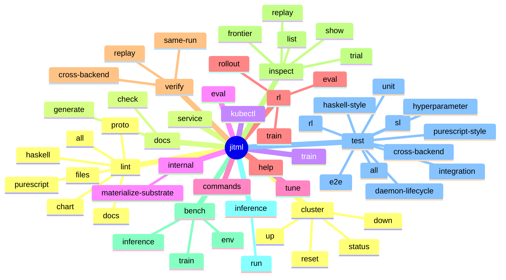
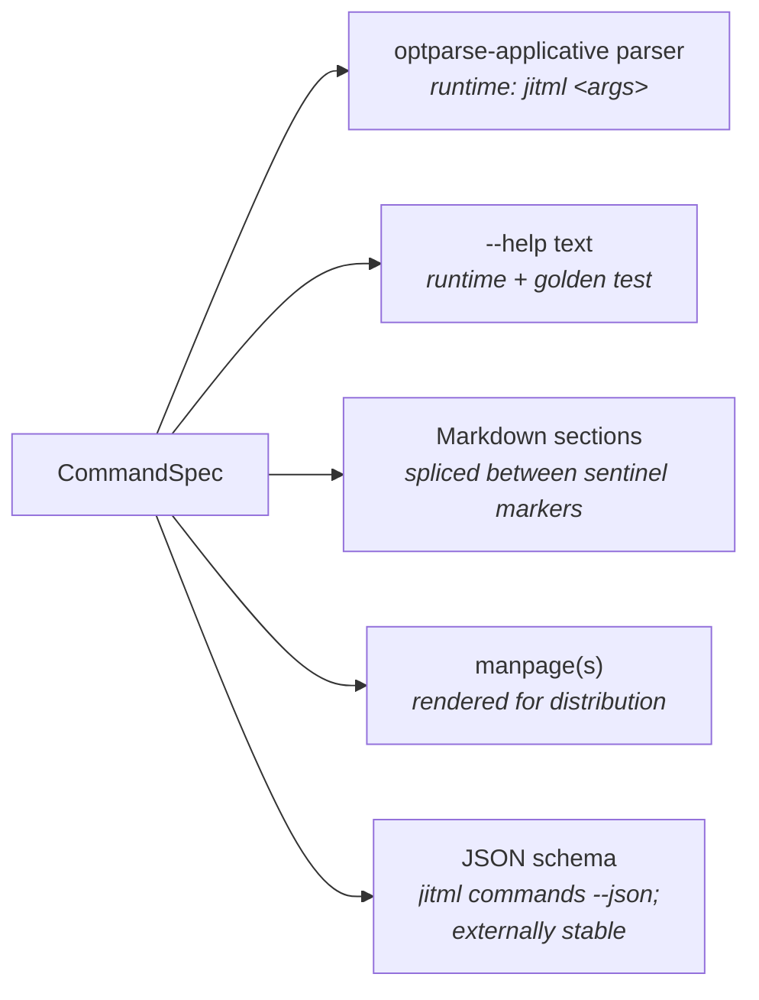
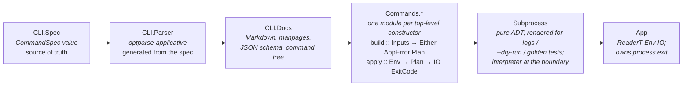

# jitML

> Deterministic, reproducible, JIT-compiled machine learning for Haskell.

`jitML` is a Haskell-native machine learning framework for training deep artificial neural networks with fully reproducible execution semantics across supervised learning and reinforcement learning workloads.

Unlike traditional ML frameworks that embed dynamic Python runtimes, opaque kernels, and nondeterministic execution paths, `jitML` treats *the entire training process* as a declarative, reproducible program.

Models, optimizers, datasets, reinforcement learning environments, checkpoints, hardware backends, loss functions, training schedules, hyperparameter sweeps, and cluster topology are all described in `.dhall`.

`jitML` then compiles hardware-specific kernels on demand, builds optimized native binaries, and executes them through Haskell FFI bindings.

The result is:

- reproducible training
- reproducible reinforcement learning
- reproducible stochasticity
- reproducible checkpoint recovery
- deterministic distributed execution
- hardware-native performance
- fully declarative experiment definitions

> **Status:** This README expresses the project's intent and roadmap. The repository is in its bootstrap phase. The first deliverable is the MNIST shallow-MLP training run described in [First milestone](#first-milestone).

> **Doctrine and siblings:** The authoritative CLI doctrine lives at [`HASKELL_CLI_TOOL.md`](HASKELL_CLI_TOOL.md). Two sibling projects inform the structure of this repository — `~/MCTS` (a deterministic Monte Carlo Tree Search runtime; jitML borrows its testing-and-determinism arc) and `~/infernix` (a k8s-first inference control plane; jitML borrows its infrastructure layout). Their scopes are not combined with jitML's.

---

# Why this exists

The mainstream ML stack is Python + PyTorch / JAX + dynamic graphs + opaque CUDA kernels + best-effort seeding. It is fast at iterating on research ideas and slow at giving the same answer twice. Bit-exact reproduction is a debugging aid, not an architectural invariant: cuDNN convolutions are nondeterministic by default; data loaders shuffle in OS-thread order; mixed-precision reductions reassociate; checkpoint replay restores weights but not RNG state; hyperparameter sweeps record best-trial numbers but not the search-strategy state that produced them.

We want a runtime that is:

1. **Reproducible by construction.** Given identical inputs, seeds, and configuration, two runs produce identical outputs — including parameter initialization, minibatch ordering, optimizer state, RL trajectories, MCTS exploration paths, hyperparameter-trial selection, and checkpoint recovery. Reproducibility is an architectural requirement, not a flag.
2. **Declarative end-to-end.** A `.dhall` file is the full source of truth for a training run, a hyperparameter sweep, an RL experiment, or a cluster deployment. The CLI flags layered on top *override* the Dhall; they never replace it.
3. **Hardware-native without an embedded Python runtime.** jitML compiles kernels on demand for Apple Metal, NVIDIA CUDA, oneDNN/AVX, or OpenCL, and executes them through Haskell FFI bindings. The runtime has no Python interpreter in the loop.

---

# Toolchain pinning

Per doctrine §Overview → Toolchain pinning, these versions are normative, not recommendations. The `.cabal` file declares `tested-with: ghc ==9.14.1`; `cabal.project` pins `with-compiler: ghc-9.14.1`; CI uses the same versions. Codegen toolchains (LLVM, NVCC, Xcode/Metal, oneDNN) are pinned in `cabal.project` so kernel output is reproducible across hosts.

| Tool | Pinned version | Where it's pinned |
|---|---|---|
| GHC | `9.14.1` | `.cabal` (`tested-with`) and `cabal.project` (`with-compiler`) |
| Cabal | `3.16.1.0` | `cabal.project` |
| LLVM | pinned across GHC's `-fllvm` and JIT codegen | `cabal.project` |
| NVCC | pinned | `cabal.project` (`--use_fast_math=false`, baseline `sm_70`) |
| Xcode/Metal | pinned | bootstrap script + `cabal.project` |
| oneDNN | pinned | `cabal.project` (AVX2 baseline, AVX-512 detected at JIT time) |
| `kindest/node` | pinned | `cabal.project` |
| Node.js, Poetry | pinned | bootstrap scripts |
| Formatter GHC | separate isolated install under `.build/jitml-style-tools/` | lint stack (does not affect the project compiler) |

The full per-target codegen detail (build flags, RTS options, fast-math discipline) lives under [Compiler, runtime, and backend tuning](#compiler-runtime-and-backend-tuning).

---

# Substrates and runtime modes

jitML produces **one Haskell front end** with JIT codegen for several hardware targets, packaged as **three supported substrates**:

| Substrate | Codegen | Container shape | Orchestrator residence | Inference-engine residence |
|---|---|---|---|---|
| `apple-silicon` | Swift + Metal | partial (cluster services in Kind; Metal-using daemon host-native — Metal can't be containerized) | clustered `jitml-service` Deployment (stateless; pod anti-affinity = at most one per node) | **host-native** `./.build/jitml host-service` |
| `linux-cpu` | oneDNN + AVX2/AVX-512 | fully containerized: `jitml-linux-cpu:local` | clustered `jitml-service` Deployment (same pod also runs inference) | same pod as orchestrator |
| `linux-cuda` | CUDA C + cuBLAS / cuDNN | fully containerized: `jitml-linux-cuda:local` | clustered `jitml-service` Deployment with `runtimeClassName: nvidia` (same pod also runs inference) | same pod as orchestrator |

On every substrate the `jitml-service` orchestrator is a **stateless Deployment**, not a StatefulSet: durable state lives in MinIO and Pulsar exclusively (no relational DB in jitML's path), the orchestrator owns no PVC of its own, and pod anti-affinity at `topologyKey: kubernetes.io/hostname` ensures multi-replica deployments place at most one pod per node. Each node keeps its own JIT cache (per-node hostPath; see [Built-artifact and JIT-cache discipline](#built-artifact-and-jit-cache-discipline)). On Linux substrates the orchestrator container carries the full JIT toolchain, so inference runs in-process — there is no separate inference Deployment. On Apple Silicon, inference is the one thing that cannot live in the cluster (Metal isn't containerizable), so the cluster delegates inference to a host-native daemon over a Pulsar RPC topic; this is the *only* substrate that uses an internal `inference.command.<substrate>` topic.

A fourth "coverage" target (`linux-opencl` / Intel GPU) is reserved as an optional substrate; it is not part of the v1 milestone.

Each substrate carries its own determinism contract:

- **`apple-silicon`** — Metal compute kernels execute on the host GPU; float-accumulation order is fixed by the kernel's reduction tree (no fast-math); RNG state lives in the host daemon; kernel-launch ordering is single-stream by default.
- **`linux-cpu`** — oneDNN dispatches to a per-host vector ISA detected at JIT time; reductions are blocked with a fixed block size so the accumulation tree is host-independent; RNG state lives in the clustered service pod.
- **`linux-cuda`** — CUDA kernels disable `--use_fast_math`; per-block reductions use a deterministic warp-shuffle pattern; cuBLAS and cuDNN are pinned to deterministic algorithm selections; RNG is the host's splitmix, never the GPU's curand.

Cross-substrate equality is not guaranteed bit-for-bit — float arithmetic on different hardware reassociates at the last few ULPs — but *same-substrate equality is guaranteed*, and cross-substrate tolerance is measured and tracked per [Cross-substrate verification](#test-suite-stanzas).

---

# Apple Silicon hybrid pattern

Metal cannot be containerized. The supported Apple lane is therefore hybrid: the stateless orchestrator pod runs in Kind like on Linux, but inference delegates to a host-native daemon over Pulsar RPC.

Shape:

- The clustered `jitml-service` Deployment runs on every substrate (stateless orchestrator; pod anti-affinity = one per node). On Apple Silicon it does **not** run inference itself — it brokers Pulsar/MinIO contracts with the PureScript demo, persists trial state in MinIO bucket `jitml-trials`, and dispatches inference work to the host.
- `./.build/jitml host-service` runs **host-native** on Apple (no HTTP listener; Pulsar subscriber only). Launched by `./bootstrap/apple-silicon.sh up`; cluster lifecycle is owned by the host CLI's `jitml cluster up` (writes the Kind config, brings up Kind, writes kubeconfig to `./.build/jitml.kubeconfig`, runs the phased Helm deploy from [Helm chart layout](#helm-chart-layout)).
- The cluster orchestrator publishes inference RPC envelopes on the internal topic `inference.command.apple-silicon`. The host daemon **subscribes** to that topic and ACKs on `inference.event.apple-silicon` with small envelopes (call-id, kind tag, MinIO refs to outputs). Pulsar carries only small envelopes; large tensors travel via MinIO.
- The host daemon **reads and writes large artifacts directly to MinIO** through the routed `/minio/s3` surface — same protocol the cluster orchestrator uses. New snapshot weights, optimizer state, and inference outputs go to MinIO straight from the host; the ACK envelope just references the MinIO keys. This keeps Pulsar lean and lets MinIO's optimistic concurrency on HEAD updates serialize concurrent commits (see [Checkpoint snapshot model](#checkpoint-object-layout)).
- The host daemon JIT-compiles Metal kernels and executes them with direct GPU access. JIT compilation happens inside a `jitml-build` tart VM whose lifecycle is managed by the host binary — see [Bootstrap scripts](#bootstrap-scripts) and [Built-artifact and JIT-cache discipline](#built-artifact-and-jit-cache-discipline).
- Pulsar endpoint discovery: the daemon reads `./.data/runtime/cluster-publication.json` (written by `cluster up`) for `pulsar_ws_url`, `pulsar_admin_url`, `minio_s3_url`, `edge_port`. No service-discovery RPC; the cluster publishes its own coordinates to a known file.
- The host daemon's only cluster contracts are Pulsar (RPC envelopes) and MinIO (large artifacts). Direct k8s API access from the host is forbidden and lint-enforced.

On Linux substrates the orchestrator pod also does inference in-process — the substrate image carries the full JIT toolchain — so there is no separate `inference.command.linux-*` topic; the Pulsar topology degenerates to the demo-facing `inference.request.<mode>` / `inference.result.<mode>` pair. Apple Silicon is the only substrate where a second daemon resides on the host and a second pair of internal-RPC topics exists.

---

# Bootstrap scripts

Stage-0 idempotent prereq reconcilers, one per substrate:

```
./bootstrap/apple-silicon.sh
./bootstrap/linux-cpu.sh
./bootstrap/linux-cuda.sh
```

Each script is **idempotent and restartable**: it probes host state, installs missing prerequisites, verifies tools in the same process before continuing. Each exposes the same subcommand surface: `help | doctor | build | up | status | test | down | purge` (Linux adds `push` for the Harbor handoff).

- `apple-silicon.sh` reconciles Homebrew + ghcup (pinned GHC 9.14.1 + Cabal 3.16.1.0) + `protoc` + Colima (8 CPU / 16 GiB) + Docker + `kind` + `kubectl` + `helm` + Node.js + Poetry on demand, plus `tart` (`brew install cirruslabs/cli/tart`) for the Swift/Metal JIT VM. `build` produces `./.build/jitml` host-native via ghcup; `up` brings the cluster up and launches the host-native `./.build/jitml host-service` so it can subscribe to `inference.command.apple-silicon`. The `jitml-build` tart VM is managed by the host binary, not the user — `./.build/jitml internal vm bootstrap` provisions the VM on first need with pinned Xcode + Swift; subsequent `swift build` invocations run **inside** the VM via `tart ssh`, so the macOS host never opens Xcode UI (preserving headless training loops). The VM is spun up **lazily** — only when a JIT cache miss requires a fresh compile — and JIT artifacts are copied out to `./.build/host/apple-silicon/` so the Haskell FFI loads them from the host. See [Built-artifact and JIT-cache discipline](#built-artifact-and-jit-cache-discipline) for the cache layout and the lazy-VM-spinup contract.
- `linux-cpu.sh` reconciles only Docker on the host (no `ghcup`, no `cabal`, no `kind`, no `kubectl`, no `helm`). Each subsequent subcommand is a thin wrapper over `docker compose run --rm jitml-linux-cpu jitml <subcommand>`: there is **no outer container, no `compose up`, no long-running daemon outside Kind**. The substrate image (`jitml-linux-cpu:local`) is lazy-built on first `docker compose run` and then reused. Inside the container, the binary is built at `/opt/build` (one Dockerfile, one image — used both as the dev-loop toolchain and, after `push`, as the in-cluster `jitml-service` image via Harbor); the bind chain host `./.build/` ⇄ Kind container `/jitml/.build/` ⇄ pod `/opt/build/` keeps artifacts coherent across duty cycles. `push` tags the locally-built image as `harbor.platform.svc.cluster.local/jitml/linux-cpu:<sha>` and pushes it so the cluster pulls the same bytes it just built.
- `linux-cuda.sh` adds NVIDIA driver checks; on missing driver it installs, then stops and asks the user to reboot. Otherwise it follows the same `docker compose run --rm` pattern as `linux-cpu.sh`, producing `jitml-linux-cuda:local` (NVCC + cuBLAS + cuDNN on the linux-cpu base) and labeling the Kind worker `jitml.runtime/gpu=true` so the `nvidia` RuntimeClass binds there.

Cleanup semantics matter:

- `down` tears down the cluster; preserves `./.data/`, preserves `./.build/`, leaves the tart VM up (Apple).
- `purge` is destructive but **cache-preserving**: cluster down, `rm -rf ./.data/`, tart VM destroyed (Swift incremental build cache inside the VM is wiped with it). `./.build/` survives — including `./.build/jit/apple-silicon/`, so a subsequent `up` can run inference without re-JITting any model already compiled. The cache is the payoff: tart need only be spun up when a *new* model shape or *new* kind (training vs inference) appears.
- `purge --full` is `purge` plus `rm -rf ./.build/` (and on Linux, `docker compose down --rmi local --volumes` to drop the substrate image). Use only for fresh-start debugging.

Forbidden: anything that touches `~/.kube/config`, `~/.docker/config.json`, the user's global Homebrew prefix as a writer, or any global state outside the repo. All build state lives under `./.build/`; all runtime state lives under `./.data/`; both are in `.gitignore` **and** `.dockerignore` so the substrate image never accidentally bakes in host artifacts.

---

# Built-artifact and JIT-cache discipline

`./.build/` is the **only** host folder that holds compiled artifacts — both the `jitml` binary and JIT-compiled kernels. Layout:

```
.build/
├── jitml                                    -- the binary (Apple: host-built via ghcup; Linux: container-built, bind-mounted out)
├── host/apple-silicon/                      -- Apple-only: dylibs / executables copied out of the tart VM
└── jit/
    ├── manifest.json                        -- cache index keyed on (model-id, kind, substrate, toolchain)
    └── <substrate>/<hash>.<ext>             -- one file per cached kernel
```

**Cache key — shape + kind, weight-independent.** Each entry is hashed over `(canonical-cbor(KernelSpec), kind, substrate, toolchain-fingerprint)` where `KernelSpec` is model shape (layer topology, dtype layouts, activation choices) and `kind` is `training | inference`. Training and inference kernels are **separate artifacts** because they have different compute graphs — training carries the backward pass and optimizer-step kernel; inference is forward-only with frozen-weight constant folding enabled. Sharing one artifact across both would force one of them to be sub-optimal.

Consequence: a model that is both trained and used for inference has **two JIT artifacts in its lifetime**, regardless of how many checkpoints exist along its training history. Two snapshots of the same model share their weight layers (per the multi-object snapshot model in [Checkpoint object layout](#checkpoint-object-layout)) but never produce additional JIT compiles.

**Lazy tart spin-up on Apple Silicon.** The host daemon's startup path never touches tart. On a JIT cache miss the daemon calls `JitML.Tart.ensureVmUp jitml-build`, which is idempotent — if the VM is up, no-op; if down, `tart run jitml-build --no-graphics &` and poll until reachable. The daemon then dispatches the Swift build inside the VM via `tart ssh`, copies the artifact out to `./.build/host/apple-silicon/`, writes the cache entry atomically (`tmp + rename`), and loads via FFI. The VM stays up for the daemon's lifetime once spun up; an idle timeout (default 30 min, configurable in `LiveConfig`) may bring it down again. Subsequent cache hits skip the spin-up entirely.

**Cache survives VM teardown.** `./bootstrap/apple-silicon.sh purge` destroys the tart VM (along with the Swift incremental build cache *inside* the VM) but **preserves `./.build/`**. After `purge`, every previously compiled kernel is still on disk under `./.build/jit/apple-silicon/`, so the next `up` plus any inference command can resolve from cache without spinning tart up at all. Tart only fires on a fresh `(model-shape, kind, substrate, toolchain)` tuple — typically only when a new model is added or a toolchain is bumped.

**Linux substrates share the same cache via Kind extraMounts.** The Kind cluster config bind-mounts host `./.build/` into the worker node, and the `jitml-service` Deployment mounts that path into the pod at `/opt/build`. Cache hits/misses behave identically to Apple Silicon — the only difference is that on a Linux miss the compile runs in-process inside the pod (which has the full toolchain baked into the substrate image), not in a separate VM. This is the **one** exception to the "no freestanding host paths in pod specs" discipline; the chart lint permits exactly this hostPath and rejects any other.

---

# Prerequisites as typed effects

Per doctrine §Prerequisites as Typed Effects, prerequisite checks are first-class typed values: a DAG of named `Prerequisite` nodes that gate every reconcile run. Each node has a typed predicate, a typed remediation action (or `Nothing` if the prerequisite is non-recoverable), and an explicit dependency list. The same `Prerequisite` values used by the bootstrap shell scripts above are consumed by the Haskell daemon (`cluster up`, `train`, `service` startup) so a missing tool surfaces the same diagnostic regardless of entry point.

A reconciler that finds a missing prerequisite fails with exit code `2` (system error per [Exit codes and error rendering](#exit-codes-and-error-rendering)) and a structured diagnostic naming the missing node plus its remediation, if any. The bootstrap scripts at [`./bootstrap/`](#bootstrap-scripts) are the user-facing tip of this system; the Haskell prerequisite DAG is the in-process source of truth.

---

# Cluster topology and Kind

Per-substrate Kind configs at `./kind/cluster-<substrate>.yaml`. Single control-plane + one worker on Apple Silicon (collocated); identical layout for Linux CPU; Linux CUDA labels the worker `jitml.runtime/gpu=true` so the NVIDIA runtime class binds there.

The edge port (Envoy listener) is selected starting at 9090 and incremented until available; recorded at `./.data/runtime/edge-port.json` and reported by `jitml cluster status`. NodePort 30090 is the in-cluster service for the edge gateway.

Kubeconfig lives at `./.build/jitml.kubeconfig`. The CLI never touches `~/.kube/config`. The `kindest/node` version is pinned in `cabal.project` so reproducibility includes the cluster image, not just the GHC version.

Storage is a `jitml-manual` storage class (no provisioner) backed by host-path PVs under `./.data/kind/<substrate>/`. State is **replayed in/out** of the worker on Apple Silicon (slower bind-mounts, large state) and bind-mounted on Linux.

---

# Envoy Gateway API: a single localhost socket

> "There is to be a single socket accessible to localhost with Envoy as the reverse proxy to all the endpoints."

One Envoy-Gateway-API-owned localhost listener (`Gateway/jitml-edge`, port chosen by `cluster up` starting at `9090`) backed by the repo-owned `EnvoyProxy/jitml-edge` service shape:

- `GatewayClass/jitml-gateway` + `Gateway/jitml-edge` listening at `127.0.0.1:<edge-port>`.
- `EnvoyProxy/jitml-edge` is a NodePort service with `externalTrafficPolicy: Cluster`, port 30090 in-cluster.
- Routes are not hand-written YAML; they are Haskell-rendered `HTTPRoute` resources from a single **route registry** in `src/JitML/Routes.hs`. The registry is the source of truth, consumed by both the chart-template renderer and the `docs check`/`docs generate` pair that gates README drift (per doctrine §Generated Artifacts).

Routes published at the edge (all under one `127.0.0.1:<edge-port>`):

| Path prefix | Upstream | Rewrite |
|---|---|---|
| `/` | `jitml-demo:80` (the PureScript app) | (none) |
| `/api` | `jitml-demo:80` | (none) |
| `/api/ws` | `jitml-demo:80` WebSocket | (none) — live training events |
| `/tensorboard` | `tensorboard:6006` | `/` |
| `/grafana` | `grafana:3000` | `/` |
| `/prometheus` | `prometheus:9090` | `/` |
| `/harbor` | `jitml-harbor-portal:80` | `/` |
| `/harbor/api` | `jitml-harbor-core:80` | `/api` |
| `/minio/console` | `jitml-minio-console:9090` | `/` |
| `/minio/s3` | `jitml-minio:9000` | `/` |
| `/pulsar/admin` | `jitml-pulsar-proxy:80` | `/admin` |
| `/pulsar/ws` | `jitml-pulsar-proxy:80` WebSocket | `/ws` |

TLS is off for the local demo. Production deployments are out of scope for v1; the route registry just declares the surfaces.

---

# Helm chart layout

Single umbrella chart at `./chart/`. `Chart.yaml` declares subchart dependencies:

- `harbor` — image registry.
- `pg-operator` + `pg-db` — Percona Kubernetes Operator, providing HA Postgres for Harbor (jitML itself never writes to it — see [PostgreSQL](#postgresql)).
- `pulsar` — Apache Pulsar with ZooKeeper + BookKeeper + Broker + Proxy + WebSocket.
- `minio` — distributed mode, four replicas.
- `gateway-helm` — Envoy Gateway controller.
- `kube-prometheus-stack` — Prometheus operator + Grafana.
- `tensorboard` — a jitML-owned chart for TensorBoard with MinIO-backed event storage.

Templates in `chart/templates/`: GatewayClass, Gateway, HTTPRoutes (rendered from the route registry), EnvoyProxy, manual PVs (one per replica, see below), the `jitml-service` Deployment, the `jitml-demo` Deployment, NVIDIA RuntimeClass for the CUDA substrate, Grafana datasources and dashboards (provisioned ConfigMaps), Prometheus scrape configs.

## Storage discipline: `kubernetes.io/no-provisioner` only

Every StorageClass uses the `kubernetes.io/no-provisioner` provisioner — no dynamic provisioning anywhere in the chart. Every PV is **manually defined** in `chart/templates/pv-<statefulset>.yaml` against the `jitml-manual` StorageClass and backed by a `hostPath` under `./.data/kind/<substrate>/<namespace>/<statefulset>/pv_<replica-int>/`. Every PVC is created **only** by a StatefulSet's `volumeClaimTemplates`; freestanding PVCs are a chart-lint failure. Each PV's `claimRef.namespace` and `claimRef.name` explicitly bind it to one PVC so a teardown/spinup yields the exact same binding — the PV ↔ PVC pairing is the persistence contract; dynamic provisioning would erode reproducibility.

Naming convention is uniform: **`<k8s-namespace>/<StatefulSet-name>/pv_<replica-int>`** on disk, and **`<namespace>-<statefulset>-pv-<int>`** as the PV resource name (DNS-1123 compatible). Example layout for the `platform` namespace on the Apple Silicon substrate:

```
.data/kind/apple-silicon/
└── platform/
    ├── minio/{pv_0, pv_1, pv_2, pv_3}                  -- 4 distributed replicas
    ├── pulsar-bookkeeper/{pv_0, pv_1, pv_2}            -- 3 bookies
    └── pulsar-zookeeper/{pv_0, pv_1, pv_2}             -- 3 ZK nodes
```

Corresponding PV resources are named `platform-minio-pv-0`, `platform-pulsar-bookkeeper-pv-1`, etc.; each is bound to the per-replica StatefulSet PVC (e.g. `data-minio-0`, `journal-pulsar-bookkeeper-1`). `jitml lint files` rejects any path under `.data/` that does not match the `<substrate>/<namespace>/<statefulset>/pv_<int>` regex, and `jitml lint chart` rejects any StorageClass with a provisioner other than `kubernetes.io/no-provisioner`, any freestanding PVC, and any PV without an explicit `claimRef`.

## `jitml-service` Deployment, not StatefulSet

The orchestrator is a stateless **Deployment** with `replicas: 1` by default and pod **anti-affinity** at `topologyKey: kubernetes.io/hostname`, which lets the cluster scale to N replicas (one per node) when throughput requires it without ever placing two on the same node. The daemon owns no PVC of its own — durable state lives entirely in MinIO and Pulsar — so a StatefulSet (which exists for stable identity + ordered scale-up + per-pod PVCs) would be the wrong shape. Each node maintains its own JIT cache under that node's `./.build/jit/<substrate>/` hostPath, which is fine because JIT artifacts are deterministic functions of `(model-shape, kind, substrate, toolchain)` — the worst case is that the same model gets JITted once per node on first use.

Namespace: `platform` (fixed for v1). `jitml cluster up` creates it idempotently.

**Phased deploy** (verbatim from infernix's lessons):

1. **Bootstrap phase**: Harbor + MinIO + Postgres only, pulling images from public registries.
2. **Mirror phase**: every third-party image is mirrored into Harbor.
3. **Final phase**: Pulsar, Envoy Gateway, kube-prometheus-stack, TensorBoard, the jitML service workload (Linux substrates), the jitML-demo workload — all pulling exclusively from local Harbor.

This avoids the chicken-and-egg of "Harbor isn't up yet, but everything wants to pull from it" without resorting to image-pull-secret juggling.

---

# Harbor as the registry

All container images go through Harbor. No Docker Hub pulls after the bootstrap phase. The build pipeline pushes to `harbor.platform.svc.cluster.local/jitml/<image>:<tag>` and the in-cluster `imagePullPolicy: IfNotPresent` resolves from there.

Harbor's own image-chart storage backend is **MinIO** (S3 API), so Harbor's blobs and MinIO's buckets share a durability story.

Routed at `/harbor` (portal) and `/harbor/api` (API).

---

# MinIO object store

Buckets, provisioned by the Helm `provisioning.buckets` block:

- `harbor-registry` — Harbor's S3 backend (128 MiB chunk size).
- `jitml-checkpoints` — training checkpoints. One prefix per experiment hash; content-addressed blobs + manifests + ETag-guarded pointers inside the prefix (see [Checkpoint object layout](#checkpoint-object-layout)).
- `jitml-datasets` — pinned source datasets (MNIST, Fashion-MNIST, CIFAR-10 binaries). Lazily populated on first use, SHA-256 verified against the experiment Dhall.
- `jitml-transcripts` — RL trajectory transcripts (the analog of MCTS's `.mcts-cache/transcripts/`).
- `jitml-trials` — hyperparameter trial transcripts, content-addressed by `sha256(resolved-dhall || trial-seed)`.
- `jitml-tensorboard` — TensorBoard event files so the TB pod is stateless and can reschedule freely (see [TensorBoard event storage](#tensorboard-event-storage)).
- `jitml-artifacts` — large inference outputs (when the demo is in inference mode).

Endpoints: `jitml-minio.platform.svc.cluster.local:9000` (in-cluster); `127.0.0.1:<edge-port>/minio/s3` (routed). Credentials pinned in values for the local demo; production posture is out of scope.

The MinIO server version is pinned to a release with S3 conditional-write support (`If-None-Match`, `If-Match`) — `RELEASE.2024-08-26T15-33-07Z` or later. The concurrency story below depends on it.

## Checkpoint object layout

The `jitml-checkpoints` bucket uses a fixed prefix schema, owned by a Haskell module (`src/JitML/Storage/Layout.hs`) so paths are typed values rather than stringly-typed call sites:

```
jitml-checkpoints/
  <experiment-hash>/                      -- sha256(resolved-dhall || graph-shape-hash)
    blobs/<sha256>                        -- write-once, content-addressed, opaque bytes
    manifests/<sha256>                    -- write-once, content-addressed, CBOR manifest objects
    pointers/
      latest                              -- mutable, ETag-CAS; body = 32-byte manifest sha
      best/<metric>                       -- mutable, ETag-CAS; body = 32-byte manifest sha
      trial/<trial-hash>/latest           -- per-HPO-trial latest pointer
      trial/<trial-hash>/best/<metric>    -- per-HPO-trial best pointer
```

Three object classes, two write protocols:

- **`blobs/<sha256>`** — write-once content-addressed payloads. Each blob's key *is* `sha256(its bytes)`. PUTs use `If-None-Match: *` and treat `412 Precondition Failed` as success (the bytes already exist by definition). One checkpoint produces **many blobs**: one per model layer's weights (`encoder.weight`, `encoder.bias`, `head.weight`, …), plus one for optimizer state, one for RNG state, and (RL only) one each for replay buffer and exploration cache. Per-layer granularity is what makes dedup across checkpoints automatic — two consecutive checkpoints that differ only in their final layer share every other layer's blob by content hash.
- **`manifests/<sha256>`** — write-once content-addressed CBOR objects naming the blob SHAs that constitute one logical checkpoint plus the metadata needed to interpret them: the parent manifest's SHA (for linear history), the layer-name → blob-SHA map, the step count, the resolved Dhall hash, the substrate that produced the bytes. Same `If-None-Match: *` write protocol. The manifest's SHA is the canonical *checkpoint id* used by Pulsar `CheckpointDone` events, RPC envelopes, and `--resume <checkpoint-id>`.
- **`pointers/*`** — the only mutable objects. Each pointer's body is a 32-byte manifest SHA. Updates use S3 conditional `PUT` with `If-Match: <etag>` — textbook compare-and-swap. The `pointers/latest` update is the **single atomic commit point** for a checkpoint: layer-level blob writes can happen in any order and may even leave orphans on failure, but the manifest is only adopted as HEAD when its pointer update succeeds. Optimistic concurrency therefore applies to the **entire snapshot**, not per layer — which is what guarantees a linear sequence of checkpoints with no orphan branches or split heads.

## Concurrency model

All race conditions between trainers, hyperparameter-trial workers, and inference clients are eliminated at the protocol layer; nothing in the doctrine relies on advisory locks, leases, or a separate lock service.

- **Write/write on `blobs/*` and `manifests/*`** — impossible by construction. Keys are derived from `sha256(payload)`. Two writers with the same logical payload write the same key with the same bytes; the second `If-None-Match: *` PUT returns `412`, which the client treats as success because the SHA already exists. Two writers with different logical payloads write different keys; no collision is possible.
- **Write/read on `blobs/*` and `manifests/*`** — impossible. S3 object PUT is atomic at the object level; a partial blob is never visible. An inference client reading `blobs/<sha>` either sees the full object or gets `404`.
- **Write/write on `pointers/*`** — handled by `If-Match: <etag>` CAS. The loser receives `412`, which `MinIOPreconditionFailed` translates into the doctrine's `SEConflict` (already classified retryable per doctrine §Capability Classes and Service Errors). The retry re-reads the pointer, applies the caller's resolution policy (e.g., "advance `latest` only if `step` is strictly greater"; "advance `best/acc` only if the new metric clears the old"), and retries through the existing `retryServiceAction` harness.
- **Write/read on `pointers/*`** — a reader observes either the old ETag's bytes or the new ETag's bytes. Both name valid immutable manifests, both of which name valid immutable blobs. No torn state is possible because the only mutation is a single object PUT (atomic) of a 32-byte body.

Sketch of the checkpoint-write orchestration:

```haskell
writeCheckpoint :: HasCheckpointStore m => CheckpointPayload -> m CheckpointId
writeCheckpoint payload = do
  parts    <- traverse (putBlobIfAbsent . encodePart) (payloadParts payload)
                                                  -- If-None-Match: *  (412 = success)
  manifest <- putBlobIfAbsent (encodeManifestCanonical (mkManifest parts payload))
  retryServiceAction defaultRetryPolicy $
    casPointer (pointerKeyLatest (experimentHash payload))
               (advanceOnlyIfNewer (cpStep manifest))
                                                  -- If-Match: <etag>  (412 = SEConflict, retry)
  pure (CheckpointId manifest)
```

Inference at any point in training or hyperparameter search is symmetric: read `pointers/latest` (or `pointers/best/<metric>`, or a known manifest SHA from a Pulsar `CheckpointDone` event), fetch `manifests/<sha>`, then fetch only the `Weights` part's blob — the optimizer-state and replay-buffer blobs are skipped on the inference path. The snapshot the reader operates against is immutable, so concurrent training advances are invisible to it.

---

# TensorBoard event storage

TensorBoard renders scalars, histograms, distributions, and image summaries from the `jitml-tensorboard` MinIO bucket. The TB pod itself is stateless: it reads MinIO at panel-load time, and reschedules freely. Writers are the `jitml-service` daemon (Linux substrates), the host-native Apple daemon, and per-trial workers during hyperparameter sweeps — all writing into the same bucket without coordination.

## Format

The event-file format is **dictated by TensorBoard**, not by us: TFRecord framing wrapping a `tensorflow.Event` protobuf message. We vendor `proto/tensorboard/event.proto` from TensorFlow at a pinned commit and generate Haskell bindings via `proto-lens` (the same toolchain that produces the Pulsar protobuf bindings). The TFRecord frame is:

```
uint64 LE   length
uint32 LE   masked-CRC32C(length)
bytes       payload                     -- a serialised tensorflow.Event protobuf message
uint32 LE   masked-CRC32C(payload)
```

CRC32C is the Castagnoli polynomial; the masking step is TF's standard `(crc >> 15) | (crc << 17) + 0xa282ead8` rotation. Nothing about this format is jitML-original — we conform to TB because TB is the reader.

## Bucket layout

```
jitml-tensorboard/
  <experiment-hash>/                                            -- TB's logdir for the experiment
    [tbMode = Overlay (default)]
    shards/<writer-id>-<shard-seq>.tfevents                     -- writer-id = first 16 hex of sha256(host || pid || run-uuid || trial-hash)
    checkpoints/<step>-<manifest-sha>.cbor                      -- one sidecar per checkpoint event

    [tbMode = Isolated, set in the experiment Dhall]
    run/<run-uuid>/shards/<writer-id>-<shard-seq>.tfevents
    run/<run-uuid>/checkpoints/<step>-<manifest-sha>.cbor

    [HPO trials, always isolated by trial-hash]
    trial/<trial-hash>/run/<run-uuid>/shards/<writer-id>-<shard-seq>.tfevents
    trial/<trial-hash>/run/<run-uuid>/checkpoints/<step>-<manifest-sha>.cbor
```

Overlay mode is the default — multiple reruns of the same experiment land under the same TB logdir and TB's UI renders them as one timeline. Isolated mode is the per-Dhall knob that gives each run its own subdirectory and so its own TB "run" entry.

## Shard rotation and append-model mapping

TensorBoard writes append-only event streams locally; S3-like object stores have no append. We map between them with **write-once shards** rotated by size, time, or explicit flush.

Each writer holds an in-memory `Shard` buffer of TFRecord-framed bytes. The buffer flushes — i.e., `PUT`s a single whole object as the next shard, then resets — when **any** of:

- buffer ≥ 4 MiB
- wall-clock elapsed since last flush ≥ 10 s
- an explicit `flush` is called (e.g., on `CheckpointDone`, on graceful shutdown, on `SIGTERM` drain)

Shards are write-once, never modified. PUTs use `If-None-Match: *` so retries are idempotent: the same `(writer-id, shard-seq)` key holds the same bytes; a second PUT returns `412` which the client treats as success. Shard-seq is a monotonic per-writer counter held in-memory by the writer; it is **not** the global training step.

## Concurrency

No CAS, no advisory locks, no leader election — namespacing alone is sufficient:

- **Write/write** is impossible by construction. Two writers with different `(host, pid, run-uuid, trial-hash)` tuples have different writer-ids, therefore different keys. One writer's successive shards have monotonically increasing shard-seq, so two PUTs from the same writer never target the same key either.
- **Write/read** is benign. TB's reader polls the logdir and ingests new shards as they appear; S3 object PUT is atomic, so the reader either sees a complete shard or doesn't see it yet. TB tolerates "new shards appear over time" by design — that's exactly how its local-filesystem mode works.
- **Cross-writer ordering** is handled by TB itself: every `Event` carries `step` and `wall_time`, and TB merges streams by step in its renderer. Out-of-order shard arrival is fine.

This is materially simpler than the checkpoint-pointer concurrency story above, and the difference is intentional — TB events are streaming telemetry, not state needed for resume.

## Cross-link to checkpoint manifests

Every `CheckpointDone` event also writes a CBOR sidecar at:

```
jitml-tensorboard/<experiment-hash>/checkpoints/<step>-<manifest-sha>.cbor
```

```haskell
data TbCheckpointMarker = TbCheckpointMarker
  { tcmStep          :: !Word64
  , tcmEpoch         :: !Word64
  , tcmManifestSha   :: !Hash32     -- references the checkpoint manifest in jitml-checkpoints
  , tcmExperimentSha :: !Hash32
  , tcmTrialSha      :: !(Maybe Hash32)
  , tcmRunUuid       :: !Uuid
  , tcmMetricsAtStep :: ![(Text, Double)]   -- mirror of the manifest's metric snapshot
  }
```

Sidecars are CBOR canonical-form, content-addressed-style, and written with `If-None-Match: *`. The PureScript frontend lists the `checkpoints/` prefix once at panel-load and overlays clickable markers on the TB iframe's loss curve — clicking a marker opens the [Inference panel](#panels) pre-loaded with that manifest SHA. The overlay is a positioned div on top of the iframe; we do not ship a TensorBoard plugin (which would require a TB-extension build chain). This is the single design move that turns TB from passive telemetry into a navigable index into the checkpoint store, and it costs two extra MinIO PUTs per checkpoint event.

## Determinism caveat

**The TensorBoard byte stream is not part of any bit-determinism golden.** TF's `Event` message carries `wall_time` in every payload; shard boundaries depend on wall-clock-driven flush thresholds; writer metadata varies across writer-ids. None of those bytes can be SHA-equal across two runs.

The **scalar values themselves** at each `(tag, step)` *are* deterministic: two same-substrate runs with the same seed produce identical `Summary.value.simple_value` at every `(tag, step)`. The TB-event determinism test, in [`jitml-unit`](#test-suite-stanzas), is therefore: decode both runs' shards, project to `[(tag, step, value)]`, sort canonically, assert equality. This caveat is called out so the determinism golden for TB events is not conflated with the checkpoint determinism golden (which is byte-level via `sha256(weights.bin)`).

---

# Pulsar as the control-plane ↔ data-plane bus

Apache Pulsar HA chart: 3× ZooKeeper, 3× BookKeeper, 3× Broker, 3× Proxy, WebSocket enabled. WebSocket is what lets the PureScript frontend subscribe to live training events through the Envoy `/pulsar/ws` route.

Topic family (substrate-scoped — `<mode>` ∈ `apple-silicon`, `linux-cpu`, `linux-cuda`):

| Topic | Direction | Carrying |
|---|---|---|
| `training.command.<mode>` | control plane → daemon | StartTraining, StopTraining, ResumeFromCheckpoint, AbortTraining |
| `training.event.<mode>` | daemon → control plane / frontend | StepDone, EpochDone, EvalDone, CheckpointDone, MetricUpdate, TrainingFinished, TrainingFailed |
| `tune.command.<mode>` | control plane → daemon | RunTrial, StopTrial |
| `tune.event.<mode>` | daemon → control plane / frontend | TrialStarted, TrialMetricUpdate, TrialFinished, TrialFailed |
| `rl.command.<mode>` | control plane → daemon | StartRLRun, StopRLRun |
| `rl.event.<mode>` | daemon → control plane / frontend | EpisodeDone, EvalDone, CheckpointDone, MetricUpdate |
| `inference.request.<mode>` | demo frontend → daemon | inference requests (when demo is in inference mode) |
| `inference.result.<mode>` | daemon → demo frontend | inference results |
| `inference.command.apple-silicon` (Apple only) | cluster orchestrator → host daemon | internal RPC envelopes — see below |
| `inference.event.apple-silicon` (Apple only) | host daemon → cluster orchestrator | ACK envelopes — see below |

The `inference.command.apple-silicon` / `inference.event.apple-silicon` pair only exists on Apple Silicon. On Linux substrates the orchestrator pod runs inference in-process, so the demo-facing `inference.request.<mode>` / `inference.result.<mode>` pair is the only inference topology. On Apple Silicon the cluster orchestrator publishes RPC envelopes on the internal topic, the host daemon consumes them and ACKs on the event topic; demo-facing topics still flow through the orchestrator unchanged.

**Internal RPC envelope (Apple Silicon `inference.command.apple-silicon`):**

```jsonc
{
  "call-id":            "<uuid>",                    // for ACK correlation
  "kind":               "training" | "inference",    // determines pre-flight checks
  "model-id":           "<stable-id>",                // selects the shape-keyed JIT artifact
  "starting-snapshot":  "<manifest-sha>",             // points at the checkpoint manifest in MinIO
  "reply-topic":        "inference.event.apple-silicon",
  "inputs": { /* training: batch-spec, n-steps; inference: input refs */ }
}
```

Pulsar carries small envelopes only. Per-layer weight blobs, optimizer state, and inference outputs travel through MinIO via the same protocol the orchestrator uses; the host daemon writes large artifacts to MinIO directly and the ACK envelope just references the resulting manifest SHAs.

**Stale-starting-snapshot pre-flight (training only).** When `kind == "training"`, the host daemon's first step on receipt is to read `pointers/latest` for the model and compare against `starting-snapshot`. If they disagree (another trainer committed first), the daemon publishes an error envelope on `inference.event.apple-silicon` with shape `{ "call-id": "<uuid>", "kind": "error", "code": "stale-starting-snapshot", "expected": "<latest>", "got": "<starting>" }` and aborts. This is a **recoverable** error per HASKELL_CLI_TOOL.md §Error Handling — the daemon stays healthy, the call is rejected, and the orchestrator either surfaces to the demo or rebases (rebase is a future enhancement; day 1 surfaces). Inference calls skip this check — running inference at any historical snapshot is a legitimate operation.

**Protobuf contract.** Schemas in `./proto/jitml/`, with Haskell bindings via `proto-lens` and PureScript bindings via `purescript-bridge`.

**Fallback when Pulsar is absent.** When `JITML_PULSAR_WS_BASE_URL` and `JITML_PULSAR_ADMIN_URL` env vars are unset (e.g., unit tests), the harness uses a repo-local topic spool at `./.data/runtime/pulsar/`. Tests use this; nothing else.

**At-least-once delivery.** Per doctrine §At-Least-Once Event Processing, every Pulsar message handler is idempotent: idempotency is enforced via MinIO `If-None-Match: *` writes on content-addressed blobs (a redelivered message produces the same SHA, the second PUT returns `412 Precondition Failed`, the handler treats it as success). Redelivery on broker restart or consumer crash is expected and benign. Handlers classify transient failures using the shared [Retry policy](#retry-policy); a `Fatal` classification negatively-acks the message and lets the broker redeliver after backoff. Idempotency keys derive from the protobuf message hash; the daemon does not trust client-supplied IDs.

---

# PostgreSQL

Percona Kubernetes Operator manages a Patroni-backed HA Postgres cluster. Roles:

- Harbor's metadata store.
- (Optional, deployment-time) Grafana dashboard provisioning history when an operator wants persistence across pod restarts beyond what SQLite gives.

**jitML itself does not use Postgres.** Trial state, experiment lineage, checkpoint references, and lineage between training runs and their resumes all live in MinIO — content-addressed manifests carry their own `parent-manifest` pointer (see [Checkpoint object layout](#checkpoint-object-layout)) and the `jitml-trials` bucket is the trial transcript store. jitML's only durable contracts are **MinIO** (artifacts) and **Pulsar** (job queues + events). The Postgres cluster exists for third-party services that themselves require a relational DB; the cluster may add it or remove it without affecting any jitML workload.

---

# TensorBoard, Prometheus, Grafana as first-class

**TensorBoard.** A `tensorboard` pod routed at `/tensorboard`, reading from the `jitml-tensorboard` MinIO bucket. The TB pod is stateless and reschedulable. See [TensorBoard event storage](#tensorboard-event-storage) for the event-file format, bucket layout, shard rotation, concurrency model, cross-link to checkpoint manifests, and determinism caveat. TensorBoard is the headline visualization for SL training; the PureScript frontend's training panel embeds the TB iframe and overlays clickable checkpoint markers.

**Prometheus.** Deployed via `kube-prometheus-stack`. Scrape targets, declared as a typed Haskell value in `src/JitML/Observability/Prometheus.hs`:

- The `jitml-service` daemon (`/metrics` endpoint) — training-step latency, GPU utilization (Metal/CUDA queries), batch throughput, checkpoint write latency, MinIO call latency, Pulsar consume-lag.
- Pulsar broker / proxy.
- MinIO (S3 API metrics).
- Harbor.
- Kind nodes (kubelet + cAdvisor).

**Grafana.** Provisioned dashboards committed to the repo, **generated from typed Haskell datatypes** via a renderer in `src/JitML/Observability/Grafana.hs`. Dashboards rendered for v1:

- *Training overview* — loss curves, validation metrics, throughput, GPU utilization, GC time per run.
- *RL overview* — per-env episode reward distribution, env-steps/sec, replay-buffer fill, exploration rate.
- *Hyperparameter sweep* — Pareto frontier, trial heatmap, search-strategy state (Sobol cursor, GA generation).
- *Cluster health* — node CPU/mem, pod restarts, image-pull latency, PVC saturation.

The dashboards are gated by lint just like the route registry: `jitml docs check` compares the renderer's output against committed JSON fixtures, and `jitml docs generate` writes them back.

---

# Outer-container Linux builds

On Linux substrates, *all* builds happen inside `docker compose run --rm jitml jitml ...` against the substrate image (`jitml-linux-cpu:local` or `jitml-linux-cuda:local`). The image carries ghcup, Poetry, Node.js 22+, Kind/kubectl/Helm/Docker toolbelt, LLVM, NVCC (on CUDA), and Playwright. Bind mounts: `./` for source, `./.build/` for outputs.

On Apple Silicon, `cabal install` runs directly on the host because the host is the GPU. The asymmetry is intentional: the inner container ensures the Linux build is bit-reproducible across hosts; the Apple host build is reproducible because the host GHC and Cabal versions are pinned by the bootstrap script.

---

# CLI command topology, typed

Per doctrine §Command Topology, commands are modelled as ordinary Haskell data types and the parser is generated from a separate `CommandSpec`. Two Haskell executables share one Cabal library: `app/Main.hs` → `jitml` (control plane + daemon); `app/Demo.hs` → `jitml-demo` (HTTP server hosting the PureScript bundle).

`CommandSpec` is the *source of truth*: the optparse-applicative parser, `--help` text, JSON schema, Markdown, manpages, and the command tree below are all *generated* from it (doctrine §Command Topology + §Generated Artifacts). Top-level verbs (`train`, `eval`, `tune`) name the primary workflows; noun groups (`cluster`, `rl`, `verify`, `inspect`, `bench`, `test`, `lint`, `docs`) hold lifecycle, introspection, benchmarks, and tooling. Sub-ADTs that model >2-state workflows — `ClusterCommand`, `VerifyCommand`, the RL lifecycle — are GADT-indexed in `src/` per doctrine §GADT-Indexed State Machines; the snapshot below elides phantom indices for readability. `cluster up`, `docs generate`, and `lint --write` are reconcilers (idempotent; no-op on match → exit code `3`) per doctrine §Reconcilers.

**Source of truth.** Every command-surface artifact in this README — the ADT snapshot, the command tree, generated help fragments — is rendered from `CommandSpec`. The in-tree spec at `src/JitML/CLI/Spec.hs` is authoritative; the blocks below are a non-normative mirror enforced by `jitml docs check cli-help`.

<!-- jitml:command-tree:start -->
<!-- non-normative snapshot of `jitml commands --tree`;
     regenerate via `jitml docs generate cli-help` once the generator lands -->


Annotations on leaves — reconciler vs read-only, destructive flags, alias relationships, etc. — live in the ADT block below.
<!-- jitml:command-tree:end -->

<!-- jitml:command-registry:start -->
<!-- non-normative snapshot of `src/JitML/CLI/Spec.hs`;
     regenerate via `jitml docs generate cli-help` once the generator lands -->
```haskell
-- Top-level dispatch root
data Command
  = Cluster      ClusterCommand        -- cluster lifecycle (cluster up is a reconciler)
  | Service      ServiceOptions        -- in-cluster orchestrator daemon (every substrate)
  | HostService  HostServiceCommand    -- Apple-only host-native inference daemon (Pulsar subscriber)
  | Train        TrainOptions          -- one-shot training; publishes to Pulsar internally
  | Eval         EvalOptions
  | Tune         TuneOptions           -- hyperparameter search
  | RL           RLCommand             -- start an RL run; the daemon executes
  | Verify       VerifyCommand         -- same-run, cross-backend, and replay determinism
  | Inspect      InspectCommand        -- transcripts, checkpoints, trials, frontiers
  | Bench        BenchCommand          -- throughput / scaling measurements
  | Inference    InferenceCommand      -- inference-at-any-point against any checkpoint
  | Test         TestCommand           -- jitml test all + per-stanza
  | Lint         LintCommand           -- per-artifact + aggregate lints (paired check/write)
  | Docs         DocsCommand           -- generated-section paired check/write
  | Kubectl      KubectlPassthrough    -- pre-bound to ./.build/jitml.kubeconfig
  | Internal     InternalCommand       -- non-doctrine-shaped commands (substrate materialization, VM, cache)
  | Commands     CommandsOptions       -- progressive introspection
  | Help         HelpOptions
  deriving stock (Show, Eq)

-- Cluster lifecycle
data ClusterCommand
  = ClusterUp     ClusterUpOptions
  | ClusterDown   ClusterDownOptions
  | ClusterStatus
  | ClusterReset                      -- destructive; requires --yes
  deriving stock (Show, Eq)

-- Daemon options (see doctrine §Long-Running Daemons in the Same Binary).
-- --foreground is the only mode; --detach is forbidden (the supervisor owns the
-- process model). The field is absent from the record because no value carries it.
data ServiceOptions = ServiceOptions
  { serviceConfigPath   :: FilePath        -- --config <path>: Dhall (BootConfig + LiveConfig)
  , serviceLogLevel     :: LogLevel        -- --log-level <level>: startup default
  , servicePortOverride :: Maybe Word16    -- --port <int>: startup-only BootConfig override
  } deriving stock (Show, Eq)

-- Workloads
data TrainOptions = TrainOptions
  { trainExperiment       :: FilePath
  , trainSubstrate        :: Substrate
  , trainSeed             :: Word64
  , trainResume           :: Maybe CheckpointRef
  , trainMaxSteps         :: Maybe Int
  , trainCheckpointBucket :: Text
  } deriving stock (Show, Eq)

data RLCommand
  = RLTrain    RLTrainOptions
  | RLEval     RLEvalOptions
  | RLRollout  RLRolloutOptions       -- fixed-seed determinism cohort
  deriving stock (Show, Eq)

data VerifyCommand
  = VerifySameRun       VerifySameRunOptions       -- k reruns on one substrate, byte-equal
  | VerifyCrossBackend  VerifyCrossBackendOptions  -- per-tensor ULP tolerance across substrates
  | VerifyReplay        VerifyReplayOptions        -- train-to-S/2, checkpoint, resume-to-S, compare
  deriving stock (Show, Eq)

-- Introspection
data InspectCommand
  = InspectList
  | InspectShow      ShowOptions
  | InspectReplay    ReplayOptions    -- TUI replay
  | InspectTrial     TrialOptions
  | InspectFrontier  FrontierOptions
  deriving stock (Show, Eq)

-- Benchmarks (three workloads per [Benchmarks](#benchmarks))
data BenchCommand
  = BenchTrain      BenchTrainOptions       -- (a) samples/sec on a fixed (dataset, model, batch, substrate)
  | BenchInference  BenchInferenceOptions   -- (b) batched / unbatched inference throughput + latency
  | BenchEnv        BenchEnvOptions         -- (c) env-steps/sec per canonical RL env
  deriving stock (Show, Eq)

-- Inference-at-any-point (see Inference-only read path)
data InferenceCommand
  = InferenceRun InferenceRunOptions
  deriving stock (Show, Eq)

data InferenceRunOptions = InferenceRunOptions
  { inferenceExperiment :: FilePath
  , inferenceCheckpoint :: CheckpointRef    -- `latest` | `best/<metric>` | <manifest-sha256>
  , inferenceTrial      :: Maybe TrialRef
  , inferenceInput      :: InferenceInput
  } deriving stock (Show, Eq)

-- Test orchestration: `jitml test all` delegates to `cabal test` per doctrine §Testing Doctrine
data TestCommand
  = TestAll                           -- canonical surface; delegates to cabal test + report-card
  | TestUnit                          -- jitml-unit
  | TestIntegration                   -- jitml-integration
  | TestSL                            -- jitml-sl-canonicals
  | TestRL                            -- jitml-rl-canonicals
  | TestHyperparameter                -- jitml-hyperparameter
  | TestCrossBackend                  -- jitml-cross-backend
  | TestDaemonLifecycle               -- jitml-daemon-lifecycle
  | TestHaskellStyle                  -- jitml-haskell-style
  | TestPureScriptStyle               -- jitml-purescript-style
  | TestE2E                           -- jitml-e2e (Pulumi-orchestrated Playwright through Envoy)
  deriving stock (Show, Eq)

-- Lint stack (per doctrine §Lint, Format, and Code-Quality Stack)
-- Every constructor has a check / write mode; --write fixes what can be auto-fixed.
data LintCommand
  = LintFiles      LintMode           -- whitespace, newlines, tracked-generated paths, forbidden paths
  | LintDocs       LintMode           -- generated-section drift via GeneratedSectionRule registry
  | LintProto      LintMode           -- wire-format schemas in proto/jitml/
  | LintChart      LintMode           -- Helm chart structural invariants in chart/
  | LintHaskell    LintMode           -- fourmolu --mode check + hlint + cabal format round-trip
  | LintPureScript LintMode           -- purs format round-trip + purescript-spec smoke
  | LintAll        LintMode           -- every lint above, then `cabal build all`
  deriving stock (Show, Eq)

data LintMode = LintCheck | LintWrite
  deriving stock (Show, Eq)

-- Generated-section paired check/write (per doctrine §Generated Artifacts).
-- Subsumes what previously lived in `Internal`: route-table, Grafana dashboards,
-- PureScript contracts, proto schemas, CLI help — all become entries in the
-- GeneratedSectionRule registry consumed by these two commands.
data DocsCommand
  = DocsCheck    DocsTarget
  | DocsGenerate DocsTarget
  deriving stock (Show, Eq)

data DocsTarget
  = DocsAll                           -- every entry in the registry
  | DocsRouteTable                    -- HTTPRoute YAML rendered from src/JitML/Routes.hs
  | DocsGrafanaDashboards             -- dashboard JSON from src/JitML/Observability/Grafana.hs
  | DocsPursContracts                 -- web/src/Generated/Contracts.purs from src/JitML/Web/Contracts.hs
  | DocsProtoSchemas                  -- proto-derived Haskell modules
  | DocsCliHelp                       -- CommandSpec → markdown / manpage sections
  deriving stock (Show, Eq)

-- Apple-only host-native inference daemon (subscribes to inference.command.apple-silicon)
data HostServiceCommand
  = HostServiceStart   HostServiceStartOptions
  | HostServiceStop
  | HostServiceStatus
  deriving stock (Show, Eq)

-- Internal: non-doctrine-shaped commands. VM and cache subcommands are Apple-host-only
-- (the substrate at use time is detected; misuse on Linux exits with a structured error).
data InternalCommand
  = MaterializeSubstrate SubstrateOptions
  | Vm                   VmCommand          -- tart-VM lifecycle: bootstrap/up/down/status/exec
  | Cache                CacheCommand       -- JIT cache introspection: stat/list/evict
  | ListPrereqs          ListPrereqsOptions -- emit prereq list for bootstrap shell scripts
  deriving stock (Show, Eq)

data VmCommand
  = VmBootstrap                              -- pull base image, provision jitml-build VM (idempotent)
  | VmUp                                     -- run jitml-build --no-graphics (idempotent)
  | VmDown                                   -- shut down VM (idempotent)
  | VmStatus                                 -- report VM state + last-used timestamp
  | VmExec [Text]                            -- pass-through: tart ssh jitml-build -- <args>
  deriving stock (Show, Eq)

data CacheCommand
  = CacheStat   CacheStatOptions             -- --by-model, --last-lookup, --checkpoint-cache, --layer-cache
  | CacheList   CacheListOptions             -- --substrate, --kind training|inference
  | CacheEvict  CacheEvictOptions            -- by hash, by model, or all (idempotent; preserves manifest)
  deriving stock (Show, Eq)

-- Shared types
data Substrate = AppleSilicon | LinuxCPU | LinuxCUDA
  deriving stock (Show, Eq)

data Kind = Training | Inference                -- JIT cache key axis: train and infer
  deriving stock (Show, Eq)                     -- have separate artifacts per model
```
<!-- jitml:command-registry:end -->

### Generated documentation flow

Per doctrine §Automatically Generated Documentation and §Generated Artifacts, `CommandSpec` fans out to several artifact families:



Every entry in the `DocsTarget` enum above has a paired `docs check` / `docs generate` command. `docs check <target>` exact-string-compares the in-tree rendering against the file (or marker region) it should match and exits non-zero with the marker key and a remedy hint on drift; `docs generate <target>` is the reconciler that splices the freshly-rendered content between sentinel markers in place. Implementing only the check half is forbidden by doctrine §Generated Artifacts: a contributor who sees `"X has drifted"` with no way to fix it will eventually disable the lint rather than fight the loop.

The marker-key registry is a `GeneratedSectionRule` table in `src/JitML/Docs/Rules.hs`. Current keys in this README include `jitml:command-tree`, `jitml:command-registry`, plus the route-table, Grafana-dashboard, PureScript-contracts, and proto-schema rules used elsewhere.

### Architecture: module tiers

Per doctrine §Architecture, the CLI binary is one dataflow from typed surface to subprocess interpreter:



`app/Main.hs` is a six-line shim into `App.main`. Logic that fits in any of the upper tiers stays out of `app/`. Module layout lives at [Repository layout (target)](#repository-layout-target).

### Standard flag families

Per doctrine §Standard Flag Families for the canonical spellings, semantics, and prohibitions (notably `--detach`); the table below pins jitML's binding of each family to commands.

| Command | Plan/Apply | Daemon | Output |
|---|:---:|:---:|:---:|
| `cluster up` / `cluster down` / `cluster reset` | ✓ |   |   |
| `cluster status` |   |   | ✓ |
| `service` |   | ✓ |   |
| `train` / `eval` / `tune` / `rl *` | ✓ |   | ✓ |
| `verify *` / `inspect *` / `bench *` / `inference run` |   |   | ✓ |
| `test all` | ✓ |   | ✓ |
| `test <stanza>` / `lint *` / `docs *` |   |   | ✓ |
| `commands` / `help` |   |   | ✓ |

Concrete invocations:

```bash
./bootstrap/apple-silicon.sh                 # stage-0, idempotent
./.build/jitml cluster up                    # phased Helm deploy + route table
./.build/jitml cluster status                # prints edge port and routes

./.build/jitml train  experiments/mnist-mlp.dhall --substrate apple-silicon --seed 42
./.build/jitml tune   experiments/mnist-mlp.dhall --strategy sobol --trials 64 --parallelism 8
./.build/jitml tune   experiments/mnist-mlp.dhall --strategy ga    --population 32 --generations 20
./.build/jitml rl     train experiments/cartpole-ppo.dhall --substrate apple-silicon --seed 42
./.build/jitml verify same-run     --experiment experiments/mnist-mlp.dhall --runs 3
./.build/jitml verify cross-backend --experiment experiments/mnist-mlp.dhall --backends cpu,cuda
./.build/jitml inspect frontier --tuning-run <ref> --pareto valLoss params
./.build/jitml test   all
```

### Exit codes and error rendering

Per doctrine §Error Handling for the typed-domain-ADT discipline and single rendering site. jitML's `AppError` at the CLI boundary and per-`Commands.*` validation errors follow that shape; the exit-code table below extends the doctrine with code `3` for reconciler no-op-on-match.

| Code | Meaning |
|---|---|
| `0` | success |
| `1` | user / usage error (bad flag, missing argument, malformed Dhall, validation failure) |
| `2` | system / capability error (MinIO, Pulsar, Harbor, kubectl, network failure after retry) |
| `3` | reconciler no-op-on-match (`cluster up`, `docs generate`, `lint --write` found nothing to do) |

`test all`, `verify *`, `lint *`, and `docs check` communicate pass/fail by exit code only; their stdout is the rendered Plan, golden output, or summary block — never a status string for callers to grep.

The daemon classifies thrown errors as `Recoverable` or `Fatal`. `Recoverable` logs structured JSON and continues after retry per [Retry policy](#retry-policy); `Fatal` drains in-flight work, emits a final structured event, and exits. The full daemon contract (`/healthz`, `/readyz`, `/metrics`, structured JSON logging, drain-on-SIGTERM, `BootConfig`/`LiveConfig` split with SIGHUP hot reload) is doctrine §Long-Running Daemons in the Same Binary; jitML opts in (see [Doctrine scope](#doctrine-scope)).

### Capability classes and the service-error union

Per doctrine §Capability Classes and Service Errors. jitML's capability typeclasses are `HasMinIO`, `HasPulsar`, `HasHarbor`, `HasKubectl`; each capability's typed error injects into a unified `ServiceError` via `AsServiceError`.

### Retry policy

Per doctrine §Retry Policy as First-Class Values. jitML's `RetryPolicy` value is consumed by reconcilers, the Pulsar consumer (alongside its at-least-once guarantee — see [Pulsar as the control-plane ↔ data-plane bus](#pulsar-as-the-control-plane--data-plane-bus)), and capability-call wrappers.

### Daemon environment: Env, BootConfig, LiveConfig

Per doctrine §Application Environment and §Long-Running Daemons for the `ReaderT Env IO` shape, SIGHUP semantics, and drain contract. jitML's keys:

- **`BootConfig`** (immutable post-launch): listening port, MinIO endpoint, Pulsar broker URL, Harbor registry, kubeconfig path, drain deadline.
- **`LiveConfig`** (hot-reloadable via SIGHUP): log level, request-timeout budgets, retry-policy values from [Retry policy](#retry-policy), feature gates.

`Env` additionally carries the structured logger, metrics handle, shutdown signal, and explicit test hooks (e.g., a `clock` field so determinism tests can fix time). The lifecycle is exercised by the [`jitml-daemon-lifecycle`](#test-suite-stanzas) test stanza.

### Progressive introspection

Per doctrine §Progressive Introspection: `jitml commands`, `jitml commands --tree`, `jitml commands --json`, `jitml help <subcommand>`.

---

# Numerical core

## Deep neural networks

`jitML` supports arbitrarily-shaped non-recurrent feedforward networks including:

- dense / fully-connected layers
- convolutional layers
- residual blocks
- batch normalization
- multi-headed architectures
- arbitrary DAG-style computation graphs

## Activation functions

### Real-valued

ReLU, LeakyReLU, GELU, ELU, Sigmoid, Tanh, Softmax.

### Complex-valued

Complex-valued neural networks are first-class citizens. Supported and planned activations:

- zReLU (Guberman 2016)
- modReLU (Arjovsky 2016)
- complex tanh
- complex sigmoid
- phase-preserving activations

Complex arithmetic is represented natively throughout tensors, convolutions, optimizers, normalization, FFT/DFT transforms, and loss functions.

## Spectral / frequency-domain operations

Native support for DFT, inverse DFT, FFT-based convolutions, spectral pooling, complex-domain architectures.

## Optimization

Supported optimizers: SGD, Momentum SGD, RMSProp, Adam, AdamW. Optimizer state is fully deterministic and checkpointable.

## Loss functions

Loss functions are represented declaratively in Dhall: scalar losses, multi-headed losses, weighted losses, policy/value hybrid losses, and arbitrary symbolic compositions.

---

# Concrete Dhall worked example

A canonical SL experiment, end-to-end:

```dhall
-- experiments/mnist-mlp.dhall

let Activation = ./types/Activation.dhall
let Layer      = ./types/Layer.dhall
let Optimizer  = ./types/Optimizer.dhall
let Dataset    = ./types/Dataset.dhall
let Split      = ./types/Split.dhall
let Checkpoint = ./types/Checkpoint.dhall
let Substrate  = ./types/Substrate.dhall

let mnistTrain : Dataset =
      { name   = "mnist-train"
      , url    = "https://storage.googleapis.com/cvdf-datasets/mnist/train-images-idx3-ubyte.gz"
      , sha256 = "440fcabf73cc546fa21475e81ea370265605f56be210a4024d2ca8f203523609"
      , kind   = Dataset.Kind.MNIST
      }

let mnistTest : Dataset =
      { name   = "mnist-test"
      , url    = "https://storage.googleapis.com/cvdf-datasets/mnist/t10k-images-idx3-ubyte.gz"
      , sha256 = "8d422c7b0a1c1c79245a5bcf07fe86e33eeafee792b84584aec276f5a2dbc4e6"
      , kind   = Dataset.Kind.MNIST
      }

in
{ experiment = "mnist-mlp"
, model =
    [ Layer.Dense    { in_ = 784, out = 128, activation = Activation.ReLU }
    , Layer.Dropout  { rate = 0.2 }
    , Layer.Dense    { in_ = 128, out =  10, activation = Activation.Softmax }
    ]
, loss = Layer.Loss.CrossEntropy
, optimizer = Optimizer.Adam { learningRate = 1.0e-3, beta1 = 0.9, beta2 = 0.999, eps = 1.0e-8 }
, dataset = { train = mnistTrain, test = mnistTest }
, split = Split.PermuteUnderSeed { fullTrain = mnistTrain, trainFraction = 55000.0 / 60000.0, seed = 1729 }
, schedule =
    { epochs = 20
    , batchSize = 128
    , validationCadence = Some 200            -- every 200 steps
    , earlyStopping = None Layer.EarlyStop
    }
, checkpoint =
    { cadence  = Checkpoint.Cadence.EveryEpoch
    , bucket   = "jitml-checkpoints"
    , retain   = Checkpoint.Retention.LastN 5
    }
, substrate = Substrate.AppleSilicon
, seed = 42
}
```

The `Tuning` block, when present, turns the single-run definition into a sweep — see [Hyperparameter tuning](#hyperparameter-tuning-first-class).

---

# Hyperparameter tuning, first-class

A `Tuning` block in any experiment Dhall converts a single-run definition into a multi-trial sweep. The same Dhall describes a single training run (no `tuning`) or a 128-trial sweep (`tuning = Some Tuning::{ … }`); the CLI flag `--strategy …` *overrides* the Dhall, never replaces it.

## Search-space declaration

```dhall
let Continuous   = { min : Double, max : Double, scale : < Linear | Log > }
let Discrete     = { values : List Natural }
let Categorical  = { values : List Text }

let SearchSpace =
      { learningRate : Continuous
      , batchSize    : Discrete
      , dropout      : Continuous
      , optimizer    : Categorical
      }
```

## Search strategies

```dhall
let Strategy =
      < Sobol  : { dimensions : Natural, seed : Natural }
      | Random : { seed : Natural }
      | GA     : { population : Natural
                 , generations : Natural
                 , mutationRate : Double
                 , crossoverRate : Double
                 , seed : Natural
                 }
      | ES     : { mu : Natural, lambda : Natural, sigma : Double, seed : Natural }
      >
```

- **Sobol low-discrepancy quasi-random** — deterministic given the Sobol seed + dimensions; bit-reproducible trial selection.
- **Random search (uniform)** — trivial baseline.
- **Evolutionary / genetic algorithm** — explicit parent-selection, mutation, and crossover operators per parameter type.
- **(μ, λ) evolution strategies** — for continuous spaces.

## Trial storage and resume

Each trial writes a self-contained transcript to MinIO bucket `jitml-trials`, content-addressed by `sha256(resolved-dhall || trial-seed)`. Trial contents: the resolved Dhall, the seed, the metric trajectory, the final-checkpoint MinIO ref, the wall-clock.

A `tune` run can be resumed: the resumed run re-reads the trial bucket, skips already-completed `(resolved-dhall, seed)` pairs, and proceeds. The search-strategy state (Sobol cursor, GA population, etc.) is itself reproducible from the strategy's seed and the set of completed trials.

## Parallelism

`--parallelism N` schedules N trials concurrently; the search algorithm exposes a "next batch of K candidates" interface, and the dispatcher publishes them to N workers via `tune.command.<mode>` Pulsar messages. Per-trial determinism is unaffected by N (each trial owns its seed); only wall-clock changes.

## Frontend integration

The PureScript frontend's hyperparameter panel subscribes to `tune.event.<mode>` over `/pulsar/ws` and animates the Pareto frontier and trial heatmap live (see [PureScript frontend](#purescript-frontend)).

---

# Canonical supervised learning problems

Five problems, all small enough to live in CI:

| Dataset | Model | Source | Test target (golden) | Train budget |
|---|---|---|---|---|
| MNIST | shallow MLP (1×128 hidden) | LeCun mirror | TBD | TBD |
| MNIST | deep CNN (LeNet-5 variant) | LeCun mirror | TBD | TBD |
| Fashion-MNIST | shallow MLP | Zalando mirror | TBD | TBD |
| Fashion-MNIST | deep CNN | Zalando mirror | TBD | TBD |
| CIFAR-10 | ResNet-20 | Toronto mirror | TBD | TBD |

## Threshold methodology

The literal numbers in the table are derived from a `k=5` replicate baseline on the pinned reference host: five seeds, each trained to a budget that visibly plateaus the loss curve, then

```
target = median(test_acc) − slack
slack  = 95th-percentile residual deviation across the five seeds
```

so the golden passes with 95% probability if no regression has occurred. The README ships with TBD cells; populating them is gated on the baseline run. Treating the numbers as load-bearing before baselining is forbidden.

## Dataset pinning

Each dataset's source URL is pinned, the source bytes' SHA-256 is recorded, and the train/val/test split is a deterministic permutation under a fixed seed. Datasets land in MinIO bucket `jitml-datasets` on first use; subsequent runs read from MinIO.

## Golden test shapes

For each `(dataset, model)` pair the test suite asserts three goldens:

- **Determinism golden** — `train` produces bit-identical checkpoint files on the same substrate across runs.
- **Convergence golden** — the median over `k=5` seeds clears the row's target.
- **Curve golden** — the per-epoch curves match a stored fixture within the measured tolerance.

---

# Canonical reinforcement learning environments

Own implementations in Haskell (no Gymnasium dependency at the env layer; jitML reaches every environment through the same `Env` capability, whether native Haskell, FFI, or RPC):

| Env | Action space | Obs space | Termination |
|---|---|---|---|
| CartPole-v1 | Discrete(2) | Box(4) | pole-angle out of bounds or 500 steps |
| MountainCar-v0 | Discrete(3) | Box(2) | reach goal or 200 steps |
| Acrobot-v1 | Discrete(3) | Box(6) | tip above height or 500 steps |
| Pendulum-v1 | Box(1) | Box(3) | 200 steps |
| LunarLander-v2 (discrete) | Discrete(4) | Box(8) | crash, land, or 1000 steps |
| GridWorld-Deterministic-v0 | Discrete(4) | Discrete(N) | reach goal or 100 steps |

GridWorld is jitML-original and serves as a deterministic-by-construction unit-level golden — its trajectory is a pure function of `(seed, policy)` and can be asserted bit-for-bit. For each non-jitML-original env, the dynamics are re-implemented in Haskell from the published equations.

---

# RL framework primitives

We borrow the *concepts* stable-baselines3 codifies — policies, environments, buffers, schedules, distributions, callbacks, loggers, evaluators, action noise, target networks, advantage estimation, training loops — and express them as idiomatic Haskell types. We do not borrow the class hierarchy, the pickle save/load path, or the `gym.make()` registry. We are not reimplementing PyTorch; we are giving the RL training-loop domain a typed Haskell vocabulary.

## Algorithm class taxonomy at the type level

`OnPolicy` and `OffPolicy` are phantom kinds; the algorithm GADT is indexed by class. PPO touching a `ReplayBuffer`, or DQN touching a `RolloutBuffer`, is a compile-time error rather than a runtime surprise.

```haskell
data AlgoClass = OnPolicy | OffPolicy

type AlgoSpec :: AlgoClass -> Type -> Type -> Type
data AlgoSpec c obs act where
  PPO  :: PPOConfig  -> AlgoSpec 'OnPolicy  obs act
  A2C  :: A2CConfig  -> AlgoSpec 'OnPolicy  obs act
  DQN  :: DQNConfig  -> AlgoSpec 'OffPolicy obs 'Discrete
  DDPG :: DDPGConfig -> AlgoSpec 'OffPolicy obs 'Continuous
  TD3  :: TD3Config  -> AlgoSpec 'OffPolicy obs 'Continuous
  SAC  :: SACConfig  -> AlgoSpec 'OffPolicy obs 'Continuous
```

HER is a buffer transformer, not its own GADT case; see [Buffers](#buffers).

## Policy as typed value

Feature extractor + action head + (optional) value head, all expressed as `Network` graphs that jitML's JIT compiler lowers to whichever substrate is selected. Variants are records of named layers, *not* a class hierarchy:

```haskell
data Policy obs act = Policy
  { features   :: Network obs Features
  , actionHead :: Network Features (DistParams act)
  , valueHead  :: Maybe (Network Features Scalar)        -- present iff actor-critic
  }
```

SB3's `MlpPolicy` / `CnnPolicy` / `MultiInputPolicy` distinction collapses into "what does the feature extractor look like" — a Dhall-level choice, not a separate type.

## Environment as a typed capability

Record-of-functions shape; the same type covers native Haskell envs, FFI envs (C/C++/Rust), and RPC envs.

```haskell
data Env obs act = Env
  { envStep             :: Action act -> IO (Obs obs, Reward, Done, Info)
  , envReset            :: Seed -> IO (Obs obs)
  , envActionSpace      :: ActionSpace act
  , envObservationSpace :: ObservationSpace obs
  }

data ActionSpace a where
  Discrete       :: Int -> ActionSpace 'Discrete
  Box            :: Shape -> Bounds -> ActionSpace 'Continuous
  MultiDiscrete  :: [Int] -> ActionSpace 'MultiDiscrete
  Dict           :: Map Text SomeActionSpace -> ActionSpace 'Dict
```

Env *wrappers* are pure `Env -> Env` transformations: `clipReward`, `normaliseObservations`, `frameStack`, `noopReset`, `timeLimit`, `rewardShaper`. They compose via function composition; no class hierarchy.

## Vectorised environments (VecEnv)

Two implementations behind one type, mirroring SB3's `DummyVecEnv` / `SubprocVecEnv`:

```haskell
data VecEnv obs act
  = SyncVec   { syncEnvs     :: [Env obs act] }                  -- single-threaded N envs
  | AsyncVec  { asyncWorkers :: WorkerPool (Env obs act) }        -- N OS processes / threads
```

The per-env RNG seed is split deterministically by `splitmix64(master_seed, env_index)`. Worker count and scheduling never affect any individual env's RNG stream — only wall-clock changes.

## Buffers

Two distinct buffer types; the GADT indexing in [Algorithm class taxonomy](#algorithm-class-taxonomy-at-the-type-level) keeps each algorithm restricted to its own.

```haskell
data RolloutBuffer obs act = RolloutBuffer
  { rolloutSize  :: Int                                    -- fixed length per update
  , gamma        :: Double
  , gaeLambda    :: Double
  , transitions  :: MutableArray (Transition obs act)
  }

data ReplayBuffer obs act = ReplayBuffer
  { capacity     :: Int                                    -- ring size
  , prioritised  :: Maybe PriorityConfig                   -- α, β, ε for PER
  , storage      :: RingBuffer (Transition obs act)
  , samplingSeed :: Seed                                   -- bit-reproducible batch draws
  }

-- HER as a buffer transformer; not its own algorithm case
data HerWrapper inner = HerWrapper
  { strategy      :: HerStrategy                           -- Future | Final | Episode
  , nSampledGoals :: Int
  , innerBuffer   :: inner
  }
```

HER composes onto any off-policy buffer: SB3's `HerReplayBuffer` becomes `HerWrapper (ReplayBuffer obs act)` in jitML.

## Schedules

Pure functions of progress ∈ `[0,1]`:

```haskell
data Schedule a
  = Constant     a
  | Linear       a a                                       -- start, end
  | Piecewise    [(Double, a)]
  | Exponential  { initial :: a, decay :: Double }

evalSchedule :: Schedule a -> Double -> a
```

Used for learning rate, PPO clip range, DQN exploration ε, SAC entropy coefficient floor. SB3's `get_schedule_fn` callable-or-float duality is replaced by a single ADT.

SAC's auto-tuned entropy coefficient uses a related ADT:

```haskell
data EntropyCoef = FixedEntropy Double
                 | AutoEntropy { initial :: Double, targetEntropy :: Double, optimizer :: OptimizerSpec }
```

## Action distributions

Sample, log-prob, entropy, and `mode` (deterministic action) per variant. All sampling is seeded.

```haskell
data ActionDistribution
  = Categorical      { logits :: Tensor }
  | DiagGaussian     { mean :: Tensor, logStd :: Tensor }
  | SquashedGaussian { mean :: Tensor, logStd :: Tensor }    -- tanh-squashed, used by SAC
  | Bernoulli        { logits :: Tensor }

sample  :: ActionDistribution -> Seed -> Action
logProb :: ActionDistribution -> Action -> Tensor
entropy :: ActionDistribution -> Tensor
mode    :: ActionDistribution -> Action                       -- deterministic
```

`gSDE` (generalised State-Dependent Exploration, SB3's alternative continuous-control exploration scheme) is reserved as a future variant; not in v1.

## Action noise

DDPG/TD3 use additive action noise during rollout collection.

```haskell
data ActionNoise
  = NormalNoise            { mean :: Tensor, std :: Tensor }
  | OrnsteinUhlenbeckNoise { mean :: Tensor, std :: Tensor
                           , theta :: Double, sigma :: Double, state :: Tensor }

stepNoise  :: ActionNoise -> Seed -> (Tensor, ActionNoise)    -- sample + advanced state
resetNoise :: ActionNoise -> ActionNoise                       -- on episode boundary
```

OU noise carries state across steps and is reset on episode boundary. Both forms are seed-driven and reproducible.

## Target networks and Polyak averaging

Used by DQN (hard updates) and DDPG/TD3/SAC (soft updates):

```haskell
data TargetNetwork p = TargetNetwork
  { online :: p
  , target :: p
  , tau    :: Double                                       -- 1.0 = hard copy (DQN); 0.005 = soft (TD3/SAC)
  }

polyakUpdate :: TargetNetwork p -> TargetNetwork p
```

Twin critics (TD3, SAC) are a structural pattern, not a separate type: the algorithm record carries `critic1, critic2 :: TargetNetwork ValueNetwork` and the Bellman target takes the min.

## Advantage estimation (GAE)

Pure transformation over the rollout buffer's trajectory tape:

```haskell
computeGae :: RolloutBuffer obs act -> ValueEstimates -> (Advantages, Returns)
```

`gamma` and `gaeLambda` come from the buffer; the bootstrap value comes from a final-step value estimate.

## Callbacks as composable hooks

Typed lifecycle hook set; composes via `Semigroup`:

```haskell
data Callback = Callback
  { onTrainingStart :: TrainingHandle -> IO ()
  , onRolloutStart  :: TrainingHandle -> IO ()
  , onStep          :: TrainingHandle -> Step -> IO StepDecision   -- Continue | StopTraining
  , onRolloutEnd    :: TrainingHandle -> IO ()
  , onEvaluation    :: TrainingHandle -> EvalResult -> IO ()
  , onCheckpoint    :: TrainingHandle -> CheckpointRef -> IO ()
  , onTrainingEnd   :: TrainingHandle -> TrainingResult -> IO ()
  }

instance Semigroup Callback where
  a <> b = Callback { onStep = \h s -> (<>) <$> onStep a h s <*> onStep b h s, ... }
```

Standard library: `checkpointEveryN`, `evaluateEveryN`, `stopOnRewardThreshold`, `stopOnMaxEpisodes`, `stopOnNoImprovement`, `progressBar`. The **production callback** ships every event to Pulsar (`training.event.<mode>`, `rl.event.<mode>`) — every callback invocation is also a typed event on the wire, which is what makes the PureScript frontend's live panels work.

## Logger as multi-sink event emitter

Co-located with the callback set. Logs scalars / histograms / distributions / images to any subset of sinks:

```haskell
data LogSink = LogStdout | LogTensorBoard | LogCsv | LogPulsar | LogJson

data Logger = Logger { sinks :: [LogSink], minLevel :: LogLevel, ... }
```

TensorBoard is the canonical visualisation sink (writes to MinIO bucket `jitml-tensorboard` so the TB pod is stateless and reschedulable). Pulsar is the canonical live-event sink (the frontend reads `/api/ws` ← Pulsar via the demo proxy). `Logger`s compose via `Semigroup`.

## Evaluator

Runs a policy on a fresh seed pool; returns mean ± std reward and per-episode length:

```haskell
data EvalConfig = EvalConfig
  { nEpisodes     :: Int
  , deterministic :: Bool                                  -- True ⇒ uses `mode`, not `sample`
  , maxStepsPerEp :: Maybe Int
  , evalSeed      :: Seed
  }

data EvalResult = EvalResult
  { meanReward     :: Double
  , stdReward      :: Double
  , meanEpisodeLen :: Double
  , perEpisode     :: [EpisodeStats]
  }

evaluatePolicy :: Policy obs act -> Env obs act -> EvalConfig -> IO EvalResult
```

The convergence golden in [Golden tests for RL](#golden-tests-for-rl) lives directly on top of this primitive.

## Training loops as typed pipelines

The load-bearing primitive — the actual `learn()` shape — comes in two variants, indexed by algorithm class so a wrong-loop-for-wrong-algo is a type error.

```haskell
-- On-policy loop (PPO, A2C)
data OnPolicyLoop = OnPolicyLoop
  { totalTimesteps :: Int
  , rolloutSteps   :: Int                                  -- collect this many transitions per update
  , nEpochs        :: Int                                  -- gradient epochs per update
  , miniBatchSize  :: Int
  , callbacks      :: Callback
  , logger         :: Logger
  }

-- Off-policy loop (DQN, DDPG, TD3, SAC)
data OffPolicyLoop = OffPolicyLoop
  { totalTimesteps       :: Int
  , learningStarts       :: Int                            -- random-action warm-up
  , trainFreq            :: TrainFrequency                  -- Step Int | Episode Int
  , gradientSteps        :: Int                            -- updates per trainFreq trigger
  , targetUpdateInterval :: Maybe Int                       -- DQN hard; DDPG/TD3/SAC soft via tau
  , callbacks            :: Callback
  , logger               :: Logger
  }

-- The actual driver; LoopFor is a type family:
--   LoopFor 'OnPolicy  = OnPolicyLoop
--   LoopFor 'OffPolicy = OffPolicyLoop
learn ::
  AlgoSpec c obs act ->
  Env obs act ->
  LoopFor c ->
  Seed ->
  IO (TrainedPolicy obs act, TrainingResult)
```

`PPO + OffPolicyLoop` does not typecheck. The loop body itself decomposes into phases (collect → compute-advantages → optimise → evaluate → checkpoint), each implemented as a pure function over the typed buffers; the IO-effectful steps are env stepping and the checkpoint write to MinIO.

## Worked Dhall: PPO on CartPole

A concrete PPO algorithm config in Dhall, decoded into the `AlgoSpec 'OnPolicy` + `OnPolicyLoop` pair. This is the file `experiments/cartpole-ppo.dhall` referenced from [First milestone](#first-milestone).

```dhall
let Schedule   = ./types/Schedule.dhall
let Activation = ./types/Activation.dhall

in
{ algorithm =
    { kind = "PPO"
    , gamma        = 0.99
    , gaeLambda    = 0.95
    , clipRange    = Schedule.Linear { from = 0.2, to = 0.0 }
    , vfCoef       = 0.5
    , entCoef      = 0.0
    , maxGradNorm  = 0.5
    , learningRate = Schedule.Linear { from = 3.0e-4, to = 0.0 }
    }
, policy =
    { features =
        [ { kind = "Dense", in_ = 4,  out = 64, activation = Activation.Tanh }
        , { kind = "Dense", in_ = 64, out = 64, activation = Activation.Tanh }
        ]
    , actionHead = "CategoricalLogits"
    , valueHead  = Some "Scalar"
    }
, loop =
    { totalTimesteps = 100000
    , rolloutSteps   = 2048
    , nEpochs        = 10
    , miniBatchSize  = 64
    }
, env       = "CartPole-v1"
, vecEnv    = { kind = "Sync", numEnvs = 8 }
, callbacks = [ "checkpointEveryN", "evaluateEveryN" ]
, logger    = { sinks = [ "stdout", "tensorboard", "pulsar" ] }
, seed      = 42
}
```

The Dhall is what the user writes; the typed Haskell record is what the engine sees after `dhall decode`. Every field in the Dhall maps to a primitive named in a subsection above.

## What we explicitly do not borrow

The user's framing for this section was *"we're not reimplementing PyTorch."* The list below names patterns we drop and what jitML uses instead.

- **Python class hierarchy** (`BaseAlgorithm` → `OnPolicyAlgorithm` → `PPO`). Replaced with ADTs + GADTs. Inheritance is not an idiomatic Haskell tool here.
- **Pickle-based save/load** (`model.save()` / `model.load()`). Replaced with Dhall-described configuration + MinIO-checkpointed weights, optimizer state, RNG state, buffer state, and normalisation stats. The full state is reconstructible from `(experiment.dhall, seed, checkpoint blob)`.
- **`gym.make()` env registry.** Replaced with explicit Dhall env declarations referencing typed envs in `src/JitML/Env/`. No global registry; no string-keyed env lookup.
- **Atari preprocessing wrappers** (`NoopResetEnv`, `FireResetEnv`, `MaxAndSkipEnv`, `WarpFrame`, `EpisodicLifeEnv`). Atari is out of scope for v1 (none of the six canonical envs are Atari). These wrappers are reserved for a future Atari milestone.
- **gSDE** (generalised State-Dependent Exploration). Reserved as a future `ActionDistribution` variant; not in v1.
- **stable-baselines3 contrib** (TRPO, ARS, RecurrentPPO, MaskablePPO, CrossQ, TQC). Out of scope for v1 catalog. Each can be added later as another `AlgoSpec` case once the primitives prove out on the v1 seven.
- **PyTorch `DataParallel` / `DistributedDataParallel`.** jitML's distribution story is different: the daemon is single-node by design for v1; cross-substrate determinism is the headline distributed-execution property, not multi-GPU SGD.
- **The default multi-sink logger** that fans out to stdout, csv, log, and tensorboard simultaneously. Replaced with `Semigroup` composition over typed `Logger` and `Callback` values, so the developer states the fan-out explicitly.

---

# RL algorithm catalog

Reproduce the **stable-baselines3** major algorithms. Each row is a typed crosswalk into [RL framework primitives](#rl-framework-primitives) — `Class` names the `AlgoSpec` index, `Loop` names the training-loop variant, `Buffer` names the buffer composition, `Distribution` names the action-distribution variant.

| Algorithm | Class | Loop | Buffer | Distribution | Notes |
|---|---|---|---|---|---|
| PPO | `OnPolicy` | `OnPolicyLoop` | `RolloutBuffer` + GAE | `Categorical` / `DiagGaussian` | the canonical baseline; first to implement |
| A2C | `OnPolicy` | `OnPolicyLoop` | `RolloutBuffer` + GAE | `Categorical` / `DiagGaussian` | sanity check against PPO |
| DQN | `OffPolicy` | `OffPolicyLoop` | `ReplayBuffer` + `TargetNetwork` (hard) | (none; ε-greedy over Q-net) | Atari-class problems out of scope for v1 |
| DDPG | `OffPolicy` | `OffPolicyLoop` | `ReplayBuffer` + `TargetNetwork` (soft) + `ActionNoise` | (deterministic policy + noise) | included for parity with SB3 |
| TD3 | `OffPolicy` | `OffPolicyLoop` | `ReplayBuffer` + 2× `TargetNetwork` + `ActionNoise` | (deterministic policy + noise) | DDPG with twin critics + delayed updates |
| SAC | `OffPolicy` | `OffPolicyLoop` | `ReplayBuffer` + 2× `TargetNetwork` | `SquashedGaussian` | headline off-policy continuous-control algo; `AutoEntropy` |
| HER | meta | (composes onto any off-policy) | `HerWrapper ReplayBuffer` | (inherits) | goal-conditioned replay buffer |

Retired SB3 algorithms (`ACER`, `ACKTR`, `GAIL`) are out of scope.

Algorithm defaults are pinned via SB3 RL Zoo3 as a sanity check, not as a source of truth (a baselined number that differs from RL Zoo3's by more than 1σ on the same env+algo is worth investigating before pinning).

---

# Golden tests for RL

RL goldens are harder than SL goldens because the reward landscape is stochastic and high-variance; a single seed's final reward is not a reliable signal. Five forms stack:

1. **Trajectory determinism golden (cheap, bit-exact).**
   Fix `(env, algo, seed, policy_init)`. Run for a small fixed number of steps. SHA-256 the resulting `(obs, action, reward, done)` sequence. Assert byte equality across runs. Runs in `jitml-unit`; costs seconds.

2. **Convergence golden (the headline test, statistical).**
   Fix `(env, algo, seed_pool of k=5 seeds, hyperparameters)`. Train each seed to the budgeted timesteps. Golden assertion: `median(final_reward) ≥ T`, where `T` is derived on the reference host by `T = median(reward) − slack` with `slack` from the same `k=5` replicate variance methodology used for SL. Stores the full per-seed final-reward distribution as a JSON fixture; regression detection is by distribution shift (Kolmogorov–Smirnov) against the fixture. Runs in `jitml-rl-canonicals`; costs minutes-to-hours per `(env, algo)`.

3. **Replay-from-checkpoint golden.**
   Train to step `S/2`, checkpoint to MinIO, resume to step `S`, compare final checkpoint and final reward distribution to a from-scratch run trained to step `S` with the same seed. Enforces the determinism claim through the checkpoint boundary.

4. **Curve golden (regression detection).**
   The per-evaluation reward curve (20 evaluations across the budget) is stored as a fixture. Regression: any evaluation falls outside the `[μ − 3σ, +∞)` band derived from the k-seed pool. Catches "still passes the final threshold but learning is now slower" regressions.

5. **Wall-clock golden (perf regression).**
   On the pinned reference host, env-steps/sec and gradient-updates/sec are recorded with the convergence run and checked against fixture.

Target matrix (all numeric cells TBD pending baseline; same methodology as the SL canon):

| env | algo | timesteps | reward |
|---|---|---|---|
| CartPole-v1 | PPO | TBD | TBD |
| CartPole-v1 | DQN | TBD | TBD |
| Acrobot-v1 | PPO | TBD | TBD |
| MountainCar-v0 | DQN | TBD | TBD |
| Pendulum-v1 | SAC | TBD | TBD |
| Pendulum-v1 | TD3 | TBD | TBD |
| LunarLander-v2 | PPO | TBD | TBD |
| LunarLander-v2 | DQN | TBD | TBD |
| LunarLander-v2 | SAC | TBD | TBD |

The convergence golden is the load-bearing test; the trajectory-determinism golden runs every commit; the convergence golden runs nightly or on labeled CI only.

---

# Reinforcement learning

`jitML` provides deterministic reinforcement learning infrastructure with reproducible stochastic execution.

## Supported styles

- policy gradient methods
- actor-critic methods
- AlphaZero-style self-play
- Monte Carlo Tree Search
- value learning
- offline RL

## Deterministic stochasticity

All stochastic systems are seed-driven, reproducible, and replayable. RL episode simulators are modeled as Markovian, memoizable, path-dependent stochastic systems. This enables exact replay, deterministic debugging, cache reconstruction, and distributed reproducibility.

## Persistent MCTS state

Monte Carlo exploration caches are preserved between moves. The cache is treated as deterministic, reconstructible, seed-dependent, and path-dependent. Full episode history is sufficient to rebuild exploration state exactly.

---

# Checkpointing

A checkpoint is an immutable deterministic snapshot of one point in training, RL, or hyperparameter-trial execution. It contains:

- model weights
- optimizer state
- RNG state
- replay buffers (RL)
- exploration caches (RL / MCTS)
- training metadata
- hardware compilation metadata

Persistence backend: MinIO bucket `jitml-checkpoints`, laid out per [Checkpoint object layout](#checkpoint-object-layout) and written under the [Concurrency model](#concurrency-model). Checkpoint replay is guaranteed deterministic; the [Replay-from-checkpoint golden](#golden-tests-for-rl) test enforces this through the test suite, not just by design statement.

## Split-blob layout

A checkpoint is **N + 1 content-addressed objects** in MinIO — not one monolithic blob:

| Part | Required for | Why separate |
|---|---|---|
| `weights.bin` (`.jmw1`) | always | inference-at-any-point reads only this part; downloading the optimizer state would double bandwidth for Adam/AdamW |
| `optimizer_state.bin` (`.jmw1`) | training & resume | rarely needed by readers; ~2× weights for Adam |
| `rng_state.bin` | always | tiny, but separately addressed so consecutive checkpoints dedup when only the step counter changes |
| `replay_buffer.bin` | off-policy RL | can dwarf the policy itself; never needed for inference |
| `exploration_cache.bin` | MCTS / AlphaZero-style RL | path-dependent state, see [Persistent MCTS state](#persistent-mcts-state) |
| `manifests/<sha256>` (CBOR) | always | names the SHAs above and carries lineage |

The manifest SHA is the canonical *checkpoint id*. It is the value carried by `CheckpointDone` Pulsar events, by RPC envelopes' `starting-snapshot` field, and by `--resume <checkpoint-id>` on the CLI.

## The dense weight blob format (`.jmw1`)

```
offset   field         type             notes
0        magic         4 bytes          "JMW1"
4        header_len    uint32 LE        size of CBOR header in bytes
8        header_cbor   bytes            CBOR canonical form (RFC 8949 §4.2.1)
8+H      payload       bytes            packed dense tensors, no padding, little-endian dtype-native
```

The CBOR header (canonical-form, keys sorted lexicographically by encoded byte string per RFC 8949 §4.2.1) decodes into:

```haskell
data JmwHeader = JmwHeader
  { jmwExperimentHash :: !Hash32     -- sha256(resolved-dhall)
  , jmwGraphShapeHash :: !Hash32     -- sha256 over canonicalised (path,dtype,shape) list — locked at experiment start
  , jmwStep           :: !Word64
  , jmwEpoch          :: !Word64
  , jmwSubstrate      :: !Substrate  -- substrate that produced these bytes (for cross-substrate equality tests)
  , jmwDtypeMap       :: !DtypeMap   -- self-contained enum-to-byte mapping
  , jmwTensors        :: ![TensorEntry]
                                     -- canonical-ordered by `path` ascending bytewise
                                     -- entry = (path :: Text, dtype :: Dtype, shape :: [Word32],
                                     --          offset :: Word64, byte_length :: Word64, sha256 :: Hash32)
  }

data Dtype = F32 | F64 | C32 | C64 | I32 | I64 | U8 | BF16
```

The payload is contiguous, little-endian, dtype-native, no padding. Tensors appear in `jmwTensors` order — ascending bytewise on the `path` field. The Dhall locks the graph, the graph determines the path set, sorted-by-path locks the order. Readers `memcpy` each tensor into a substrate-appropriate aligned buffer; alignment is an in-memory concern and never leaks into the persistence format.

**Format choices, justified:**

- **CBOR canonical form** (not JSON, not SafeTensors' JSON header, not protobuf). RFC 8949 §4.2.1 specifies an unambiguous canonical encoding — sorted keys, shortest integer encoding, no indefinite-length items. Haskell's `cborg`/`serialise` libraries implement it directly. JSON has no canonical-encoding requirement (whitespace, key order, integer/float ambiguity, NaN/Infinity); SafeTensors inherits all of that. Protobuf has no canonical-encoding guarantee at all (unknown-field ordering, map ordering, default-value emission all vary). Protobuf is correct for the *wire* (Pulsar topics), but the wire isn't trying to be SHA-stable.
- **Dense, little-endian, packed tensors with no padding.** "Same logical state ⇒ same bytes" requires the byte layout be a pure function of `(tensor_ordering, dtype_layout, raw_values)`. Every supported substrate (Apple ARM, x86_64, NVIDIA) is little-endian; we still spec it.
- **A SafeTensors *exporter* is fine later** (`jitml internal export-safetensors`) for interop with HuggingFace tooling. It is not the source-of-truth format.

## The manifest

`manifests/<sha>` is a CBOR canonical-form object:

```haskell
data CheckpointManifest = CheckpointManifest
  { cmExperimentHash :: !Hash32
  , cmTrialHash      :: !(Maybe Hash32)
  , cmStep           :: !Word64
  , cmEpoch          :: !Word64
  , cmWallClockNs    :: !Word64       -- monotonic, recorded for telemetry, NEVER part of any hash
  , cmSubstrate      :: !Substrate
  , cmSchemaVersion  :: !Word32
  , cmParts          :: ![CheckpointPart]    -- canonical-ordered by role
  , cmMetrics        :: ![(Text, Double)]    -- metric snapshot at this checkpoint (sorted by metric name)
  , cmParentManifest :: !(Maybe Hash32)      -- lineage chain; set on resume
  }

data CheckpointPart = CheckpointPart
  { cpRole    :: !PartRole   -- Weights | OptimizerState | RngState | ReplayBuffer | ExplorationCache
  , cpBlobSha :: !Hash32
  , cpBytes   :: !Word64
  , cpFormat  :: !PartFormat -- Jmw1 | RawBytes
  }
```

`sha256(canonical_cbor(manifest))` *is* the manifest's address. The pointers' bodies are 32-byte SHAs of manifests; the manifest is the deterministic identity of the checkpoint.

## Bit-determinism contract

For two runs on the same substrate, `sha256(weights.bin)` is byte-identical when seed, resolved Dhall, step, data ordering, kernel reduction order, RNG state, and optimizer state all agree. This is the same-substrate-equality contract declared earlier in the README, now *checkable by SHA-equality* rather than by tolerant numeric comparison.

Cross-substrate, the weight blobs are not byte-equal — float reassociation across hardware drifts at the last few ULPs. The [cross-backend test stanza](#test-suite-stanzas) measures per-tensor max-abs-delta against a tolerance band rather than asserting byte equality.

## No Postgres on jitML's data path

jitML keeps no derived index in Postgres. Every fact about a training run, a hyperparameter trial, or a lineage relationship is encoded **inside the MinIO manifests themselves** — `cmParentManifest` carries lineage, `pointers/latest` and `pointers/best/<metric>` index by experiment, and the `jitml-trials` bucket holds trial transcripts keyed on `sha256(resolved-dhall || trial-seed)`. Queries that would naturally be SQL (e.g. "every manifest produced by experiment X past step Y") are answered by `mc ls`-style listings or by `jitml inspect`, both of which read MinIO directly. The cluster may host Postgres for third-party services (Harbor's metadata, optional Grafana history), but jitML itself never writes to it — its durable contracts are MinIO and Pulsar only.

## Inference-only read path

The inference-at-any-point primitive lives in `src/JitML/Storage/Inference.hs` and reads *only* the `Weights` part of a manifest. The CLI surface is the `Inference` constructor of the top-level `Command` (see [CLI command topology, typed](#cli-command-topology-typed)):

```bash
jitml inference run experiments/mnist-mlp.dhall --checkpoint latest
jitml inference run experiments/mnist-mlp.dhall --checkpoint best/acc
jitml inference run experiments/mnist-mlp.dhall --checkpoint <manifest-sha256>
jitml inference run experiments/mnist-mlp.dhall --trial <trial-hash> --checkpoint latest
```

Each variant resolves to one immutable `manifests/<sha>` object and one `blobs/<weight-sha>` object. Training and HPO trials can be writing concurrently to the same `<experiment-hash>` prefix; the inference reader is unaffected.

---

# JIT compilation architecture

The compilation pipeline:

1. Parse `.dhall`
2. Construct typed computation graph
3. Lower graph into backend IR
4. Generate backend-specific source code
5. Compile native binary
6. Load via Haskell FFI
7. Execute pilot benchmarks
8. Determine optimal runtime parameters
9. Begin training

## Hardware auto-tuning

After JIT compilation, `jitML` performs pilot execution to determine optimal batch size, optimal concurrency, optimal self-play parallelism, memory utilization limits, and hardware saturation points. The scheduler dynamically determines the number of simultaneous environments, inference queue batching strategy, GPU occupancy targets, and throughput/latency tradeoffs — all while preserving deterministic execution semantics.

```mermaid
flowchart TD
    dhall[.dhall config]
    graph[typed graph builder]
    ir[backend codegen IR]
    metal[Swift / Metal]
    cuda[CUDA]
    onednn[oneDNN / OpenCL]
    native[native compilation]
    ffi[Haskell FFI layer]
    run[deterministic run]
    dhall --> graph --> ir
    ir --> metal
    ir --> cuda
    ir --> onednn
    metal --> native
    cuda --> native
    onednn --> native
    native --> ffi --> run
```

---

# PureScript frontend

Source at `./web/`; spago + `purs` + esbuild bundle to `./web/dist/app.js`. UI framework: **Halogen** (mature reactive PureScript framework, signals model fits live-events well).

## Generated contracts

`jitml internal generate-purs-contracts` emits `./web/src/Generated/Contracts.purs` from Haskell-owned browser-contract ADTs in `src/JitML/Web/Contracts.hs` via `purescript-bridge`. The Pulsar event protobuf-derived types are included so live event streams are typed end-to-end.

## Backend integration

- **REST + JSON** for one-shot operations (`/api/experiments`, `/api/checkpoints`, `/api/runs`, `/api/trials`).
- **WebSocket** for live event streams: the frontend connects to `/api/ws` (served by `jitml-demo`), which in turn subscribes to `training.event.<mode>` / `rl.event.<mode>` / `tune.event.<mode>` on Pulsar and proxies the relevant subset to the connected client. The frontend never connects to Pulsar directly — Envoy is the single localhost socket.

## Panels

- **Run list.** All experiments + runs from MinIO `jitml-checkpoints`, with status.
- **Live training panel.** Loss curve, validation curves, throughput sparkline, GPU-util gauge — animated from `training.event.<mode>` over WebSocket. Embeds the TensorBoard iframe at `/tensorboard/?run=<experiment-hash>` in a side tab.
- **RL panel.** Episode-reward distribution (live), env render preview (canvas-rendered from `EpisodeFrame` events), replay-buffer fill bar, exploration rate.
- **Hyperparameter panel.** Pareto frontier (live), trial-by-trial heatmap, search-strategy state, trial detail drill-down.
- **Cluster panel.** Embedded Grafana iframe at `/grafana` + the route table from `cluster status`.
- **Inference panel** (demo-only). Pick a checkpoint, submit a request, see the result.

## Tests

`purescript-spec` unit tests in `./web/test/`; Playwright E2E in `./web/playwright/` against the real Envoy route surface. The E2E suite is the `jitml-e2e` cabal stanza.

## Deployment

- **Linux substrates:** the bundle is built into the substrate image; `jitml-demo` workload serves it via Helm.
- **Apple Silicon:** the bundle is built host-native; `cluster up` deploys the `jitml-demo` pod (Linux-CPU image); the host daemon publishes events to cluster Pulsar; the routed demo loads in the browser at `127.0.0.1:<edge-port>/`.

---

# Test-suite stanzas

Per doctrine §Test Organization, one cabal `test-suite` stanza per tier. The **Doctrine category** column maps each stanza onto one of the seven categories in doctrine §Test Categories (Pure Logic, Parser, Property, Golden, Integration, Daemon Lifecycle, Pulumi-Orchestrated Infrastructure); project-specific stanzas are flagged as "Integration (project-specific)" under doctrine §Test Organization → project-specific stanzas. The **Delegated by** column names the `TestCommand` constructor that targets the stanza. Per doctrine, the first four categories (Pure / Parser / Property / Golden) share the single `jitml-unit` stanza.

| Stanza | Doctrine category | Delegated by | Scope |
|---|---|---|---|
| `jitml-unit` | Pure Logic + Parser + Property + Golden | `TestUnit` | CommandSpec golden, Dhall round-trip, autodiff property, optimizer-step property, route-registry render golden, Grafana-dashboard render golden, RNG mixer property, trajectory-determinism RL goldens |
| `jitml-integration` | Integration | `TestIntegration` | `jitml` binary across all substrates; checkpoint round-trip; resume semantics; Dhall→typed-record decode; per-substrate determinism |
| `jitml-sl-canonicals` | Integration (project-specific) | `TestSL` | the five SL `(dataset, model)` pairs |
| `jitml-rl-canonicals` | Integration (project-specific) | `TestRL` | the RL target matrix, forms (2) and (3) |
| `jitml-hyperparameter` | Integration (project-specific) | `TestHyperparameter` | Sobol reproducibility, GA reproducibility, resume-from-partial-sweep equality |
| `jitml-cross-backend` | Integration (project-specific) | `TestCrossBackend` | cohort `(cpu, cuda)` and `(cpu, metal)` on the SL canon; tolerance from measured float-accumulation drift |
| `jitml-daemon-lifecycle` | Daemon Lifecycle | `TestDaemonLifecycle` | spawn `jitml service`, poll `/readyz`, exercise Pulsar protocol, SIGTERM, assert graceful drain |
| `jitml-e2e` | Pulumi-Orchestrated Infrastructure | `TestE2E` | Pulumi owns the ephemeral Kind stack's lifecycle (`pulumi up` → run tests → `pulumi destroy`); Playwright drives the demo HTTP + WebSocket — kick off a training run via `/api`, observe live metrics over `/api/ws`, navigate to `/tensorboard` and `/grafana`; always-teardown via `bracket` |
| `jitml-haskell-style` | doctrine-mandated style stanza (§Style as a Cabal test-suite) | `TestHaskellStyle` | `fourmolu --mode check`, `hlint`, `cabal format` round-trip |
| `jitml-purescript-style` | Lint (project-specific) | `TestPureScriptStyle` | PureScript `purs format` round-trip + `purescript-spec` smoke tests |

`TestAll` fans out to every stanza above (via phase 1 of `jitml test all`). Lint runs inside `cabal test` via the `jitml-haskell-style` stanza, not as a separate `test` subcommand — `jitml lint all --check` is the lint surface.

Notes on the mapping:

- jitML's project-specific stanzas (`sl-canonicals`, `rl-canonicals`, `hyperparameter`, `cross-backend`, `purescript-style`) are **extensions of the Integration / Lint categories under §Test Organization's project-specific allowance**, not parallel test systems.
- Every stanza uses `type: exitcode-stdio-1.0` (doctrine §Standard Testing Stack): the test binary signals pass/fail by exit code, which is the only contract Cabal needs to schedule and aggregate stanzas in parallel. Each stanza's `main-is` is a thin `Main.hs` calling into a library module where the tests live.
- Single `tasty` trees across stanzas are forbidden (doctrine §Test Organization): separate stanzas give Cabal-native parallelism, let CI and developers target one tier (`cabal test jitml-unit`), and isolate dependency creep so heavy integration deps do not leak into the unit suite.

**No opt-out flags.** No developer mode skips `jitml-e2e` or any other stanza; Pulumi-orchestrated infrastructure is always-on, every `cabal test` run, with always-teardown via `bracket`. Doctrine §Test Organization → project-specific stanzas forbids parallel developer workflows that bypass cloud-backed tests.

### Golden targets

Per doctrine §Plan / Apply and §Generated Artifacts, the canonical goldens are:

- **doctrine-canonical** — `jitml --help` (every command and subcommand path), `jitml commands --tree`, `jitml commands --json`, generated Markdown docs, generated manpages.
- **plan-render goldens** — the rendered Plan for every Plan/Apply command, reproduced via `--dry-run` and compared exact-string against a committed file: `cluster up`, `train`, `eval`, `tune`, `rl train`, `test all`.
- **jitML-specific** — route-table render from `src/JitML/Routes.hs`, Grafana-dashboard render from `src/JitML/Observability/Grafana.hs`, PureScript contracts (`web/src/Generated/Contracts.purs`), proto-derived Haskell schemas, the report-card summary block from [`jitml test all`](#jitml-test-all).

Golden outputs are deterministic. Renderers are pure; timestamps, random IDs, locale-dependent ordering, and terminal-width-dependent wrapping are forbidden in golden content per doctrine §Generated Artifacts.

### Per-stanza invocations

A developer or CI can target one tier directly:

```bash
cabal test jitml-unit
cabal test jitml-daemon-lifecycle
cabal test                          # every stanza — equivalent to phase 1 of `jitml test all`
```

`jitml test <stanza>` is sugar over `cabal test jitml-<stanza>`. The authoritative stanza list lives in `jitml.cabal`.

---

# `jitml test all`

The doctrine-mandatory canonical test command. `cabal test` is the real test runner; `jitml test all` is a thin wrapper that runs `cabal test` and then layers a report-card workload and a summary block on top. Three phases:

1. **Delegates to `cabal test`.** Runs every `test-suite` stanza above — including `jitml-haskell-style`, which is how lint and style enforcement participate in the canonical suite (not as a separate phase).
2. **Executes a fixed report-card workload.** A deterministic battery of `bench` and `verify` runs, pinned in `cabal.project`, so the headline numbers are reproducible across hosts.
3. **Prints a single tidy summary block** on stdout.

Literal example (sentinel placeholders in the golden file; live runs render real values):

```
jitML POC report card — seed=42, host=<uname -m>, ghc=9.14.1, substrate=<mode>
─────────────────────────────────────────────────────────────────
SL  MNIST         shallow MLP    <acc>%   (target ≥ <T>%)
SL  MNIST         deep CNN       <acc>%   (target ≥ <T>%)
SL  Fashion-MNIST shallow MLP    <acc>%   (target ≥ <T>%)
SL  Fashion-MNIST deep CNN       <acc>%   (target ≥ <T>%)
SL  CIFAR-10      ResNet-20      <acc>%   (target ≥ <T>%)
RL  CartPole-v1   PPO            <r>      (median k=5)   (target ≥ <T>)
RL  LunarLander-v2 SAC           <r>      (median k=5)   (target ≥ <T>)
Determinism  same-substrate      PASS     (3 substrates × 3 seeds)
Determinism  cross-substrate     PASS     (cpu↔cuda, tolerance <ε>)
Tuning       Sobol resume        PASS     (N-trial run resumed at trial M)
Cluster      bring-up time       <s>s
Cluster      route table         PASS     (12 routes published at /:<edge-port>)
Bench        MNIST/CUDA          <k> samples/s
Bench        LunarLander/CPU     <k> env-steps/s

cabal test                       PASS     (jitml-unit, jitml-integration,
                                           jitml-sl-canonicals, jitml-rl-canonicals,
                                           jitml-hyperparameter, jitml-cross-backend,
                                           jitml-daemon-lifecycle,
                                           jitml-haskell-style, jitml-purescript-style,
                                           jitml-e2e)
```

`jitml test all` is a Plan/Apply command per doctrine §Plan / Apply. `--dry-run` prints the rendered plan and exits 0. The summary block is rendered by a pure function over a typed `ReportCard` value, golden-testable with sentinel placeholders.

---

# Benchmarks

Three workloads:

- **(a) Training throughput.** Samples/sec on a fixed `(dataset, model, batch_size, substrate)`.
- **(b) Inference throughput / latency.** Batched and unbatched.
- **(c) RL environment throughput.** Env-steps/sec on each canonical env (the env runs on CPU; the policy network runs on the substrate under test — this surfaces FFI cost and GPU-batching strategy under realistic RL loads).

The clock is `Data.Time.Clock.getMonotonicTimeNSec`, started just before the first batch and stopped just after the last. The benchmark binary is the same `jitml` binary; instrumented and non-instrumented build targets per the MCTS pattern.

---

# Compiler, runtime, and backend tuning

Per-target codegen stack:

- **GHC:** 9.14.1, Cabal 3.16.1.0, `-O2 -fllvm -funbox-strict-fields -fspecialise-aggressively -fexpose-all-unfoldings`, RTS `-A64m -n4m -qg1 -qb -T`.
- **CUDA codegen:** pinned NVCC, `-O3 --use_fast_math=false` (bit-determinism), `--gpu-architecture=sm_70` baseline + per-host detection at JIT time.
- **Metal codegen:** pinned Xcode toolchain, `-O2`, no fast-math.
- **CPU oneDNN:** pinned version, AVX2 baseline + AVX-512 detection at JIT time.
- **LLVM:** pinned LLVM version across GHC's `-fllvm` and the JIT codegen, so codegen is reproducible.

**Documented asymmetry.** jitML has no equivalent of the PyTorch JIT autotuner — its kernel cache is built on the fly during pilot execution, not from a profile from a prior run. The pilot-tuning state is itself checkpointed for replay.

---

# Build and run

End-to-end walkthrough:

```bash
# Apple Silicon
./bootstrap/apple-silicon.sh
./.build/jitml cluster up                                  # phased Helm deploy
./.build/jitml cluster status                              # prints edge port
./.build/jitml service &                                   # host-native daemon
./.build/jitml train experiments/mnist-mlp.dhall --substrate apple-silicon --seed 42

# Linux CPU
./bootstrap/linux-cpu.sh                                   # builds the substrate image
docker compose run --rm jitml jitml cluster up
docker compose run --rm jitml jitml train \
  experiments/mnist-mlp.dhall --substrate linux-cpu --seed 42

# Linux CUDA
./bootstrap/linux-cuda.sh                                  # adds NVIDIA-driver checks
docker compose run --rm jitml jitml cluster up
docker compose run --rm jitml jitml train \
  experiments/cifar10-resnet.dhall --substrate linux-cuda --seed 42
```

After `cluster up`, the full surface lives at one URL — `127.0.0.1:<edge-port>/` — with the demo at `/`, TensorBoard at `/tensorboard`, Grafana at `/grafana`, Prometheus at `/prometheus`, Harbor at `/harbor`, MinIO at `/minio/console`, and Pulsar at `/pulsar/admin`.

---

# Repository layout (target)

Per doctrine §Project Structure, jitML is **library-first**: nearly all logic lives in `src/JitML/`, not `app/`, so it is importable by tests and reusable by sibling binaries (`jitml-demo` shares the library with `jitml`). `app/Main.hs` and `app/Demo.hs` are six-line shims into `App.main`.

```
jitML/
  app/                          -- Haskell CLI entry points (thin shims only)
    Main.hs                     -- jitml (control plane + daemon)
    Demo.hs                     -- jitml-demo (HTTP server for the PureScript bundle)
  src/JitML/                    -- shared Haskell library (all logic lives here)
    CLI/                        -- CommandSpec, parser, docs, JSON, tree
    Cluster.hs                  -- kind + helm lifecycle, route registry consumer
    Routes.hs                   -- single source of truth for HTTPRoutes
    Service.hs                  -- the Pulsar-subscribed daemon
    Runtime/                    -- worker, Pulsar client, cache
    SL/                         -- supervised learning training loops
    RL/                         -- PPO, A2C, DQN, DDPG, TD3, SAC, HER
    Env/                        -- own envs (cartpole, mountain-car, ...)
    Tune/                       -- Sobol, random, GA, ES search
    Engines/
      AppleSilicon.hs           -- Metal codegen + host daemon shim
      LinuxCPU.hs               -- oneDNN codegen
      LinuxCUDA.hs              -- CUDA codegen
    Observability/
      Prometheus.hs             -- typed scrape-target list + /metrics endpoint
      Grafana.hs                -- typed dashboard renderer
      TensorBoard.hs            -- event-file writer
    Web/
      Contracts.hs              -- browser-contract ADTs (source for purescript-bridge)
  codegen-cuda/                 -- CUDA kernel templates + JIT driver
  codegen-metal/                -- Swift/Metal kernel templates + JIT driver
  codegen-onednn/               -- oneDNN graph wrappers + JIT driver
  proto/jitml/                  -- protobuf contracts (training, tune, rl, inference)
  web/                          -- PureScript frontend
    spago.yaml
    src/                        -- handwritten PureScript (Halogen components)
    src/Generated/Contracts.purs -- generated from src/JitML/Web/Contracts.hs
    test/                       -- purescript-spec
    playwright/                 -- E2E suite
    dist/                       -- bundle output
  chart/                        -- single umbrella Helm chart
    Chart.yaml                  -- subchart deps (harbor, pulsar, minio, postgres, gateway, prometheus, tensorboard, ...)
    values.yaml
    templates/                  -- GatewayClass, Gateway, HTTPRoutes, EnvoyProxy, ...
  kind/                         -- per-substrate Kind configs
  bootstrap/                    -- stage-0 idempotent reconcilers
  docker/                       -- substrate Dockerfiles, compose.yaml, playwright.Dockerfile
  experiments/                  -- canonical experiment Dhall files
  test/                         -- per-stanza test trees
    test/golden/sl/             -- SL convergence/curve fixtures
    test/golden/rl/             -- RL trajectory + curve fixtures
    test/golden/cli/            -- CommandSpec + help text fixtures
    test/golden/routes/         -- route-table render fixture
    test/golden/grafana/        -- dashboard JSON fixtures
    test/golden/tuning/         -- Sobol sequences, GA traces
  cabal.project                 -- toolchain pin, report-card knobs
  fourmolu.yaml                 -- formatter config
  README.md
  HASKELL_CLI_TOOL.md
  AGENTS.md / CLAUDE.md
  LICENSE
  .build/                       -- gitignored: outputs, kubeconfig
  .data/                        -- gitignored: kind state, runtime spool
```

---

# Doctrine scope

In-scope (binding) from [`HASKELL_CLI_TOOL.md`](HASKELL_CLI_TOOL.md), in doctrine order:

- Overview (toolchain pinning — instantiated by [Toolchain pinning](#toolchain-pinning))
- Project Structure (library-first; instantiated by [Repository layout (target)](#repository-layout-target))
- Command Topology
- GADT-Indexed State Machines (training lifecycle, RL run lifecycle, tuning sweep lifecycle)
- Progressive Introspection
- Automatically Generated Documentation
- Generated Artifacts (paired check/write for the route table, Grafana dashboards, protobuf schemas, PureScript contracts, CLI help, markdown docs)
- Architecture — including Subprocesses as Typed Values (kernel-compiler subprocesses, `kubectl`, `helm`, `kind`, `docker` all wrapped)
- Plan / Apply (`train`, `tune`, `cluster up`, `test all`, `service` startup-as-plan all Plan/Apply with `--dry-run` and `--plan-file`)
- Output Rules
- Standard Flag Families (Plan/Apply, Daemon, Output — see [Standard flag families](#standard-flag-families) for jitML's binding table)
- Error Handling (extended with exit code `3` for reconciler no-op-on-match; see [Exit codes and error rendering](#exit-codes-and-error-rendering))
- Capability Classes and Service Errors (`HasMinIO`, `HasPulsar`, `HasHarbor`, `HasKubectl`)
- Retry Policy as First-Class Values
- Prerequisites as Typed Effects (bootstrap scripts' contract is also encoded as a typed DAG)
- Application Environment (`ReaderT Env IO`)
- **Long-Running Daemons in the Same Binary** — `jitml service` is a real daemon with `BootConfig`/`LiveConfig` Dhall, SIGHUP hot reload, `/healthz`/`/readyz`/`/metrics`, structured JSON logging on stderr, recoverable-vs-fatal error kinds. (Contrast: sibling projects may opt out; jitML opts in.)
- At-Least-Once Event Processing (Pulsar consumer semantics)
- Reconcilers: Idempotent Mutation as a Single Command (`cluster up`, `docs generate`, `lint --write`)
- Lint, Format, and Code-Quality Stack
- Testing Doctrine
- Standard Testing Stack (Cabal + `exitcode-stdio-1.0` + tasty + tasty-hunit + tasty-quickcheck + tasty-golden + typed-process + temporary + Pulumi + fourmolu + hlint + cabal format)
- Test Categories (each of the seven mapped to a `jitml-*` stanza in [Test-suite stanzas](#test-suite-stanzas), including Daemon Lifecycle and Pulumi-Orchestrated Infrastructure)
- Test Organization (one `test-suite` stanza per tier; project-specific stanzas under §Test Organization → project-specific stanzas)

Out of scope (informational only):

- Smart Constructors for Paired Resources — no paired infra resources at present; if a PV/PVC pattern emerges, this section comes back into scope.
- The Architecture (the doctrine's closing capsule) — informational summary; the individual sections it recaps are the binding contract.

---

# First milestone

The first concrete deliverable is `./.build/jitml train experiments/mnist-mlp.dhall --substrate apple-silicon --seed 42` succeeding on a Mac with a fresh `./bootstrap/apple-silicon.sh` + `cluster up`, producing bit-identical checkpoints across reruns, hitting the baselined MNIST shallow-MLP target (TBD; established by the first `k=5` replicate run on the reference host), with live training events flowing to the PureScript frontend at `127.0.0.1:<edge-port>` and TensorBoard scalars visible at `/tensorboard`, all while Harbor, MinIO, Pulsar, Postgres, Envoy Gateway, Prometheus, Grafana run in the Kind cluster and the Metal-using daemon runs on the host.

From there: add Linux CPU substrate, then Linux CUDA, then the Sobol sweep, then the first RL env (CartPole + PPO), then cross-substrate determinism, then the convergence-golden baselines that populate the TBD cells.

---

# Why Haskell?

`jitML` is built in Haskell because:

- purity improves reproducibility
- algebraic data types map naturally onto ML graphs
- type systems improve configuration safety
- deterministic semantics are easier to reason about
- Dhall integrates naturally into typed configuration systems

---

# Vision

The long-term goal of `jitML` is to provide:

> A fully declarative, reproducible, deterministic machine learning runtime capable of compiling itself efficiently onto heterogeneous hardware while preserving exact experimental replay semantics across both supervised and reinforcement learning workloads.

---

# License

See [`LICENSE`](LICENSE).
