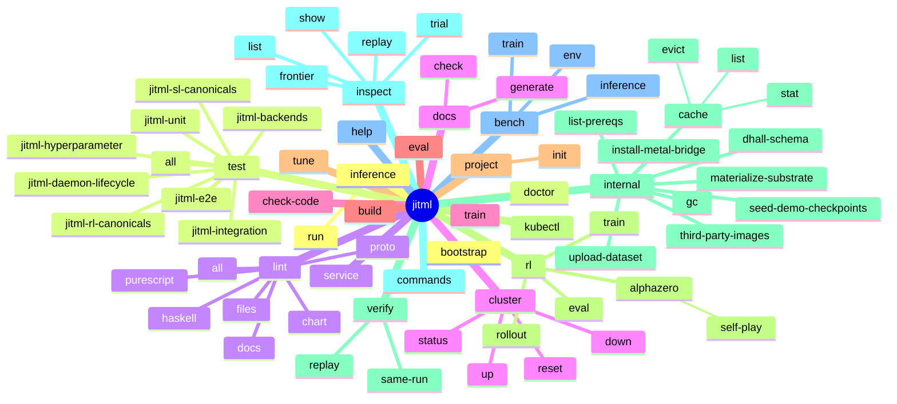
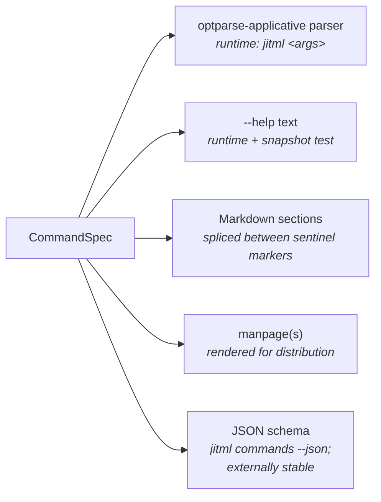
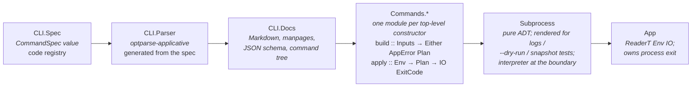

# jitML

**Status**: Authoritative source
**Supersedes**: N/A
**Referenced by**: DEVELOPMENT_PLAN/README.md, DEVELOPMENT_PLAN/00-overview.md, DEVELOPMENT_PLAN/system-components.md, documents/documentation_standards.md, documents/engineering/README.md, documents/engineering/cli_command_surface.md, documents/engineering/cluster_topology.md, documents/engineering/daemon_architecture.md, documents/engineering/jit_codegen_architecture.md, documents/engineering/apple_silicon_metal_headless_builds.md, documents/engineering/numerical_core.md, documents/engineering/training_workloads.md, documents/engineering/checkpoint_format.md, documents/engineering/purescript_frontend.md
**Generated sections**: command-tree, command-registry

> **Purpose**: Operator-facing project intent and authoritative high-level architecture for jitML.

> Deterministic, reproducible, JIT-compiled machine learning for Haskell.

`jitML` is a Haskell-native machine learning framework for training deep artificial neural networks with fully reproducible execution semantics across supervised learning and reinforcement learning workloads.

Unlike traditional ML frameworks that embed dynamic Python runtimes, opaque kernels, and nondeterministic execution paths, `jitML` treats *the entire training process* as a declarative, reproducible program.

Models, optimizers, datasets, reinforcement learning environments, checkpoints, hardware backends, loss functions, training schedules, hyperparameter sweeps, and cluster topology are all described in `.dhall`.

`jitML` then compiles hardware-specific kernels on demand, builds optimized native binaries, and executes them through Haskell FFI bindings.

The result is:

- reproducible training
- reproducible reinforcement learning
- reproducible stochasticity
- reproducible checkpoint recovery
- deterministic distributed execution
- hardware-native performance
- fully declarative experiment definitions

> **Doctrine and siblings:** This README is the authoritative project and CLI doctrine. jitML borrows its testing-and-determinism arc from a sibling deterministic Monte Carlo Tree Search runtime and its infrastructure layout from a sibling k8s-first inference control plane; the scopes of those projects are not combined with jitML's.

> **Development plan:** The single execution-ordered plan, sprint status, and cleanup ownership for jitML lives at [`DEVELOPMENT_PLAN/README.md`](DEVELOPMENT_PLAN/README.md). The plan adopts every in-scope doctrine section enumerated above in [Doctrine scope](#doctrine-scope) and binds each to an owning sprint; project-specific engineering docs live under [`documents/engineering/`](documents/engineering/README.md).

> **No-caveat product target:** The full end-to-end product target is closed again as of 2026-06-26: supported SL, RL, AlphaZero, and tuning workflows train or run for real, checkpoint, infer/evaluate, surface browser interactions, render live visualizations, and pass the Playwright e2e product matrix in the demo app. The closure evidence is tracked by Phases `8`–`18` in the development plan; the temporary demo/parser/runtime stand-ins have moved to `Completed` in [`DEVELOPMENT_PLAN/legacy-tracking-for-deletion.md`](DEVELOPMENT_PLAN/legacy-tracking-for-deletion.md).

---

## Table of contents

**Substrates & bootstrap** — [Why this exists](#why-this-exists) · [Toolchain pinning](#toolchain-pinning) · [Substrates and runtime modes](#substrates-and-runtime-modes) · [Substrate-affinity phasing](#substrate-affinity-phasing) · [Apple Silicon hybrid pattern](#apple-silicon-hybrid-pattern) · [Bootstrap scripts](#bootstrap-scripts) · [Built-artifact and JIT-cache discipline](#built-artifact-and-jit-cache-discipline) · [Prerequisites as typed effects](#prerequisites-as-typed-effects)

**Cluster & storage** — [Cluster topology and Kind](#cluster-topology-and-kind) · [Envoy Gateway API](#envoy-gateway-api-a-single-localhost-socket) · [Helm chart layout](#helm-chart-layout) · [Harbor](#harbor-as-the-registry) · [MinIO](#minio-object-store) · [TensorBoard event storage](#tensorboard-event-storage) · [Pulsar](#pulsar-as-the-control-plane--data-plane-bus) · [PostgreSQL](#postgresql) · [TensorBoard / Prometheus / Grafana](#tensorboard-prometheus-grafana-as-first-class)

**CLI & doctrine** — [Outer-container Linux builds](#outer-container-linux-builds) · [CLI command topology, typed](#cli-command-topology-typed) · [Doctrine scope](#doctrine-scope)

**Numerical & RL core** — [Numerical core](#numerical-core) · [Concrete Dhall worked example](#concrete-dhall-worked-example) · [Hyperparameter tuning](#hyperparameter-tuning-first-class) · [Canonical supervised learning problems](#canonical-supervised-learning-problems) · [Canonical reinforcement learning environments](#canonical-reinforcement-learning-environments) · [RL framework primitives](#rl-framework-primitives) · [RL algorithm catalog](#rl-algorithm-catalog) · [Convergence and determinism checks for RL](#convergence-and-determinism-checks-for-rl) · [AlphaZero-style self-play and persistent MCTS state](#alphazero-style-self-play-and-persistent-mcts-state) · [Checkpointing](#checkpointing) · [JIT compilation architecture](#jit-compilation-architecture) · [PureScript frontend](#purescript-frontend)

**Tests & benchmarks** — [Test-suite stanzas](#test-suite-stanzas) · [`jitml test all`](#jitml-test-all) · [Benchmarks](#benchmarks) · [Compiler, runtime, and backend tuning](#compiler-runtime-and-backend-tuning)

**Build & layout** — [Build and run](#build-and-run) · [Repository layout (target)](#repository-layout-target) · [Why Haskell?](#why-haskell) · [Vision](#vision) · [License](#license)

---

# Why this exists

The mainstream ML stack is Python + PyTorch / JAX + dynamic graphs + opaque CUDA kernels + best-effort seeding. It is fast at iterating on research ideas and slow at giving the same answer twice. Bit-exact reproduction is a debugging aid, not an architectural invariant: cuDNN convolutions are nondeterministic by default; data loaders shuffle in OS-thread order; mixed-precision reductions reassociate; checkpoint replay restores weights but not RNG state; hyperparameter sweeps record best-trial numbers but not the search-strategy state that produced them.

We want a runtime that is:

1. **Reproducible by construction.** Given identical inputs, seeds, and configuration, two runs produce identical outputs — including parameter initialization, minibatch ordering, optimizer state, RL trajectories, MCTS exploration paths, hyperparameter-trial selection, and checkpoint recovery. Reproducibility is an architectural requirement, not a flag.
2. **Declarative end-to-end.** A `.dhall` file is the full source of truth for a training run, a hyperparameter sweep, an RL experiment, or a cluster deployment. The CLI flags layered on top *override* the Dhall; they never replace it.
3. **Hardware-native without an embedded Python runtime.** jitML compiles kernels on demand for Apple Metal, NVIDIA CUDA, or oneDNN/AVX, with OpenCL held as a future extension, and executes them through Haskell FFI bindings. The runtime has no Python interpreter in the loop.

---

# Toolchain pinning

Per doctrine §Overview → Toolchain pinning, these versions are normative, not recommendations. The `.cabal` file declares `tested-with: ghc ==9.12.4`; `cabal.project` pins `with-compiler: ghc-9.12.4`; CI uses the same versions. Codegen toolchains (LLVM, NVCC, the host OS Metal runtime + fixed Metal bridge ABI, oneDNN) are pinned in `cabal.project` or the bridge metadata so kernel output is reproducible across hosts.

| Tool | Pinned version | Where it's pinned |
|---|---|---|
| GHC | `9.12.4` | `.cabal` (`tested-with`) and `cabal.project` (`with-compiler`) |
| Cabal | `3.16.1.0` | `cabal.project` |
| LLVM | pinned across GHC's `-fllvm` and JIT codegen | `cabal.project` |
| NVCC | pinned | `cabal.project` (`--use_fast_math=false`, baseline `sm_70`) |
| Metal (Apple) | host OS Metal runtime + fixed jitML Metal bridge; core cache misses render MSL and call `MTLDevice.makeLibrary(source:options:)`; no Tart, no keychain, no SwiftPM, no full Xcode, no offline `metal` in the core path | bridge ABI + Metal runtime policy in the Apple cache metadata |
| oneDNN | pinned | `cabal.project` (AVX2 baseline, AVX-512 detected at JIT time) |
| `kindest/node` | pinned | `./kind/cluster-<substrate>.yaml` (canonical); mirrored as a comment in `cabal.project` for the toolchain-truth record |
| Node.js, Poetry | pinned | Haskell prerequisite DAG |
| Haskell style tools | built with `9.12.4` | `docker/Dockerfile`; the code-quality stack uses the same pinned compiler inside `jitml:local` |

`cabal.project` carries no `allow-newer` override, no source-repository
package pins, and no local dependency packages. GHC `9.12.4` provides the
`base-4.21` family used by the package bounds, and the dependency set solves
against plain Hackage (`serialise`, `cborg`, `dhall`, and `lens-family`
included). The former source-pin/vendor compatibility helper has
been removed and recorded as completed cleanup in
[`DEVELOPMENT_PLAN/legacy-tracking-for-deletion.md`](DEVELOPMENT_PLAN/legacy-tracking-for-deletion.md).

The full per-target codegen detail (build flags, RTS options, fast-math discipline) lives under [Compiler, runtime, and backend tuning](#compiler-runtime-and-backend-tuning).

---

# Substrates and runtime modes

jitML produces **one Haskell front end** with JIT codegen for several hardware targets, packaged as **three supported substrates**[^linux-opencl]:

| Substrate | Codegen | Container shape | Service residency |
|---|---|---|---|
| `apple-silicon` | Haskell-rendered MSL + fixed host Metal bridge | partial — cluster services in Kind; a second `jitml service` runs host-native because Metal cannot be containerized | **one binary, two instances** of `jitml service`, distinguished entirely by their Dhall configs: clustered (Dhall: `residency = Cluster`, `inferenceMode = ForwardToHost`) + host-native (Dhall: `residency = Host`, `inferenceMode = SelfInference`). See [Bit-determinism contract](#bit-determinism-contract) for what same-substrate equality means under this split. |
| `linux-cpu` | oneDNN + AVX2/AVX-512 | fully containerized: `jitml:local` | one daemon: clustered `jitml service` (Dhall: `residency = Cluster`, `inferenceMode = SelfInference`); pod anti-affinity = one per node |
| `linux-cuda` | CUDA C + cuBLAS / cuDNN | fully containerized: `jitml:local` (CUDA activates at runtime when scheduled to `runtimeClassName: nvidia`) | one daemon: clustered `jitml service` (Dhall: `residency = Cluster`, `inferenceMode = SelfInference`); pod anti-affinity = one per node |

There is **one CLI surface for the daemon — `jitml service` — parameterised entirely by its Dhall config** ([CLI command topology, typed](#cli-command-topology-typed)). The Dhall declares substrate, residency (cluster | host), inference mode (`SelfInference` | `ForwardToHost`), and the host-side MinIO / Pulsar connection info when `residency = Host`. There is no separate `host-service` CLI verb.

On every substrate the in-cluster `jitml-service` Deployment is a **stateless Deployment**, not a StatefulSet: durable state lives in MinIO and Pulsar exclusively (no relational DB in jitML's path), the orchestrator owns no PVC of its own, and the local development topology is a single-node Kind cluster. Required pod anti-affinity at `topologyKey: kubernetes.io/hostname` preserves the one-service-pod-per-node rule when the chart is applied to a multi-node environment; on the local Kind stack this means the supported service replica count is one. `maxSurge: 0` / `maxUnavailable: 1` keeps replacement rollouts valid on that single node. The single Kind node keeps the JIT cache hostPath mounted from `./.build/` (see [Built-artifact and JIT-cache discipline](#built-artifact-and-jit-cache-discipline)). On every substrate the clustered daemon performs Pulsar fan-in/fan-out, durable state coordination, and client-facing routing. Linux substrates additionally execute device-backed workloads in-pod (`SelfInference`); Apple Silicon forwards every Metal-backed workload to the host daemon, since Metal cannot be containerized. Either mode is in principle expressible on either substrate; the substrate × mode table above reflects current practice.

[^linux-opencl]: An optional fourth substrate `linux-opencl` (Intel GPU) is admitted as a future extension; the codegen path is shaped to accept it without disturbing the three primary substrates above. Not in the current support matrix.

Each substrate carries its own determinism contract:

- **`apple-silicon`** — Metal compute kernels execute on the host GPU; float-accumulation order is fixed by the kernel's reduction tree (no fast-math); RNG state lives in the host daemon; kernel-launch ordering is single-stream by default. *Tradeoff: single-stream launch forfeits the multi-stream concurrency that hides launch latency at small batch sizes — the throughput cost is real and is the price of the bit-determinism contract.*
- **`linux-cpu`** — oneDNN dispatches to a per-host vector ISA detected at JIT time; reductions are blocked with a fixed block size so the accumulation tree is host-independent; RNG state lives in the clustered service pod.
- **`linux-cuda`** — CUDA kernels disable `--use_fast_math`; per-block reductions use a deterministic warp-shuffle pattern with one partial per warp and no device-side atomics, then host-side canonical partial finalization via `JitML.Engines.CudaRuntime`; generated artifacts expose a host-callable `jitml_kernel` wrapper that owns device-buffer allocation, deterministic launch, synchronization, and output copyback; cuBLAS and cuDNN are pinned to deterministic algorithm selections (`cudnnSetConvolutionMathType` + explicit algorithm-id pinning); RNG is the host's SplitMix64 stream from `JitML.Engines.Rng`, never the GPU's curand. *Tradeoff: cuDNN's deterministic convolution algorithms are typically 20-50% slower than its non-deterministic defaults on training workloads; this is the price of the bit-determinism contract.*

*Within a substrate, equality is guaranteed bit-for-bit* (see [Bit-determinism contract](#bit-determinism-contract)). **Across substrates, equivalence is not guaranteed and is not asserted — there is no tolerance band.** RNG draws and float reduction order differ between vendor BLAS/DNN libraries: float reductions reassociate and transcendentals (`exp`, `log`, `sqrt`, `tanh`) are implemented differently by cuDNN, Metal, and oneDNN, so cross-substrate numeric equivalence is explicitly out of contract.

---

# Substrate-affinity phasing

The repository is built and validated as an ordered sequence of development
phases, and the substrate matrix imposes two hard constraints on that order.
There are three substrates but **two distinct accelerator hardware classes** —
NVIDIA GPUs (`linux-cuda`) and Apple GPUs (`apple-silicon`) — and no single
machine has both. Combined with the rule above that *cross-substrate equivalence
is out of contract*, no phase can sensibly gate on two accelerators at once. Two
invariants follow, and they are binding doctrine for
[`DEVELOPMENT_PLAN/`](DEVELOPMENT_PLAN/README.md):

**Forward-Only Phase Dependencies.** A phase's obligations and every `Blocked
by` / dependency edge reference only equal-or-lower-numbered phases. A later
phase never blocks an earlier one. A later phase may *own* an obligation lifted
out of an earlier phase — that is an ownership transfer, not a blocker — so the
earlier phase closes on its retained surface. The dependency graph is a strict
forward DAG, so the plan is workable in numerical order: each phase is fully
validated before the next begins.

**Single-Accelerator Phase Validation.** Each phase validates on **at most one**
accelerator — exactly one of `{linux-cuda, apple-silicon}` — plus `linux-cpu`;
never both. A contract that must hold on both accelerators is split into two
sibling phases (one per accelerator), or attested per-lane in independent
sessions and aggregated by a later `linux-cpu`-only phase that consumes the
committed per-lane artifacts without re-running an accelerator. Concretely, a
phase's validation gate may not require both an `--apple-silicon` lane and a
`--linux-cuda` / `-fcuda` lane to pass together.

Together these make the plan **host-portable**: `linux-cpu`-only phases close on
any Docker host, a `linux-cuda` phase closes on the NVIDIA host (which also
provides `linux-cpu`), and an `apple-silicon` phase closes on the Mac host (which
also provides `linux-cpu`). Development moves machine-to-machine — switch to the
NVIDIA box for the CUDA phase, to a Mac for the Apple phase — and the forward DAG
guarantees you never backtrack. This generalizes the per-lane test model in
[Execution venue](#execution-venue-one-real-lane-per-substrate) (one real lane
per substrate, fail-by-design without its hardware) from test stanzas to whole
phases.

The binding form of these invariants — the per-clause rules, the
ownership-transfer carve-out, and the deterministic enforcement checks (zero
backward edges; no dual-accelerator validation gate) — lives in
[`DEVELOPMENT_PLAN/development_plan_standards.md` rule M](DEVELOPMENT_PLAN/development_plan_standards.md).

---

# Apple Silicon hybrid pattern

Metal cannot be containerized. The supported Apple lane is therefore hybrid: a stateless orchestrator pod runs in Kind exactly like on Linux, **and** a second `jitml service` runs host-native because the GPU lives there. Both daemons are the same binary; their Dhall configs are what differ.

Shape:

- The clustered `jitml-service` Deployment runs on every substrate (stateless; pod anti-affinity = one per node). On Apple Silicon its Dhall sets `inferenceMode = ForwardToHost`, so it **still** performs Pulsar fan-in/fan-out, demo proxying, trial-state persistence to MinIO bucket `jitml-trials`, and placement planning, but it forwards the actual Metal execution to the host daemon. The placement rule is by workload kind plus device capability: Linux CPU/CUDA device work may become in-cluster Jobs, while Apple Metal-backed inference, training, RL, tuning trials, and AlphaZero value/policy work are host-resident.
- `./.build/jitml service --config ./.build/conf/host/apple-silicon.dhall` runs **host-native** on Apple (Dhall: `residency = Host`, `inferenceMode = SelfInference`; no HTTP listener; Pulsar subscriber only). `./bootstrap/apple-silicon.sh` only performs stage-0 host gates and builds `./.build/jitml`; it then delegates to `./.build/jitml bootstrap --apple-silicon`, which writes the host and cluster Dhall files, brings up Kind, runs the phased Helm deploy from [Helm chart layout](#helm-chart-layout), and patches the host Dhall once the cluster publication is known.
- The cluster daemon forwards raw inference-domain payloads on the internal topic `inference.command.apple-silicon`. The host daemon **subscribes** to that topic, runs the Metal-backed Engine path, and publishes the matching `InferenceResult` / `CheckpointCompareResult` / `AdversarialMoveResult` directly to the request's reply topic, such as `inference.result.apple-silicon`. The same host-resident pattern covers non-inference Metal work through `training.host-command.apple-silicon`, `tune.host-command.apple-silicon`, and `rl.host-command.apple-silicon`; focused live tests and the full Apple lane assert host-command forwarding and no Apple Metal workload Jobs, and the final ledger audit is closed in [DEVELOPMENT_PLAN/legacy-tracking-for-deletion.md](DEVELOPMENT_PLAN/legacy-tracking-for-deletion.md).
- The host daemon **reads and writes large artifacts directly to MinIO** through the routed `/minio/s3` surface — same protocol the cluster daemon uses. New snapshot weights, optimizer state, and inference outputs go to MinIO straight from the host; the ACK envelope just references the MinIO keys. This keeps Pulsar lean and lets MinIO's optimistic concurrency on HEAD updates serialize concurrent commits (see [Checkpoint snapshot model](#checkpoint-object-layout)).
- On an Apple cache miss, the host daemon renders MSL plus launch metadata into
  the content-addressed cache, then calls the fixed host Metal bridge. The bridge
  compiles the MSL with `MTLDevice.makeLibrary(source:options:)` (fast math off),
  creates/reuses the compute pipeline in-process, and dispatches on the host GPU.
  The core path does not start Tart, invoke SwiftPM, install full Xcode, require
  the offline `metal` compiler, or depend on login-keychain state. See
  [Built-artifact and JIT-cache discipline](#built-artifact-and-jit-cache-discipline)
  and
  [documents/engineering/apple_silicon_metal_headless_builds.md](documents/engineering/apple_silicon_metal_headless_builds.md).
- Pulsar endpoint discovery: `jitml bootstrap --apple-silicon` writes the routed coordinates to `./.build/runtime/cluster-publication.json`, then updates `./.build/conf/host/apple-silicon.dhall` with the current `BootConfig` fields (`pulsarServiceUrl`, `pulsarAdminUrl`, `minioEndpoint`, `harborRegistry`). `JitML.Service.Clients` derives the host daemon's `/pulsar/ws`, `/minio/s3`, Harbor API, and repo-local kubectl settings from that Dhall. No service-discovery RPC; the cluster publishes its own coordinates to a known file and the host daemon reads its Dhall config.
- The host daemon's only cluster contracts are Pulsar (RPC envelopes) and MinIO (large artifacts). Direct k8s API access from the host is forbidden and lint-enforced.

On Linux substrates the clustered daemon's Dhall sets `inferenceMode = SelfInference`, so it executes kernels in-pod (the substrate image carries the full JIT toolchain and, for CUDA Jobs, the NVIDIA runtime). For `linux-cpu`, the service dispatcher runs the latest-pointer/manifest read through `loadInferenceCheckpointWithWeights` and hands decoded weights to `runLinuxCpuWeightedCheckpointInference`, so routed `RunInference` messages use the generated-kernel FFI runner before publishing `InferenceResult`. For `linux-cuda`, the same dispatcher shape calls the guarded CUDA weighted checkpoint runner, which requires a positive CUDA runtime probe before compile/load/launch and otherwise returns a transient inference error before compilation. There is no separate `inference.command.linux-*` topic; the Pulsar topology degenerates to the demo-facing `inference.request.<mode>` / `inference.result.<mode>` pair. Apple Silicon is the only substrate where a second daemon resides on the host and an Apple-only `inference.command.apple-silicon` forwarding topic exists; the superseded command/event refs RPC is removed. The host-command topic family generalizes host-resident routing beyond inference so the in-cluster Apple daemon does not schedule Metal-backed training/RL/tuning starts into Linux pods.

---

# Bootstrap scripts

Stage-0 bootstrap entrypoints, one per substrate:

```
./bootstrap/apple-silicon.sh
./bootstrap/linux-cpu.sh
./bootstrap/linux-cuda.sh
```

Each script is **idempotent and restartable**, but deliberately small: it probes only the host state needed to get to the real Haskell bootstrap, fails fast with installation instructions when a non-recoverable host prerequisite is missing, then delegates. Package reconciliation after that point belongs to `jitml bootstrap --<substrate>` and the typed prerequisite DAG in [Prerequisites as typed effects](#prerequisites-as-typed-effects).

> **Bootstrap verbs are not CLI verbs.** Historical script verbs such as `doctor`, `status`, `down`, and `purge` remain script conveniences, but the cluster bootstrap contract is the Haskell command `jitml bootstrap --apple-silicon | --linux-cpu | --linux-cuda`. Script `up` is a wrapper around that command.

- `apple-silicon.sh` checks that the host is macOS on Apple Silicon, the source-build prerequisites for `./.build/jitml` are available, and Homebrew is installed when typed remediation may need it. If any gate fails, it exits with a short, actionable install message. If the gates pass, it builds `./.build/jitml` host-native, then calls `./.build/jitml bootstrap --apple-silicon`. The Haskell bootstrap writes Dhall under `./.build/conf/`, creates the Kind cluster, brings MinIO and the registered Percona `harbor-pg` database up first, brings Harbor up against those dependencies, builds `jitml:local`, retags it as `jitml-demo:local`, loads those tags explicitly into Kind, then rolls out Pulsar, Prometheus/Grafana, Envoy Gateway, the `jitml-service` cluster daemon via Helm, and the demo app. Because Apple still builds `jitml:local` for the in-cluster daemon, the Docker image build is also the exclusive Haskell style-tool bootstrap and code-quality gate. Once the localhost edge port is selected, bootstrap updates the host Dhall so the host daemon can reach Pulsar and MinIO; `./bootstrap/apple-silicon.sh run-daemon` rebuilds / code-signs the host binary if needed, then starts `./.build/jitml service --config ./.build/conf/host/apple-silicon.dhall`. The host does **not** install style tools or code-quality tooling during bootstrap. Core Apple Metal cache misses require only the OS Metal runtime and the fixed jitML bridge probe; optional Swift/SDK probes are for non-core Swift JIT modules, not training/inference cache misses.
- `linux-cpu.sh` checks that Docker is installed and usable by the current user without `sudo`. If the gate passes, it calls `docker compose run --rm jitml jitml bootstrap --linux-cpu`; Compose builds the outer `jitml` image automatically and the root `compose.yaml` runs that service with host networking so the outer-container Kind kubeconfig loopback endpoint is reachable. The in-container bootstrap deploys the same cluster stack, and the outer container exits once the in-cluster daemon is in charge. Linux has no host daemon and no host-level Dhall: only the ConfigMap Dhall mounted into the cluster daemon is needed.
- `linux-cuda.sh` performs the Linux CPU Docker gate plus CUDA gates: the NVIDIA container runtime must be available, and `nvidia-smi` must report at least one device meeting the required compute capability. Missing gates fail fast before any CUDA Kind cluster is created. If the gates pass, it calls `docker compose run --rm jitml jitml bootstrap --linux-cuda` through the same headless, host-networked compose service; after that the rollout is the same as Linux CPU, with the CUDA RuntimeClass, GPU label on the single Kind node, node-local containerd `nvidia` runtime handler, repo-owned NVIDIA runtime config, and read-only `/run/nvidia/driver` host driver-root mount applied by bootstrap. Direct live CUDA tests that need the outer container itself to see NVIDIA devices use the companion `jitml-cuda` compose service.

> **Authenticated third-party image pre-pull.** The `docker.io/*` third-party chart images (MinIO, Pulsar, Harbor, …) are pre-pulled **authenticated on the host** and `kind load`ed before the cluster rolls out, so the Kind node's containerd never pulls them anonymously from Docker Hub and trips the Docker Hub **429** rate limit on a cold host. The pre-pull only **reads** the host's existing `docker login` (so `docker login` to Docker Hub once per host); it never writes `~/.docker/config.json`, preserving the no-touch invariant below. This is jitML's own self-contained Docker Hub credential path, owned by the project.

Cleanup semantics matter:

- `down` tears down the cluster; preserves `./.data/` and `./.build/`.
- `purge` is destructive but **cache-preserving**: cluster down, `rm -rf ./.data/`. `./.build/` survives — including `./.build/jit/apple-silicon/`, `./.build/runtime/`, `./.build/conf/`, and the Kind metadata needed for subsequent `docker compose run --rm jitml jitml <command>` calls. A subsequent bootstrap or inference command can resolve from cache without re-JITting any model already compiled. On Apple, a cached kernel is a `<hash>.metal.json` source/metadata record plus the process-local bridge pipeline cache; there is no VM rebuild on a cache hit.
- `purge --full` is `purge` plus `rm -rf ./.build/` (and on Linux, `docker compose down --rmi local --volumes` to drop the substrate image). Use only for fresh-start debugging.

Forbidden: anything that touches `~/.kube/config`, `~/.docker/config.json`, or global state outside the repo except typed prerequisite remediation that explicitly installs Homebrew packages. Shell bootstrap scripts never write the user's Homebrew prefix; Haskell `jitml` may validate and install Homebrew packages lazily, on demand, through the typed prerequisite DAG. Build outputs, generated Dhall, runtime coordinates, kubeconfig, Kind metadata, and JIT artifacts live under `./.build/`; `./.data/` is reserved strictly for manual PV bind mounts. Both roots are in `.gitignore` **and** `.dockerignore` so the substrate image never accidentally bakes in host artifacts.

---

# Built-artifact and JIT-cache discipline

`./.build/` is the **only** host folder that holds compiled artifacts and bootstrap runtime metadata: the `jitml` binary, JIT-compiled kernels, generated JIT source inputs, generated Dhall, kubeconfig, Kind metadata, and cluster publication files. Layout:

```
.build/
├── jitml                                    -- the binary (Apple: host-built via ghcup; Linux: container-built, bind-mounted out)
├── jitml.kubeconfig                         -- repo-local kubeconfig only
├── conf/
│   ├── host/apple-silicon.dhall             -- Apple-only host daemon config, patched with routed cluster coordinates
│   └── cluster/<substrate>.dhall            -- rendered into the jitml-service ConfigMap
├── runtime/cluster-publication.json          -- edge port, Pulsar, MinIO, and related routed coordinates
├── kind/<substrate>/                         -- Kind metadata/config needed by later bootstrap and Docker Compose invocations
├── host/apple-silicon/                      -- Apple-only: fixed Metal bridge and host-side runtime metadata
├── jit-src/<substrate>/<hash>/               -- generated compiler inputs emitted by Haskell renderers
└── jit/
    ├── manifest.json                        -- cache index keyed on (model-id, kind, substrate, toolchain)
    └── <substrate>/<hash>.<ext>             -- one file per cached kernel (content-addressed; the canonical location of every kernel artifact)
```

**JIT source boundary.** Every per-kernel native/foreign source file used by the
JIT path is generated by Haskell renderers under `src/JitML/Codegen/` and
materialized under the build/cache tree on cache miss. The repository does not
accept checked-in CUDA `.cu`, C/C++ `.cc` / `.cpp`, per-kernel MSL source files,
Swift package source files, native adapter shims, or JIT build scripts. A fixed non-kernel
Apple Metal bridge may be checked in or generated as part of the jitML
source-build; it is not regenerated per model. If jitML needs a per-kernel native
compiler input or adapter for a runtime path, the Haskell engine renders it into
the build/cache tree; otherwise `jitml lint files` rejects it as static source.

**Role split.** Linux cache entries are compiled shared objects under
`jit/<substrate>/<hash>.so`. Apple cache entries are source/metadata records
under `jit/apple-silicon/<hash>.metal.json`; the fixed host bridge is stable
process infrastructure, not a generated artifact per kernel. The current local
Linux CPU validation path uses `JitML.Engines.Loader` to materialize generated
source, fill cache misses with `g++ ... -ldnnl`, and expose the `dlopen` symbol
helper; `JitML.Engines.Local` runs generated oneDNN reorder, reduction, matmul,
convolution, normalization, attention, and embedding primitives through that
boundary and verifies the exported `jitml_kernel_family_name` and
`jitml_kernel_output_count` ABI symbols. Generated CUDA exports a host-callable
`jitml_kernel` wrapper plus the same family/output-count metadata ABI;
`JitML.Engines.CudaLocal` consumes a positive CUDA runtime probe before
compile/load/launch and fails closed before compile when `nvcc`/GPU runtime is
unavailable. Apple MSL source metadata carries the family/output-count contract
for `JitML.Engines.MetalLocal`, which calls the fixed bridge instead of
`dlopen`ing a generated dylib. The local Linux CPU toolchain fingerprint includes
`artifact-abi=<os>-<arch>`, so a Darwin host and the Linux `jitml:local`
container do not reuse the same `.build/jit/linux-cpu/<hash>.so` path for
loader-incompatible artifacts.

**Cache key — shape + kind + generated source, weight-independent.** Each entry is hashed over `(canonical-cbor(KernelSpec), kind, substrate, toolchain-fingerprint, rendered-source-payload, tuning-choice)` where `KernelSpec` is model shape (layer topology, dtype layouts, activation choices) and `kind` is `training | inference`. Training and inference kernels are **separate artifacts** because they have different compute graphs — training carries the backward pass and optimizer-step kernel; inference is forward-only with frozen-weight constant folding enabled. Sharing one artifact across both would force one of them to be sub-optimal. The rendered-source payload is generated by the Haskell runtime source renderers under `src/JitML/Codegen/`; changing a renderer invalidates the compiled artifact. Toolchain fingerprints also carry loader-relevant ABI facts for local FFI paths, including the Linux CPU `artifact-abi=<os>-<arch>` value.

Consequence: a model that is both trained and used for inference has **two JIT artifacts in its lifetime**, regardless of how many checkpoints exist along its training history. Two snapshots of the same model share their weight layers (per the multi-object snapshot model in [Checkpoint object layout](#checkpoint-object-layout)) but never produce additional JIT compiles.

**Fixed-bridge Apple Metal cache misses.** Bootstrap and host daemon startup do
no per-kernel build. On a JIT cache miss, the daemon renders canonical MSL plus
launch metadata, writes `./.build/jit/apple-silicon/<hash>.metal.json`
atomically, and calls the fixed host Metal bridge. The bridge compiles the MSL
in-process through `MTLDevice.makeLibrary(source:options:)`, creates/reuses a
pipeline, and dispatches on the host GPU. Subsequent persistent cache hits reuse
the `.metal.json` source artifact; subsequent in-process calls reuse the bridge
pipeline cache. Optional `MTLBinaryArchive` persistence may accelerate pipeline
creation later, but source metadata remains the correctness artifact.

**Cache survives purge.** `./bootstrap/apple-silicon.sh purge` clears runtime
state but **preserves `./.build/`**. After `purge`, every previously rendered
Apple source artifact is still on disk under `./.build/jit/apple-silicon/`, so
the next bootstrap plus any inference command resolves from cache without
re-rendering model source. Runtime pipeline caches are process-local and are
rebuilt from `.metal.json` when needed.

**Linux substrates share the same cache via Kind extraMounts.** The Kind cluster
config bind-mounts host `./.build/` into the single Kind node, and the
`jitml-service` Deployment mounts that path into the pod at `/opt/build`. Linux
JIT operations happen entirely in the cluster; the outer
`docker compose run --rm jitml jitml <command>` container only re-enters the
cluster using metadata persisted under `./.build/`. Apple execution happens on
the host daemon because Metal cannot be containerized, but the cache root and
content-addressing rules are the same. This is the **one** exception to the "no
freestanding host paths in pod specs" discipline; the chart lint permits exactly
this hostPath and rejects any other.

---

# Prerequisites as typed effects

Per doctrine §Prerequisites as Typed Effects, prerequisite checks are first-class typed values: a DAG of named `Prerequisite` nodes that gate every reconcile run. Each node has a typed predicate, a typed remediation action (or `Nothing` if the prerequisite is non-recoverable), and an explicit dependency list. Stage-0 shell scripts use only the minimal host gates required to reach the Haskell binary or outer Docker container; the Haskell prerequisite DAG is the source of truth for every lazy package remediation after that.

Homebrew package installation is allowed only through this typed path. A Homebrew prerequisite carries a package identity, install/upgrade policy, validation predicate, and human-readable remediation. The pure plan phase computes which packages are missing; the apply phase executes through the typed `Subprocess` layer; the postcondition re-validates the package before the next dependent node runs. This keeps lazy package installation deterministic and testable without spreading ad hoc `brew install` calls through scripts.

A reconciler that finds a missing prerequisite fails with exit code `2` (system error per [Exit codes and error rendering](#exit-codes-and-error-rendering)) and a structured diagnostic naming the missing node plus its remediation, if any. The bootstrap scripts at [`./bootstrap/`](#bootstrap-scripts) are the user-facing tip of this system; the Haskell prerequisite DAG is the in-process source of truth.

---

# Cluster topology and Kind

Per-substrate Kind configs at `./kind/cluster-<substrate>.yaml`. Every substrate uses a single-node Kind cluster: one `control-plane` node and no separate `worker` node. Apple Silicon and Linux CPU use that node without substrate-specific labels. Linux CUDA labels the same single node `jitml.runtime/gpu=true` so the NVIDIA runtime class binds there. After `kind create`, the bootstrap reconciler caps that node container's memory and CPU (`docker update --memory/--memory-swap/--cpus`) from the typed `dhall/cluster/` resource profile, so the whole-cluster footprint is bounded and a runaway rollout cannot exhaust the host.

The edge port (Envoy listener) is selected starting at 9090 and incremented until available; recorded as the `edge_port` field of `./.build/runtime/cluster-publication.json` (the single file bootstrap writes; see [Apple Silicon hybrid pattern](#apple-silicon-hybrid-pattern) for its other fields) and reported by `jitml cluster status`. NodePort 30090 is the in-cluster service for the edge gateway.

Kubeconfig lives at `./.build/jitml.kubeconfig`. The CLI never touches `~/.kube/config`. The `kindest/node` version is referenced in the Kind config under `./kind/cluster-<substrate>.yaml`; the same pin appears as a comment in `cabal.project` purely as a single-source-of-toolchain-truth record (Cabal itself does nothing with it), and the lint stack rejects drift between the two.

Storage is a `jitml-manual` storage class (no provisioner) backed by host-path PVs under `./.data/<namespace>/<StatefulSet>/pv_<integer>`. `.data` is only for these manual PV bind mounts; runtime metadata, Kind metadata, generated config, and kubeconfig live under `./.build/`.

The host `./.build/` directory is bind-mounted into the single Kind node via the `extraMounts` block in `./kind/cluster-<substrate>.yaml`, which is what lets the in-cluster `jitml-service` pod see the same JIT artifacts the host built (see [Built-artifact and JIT-cache discipline](#built-artifact-and-jit-cache-discipline)).

Apple Silicon has one additional Postgres storage implementation detail: the
registered manual PV paths are still rendered under `./.data/`, but before the
Percona Postgres cluster starts, bootstrap bind-mounts node-local directories
under `/var/local/jitml-postgres-pv/...` over the corresponding paths inside
the Kind node and normalizes those node-local directories to uid/gid `26:26`.
This avoids macOS/Colima bind-mount ownership drift for Harbor's Percona
Postgres relation files. Linux substrates use the `.data` hostPath directly
with ownership normalization.

---

# Envoy Gateway API: a single localhost socket

> "There is to be a single socket accessible to localhost with Envoy as the reverse proxy to all the endpoints."

**Ports at a glance.**

- `127.0.0.1:<edge-port>` — the single user-facing socket. Selected by bootstrap starting at `9090` and autoincremented if taken.
- `NodePort 30090` — the in-cluster Envoy service that the edge port maps to.
- `./.build/runtime/cluster-publication.json` — the single file bootstrap writes; `edge_port` lives here alongside `pulsar_url`, `minio_url`, and component health. `jitml cluster status` reads this file.

One Envoy-Gateway-API-owned localhost listener (`Gateway/jitml-edge`, port chosen by bootstrap starting at `9090`) backed by the repo-owned `EnvoyProxy/jitml-edge` service shape:

- `GatewayClass/jitml-gateway` references `EnvoyProxy/jitml-edge`, and `Gateway/jitml-edge` listens at `127.0.0.1:<edge-port>`.
- `EnvoyProxy/jitml-edge` is a NodePort service with `externalTrafficPolicy: Cluster`; the Gateway listener port is pinned to NodePort 30090 for the Kind host-port mapping.
- Routes are not hand-written YAML; they are Haskell-rendered `HTTPRoute` resources from a single **route registry** in `src/JitML/Routes.hs`. The registry is the source of truth, consumed by both the chart-template renderer and the `docs check`/`docs generate` pair that gates route-table and chart-template drift (per doctrine §Generated Artifacts).

Routes published at the edge (all under one `127.0.0.1:<edge-port>`):

| Path prefix | Upstream | Rewrite |
|---|---|---|
| `/` | `jitml-demo:80` (the PureScript app) | (none) |
| `/api` | `jitml-demo:80` | (none) |
| `/api/ws` | `jitml-demo:80` WebSocket | (none) — live training events |
| `/tensorboard` | `tensorboard:80` | `/` |
| `/grafana` | `kube-prometheus-stack-grafana:80` | `/` |
| `/prometheus` | `kube-prometheus-stack-prometheus:9090` | `/` |
| `/harbor` | `harbor:80` | `/` |
| `/harbor/api` | `harbor:80` | `/api` |
| `/v2` | `harbor:80` | (none) |
| `/service` | `harbor:80` | (none) |
| `/minio/console` | `minio:9001` | `/` |
| `/minio/s3` | `minio:9000` | `/` |
| `/pulsar/admin` | `pulsar-proxy:80` | `/admin` |
| `/pulsar/ws` | `pulsar-broker:8080` WebSocket | `/ws` |

TLS is off for the local demo. The production-deployment posture is intentionally not specified by this README; the route registry just declares the local-demo surfaces.

---

# Helm chart layout

Single umbrella chart at `./chart/`. `Chart.yaml` declares subchart dependencies:

- `harbor` — image registry.
- `pg-operator` + `pg-db` — Percona Kubernetes Operator, providing Patroni-managed HA Postgres for every packaged service that requires Postgres (jitML itself never writes to it — see [PostgreSQL](#postgresql)).
- `pulsar` — Apache Pulsar with ZooKeeper + BookKeeper + Broker + Proxy + WebSocket.
- `minio` — distributed mode, four replicas.
- `gateway-helm` — Envoy Gateway controller.
- `kube-prometheus-stack` — Prometheus operator + Grafana.
- `tensorboard` — a jitML-owned chart for TensorBoard with MinIO-backed event storage.

Templates in `chart/templates/`: GatewayClass, Gateway, HTTPRoutes (rendered from the route registry), EnvoyProxy, manual PVs (one per replica, see below), the `jitml-service` Deployment, NVIDIA RuntimeClass for the CUDA substrate, Grafana datasources and dashboards (provisioned ConfigMaps), Prometheus scrape configs. The `jitml-demo` Webapp Deployment lives in `chart/local/jitml-demo`.

Helm values ownership follows the same umbrella-chart rule as
[documents/engineering/cluster_topology.md](documents/engineering/cluster_topology.md#helm-values-ownership):
`chart/templates/` is manifest-only, and subchart configuration belongs under
the consuming key in `chart/values.yaml` unless a typed Helm invocation
explicitly passes a separate `--values` file. Standalone
`chart/<subchart>-values.yaml` fragments are cleanup candidates when no such
typed invocation exists.

## Storage discipline: `kubernetes.io/no-provisioner` only

Every StorageClass uses the `kubernetes.io/no-provisioner` provisioner — no dynamic provisioning anywhere in the chart. Every PV is **manually defined** in `chart/templates/pv-<statefulset>.yaml` against the `jitml-manual` StorageClass and backed by the repo-local `./.data/<namespace>/<StatefulSet-name>/pv_<replica-int>/` directory, mounted into Kind at `/jitml/.data/...`. StatefulSet-owned PVCs bind through explicit PV-side `claimRef.namespace` / `claimRef.name`. Operator-generated Percona PVCs instead bind through explicit `volumeName` fields rendered in the registered `PerconaPGCluster`, because the operator-generated PVC names carry a controller suffix. Both paths are explicit; neither uses dynamic provisioning.

Naming convention is uniform: **`<k8s-namespace>/<StatefulSet-name>/pv_<replica-int>`** on disk, and **`<namespace>-<statefulset>-pv-<int>`** as the PV resource name (DNS-1123 compatible). Example layout for the `platform` namespace on the Apple Silicon substrate:

```
.data/
└── platform/
    ├── minio/{pv_0, pv_1, pv_2, pv_3}                  -- 4 distributed replicas
    ├── pulsar-bookkeeper/{pv_0, pv_1, pv_2}            -- 3 bookies
    ├── pulsar-zookeeper/{pv_0, pv_1, pv_2}             -- 3 ZK nodes
    ├── harbor-pg/{pv_0, pv_1, pv_2}                    -- 3 Postgres instances
    └── harbor-pg-repo1/pv_0                            -- pgBackRest repo
```

Corresponding PV resources are named `platform-minio-pv-0`, `platform-pulsar-bookkeeper-pv-1`, etc.; StatefulSet PVs are bound to the per-replica PVC (e.g. `data-minio-0`, `journal-pulsar-bookkeeper-1`), and registered Percona PVs are bound by `volumeName`. `jitml lint files` rejects any path under `.data/` that does not match the `<namespace>/<StatefulSet>/pv_<int>` regex, and `jitml lint chart` rejects any StorageClass with a provisioner other than `kubernetes.io/no-provisioner`, any freestanding PVC, and any PV without either an explicit `claimRef` or a registered Percona `volumeName` binding.

On the single-node local Kind stack the platform is bounded by a typed Dhall cluster-resource profile (`dhall/cluster/`): the kind node container is memory/CPU capped after creation (so an over-budget cluster OOM-kills its own pods inside the node cgroup rather than taking down the host), the heavy subcharts are right-sized (MinIO `4→1–2`, Pulsar `3→1`, service Postgres `3→1`) with per-pod CPU/memory requests+limits, and a `cluster.host-memory` preflight refuses to bootstrap when host RAM is below the cap. The example layout above reflects the unbounded upstream default; the right-sized local layout has correspondingly fewer PVs.

## `jitml-service` Deployment, not StatefulSet

The orchestrator is a stateless **Deployment** with `replicas: 1` by default and required pod **anti-affinity** at `topologyKey: kubernetes.io/hostname`. The local Kind topology is single-node, so the supported local replica count is one; the anti-affinity rule remains in the chart so a non-local multi-node environment can scale to N replicas without placing two service pods on the same node. Its rolling update strategy uses `maxSurge: 0` and `maxUnavailable: 1`, so the single-node Kind cluster can replace the lone pod without creating an unschedulable surge pod. The daemon owns no PVC of its own — durable state lives entirely in MinIO and Pulsar — so a StatefulSet (which exists for stable identity + ordered scale-up + per-pod PVCs) would be the wrong shape. The Kind node maintains its JIT cache under the mounted `./.build/jit/<substrate>/` hostPath, which is fine because JIT artifacts are deterministic functions of `(model-shape, kind, substrate, toolchain)`.

Namespace: `platform` (fixed). `jitml bootstrap --<substrate>` creates it idempotently.

**Phased deploy** (verbatim from infernix's lessons):

1. **Harbor phase**: MinIO starts first so the `harbor-registry` bucket exists, the Percona operator applies and waits for the registered `harbor-pg` database, and Harbor then starts against those live dependencies.
2. **Image build/load phase**: `jitml:local` is rebuilt locally, retagged as `jitml-demo:local`, and both tags are loaded explicitly into the selected Kind cluster with `kind load docker-image`.
3. **Final phase**: Pulsar, Envoy Gateway, kube-prometheus-stack, TensorBoard, the jitML service workload (all substrates: Linux self-inference plus Apple forward-to-host), and the jitML-demo workload roll out after the local image tags are present in Kind. Bootstrap applies the repo-owned foundation manifests before Helm, waits on explicit platform rollout/readiness checks, and applies the repo-owned Gateway/HTTPRoute manifests after the controller is installed.

This avoids a hidden DNS/trust assumption between the host Docker daemon, the Kind node runtime, and an in-cluster Harbor registry while still bringing Harbor up as the platform registry surface.

---

# Harbor as the registry

Harbor is the platform registry surface. The local Kind bootstrap path is explicit: it rebuilds `jitml:local`, retags it as `jitml-demo:local`, loads both tags into Kind with `kind load docker-image`, and sets the in-cluster workloads to `imagePullPolicy: IfNotPresent`. The Harbor Helm release receives an explicit localhost `externalURL` for the selected edge port, and the edge routes send Harbor's public portal/API/registry/token paths through the chart's public `harbor` nginx service. The `HasHarbor` subprocess client takes explicit registry/API settings, Docker host socket when the local daemon is not at Docker's default path, and a repo-local Docker config directory under `./.build/docker/harbor`; live Linux CPU validation has exercised push/promote, pull, artifact existence, and repository listing without environment variables or global Docker config writes.

Harbor's own image-chart storage backend is **MinIO** (S3 API), so Harbor's blobs and MinIO's buckets share a durability story. Live Linux CPU validation has pushed an OCI artifact through Harbor's registry HTTP API and confirmed the matching repository objects in the `harbor-registry` bucket. The local Docker-backed path is also validated through the selected localhost edge: a repo-local Docker config logs into `127.0.0.1:<edge-port>`, pushes and pulls a test image, lists the repository through `/harbor/api`, and confirms the tag through Harbor's artifact API.

Routed at `/harbor` (portal), `/harbor/api` (API), `/v2` (Docker registry), and `/service` (Harbor token service).

---

# MinIO object store

Buckets, provisioned by the Helm `provisioning.buckets` block:

- `harbor-registry` — Harbor's S3 backend (128 MiB chunk size).
- `jitml-checkpoints` — training checkpoints. One prefix per experiment hash; content-addressed blobs + manifests + ETag-guarded pointers inside the prefix (see [Checkpoint object layout](#checkpoint-object-layout)).
- `jitml-datasets` — pinned source datasets (MNIST, Fashion-MNIST, CIFAR-10 binaries). Lazily populated on first use, SHA-256 verified against the experiment Dhall.
- `jitml-transcripts` — RL trajectory transcripts (the analog of MCTS's `.mcts-cache/transcripts/`).
- `jitml-trials` — hyperparameter trial transcripts, content-addressed by `sha256(resolved-dhall || trial-seed)`.
- `jitml-tensorboard` — TensorBoard event files so the TB pod is stateless and can reschedule freely (see [TensorBoard event storage](#tensorboard-event-storage)).
- `jitml-artifacts` — large inference outputs (when the demo is in inference mode).

Endpoints: `minio.platform.svc.cluster.local:9000` (in-cluster); `127.0.0.1:<edge-port>/minio/s3` (routed). Credentials pinned in values for the local demo; the production-deployment posture is intentionally not specified by this README. Bootstrap readiness checks every typed bucket through the Bitnami in-pod MinIO client (`mc`) before continuing to the topic bootstrap. `JitML.Service.MinIOSubprocess` is the subprocess-backed live HTTP S3 `HasMinIO` interpreter; it signs canonical path-style S3 URLs with `curl --aws-sigv4` and sends routed edge requests with `--request-target /minio/s3/...` so Envoy can rewrite to the upstream MinIO path without breaking SigV4.

The MinIO server version is pinned to a release with S3 conditional-write support (`If-None-Match`, `If-Match`) — `RELEASE.2024-08-26T15-33-07Z` or later. The concurrency story below depends on it.

## Checkpoint object layout

> **Durable-state registry.** The MinIO bucket set, the logical Pulsar topic family, and per-store retention are declared in the closed, self-validating `jitml.dhall` (generated by `jitml project init`). `JitML.Storage.Buckets.bucketNames` projects the registry's `ObjectBucket` entries, the topic logical names are anti-drift-checked against `JitML.Coordinator.Topology`, and the checkpoint GC retention is sourced from the registry's `checkpoints` store (replacing the former hardcoded `LastN 5`). An over-budget / over-quota / write-to-`Retired` / undeclared-store topology is a Dhall typecheck failure — see [documents/engineering/durable_state_dsl.md](documents/engineering/durable_state_dsl.md).

The `jitml-checkpoints` bucket uses a fixed prefix schema, owned by Haskell modules under `src/JitML/Checkpoint/` so paths are typed values rather than stringly-typed call sites:

```
jitml-checkpoints/
  <experiment-hash>/                      -- sha256(resolved-dhall || substrate-fingerprint)
    blobs/<sha256>                        -- write-once, content-addressed, opaque bytes
    manifests/<sha256>                    -- write-once, content-addressed, CBOR manifest objects
    pointers/
      latest                              -- mutable, ETag-CAS; body = 32-byte manifest sha
      best/<metric>                       -- mutable, ETag-CAS; body = 32-byte manifest sha
      trial/<trial-hash>/latest           -- per-HPO-trial latest pointer
      trial/<trial-hash>/best/<metric>    -- per-HPO-trial best pointer
```

Three object classes, two write protocols:

- **`blobs/<sha256>`** — write-once content-addressed payloads. Each blob's key *is* `sha256(its bytes)`. PUTs use `If-None-Match: *` and treat `412 Precondition Failed` as success (the bytes already exist by definition). One checkpoint produces **many blobs**: one per model layer's weights (`encoder.weight`, `encoder.bias`, `head.weight`, …), plus one for optimizer state, one for RNG state, and (RL only) one each for replay buffer and exploration cache. Per-layer granularity is what makes dedup across checkpoints automatic — two consecutive checkpoints that differ only in their final layer share every other layer's blob by content hash.
- **`manifests/<sha256>`** — write-once content-addressed CBOR objects naming the blob SHAs that constitute one logical checkpoint plus the metadata needed to interpret them: the parent manifest's SHA (for linear history), the layer-name → blob-SHA map, the step count, the resolved Dhall hash, the substrate that produced the bytes. Same `If-None-Match: *` write protocol. The manifest's SHA is the canonical *checkpoint id* used by Pulsar `CheckpointDone` events, RPC envelopes, and `--resume <checkpoint-id>`.
- **`pointers/*`** — the only mutable objects. Each pointer's body is a 32-byte manifest SHA. Updates use S3 conditional `PUT` with `If-Match: <etag>` — textbook compare-and-swap. The `pointers/latest` update is the **single atomic commit point** for a checkpoint: layer-level blob writes can happen in any order and may even leave orphans on failure, but the manifest is only adopted as HEAD when its pointer update succeeds. Optimistic concurrency therefore applies to the **entire snapshot**, not per layer — which is what guarantees a linear sequence of checkpoints with no orphan branches or split heads.

Current checked-in code implements the key renderers, manifest CBOR codec,
pointer-CAS decision surface, and a filesystem-backed local checkpoint store in
`JitML.Checkpoint.Store`, including `loadInferenceCheckpointWith`, which lets a
loaded weight-only manifest run through a concrete engine. The local Linux CPU
validation path uses `JitML.Engines.Local.runLinuxCpuCheckpointInference` to
compile, load, and execute a generated FFI kernel from that checkpoint read;
`loadInferenceCheckpointWithWeights` also decodes `.jmw1` weight blobs and
passes them to `JitML.Engines.Local.runLinuxCpuWeightedCheckpointInference` for
the weighted local oneDNN path. The
live HTTP MinIO capability path is implemented by `JitML.Service.MinIOSubprocess`;
Linux CPU validation on 2026-05-19 confirms
`If-None-Match: *` duplicate writes and stale `If-Match` pointer updates both
surface as `SEConflict` through the routed `/minio/s3` edge.

## Concurrency model

All race conditions between trainers, hyperparameter-trial workers, and inference clients are eliminated at the protocol layer; nothing in the doctrine relies on advisory locks, leases, or a separate lock service.

- **Write/write on `blobs/*` and `manifests/*`** — impossible by construction. Keys are derived from `sha256(payload)`. Two writers with the same logical payload write the same key with the same bytes; the second `If-None-Match: *` PUT returns `412`, which the client treats as success because the SHA already exists. Two writers with different logical payloads write different keys; no collision is possible.
- **Write/read on `blobs/*` and `manifests/*`** — impossible. S3 object PUT is atomic at the object level; a partial blob is never visible. An inference client reading `blobs/<sha>` either sees the full object or gets `404`.
- **Write/write on `pointers/*`** — handled by `If-Match: <etag>` CAS. The loser receives `412`, which `MinIOPreconditionFailed` translates into the doctrine's `SEConflict` (already classified retryable per doctrine §Capability Classes and Service Errors). The retry re-reads the pointer, applies the caller's resolution policy, and retries through the existing `retryServiceAction` harness. The policy is a typed predicate `CurrentManifest -> ProposedManifest -> Bool`; concrete predicates are `advanceLatest` (`cpStep new > cpStep cur`), `advanceBestMaximised` (`lookupMetric m new > lookupMetric m cur`), and `advanceBestMinimised` (`lookupMetric m new < lookupMetric m cur`). Trainers pick `Maximised` vs `Minimised` from the experiment Dhall's `metrics[i].direction` field (see [Concrete Dhall worked example](#concrete-dhall-worked-example)); the direction is part of the resolved-Dhall hash, so flipping a metric's direction defines a *different experiment*.
- **Write/read on `pointers/*`** — a reader observes either the old ETag's bytes or the new ETag's bytes. Both name valid immutable manifests, both of which name valid immutable blobs. No torn state is possible because the only mutation is a single object PUT (atomic) of a 32-byte body.

Sketch of the checkpoint-write orchestration:

```haskell
writeCheckpoint :: HasCheckpointStore m => CheckpointPayload -> m CheckpointId
writeCheckpoint payload = do
  parts    <- traverse (putBlobIfAbsent . encodePart) (payloadParts payload)
                                                  -- If-None-Match: *  (412 = success)
  manifest <- putBlobIfAbsent (encodeManifestCanonical (mkManifest parts payload))
  retryServiceAction defaultRetryPolicy $
    casPointer (pointerKeyLatest (experimentHash payload))
               advanceLatest
                                                  -- If-Match: <etag>  (412 = SEConflict, retry)
                                                  -- advanceLatest :: CurrentManifest -> ProposedManifest -> Bool
  pure (CheckpointId manifest)
```

Inference at any point in training or hyperparameter search is symmetric: read `pointers/latest` (or `pointers/best/<metric>`, or a known manifest SHA from a Pulsar `CheckpointDone` event), fetch `manifests/<sha>`, then fetch only the `Weights` part's blob — the optimizer-state and replay-buffer blobs are skipped on the inference path. The local `loadInferenceCheckpointWith` hook validates the manifest-to-engine boundary, while `loadInferenceCheckpointWithWeights` decodes `.jmw1` weight blobs and feeds the selected substrate's weighted checkpoint runner (`runLinuxCpuWeightedCheckpointInference`, `runCudaWeightedCheckpointInference`, or `runMetalWeightedCheckpointInference`). The daemon `RunInference` dispatcher uses the same engine-backed checkpoint path before Pulsar `InferenceResult` publication. The snapshot the reader operates against is immutable, so concurrent training advances are invisible to it.

## Retention and GC

Retention (`retain = Checkpoint.Retention.LastN k` in the experiment Dhall) is enforced by a reconciler — `jitml internal gc <experiment-hash>` — invoked by the trainer at training-end. It is not an out-of-band sweep job. Per doctrine §Reconcilers, re-running `gc` on a steady-state experiment is a no-op (exit code `3`).

- **Live set.** The reconciler reads `pointers/latest`, every `pointers/best/<metric>` for the metrics declared in the experiment Dhall, every `pointers/trial/<trial-hash>/*` reachable from the experiment, and follows `cmParentManifest` along the lineage chain from those tips. The transitive closure is the live set.
- **`LastN k` semantics.** `LastN k` keeps the k most-recent manifests on the `latest` chain (by `cmStep`). **`pointers/best/<m>` target manifests are always live regardless of `LastN`** — otherwise GC could invalidate a published "best" checkpoint that a downstream reader is pointing at.
- **Blob GC.** A blob is reapable iff no live manifest references it (the `cpBlobSha` of any live `CheckpointPart`). Per-layer content-addressing means that consecutive checkpoints sharing weight layers keep those layer blobs alive as long as *any* referencing manifest remains live.
- **Audit trail.** GC emits a structured `gc_reaped` event per doctrine §At-Least-Once Event Processing, naming every reaped manifest and blob SHA so the audit trail survives the deletion.

---

# TensorBoard event storage

TensorBoard renders scalars, histograms, distributions, and image summaries from the `jitml-tensorboard` MinIO bucket. The TB pod itself is stateless: a MinIO-client sidecar mirrors the bucket into an `emptyDir` logdir that TensorBoard reads, and the pod reschedules freely. Writers are the clustered `jitml-service` daemon, the host-native Apple daemon, and per-trial workers during hyperparameter sweeps — all writing into the same bucket without coordination.

## Format

The event-file format is **dictated by TensorBoard**, not by us: TFRecord framing wrapping a TensorFlow-compatible `Event` protobuf message. The checked-in `proto/tensorboard/event.proto` carries the minimal scalar path TensorBoard reads (`Event.summary.value.simple_value`), and `JitML.Proto.TensorBoard` provides the Haskell codec used by the daemon writer. The TFRecord frame is:

```
uint64 LE   length
uint32 LE   masked-CRC32C(length-as-8-byte-LE-encoded-bytes)
bytes       payload                     -- a serialised tensorflow.Event protobuf message
uint32 LE   masked-CRC32C(payload-bytes)
```

CRC32C is the Castagnoli polynomial (treating each input byte as an unsigned 32-bit accumulator's input). The mask is TF's standard rotation, applied to the unsigned 32-bit `crc`:

```
masked(crc) = ((crc >> 15) | (crc << 17)) + 0xa282ead8    (mod 2^32)
```

Both shift-and-OR halves are 32-bit unsigned operations; the final addition is unsigned with mod-2^32 wraparound. The first CRC covers the 8 bytes of the little-endian encoded length; the second covers the payload bytes. Nothing about this format is jitML-original — we conform to TB because TB is the reader.

## Bucket layout

```
jitml-tensorboard/
  <experiment-hash>/                                            -- TB's logdir for the experiment
    [tbMode = Overlay (default)]
    shards/<writer-id>-<shard-seq>.tfevents                     -- writer-id = first 16 hex of sha256(host || pid || run-uuid || trial-hash)
    checkpoints/<step>-<manifest-sha>.cbor                      -- one sidecar per checkpoint event

    [tbMode = Isolated, set in the experiment Dhall]
    run/<run-uuid>/shards/<writer-id>-<shard-seq>.tfevents
    run/<run-uuid>/checkpoints/<step>-<manifest-sha>.cbor

    [HPO trials, always isolated by trial-hash]
    trial/<trial-hash>/run/<run-uuid>/shards/<writer-id>-<shard-seq>.tfevents
    trial/<trial-hash>/run/<run-uuid>/checkpoints/<step>-<manifest-sha>.cbor
```

Overlay mode is the default — multiple reruns of the same experiment land under the same TB logdir and TB's UI renders them as one timeline. Isolated mode is the per-Dhall knob that gives each run its own subdirectory and so its own TB "run" entry.

## Shard rotation and append-model mapping

TensorBoard writes append-only event streams locally; S3-like object stores have no append. We map between them with **write-once shards** rotated by size, time, or explicit flush.

Each writer holds an in-memory `Shard` buffer of TFRecord-framed bytes. The buffer flushes — i.e., `PUT`s a single whole object as the next shard, then resets — when **any** of:

- buffer ≥ 4 MiB
- wall-clock elapsed since last flush ≥ 10 s
- an explicit `flush` is called (e.g., on `CheckpointDone`, on graceful shutdown, on `SIGTERM` drain)

Shards are write-once, never modified. PUTs use `If-None-Match: *` so retries are idempotent: the same `(writer-id, shard-seq)` key holds the same bytes; a second PUT returns `412` which the client treats as success. Shard-seq is a monotonic per-writer counter held in-memory by the writer; it is **not** the global training step.

The checked-in writer is `JitML.Observability.TensorBoard.writeTensorBoardEvent`.
It serializes TensorFlow-compatible scalar events via
`JitML.Proto.TensorBoard.encodeTensorBoardEventProto`, prepends the
`brain.Event:2` file-version record to the first shard, and flushes through
`HasMinIO.putBlobBytesIfAbsent`. Live Linux CPU validation on 2026-05-19 wrote
a Haskell-encoded shard through the routed `/minio/s3` edge and read the scalar
back from the routed TensorBoard scalars API.

## Concurrency

No CAS, no advisory locks, no leader election — namespacing alone is sufficient:

- **Write/write** is impossible by construction. Two writers with different `(host, pid, run-uuid, trial-hash)` tuples have different writer-ids, therefore different keys. One writer's successive shards have monotonically increasing shard-seq, so two PUTs from the same writer never target the same key either.
- **Write/read** is benign. TB's reader polls the logdir and ingests new shards as they appear; S3 object PUT is atomic, so the reader either sees a complete shard or doesn't see it yet. TB tolerates "new shards appear over time" by design — that's exactly how its local-filesystem mode works.
- **Cross-writer ordering** is handled by TB itself: every `Event` carries `step` and `wall_time`, and TB merges streams by step in its renderer. Out-of-order shard arrival is fine.

This is materially simpler than the checkpoint-pointer concurrency story above, and the difference is intentional — TB events are streaming telemetry, not state needed for resume.

## Cross-link to checkpoint manifests

Every `CheckpointDone` event also writes a CBOR sidecar at:

```
jitml-tensorboard/<experiment-hash>/checkpoints/<step>-<manifest-sha>.cbor
```

```haskell
data TbCheckpointMarker = TbCheckpointMarker
  { tcmStep          :: !Word64
  , tcmEpoch         :: !Word64
  , tcmManifestSha   :: !Hash32     -- references the checkpoint manifest in jitml-checkpoints
  , tcmExperimentSha :: !Hash32
  , tcmTrialSha      :: !(Maybe Hash32)
  , tcmRunUuid       :: !Uuid
  , tcmMetricsAtStep :: ![(Text, Double)]   -- mirror of the manifest's metric snapshot
  }
```

Sidecars are CBOR canonical-form, content-addressed-style, and written with `If-None-Match: *`. The PureScript frontend lists the `checkpoints/` prefix once at panel-load and overlays clickable markers on the TB iframe's loss curve — clicking a marker opens the [Inference panel](#panels) pre-loaded with that manifest SHA. The overlay is a positioned div on top of the iframe; we do not ship a TensorBoard plugin (which would require a TB-extension build chain). This is the single design move that turns TB from passive telemetry into a navigable index into the checkpoint store, and it costs two extra MinIO PUTs per checkpoint event.

## Determinism caveat

**The TensorBoard byte stream is not part of any bit-determinism check.** TF's `Event` message carries `wall_time` in every payload; shard boundaries depend on wall-clock-driven flush thresholds; writer metadata varies across writer-ids. None of those bytes can be SHA-equal across two runs.

The **scalar values themselves** at each `(tag, step)` *are* deterministic under the [Bit-determinism contract](#bit-determinism-contract): two same-substrate runs with the same seed produce identical `Summary.value.simple_value` at every `(tag, step)`. The TB-event determinism test, in [`jitml-unit`](#test-suite-stanzas), is therefore: decode both runs' shards, project each to `[(tag, step, value)]`, sort canonically, and assert equality between the two run-derived sequences (no committed reference shard). This caveat is called out so the TB-event determinism check is not conflated with the checkpoint determinism check (which is byte-level via `sha256(weights.bin)` on two fresh runs).

---

# Pulsar as the control-plane ↔ data-plane bus

> **Common Pulsar ML-workflow shape.** jitML and the `infernix`
> sister project share one contract,
> [documents/engineering/pulsar_ml_workflow.md](documents/engineering/pulsar_ml_workflow.md):
> a three-role split (**Engine** = compute-only, talks only to Pulsar + MinIO;
> **Coordinator** = topic-lifecycle ownership + coordination + training-completion
> readiness gating; **Webapp** = thin websocket, substrate-agnostic, no ML compute), a
> derived **topic algebra** (no hand-written topic strings), the `Work*` envelope
> family unifying training and inference, the artifact + `.ready` readiness contract,
> websocket snapshot/patch, and a reflected-Dhall-schema one-binary role model.
> The current tree has landed the jitML deltas: the Webapp does not compute ML,
> demo / CLI / daemon inference share the Engine path, topics are derived from
> `JitML.Coordinator.Topology`, the `jitml-demo` workload runs the one `jitml`
> binary with `activeRole = Webapp`, and browser inference panels are
> websocket-driven. The topic family below is the current surface.

Apache Pulsar HA chart: 3× ZooKeeper, 3× BookKeeper, 3× Broker, 3× Proxy, with the admin API routed at `/pulsar/admin`. The Pulsar WebSocket route is `/pulsar/ws`; it rewrites to `/ws` and targets the broker HTTP service (`pulsar-broker:8080`) with `webSocketServiceEnabled=true`. Live validation on 2026-05-19 publishes and consumes through that route with `JitML.Service.PulsarWebSocketSubprocess`; 2026-05-20 validation reconciles the substrate-scoped command/event family and publishes/consumes on `training.command.linux-cpu` from `jitml:local`. The same topic family includes Apple host-command topics for Metal-backed training, tuning, and RL placement. The image carries a pinned Node.js 22 runtime; the subprocess script uses `globalThis.WebSocket` when available and retains an `undici.WebSocket` fallback for older Node runtimes. The PureScript frontend subscribes to live events through the `jitml-demo` proxy at `/api/ws`.

Topic family (substrate-scoped — `<mode>` ∈ `apple-silicon`, `linux-cpu`, `linux-cuda`):

| Topic | Direction | Carrying |
|---|---|---|
| `training.command.<mode>` | control plane → daemon | StartTraining, StopTraining, ResumeFromCheckpoint, AbortTraining |
| `training.event.<mode>` | daemon → control plane / frontend | StepDone, EpochDone, EvalDone, CheckpointDone, MetricUpdate, TrainingFinished, TrainingFailed |
| `tune.command.<mode>` | control plane → daemon | RunTrial, StopTrial |
| `tune.event.<mode>` | daemon → control plane / frontend | TrialStarted, TrialMetricUpdate, TrialFinished, TrialFailed (wire-format protobuf messages; the durable `TrialEvent` CBOR record in the `jitml-trials` MinIO bucket — see [Trial storage and resume](#trial-storage-and-resume) — is *constructed from* these wire events at trial-end, not the same type) |
| `rl.command.<mode>` | control plane → daemon | StartRLRun, StopRLRun |
| `rl.event.<mode>` | daemon → control plane / frontend | EpisodeDone, EvalDone, CheckpointDone, MetricUpdate |
| `inference.request.<mode>` | demo frontend → daemon | inference requests (when demo is in inference mode) |
| `inference.result.<mode>` | daemon → demo frontend | inference results |
| `inference.command.apple-silicon` (Apple only) | cluster orchestrator → host daemon | forwarded raw inference-domain command payloads (`RunInference`, `CheckpointCompareCommand`, `AdversarialMoveCommand`) |
| `training.host-command.apple-silicon` (Apple only) | cluster orchestrator → host daemon | host-resident Metal-backed training starts |
| `tune.host-command.apple-silicon` (Apple only) | cluster orchestrator → host daemon | host-resident Metal-backed tuning starts |
| `rl.host-command.apple-silicon` (Apple only) | cluster orchestrator → host daemon | host-resident Metal-backed RL starts |

`JitML.Cluster.PulsarBootstrap.pulsarTopics` registers exactly this derived
31-topic family during bootstrap: command/event/request/result/gc topics for
each substrate, the Apple-only internal inference command topic, and the Apple
host-command topics for Metal-backed Training/RL/Tune starts.

The `inference.command.apple-silicon` internal topic only exists on Apple Silicon. On Linux substrates the orchestrator pod runs inference in-process, so the demo-facing `inference.request.<mode>` / `inference.result.<mode>` pair is the only inference topology. On Apple Silicon the cluster orchestrator forwards each inference-domain request payload to the host daemon unchanged; the host Engine consumes it, executes on Metal, and publishes the result directly to the request's reply topic.

**Internal forwarded payload (Apple Silicon `inference.command.apple-silicon`):**

`JitML.Proto.Inference` carries the forwarded values-model payload. For
inference, that is the same text envelope used on the demo-facing request topic;
checkpoint compare and adversarial move commands are forwarded with their own
`kind:` frames.

```text
kind: RunInference
call-id: <uuid>
experiment-hash: <experiment-hash>
reply-topic: inference.result.apple-silicon
input: 1.0,2.0
```

Pulsar carries small envelopes only. Per-layer weight blobs, optimizer state, and large inference artifacts travel through MinIO via the same protocol the orchestrator uses; the result envelope carries inline summary values or object references as appropriate.

**Protobuf contract.** Schemas in `./proto/jitml/` define the Pulsar command/event envelopes, and `proto/tensorboard/event.proto` defines the minimal TensorBoard scalar event path. Current Haskell mirrors live under `src/JitML/Proto/`; Training/RL/Tune command and event oneofs plus Inference request/result envelopes have proto3-compatible byte round-trips through `JitML.Proto.Wire`. Generated proto-lens Haskell bindings live under `gen/Proto/Jitml/` and are exposed by the cabal library. PureScript browser contracts are generated separately via the in-repo bridge renderer.

**Fallback when Pulsar is absent.** Unit tests that do not start a real Pulsar
broker use the repo-local topic spool at `./.build/runtime/pulsar/`. Tests use
this explicit filesystem harness; runtime Pulsar endpoints come from typed
configuration, not process environment variables.

**At-least-once delivery.** Per doctrine §At-Least-Once Event Processing,
every Pulsar message handler is idempotent: idempotency is enforced via MinIO
`If-None-Match: *` writes on content-addressed blobs (a redelivered message
produces the same SHA, the second PUT returns `412 Precondition Failed`, the
handler treats it as success). Redelivery on broker restart or consumer crash is
expected and benign. Handlers classify transient failures using the shared
[Retry policy](#retry-policy); a `Fatal` classification negatively-acks the
message and lets the broker redeliver after backoff. Idempotency keys derive
from the protobuf message hash; the daemon does not trust client-supplied IDs.
The current Haskell surface derives the daemon subscription plan from
`BootConfig`, routes both bare and `persistent://public/default/...` broker
topic names to handler domains, registers the matching substrate-scoped topic
family during bootstrap, renders the planned daemon topics under
`pulsar_subscriptions` in the service startup summary, records startup
acquisition results under `pulsar_subscription_status`, opens the routed
WebSocket consumer endpoint for startup subscription probes, sizes the
per-domain dedup caches from `LiveConfig.dedupCacheSize`, exposes the combined
`DaemonServiceClient` interpreter for all four daemon capability classes,
exercises `pulsarSubscribe` plus a bounded acquired-subscription consumer batch
through the typed boundary in `jitml-daemon-lifecycle`, and starts held-open
workers in the normal `jitml service` serve path with one shared process-lifetime
dedup router. Live Linux CPU validation on 2026-05-21 proves that normal
service path handles `RunInference` through that held-open worker path and
publishes the expected `InferenceResult` without `--consume-once`, proves
duplicate payloads produce exactly one matching `InferenceResult`, and proves a
missing-checkpoint dispatch failure is negative-acked until broker redelivery
publishes the result after the checkpoint is seeded. 2026-05-23 CUDA
service-pod RuntimeClass validation runs the actual `jitml-service` pod on the
single `jitml-linux-cuda-control-plane` node and confirms `nvidia-smi -L` inside
that container. 2026-05-23 Apple Silicon host validation runs the generated
`./.build/conf/host/apple-silicon.dhall` with
`jitml service --consume-once 0`, passes routed MinIO / Harbor / kubectl
probes, and acquires `inference.command.apple-silicon` as `jitml-host`.

---

# PostgreSQL

Percona Kubernetes Operator manages a Patroni-backed HA Postgres cluster. The local live path renders the registered `harbor-pg` `PerconaPGCluster` with pinned Percona component images, three manual data PVs, and one pgBackRest repo PV. Roles:

- Harbor's metadata store.
- (Optional, deployment-time) Grafana dashboard provisioning history when an operator wants persistence across pod restarts beyond what SQLite gives.

**jitML itself does not use Postgres.** Trial state, experiment lineage, checkpoint references, and lineage between training runs and their resumes all live in MinIO — content-addressed manifests carry their own `parent-manifest` pointer (see [Checkpoint object layout](#checkpoint-object-layout)) and the `jitml-trials` bucket is the trial transcript store. jitML's only durable contracts are **MinIO** (artifacts) and **Pulsar** (job queues + events). The Postgres cluster exists for third-party services that themselves require a relational DB; the cluster may add it or remove it without affecting any jitML workload.

---

# TensorBoard, Prometheus, Grafana as first-class

**TensorBoard.** A `tensorboard` pod routed at `/tensorboard`, with a MinIO-client sidecar mirroring the `jitml-tensorboard` bucket into the pod logdir. The TB pod is stateless and reschedulable. See [TensorBoard event storage](#tensorboard-event-storage) for the event-file format, bucket layout, shard rotation, concurrency model, cross-link to checkpoint manifests, and determinism caveat. TensorBoard is the headline visualization for SL training; the PureScript frontend's training panel embeds the TB iframe and overlays clickable checkpoint markers.

**Prometheus.** Deployed via `kube-prometheus-stack`. The generated `ScrapeConfig`, declared as a typed Haskell value in `src/JitML/Observability/Prometheus.hs`, currently scrapes:

- The `jitml-service` daemon (`/metrics` endpoint) — training-step latency, GPU utilization (Metal/CUDA queries), batch throughput, checkpoint write latency, MinIO call latency, Pulsar consume-lag.

The target observability stack also reserves dashboard panels for deeper Pulsar broker/proxy, MinIO S3 API metrics, Harbor, and Kind node metrics as those live service-client paths close.

**Grafana.** Provisioned dashboards committed to the repo, **generated from typed Haskell datatypes** via a renderer in `src/JitML/Observability/Grafana.hs`. Dashboards rendered by the renderer:

- *Training overview* — loss curves, validation metrics, throughput, GPU utilization, GC time per run.
- *RL overview* — per-env episode reward distribution, env-steps/sec, replay-buffer fill, exploration rate.
- *Hyperparameter sweep* — Pareto frontier (populated by `NSGA-II` when multi-objective; collapses to a single best trial under any single-objective sampler), trial heatmap, per-axis state (Sobol cursor, GA generation, TPE surrogate, ASHA brackets, PBT population).
- *Cluster health* — node CPU/mem, pod restarts, image-pull latency, PVC saturation.

The dashboards are gated by lint just like the route registry: `jitml docs check` compares the renderer's output against committed JSON fixtures, and `jitml docs generate` writes them back.

---

# Outer-container Linux builds

On Linux substrates, *all* builds happen inside `docker compose run --rm jitml jitml ...` against the single substrate image `jitml:local`. The repo has **one Dockerfile** under `docker/`, **one image tag `jitml:local`**, and two host-networked compose service wrappers over that image: `jitml` for headless code-quality, bootstrap, and non-GPU command runs, plus `jitml-cuda` for live in-container CUDA validation that requires the outer container to receive `gpus: all`. There are no substrate-suffixed images. The image carries ghcup, Poetry, Node.js 22+, Kind/kubectl/Helm/Docker toolbelt, LLVM, NVCC + cuBLAS + cuDNN (the CUDA bits are baked unconditionally; they activate at runtime only when the pod is scheduled with `runtimeClassName: nvidia` or when `jitml-cuda` is used for direct live CUDA tests), the pinned ALE library/runtime for any future generated or externally supplied Atari adapter, Playwright, and the pinned Haskell style tools. The root `compose.yaml` mounts the repository at the same absolute path inside the container that it has on the host, so Kind node `extraMounts` resolve host `./.build/` and `./.data/` correctly. Linux CUDA's single Kind node additionally mounts the host NVIDIA driver root read-only at `/run/nvidia/driver` and uses the repo-owned NVIDIA runtime config to run the node-local toolkit binary against those host driver files. Substrate selection (linux-cpu vs linux-cuda) happens at runtime via the Dhall config passed to `jitml service`, not via the image tag.

On Apple Silicon, `cabal install` runs directly on the host because the host is the GPU. The asymmetry is intentional: the inner container ensures the Linux build is bit-reproducible across hosts; the Apple host build is reproducible because the host GHC and Cabal versions are pinned by the bootstrap script.

The code-quality rule is intentionally symmetric despite the Apple runtime split:
`jitml:local` is mandatory on every substrate because it runs the in-cluster daemon.
`docker/Dockerfile` therefore uses the same pinned GHC `9.12.4` to build pinned
`fourmolu` / `hlint` binaries, and runs the Haskell lint/style/code-quality gate during
image construction. All `jitml lint *` and `jitml check-code` executions are
supported only inside `jitml:local`; the host has no style-tool override or
code-quality execution path.

---

# CLI command topology, typed

Per doctrine §Command Topology, commands are modelled as ordinary Haskell data types and the parser is generated from a separate `CommandSpec`. The current supported executable is `app/Main.hs` → `jitml` (control plane, daemon, Coordinator, Engine, and Webapp roles). The Kubernetes workload named `jitml-demo` is a Helm release/service/image tag that runs `jitml service --config /etc/jitml/BootConfig.dhall` with `activeRole = Webapp`; it is not a separate Cabal executable.

This README is the authoritative documentation for the target command surface. In the implemented tree, `CommandSpec` is the code source that renders the optparse-applicative parser, `--help` text, JSON schema, Markdown, manpages, and the command tree below (doctrine §Command Topology + §Generated Artifacts). Top-level verbs (`train`, `eval`, `tune`) name the primary workflows; noun groups (`bootstrap`, `cluster`, `rl`, `verify`, `inspect`, `bench`, `test`, `lint`, `docs`) hold substrate bootstrap, lifecycle, introspection, benchmarks, and tooling. Sub-ADTs that model >2-state workflows — `ClusterCommand`, `VerifyCommand`, the RL lifecycle — are GADT-indexed in `src/` per doctrine §GADT-Indexed State Machines; the snapshot below elides phantom indices for readability. `jitml bootstrap --<substrate>`, `cluster up`, `docs generate`, `lint --write`, and `internal gc` are reconcilers (idempotent; no-op on match → exit code `3`) per doctrine §Reconcilers.

**Generated mirror.** Every command-surface artifact in this README — the registry snapshot, the command tree, and generated help fragments — is rendered from `CommandSpec` by `jitml docs generate`.

<!-- jitml:command-tree:start -->

<!-- jitml:command-tree:end -->

<!-- jitml:command-registry:start -->
| Command | Summary | Usage |
|---------|---------|-------|
| `jitml bootstrap` | Bootstrap a substrate stack. | `jitml bootstrap [--apple-silicon] [--linux-cpu] [--linux-cuda] [--dry-run] [--plan-file <path>]` |
| `jitml doctor` | Check host prerequisites. | `jitml doctor [--scope <toolchain\|container\|cluster>] [--remediate]` |
| `jitml service` | Run the jitML daemon. | `jitml service [--config <path>] [--consume-once <n>] [--dry-run] [--plan-file <path>]` |
| `jitml cluster up` | Bring the cluster up. | `jitml cluster up [--substrate <substrate>] [--dry-run] [--plan-file <path>]` |
| `jitml cluster down` | Bring the cluster down. | `jitml cluster down` |
| `jitml cluster status` | Report cluster status. | `jitml cluster status` |
| `jitml cluster reset` | Destructively reset cluster state. | `jitml cluster reset --yes` |
| `jitml train` | Run a supervised training job. | `jitml train <experiment-dhall> [--resume <checkpoint-id>] [--substrate <substrate>] [--seed <word64>] [--dry-run] [--plan-file <path>]` |
| `jitml eval` | Run deterministic evaluation. | `jitml eval <experiment-dhall> [--checkpoint <checkpoint-id>]` |
| `jitml tune` | Run a hyperparameter sweep. | `jitml tune <tune-dhall> [--resume <sweep-id>] [--sampler <name>] [--scheduler <name>] [--pruner <name>] [--trials <natural>] [--parallelism <natural>] [--dry-run] [--plan-file <path>]` |
| `jitml rl train` | Train an RL policy. | `jitml rl train <rl-experiment-dhall> [--resume <checkpoint-id>] [--substrate <substrate>] [--seed <word64>] [--dry-run] [--plan-file <path>]` |
| `jitml rl eval` | Evaluate an RL policy. | `jitml rl eval <rl-experiment-dhall> [--checkpoint <checkpoint-id>]` |
| `jitml rl rollout` | Run a fixed-seed rollout. | `jitml rl rollout <rl-experiment-dhall> [--seed <word64>]` |
| `jitml rl alphazero self-play` | Run AlphaZero self-play. | `jitml rl alphazero self-play [--substrate <substrate>] [--seed <word64>] [--games <n>] [--sims <n>] [--max-plies <n>] [--updates <n>] [--arena-games <n>]` |
| `jitml verify same-run` | Verify same-run determinism. | `jitml verify same-run --experiment <experiment-dhall> --runs <int>` |
| `jitml verify replay` | Verify checkpoint replay. | `jitml verify replay --experiment <experiment-dhall> --checkpoint <checkpoint-id>` |
| `jitml inspect list` | List cached manifests. | `jitml inspect list` |
| `jitml inspect show` | Show a manifest. | `jitml inspect show <manifest-sha> [--with-equity]` |
| `jitml inspect replay` | Replay a manifest. | `jitml inspect replay [<manifest-sha>] [--manifest-sha <manifest-sha>] [--experiment-hash <experiment-hash>]` |
| `jitml inspect trial` | Inspect a trial. | `jitml inspect trial <trial-hash>` |
| `jitml inspect frontier` | Inspect a tuning frontier. | `jitml inspect frontier <sweep-id>` |
| `jitml bench train` | Benchmark training. | `jitml bench train <experiment-dhall>` |
| `jitml bench inference` | Benchmark inference. | `jitml bench inference <experiment-dhall> --checkpoint <checkpoint-id>` |
| `jitml bench env` | Benchmark environment stepping. | `jitml bench env <rl-experiment-dhall>` |
| `jitml inference run` | Run inference at any point. | `jitml inference run [<experiment-dhall>] [--checkpoint <latest\|best/<metric>\|manifest-sha>] [--trial <trial-hash>] [--experiment-hash <experiment-hash>]` |
| `jitml test all` | Run all test stanzas. | `jitml test all [--live] [--apple-silicon] [--linux-cpu] [--linux-cuda] [--test-options <text>] [--dry-run] [--plan-file <path>]` |
| `jitml test jitml-unit` | Run jitml-unit. | `jitml test jitml-unit [--apple-silicon] [--linux-cpu] [--linux-cuda] [--test-options <text>]` |
| `jitml test jitml-integration` | Run jitml-integration. | `jitml test jitml-integration [--apple-silicon] [--linux-cpu] [--linux-cuda] [--test-options <text>]` |
| `jitml test jitml-sl-canonicals` | Run jitml-sl-canonicals. | `jitml test jitml-sl-canonicals [--apple-silicon] [--linux-cpu] [--linux-cuda] [--test-options <text>]` |
| `jitml test jitml-rl-canonicals` | Run jitml-rl-canonicals. | `jitml test jitml-rl-canonicals [--apple-silicon] [--linux-cpu] [--linux-cuda] [--test-options <text>]` |
| `jitml test jitml-hyperparameter` | Run jitml-hyperparameter. | `jitml test jitml-hyperparameter [--apple-silicon] [--linux-cpu] [--linux-cuda] [--test-options <text>]` |
| `jitml test jitml-backends` | Run jitml-backends. | `jitml test jitml-backends [--apple-silicon] [--linux-cpu] [--linux-cuda] [--test-options <text>]` |
| `jitml test jitml-daemon-lifecycle` | Run jitml-daemon-lifecycle. | `jitml test jitml-daemon-lifecycle [--apple-silicon] [--linux-cpu] [--linux-cuda] [--test-options <text>]` |
| `jitml test jitml-e2e` | Run jitml-e2e. | `jitml test jitml-e2e [--apple-silicon] [--linux-cpu] [--linux-cuda] [--test-options <text>]` |
| `jitml lint files` | Run file hygiene checks. | `jitml lint files [--write]` |
| `jitml lint docs` | Run generated documentation checks. | `jitml lint docs [--write]` |
| `jitml lint proto` | Run protobuf schema lint checks. | `jitml lint proto [--write]` |
| `jitml lint chart` | Run Helm chart shape checks. | `jitml lint chart [--write]` |
| `jitml lint haskell` | Run Haskell lint configuration and primitive checks. | `jitml lint haskell [--write]` |
| `jitml lint purescript` | Run PureScript contract and format checks. | `jitml lint purescript [--write]` |
| `jitml lint all` | Run every currently implemented lint check. | `jitml lint all [--write]` |
| `jitml docs check` | Check generated docs. | `jitml docs check` |
| `jitml docs generate` | Generate docs. | `jitml docs generate` |
| `jitml check-code` | Run the code quality gate. | `jitml check-code` |
| `jitml build` | Build inside the substrate container. | `jitml build [--substrate <substrate>] [--dry-run] [--plan-file <path>]` |
| `jitml project init` | Generate a default jitml.dhall durable-state config. | `jitml project init [--output <path>] [--force]` |
| `jitml kubectl` | Run kubectl against the jitML kubeconfig. | `jitml kubectl [-- <kubectl-args...>]` |
| `jitml internal materialize-substrate` | Materialize substrate files. | `jitml internal materialize-substrate [--substrate <substrate>]` |
| `jitml internal list-prereqs` | List prerequisite checks. | `jitml internal list-prereqs` |
| `jitml internal install-metal-bridge` | Build the fixed Apple Metal bridge. | `jitml internal install-metal-bridge` |
| `jitml internal upload-dataset` | Upload a real dataset blob to MinIO. | `jitml internal upload-dataset [--name <name>] [--split <split>] [--artifact <artifact>] [--path <path>] [--dry-run] [--plan-file <path>]` |
| `jitml internal seed-demo-checkpoints` | Seed demo inference checkpoints into MinIO. | `jitml internal seed-demo-checkpoints` |
| `jitml internal dhall-schema` | Print the reflected Dhall config schema. | `jitml internal dhall-schema [--config <config>] [--catalog <catalog>]` |
| `jitml internal third-party-images` | Print the third-party chart image list. | `jitml internal third-party-images` |
| `jitml internal gc` | Apply checkpoint retention. | `jitml internal gc <experiment-hash> [--dry-run] [--plan-file <path>]` |
| `jitml internal cache stat` | Print cache stats. | `jitml internal cache stat` |
| `jitml internal cache list` | List cache entries. | `jitml internal cache list` |
| `jitml internal cache evict` | Evict a cache entry. | `jitml internal cache evict <hash>` |
| `jitml commands` | Print the command registry. | `jitml commands [--tree] [--json]` |
| `jitml help` | Print focused command help. | `jitml help [-- <subcommand...>]` |
<!-- jitml:command-registry:end -->

RL and tuning training commands print their durable artifact keys in the command
summary: `jitml rl train` emits checkpoint plus `rl-replay` keys, `jitml rl
rollout` emits an `rl-rollout` replay key, `jitml rl alphazero self-play` emits
checkpoint plus `alphazero-transcript` keys, and `jitml tune` emits
`trial-checkpoint` plus `tune-trials` keys.

### Generated documentation flow

**`docs *` vs `lint *` — distinct surfaces, no overlap.** Per doctrine §Generated Artifacts, `docs check` / `docs generate` cover artifacts that are *rendered from typed Haskell source* into a committed file or marker region — CLI help/reference outputs, route tables, daemon/numerical/training catalog tables, chart routes, Grafana dashboards, the Prometheus scrape config, and PureScript contracts. Per doctrine §Lint, Format, and Code-Quality Stack, `lint *` covers *hand-written* source: Haskell (`fourmolu --mode check` + `hlint`), PureScript (`purs format` round-trip), proto schemas, chart structural invariants, and file-hygiene rules. The two surfaces do not overlap; an artifact owned by `docs *` is never lint-managed, and vice versa. When adding a new marker-delimited generated section, extend the `GeneratedSectionRule` registry; when adding a whole-file generated artifact, extend the `TrackedGeneratedPath` registry; when adding a new lint rule, extend the appropriate `LintCommand` constructor.

Per doctrine §Automatically Generated Documentation and §Generated Artifacts, `CommandSpec` fans out to several artifact families:



Every generated-doc entry has a paired `docs check` / `docs generate` path. `docs check` exact-string-compares the in-tree rendering against the file or marker region it should match and exits non-zero with the marker key and a remedy hint on drift; `docs generate` is the reconciler that splices freshly rendered content between sentinel markers and rewrites tracked generated files in place. Implementing only the check half is forbidden by doctrine §Generated Artifacts: a contributor who sees `"X has drifted"` with no way to fix it will eventually disable the lint rather than fight the loop.

The marker-key registry is the `GeneratedSectionRule` table in `src/JitML/Generated/Registry.hs`; whole-file generated artifacts live in `src/JitML/Generated/Paths.hs`. Current keys in this README are `command-tree` and `command-registry`; route, daemon, numerical, training, chart, Grafana, Prometheus, and PureScript outputs are registered in their owning files or tracked paths.

### Architecture: module tiers

Per doctrine §Architecture, the CLI binary is one dataflow from typed surface to subprocess interpreter:



`app/Main.hs` is a six-line shim into `App.main`. Logic that fits in any of the upper tiers stays out of `app/`. Module layout lives at [Repository layout (target)](#repository-layout-target).

### Standard flag families

Per doctrine §Standard Flag Families for the canonical spellings, semantics, and prohibitions (notably `--detach`); the table below pins jitML's binding of each family to commands.

| Command | Plan/Apply | Daemon | Output |
|---|:---:|:---:|:---:|
| `bootstrap --apple-silicon` / `bootstrap --linux-cpu` / `bootstrap --linux-cuda` | ✓ |   |   |
| `cluster up` / `cluster down` / `cluster reset` | ✓ |   |   |
| `cluster status` |   |   | ✓ |
| `service` | ✓ | ✓ |   |
| `train` / `eval` / `tune` / `rl *` | ✓ |   | ✓ |
| `verify *` / `inspect *` / `bench *` / `inference run` |   |   | ✓ |
| `test all` | ✓ |   | ✓ |
| `test <stanza>` / `lint *` / `docs *` |   |   | ✓ |
| `check-code` / `build` / `kubectl` |   |   | ✓ |
| `internal gc` | ✓ |   | ✓ |
| `internal materialize-substrate` / `internal list-prereqs` / `internal upload-dataset` / `internal gc` / `internal cache *` |   |   | ✓ |
| `commands` / `help` |   |   | ✓ |

Concrete invocations:

```bash
./bootstrap/apple-silicon.sh                 # stage-0 gates + build ./.build/jitml + delegates to jitml bootstrap --apple-silicon
./.build/jitml cluster status                # prints edge port and routes

./.build/jitml train  experiments/mnist-mlp.dhall --substrate apple-silicon --seed 42
./.build/jitml tune   experiments/mnist-mlp.dhall --sampler sobol --trials 64 --parallelism 8
./.build/jitml tune   experiments/mnist-mlp.dhall --sampler tpe --scheduler asha --trials 256 --parallelism 8
./.build/jitml rl     train experiments/cartpole-ppo.dhall --substrate apple-silicon --seed 42
./.build/jitml verify same-run     --experiment experiments/mnist-mlp.dhall --runs 3
./.build/jitml inspect frontier <sweep-id>
./.build/jitml test   all
```

### Exit codes and error rendering

Per doctrine §Error Handling for the typed-domain-ADT discipline and single rendering site. jitML's `AppError` at the CLI boundary and per-`Commands.*` validation errors follow that shape; the exit-code table below extends the doctrine with code `3` for reconciler no-op-on-match.

| Code | Meaning |
|---|---|
| `0` | success |
| `1` | user / usage error (bad flag, missing argument, malformed Dhall, validation failure) |
| `2` | system / capability error (MinIO, Pulsar, Harbor, kubectl, network failure after retry) |
| `3` | reconciler no-op-on-match (`bootstrap`, `cluster up`, `docs generate`, `lint --write` found nothing to do) |

`test all`, `verify *`, `lint *`, and `docs check` communicate pass/fail by exit code only; their stdout is the rendered Plan, snapshot output, or summary block — never a status string for callers to grep.

The daemon classifies thrown errors as `Recoverable` or `Fatal`. `Recoverable` logs structured JSON and continues after retry per [Retry policy](#retry-policy); `Fatal` drains in-flight work, emits a final structured event, and exits. The full daemon contract (`/healthz`, `/readyz`, `/metrics`, structured JSON logging, drain-on-SIGTERM, `BootConfig`/`LiveConfig` split with SIGHUP hot reload) is doctrine §Long-Running Daemons in the Same Binary; jitML opts in (see [Doctrine scope](#doctrine-scope)).

### Capability classes and the service-error union

Per doctrine §Capability Classes and Service Errors. jitML's capability typeclasses are `HasMinIO`, `HasPulsar`, `HasHarbor`, `HasKubectl`; each capability's typed error injects into a unified `ServiceError` via `AsServiceError`.

### Retry policy

Per doctrine §Retry Policy as First-Class Values. jitML's `RetryPolicy` value is consumed by reconcilers, the Pulsar consumer (alongside its at-least-once guarantee — see [Pulsar as the control-plane ↔ data-plane bus](#pulsar-as-the-control-plane--data-plane-bus)), and capability-call wrappers.

### Daemon environment: Env, BootConfig, LiveConfig

Per doctrine §Application Environment and §Long-Running Daemons for the `ReaderT Env IO` shape, SIGHUP semantics, and drain contract. jitML's keys:

- **`BootConfig`** (immutable post-launch): listening port, MinIO endpoint, Pulsar broker URL, Harbor registry, kubeconfig path, drain deadline.
- **`LiveConfig`** (hot-reloadable via SIGHUP): log level, request-timeout budgets, retry-policy values from [Retry policy](#retry-policy), inference batching/SLO knobs, and per-domain Pulsar dedup cache size/TTL.
- **`RunConfig`** (per dispatched worker Job): the train/tune/rl run parameters (seed, epochs, batch size, max steps, eval episodes, sampler/scheduler/pruner, trial budgets, SL caps) are handed to worker Jobs as a typed Dhall `RunConfig` decoded through the same `loadBootConfig`-style path — not as `JITML_*` environment variables; worker Jobs mount the service ConfigMap to read `BootConfig` for substrate/Pulsar wiring, and the experiment hash is a CLI argument.

`Env` additionally carries the structured logger, metrics handle, shutdown signal, and explicit test hooks (e.g., a `clock` field so determinism tests can fix time). The lifecycle is exercised by the [`jitml-daemon-lifecycle`](#test-suite-stanzas) test stanza.

### Progressive introspection

Per doctrine §Progressive Introspection: `jitml commands`, `jitml commands --tree`, `jitml commands --json`, `jitml help <subcommand>`.

---

# Numerical core

## Layer catalog

`jitML` supports arbitrarily-shaped non-recurrent feedforward networks. Every layer is a first-class Dhall constructor; networks are composed as arbitrary DAGs over these primitives.

- **Dense / Linear.** With or without bias; optional spectral norm.
- **Convolution.** `Conv1D`, `Conv2D`, `Conv3D`. Variants: standard, transposed, depthwise / separable, dilated / atrous, grouped.
- **Pooling.** `MaxPool{1,2,3}D`, `AvgPool{1,2,3}D`, `AdaptiveAvgPool`, `GlobalAvgPool`, spectral pooling (see [Spectral / frequency-domain operations](#spectral--frequency-domain-operations)).
- **Normalization.** `BatchNorm{1,2,3}D`, `LayerNorm`, `GroupNorm`, `InstanceNorm{1,2,3}D`, `RMSNorm`, `WeightNorm`. Running statistics are deterministic and checkpointable.
- **Residual building blocks.** `BasicBlock` (ResNet), `BottleneckBlock` (ResNet-50+), `InvertedResidual` (MobileNet-style), `DenseBlock` (DenseNet-style concat).
- **Regularization.** `Dropout`, `Dropout2D`, `StochasticDepth`, `DropPath`. All seed-deterministic.
- **Attention.** `ScaledDotProductAttention`, `MultiHeadAttention`, `RotaryPositionalEmbedding`. A `FlashAttention`-style fused kernel is a JIT codegen target.
- **Embedding.** `TokenEmbedding`, `LearnedPositionalEmbedding`, `SinusoidalPositionalEmbedding`.
- **Multi-headed architectures.** Explicit Dhall support for K policy/value/auxiliary heads sharing a trunk (used by both actor-critic RL and [AlphaZero-style self-play](#alphazero-style-self-play)).
- **Arbitrary DAG-style computation graphs.** Composition is a value, not a class hierarchy.

## Activation functions

### Real-valued

ReLU, LeakyReLU, PReLU, ELU, SELU, GELU (exact + tanh approximation), SiLU/Swish, Mish, Sigmoid, Tanh, Softmax, LogSoftmax, Hardtanh, Hardsigmoid, Hardswish, Softplus, Softsign, GLU, GeGLU, SwiGLU.

### Complex-valued

Complex-valued neural networks are first-class citizens. Supported and planned activations:

- zReLU (Guberman 2016)
- modReLU (Arjovsky 2016)
- complex tanh
- complex sigmoid
- phase-preserving activations

Complex arithmetic is represented natively throughout tensors, convolutions, optimizers, normalization, FFT/DFT transforms, and loss functions.

## Spectral / frequency-domain operations

Native support for DFT, inverse DFT, FFT-based convolutions, spectral pooling, complex-domain architectures.

## Optimization

Supported optimizers: SGD, Momentum SGD, Nesterov SGD, RMSProp, Adagrad, Adadelta, Adam, AdamW, LAMB, LARS, Lion. All are composable with gradient-clipping wrappers (`ClipByNorm`, `ClipByValue`, `ClipByGlobalNorm`). Optimizer state is fully deterministic and checkpointable.

## Schedulers

Pure functions of `progress ∈ [0, 1]`, applicable to any scalar hyperparameter (learning rate, momentum, weight decay, dropout rate). Variants: `Constant`, `Linear`, `Cosine`, `CosineWithWarmup`, `Exponential`, `Polynomial`, `OneCycle`, `Piecewise`. The RL `Schedule` ADT used by PPO clip ranges, DQN ε, and SAC entropy floors (see [Schedules](#schedules)) is the same type.

History-dependent adjustments such as `ReduceOnPlateau` do not fit the `Schedule a` shape (they consume metric history, not `progress ∈ [0,1]`). They live in the [Callbacks](#callbacks-as-composable-hooks) family — the `onEvaluation` hook has access to the `EvalResult` and can mutate the optimiser's learning-rate field directly. Keeping `Schedule` purely a function of progress preserves `evalSchedule :: Schedule a -> Double -> a` as a property-test surface.

## Loss functions

Loss functions are represented declaratively in Dhall: scalar losses, multi-headed losses, weighted losses, policy/value hybrid losses, and arbitrary symbolic compositions.

---

# Concrete Dhall worked example

A canonical SL experiment, end-to-end. The `dataset.train` field is the source for *both* train and validation splits — `Split.PermuteUnderSeed` slices `fullTrain` into a 55 000-example training partition and a 5 000-example validation partition under a fixed seed. `dataset.test` is the held-out final-evaluation set — the **validation** partition drives model selection / early-stop, and `test` is measured once on the selected model, never seen during training or selection. All weights are real trained values (no hardcoded/synthetic weights) and the published loss is a real cross-entropy/MSE value, not `1 − accuracy` (see [documents/engineering/training_metrics_and_splits.md](documents/engineering/training_metrics_and_splits.md)). The `metrics` list declares each metric's direction (`Maximise` for accuracy, `Minimise` for loss), which the trainer's `pointers/best/<m>` CAS predicate consumes (see [Concurrency model](#concurrency-model)). The `tuning` field is `None Tuning` for single-run experiments; setting it to `Some Tuning::{ … }` turns the definition into a sweep — see [Hyperparameter tuning](#hyperparameter-tuning-first-class).

```dhall
-- experiments/mnist-mlp.dhall

let Activation       = ./types/Activation.dhall
let Layer            = ./types/Layer.dhall
let Optimizer        = ./types/Optimizer.dhall
let Dataset          = ./types/Dataset.dhall
let Split            = ./types/Split.dhall
let Checkpoint       = ./types/Checkpoint.dhall
let Substrate        = ./types/Substrate.dhall
let MetricDirection  = ./types/MetricDirection.dhall
let Tuning           = ./types/Tuning.dhall

let mnistTrain : Dataset =
      { name   = "mnist-train"
      , url    = "https://storage.googleapis.com/cvdf-datasets/mnist/train-images-idx3-ubyte.gz"
      , sha256 = "440fcabf73cc546fa21475e81ea370265605f56be210a4024d2ca8f203523609"
      , kind   = Dataset.Kind.MNIST
      }

let mnistTest : Dataset =
      { name   = "mnist-test"
      , url    = "https://storage.googleapis.com/cvdf-datasets/mnist/t10k-images-idx3-ubyte.gz"
      , sha256 = "8d422c7b0a1c1c79245a5bcf07fe86e33eeafee792b84584aec276f5a2dbc4e6"
      , kind   = Dataset.Kind.MNIST
      }

in
{ experiment = "mnist-mlp"
, model =
    [ Layer.Dense    { in_ = 784, out = 128, activation = Activation.ReLU }
    , Layer.Dropout  { rate = 0.2 }
    , Layer.Dense    { in_ = 128, out =  10, activation = Activation.Softmax }
    ]
, loss = Layer.Loss.CrossEntropy
, optimizer = Optimizer.Adam { learningRate = 1.0e-3, beta1 = 0.9, beta2 = 0.999, eps = 1.0e-8 }
, dataset = { train = mnistTrain, test = mnistTest }
, split = Split.PermuteUnderSeed
    { fullTrain     = mnistTrain
    , trainFraction = 0.9166666666666666     -- 55000 / 60000 of mnistTrain → train; remainder → val
    , seed          = 1729
    }
, metrics =
    [ { name = "valLoss", direction = MetricDirection.Minimise }
    , { name = "valAcc",  direction = MetricDirection.Maximise }
    ]
, schedule =
    { epochs = 20
    , batchSize = 128
    , validationCadence = Some 200            -- every 200 steps
    , earlyStopping = None Layer.EarlyStop
    }
, checkpoint =
    { cadence  = Checkpoint.Cadence.EveryEpoch
    , bucket   = "jitml-checkpoints"
    , retain   = Checkpoint.Retention.LastN 5
    }
, substrate = Substrate.AppleSilicon
, seed = 42
, tuning = None Tuning                        -- single-run; see Hyperparameter tuning for the Some shape
}
```

---

# Hyperparameter tuning, first-class

A `Tuning` block in any experiment Dhall converts a single-run definition into a multi-trial sweep. The same Dhall describes a single training run (no `tuning`) or a 128-trial sweep (`tuning = Some Tuning::{ … }`); CLI flags (`--sampler …`, `--scheduler …`, `--pruner …`) *override* the Dhall on each axis, never replace it.

## Search-space declaration

```dhall
let Continuous   = { min : Double, max : Double, scale : < Linear | Log > }
let Discrete     = { values : List Natural }
let Categorical  = { values : List Text }

let SearchSpace =
      { learningRate : Continuous
      , batchSize    : Discrete
      , dropout      : Continuous
      , optimizer    : Categorical
      }
```

## Three orthogonal axes: sampler × scheduler × pruner

HPO is decomposed into three independent typed axes rather than one flat `Strategy` enum. Any **sampler** (what hyperparameter point to evaluate next) composes with any **scheduler** (how to allocate compute budget across trials) and any **pruner** (whether to terminate a trial early). The combinatorial product is expressible directly in Dhall.

### Samplers

```dhall
let Sampler =
      < Grid                                                          -- exhaustive baseline
      | Random      : { seed : Natural }
      | Sobol       : { dimensions : Natural, skipAhead : Natural }   -- low-discrepancy quasi-random; skipAhead is the start index in the sequence, not an RNG seed
      | TPE         : { seed : Natural, nStartupTrials : Natural }    -- Tree-structured Parzen Estimator
      | GPBO        : { seed : Natural, acquisition : Acquisition }   -- Gaussian-process Bayesian Opt
      | GA          : { population : Natural, generations : Natural
                      , mutationRate : Double, crossoverRate : Double
                      , seed : Natural
                      }
      | NSGA2       : { population : Natural, generations : Natural, seed : Natural }   -- multi-objective
      | MuLambdaES  : { mu : Natural, lambda : Natural, sigma : Double, seed : Natural }
      | CMAES       : { sigma0 : Double, popSize : Natural, seed : Natural }            -- adaptive covariance
      | PBT         : { population : Natural, exploitFraction : Double
                      , exploreSigma : Double, readyInterval : Natural, seed : Natural
                      }
      >
```

- **Grid** — exhaustive baseline; trivial determinism.
- **Random search (uniform)** — trivial baseline.
- **Sobol low-discrepancy quasi-random** — deterministic given `skipAhead` + `dimensions` (Sobol is a deterministic sequence; the `skipAhead` argument is the start index, not an RNG seed); bit-reproducible trial selection.
- **TPE (Tree-structured Parzen Estimator)** — Bayesian sampler; the workhorse of modern HPO (Optuna / Hyperopt default).
- **GP-BO** — Gaussian-process Bayesian optimisation; for continuous spaces with expensive evaluations.
- **GA** — genetic algorithm; explicit parent-selection, mutation, crossover.
- **NSGA-II** — multi-objective GA; produces a Pareto frontier directly (the frontend's Pareto-frontier panel actually has a *producer*).
- **(μ, λ) evolution strategies** — for continuous spaces.
- **CMA-ES** — Covariance Matrix Adaptation ES; the canonical continuous black-box optimizer.
- **PBT (Population Based Training)** — population-based; mutates hyperparameters *during* training (touches the inner loop, not just trial scheduling). Especially well-suited to RL where stationary HPO is a poor fit for non-stationary learning dynamics.

### Schedulers

```dhall
let Scheduler =
      < Fifo                                                          -- trial-equal-budget; default
      | SuccessiveHalving : { eta : Natural, maxBudget : Natural }
      | Hyperband         : { eta : Natural, maxBudget : Natural, rBrackets : Natural }
      | ASHA              : { eta : Natural, maxBudget : Natural, parallelism : Natural }
      >
```

`Fifo` runs every trial to its full budget. `SuccessiveHalving`, `Hyperband`, and `ASHA` allocate compute progressively, terminating under-performing trials at rung boundaries. ASHA is Hyperband's asynchronous variant; it pairs naturally with high `parallelism`.

### Pruners

```dhall
let Pruner =
      < NoPruner
      | MedianPruner     : { warmupTrials : Natural, evalAtPercentile : Natural }
      | PercentilePruner : { warmupTrials : Natural, percentile : Double }
      >
```

Pruners are orthogonal to schedulers: a `Fifo` scheduler with a `MedianPruner` still terminates trials whose intermediate metric drops below the running median, just without the Hyperband-style rung structure.

### Composition

```dhall
let Tuning =
      { space       : SearchSpace
      , sampler     : Sampler
      , scheduler   : Scheduler
      , pruner      : Pruner
      , trials      : Natural
      , parallelism : Natural
      , objectives  : List ObjectiveSpec    -- length 1 → single-objective; ≥ 2 → multi-objective (requires NSGA2)
      }
```

The `objectives` field must list metrics declared in the parent experiment's `metrics` list so the trial scoreboard knows the direction of each. A length-≥ 2 `objectives` is only meaningful with `sampler = NSGA2`; the validator rejects other pairings.

## Concrete `Some Tuning::{ … }` example

The `tuning = None Tuning` placeholder in [Concrete Dhall worked example](#concrete-dhall-worked-example) becomes:

```dhall
, tuning = Some Tuning::{
    , space     = SearchSpace::{ learningRate = { min = 1.0e-5, max = 1.0e-2, scale = Log }
                               , batchSize    = { values = [32, 64, 128, 256] }
                               , dropout      = { min = 0.0, max = 0.5, scale = Linear }
                               , optimizer    = { values = ["Adam", "AdamW", "SGD"] }
                               }
    , sampler   = Sampler.TPE { seed = 1729, nStartupTrials = 16 }
    , scheduler = Scheduler.ASHA { eta = 3, maxBudget = 50000, parallelism = 8 }
    , pruner    = Pruner.MedianPruner { warmupTrials = 8, evalAtPercentile = 50 }
    , trials    = 128
    , parallelism = 8
    , objectives = [ { metric = "valAcc", direction = MetricDirection.Maximise } ]
    }
```

Replacing `sampler` with `Sampler.GA { … }`, `Sampler.NSGA2 { … }`, or `Sampler.PBT { … }` changes the search method without touching any other axis. Replacing `scheduler` with `Scheduler.Hyperband { … }` opts into bracketed multi-fidelity scheduling.

## Trial storage and resume

The trial transcript is an **append-only event log** in MinIO bucket `jitml-trials`, per doctrine §At-Least-Once Event Processing. Each trial completion is one immutable object, content-addressed by `sha256(resolved-dhall || trial-seed)`. The payload is a canonical-CBOR `TrialEvent`:

```haskell
data TrialEvent = TrialEvent
  { teExperimentHash    :: !Hash32
  , teSampler           :: !SamplerTag         -- Grid | Random | Sobol | TPE | GPBO | GA | NSGA2 | MuLambdaES | CMAES | PBT
  , teStrategyStep      :: !Word64             -- cursor index / generation / iteration
  , teIntraStepRank     :: !Word32             -- dispatch order within the step (0..K-1)
  , teBracketIndex      :: !(Maybe Word16)     -- Hyperband / ASHA bracket
  , teRungIndex         :: !(Maybe Word16)     -- Hyperband / ASHA rung within bracket
  , teBudgetAtRung      :: !(Maybe Word64)     -- per-rung compute budget
  , tePbtEvent          :: !(Maybe PbtEvent)   -- Exploit / Explore; PBT only
  , teTrialHash         :: !Hash32             -- sha256(resolved-dhall || trial-seed)
  , teSeed              :: !Word64
  , teMetrics           :: ![(Text, Double)]
  , teCheckpointSha     :: !(Maybe Hash32)     -- final-manifest sha, if checkpoint write succeeded
  , teParentTrialHashes :: ![Hash32]           -- GA / NSGA2 crossover lineage; PBT exploit source; [] otherwise
  , teCreatedAtNs       :: !Word64             -- monotonic; recorded for telemetry; NEVER load-bearing
  }

data PbtEvent
  = Exploit { from :: Hash32, to :: Hash32 }
  | Explore { trialHash :: Hash32, mutations :: [(Text, Double, Double)] }   -- (hpName, before, after)
```

`jitml tune` also prints the promoted trial checkpoint keys
(`trial-checkpoint-*`) and a content-addressed `tune-trials` artifact key for
the measured preview sweep. Daemon-dispatched tune workers persist the trial
transcript and promote the measured trial weights into `jitml-checkpoints`.

**Canonical replay order.** On resume, events are read out of MinIO and sorted by `(teStrategyStep, teIntraStepRank)`. **Not** by `teCreatedAtNs`, **not** by wall-clock arrival, **not** by trial-hash — wall-clock order is non-reproducible under parallelism, and a sort that depends on it would re-introduce the determinism gap. The strategy-emitted `(step, rank)` tuple is the canonical ordering because the strategy itself is the only thing that knows which trials belong to which generation/cursor position.

**Strategy as a pure state machine.** Each strategy exposes

```haskell
step      :: StrategyState -> TrialEvent -> StrategyState
nextBatch :: StrategyState -> [TrialSpec]    -- the next K candidates to dispatch
```

Resume is `foldl step initialState (sortByCanonical events)`; the next batch follows deterministically. Per-sampler state:

- **Grid / Sobol / Random** — a single `Word64` cursor; replay coincides with cursor order because `teStrategyStep` *is* the cursor index.
- **TPE / GP-BO** — the surrogate is a pure function of the canonically-ordered trial-event log; replay rebuilds the surrogate exactly. Acquisition is seeded.
- **GA / NSGA-II** — `[GenomeWithFitness]` for the current generation plus an in-progress buffer; parents come from `teParentTrialHashes`. Replay order is load-bearing: same generation index, same intra-generation rank, same selection-pressure ranking. NSGA-II additionally sorts fronts by domination rank then by crowding distance, both canonical.
- **(μ, λ) ES** — `(mean, sigma, generation)`; order-dependent.
- **CMA-ES** — `(mean, covariance, generation)`; serialised in CBOR the same way as ES.
- **PBT** — population snapshot at each ready-interval; `Exploit` events copy weights between trial hashes, `Explore` events perturb hyperparameters. Resume replays both event kinds against the canonical event log to reconstruct the population.

Scheduler state (orthogonal to sampler state):

- **Fifo** — none.
- **SuccessiveHalving / Hyperband / ASHA** — bracket/rung occupancy tables, keyed on `(teBracketIndex, teRungIndex)`. Promotions are deterministic on the canonical event log.

**Tightened claim.** The (sampler, scheduler, pruner) state is reproducible from `(strategy-seed, canonically-ordered event log of completed TrialEvents)`. For Grid/Sobol/Random the canonical ordering coincides with cursor order; for everything else the ordering is load-bearing.

## Parallelism

`--parallelism N` schedules N trials concurrently; the sampler exposes a "next batch of K candidates" interface, and the dispatcher publishes them to N workers via `tune.command.<mode>` Pulsar messages. Per-trial determinism is unaffected by N (each trial owns its seed); only wall-clock changes. The trial-event log records `(strategyStep, intraStepRank)` at dispatch time, so concurrent completions can land in MinIO in any order without disturbing replay.

Hyperband / ASHA introduce variable per-trial budgets, so the canonical ordering is augmented with `(bracketIndex, rungIndex)`. PBT couples trials by `Exploit` events, so its parallelism story differs from independent-trial sampling: workers report metrics at each `readyInterval` and a controller publishes `Exploit / Explore` events deterministically based on the canonical-replay order. Workers never compute `Exploit / Explore` decisions on their own — only the controller does, and only from the canonical log. *This is a deliberate deviation from Jaderberg et al.'s decentralised exploit/explore between worker pairs (Population Based Training, 2017): the controller-only routing is what makes resume-from-event-log reconstructive. The cost is scalability — a single decision-maker is a serial bottleneck — which jitML accepts in exchange for bit-deterministic PBT replay.*

## Frontend integration

The PureScript frontend's hyperparameter panel subscribes to `tune.event.<mode>` over `/api/ws` and animates the Pareto frontier (populated by NSGA-II under multi-objective sweeps; collapses to a best-trial highlight under single-objective samplers), the trial-by-trial heatmap, and the per-axis state live. PBT gets its own panel layout — population over time, hyperparameter-mutation lineage tree, `Exploit`/`Explore` event timeline — see [PureScript frontend](#purescript-frontend).

---

# Canonical supervised learning problems

Eleven problems spanning the architectural breadth of the [Layer catalog](#layer-catalog), each compact enough to baseline on a single reference host.

The no-caveat product target treats every row below as an implementation
obligation, not a brochure row. Historical Dense-MLP training is real and
checkpoint-backed, but final closure requires every listed model family to
train, checkpoint, evaluate, infer, and appear in the Playwright-validated demo
surface on each real substrate lane where that lane is selected.

| Dataset | Model | Architectural features showcased | Literature target | Citation |
|---|---|---|---|---|
| MNIST | shallow MLP (1×128 hidden) | Dense + ReLU + Softmax | ~98.0% test acc | LeCun et al. 1998 [^lecun1998] |
| MNIST | deep MLP w/ BN + Dropout | Dense + BatchNorm + Dropout + GELU | ~98.5–99.0% | Ioffe & Szegedy 2015 [^ioffe2015] |
| MNIST | deep CNN (LeNet-5 variant) | Conv2D + AvgPool + Tanh | ~99.05% (1998); 99.2–99.4% modern | LeCun et al. 1998 [^lecun1998] |
| Fashion-MNIST | shallow MLP | Dense + ReLU | ~87–88% | Xiao et al. 2017 [^xiao2017] |
| Fashion-MNIST | small ResNet | Conv2D + BatchNorm + BasicBlock | ~93% | He et al. 2015 [^he2015] |
| CIFAR-10 | ResNet-20 | BasicBlock + global avg pool | 91.25% | He et al. 2015 [^he2015] |
| CIFAR-10 | ResNet-56 | Deeper residual + 3-stage downsample | ~93.0% | He et al. 2015 [^he2015] |
| CIFAR-100 | Wide ResNet-28-10 | Wider residual + Dropout | ~81.2% | Zagoruyko & Komodakis 2016 [^zagoruyko2016] |
| CIFAR-10 | small ViT | Patch embed + MultiHeadAttention + LayerNorm + GeGLU | ~80–85% from-scratch (no pre-training) | Dosovitskiy et al. 2020 [^dosovitskiy2020] |
| Tiny ImageNet (200-class, 64×64) | ResNet-50 | BottleneckBlock + GroupNorm option | ~50–65% top-1 from-scratch | Le & Yang 2015 [^leyang2015]; He et al. 2015 [^he2015] |
| California Housing (UCI tabular regression) | small MLP | MSE loss; non-classification path | RMSE ≈ 0.50 (standardized target) | Pace & Barry 1997 [^pace1997]; Hernández-Lobato & Adams 2015 [^hernandez2015] |

## Dataset sources

Each dataset's source URL is pinned, the source bytes' SHA-256 is recorded (in the experiment Dhall, not in this table), and the train/val/test split is a deterministic permutation under a fixed seed. Datasets land in MinIO bucket `jitml-datasets` on first use; subsequent runs read from MinIO.

| Dataset | Public download URL | Size (gzipped) | License / re-distribution note |
|---|---|---|---|
| MNIST | `https://storage.googleapis.com/cvdf-datasets/mnist/` (4 files: `{train,t10k}-{images-idx3,labels-idx1}-ubyte.gz`) | ~11 MB total | CC BY-SA 3.0 (per LeCun's original distribution terms; CVDF mirrors with permission) |
| Fashion-MNIST | `https://github.com/zalandoresearch/fashion-mnist/raw/master/data/fashion/` (same 4-file IDX layout as MNIST) | ~30 MB total | MIT license [^xiao2017] |
| CIFAR-10 | `https://www.cs.toronto.edu/~kriz/cifar-10-binary.tar.gz` | ~170 MB | research use, see Krizhevsky 2009 TR [^krizhevsky2009] |
| CIFAR-100 | `https://www.cs.toronto.edu/~kriz/cifar-100-binary.tar.gz` | ~170 MB | research use, same TR |
| Tiny ImageNet | `http://cs231n.stanford.edu/tiny-imagenet-200.zip` | ~237 MB | Stanford CS231N course; derived from ImageNet — abide by ImageNet terms |
| California Housing (UCI) | `https://www.dcc.fc.up.pt/~ltorgo/Regression/cal_housing.tgz` (or via `sklearn.datasets.fetch_california_housing`) | ~370 KB | public domain (StatLib); cite Pace & Barry 1997 |

## Threshold methodology

The literature-target column above is a **sanity-check expectation** consumed at test time. The convergence assertion for `(dataset, model)` is

```
median(test_acc over k=5 seeds, current run, current substrate)
  ≥ literature_target − slack
```

where `slack` is a conservative constant declared in code per problem
class (e.g. ~3 percentage points for image classification, proportional
band for RMSE on regression). The threshold is **not** stored as a
committed per-substrate fixture: jitML is a numerical-methods repo, and
hardcoding the producing host's empirical accuracy as authoritative
would lock in whichever substrate / RNG / FP-reduction order happened
to run the calibration first. See [Test-suite stanzas → Snapshot
prohibition on numerical fixtures](#snapshot-targets) and
[`documents/engineering/unit_testing_policy.md`](documents/engineering/unit_testing_policy.md#snapshot-tests-and-the-prohibition-on-numerical-fixtures).

If a substrate's `k=5` median falls below `literature_target − slack`,
that's an investigation trigger — the test fails loudly rather than
silently re-baselining. Treating either the literature target or any
particular host's measured median as load-bearing for cross-substrate
comparison is forbidden.

## Citations

[^lecun1998]: LeCun, Bottou, Bengio, Haffner. ["Gradient-Based Learning Applied to Document Recognition."](http://yann.lecun.com/exdb/publis/pdf/lecun-01a.pdf) Proc. IEEE 86(11):2278–2324, 1998.
[^ioffe2015]: Ioffe & Szegedy. ["Batch Normalization: Accelerating Deep Network Training by Reducing Internal Covariate Shift."](https://arxiv.org/abs/1502.03167) ICML 2015.
[^xiao2017]: Xiao, Rasul, Vollgraf. ["Fashion-MNIST: a Novel Image Dataset for Benchmarking Machine Learning Algorithms."](https://arxiv.org/abs/1708.07747) 2017.
[^he2015]: He, Zhang, Ren, Sun. ["Deep Residual Learning for Image Recognition."](https://arxiv.org/abs/1512.03385) CVPR 2016.
[^zagoruyko2016]: Zagoruyko & Komodakis. ["Wide Residual Networks."](https://arxiv.org/abs/1605.07146) BMVC 2016.
[^dosovitskiy2020]: Dosovitskiy et al. ["An Image is Worth 16×16 Words: Transformers for Image Recognition at Scale."](https://arxiv.org/abs/2010.11929) ICLR 2021.
[^krizhevsky2009]: Krizhevsky. ["Learning Multiple Layers of Features from Tiny Images."](https://www.cs.toronto.edu/~kriz/learning-features-2009-TR.pdf) Technical Report, University of Toronto, 2009.
[^leyang2015]: Le & Yang. ["Tiny ImageNet Visual Recognition Challenge."](http://cs231n.stanford.edu/reports/2015/pdfs/yle_project.pdf) Stanford CS231N final report, 2015.
[^pace1997]: Pace & Barry. "Sparse Spatial Autoregressions." Statistics & Probability Letters 33(3):291–297, 1997.
[^hernandez2015]: Hernández-Lobato & Adams. ["Probabilistic Backpropagation for Scalable Learning of Bayesian Neural Networks."](https://arxiv.org/abs/1502.05336) ICML 2015.

## SL test shapes

For each `(dataset, model)` pair the test suite asserts three properties.
None of them stores hardcoded per-epoch numerical values; jitML does not
commit numerical fixtures for the substrate-sensitive parts of training
(per [Snapshot targets → Numerical-fixture prohibition](#snapshot-targets)):

- **Run-to-run determinism** — `train` produces bit-identical checkpoint files on the same substrate, same seed, when run twice. The two runs are compared against each other via `sha256(weights.bin)`; no reference checkpoint is committed.
- **Convergence (statistical)** — `median(test_acc over k=5 seeds) ≥ literature_target − slack`, with `slack` a per-problem-class constant declared in code (see [Threshold methodology](#threshold-methodology)).
- **Curve sanity (properties, not fixtures)** — over the training budget, the loss is finite at every step, is monotonically decreasing modulo a small per-class noise window, gradients are finite, and the final-epoch loss improves over the first-epoch loss by at least a per-problem-class margin. No stored per-epoch curve file.

---

# Canonical reinforcement learning environments

Own implementations in Haskell (no Gymnasium dependency at the env layer; jitML reaches every environment through the same `Env` capability, whether native Haskell, FFI, or RPC):

| Env | Action space | Obs space | Termination |
|---|---|---|---|
| CartPole-v1 | Discrete(2) | Box(4) | pole-angle out of bounds or 500 steps |
| MountainCar-v0 | Discrete(3) | Box(2) | reach goal or 200 steps |
| Acrobot-v1 | Discrete(3) | Box(6) | tip above height or 500 steps |
| Pendulum-v1 | Box(1) | Box(3) | 200 steps |
| LunarLander-v2 (discrete) | Discrete(4) | Box(8) | crash, land, or 1000 steps |
| KeyDoorGrid-v0 | Discrete(6) + action mask | Grid channels + agent inventory | reach goal after collecting key and opening door or step cap |
| GridWorld-Deterministic-v0 | Discrete(4) | Discrete(N) | reach goal or 100 steps |

GridWorld and KeyDoorGrid are jitML-original and serve as deterministic
repo-owned anchors. GridWorld is the unit-level minimal environment; its
trajectory is a pure function of `(seed, policy)` and tests compare two fresh
runs against each other rather than against any committed trajectory file.
KeyDoorGrid is the default visual discrete-control demo target: a seeded grid
map with walls, key, locked door, goal, legal-action masks, vector/grid
observations, and generated render frames. For each non-jitML-original env, the
dynamics are re-implemented in Haskell from the published equations.

Default examples, demos, and required canonical tests must not need copyrighted
runtime assets. Phase `8` Sprint `8.9` implements `KeyDoorGrid-v0` and swaps
default RL examples away from `atari-subset`; Phase `9` Sprint `9.8` retargets
the algorithm/convergence matrix. Any remaining `atari-subset` support is
optional runtime support only: the repository keeps no checked-in C/C++ shim
source, and any ALE adapter must be generated by Haskell into the build/cache
tree or supplied explicitly outside the repository. Atari ROM bytes are never
committed, baked into images, or required for the demo path.

---

# RL framework primitives

We borrow the *concepts* stable-baselines3 codifies — policies, environments, buffers, schedules, distributions, callbacks, loggers, evaluators, action noise, target networks, advantage estimation, training loops — and express them as idiomatic Haskell types. We do not borrow the class hierarchy, the pickle save/load path, or the `gym.make()` registry. We are not reimplementing PyTorch; we are giving the RL training-loop domain a typed Haskell vocabulary.

## Algorithm class taxonomy at the type level

`AlgoClass` is a `DataKinds`-promoted enumeration; `AlgoSpec` is a GADT indexed by it, so each algorithm constructor records its class at the type level. PPO touching a `ReplayBuffer`, or DQN touching a `RolloutBuffer`, is a compile-time error rather than a runtime surprise.

```haskell
data AlgoClass = OnPolicy | OffPolicy | BlackBox | SelfPlay

type AlgoSpec :: AlgoClass -> Type -> Type -> Type
data AlgoSpec c obs act where
  PPO          :: PPOConfig          -> AlgoSpec 'OnPolicy  obs act
  A2C          :: A2CConfig          -> AlgoSpec 'OnPolicy  obs act
  TRPO         :: TRPOConfig         -> AlgoSpec 'OnPolicy  obs act
  MaskablePPO  :: MaskablePPOConfig  -> AlgoSpec 'OnPolicy  obs 'Masked
  RecurrentPPO :: RecurrentPPOConfig -> AlgoSpec 'OnPolicy  obs act           -- carries RNN state
  DQN          :: DQNConfig          -> AlgoSpec 'OffPolicy obs 'Discrete
  QRDQN        :: QRDQNConfig        -> AlgoSpec 'OffPolicy obs 'Discrete
  DDPG         :: DDPGConfig         -> AlgoSpec 'OffPolicy obs 'Continuous
  TD3          :: TD3Config          -> AlgoSpec 'OffPolicy obs 'Continuous
  SAC          :: SACConfig          -> AlgoSpec 'OffPolicy obs 'Continuous
  CrossQ       :: CrossQConfig       -> AlgoSpec 'OffPolicy obs 'Continuous
  TQC          :: TQCConfig          -> AlgoSpec 'OffPolicy obs 'Continuous
  ARS          :: ARSConfig          -> AlgoSpec 'BlackBox  obs act
  AlphaZero    :: AlphaZeroConfig    -> AlgoSpec 'SelfPlay  obs 'Masked
```

HER is a buffer transformer, not its own GADT case; see [Buffers](#buffers). Mis-pairing an algorithm with the wrong training loop is a type error: `PPO + OffPolicyLoop`, `ARS + OnPolicyLoop`, `DQN + AlphaZeroLoop` all fail to typecheck.

> **Note on action-kind tags.** The `act` parameter of `AlgoSpec` carries a type-level *action-kind* tag (`'Discrete` / `'Continuous` / `'Masked` / `'MultiDiscrete` / `'Dict`) drawn from a promoted `data ActionKind = ...` enum. The same identifiers are reused as `ActionSpace` constructor names at the value level (`Discrete :: Int -> ActionSpace 'Discrete`, etc.) — type-level tags and value-level constructors share names by design, the way `'True` mirrors `True`.

## Policy as typed value

Feature extractor + action head + (optional) value head, all expressed as `Network` graphs that jitML's JIT compiler lowers to whichever substrate is selected. Variants are records of named layers, *not* a class hierarchy:

```haskell
data Policy obs act = Policy
  { features   :: Network obs Features
  , actionHead :: Network Features (DistParams act)
  , valueHead  :: Maybe (Network Features Scalar)        -- present iff actor-critic
  }
```

SB3's `MlpPolicy` / `CnnPolicy` / `MultiInputPolicy` distinction collapses into "what does the feature extractor look like" — a Dhall-level choice, not a separate type.

## Environment as a typed capability

Record-of-functions shape; the same type covers native Haskell envs, FFI envs (C/C++/Rust), and RPC envs.

```haskell
data Env obs act = Env
  { envStep             :: Action act -> IO (Obs obs, Reward, Done, Info)
  , envReset            :: Seed -> IO (Obs obs)
  , envActionSpace      :: ActionSpace act
  , envObservationSpace :: ObservationSpace obs
  }

data ActionSpace a where
  Discrete       :: Int -> ActionSpace 'Discrete
  Box            :: Shape -> Bounds -> ActionSpace 'Continuous
  MultiDiscrete  :: [Int] -> ActionSpace 'MultiDiscrete
  Dict           :: Map Text SomeActionSpace -> ActionSpace 'Dict
  Masked         :: ActionSpace base -> ActionSpace 'Masked   -- legal-action mask injected at step
```

`MaskablePPO` and `AlphaZero` both consume `'Masked` action spaces. The mask is supplied by an additional `Env.envLegalMoves :: Obs -> Mask` field on `Env` for any environment that opts into masked actions.

Env *wrappers* are pure `Env -> Env` transformations: `clipReward`, `normaliseObservations`, `frameStack`, `noopReset`, `timeLimit`, `rewardShaper`. They compose via function composition; no class hierarchy.

## Vectorised environments (VecEnv)

Two implementations behind one type, mirroring SB3's `DummyVecEnv` / `SubprocVecEnv`:

```haskell
data VecEnv obs act
  = Sync   { syncEnvs     :: [Env obs act] }                     -- single-threaded N envs
  | Async  { asyncWorkers :: WorkerPool (Env obs act) }           -- N OS processes / threads
                                                                 -- (Dhall tag tokens match: "Sync" / "Async")
```

The per-env RNG seed is derived deterministically by `splitSeed masterSeed envIndex`, where `splitSeed :: Seed -> Word64 -> Seed` is the canonical seed-splitter — internally, it folds `envIndex` into the master seed's splitmix64 state, returning a fresh independent stream. Worker count and scheduling never affect any individual env's RNG stream — only wall-clock changes.

## Buffers

Two distinct buffer types; the GADT indexing in [Algorithm class taxonomy](#algorithm-class-taxonomy-at-the-type-level) keeps each algorithm restricted to its own.

```haskell
data RolloutBuffer obs act = RolloutBuffer
  { rolloutSize  :: Int                                    -- fixed length per update
  , gamma        :: Double
  , gaeLambda    :: Double
  , transitions  :: MutableArray (Transition obs act)
  }

data ReplayBuffer obs act = ReplayBuffer
  { capacity     :: Int                                    -- ring size (per shard; see below)
  , prioritised  :: Maybe PriorityConfig                   -- α, β, ε for PER
  , storage      :: PerWorkerShards (Transition obs act)   -- one ring per env-worker; canonical join at sample time
  , samplingSeed :: Seed                                   -- bit-reproducible batch draws
  }

-- HER as a buffer transformer; not its own algorithm case
data HerWrapper inner = HerWrapper
  { strategy      :: HerStrategy                           -- Future | Final | Episode
  , nSampledGoals :: Int
  , innerBuffer   :: inner
  }
```

HER composes onto any off-policy buffer: SB3's `HerReplayBuffer` becomes `HerWrapper (ReplayBuffer obs act)` in jitML.

### Replay-buffer write discipline under `Async`

Multi-worker rollout collection cannot serialise writes into one shared ring without re-introducing wall-clock dependence (whichever worker's `envStep` finishes first writes first). jitML's discipline:

- **Per-worker shards.** Each env-worker writes to its own private ring sized at `capacity / numEnvs`. A worker's own write sequence is monotone in `(workerId, localStep)`; a worker never sees another worker's ring.
- **Canonical join at sample time.** `samplingSeed` seeds a draw over the shards: for each batch slot, pick `workerId = (sampleIndex `mod` numEnvs)` and within that worker draw `localStep ∈ [0, ring-fill)`. Both decisions are pure functions of `samplingSeed` and the shards' current fill levels — never of the wall-clock order in which workers wrote.
- **Determinism scope.** With per-worker shards + canonical join, the off-policy `(env, algo, seed, numEnvs)` tuple is bit-deterministic under both `Sync` and `Async` `VecEnv` variants. The determinism check compares two fresh runs against each other on the same substrate; no reference rollout is committed. The PER `α/β` weights are computed against per-shard priorities; PER's sumtree is one-per-shard for the same reason.

The shard count is part of the resolved-Dhall hash; changing `numEnvs` defines a different experiment (it changes which transitions a given `samplingSeed` selects).

## Schedules

Pure functions of progress ∈ `[0,1]`:

```haskell
data Schedule a
  = Constant     a
  | Linear       a a                                       -- start, end
  | Piecewise    [(Double, a)]
  | Exponential  { initial :: a, decay :: Double }

evalSchedule :: Schedule a -> Double -> a
```

Used for learning rate, PPO clip range, DQN exploration ε, SAC entropy coefficient floor. SB3's `get_schedule_fn` callable-or-float duality is replaced by a single ADT.

SAC's auto-tuned entropy coefficient uses a related ADT:

```haskell
data EntropyCoef = FixedEntropy Double
                 | AutoEntropy { initial :: Double, targetEntropy :: Double, optimizer :: OptimizerSpec }
```

## Action distributions

Sample, log-prob, entropy, and `mode` (deterministic action) per variant. All sampling is seeded.

```haskell
data ActionDistribution
  = Categorical         { logits :: Tensor }
  | MaskedCategorical   { logits :: Tensor, mask :: BoolTensor }    -- −∞ on illegal indices before softmax
  | DiagGaussian        { mean :: Tensor, logStd :: Tensor }
  | SquashedGaussian    { mean :: Tensor, logStd :: Tensor }        -- tanh-squashed, used by SAC
  | Bernoulli           { logits :: Tensor }                        -- independent-multi-label (factorial Bernoulli), distinct from Categorical(2)
  | QuantileDistribution { quantiles :: Tensor }                    -- QR-DQN / TQC distributional head
  | GSDE                 { mu :: Tensor, sigma :: Tensor, latentState :: Tensor }  -- generalised State-Dependent Exploration

sample  :: ActionDistribution -> Seed -> Action
logProb :: ActionDistribution -> Action -> Tensor
entropy :: ActionDistribution -> Tensor
mode    :: ActionDistribution -> Action                       -- deterministic
```

## Action noise

DDPG/TD3 use additive action noise during rollout collection.

```haskell
data ActionNoise
  = NormalNoise            { mean :: Tensor, std :: Tensor }
  | OrnsteinUhlenbeckNoise { mean :: Tensor, std :: Tensor
                           , theta :: Double, sigma :: Double, state :: Tensor }

stepNoise  :: ActionNoise -> Seed -> (Tensor, ActionNoise)    -- sample + advanced state
resetNoise :: ActionNoise -> ActionNoise                       -- on episode boundary
```

OU noise carries state across steps and is reset on episode boundary. Both forms are seed-driven and reproducible.

## Target networks and Polyak averaging

Used by DQN (hard updates) and DDPG/TD3/SAC (soft updates):

```haskell
data TargetNetwork p = TargetNetwork
  { online :: p
  , target :: p
  , tau    :: Double                                       -- 1.0 = hard copy (DQN); 0.005 = soft (TD3/SAC)
  }

polyakUpdate :: TargetNetwork p -> TargetNetwork p
```

Twin critics (TD3, SAC) are a structural pattern, not a separate type: the algorithm record carries `critic1, critic2 :: TargetNetwork ValueNetwork` and the Bellman target takes the min.

## Advantage estimation (GAE)

Pure transformation over the rollout buffer's trajectory tape:

```haskell
computeGae :: RolloutBuffer obs act -> ValueEstimates -> (Advantages, Returns)
```

`gamma` and `gaeLambda` come from the buffer; the bootstrap value comes from a final-step value estimate.

## Callbacks as composable hooks

Typed lifecycle hook set; composes via `Semigroup`:

```haskell
data Callback = Callback
  { onTrainingStart :: TrainingHandle -> IO ()
  , onRolloutStart  :: TrainingHandle -> IO ()
  , onStep          :: TrainingHandle -> Step -> IO StepDecision   -- Continue | StopTraining
  , onRolloutEnd    :: TrainingHandle -> IO ()
  , onEvaluation    :: TrainingHandle -> EvalResult -> IO ()
  , onCheckpoint    :: TrainingHandle -> CheckpointRef -> IO ()
  , onTrainingEnd   :: TrainingHandle -> TrainingResult -> IO ()
  }

instance Semigroup Callback where
  a <> b = Callback { onStep = \h s -> (<>) <$> onStep a h s <*> onStep b h s, ... }
```

Standard library: `checkpointEveryN`, `evaluateEveryN`, `stopOnRewardThreshold`, `stopOnMaxEpisodes`, `stopOnNoImprovement`, `progressBar`. The **production callback** ships every event to Pulsar (`training.event.<mode>`, `rl.event.<mode>`) — every callback invocation is also a typed event on the wire, which is what makes the PureScript frontend's live panels work.

## Logger as multi-sink event emitter

Co-located with the callback set. Logs scalars / histograms / distributions / images to any subset of sinks:

```haskell
data LogSink = LogStdout | LogTensorBoard | LogCsv | LogPulsar | LogJson

data Logger = Logger { sinks :: [LogSink], minLevel :: LogLevel, ... }
```

TensorBoard is the canonical visualisation sink (writes to MinIO bucket `jitml-tensorboard` so the TB pod is stateless and reschedulable). Pulsar is the canonical live-event sink (the frontend reads `/api/ws` ← Pulsar via the demo proxy). `Logger`s compose via `Semigroup`.

## Evaluator

Runs a policy on a fresh seed pool; returns mean ± std reward and per-episode length:

```haskell
data EvalConfig = EvalConfig
  { nEpisodes     :: Int
  , deterministic :: Bool                                  -- True ⇒ uses `mode`, not `sample`
  , maxStepsPerEp :: Maybe Int
  , evalSeed      :: Seed
  }

data EvalResult = EvalResult
  { meanReward     :: Double
  , stdReward      :: Double
  , meanEpisodeLen :: Double
  , perEpisode     :: [EpisodeStats]
  }

evaluatePolicy :: Policy obs act -> Env obs act -> EvalConfig -> IO EvalResult
```

The convergence check in [Convergence and determinism checks for RL](#convergence-and-determinism-checks-for-rl) lives directly on top of this primitive.

## Training loops as typed pipelines

The load-bearing primitive — the actual `learn()` shape — comes in two variants, indexed by algorithm class so a wrong-loop-for-wrong-algo is a type error.

```haskell
-- On-policy loop (PPO, A2C, MaskablePPO, RecurrentPPO, TRPO)
data OnPolicyLoop = OnPolicyLoop
  { totalTimesteps :: Int
  , rolloutSteps   :: Int                                  -- collect this many transitions per update
  , nEpochs        :: Int                                  -- gradient epochs per update (ignored for TRPO)
  , miniBatchSize  :: Int
  , optimiserStep  :: OnPolicyOptimiserStep                 -- which inner-update routine to run
  , callbacks      :: Callback
  , logger         :: Logger
  }

-- The inner-update routine. PPO/A2C minimise the clipped/A2C surrogate by minibatch SGD;
-- TRPO replaces that with a natural-gradient step inside a KL trust region, computed by
-- conjugate-gradient on the Fisher–vector product and accepted by backtracking line search.
data OnPolicyOptimiserStep
  = MinibatchSGD                                            -- PPO, A2C, MaskablePPO, RecurrentPPO
  | NaturalGradientTrustRegion                              -- TRPO: CG iterations + backtracking line search
      { cgIters      :: Int
      , damping      :: Double
      , maxKL        :: Double
      , backtrackMax :: Int
      , backtrackC   :: Double
      }

-- Off-policy loop (DQN, DDPG, TD3, SAC)
data OffPolicyLoop = OffPolicyLoop
  { totalTimesteps       :: Int
  , learningStarts       :: Int                            -- random-action warm-up
  , trainFreq            :: TrainFrequency                  -- Step Int | Episode Int
  , gradientSteps        :: Int                            -- updates per trainFreq trigger
  , targetUpdateInterval :: Maybe Int                       -- DQN hard; DDPG/TD3/SAC soft via tau
  , callbacks            :: Callback
  , logger               :: Logger
  }

-- Black-box loop (ARS)
data BlackBoxLoop = BlackBoxLoop
  { totalTimesteps   :: Int
  , perturbations    :: Int                                  -- ARS: paired ± perturbations per update
  , topElite         :: Int                                  -- ARS: keep best-K perturbations
  , noiseStd         :: Double
  , callbacks        :: Callback
  , logger           :: Logger
  }

-- Self-play loop (AlphaZero); full definition under [AlphaZero-style self-play](#alphazero-style-self-play)
data AlphaZeroLoop = AlphaZeroLoop { ... }

-- The actual driver; LoopFor is a type family:
--   LoopFor 'OnPolicy  = OnPolicyLoop
--   LoopFor 'OffPolicy = OffPolicyLoop
--   LoopFor 'BlackBox  = BlackBoxLoop
--   LoopFor 'SelfPlay  = AlphaZeroLoop
learn ::
  AlgoSpec c obs act ->
  Env obs act ->
  LoopFor c ->
  Seed ->
  IO (TrainedPolicy obs act, TrainingResult)
```

`PPO + OffPolicyLoop` does not typecheck. Neither does `ARS + OnPolicyLoop`, `DQN + AlphaZeroLoop`, etc. Each on-policy / off-policy loop body decomposes into phases (collect → compute-advantages → optimise → evaluate → checkpoint), each implemented as a pure function over the typed buffers; the IO-effectful steps are env stepping and the checkpoint write to MinIO. The black-box and self-play loops have different phase structures, defined alongside their respective algorithms.

## Worked Dhall: PPO on CartPole

A concrete PPO algorithm config in Dhall, decoded into the `AlgoSpec 'OnPolicy` + `OnPolicyLoop` pair. This is the canonical CartPole experiment file, `experiments/cartpole-ppo.dhall`.

```dhall
let Schedule   = ./types/Schedule.dhall
let Activation = ./types/Activation.dhall

in
{ algorithm =
    { kind = "PPO"
    , gamma        = 0.99
    , gaeLambda    = 0.95
    , clipRange    = Schedule.Linear { from = 0.2, to = 0.0 }
    , vfCoef       = 0.5
    , entCoef      = 0.0
    , maxGradNorm  = 0.5
    , learningRate = Schedule.Linear { from = 3.0e-4, to = 0.0 }
    }
, policy =
    { features =
        [ { kind = "Dense", in_ = 4,  out = 64, activation = Activation.Tanh }
        , { kind = "Dense", in_ = 64, out = 64, activation = Activation.Tanh }
        ]
    , actionHead = "CategoricalLogits"
    , valueHead  = Some "Scalar"
    }
, loop =
    { totalTimesteps = 100000
    , rolloutSteps   = 2048
    , nEpochs        = 10
    , miniBatchSize  = 64
    , optimiserStep  = OnPolicyOptimiserStep.MinibatchSGD            -- PPO uses minibatch SGD; for TRPO this would be NaturalGradientTrustRegion { … }
    }
, env       = "CartPole-v1"
, vecEnv    = { kind = "Sync", numEnvs = 8 }
, callbacks = [ "checkpointEveryN", "evaluateEveryN" ]
, logger    = { sinks = [ "stdout", "tensorboard", "pulsar" ] }
, seed      = 42
}
```

The Dhall is what the user writes; the typed Haskell record is what the engine sees after `dhall decode`. Every field in the Dhall maps to a primitive named in a subsection above.

## What we explicitly do not borrow

The framing for this section is *"we're not reimplementing PyTorch."* The list below names genuine non-goals and what jitML uses instead.

- **Python class hierarchy** (`BaseAlgorithm` → `OnPolicyAlgorithm` → `PPO`). Replaced with ADTs + GADTs. Inheritance is not an idiomatic Haskell tool here.
- **Pickle-based save/load** (`model.save()` / `model.load()`). Replaced with Dhall-described configuration + MinIO-checkpointed weights, optimizer state, RNG state, buffer state, and normalisation stats. The full state is reconstructible from `(experiment.dhall, seed, checkpoint blob)`.
- **`gym.make()` env registry.** Replaced with explicit Dhall env declarations referencing typed envs in `src/JitML/Env/`. No global registry; no string-keyed env lookup.
- **PyTorch `DataParallel` / `DistributedDataParallel`.** jitML's distribution story is different: the daemon is single-node by design; multi-node distributed SGD is an explicit non-goal. Within-substrate bit-for-bit reproducibility is the headline execution property, not multi-GPU SGD.
- **The default multi-sink logger** that fans out to stdout, csv, log, and tensorboard simultaneously. Replaced with `Semigroup` composition over typed `Logger` and `Callback` values, so the developer states the fan-out explicitly.

Patterns we *do* borrow, contrary to "out of scope" language that earlier drafts of this section included: standard RL wrappers such as no-op reset, frame skip, frame warp, frame stack, time limits, reward clipping, and action masking live alongside the native envs without making Atari ROMs part of the default demo surface; gSDE is a first-class `ActionDistribution` variant; every SB3-contrib algorithm (TRPO, MaskablePPO, RecurrentPPO, QR-DQN, CrossQ, TQC, ARS) is a first-class `AlgoSpec` case in [RL algorithm catalog](#rl-algorithm-catalog).

---

# RL algorithm catalog

Reproduce the entire **stable-baselines3** family — core and contrib — as first-class `AlgoSpec` cases, plus AlphaZero-style self-play. Each row is a typed crosswalk into [RL framework primitives](#rl-framework-primitives) — `Class` names the `AlgoSpec` index, `Loop` names the training-loop variant, `Buffer` names the buffer composition, `Distribution` names the action-distribution variant.

| Algorithm | Class | Loop | Buffer | Distribution | Notes |
|---|---|---|---|---|---|
| PPO | `OnPolicy` | `OnPolicyLoop` | `RolloutBuffer` + GAE | `Categorical` / `DiagGaussian` | canonical baseline |
| A2C | `OnPolicy` | `OnPolicyLoop` | `RolloutBuffer` + GAE | `Categorical` / `DiagGaussian` | synchronous A3C variant |
| TRPO | `OnPolicy` | `OnPolicyLoop` with `optimiserStep = NaturalGradientTrustRegion` | `RolloutBuffer` + GAE | `Categorical` / `DiagGaussian` | trust-region natural gradient; the loop is shared with PPO/A2C but the inner update is CG + line search rather than minibatch SGD |
| MaskablePPO | `OnPolicy` | `OnPolicyLoop` | `RolloutBuffer` + GAE | `MaskedCategorical` | for envs with illegal-action masking (Connect 4 et al.) |
| RecurrentPPO | `OnPolicy` | `OnPolicyLoop` + `RecurrentState` | `RolloutBuffer` (sequence-batched) | `Categorical` / `DiagGaussian` | LSTM / GRU policy |
| DQN | `OffPolicy` | `OffPolicyLoop` | `ReplayBuffer` + `TargetNetwork` (hard) | ε-greedy over Q-net | classic value-based |
| QR-DQN | `OffPolicy` | `OffPolicyLoop` | `ReplayBuffer` + `TargetNetwork` (hard) | `QuantileDistribution` | distributional value learning |
| DDPG | `OffPolicy` | `OffPolicyLoop` | `ReplayBuffer` + `TargetNetwork` (soft) + `ActionNoise` | deterministic policy + noise | continuous control |
| TD3 | `OffPolicy` | `OffPolicyLoop` | `ReplayBuffer` + 2× `TargetNetwork` + `ActionNoise` | deterministic policy + noise | DDPG with twin critics + delayed updates |
| SAC | `OffPolicy` | `OffPolicyLoop` | `ReplayBuffer` + 2× `TargetNetwork` | `SquashedGaussian` | headline off-policy continuous-control; `AutoEntropy` |
| CrossQ | `OffPolicy` | `OffPolicyLoop` | `ReplayBuffer` + BatchRenorm | `SquashedGaussian` | sample-efficient SAC variant |
| TQC | `OffPolicy` | `OffPolicyLoop` | `ReplayBuffer` + K× `TargetNetwork` + quantile head | `SquashedGaussian` | truncated quantile critics |
| ARS | `BlackBox` | `BlackBoxLoop` | (none — perturbation evaluation) | deterministic linear policy + noise | augmented random search |
| HER | *meta* | (composes onto any off-policy) | `HerWrapper ReplayBuffer` | inherits | goal-conditioned replay buffer |
| AlphaZero | `SelfPlay` | `AlphaZeroLoop` | `SelfPlayBuffer` + MCTS | softmax(visits) + scalar value head | two-player perfect-info; see [AlphaZero-style self-play](#alphazero-style-self-play) |

Retired SB3 algorithms (`ACER`, `ACKTR`, `GAIL`) are not adopted.

Algorithm defaults are pinned via SB3 RL Zoo3 as a sanity check, not as a source of truth (a baselined number that differs from RL Zoo3's by more than 1σ on the same env+algo is worth investigating before pinning).

---

# Convergence and determinism checks for RL

RL correctness is harder to validate than SL because the reward
landscape is stochastic and high-variance; a single seed's final reward
is not a reliable signal, and **committing reference reward
distributions or trajectory bytes would harden whichever substrate ran
the calibration into the repository as authoritative** — explicitly
forbidden per [Snapshot targets → Numerical-fixture
prohibition](#snapshot-targets). Four forms stack, all comparing two
fresh runs against each other or against an in-code threshold; none
read a committed numerical fixture:

1. **Run-to-run trajectory determinism (cheap, bit-exact).**
   Fix `(env, algo, seed, policy_init)`. Run twice on the same
   substrate for a small fixed number of steps. SHA-256 each run's
   `(obs, action, reward, done)` sequence and assert byte equality
   between the two SHAs. No reference trajectory or SHA is stored.
   Runs in `jitml-unit`; costs seconds.

2. **Convergence (the headline check, statistical).**
   Fix `(env, algo, seed_pool of k=5 seeds, hyperparameters)`. Train
   each seed to the budgeted timesteps. Assertion:
   `median(final_reward) ≥ literature_target − slack`, where `slack`
   is a per-(env, algo) constant declared in code — never a
   per-substrate empirical fixture. Regression detection is by
   threshold violation; if a substrate's median falls below the
   threshold, the test fails loudly rather than silently re-baselining.
   Runs in `jitml-rl-canonicals`; costs minutes-to-hours per `(env, algo)`.

3. **Replay-from-checkpoint determinism.**
   Train to step `S/2`, checkpoint to MinIO, resume to step `S`,
   compare the resumed final checkpoint and final reward distribution
   against a from-scratch run trained to step `S` with the same seed.
   The comparison is run-to-run; no committed reference. Enforces the
   determinism claim through the checkpoint boundary.

4. **Curve sanity (properties, not fixtures).**
   Across the per-evaluation reward curve (20 evaluations across the
   budget) assert: the curve is non-decreasing modulo a per-class
   noise window, the second half median improves over the first half
   median by at least a per-(env, algo) margin, no evaluation produces
   NaN/Inf reward, and the final evaluation clears the convergence
   threshold from (2). No per-evaluation fixture is stored; the per-host
   distribution is computed at test time and discarded.

Wall-clock perf is **not** part of the bit-determinism contract and is
not asserted against a stored fixture; per-host throughput varies and a
committed throughput target would either always pass or always fail
depending on the runner.

The canonical convergence matrix is declared in
`src/JitML/RL/ConvergenceThresholds.hs`; the README does not carry duplicate
placeholder fixtures. Current coverage:

| algorithm family | canonical environments |
|---|---|
| PPO / A2C / TRPO / MaskablePPO / RecurrentPPO | cartpole, mountain-car, lunar-lander, key-door-grid |
| DQN / QR-DQN | cartpole, mountain-car, key-door-grid |
| DDPG / TD3 / SAC / CrossQ / TQC | lunar-lander |
| ARS | cartpole, mountain-car, lunar-lander, key-door-grid |
| HER | omitted from the required matrix; no goal-conditioned canonical env exists |
| AlphaZero | tracked by arena win-rate, not episode return |

> Reopened 2026-06-24 (Sprints 9.13/13.2): the `reward` (convergence) and `timesteps`
> (sample-efficiency performance) columns are populated by the **real measured-median**
> over `k` seeds — not literature-target placeholders — and AlphaZero convergence is
> measured by **arena win-rate**. See
> [documents/engineering/training_metrics_and_splits.md](documents/engineering/training_metrics_and_splits.md).

The convergence check is the load-bearing test; the run-to-run
determinism check runs every commit; the convergence check runs nightly
or on labeled CI only.

MountainCar uses negative rewards, so the same `>= target - slack` comparison
applies with less-negative values better. DQN and QR-DQN are included directly
for MountainCar in the current threshold table.

---

# AlphaZero-style self-play and persistent MCTS state

The RL surface as a whole is specified earlier in this README — see [RL framework primitives](#rl-framework-primitives) for the type-level taxonomy (algorithm GADT, policy/env types, buffer kinds, schedules, distributions, action noise, callbacks, evaluator, training loops), [RL algorithm catalog](#rl-algorithm-catalog) for the per-algorithm crosswalk, [Canonical reinforcement learning environments](#canonical-reinforcement-learning-environments) for the env list, and [Convergence and determinism checks for RL](#convergence-and-determinism-checks-for-rl) for the run-to-run determinism / statistical convergence / replay stack. This section adds the pieces that don't fit those tables: the AlphaZero-style self-play loop and the persistent-MCTS-state contract.

## Persistent MCTS state

Monte Carlo exploration caches are preserved between moves of the same game. The cache is a deterministic function of `(seed, episode-history)` — re-executing the episode under the same seed reconstructs the cache exactly, which is what makes MCTS replayable rather than merely stochastically reproducible. The cache is checkpointed alongside the policy via the `ExplorationCache` checkpoint part — see [Split-blob layout](#split-blob-layout).

## AlphaZero-style self-play

jitML's RL stack is a strict superset of stable-baselines3's catalog; it also hosts the AlphaZero family — two-player perfect-information games with MCTS-guided self-play and a two-headed policy/value ANN. The AlphaZero loop reuses the buffer-and-logger primitives from [RL framework primitives](#rl-framework-primitives); the only new pieces are the game type class, the MCTS-guided self-play generator, and the dual-headed network.

### Perfect-information game type class

```haskell
data PerfectInfoGame s a = PerfectInfoGame
  { gameInitial    :: s
  , gameLegalMoves :: s -> ActionMask a
  , gameApply      :: s -> a -> s
  , gameTerminal   :: s -> Maybe Outcome             -- Win Player | Draw | Nothing
  , gameToPlay     :: s -> Player
  , gameCanonical  :: s -> CanonicalForm s           -- player-to-move-normalised view
  , gameEncode     :: CanonicalForm s -> Tensor      -- network input
  , gameSymmetries :: CanonicalForm s -> [(CanonicalForm s, Perm a)]    -- e.g. Connect 4 mirror
  }
```

Connect 4 is the canonical instance. The same type class also instantiates Tic-Tac-Toe, Othello, Gomoku, and Hex; see [Canonical adversarial games](#canonical-adversarial-games).

### Two-headed network

The `Policy` shape from [RL framework primitives](#rl-framework-primitives), specialised:

```haskell
data AlphaZeroNet s a = AlphaZeroNet
  { trunk      :: Network (Encoded s) Features       -- ResNet-style backbone canonical
  , policyHead :: Network Features (Logits a)        -- softmax over legal actions
  , valueHead  :: Network Features Scalar            -- ∈ [-1, +1] from player-to-move view
  }
```

The trunk is **any** composition of the SL [Layer catalog](#layer-catalog) primitives via Dhall — typically a stack of `BasicBlock` plus `BatchNorm`, but the user may choose `BottleneckBlock`, attention-augmented trunks, etc.

### MCTS-guided self-play loop

```haskell
data AlphaZeroLoop = AlphaZeroLoop
  { totalIterations     :: Int                       -- outer (self-play, train, arena) cycles
  , selfPlayGames       :: Int                       -- games per iteration
  , mctsSimsPerMove     :: Int                       -- e.g. 800 for Connect 4
  , temperatureSchedule :: Schedule Double           -- 1.0 for first N moves, 0.0 after
  , dirichletAlpha      :: Double                    -- root exploration α
  , dirichletEpsilon    :: Double                    -- root noise mixing weight
  , cpuct               :: Double                    -- PUCT exploration constant
  , trainingBatchSize   :: Int
  , trainingEpochs      :: Int
  , replayBufferGames   :: Int                       -- last-K games retained
  , arenaConfig         :: ArenaConfig               -- gating new vs old net
  , callbacks           :: Callback
  , logger              :: Logger
  }
```

### Deterministic stochasticity

Root Dirichlet noise is drawn from a seed derived per game via `splitSeed masterSeed gameIndex` (same canonical splitter used by VecEnv — see [Vectorised environments (VecEnv)](#vectorised-environments-vecenv)). MCTS tie-breaking in argmax is by lowest action index; node expansion order is deterministic given seed. Same-substrate `(seed, net-state)` produces a bit-identical self-play game sequence.

### Self-play buffer

Triples `(canonicalState, mctsVisits, valueTarget)` plus all game symmetries (Connect 4's horizontal mirror is a free 2× data multiplier). The buffer is content-addressed and checkpointed exactly like the off-policy `ReplayBuffer` (see [Checkpoint object layout](#checkpoint-object-layout)).
`jitml rl alphazero self-play` prints both the policy/value checkpoint keys and
an `alphazero-transcript` artifact containing sampled states, MCTS visit
distributions, and value targets for replay/inspection.

### Arena gating

After each training iteration, the candidate net plays the incumbent for N games; promoted only if win rate ≥ threshold (e.g. 55%). This is the AlphaGo Zero gating policy (AlphaZero proper dropped it); jitML adopts it because it gives a stable regression target for the convergence check.

### Borrowed engineering from the sibling MCTS project

The deterministic-search arc — replay-from-transcript, exploration-cache reproducibility, seed-split discipline — was developed for the sibling MCTS project. jitML's MCTS module exposes an API-compatible surface so the underlying engine could be shared at the package level later (decision deferred).

### Determinism contract

The run-to-run determinism check from [Convergence and determinism checks for RL](#convergence-and-determinism-checks-for-rl) applies unchanged to AlphaZero self-play: two same-substrate, same-seed runs produce bit-identical game sequences and visit counts, compared against each other. The convergence assertion is an arena win-rate threshold against the baseline opponent, declared in `JitML.RL.ConvergenceThresholds.alphaZeroArenaThreshold` — not a stored per-substrate empirical fixture.

### Canonical adversarial games

| Game | Players | Board / state | Action space | Branching | Notes / convergence anchor |
|---|---|---|---|---|---|
| Tic-Tac-Toe | 2 | 3×3 | `Masked Discrete(9)` | ≤ 9 | optimal play → draw; minimax-equivalence property |
| Connect 4 | 2 | 6×7 (gravity) | `Masked Discrete(7)` | ≤ 7 | **canonical entry**; arena win-rate threshold |
| Othello (Reversi) | 2 | 8×8 | `Masked Discrete(64)` | ~ 5–15 | same AlphaZero arena surface |
| Gomoku-9x9 | 2 | 9×9 | `Masked Discrete(81)` | ≤ 81 | same AlphaZero arena surface |
| Hex-7x7 | 2 | 7×7 hex | `Masked Discrete(49)` | ≤ 49 | same AlphaZero arena surface |

Connect 4 is the canonical AlphaZero target; the others share the same `PerfectInfoGame` interface and self-play loop — switching games is a Dhall change, not a code change. Tic-Tac-Toe doubles as a unit-level convergence anchor via a minimax property: the game is solved by minimax, so a sufficiently-trained AlphaZero policy's argmax-visit move at every reachable state must lie in the minimax-optimal move set. The property is checked at test time against a freshly-computed minimax oracle — no committed move-sequence file. (Raw visit *counts* are a function of `mctsSimsPerMove`, the PUCT exploration constant, the policy prior, and the Dirichlet root noise — those are not equal to minimax values; only the argmax over visits is, and only the argmax is asserted.)

---

# Checkpointing

A checkpoint is an immutable deterministic snapshot of one point in training, RL, or hyperparameter-trial execution. It contains:

- model weights
- optimizer state
- RNG state
- replay buffers (RL)
- exploration caches (RL / MCTS)
- training metadata
- hardware compilation metadata

Persistence backend: MinIO bucket `jitml-checkpoints`, laid out per [Checkpoint object layout](#checkpoint-object-layout) and written under the [Concurrency model](#concurrency-model). Checkpoint replay is guaranteed deterministic; the [Replay-from-checkpoint determinism check](#convergence-and-determinism-checks-for-rl) enforces this through the test suite, not just by design statement.

## Split-blob layout

A checkpoint is **N + 1 content-addressed objects** in MinIO — not one monolithic blob:

| Part | Required for | Why separate |
|---|---|---|
| `weights.bin` (`.jmw1`) | always | inference-at-any-point reads only this part; downloading the optimizer state would double bandwidth for Adam/AdamW |
| `optimizer_state.bin` (`.jmw1`) | training & resume | rarely needed by readers; ~2× weights for Adam |
| `rng_state.bin` | always | tiny, but separately addressed so consecutive checkpoints dedup when only the step counter changes |
| `replay_buffer.bin` | off-policy RL | can dwarf the policy itself; never needed for inference |
| `exploration_cache.bin` | MCTS / AlphaZero-style RL | path-dependent state, see [Persistent MCTS state](#persistent-mcts-state) |
| `manifests/<sha256>` (CBOR) | always | names the SHAs above and carries lineage |

The manifest SHA is the canonical *checkpoint id*. It is the value carried by `CheckpointDone` Pulsar events, by RPC envelopes' `starting-snapshot` field, and by `--resume <checkpoint-id>` on the CLI.

## The dense weight blob format (`.jmw1`)

```
offset   field         type             notes
0        magic         4 bytes          "JMW1"
4        header_len    uint32 LE        size of CBOR header in bytes
8        header_cbor   bytes            CBOR canonical form (RFC 8949 §4.2.1)
8+H      payload       bytes            packed dense tensors, no padding, little-endian dtype-native
```

The CBOR header (canonical-form, keys sorted lexicographically by the byte string of their CBOR encoding — with shorter encodings sorting before longer encodings with a shared prefix, per RFC 8949 §4.2.1 (deterministic encoding)) decodes into:

```haskell
-- Hash32 ≡ raw 32-byte SHA-256 digest (ByteString of length 32).
type Hash32 = ByteString

data JmwHeader = JmwHeader
  { jmwExperimentHash :: !Hash32     -- sha256(resolved-dhall)
  , jmwGraphShapeHash :: !Hash32     -- sha256 over canonicalised (path,dtype,shape) list — locked at experiment start
  , jmwStep           :: !Word64
  , jmwEpoch          :: !Word64
  , jmwSubstrate      :: !Substrate  -- substrate that produced these bytes (recorded for provenance; no cross-substrate equality is asserted)
  , jmwDtypeMap       :: !DtypeMap   -- self-contained enum-to-byte mapping
  , jmwTensors        :: ![TensorEntry]
                                     -- canonical-ordered by `path` ascending bytewise
                                     -- entry = (path :: Text, dtype :: Dtype, shape :: [Word32],
                                     --          offset :: Word64, byte_length :: Word64, sha256 :: Hash32)
  }

data Dtype = F32 | F64 | C32 | C64 | I32 | I64 | U8 | BF16
```

The payload is contiguous, little-endian, dtype-native, no padding. Tensors appear in `jmwTensors` order — ascending bytewise on the `path` field. The Dhall locks the graph, the graph determines the path set, sorted-by-path locks the order. Readers `memcpy` each tensor into a substrate-appropriate aligned buffer; alignment is an in-memory concern and never leaks into the persistence format.

**Format choices, justified:**

- **CBOR canonical form** (not JSON, not SafeTensors' JSON header, not protobuf). RFC 8949 §4.2.1 specifies an unambiguous canonical encoding — sorted keys, shortest integer encoding, no indefinite-length items. Haskell's `cborg`/`serialise` libraries implement it directly. JSON has no canonical-encoding requirement (whitespace, key order, integer/float ambiguity, NaN/Infinity); SafeTensors inherits all of that. Protobuf has no canonical-encoding guarantee at all (unknown-field ordering, map ordering, default-value emission all vary). Protobuf is correct for the *wire* (Pulsar topics), but the wire isn't trying to be SHA-stable.
- **Dense, little-endian, packed tensors with no padding.** "Same logical state ⇒ same bytes" requires the byte layout be a pure function of `(tensor_ordering, dtype_layout, raw_values)`. Every supported substrate (Apple ARM, x86_64, NVIDIA) is little-endian; we still spec it.
- **A SafeTensors *exporter* is fine later** (`jitml internal export-safetensors`) for interop with HuggingFace tooling. It is not the source-of-truth format.

## The manifest

`manifests/<sha>` is a CBOR canonical-form object:

```haskell
data CheckpointManifest = CheckpointManifest
  { cmExperimentHash :: !Hash32
  , cmTrialHash      :: !(Maybe Hash32)
  , cmStep           :: !Word64
  , cmEpoch          :: !Word64
  , cmWallClockNs    :: !Word64       -- monotonic, recorded for telemetry, NEVER part of any hash
  , cmSubstrate      :: !Substrate
  , cmSchemaVersion  :: !Word32
  , cmParts          :: ![CheckpointPart]    -- canonical-ordered by role
  , cmMetrics        :: ![(Text, Double)]    -- metric snapshot at this checkpoint (sorted by metric name)
  , cmParentManifest :: !(Maybe Hash32)      -- lineage chain; set on resume
  }

data CheckpointPart = CheckpointPart
  { cpRole    :: !PartRole   -- Weights | OptimizerState | RngState | ReplayBuffer | ExplorationCache
  , cpBlobSha :: !Hash32
  , cpBytes   :: !Word64
  , cpFormat  :: !PartFormat -- Jmw1 | RawBytes
  }
```

`sha256(canonical_cbor(manifest))` *is* the manifest's address. The pointers' bodies are 32-byte SHAs of manifests; the manifest is the deterministic identity of the checkpoint.

## Bit-determinism contract

For two runs on the same substrate, `sha256(weights.bin)` is byte-identical when seed, resolved Dhall, step, data ordering, kernel reduction order, RNG state, and optimizer state all agree. This is the same-substrate-equality contract declared earlier in the README, now *checkable by SHA-equality* rather than by tolerant numeric comparison.

Cross-substrate, the weight blobs are **not** byte-equal, and no byte-equality or bounded-tolerance equivalence is claimed across substrates. RNG draws and float reduction order differ between vendor libraries — reductions reassociate, transcendentals (`exp`, `log`, `sqrt`, `tanh`) differ between cuDNN/Metal/oneDNN — so cross-substrate numeric equivalence is explicitly out of contract. There is no tolerance band and no cross-substrate parity assertion.

## No Postgres on jitML's data path

jitML keeps no derived index in Postgres. Every fact about a training run, a hyperparameter trial, or a lineage relationship is encoded **inside the MinIO manifests themselves** — `cmParentManifest` carries lineage, `pointers/latest` and `pointers/best/<metric>` index by experiment, and the `jitml-trials` bucket holds trial transcripts keyed on `sha256(resolved-dhall || trial-seed)`. Queries that would naturally be SQL (e.g. "every manifest produced by experiment X past step Y") are answered by `mc ls`-style listings or by `jitml inspect`, both of which read MinIO directly. The cluster may host Postgres for third-party services (Harbor's metadata, optional Grafana history), but jitML itself never writes to it — its durable contracts are MinIO and Pulsar only.

## Inference-only read path

The target inference-at-any-point primitive reads *only* the `Weights` part of a
manifest. The current implementation uses
`JitML.Checkpoint.Store.loadInferenceCheckpointWithWeights` for latest-pointer →
manifest → decoded `.jmw1` weights → substrate weighted runner flow; the default
manifest-only path fails closed rather than manufacturing an inference value.
The CLI surface is the `Inference` constructor of the top-level `Command` (see
[CLI command topology, typed](#cli-command-topology-typed)):

```bash
jitml inference run experiments/mnist-mlp.dhall --checkpoint latest
jitml inference run experiments/mnist-mlp.dhall --checkpoint best/acc
jitml inference run experiments/mnist-mlp.dhall --checkpoint <manifest-sha256>
jitml inference run experiments/mnist-mlp.dhall --trial <trial-hash> --checkpoint latest
```

Each variant resolves to one immutable `manifests/<sha>` object and one `blobs/<weight-sha>` object. Training and HPO trials can be writing concurrently to the same `<experiment-hash>` prefix; the inference reader is unaffected.

---

# JIT compilation architecture

The compilation pipeline:

1. Parse `.dhall`
2. Construct typed computation graph
3. Lower graph into backend IR
4. Generate backend-specific source code
5. Compile native binary
6. Load via Haskell FFI
7. Execute pilot benchmarks
8. Determine optimal runtime parameters
9. Begin training

The current local execution validation covers Linux CPU oneDNN reorder,
reduction, matmul, convolution, normalization, attention, and embedding
primitive kernels: generated C++ is materialized under
`./.build/jit-src/linux-cpu/<hash>/`, compiled on cache miss with the typed
`g++ ... -ldnnl` subprocess, loaded with `dlopen`, and executed through the
Haskell FFI. The generated Linux CPU artifact exports `jitml_kernel`,
`jitml_kernel_family_name`, and `jitml_kernel_output_count`, so the local
runner verifies the loaded artifact's family metadata and output shape. The
local Linux CPU toolchain
fingerprint includes `artifact-abi=<os>-<arch>` and `reduction-block=256` so a
host-built shared object, a container-built shared object, and a fixed
reduction-block change cannot collide in the shared cache. CPU feature
detection for the oneDNN micro-kernel axis runs through typed subprocess probes
on Darwin and Linux. The oneDNN production path also has a typed runtime/link
probe for `pkg-config` package metadata, readable oneDNN headers, and
dynamic-linker `libdnnl` visibility.
Metal loading and live CUDA GPU-host validation remain runtime expansions of
the same boundary. Generated CUDA source already exports the same
`jitml_kernel` / family / output-count ABI and its host wrapper owns
device-buffer allocation, launch, synchronization, and output copyback;
`JitML.Engines.CudaLocal` guards compile/load/launch behind a positive
`nvcc`/GPU/link probe. Swift/Metal source exports the same family/output-count
metadata contract only for the legacy generated-dylib path; the Apple target
uses cached MSL metadata plus the fixed bridge. The CUDA runtime helper also validates
reduction partial counts and folds those partials in canonical host order while
probing `nvcc`, `nvidia-smi`, and CUDA/cuBLAS/cuDNN dynamic-linker visibility
through typed subprocesses. The Metal runtime helper probes host Metal device
visibility and fixed-bridge availability. The Apple dry-run build surface renders
the `apple_cache_miss` plan for source metadata cache fill and bridge dispatch.

## Hardware auto-tuning

After JIT compilation, `jitML` performs pilot execution to determine optimal batch size, optimal concurrency, optimal self-play parallelism, memory utilization limits, and hardware saturation points. The scheduler dynamically determines the number of simultaneous environments, inference queue batching strategy, GPU occupancy targets, and throughput/latency tradeoffs — all while preserving deterministic execution semantics.

Current implementation scope: `JitML.Engines.Tuning` defines deterministic-only
per-substrate knob spaces, renders stable benchmark candidate plans, and
selects the lowest-latency measured candidate with stable tie-breaking for a
fixed measurement set. `JitML.Engines.TuningStore` persists a supplied selected
measurement by substrate and base hash. `JitML.Engines.TuningBenchmark`
collects candidate measurements in plan order, records SHA-256 output digests,
can persist the selected result through `TuningStore`, and exposes guarded
CUDA/Metal runner preflight boundaries that reject wrong-substrate candidates
and summarize runtime availability before the live FFI paths exist.
`JitML.Engines.TuningCache` loads that persisted choice before deriving the
final runtime source and cache key. The remaining runtime work is wiring the
live Metal/oneDNN/CUDA candidate measurements into first-cache-miss execution
and validating them on real hardware.

```mermaid
flowchart TD
    dhall[.dhall config]
    graph[typed graph builder]
    ir[backend codegen IR]
    metal[MSL + fixed Metal bridge]
    cuda[CUDA]
    onednn[oneDNN]
    native[native compilation]
    ffi[Haskell FFI layer]
    run[deterministic run]
    dhall --> graph --> ir
    ir --> metal
    ir --> cuda
    ir --> onednn
    metal --> native
    cuda --> native
    onednn --> native
    native --> ffi --> run
```

---

# PureScript frontend

Source at `./web/`; spago + `purs` + esbuild bundle to
`./web/dist/Main/bundle.js`. UI framework: **Halogen** (mature reactive
PureScript framework, signals model fits live-events well).

## Generated contracts

`jitml docs generate` emits `./web/src/Generated/Contracts.purs` from Haskell-owned browser-contract ADTs in `src/JitML/Web/Contracts.hs` and `./web/src/Generated/AdminPortals.purs` from the labelled admin-portal subset of `src/JitML/Routes.hs`, both via the tracked generated-path registry (see [Generated documentation flow](#generated-documentation-flow)) and paired with `jitml docs check`. The no-caveat browser-contract work expands the generated surface from endpoint metadata to the command, event, inference, animation, and replay payload ADTs consumed by the panels; hand-maintained marker parsing is retired.

## Backend integration

- **REST + JSON** for one-shot operations (`/api/experiments`, `/api/checkpoints`, `/api/runs`, `/api/trials`).
- **WebSocket** for live event streams: the frontend connects to `/api/ws` (served by `jitml-demo`), which in turn subscribes to `training.event.<mode>` / `rl.event.<mode>` / `tune.event.<mode>` on Pulsar and proxies the relevant subset to the connected client. The frontend never connects to Pulsar directly — Envoy is the single localhost socket.

## Stance

The PureScript frontend is not a metrics dashboard with passive read-only panes; it is an interactive lab for every workload jitML supports. Training runs are started, paused, resumed, and stopped from the UI; inference is invoked against selected checkpoints by direct human input — drawing, uploading, or playing; RL trajectories animate from real event frames; adversarial games render boards with legal moves, MCTS/value details, and interactive replay. Playwright coverage belongs to the explicit live `jitml-e2e` orchestration path, and final handoff requires that browser matrix to prove the interactions against real workflows rather than only route/API reachability.

## Panels

Every panel renders inside a slim shared header (`Chrome.Header` — the `jitML` wordmark plus a `[home]` link to `#portals`), so the directory is one click away from any view. The hash dispatcher disposes the previous Halogen root before mounting the next panel, so hash navigation leaves a single active app root. The empty-hash landing routes to the portals home below; the named `#mnist-live-inference` / `#cifar-imagenet-upload` / `#training-progress` / `#hyperparameter-sweep` / `#rl-trajectory` / `#connect4-human-vs-alphazero` hashes continue to address each panel directly.

- **Portals home.** Default landing for `127.0.0.1:<edge-port>/`. A two-column directory: the left column lists the in-SPA panels from `web/src/PanelRegistry.purs`; the right column lists every Envoy-routed admin portal from `web/src/Generated/AdminPortals.purs` (generated from `src/JitML/Routes.hs` via `JitML.Web.AdminPortals` — Grafana, Prometheus, TensorBoard, Harbor, MinIO console, Pulsar admin). The home page is an unauthenticated directory of upstreams, not a sign-in surface; each upstream owns its own auth (see [TLS posture](#envoy-gateway-api-a-single-localhost-socket) above). The list stays in sync with the chart's HTTPRoutes because the registry is the single source of truth, gated by `jitml docs check`.
- **Run list.** All experiments + runs from MinIO `jitml-checkpoints`, with status, lineage tree, and one-click "branch a new run from this checkpoint."
- **Live training panel.** Loss / validation curves, throughput sparkline, GPU-util gauge — animated from `training.event.<mode>` over WebSocket. Embeds the TensorBoard iframe at `/tensorboard/?run=<experiment-hash>` in a side tab. **Interactive controls:** start a new run from any committed experiment Dhall, pause/resume the current run, stop with optional final-checkpoint flush, change `LiveConfig` knobs (LR schedule, log level, retry budgets) and apply via SIGHUP. The control surface publishes `training.command.<mode>` envelopes; the daemon responds with `training.event.<mode>`.
- **RL panel.** Episode-reward distribution (live), env render preview (canvas-rendered from `EpisodeFrame` events), replay-buffer fill, exploration rate. **Interactive controls:** start / pause / stop, swap policy, force-evaluate, scrub through a recorded trajectory.
- **Hyperparameter panel.** Pareto frontier (live; populated by NSGA-II for multi-objective sweeps), trial-by-trial heatmap, per-axis (sampler / scheduler / pruner) state, PBT population view + hyperparameter-mutation lineage tree, trial detail drill-down. **Interactive controls:** launch a sweep, kill an individual trial, pin a trial as the "promote" candidate.
- **MNIST handwriting panel.** A canvas component the user draws on with mouse or touchpad. The drawing is downsampled to 28×28, normalised, and fired at `inference.request.<mode>` against the configured MNIST checkpoint. The result panel shows the predicted class plus the full softmax distribution as a bar chart, updated live as the user draws (re-inference on stroke-end). The checkpoint is configurable to any committed MNIST run; the user can flip between the shallow-MLP run and the LeNet-5 CNN run to compare predictions side by side.
- **Image-recognition panel (CIFAR / Tiny ImageNet).** Drag-and-drop or file-picker upload. The frontend center-crops + resizes to the model's input size client-side, posts to `/api/inference/image`, and shows top-K predictions with class probabilities. A "swap checkpoint" dropdown switches between ResNet-20 (CIFAR-10), Wide ResNet-28-10 (CIFAR-100), and ResNet-50 (Tiny ImageNet) without page reload.
- **Game-play panel (Connect 4 et al.).** An interactive board for each game in [Canonical adversarial games](#canonical-adversarial-games). Click-to-drop on Connect 4; click-to-place or tile-select on Othello / Gomoku / Hex. The user plays against the AlphaZero policy at a chosen checkpoint, with sliders for `mctsSimsPerMove` and temperature. A side pane renders the MCTS visit distribution (which the user can compare against the policy head's raw logits), the value head's evaluation of the current position, and a one-click "request engine analysis" that runs a deeper search at temperature 0. A "swap opponent" dropdown pits the latest checkpoint against an older one, and the replay controls scrub through saved transcripts from self-play, arena, or human-vs-engine games.
- **Cluster panel.** Embedded Grafana iframe at `/grafana` + the route table from `cluster status`.
- **Inference panel.** Catch-all for non-canvas, non-image, non-game inference — paste a tensor as JSON, see the output tensor.

## REST surfaces for interactive panels

Every interactive panel maps to a small REST + WebSocket pair, all under `/api` and all WebSocket fan-in on `/api/ws` (no new top-level localhost routes):

| Surface | HTTP | Daemon contract |
|---|---|---|
| Training control | `POST /api/runs/<run-id>/command` | publishes `training.command.<mode>` on Pulsar |
| MNIST handwriting | `POST /api/inference/mnist` (28×28 tensor as base64 PNG or JSON array) | publishes `inference.request.<mode>`; result on `inference.result.<mode>` |
| Image upload | `POST /api/inference/image` (multipart form) | same flow |
| Game move | `POST /api/games/<game-id>/move` (`{player, move}`) | engine move via `inference.result.<mode>` |

## Tests

Current local frontend checks are split by purpose. `jitml lint purescript`
validates generated contracts, whitespace, panel coverage, and the explicit
typed Subprocess shapes for `spago test` and `purs-tidy check`. `spago test`
runs the `purescript-spec` smoke suite in `./web/test/` through the Node
`spec-node` runner (`runSpecAndExitProcess`), so the test process exits with
the real suite status and does not use the deprecated generic `runSpec` alias.
The `jitml-e2e` test stanza validates demo HTTP routing, report-card output,
Playwright plan shape, and the local browser scaffold. The no-caveat matrix
extends the explicit live `jitml-e2e` orchestration path so Playwright starts
real workflows, waits for training/checkpoint/inference evidence, exercises
model-specific browser interactions, observes RL animation frames, drives
adversarial-game boards, replays saved transcripts, and validates tuning
controls against the real Envoy route surface.

## Deployment

- **Linux substrates:** the bundle is built into the substrate image at image-build time; `jitml-demo` workload serves it via Helm.
- **Apple Silicon:** the bundle is built host-native, then mounted into the `jitml:local` image when `jitml bootstrap --apple-silicon` builds and loads that image into Kind. (The same image is used for the in-cluster `jitml-service` pod that runs with `inferenceMode = ForwardToHost` — Apple builds `jitml:local` for cluster-resident services even though host-native execution uses the separate `./.build/jitml` binary built directly via ghcup. Apple uses *one* image, same as Linux; the substrate-table "Container shape: partial" refers to where kernels execute, not to how many images exist.) The host daemon publishes events to cluster Pulsar; the routed demo loads in the browser at `127.0.0.1:<edge-port>/`.

---

# Test-suite stanzas

**Test coverage.** Every one of the seven test categories is exercised by a
jitML test stanza. Code style and quality are intentionally separate and live
under `jitml lint *` / `jitml check-code`.

| Doctrine category | jitML stanzas |
|---|---|
| Pure Logic | `jitml-unit` |
| Parser | `jitml-unit` |
| Property | `jitml-unit` |
| Snapshot (pure-renderer output only) | `jitml-unit` |
| Integration | `jitml-integration`, `jitml-sl-canonicals`, `jitml-rl-canonicals`, `jitml-hyperparameter`, `jitml-backends` (the four `*-canonicals` and the HPO stanza are project-specific Integration per doctrine §Test Organization → project-specific stanzas) |
| Daemon Lifecycle | `jitml-daemon-lifecycle` |
| Ephemeral-Cluster Infrastructure | `jitml-e2e` |

Per doctrine §Test Organization, one cabal `test-suite` stanza per tier. The **Doctrine category** column below mirrors the matrix above per stanza. The **Delegated by** column names the `TestCommand` constructor that targets the stanza. Per doctrine, the first four categories (Pure / Parser / Property / Snapshot) share the single `jitml-unit` stanza.

| Stanza | Doctrine category | Delegated by | Scope |
|---|---|---|---|
| `jitml-unit` | Pure Logic + Parser + Property + Snapshot | `TestUnit` | CommandSpec snapshot, Dhall round-trip, autodiff property, optimizer-step property, route-registry render snapshot, Grafana-dashboard render snapshot, RNG mixer property, run-to-run trajectory-determinism for RL (compares two fresh runs against each other; no stored trajectory) |
| `jitml-integration` | Integration | `TestIntegration` | `jitml` binary across all substrates; checkpoint round-trip; resume semantics; Dhall→typed-record decode; per-substrate run-to-run determinism |
| `jitml-sl-canonicals` | Integration (project-specific) | `TestSL` | the eleven SL `(dataset, model)` pairs from [Canonical supervised learning problems](#canonical-supervised-learning-problems): run-to-run determinism, statistical convergence against a literature-derived threshold, and per-epoch property checks — no committed numerical fixtures |
| `jitml-rl-canonicals` | Integration (project-specific) | `TestRL` | the RL target matrix: run-to-run determinism, statistical convergence (median over k seeds ≥ in-code threshold), replay-from-checkpoint determinism, and per-evaluation curve property checks — no committed numerical fixtures |
| `jitml-hyperparameter` | Integration (project-specific) | `TestHyperparameter` | per-sampler reproducibility (Grid, Random, Sobol, TPE, GP-BO, GA, NSGA-II, (μ,λ)-ES, CMA-ES, PBT) via run-to-run equality and resume-from-event-log equality, per-scheduler reproducibility (Hyperband / ASHA bracket scheduling), per-pruner reproducibility (median / percentile), resume-from-partial-sweep equality |
| `jitml-backends` | Integration (project-specific) | `TestCrossBackend` | per-substrate JIT backend validation run for real in each substrate's own lane (apple-silicon Metal — fixed bridge on the host GPU; linux-cpu oneDNN in the `jitml` container; linux-cuda CUDA on the GPU host), selected via `--test-options='-p <substrate>'`, **symmetric across all three backends**: generated family kernel compile/load/run + exported family/output-count symbols, **weighted-family numeric correctness against the pure `JitML.Numerics.FamilyReference` oracle**, **MLP forward/backward/batched-gradient/input-gradient matching the pure `JitML.Numerics.Mlp` network**, the **PPO/DQN/QR-DQN/HER/DDPG/AlphaZero device trainers** (via the injected `JitML.Numerics.MlpDevice` backend), run-to-run bit-determinism, benchmark-candidate measurement, and tuning-cache persistence. Correctness is asserted **within-lane against the in-process pure-Haskell oracle within `1e-3`**; no cross-substrate equivalence is asserted — there is no tolerance band and no `(cpu, cuda)` / `(cpu, metal)` parity cohort |
| `jitml-daemon-lifecycle` | Daemon Lifecycle | `TestDaemonLifecycle` | spawn `jitml service`, poll `/readyz`, exercise Pulsar protocol, SIGTERM, assert graceful drain |
| `jitml-e2e` | Ephemeral-Cluster Infrastructure | `TestE2E` | Current local route/bucket/publication/contract/demo/report, Docker-backed no-leak check for `jitml-e2e-*` clusters, and typed live-plan checks; the no-caveat live path brings up an ephemeral Kind cluster via `jitml bootstrap`, runs Playwright against real Envoy routes, proves workflow training/checkpoint/inference/animation/replay/tuning interactions, and tears down via `jitml cluster down`; see [E2E cohorts](#e2e-cohorts) below. |

`TestAll` fans out to every stanza above. It does not run lint, style, or
code-quality gates; `jitml lint all` and `jitml check-code` are the separate
code-quality surfaces.

The canonical local test gate runs the eight test-only stanzas and prints the
typed report-card block. The canonical code-quality gate runs separately inside
`jitml:local`, where the image contains the style-tool GHC/tools.

Notes on the mapping:

- jitML's project-specific stanzas (`sl-canonicals`, `rl-canonicals`, `hyperparameter`, `backends`) are **Integration extensions**, not parallel test systems.
- Every stanza uses `type: exitcode-stdio-1.0` (doctrine §Standard Testing Stack): the test binary signals pass/fail by exit code, which is the only contract Cabal needs to schedule and aggregate stanzas in parallel. Each stanza's `main-is` is a thin `Main.hs` calling into a library module where the tests live.
- Single `tasty` trees across stanzas are forbidden (doctrine §Test Organization): separate stanzas give Cabal-native parallelism, let CI and developers target one tier (`cabal test jitml-unit`), and isolate dependency creep so heavy integration deps do not leak into the unit suite.

**Local by default, live by explicit command.** Default `cabal test all` remains
local and deterministic — here "local" means *no live cluster is required*, **not**
that the suite runs on a bare host. On Linux the native-kernel stanzas compile
against the in-image toolchain, so the suite runs inside `jitml:local` (see
[Execution venue](#execution-venue-linux-runs-in-the-container)). Live
infrastructure work is reached by explicit command
paths, not process environment variables: `jitml bootstrap --<substrate>` applies
the local Kind/Helm stack directly, and the target Kind/Helm/Playwright
e2e path is a separately invoked orchestration path that creates an ephemeral
cluster, builds Helm dependencies, mutates image/runtime state, polls live
routes, and tears everything down via `bracket`. `JitML.Test.LivePlan` records
that typed sequence without running it by default.

### Execution venue (one real lane per substrate)

Each substrate's cases run **for real in their own lane**, against real
hardware and a real toolchain. There are **no skipped substrate tests**: a lane
is only run where its hardware/toolchain is real, and running a lane without its
hardware **fails by design** — it does not vacuously pass. Select a lane with the
explicit substrate flag — `jitml test <stanza> --<substrate>` (e.g.
`jitml test all --linux-cuda`). The orchestrator restricts the
substrate-partitioned stanzas (`jitml-backends`) to that lane, runs the
pure-logic stanzas in full, adds `-fcuda` automatically on `linux-cuda`, and
fails fast if the substrate's runtime is not actually present. The lower-level
`--test-options='-p <substrate>'` tasty passthrough still works for ad-hoc runs.

- **apple-silicon** runs on the **Mac host**: Metal cannot be containerized, so
  kernels execute through the fixed host Metal bridge on the host GPU; the
  `apple-silicon` cases plus the six pure-logic
  stanzas (`jitml-unit`, `jitml-sl-canonicals`, `jitml-rl-canonicals`,
  `jitml-hyperparameter`, `jitml-daemon-lifecycle`, `jitml-e2e`) run on the Mac.
- **linux-cpu** runs inside the `jitml` container, where oneDNN (`libdnnl-dev`,
  `oneapi/dnnl/dnnl.hpp`) is present so the generated `kernel.cc` compiles and the
  primitives load and run.
- **linux-cuda** runs inside the `jitml-cuda` GPU container built `-fcuda`, where
  the CUDA toolkit (`nvcc`), cuDNN, and an attached GPU are all real so the
  kernels launch for real.

| Lane | Venue | Command |
|---|---|---|
| apple-silicon | host-native (Mac) | `jitml test <stanza> --apple-silicon` |
| linux-cpu | `jitml` container | `docker compose run --rm jitml jitml test <stanza> --linux-cpu` |
| linux-cuda | `jitml-cuda` GPU container | `docker compose run --rm jitml-cuda jitml test <stanza> --linux-cuda` |

The `jitml-cuda` compose service attaches the GPU through the NVIDIA Container
Runtime so the `linux-cuda` kernels launch for real; `-fcuda` additionally links
the direct cuBLAS/cuDNN bindings (`JitML.Engines.CublasBindings` /
`CudnnBindings`). The default `jitml` service has no GPU and is for the
`linux-cpu` lane and headless code-quality. As with code-quality, the only host
prerequisite is Docker.

The 18 `jitml-integration` `-p Live` cases additionally require a running cluster
— bring it up with `jitml bootstrap --<substrate>` first, or they fail fast
naming the missing `.build/runtime/cluster-publication.json`.

### E2E cohorts

Per doctrine §Ephemeral-Cluster Infrastructure Tests, the `jitml-e2e` driver owns the target lifecycle of an **ephemeral** Kind stack — a distinct cluster name per run, brought up by `jitml bootstrap` (phased Helm rollout), exercised, then torn down by `jitml cluster down`. The e2e cluster is **distinct** from the developer's local bootstrap Kind: different lifetime; the e2e teardown never touches the dev cluster. Always-teardown via `bracket`. A typed `helm dependency build chart` step precedes live apply. Playwright drives the no-caveat demo surface end to end against the real Envoy routes. Target cohorts:

1. **Workflow controls.** Start, pause, resume, stop, and inspect SL, RL, AlphaZero, and tuning runs from the UI; assert the command endpoint publishes the intended typed command and the run reaches the expected live state.
2. **Supervised models.** For every supported SL catalog row, start or select a trained run, verify training metrics and checkpoint creation, then drive the appropriate inference interaction: digit drawing for MNIST, image upload for CIFAR/Tiny ImageNet, tensor/regression input for tabular and generic models.
3. **RL workflows.** Start each supported RL algorithm on its canonical environment, observe real event frames, verify reward/episode metrics update, assert the canvas animation advances through non-identical frames, and scrub a recorded trajectory through replay controls.
4. **Adversarial games.** Render Connect 4, Othello, Hex, and Gomoku boards; make legal human moves; assert engine replies are legal under the game rules; display MCTS visits/value/policy details; save and replay a transcript with step-forward, step-back, jump-to-start/end, and speed controls.
5. **Checkpoint and observability navigation.** Assert TensorBoard/Grafana/MinIO-backed checkpoint links load, checkpoint markers from [TensorBoard event storage / Cross-link to checkpoint manifests](#cross-link-to-checkpoint-manifests) appear, and selecting a checkpoint updates the relevant inference/game/RL panel.
6. **Hyperparameter sweep.** Launch a real sweep, observe live trial/frontier updates, kill or pause a trial, promote a best checkpoint, and assert resumed sweep state matches the canonical event log.

### Snapshot targets

Per doctrine §Plan / Apply and §Generated Artifacts, the canonical
snapshot targets are exact-string comparisons against committed
**pure-renderer output** — never against numerical content. Snapshot
fixtures live under `test/snapshots/`:

- **doctrine-canonical** — `jitml --help` (every command and subcommand path), `jitml commands --tree`, `jitml commands --json`, generated Markdown docs, generated manpages.
- **plan-render snapshots** — the rendered Plan for every Plan/Apply command, reproduced via `--dry-run` and compared exact-string against a committed file: `bootstrap`, `cluster up`, `train`, `eval`, `tune`, `rl train`, `test all`.
- **jitML-specific renderer output** — route-table render from `src/JitML/Routes.hs`, Grafana-dashboard render from `src/JitML/Observability/Grafana.hs`, Prometheus scrape config, PureScript contracts (`web/src/Generated/Contracts.purs`), PureScript admin-portal metadata (`web/src/Generated/AdminPortals.purs`), numerical/RL Dhall schema mirrors, checkpoint manifest CBOR helpers (round-trip equality, not stored CBOR bytes), `CommandSpec` JSON, cache keys (SHA-256 over rendered runtime source), prerequisite renderings, and the report-card summary block from [`jitml test all`](#jitml-test-all).

Snapshot outputs are deterministic. Renderers are pure; timestamps, random IDs, locale-dependent ordering, and terminal-width-dependent wrapping are forbidden in snapshot content per doctrine §Generated Artifacts.

#### Numerical-fixture prohibition

Snapshot tests are **restricted to pure-renderer output**. Committing
hardcoded numerical content — SL training curves, RL trajectories, RL
reward distributions, AlphaZero transcripts, sampler trial values,
per-tensor cross-substrate deltas, or wall-clock perf numbers — is
forbidden in this repository.

jitML is a numerical-methods project. Floating-point reduction order,
transcendental implementations, RNG host word size, BLAS/DNN dispatch,
and cuBLAS/cuDNN algorithm selection all vary across substrates and
toolchain pins. A `.txt` / `.json` / `.bin` file of numerical values
hardens whichever host wrote it into the repository as authoritative,
giving a false sense of correctness while masking real drift on every
other substrate. Numerical correctness is asserted three ways instead:

1. **Run-to-run determinism** — two fresh runs on the same substrate /
   same seed produce bit-identical outputs, compared against each other
   via SHA-256, never against a stored file.
2. **Statistical convergence** — `median(metric over k seeds) ≥
   literature_target − slack`, with `slack` an in-code per-problem-class
   constant. See [Threshold methodology](#threshold-methodology).
3. **Property tests** — finite gradients, monotonically-decreasing
   training loss, monotone evaluator reward modulo a noise window,
   codec round-trips, legal-move generation, and terminal-state detection.

The full statement of the policy, with concrete examples and
substitutions per stanza, is at
[`documents/engineering/unit_testing_policy.md → Snapshot Tests and
the Prohibition on Numerical Fixtures`](documents/engineering/unit_testing_policy.md#snapshot-tests-and-the-prohibition-on-numerical-fixtures).

### Per-stanza invocations

A developer or CI can target one tier directly:

```bash
cabal test jitml-unit
cabal test jitml-daemon-lifecycle
cabal test                          # every stanza — equivalent to phase 1 of `jitml test all`
```

`jitml test <stanza>` is sugar over `cabal test jitml-<stanza>`. The authoritative stanza list lives in `jitml.cabal`.

### Lint matrix

Per doctrine §Lint, Format, and Code-Quality Stack, `lint *` is the surface for
hand-written sources (paired with `docs *` for generated artifacts; see
[Generated documentation flow](#generated-documentation-flow)). Each row below
maps a `LintCommand` constructor to the tool family it gates. The entire
lint/check-code surface is container-exclusive and separate from test
execution: run it through `docker compose run --rm jitml ...`; host execution
fails before linting instead of installing, discovering, or overriding style
tools.

| Target | Tools | Covered scope |
|---|---|---|
| `lint files` | repo-internal | whitespace, trailing newlines, forbidden paths, tracked-generated drift |
| `lint docs` | repo-internal | documentation metadata, relative links, forbidden stale commands, and hand-written documentation hygiene |
| `lint proto` | `protoc` round-trip | wire schemas in `proto/jitml/` |
| `lint chart` | repo-internal | Helm structural invariants (no dynamic provisioning, every PV with explicit `claimRef` or registered Percona `volumeName`, no freestanding PVCs) |
| `lint haskell` | container-exclusive `fourmolu --mode check` + `hlint` + `cabal format` round-trip | per doctrine §Lint stack |
| `lint purescript` | repo-internal | generated contract presence/header, PureScript whitespace, panel-contract coverage, typed frontend-tool subprocess shapes, and the `spec-node` `purescript-spec` smoke suite |
| `lint all` | aggregate | every row above |

Every entry has a paired `--write` mode per doctrine §Paired check and write semantics; `--write` fixes what is auto-fixable and exits `3` when there is nothing to do.

---

# `jitml test all`

The canonical test command. `cabal test` is the real test runner; `jitml test
all` is a thin wrapper that runs the explicit test-only stanza list and then
prints a typed report-card summary. Four phases when `--live` is selected:

1. **Delegates to `cabal test`.** Runs every test-only `test-suite` stanza above.
2. **Reads the report-card knobs.** The local wrapper parses the pinned knob block in `cabal.project` and records the target stanza list that actually ran.
3. **Collects live measurements when requested.** `--live` appends SL final loss,
   RL final reward, AlphaZero arena win rate, tuning objective, daemon health,
   and JIT cache hit-rate. A source that is not
   reachable on the current host is rendered as `unavailable`.
4. **Prints a single tidy summary block** on stdout.

Current local example:

```
jitML POC report card
knobs:
  sl_epochs: 5
  sl_batch: 64
  rl_steps: 100000
  ...
stanzas:
  jitml-unit: PASS
  ...
  jitml-e2e: PASS
cabal_test:
  passed: 8
  failed: 0
  duration_seconds: 0
```

`jitml test all` is a Plan/Apply command per doctrine §Plan / Apply.
`--dry-run` prints the rendered plan and exits 0. The summary block is rendered
by a pure function over a typed `ReportCard` value and the target stanza names.
The current non-dry-run wrapper invokes `cabal test` with the explicit eight
test-only stanza names, parses the `cabal.project` report-card knob block, and
prints the report card after Cabal succeeds.

**Substrate selection.** Passing one of `--apple-silicon | --linux-cpu |
--linux-cuda` (mirroring `jitml bootstrap`) restricts the substrate-partitioned
stanzas (`jitml-backends`) to that substrate's tasty lane while the pure-logic
stanzas still run in full, so a substrate selector never silently drops
coverage. On `--linux-cuda` the wrapper builds with `-fcuda` automatically (the
cuBLAS/cuDNN bindings link in), so no one hand-passes the cabal flag. Before
running a hardware lane it probes the substrate's runtime (GPU+CUDA toolkit /
oneDNN / Metal) and aborts with a clear message if it is absent — a
missing-hardware run fails by design rather than degrading. Without a substrate
flag the wrapper keeps its legacy single-`cabal test` behavior. The
`bootstrap/<substrate>.sh test` scripts pass the matching flag, so they are now
the supported one-shot way to run a substrate's full surface. `--live` keeps those values as
per-host telemetry; they are not stored as cross-run reference fixtures (see
[Snapshot targets → Numerical-fixture prohibition](#snapshot-targets)). The full
local matrices are exercised by `cabal test jitml-sl-canonicals` and
`cabal test jitml-rl-canonicals` — see
[Canonical supervised learning problems](#canonical-supervised-learning-problems)
and [Convergence and determinism checks for RL](#convergence-and-determinism-checks-for-rl).

---

# Benchmarks

Three workloads:

- **(a) Training throughput.** Samples/sec on a fixed `(dataset, model, batch_size, substrate)`.
- **(b) Inference throughput / latency.** Batched and unbatched.
- **(c) RL environment throughput.** Env-steps/sec on each canonical env (the env runs on CPU; the policy network runs on the substrate under test — this surfaces FFI cost and GPU-batching strategy under realistic RL loads).

The clock is `Data.Time.Clock.getMonotonicTimeNSec`, started just before the first batch and stopped just after the last. The benchmark binary is the same `jitml` binary; instrumented and non-instrumented build targets per the MCTS pattern.

---

# Compiler, runtime, and backend tuning

Per-target codegen stack:

- **GHC:** 9.12.4, Cabal 3.16.1.0, `-O2 -fllvm -funbox-strict-fields -fspecialise-aggressively -fexpose-all-unfoldings`, RTS `-A64m -n4m -qg1 -qb -T`.
- **CUDA codegen:** pinned NVCC, `-O3 --use_fast_math=false` (bit-determinism), `--gpu-architecture=sm_70` baseline + per-host detection at JIT time.
- **Metal codegen:** Haskell-rendered MSL source metadata + fixed host Metal bridge runtime `MTLDevice.makeLibrary(source:options:)`, `MTLCompileOptions.fastMathEnabled = false` or equivalent safe math mode.
- **CPU oneDNN:** pinned version, AVX2 baseline + AVX-512 detection at JIT time.
- **LLVM:** pinned LLVM version across GHC's `-fllvm` and the JIT codegen, so codegen is reproducible.

**Documented asymmetry.** jitML has no equivalent of the PyTorch JIT autotuner — its kernel cache is built on the fly during pilot execution, not from a profile from a prior run. The pilot-tuning state is itself checkpointed for replay.

---

# Build and run

End-to-end walkthrough:

```bash
# Apple Silicon
./bootstrap/apple-silicon.sh                                    # stage-0 gates, builds ./.build/jitml, delegates bootstrap
./.build/jitml cluster status                                   # prints edge port
./.build/jitml train experiments/mnist-mlp.dhall --substrate apple-silicon --seed 42

# Linux CPU
./bootstrap/linux-cpu.sh                                        # docker gate, then compose-run bootstrap
docker compose run --rm jitml jitml train \
  experiments/mnist-mlp.dhall --substrate linux-cpu --seed 42

# Linux CUDA
./bootstrap/linux-cuda.sh                                       # docker + NVIDIA runtime/device gates, then compose-run bootstrap
docker compose run --rm jitml jitml train \
  experiments/cifar10-resnet.dhall --substrate linux-cuda --seed 42
```

After bootstrap, the full surface lives at one URL — `127.0.0.1:<edge-port>/` — with the demo at `/`, TensorBoard at `/tensorboard`, Grafana at `/grafana`, Prometheus at `/prometheus`, Harbor at `/harbor` plus Docker registry paths `/v2` and `/service`, MinIO at `/minio/console`, and Pulsar at `/pulsar/admin`.

---

# Repository layout (target)

Per doctrine §Project Structure, jitML is **library-first**: nearly all logic lives in `src/JitML/`, not `app/`, so it is importable by tests and reusable by role entrypoints. `app/Main.hs` is the thin shim into `App.main`; Webapp serving is selected at runtime by the `jitml service` Dhall config.

```
jitML/
  app/                          -- Haskell CLI entry points (thin shims only)
    Main.hs                     -- jitml (control plane + daemon)
  src/JitML/                    -- shared Haskell library (all logic lives here)
    CLI/                        -- CommandSpec, parser, docs, JSON, tree
    Cluster.hs                  -- kind + helm lifecycle, route registry consumer
    Routes.hs                   -- single source of truth for HTTPRoutes
    Service.hs                  -- the Pulsar-subscribed daemon
    Runtime/                    -- worker, Pulsar client, cache
    SL/                         -- supervised learning training loops
    RL/                         -- PPO, A2C, DQN, DDPG, TD3, SAC, HER
    Env/                        -- own envs (cartpole, mountain-car, ...)
    Tune/                       -- Sobol, random, GA, ES search
    Engines/
      AppleSilicon.hs           -- Metal codegen + host daemon shim
      LinuxCPU.hs               -- oneDNN codegen
      LinuxCUDA.hs              -- CUDA codegen
    Codegen/
      RuntimeSource.hs          -- generated-source ADT + materialization
      Cuda.hs                   -- Haskell renderer for generated CUDA inputs
      Metal.hs                  -- Haskell renderer for generated MSL source metadata
      OneDnn.hs                 -- Haskell renderer for generated oneDNN C++ inputs
    Observability/
      Prometheus.hs             -- typed scrape-target list + /metrics endpoint
      Grafana.hs                -- typed dashboard renderer
      TensorBoard.hs            -- TFRecord shard writer
    Proto/
      TensorBoard.hs            -- minimal TensorBoard scalar Event codec
    Web/
      AdminPortals.hs           -- route-registry-backed PureScript portal metadata renderer
      Contracts.hs              -- browser-contract ADTs (source for purescript-bridge)
  proto/jitml/                  -- protobuf contracts (training, tune, rl, inference)
  proto/tensorboard/            -- TensorBoard scalar Event schema
  web/                          -- PureScript frontend
    spago.yaml
    src/                        -- handwritten PureScript (Halogen components)
    src/Generated/AdminPortals.purs -- generated from src/JitML/Routes.hs labels
    src/Generated/Contracts.purs -- generated from src/JitML/Web/Contracts.hs
    test/                       -- purescript-spec smoke suite via spec-node
    playwright/                 -- E2E suite
    dist/                       -- bundle output
  chart/                        -- single umbrella Helm chart
    Chart.yaml                  -- subchart deps (harbor, pulsar, minio, postgres, gateway, prometheus, tensorboard, ...)
    values.yaml
    templates/                  -- GatewayClass, Gateway, HTTPRoutes, EnvoyProxy, ...
  kind/                         -- per-substrate Kind configs
  bootstrap/                    -- stage-0 idempotent reconcilers
    compose.yaml                  -- one image, headless jitml service, GPU jitml-cuda companion
  docker/                       -- one Dockerfile (jitml:local + style-tool gate), playwright.Dockerfile
  experiments/                  -- canonical experiment Dhall files
  test/                         -- per-stanza test trees
    test/snapshots/cli/         -- CommandSpec + help text snapshots (pure renderers)
    test/snapshots/cluster/     -- route-table render snapshot
    test/snapshots/observability/-- Grafana/daemon-health render snapshots
    test/snapshots/cache/       -- cache-key snapshot (SHA-256 of rendered runtime source)
    test/snapshots/prerequisite/-- prerequisite-render snapshots
                                -- (no test/golden/ — numerical fixtures forbidden;
                                --  see README "Numerical-fixture prohibition")
  cabal.project                 -- toolchain pin, report-card knobs
  fourmolu.yaml                 -- formatter config
  README.md
  AGENTS.md / CLAUDE.md
  LICENSE
  .build/                       -- gitignored: outputs, kubeconfig, generated Dhall, runtime/kind metadata, JIT cache
  .data/                        -- gitignored: manual PV bind mounts only
```

---

# Doctrine scope

Binding project doctrine, in order:

- Overview (toolchain pinning — instantiated by [Toolchain pinning](#toolchain-pinning))
- Project Structure (library-first; instantiated by [Repository layout (target)](#repository-layout-target))
- Command Topology
- GADT-Indexed State Machines (training lifecycle, RL run lifecycle, tuning sweep lifecycle)
- Progressive Introspection
- Automatically Generated Documentation
- Generated Artifacts (paired check/write for generated sections and tracked generated files: route tables, Grafana dashboards, PureScript contracts, CLI help, markdown docs, manpages, shell completions, and chart YAML rendered from Haskell registries)
- Architecture — including Subprocesses as Typed Values (kernel-compiler subprocesses, `kubectl`, `helm`, `kind`, `docker` all wrapped)
- Plan / Apply (`bootstrap`, `train`, `tune`, `cluster up`, `test all`, `service` startup-as-plan all Plan/Apply with `--dry-run` and `--plan-file`)
- Output Rules
- Standard Flag Families (Plan/Apply, Daemon, Output — see [Standard flag families](#standard-flag-families) for jitML's binding table)
- Error Handling (extended with exit code `3` for reconciler no-op-on-match; see [Exit codes and error rendering](#exit-codes-and-error-rendering))
- Capability Classes and Service Errors (`HasMinIO`, `HasPulsar`, `HasHarbor`, `HasKubectl`)
- Retry Policy as First-Class Values
- Prerequisites as Typed Effects (bootstrap scripts' contract is also encoded as a typed DAG)
- Application Environment (`ReaderT Env IO`)
- **Long-Running Daemons in the Same Binary** — `jitml service` is a real daemon with `BootConfig`/`LiveConfig` Dhall, SIGHUP hot reload, `/healthz`/`/readyz`/`/metrics`, structured JSON logging on stderr, recoverable-vs-fatal error kinds. (Contrast: sibling projects may opt out; jitML opts in.)
- At-Least-Once Event Processing (Pulsar consumer semantics)
- Reconcilers: Idempotent Mutation as a Single Command (`bootstrap`, `cluster up`, `docs generate`, `lint --write`)
- Lint, Format, and Code-Quality Stack — adopted with jitML's container-exclusive code-quality domain: the mandatory `jitml:local` image build installs the style GHC/tools and runs the Haskell style gate; host lint/check-code commands are unsupported and do not discover or bootstrap style tools; test commands do not run style or code-quality gates.
- Testing Doctrine
- Standard Testing Stack (Cabal + `exitcode-stdio-1.0` + tasty + tasty-hunit + tasty-quickcheck + typed-process + temporary; snapshot comparisons for pure-renderer output use `tasty-hunit` text/byte equality rather than `tasty-golden`, since the project forbids numerical fixtures per [Snapshot targets → Numerical-fixture prohibition](#snapshot-targets))
- Test Categories (each of the seven mapped to a `jitml-*` stanza in [Test-suite stanzas](#test-suite-stanzas), including Daemon Lifecycle and Ephemeral-Cluster Infrastructure)
- Test Organization (one `test-suite` stanza per tier; project-specific stanzas under §Test Organization → project-specific stanzas)
- Substrate-Affinity Phasing (forward-only phase dependencies + single-accelerator phase validation; instantiated by [Substrate-affinity phasing](#substrate-affinity-phasing) and bound, with deterministic enforcement, by [`DEVELOPMENT_PLAN/development_plan_standards.md` rule M](DEVELOPMENT_PLAN/development_plan_standards.md))

Out of scope (informational only):

- Smart Constructors for Paired Resources — no paired infra resources at present; if a PV/PVC pattern emerges, this section comes back into scope.
- The Architecture (the doctrine's closing capsule) — informational summary; the individual sections it recaps are the binding contract.

---

# Why Haskell?

`jitML` is built in Haskell because:

- purity improves reproducibility
- algebraic data types map naturally onto ML graphs
- type systems improve configuration safety
- deterministic semantics are easier to reason about
- Dhall integrates naturally into typed configuration systems

---

# Vision

jitML's long-term goal is a fully declarative, reproducible, deterministic ML runtime that:

- compiles itself efficiently onto heterogeneous hardware (Apple Metal, NVIDIA CUDA, oneDNN/AVX) while preserving exact experimental replay semantics;
- covers the full feedforward / convolutional / residual / attention SL design space with first-class Dhall types for every layer, activation, optimizer, and scheduler;
- hosts the entire stable-baselines3 algorithm family — PPO, A2C, TRPO, MaskablePPO, RecurrentPPO, DQN, QR-DQN, DDPG, TD3, SAC, CrossQ, TQC, ARS, HER — plus AlphaZero-style self-play on perfect-information games (Connect 4 canonical);
- offers hyperparameter optimisation across the sampler × scheduler × pruner axes — Grid, Random, Sobol, TPE, GP-BO, GA, NSGA-II, (μ,λ)-ES, CMA-ES, PBT × Fifo, SuccessiveHalving, Hyperband, ASHA × {none, median, percentile} pruners;
- treats complex-valued networks as first-class citizens throughout the stack;
- ships an interactive demo app that lets users start, pause, and stop training runs from the browser, draw handwritten digits on a touchpad for live MNIST inference, upload images for CIFAR/ImageNet recognition, inspect RL animations and replay trajectories, and play every canonical adversarial game against the AlphaZero policy at any committed checkpoint;
- exercises every test category in [Test-suite stanzas](#test-suite-stanzas) — Pure Logic, Parser, Property, Snapshot (pure-renderer output only), Integration, Daemon Lifecycle, Ephemeral-Cluster Infrastructure — with Playwright e2e covering every interactive workflow above before final handoff.

---

# License

See [`LICENSE`](LICENSE).
