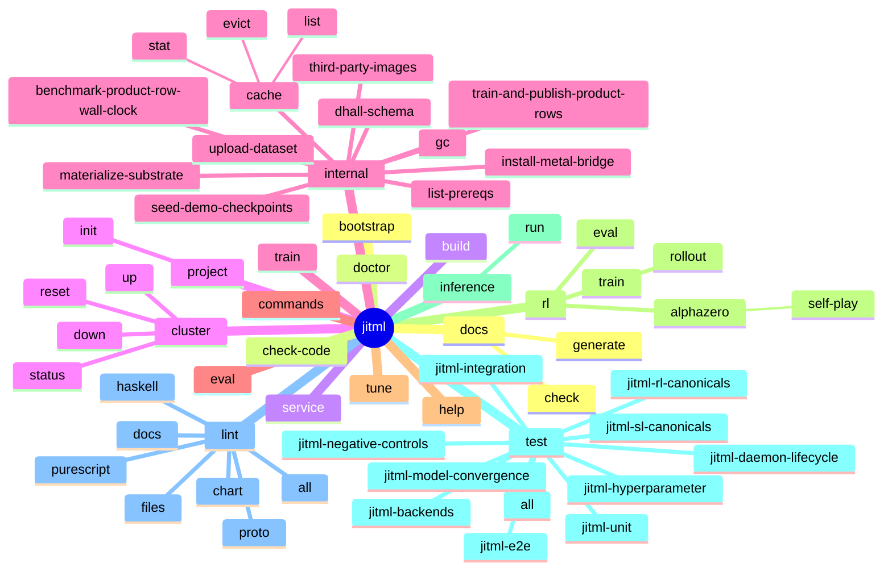
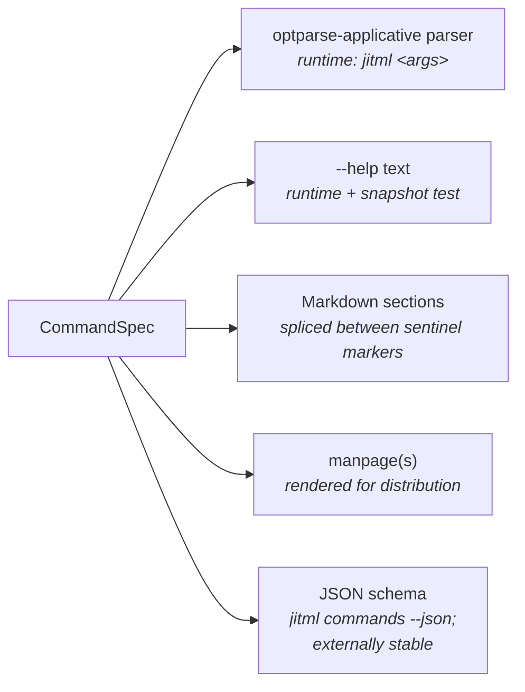
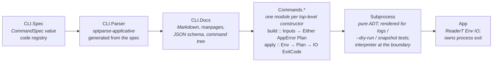

# jitML

**Status**: Governed orientation document
**Supersedes**: N/A
**Canonical homes**: [documents/README.md](documents/README.md), [documents/documentation_standards.md](documents/documentation_standards.md), [DEVELOPMENT_PLAN/README.md](DEVELOPMENT_PLAN/README.md), [documents/engineering/checkpoint_format.md](documents/engineering/checkpoint_format.md), [documents/engineering/numerical_core.md](documents/engineering/numerical_core.md)
**Generated sections**: command-tree, command-registry

> **Purpose**: Operator-facing orientation for jitML, pointing to the canonical engineering and plan homes. (Body architecture content is being migrated into `documents/` homes per the documentation doctrine; see the follow-on in [documents/documentation_standards.md](documents/documentation_standards.md).)

> Deterministic, reproducible, JIT-compiled machine learning for Haskell.

`jitML` is a Haskell-native machine learning framework for training deep artificial neural networks with fully reproducible execution semantics across supervised learning and reinforcement learning workloads.

Unlike traditional ML frameworks that embed dynamic Python runtimes, opaque kernels, and nondeterministic execution paths, `jitML` treats *the entire training process* as a declarative, reproducible program.

Cluster topology, durable state, daemon configuration, run plans, and hyperparameter sweeps are described in `.dhall` today. Models, optimizers, datasets, environments, checkpoints, loss functions, and training schedules are named in `.dhall` and resolved against typed Haskell catalogs; expressing them as composable Dhall constructors is the target owned by [Phase 77](DEVELOPMENT_PLAN/phase-77-dhall-schemas-and-cross-type-audit.md). Hardware substrate is deliberately *not* an experiment field — it is a CLI/plan argument, so one experiment runs unchanged on any substrate.

`jitML` then compiles hardware-specific kernels on demand, builds optimized native binaries, and executes them through Haskell FFI bindings.

The result is:

- reproducible training
- reproducible reinforcement learning
- reproducible stochasticity
- reproducible checkpoint recovery
- deterministic distributed execution
- hardware-native performance
- fully declarative experiment definitions

> **Doctrine and siblings:** This README is the authoritative project and CLI doctrine. jitML borrows its testing-and-determinism arc from a sibling deterministic Monte Carlo Tree Search runtime and its infrastructure layout from a sibling k8s-first inference control plane; the scopes of those projects are not combined with jitML's.

> **Development plan:** The single execution-ordered plan, sprint status, and cleanup ownership for jitML lives at [`DEVELOPMENT_PLAN/README.md`](DEVELOPMENT_PLAN/README.md). The plan adopts every in-scope doctrine section enumerated above in [Doctrine scope](#doctrine-scope) and binds each to an owning sprint; project-specific engineering docs live under [`documents/engineering/`](documents/engineering/README.md).

## Current Status

As of 2026-08-16, Phases `42`, `53`, and `69` are Done with the one-worker
cluster, clean single-instance platform rollout, and profile-driven Engine
count. Phase `263` closed `Done` on 2026-08-16 once the committed `linux-cpu`
lane fragment was confirmed by a run that read it after issuance, so Phase `265`
is the first executable owner. The exact open chain is
`265 → 266 → 267 → 268 → 269 → 270 → 271 → 272 → 275 → 277 → 279 → 280
→ 281 → 284 → 287 → 288`; intervening Done phases retain their completed
non-topology surfaces. The `apple-silicon` phases `269`, `270`, and `272` close
on the Mac host under standards rule `M(d)`.

The current worktree renders the one-worker local Kind cluster,
single-instance platform services, and one profile-driven Linux Engine.
The target described below is one local worker, one instance of each platform
role, and one Linux Engine replica. Positive multi-worker profiles remain
supported by the renderer and Pulsar's at-least-once delivery contract, but
this repository will no longer carry an explicit multi-worker or platform-HA
acceptance lane. The authoritative phase ledger, validation state, and
historical closure evidence live in
[`DEVELOPMENT_PLAN/README.md → Closure Status`](DEVELOPMENT_PLAN/README.md#closure-status).

---

## Table of contents

**Substrates & bootstrap** — [Why this exists](#why-this-exists) · [Toolchain pinning](#toolchain-pinning) · [Substrates and runtime modes](#substrates-and-runtime-modes) · [Substrate-affinity phasing](#substrate-affinity-phasing) · [Apple Silicon hybrid pattern](#apple-silicon-hybrid-pattern) · [Bootstrap scripts](#bootstrap-scripts) · [Built-artifact and JIT-cache discipline](#built-artifact-and-jit-cache-discipline) · [Prerequisites as typed effects](#prerequisites-as-typed-effects)

**Cluster & storage** — [Cluster topology and Kind](#cluster-topology-and-kind) · [Envoy Gateway API](#envoy-gateway-api-a-single-localhost-socket) · [Helm chart layout](#helm-chart-layout) · [Harbor](#harbor-as-the-registry) · [MinIO](#minio-object-store) · [TensorBoard event storage](#tensorboard-event-storage) · [Pulsar](#pulsar-as-the-control-plane--data-plane-bus) · [PostgreSQL](#postgresql) · [TensorBoard / Prometheus / Grafana](#tensorboard-prometheus-grafana-as-first-class)

**CLI & doctrine** — [Outer-container Linux builds](#outer-container-linux-builds) · [CLI command topology, typed](#cli-command-topology-typed) · [Typed run contracts](#typed-run-contracts) · [Doctrine scope](#doctrine-scope)

**Numerical & RL core** — [Product completion contract](#product-completion-contract) · [Numerical core](#numerical-core) · [Concrete Dhall worked example](#concrete-dhall-worked-example) · [Hyperparameter tuning](#hyperparameter-tuning-first-class) · [Canonical supervised learning problems](#canonical-supervised-learning-problems) · [Canonical reinforcement learning environments](#canonical-reinforcement-learning-environments) · [RL framework primitives](#rl-framework-primitives) · [RL algorithm catalog](#rl-algorithm-catalog) · [Convergence and determinism checks for RL](#convergence-and-determinism-checks-for-rl) · [AlphaZero-style self-play and persistent MCTS state](#alphazero-style-self-play-and-persistent-mcts-state) · [Checkpointing](#checkpointing) · [JIT compilation architecture](#jit-compilation-architecture) · [PureScript frontend](#purescript-frontend)

**Tests & benchmarks** — [Test-suite stanzas](#test-suite-stanzas) · [`jitml test all`](#jitml-test-all) · [Benchmarks](#benchmarks) · [Compiler, runtime, and backend tuning](#compiler-runtime-and-backend-tuning)

**Build & layout** — [Build and run](#build-and-run) · [Repository layout (target)](#repository-layout-target) · [Why Haskell?](#why-haskell) · [Vision](#vision) · [License](#license)

---

# Why this exists

The mainstream ML stack is Python + PyTorch / JAX + dynamic graphs + opaque CUDA kernels + best-effort seeding. It is fast at iterating on research ideas and slow at giving the same answer twice. Bit-exact reproduction is a debugging aid, not an architectural invariant: cuDNN convolutions are nondeterministic by default; data loaders shuffle in OS-thread order; mixed-precision reductions reassociate; checkpoint replay restores weights but not RNG state; hyperparameter sweeps record best-trial numbers but not the search-strategy state that produced them.

We want a runtime that is:

1. **Reproducible by construction.** Given identical inputs, seeds, and configuration, two runs produce identical outputs — including parameter initialization, minibatch ordering, optimizer state, RL trajectories, MCTS exploration paths, hyperparameter-trial selection, and checkpoint recovery. Reproducibility is an architectural requirement, not a flag.
2. **Declarative end-to-end.** A `.dhall` file is the full source of truth for a training run, a hyperparameter sweep, an RL experiment, or a cluster deployment. The CLI flags layered on top *override* the Dhall; they never replace it.
3. **Hardware-native without an embedded Python runtime.** jitML compiles kernels on demand for Apple Metal, NVIDIA CUDA, or oneDNN/AVX, with OpenCL held as a future extension, and executes them through Haskell FFI bindings. The runtime has no Python interpreter in the loop.

---

# Product completion contract

The binding product-completion rules live in
[documents/engineering/product_completion_contract.md](documents/engineering/product_completion_contract.md).
This README owns the documented model surface; the contract owns the proof
required before that surface may be called complete. The executable product
surface is registered in `src/JitML/Product/Matrix.hs` as `ProductRow` values;
browser contracts, workflow-matrix tests, and report-card product denominators
consume that registry instead of maintaining separate row lists.

Each raw row carries a closed executable capability and crosses the total
`projectProductRow` refinement into an opaque kind-indexed plan. Whole registry
slices cross `projectProductRows`, which rejects duplicate or unprojectable rows
and yields the single ordered projection batch consumed by workflow cells,
execution, and report joins. A report row is admitted only from matching opaque
completed-scenario evidence keyed by both `rowId` and semantic `PlanId`;
declared test ids and copied registry labels cannot populate the product report.
That scenario completion is refined from Store's opaque
`AdmittedCompletedCheckpoint`, not from a caller-held `CompletedTraining`.
The addressed manifest must bind the exact ProductRow experiment, canonical
`rowId`, `PlanId`, complete completion witness, and family-specific runtime
provenance; the resulting report evidence retains the admitted manifest SHA.

Completion is per row, not per category. Every row documented under
[Canonical supervised learning problems](#canonical-supervised-learning-problems),
[Canonical reinforcement learning environments](#canonical-reinforcement-learning-environments),
[Convergence and determinism checks for RL](#convergence-and-determinism-checks-for-rl),
and [AlphaZero-style self-play and persistent MCTS state](#alphazero-style-self-play-and-persistent-mcts-state)
must have all of the following:

1. an implementation matching the documented dataset/environment/model/algorithm;
2. a checked-in or generated Dhall experiment config that runs that row;
3. product training that verifies dataset bytes at read time before decode,
   executes the selected substrate device for update-critical work (see
   [Phase 229](DEVELOPMENT_PLAN/phase-229-phase-specific-product-evidence-payloads.md)
   — the recorded device cell is presently declaration-derived, not an execution
   witness), and records
   that learned state changed from initialization;
4. a completed checkpoint with `CompletedTraining` and convergence metrics;
5. inference that accepts only an inference-eligible trained artifact;
6. demo rendering from that trained artifact, not from a static row name or
   seeded synthetic checkpoint;
7. integration and e2e tests named for that exact row.

The DSL may not represent illegal state. Per the
[typed run-contract doctrine](#typed-run-contracts), product inference accepts
an `InferenceEligible` projection only from opaque completed-run evidence;
declared experiments, partial checkpoints, failed runs, seeded demo fixtures,
and static matrix rows cannot cross the raw-to-validated boundary as inference
targets.

Fake, mock, deterministic, synthetic, and hardcoded helpers may exist only in
explicitly named test/scaffold namespaces. They cannot satisfy a product row,
cannot be imported by production train/infer/demo paths, and cannot appear in
the final report card except as "forbidden surface absent" audit evidence.

The remediation phases follow the single-accelerator rule. Phases `19`–`28` are
`linux-cpu` only, Phase `29` is `linux-cpu` plus `linux-cuda`, Phase `30` is
`linux-cpu` plus `apple-silicon`, and Phase `31` is `linux-cpu` aggregation over
committed per-lane evidence. No phase requires switching between Apple and CUDA
hardware during validation.

**Exit Definition obligation #29 (STRICT, every-row), owned by Phase `29` — not
met.** The target is that every one of the 55 product rows' `linux-cuda`
wall-clock is strictly less than its `linux-cpu` wall-clock, with no per-row
exemptions. It is currently unmet and the committed timing table behind it is
withdrawn; see
[DEVELOPMENT_PLAN/README.md → Exit Definition](DEVELOPMENT_PLAN/README.md#exit-definition)
and [Phase 268](DEVELOPMENT_PLAN/phase-268-contract-driven-cuda-lane-revalidation.md).
The mechanism it depends on is persistent
CUDA device weight buffers (weights upload once per fixed-parameter phase and are
reused across every batch and vectorized-env step, hoisting the per-call
`cudaMalloc` + host-to-device weight copy out of the per-batch kernel path) plus
vectorized environments — and recorded in a committed per-row timing table in the
`linux-cuda` attestation. This is a cross-substrate *performance* obligation only;
it asserts no cross-substrate numeric equivalence (see [Substrates and runtime
modes](#substrates-and-runtime-modes)).

---

# Toolchain pinning

Per doctrine §Overview → Toolchain pinning, these versions are normative where
the repository actually pins them. The `.cabal` file declares `tested-with: ghc
==9.12.4`; `cabal.project` pins `with-compiler: ghc-9.12.4`; the Docker image
uses `ARG GHC_VERSION=9.12.4` and `ARG CABAL_VERSION=3.16.1.0`; and the
prerequisite DAG checks for those host tool versions. Codegen toolchains are
pinned only where the worktree has a concrete pin: CUDA package family `12-8`,
cuDNN 9 for CUDA 12, the fixed Apple Metal bridge ABI plus host OS Metal
runtime policy, the Kind node image, the ALE source commit, and the Playwright
package/container version. LLVM and oneDNN currently come from the Ubuntu 24.04
packages installed in `jitml:local`; `cabal.project` records comments for those
toolchain assumptions but does not pin their package versions.

| Tool | Pinned version | Where it's pinned |
|---|---|---|
| GHC | `9.12.4` | `.cabal` (`tested-with`) and `cabal.project` (`with-compiler`) |
| Cabal | `3.16.1.0` | `docker/Dockerfile` (`ARG CABAL_VERSION`) and the host prerequisite DAG (`toolchain.cabal-3.16.1.0`) |
| LLVM / Clang | Ubuntu 24.04 `llvm` + `clang` packages in `jitml:local`; host LLVM/Clang come from the host toolchain used to build `jitml` | `docker/Dockerfile` installs `llvm` and `clang`; `cabal.project` does not pin an LLVM package version |
| NVCC / CUDA | CUDA package family `12-8`, cuDNN 9 for CUDA 12, deterministic JIT flags (`--fmad=false`, no `--use_fast_math`, baseline `sm_70`) | `docker/Dockerfile` (`CUDA_TOOLKIT_PACKAGE`, `CUDNN_PACKAGE`) and Haskell CUDA source renderers |
| Metal (Apple) | host OS Metal runtime + fixed jitML Metal bridge; core cache misses render MSL and call `MTLDevice.makeLibrary(source:options:)`; no Tart, no keychain, no SwiftPM, no full Xcode, no offline `metal` in the core path | bridge ABI + Metal runtime policy in the Apple cache metadata |
| oneDNN | Ubuntu 24.04 `libdnnl-dev` package in `jitml:local`; AVX2 baseline, AVX-512 detected at JIT time | `docker/Dockerfile` installs `libdnnl-dev`; runtime probes verify headers/linker visibility |
| `kindest/node` | pinned | `./kind/cluster-<substrate>.yaml` (canonical); mirrored as a comment in `cabal.project` for the toolchain-truth record |
| Node.js | Docker ARG `22.16.0` plus host prerequisite presence check | `docker/Dockerfile`; `JitML.Prerequisite.Nodes.Toolchain` checks that `node` exists on host |
| Poetry | host prerequisite presence check only | `JitML.Prerequisite.Nodes.Toolchain`; not installed by `docker/Dockerfile` |
| Playwright | `@playwright/test` `1.49.1` for the repo spec, normally run in the matching Playwright container image | `playwright/package.json`; live commands use `mcr.microsoft.com/playwright:v1.49.1-noble` |
| Haskell style tools | built with `9.12.4` | `docker/Dockerfile`; the code-quality stack uses the same pinned compiler inside `jitml:local` |

`cabal.project` carries no `allow-newer` override, no source-repository
package pins, and no local dependency packages. GHC `9.12.4` provides the
`base-4.21` family used by the package bounds, and the dependency set solves
against plain Hackage (`serialise`, `cborg`, `dhall`, and `lens-family`
included). The former source-pin/vendor compatibility helper has
been removed and recorded as completed cleanup in
[`DEVELOPMENT_PLAN/legacy-tracking-for-deletion.md`](DEVELOPMENT_PLAN/legacy-tracking-for-deletion.md).

The full per-target codegen detail (build flags, RTS options, fast-math discipline) lives under [Compiler, runtime, and backend tuning](#compiler-runtime-and-backend-tuning).

---

# Substrates and runtime modes

jitML produces **one Haskell front end** with JIT codegen for several hardware targets, packaged as **three supported substrates**[^linux-opencl]:

| Substrate | Codegen | Container shape | Target service residency |
|---|---|---|---|
| `apple-silicon` | Haskell-rendered MSL + fixed host Metal bridge | partial — cluster services in Kind; a second `jitml service` runs host-native because Metal cannot be containerized | **one binary, two instances** of `jitml service`, distinguished entirely by their Dhall configs: clustered (Dhall: `residency = Cluster`, `inferenceMode = ForwardToHost`) + host-native (Dhall: `residency = Host`, `inferenceMode = SelfInference`). See [Bit-determinism contract](#bit-determinism-contract) for what same-substrate equality means under this split. |
| `linux-cpu` | oneDNN + AVX2/AVX-512 | fully containerized: `jitml:local` | one clustered `jitml service` Engine plus one non-compute Coordinator (Dhall: `residency = Cluster`, `inferenceMode = SelfInference`); daemon-spawned workload Jobs retain separate compute-scope anti-affinity |
| `linux-cuda` | CUDA C + cuBLAS / cuDNN | fully containerized: `jitml:local` (CUDA activates at runtime when scheduled to `runtimeClassName: nvidia`) | one clustered `jitml service` Engine plus one non-compute Coordinator (Dhall: `residency = Cluster`, `inferenceMode = SelfInference`); daemon-spawned workload Jobs retain separate compute-scope anti-affinity |

There is **one CLI surface for the daemon — `jitml service` — parameterised entirely by its Dhall config** ([CLI command topology, typed](#cli-command-topology-typed)). The Dhall declares substrate, residency (cluster | host), inference mode (`SelfInference` | `ForwardToHost`), and the host-side MinIO / Pulsar connection info when `residency = Host`. There is no separate `host-service` CLI verb.

On every substrate the in-cluster `jitml-service` Deployment is a **stateless Deployment**, not a StatefulSet: durable state lives in MinIO and Pulsar exclusively (no relational DB in jitML's path), and the orchestrator owns no PVC of its own. The target local profile renders one Engine pod and preserves the strict numerical-worker invariant with scoped scheduling: service Engine pods use `jitml.compute-scope: service`, daemon-spawned workload Jobs use `jitml.compute-scope: workload`, and each scope has required pod anti-affinity at `topologyKey: kubernetes.io/hostname`. A positive operator-selected worker count remains expressible, with at most one numerical worker of a scope per node, but it is outside this repository's explicit acceptance matrix. On every substrate the clustered daemon performs Pulsar fan-in/fan-out, durable state coordination, and client-facing routing. Linux substrates additionally execute device-backed workloads in-pod (`SelfInference`); Apple Silicon forwards every Metal-backed workload to the host daemon, since Metal cannot be containerized. Either mode is in principle expressible on either substrate; the substrate x mode table above reflects the target local practice.

[^linux-opencl]: An optional fourth substrate `linux-opencl` (Intel GPU) is admitted as a future extension; the codegen path is shaped to accept it without disturbing the three primary substrates above. Not in the current support matrix.

Each substrate carries its own determinism contract:

- **`apple-silicon`** — Metal compute kernels execute on the host GPU; float-accumulation order is fixed by the kernel's reduction tree (no fast-math); RNG state lives in the host daemon; kernel-launch ordering is single-stream by default. *Tradeoff: single-stream launch forfeits the multi-stream concurrency that hides launch latency at small batch sizes — the throughput cost is real and is the price of the bit-determinism contract.*
- **`linux-cpu`** — oneDNN dispatches to a per-host vector ISA detected at JIT time; reductions are blocked with a fixed block size so the accumulation tree is host-independent; RNG state lives in the clustered service pod.
- **`linux-cuda`** — CUDA kernels are compiled with `--fmad=false` and without `--use_fast_math` (omitted, not passed as `=false`); the generated *family* reduction kernel uses a deterministic warp-shuffle pattern with one partial per warp and no device-side atomics, while the trainer MLP kernel reduces sequentially per thread, then host-side canonical partial finalization via `JitML.Engines.CudaRuntime`; generated artifacts expose a host-callable `jitml_kernel` wrapper that owns deterministic launch, synchronization, and output copyback over **persistent device weight buffers** reused across a fixed-parameter phase rather than re-allocated per call — for the trainer's MLP seam the hand-written `jitml_mlp_forward` / `_batch` / `_grad` kernels in `src/JitML/Codegen/MlpCuda.hs` launch against resident weight buffers uploaded once per fixed-parameter phase, hoisting the per-call `cudaMalloc` + host-to-device weight copy out of the per-batch path; where cuBLAS and cuDNN are called (the family kernels and the Sprint `264.1` layer-graph arm, not the trainer MLP kernel) they are pinned to deterministic algorithm selections (`cudnnSetConvolutionMathType` + explicit algorithm-id pinning); RNG is the host's SplitMix64 stream from `JitML.Engines.Rng`, never the GPU's curand. *Tradeoff: cuDNN's deterministic convolution algorithms are typically 20-50% slower than its non-deterministic defaults on training workloads; this is the price of the bit-determinism contract.*

*Within a substrate, equality is guaranteed bit-for-bit* (see [Bit-determinism contract](#bit-determinism-contract)). **Across substrates, equivalence is not guaranteed and is not asserted — there is no tolerance band.** RNG draws and float reduction order differ between vendor BLAS/DNN libraries: float reductions reassociate and transcendentals (`exp`, `log`, `sqrt`, `tanh`) are implemented differently by cuDNN, Metal, and oneDNN, so cross-substrate numeric equivalence is explicitly out of contract. *Performance*, by contrast, is held to a strict cross-substrate bar: with the persistent device weight buffers above plus vectorized environments, the `linux-cuda` lane is targeted to outperform `linux-cpu` on every product row (Exit Definition obligation #29). That is a wall-clock target only — it asserts nothing about numeric equivalence and does not reintroduce a tolerance band.

---

# Substrate-affinity phasing

The repository is built and validated as an ordered sequence of development
phases, and the substrate matrix imposes two hard constraints on that order.
There are three substrates but **two distinct accelerator hardware classes** —
NVIDIA GPUs (`linux-cuda`) and Apple GPUs (`apple-silicon`) — and no single
machine has both. Combined with the rule above that *cross-substrate equivalence
is out of contract*, no phase can sensibly gate on two accelerators at once. Two
invariants follow, and they are binding doctrine for
[`DEVELOPMENT_PLAN/`](DEVELOPMENT_PLAN/README.md):

**Forward-Only Phase Dependencies.** A phase's obligations and every `Blocked
by` / dependency edge reference only equal-or-lower-numbered phases. A later
phase never blocks an earlier one. A later phase may *own* an obligation lifted
out of an earlier phase — that is an ownership transfer, not a blocker — so the
earlier phase closes on its retained surface. The dependency graph is a strict
forward DAG, so the plan is workable in numerical order: each phase is fully
validated before the next begins.

**Single-Accelerator Phase Validation.** Each phase validates on **at most one**
accelerator — exactly one of `{linux-cuda, apple-silicon}` — plus `linux-cpu`;
never both. A contract that must hold on both accelerators is split into two
sibling phases (one per accelerator), or attested per-lane in independent
sessions and aggregated by a later `linux-cpu`-only phase that consumes the
committed per-lane artifacts without re-running an accelerator. Concretely, a
phase's validation gate may not require both an `--apple-silicon` lane and a
`--linux-cuda` / `-fcuda` lane to pass together.

Together these make the plan **host-portable**: `linux-cpu`-only phases close on
any Docker host, a `linux-cuda` phase closes on the NVIDIA host (which also
provides `linux-cpu`), and an `apple-silicon` phase closes on the Mac host (which
also provides `linux-cpu`). Development moves machine-to-machine — switch to the
NVIDIA box for the CUDA phase, to a Mac for the Apple phase — and the forward DAG
guarantees you never backtrack. This generalizes the per-lane test model in
[Execution venue](#execution-venue-one-real-lane-per-substrate) (one real lane
per substrate, fail-by-design without its hardware) from test stanzas to whole
phases.

The binding form of these invariants — the per-clause rules, the
ownership-transfer carve-out, and the deterministic enforcement checks (zero
backward edges; no dual-accelerator validation gate) — lives in
[`DEVELOPMENT_PLAN/development_plan_standards.md` rule M](DEVELOPMENT_PLAN/development_plan_standards.md).

---

# Apple Silicon hybrid pattern

Metal cannot be containerized. The supported Apple lane is therefore hybrid: a stateless orchestrator pod runs in Kind exactly like on Linux, **and** a second `jitml service` runs host-native because the GPU lives there. Both daemons are the same binary; their Dhall configs are what differ.

Shape:

- The clustered `jitml-service` Deployment runs on every substrate (stateless; pod anti-affinity = one per node). On Apple Silicon its Dhall sets `inferenceMode = ForwardToHost`, so it **still** performs Pulsar fan-in/fan-out, demo proxying, trial-state persistence to MinIO bucket `jitml-trials`, and placement planning, but it forwards the actual Metal execution to the host daemon. The placement rule is by workload kind plus device capability: Linux CPU/CUDA device work may become in-cluster Jobs, while Apple Metal-backed inference, training, RL, tuning trials, and AlphaZero value/policy work are host-resident.
- `./.build/jitml service --config ./.build/conf/host/apple-silicon.dhall` runs **host-native** on Apple (Dhall: `residency = Host`, `inferenceMode = SelfInference`; no HTTP listener; Pulsar subscriber only). `./bootstrap/apple-silicon.sh up` performs the stage-0 host gates and builds `./.build/jitml`; it then delegates to `./.build/jitml bootstrap --apple-silicon`, which writes the host and cluster Dhall files, brings up Kind, runs the phased Helm deploy from [Helm chart layout](#helm-chart-layout), and patches the host Dhall once the cluster publication is known.
- The cluster daemon decodes inference-domain commands and publishes their canonical typed encoding on the internal topic `inference.command.apple-silicon`. The host daemon **subscribes** to that topic, runs the Metal-backed Engine path, and publishes the matching `InferenceResult` / `CheckpointCompareResult` / `AdversarialMoveResult` directly to the request's reply topic, such as `inference.result.apple-silicon`. The same host-resident pattern covers non-inference Metal work through `training.host-command.apple-silicon`, `tune.host-command.apple-silicon`, and `rl.host-command.apple-silicon`; focused live tests and the full Apple lane assert host-command forwarding and no Apple Metal workload Jobs. Current cleanup status lives in [DEVELOPMENT_PLAN/legacy-tracking-for-deletion.md](DEVELOPMENT_PLAN/legacy-tracking-for-deletion.md).
- The host daemon **reads and writes large artifacts directly to MinIO** through the routed `/minio/s3` surface — same protocol the cluster daemon uses. New snapshot weights, optimizer state, and inference outputs go to MinIO straight from the host; the ACK envelope just references the MinIO keys. This keeps Pulsar lean and lets MinIO's optimistic concurrency on HEAD updates serialize concurrent commits (see [Checkpoint snapshot model](#checkpoint-object-layout)).
- On an Apple cache miss, the host daemon renders MSL plus launch metadata into
  the content-addressed cache, then calls the fixed host Metal bridge. The bridge
  compiles the MSL with `MTLDevice.makeLibrary(source:options:)` (fast math off),
  creates/reuses the compute pipeline in-process, and dispatches on the host GPU.
  The core path does not start Tart, invoke SwiftPM, install full Xcode, require
  the offline `metal` compiler, or depend on login-keychain state. See
  [Built-artifact and JIT-cache discipline](#built-artifact-and-jit-cache-discipline)
  and
  [documents/engineering/apple_silicon_metal_headless_builds.md](documents/engineering/apple_silicon_metal_headless_builds.md).
- Pulsar endpoint discovery: `jitml bootstrap --apple-silicon` writes the routed coordinates to `./.build/runtime/cluster-publication.json`, then updates `./.build/conf/host/apple-silicon.dhall` with the current `BootConfig` fields (`pulsarServiceUrl`, `pulsarAdminUrl`, `minioEndpoint`, `harborRegistry`). `JitML.Service.Clients` derives the host daemon's `/pulsar/ws`, `/minio/s3`, Harbor API, and repo-local kubectl settings from that Dhall. No service-discovery RPC; the cluster publishes its own coordinates to a known file and the host daemon reads its Dhall config.
- The host daemon's only cluster contracts are Pulsar (RPC envelopes) and MinIO (large artifacts). Direct k8s API access from the host is forbidden and lint-enforced.

On Linux substrates the clustered daemon's Dhall sets `inferenceMode = SelfInference`, so it executes kernels in-pod (the substrate image carries the full JIT toolchain and, for CUDA Jobs, the NVIDIA runtime). For `linux-cpu`, the service dispatcher runs the latest-pointer/manifest read through `loadInferenceCheckpointWithWeights` and hands decoded weights to `runLinuxCpuWeightedCheckpointInference`, so routed `RunInference` messages use the generated-kernel FFI runner before publishing `InferenceResult`. For `linux-cuda`, the same dispatcher shape calls the guarded CUDA weighted checkpoint runner, which requires a positive CUDA runtime probe before compile/load/launch and otherwise returns a transient inference error before compilation. There is no separate `inference.command.linux-*` topic; the Pulsar topology degenerates to the demo-facing `inference.request.<mode>` / `inference.result.<mode>` pair. Apple Silicon is the only substrate where a second daemon resides on the host and an Apple-only `inference.command.apple-silicon` forwarding topic exists; the superseded command/event refs RPC is removed. The host-command topic family generalizes host-resident routing beyond inference so the in-cluster Apple daemon does not schedule Metal-backed training/RL/tuning starts into Linux pods.

---

# Bootstrap scripts

Stage-0 bootstrap entrypoints, one per substrate:

```
./bootstrap/apple-silicon.sh up
./bootstrap/linux-cpu.sh up
./bootstrap/linux-cuda.sh up
```

Each script is **idempotent and restartable**, but deliberately small: it probes only the host state needed to get to the real Haskell bootstrap, fails fast with installation instructions when a non-recoverable host prerequisite is missing, then delegates. Package reconciliation after that point belongs to `jitml bootstrap --<substrate>` and the typed prerequisite DAG in [Prerequisites as typed effects](#prerequisites-as-typed-effects).

> **Bootstrap verbs are not CLI verbs.** Historical script verbs such as `doctor`, `status`, `down`, and `purge` remain script conveniences, but the cluster bootstrap contract is the Haskell command `jitml bootstrap --apple-silicon | --linux-cpu | --linux-cuda`. Script `up` is a wrapper around that command.

- `apple-silicon.sh up` checks that the host is macOS on Apple Silicon, the source-build prerequisites for `./.build/jitml` are available, and Homebrew is installed when typed remediation may need it. The `build` path also exposes a GHC-compatible LLVM `opt`/`llc` pair for the pinned `-fllvm` build by using PATH tools when they are in GHC 9.12.4's supported `[13,20)` range or by prepending an installed Homebrew `llvm@19` ... `llvm@13` keg. If any gate fails, it exits with a short, actionable install message. If the gates pass, it builds `./.build/jitml` host-native, then calls `./.build/jitml bootstrap --apple-silicon`. The Haskell bootstrap writes Dhall under `./.build/conf/`, creates the Kind cluster, brings MinIO and the registered Percona `harbor-pg` database up first, brings Harbor up against those dependencies, builds `jitml:local`, retags it as `jitml-demo:local`, loads those tags explicitly into Kind, then rolls out Pulsar, Prometheus/Grafana, Envoy Gateway, the `jitml-service` cluster daemon via Helm, and the demo app. Because Apple still builds `jitml:local` for the in-cluster daemon, the Docker image build is also the exclusive Haskell style-tool bootstrap and code-quality gate. Once the localhost edge port is selected, bootstrap updates the host Dhall so the host daemon can reach Pulsar and MinIO; `./bootstrap/apple-silicon.sh run-daemon` rebuilds / code-signs the host binary if needed, then starts `./.build/jitml service --config ./.build/conf/host/apple-silicon.dhall`. The host does **not** install style tools or code-quality tooling during bootstrap. Core Apple Metal cache misses require only the OS Metal runtime and the fixed jitML bridge probe; optional Swift/SDK probes are for non-core Swift JIT modules, not training/inference cache misses.
- `linux-cpu.sh up` checks that Docker is installed and usable by the current user without `sudo`. If the gate passes, it calls `docker compose run --rm jitml jitml bootstrap --linux-cpu`; Compose builds the outer `jitml` image automatically and the root `compose.yaml` runs that service with host networking so the outer-container Kind kubeconfig loopback endpoint is reachable. The in-container bootstrap deploys the same cluster stack, and the outer container exits once the in-cluster daemon is in charge. Linux has no host daemon and no host-level Dhall: only the ConfigMap Dhall mounted into the cluster daemon is needed.
- `linux-cuda.sh up` performs the Linux CPU Docker gate plus CUDA gates: the NVIDIA container runtime must be available, and `nvidia-smi` must report at least one device meeting the required compute capability. Missing gates fail fast before any CUDA Kind cluster is created. If the gates pass, it calls `docker compose run --rm jitml jitml bootstrap --linux-cuda` through the same headless, host-networked compose service; after that the rollout is the same as Linux CPU, with the CUDA RuntimeClass, GPU label on the CUDA-capable Kind node, node-local containerd `nvidia` runtime handler, repo-owned NVIDIA runtime config, and read-only `/run/nvidia/driver` host driver-root mount applied by bootstrap. Direct live CUDA tests that need the outer container itself to see NVIDIA devices use the companion `jitml-cuda` compose service.

> **Authenticated third-party image pre-pull.** The `docker.io/*` third-party chart images (MinIO, Pulsar, Harbor, …) are pre-pulled **authenticated on the host** and `kind load`ed before the cluster rolls out, so the Kind node's containerd never pulls them anonymously from Docker Hub and trips the Docker Hub **429** rate limit on a cold host. The pre-pull only **reads** the host's existing `docker login` (so `docker login` to Docker Hub once per host); it never writes `~/.docker/config.json`, preserving the no-touch invariant below. This is jitML's own self-contained Docker Hub credential path, owned by the project.

Cleanup semantics matter:

- `down` tears down the cluster; preserves `./.data/` and `./.build/`.
- `purge` is destructive but **cache-preserving**: cluster down, `rm -rf ./.data/`. `./.build/` survives — including `./.build/jit/apple-silicon/`, `./.build/runtime/`, `./.build/conf/`, and the Kind metadata needed for subsequent `docker compose run --rm jitml jitml <command>` calls. A subsequent bootstrap or inference command can resolve from cache without re-JITting any model already compiled. On Apple, a cached kernel is a `<hash>.metal.json` source/metadata record plus the process-local bridge pipeline cache; there is no VM rebuild on a cache hit.
- `purge --full` is `purge` plus `rm -rf ./.build/` (and on Linux, `docker compose down --rmi local --volumes` to drop the substrate image). Use only for fresh-start debugging.

Forbidden: anything that touches `~/.kube/config`, `~/.docker/config.json`, or global state outside the repo except typed prerequisite remediation that explicitly installs Homebrew packages. Shell bootstrap scripts never write the user's Homebrew prefix; Haskell `jitml` may validate and install Homebrew packages lazily, on demand, through the typed prerequisite DAG. Build outputs, generated Dhall, runtime coordinates, kubeconfig, Kind metadata, and JIT artifacts live under `./.build/`; `./.data/` is reserved strictly for manual PV bind mounts. Both roots are in `.gitignore` **and** `.dockerignore` so the substrate image never accidentally bakes in host artifacts.

---

# Built-artifact and JIT-cache discipline

`./.build/` is the **only** host folder that holds compiled artifacts and bootstrap runtime metadata: the `jitml` binary, JIT-compiled kernels, generated JIT source inputs, generated Dhall, kubeconfig, Kind metadata, and cluster publication files. Layout:

```
.build/
├── jitml                                    -- the binary (Apple: host-built via ghcup; Linux: container-built, bind-mounted out)
├── jitml.kubeconfig                         -- repo-local kubeconfig only
├── conf/
│   ├── host/apple-silicon.dhall             -- Apple-only host daemon config, patched with routed cluster coordinates
│   └── cluster/<substrate>.dhall            -- rendered into the jitml-service ConfigMap
├── runtime/cluster-publication.json          -- edge port, Pulsar, MinIO, and related routed coordinates
├── kind/<substrate>/                         -- Kind metadata/config needed by later bootstrap and Docker Compose invocations
├── host/apple-silicon/                      -- Apple-only: fixed Metal bridge and host-side runtime metadata
├── jit-src/<substrate>/<hash>/               -- generated compiler inputs emitted by Haskell renderers
└── jit/
    ├── manifest.json                        -- cache index keyed on (model-id, kind, substrate, toolchain)
    └── <substrate>/<hash>.<ext>             -- one file per cached kernel (content-addressed; the canonical location of every kernel artifact)
```

**JIT source boundary.** Every per-kernel native/foreign source file used by the
JIT path is generated by Haskell renderers under `src/JitML/Codegen/` and
materialized under the build/cache tree on cache miss. The repository does not
accept checked-in CUDA `.cu`, C/C++ `.cc` / `.cpp`, per-kernel MSL source files,
Swift package source files, native adapter shims, or JIT build scripts. A fixed non-kernel
Apple Metal bridge may be checked in or generated as part of the jitML
source-build; it is not regenerated per model. If jitML needs a per-kernel native
compiler input or adapter for a runtime path, the Haskell engine renders it into
the build/cache tree; otherwise `jitml lint files` rejects it as static source.

**Role split.** Linux cache entries are compiled shared objects under
`jit/<substrate>/<hash>.so`. Apple cache entries are source/metadata records
under `jit/apple-silicon/<hash>.metal.json`; the fixed host bridge is stable
process infrastructure, not a generated artifact per kernel. The current local
Linux CPU validation path uses `JitML.Engines.Loader` to materialize generated
source, fill cache misses with `g++ ... -ldnnl`, and expose the `dlopen` symbol
helper; `JitML.Engines.Local` runs generated oneDNN reorder, reduction, matmul,
convolution, normalization, attention, and embedding primitives through that
boundary and verifies the exported `jitml_kernel_family_name` and
`jitml_kernel_output_count` ABI symbols. Generated CUDA exports a host-callable
`jitml_kernel` wrapper plus the same family/output-count metadata ABI;
`JitML.Engines.CudaLocal` consumes a positive CUDA runtime probe before
compile/load/launch and fails closed before compile when `nvcc`/GPU runtime is
unavailable. Apple MSL source metadata carries the family/output-count contract
for `JitML.Engines.MetalLocal`, which calls the fixed bridge instead of
`dlopen`ing a generated dylib. The local Linux CPU toolchain fingerprint includes
`artifact-abi=<os>-<arch>`, so a Darwin host and the Linux `jitml:local`
container do not reuse the same `.build/jit/linux-cpu/<hash>.so` path for
loader-incompatible artifacts.

**Cache key — shape + kind + generated source, weight-independent.** Each entry is hashed over `(canonical-cbor(KernelSpec), kind, substrate, toolchain-fingerprint, rendered-source-payload, tuning-choice)` where `KernelSpec` is model shape (layer topology, dtype layouts, activation choices) and `kind` is `training | inference`. Training and inference kernels are **separate artifacts** because they have different compute graphs — training carries the backward pass and optimizer-step kernel; inference is forward-only with frozen-weight constant folding enabled. Sharing one artifact across both would force one of them to be sub-optimal. The rendered-source payload is generated by the Haskell runtime source renderers under `src/JitML/Codegen/`; changing a renderer invalidates the compiled artifact. Toolchain fingerprints also carry loader-relevant ABI facts for local FFI paths, including the Linux CPU `artifact-abi=<os>-<arch>` value.

Consequence: a model that is both trained and used for inference has **two JIT artifacts in its lifetime**, regardless of how many checkpoints exist along its training history. Two snapshots of the same model share their weight layers (per the multi-object snapshot model in [Checkpoint object layout](#checkpoint-object-layout)) but never produce additional JIT compiles.

**Fixed-bridge Apple Metal cache misses.** Bootstrap and host daemon startup do
no per-kernel build. On a JIT cache miss, the daemon renders canonical MSL plus
launch metadata, writes `./.build/jit/apple-silicon/<hash>.metal.json`
atomically, and calls the fixed host Metal bridge. The bridge compiles the MSL
in-process through `MTLDevice.makeLibrary(source:options:)`, creates/reuses a
pipeline, and dispatches on the host GPU. Subsequent persistent cache hits reuse
the `.metal.json` source artifact; subsequent in-process calls reuse the bridge
pipeline cache. Optional `MTLBinaryArchive` persistence may accelerate pipeline
creation later, but source metadata remains the correctness artifact.

**Cache survives purge.** `./bootstrap/apple-silicon.sh purge` clears runtime
state but **preserves `./.build/`**. After `purge`, every previously rendered
Apple source artifact is still on disk under `./.build/jit/apple-silicon/`, so
the next bootstrap plus any inference command resolves from cache without
re-rendering model source. Runtime pipeline caches are process-local and are
rebuilt from `.metal.json` when needed.

**Linux substrates share the same cache via Kind extraMounts.** The Kind cluster
config bind-mounts host `./.build/` into every Kind node that can run jitML
workloads, and the `jitml-service` Deployment mounts that path into the pod at
`/opt/build`. Linux
JIT operations happen entirely in the cluster; the outer
`docker compose run --rm jitml jitml <command>` container only re-enters the
cluster using metadata persisted under `./.build/`. Apple execution happens on
the host daemon because Metal cannot be containerized, but the cache root and
content-addressing rules are the same. This is the **one** exception to the "no
freestanding host paths in pod specs" discipline; the chart lint permits exactly
this hostPath and rejects any other.

---

# Prerequisites as typed effects

Per doctrine §Prerequisites as Typed Effects, prerequisite checks are first-class typed values: a DAG of named `Prerequisite` nodes that gate every reconcile run. Each node has a typed predicate, a typed remediation action (or `Nothing` if the prerequisite is non-recoverable), and an explicit dependency list. Stage-0 shell scripts use only the minimal host gates required to reach the Haskell binary or outer Docker container; the Haskell prerequisite DAG is the source of truth for every lazy package remediation after that.

Homebrew package installation is allowed only through this typed path. A Homebrew prerequisite carries a package identity, install/upgrade policy, validation predicate, and human-readable remediation. The pure plan phase computes which packages are missing; the apply phase executes through the typed `Subprocess` layer; the postcondition re-validates the package before the next dependent node runs. This keeps lazy package installation deterministic and testable without spreading ad hoc `brew install` calls through scripts.

A reconciler that finds a missing prerequisite fails with exit code `2` (system error per [Exit codes and error rendering](#exit-codes-and-error-rendering)) and a structured diagnostic naming the missing node plus its remediation, if any. The bootstrap scripts at [`./bootstrap/`](#bootstrap-scripts) are the user-facing tip of this system; the Haskell prerequisite DAG is the in-process source of truth.

---

# Cluster topology and Kind

Per-substrate Kind configs live at `./kind/cluster-<substrate>.yaml`. The target
local topology is one control-plane plus one worker node, a single user-facing
Envoy socket, and scoped placement that permits at most one numerical ML compute
worker of each scope per Kubernetes node. The checked-in configs contain the
one-worker Phase 42 shape; see
[Current Status](#current-status) and the canonical
[cluster-topology document](documents/engineering/cluster_topology.md).
After `kind create`, the bootstrap reconciler caps materialized node containers'
memory and CPU (`docker update --memory/--memory-swap/--cpus`) from the typed
`dhall/cluster/` resource profile, so the cluster footprint is bounded and a
runaway rollout cannot exhaust the host.

The edge port (Envoy listener) is selected from the finite candidate set
`9090`, `9091`, and `9092`. When no matching publication exists, a fresh
`apple-silicon`, `linux-cpu`, or `linux-cuda` cluster prefers `9090`, `9091`,
or `9092`, respectively, then probes the remaining candidates. A fresh cluster
with a valid same-substrate publication tries that persisted coordinate first;
a retained cluster must recover its exact published port instead of leasing a
new one. Bootstrap does not scan beyond `9092`; if no candidate can be bound,
the rollout fails closed. The selected port is recorded as the `edge_port`
field of `./.build/runtime/cluster-publication.json` (the single file a
successful live bootstrap or live cluster reconciler writes; see
[Apple Silicon hybrid pattern](#apple-silicon-hybrid-pattern) for its other
fields) and reported by `jitml cluster status`. Publication health is valid
only when derived from live Kind/Helm/component readiness; a missing, corrupt,
or locally materialized default publication is not a ready cluster and must
fail closed. NodePort 30090 is the in-cluster service for the edge gateway.

Kubeconfig lives at `./.build/jitml.kubeconfig`. The CLI never touches `~/.kube/config`. The `kindest/node` version is referenced in the Kind config under `./kind/cluster-<substrate>.yaml`; the same pin appears as a comment in `cabal.project` purely as a single-source-of-toolchain-truth record (Cabal itself does nothing with it), and the lint stack rejects drift between the two.

Storage is a `jitml-manual` storage class (no provisioner) backed by host-path PVs under `./.data/<namespace>/<StatefulSet>/pv_<integer>`. `.data` is only for these manual PV bind mounts; runtime metadata, Kind metadata, generated config, and kubeconfig live under `./.build/`.

The host `./.build/` directory is bind-mounted into every materialized Kind node
via the `extraMounts` block in `./kind/cluster-<substrate>.yaml`, which is what
lets in-cluster Linux workloads see the same JIT artifacts the host built (see
[Built-artifact and JIT-cache discipline](#built-artifact-and-jit-cache-discipline)).

Apple Silicon and Docker-backed `linux-cpu` use node-local stateful PV overlays:
the registered manual PV paths are still rendered under `./.data/`, but before
manual PV apply bootstrap bind-mounts `/var/local/jitml-stateful-pv/...`
directories over the corresponding paths inside each Kind node. Registered
Percona Postgres PVs are normalized to uid/gid `26:26`; MinIO and Pulsar PVs are
made writable for their chart-managed containers. This avoids macOS/Colima
bind-mount ownership drift and high-churn stateful-service I/O stalls while
preserving the checked-in PV identities. `linux-cuda` runs on a real Linux host
and uses the `.data` hostPath directly with Postgres ownership normalization.

---

# Envoy Gateway API: a single localhost socket

> "There is to be a single socket accessible to localhost with Envoy as the reverse proxy to all the endpoints."

**Ports at a glance.**

- `127.0.0.1:<edge-port>` — the single user-facing socket. Fresh clusters use
  the substrate-aware preference (`apple-silicon` `9090`, `linux-cpu` `9091`,
  `linux-cuda` `9092`) within the closed `9090`/`9091`/`9092` candidate set;
  retained clusters recover the exact published coordinate.
- `NodePort 30090` — the in-cluster Envoy service that the edge port maps to.
- `./.build/runtime/cluster-publication.json` — the live publication written after a successful bootstrap or live cluster reconcile; `edge_port` lives here alongside `pulsar_url`, `minio_url`, and measured component health. `jitml cluster status` reads this file and must not synthesize a ready cluster from missing or invalid bytes.

One Envoy-Gateway-API-owned localhost listener (`Gateway/jitml-edge`, using the
finite substrate-aware edge-port lease above) backed by the repo-owned
`EnvoyProxy/jitml-edge` service shape:

- `GatewayClass/jitml-gateway` references `EnvoyProxy/jitml-edge`, and `Gateway/jitml-edge` listens at `127.0.0.1:<edge-port>`.
- `EnvoyProxy/jitml-edge` is a NodePort service with `externalTrafficPolicy: Cluster`; the Gateway listener port is pinned to NodePort 30090 for the Kind host-port mapping.
- Routes are not hand-written YAML; they are Haskell-rendered `HTTPRoute` resources from a single **route registry** in `src/JitML/Routes.hs`. The registry is the source of truth, consumed by both the chart-template renderer and the `docs check`/`docs generate` pair that gates route-table and chart-template drift (per doctrine §Generated Artifacts).

Routes published at the edge (all under one `127.0.0.1:<edge-port>`):

| Path prefix | Upstream | Rewrite |
|---|---|---|
| `/` | `jitml-demo:80` (the PureScript app) | (none) |
| `/api` | `jitml-demo:80` | (none) |
| `/api/ws` | `jitml-demo:80` WebSocket | (none) — live training events |
| `/tensorboard` | `tensorboard:80` | `/` |
| `/grafana` | `kube-prometheus-stack-grafana:80` | `/` |
| `/prometheus` | `kube-prometheus-stack-prometheus:9090` | `/` |
| `/harbor` | `harbor:80` | `/` |
| `/harbor/api` | `harbor:80` | `/api` |
| `/v2` | `harbor:80` | (none) |
| `/service` | `harbor:80` | (none) |
| `/minio/console` | `minio:9001` | `/` |
| `/minio/s3` | `minio:9000` | `/` |
| `/pulsar/admin` | `pulsar-proxy:80` | `/admin` |
| `/pulsar/ws` | `pulsar-broker:8080` WebSocket | `/ws` |

TLS is off for the local demo. The production-deployment posture is intentionally not specified by this README; the route registry just declares the local-demo surfaces.

---

# Helm chart layout

Single umbrella chart at `./chart/`. The target release graph contains
third-party chart dependencies plus jitML-owned local charts and rendered CRs.
`Chart.yaml` declares the third-party subchart dependencies:

- `harbor` — image registry.
- `pg-operator` — Percona Kubernetes Operator. The single-instance local
  Postgres service is a jitML-rendered `PerconaPGCluster` CR, not a separate
  `pg-db` subchart.
- `pulsar` — Apache Pulsar with ZooKeeper + BookKeeper + Broker + Proxy + WebSocket.
- `minio` — standalone mode, one replica.
- `gateway-helm` — Envoy Gateway controller.
- `kube-prometheus-stack` — Prometheus operator + Grafana.

jitML-owned local charts live under `chart/local/`: `tensorboard`,
`jitml-service`, and `jitml-demo`. Templates in `chart/templates/` include
GatewayClass, Gateway, HTTPRoutes (rendered from the route registry), EnvoyProxy,
manual PVs (one per replica, see below), NVIDIA RuntimeClass for the CUDA
substrate, Grafana datasources and dashboards, Prometheus scrape configs, and
rendered CRs such as registered Percona Postgres clusters. The `jitml-demo`
Webapp Deployment lives in `chart/local/jitml-demo`.

Helm values ownership follows the same umbrella-chart rule as
[documents/engineering/cluster_topology.md](documents/engineering/cluster_topology.md#helm-values-ownership):
`chart/templates/` is manifest-only, and subchart configuration belongs under
the consuming key in `chart/values.yaml` unless a typed Helm invocation
explicitly passes a separate `--values` file. Standalone
`chart/<subchart>-values.yaml` fragments are cleanup candidates when no such
typed invocation exists.

## Storage discipline: `kubernetes.io/no-provisioner` only

Every StorageClass uses the `kubernetes.io/no-provisioner` provisioner — no dynamic provisioning anywhere in the chart. Every PV is **manually defined** in `chart/templates/pv-<statefulset>.yaml` against the `jitml-manual` StorageClass and backed by the repo-local `./.data/<namespace>/<StatefulSet-name>/pv_<replica-int>/` directory, mounted into Kind at `/jitml/.data/...`. StatefulSet-owned PVCs bind through explicit PV-side `claimRef.namespace` / `claimRef.name`. Operator-generated Percona PVCs instead bind through explicit `volumeName` fields rendered in the registered `PerconaPGCluster`, because the operator-generated PVC names carry a controller suffix. Both paths are explicit; neither uses dynamic provisioning.

Naming convention is uniform: **`<k8s-namespace>/<StatefulSet-name>/pv_<replica-int>`** on disk, and **`<namespace>-<statefulset>-pv-<int>`** as the PV resource name (DNS-1123 compatible). Example layout for the `platform` namespace on the Apple Silicon substrate:

```
.data/
└── platform/
    ├── minio/pv_0                      -- standalone MinIO
    ├── pulsar-bookie-journal/pv_0      -- one bookie journal
    ├── pulsar-bookie-ledgers/pv_0      -- one bookie ledger store
    ├── pulsar-zookeeper-data/pv_0      -- one ZooKeeper data store
    ├── harbor-pg/pv_0                  -- one Postgres instance
    └── harbor-pg-repo1/pv_0            -- one pgBackRest repo
```

Corresponding target PV resources are named `platform-minio-pv-0`, `platform-pulsar-bookie-journal-pv-0`, `platform-pulsar-bookie-ledgers-pv-0`, etc.; StatefulSet PVs are bound to the chart-generated replica-zero PVC (for example `data-minio-0`, `pulsar-bookie-journal-pulsar-bookie-0`, `pulsar-bookie-ledgers-pulsar-bookie-0`, and `pulsar-zookeeper-data-pulsar-zookeeper-0`), and registered Percona PVs are bound by `volumeName`. `jitml lint files` rejects any path under `.data/` that does not match the `<namespace>/<StatefulSet>/pv_<int>` regex, and `jitml lint chart` rejects any StorageClass with a provisioner other than `kubernetes.io/no-provisioner`, any freestanding PVC, and any PV without either an explicit `claimRef` or a registered Percona `volumeName` binding.

The one-instance layout above is the implemented source of truth. Moving an
existing local installation from distributed MinIO to standalone MinIO requires
`./bootstrap/<substrate>.sh purge` before the first new `up`; `down` deliberately
preserves `.data`, while `purge` removes the local cluster state and is
destructive. The exact stale manifests, values, and assertions are tracked in
[`legacy-tracking-for-deletion.md`](DEVELOPMENT_PLAN/legacy-tracking-for-deletion.md).

## `jitml-service` Deployment, not StatefulSet

The Engine/numerical compute role is stateless and owns no PVC of its own —
durable state lives entirely in MinIO and Pulsar — so a StatefulSet would be the
wrong shape. Numerical ML compute is capped at **one Engine worker per
Kubernetes node** via scheduling rules; Coordinator, Webapp, observability, and
platform services may have their own replica counts without creating additional
numerical workers on the same node. Linux clustered service pods and rendered
service pods carry `jitml.compute: "true"` plus `jitml.compute-scope: "service"`,
and workload Jobs carry `jitml.compute: "true"` plus
`jitml.compute-scope: "workload"`. Each scope uses the compute-node selector and
hard per-host anti-affinity/topology spread against its own selector, so service
replicas and transient work do not block each other; Apple Silicon clustered
service pods are non-compute forwarders. Kind nodes maintain JIT cache under the mounted
`./.build/jit/<substrate>/` hostPath, which is fine because JIT artifacts are
deterministic functions of `(model-shape, kind, substrate, toolchain)`.

Namespace: `platform` (fixed). `jitml bootstrap --<substrate>` creates it idempotently.

**Phased deploy** (verbatim from infernix's lessons):

1. **Harbor phase**: MinIO starts first so the `harbor-registry` bucket exists, the Percona operator applies and waits for the registered `harbor-pg` database, and Harbor then starts against those live dependencies.
2. **Image build/load phase**: `jitml:local` is rebuilt locally, retagged as `jitml-demo:local`, and both tags are loaded explicitly into the selected Kind cluster with `kind load docker-image`.
3. **Final phase**: Pulsar, Envoy Gateway, kube-prometheus-stack, TensorBoard, the jitML service workload (all substrates: Linux self-inference plus Apple forward-to-host), and the jitML-demo workload roll out after the local image tags are present in Kind. Bootstrap applies the repo-owned foundation manifests before Helm, waits on explicit platform rollout/readiness checks, and applies the repo-owned Gateway/HTTPRoute manifests after the controller is installed.

This avoids a hidden DNS/trust assumption between the host Docker daemon, the Kind node runtime, and an in-cluster Harbor registry while still bringing Harbor up as the platform registry surface.

---

# Harbor as the registry

Harbor is the platform registry surface. The local Kind bootstrap path is explicit: it rebuilds `jitml:local`, retags it as `jitml-demo:local`, loads both tags into Kind with `kind load docker-image`, and sets the in-cluster workloads to `imagePullPolicy: IfNotPresent`. The Harbor Helm release receives an explicit localhost `externalURL` for the selected edge port, and the edge routes send Harbor's public portal/API/registry/token paths through the chart's public `harbor` nginx service. The `HasHarbor` subprocess client takes explicit registry/API settings, Docker host socket when the local daemon is not at Docker's default path, and a repo-local Docker config directory under `./.build/docker/harbor`; live Linux CPU validation has exercised push/promote, pull, artifact existence, and repository listing without environment variables or global Docker config writes.

Harbor's own image-chart storage backend is **MinIO** (S3 API), so Harbor's blobs and MinIO's buckets share a durability story. Live Linux CPU validation has pushed an OCI artifact through Harbor's registry HTTP API and confirmed the matching repository objects in the `harbor-registry` bucket. The local Docker-backed path is also validated through the selected localhost edge: a repo-local Docker config logs into `127.0.0.1:<edge-port>`, pushes and pulls a test image, lists the repository through `/harbor/api`, and confirms the tag through Harbor's artifact API.

Routed at `/harbor` (portal), `/harbor/api` (API), `/v2` (Docker registry), and `/service` (Harbor token service).

---

# MinIO object store

Buckets, provisioned by the Helm `provisioning.buckets` block:

- `harbor-registry` — Harbor's S3 backend (128 MiB chunk size).
- `jitml-checkpoints` — training checkpoints. One prefix per experiment hash;
  deterministic snapshot-owned objects and commit records, a revisioned
  experiment-scoped writer/GC CAS record, content-addressed manifests, durable
  GC state, and ETag-guarded pointers inside the prefix (see
  [Checkpoint object layout](#checkpoint-object-layout)).
- `jitml-datasets` — pinned source datasets. This bucket is never populated by
  first use: an operator must stage every required canonical compressed blob
  with `jitml internal upload-dataset` after bootstrap. Upload and every product
  read verify the pinned SHA-256; missing, substituted, or corrupt bytes fail
  closed before training.
- `jitml-transcripts` — RL trajectory transcripts (the analog of MCTS's `.mcts-cache/transcripts/`).
- `jitml-trials` — hyperparameter trial transcripts, content-addressed by `sha256(resolved-dhall || trial-seed)`.
- `jitml-tensorboard` — TensorBoard event files so the TB pod is stateless and can reschedule freely (see [TensorBoard event storage](#tensorboard-event-storage)).
- `jitml-artifacts` — large inference outputs (when the demo is in inference mode).

Endpoints: `minio.platform.svc.cluster.local:9000` (in-cluster); `127.0.0.1:<edge-port>/minio/s3` (routed). Credentials pinned in values for the local demo; the production-deployment posture is intentionally not specified by this README. Bootstrap readiness checks every typed bucket through the Bitnami in-pod MinIO client (`mc`) before continuing to the topic bootstrap. `JitML.Service.MinIOSubprocess` is the subprocess-backed live HTTP S3 `HasMinIO` interpreter; it signs canonical path-style S3 URLs with `curl --aws-sigv4` and sends routed edge requests with `--request-target /minio/s3/...` so Envoy can rewrite to the upstream MinIO path without breaking SigV4.

The MinIO server version is pinned to a release with S3 conditional-write support (`If-None-Match`, `If-Match`) — `RELEASE.2024-08-26T15-33-07Z` or later. The concurrency story below depends on it.

## Checkpoint object layout

> **Durable-state registry.** The MinIO bucket set, the logical Pulsar topic family, and per-store retention are declared in the closed, self-validating `jitml.dhall` (generated by `jitml project init`). `JitML.Storage.Buckets.bucketNames` projects the registry's `ObjectBucket` entries, the topic logical names are anti-drift-checked against `JitML.Coordinator.Topology`, and the checkpoint GC retention is sourced from the registry's `checkpoints` store (replacing the former hardcoded `LastN 5`). An over-budget / over-quota / write-to-`Retired` / undeclared-store topology is a Dhall typecheck failure — see [documents/engineering/durable_state_dsl.md](documents/engineering/durable_state_dsl.md).

The `jitml-checkpoints` bucket uses a fixed prefix schema, owned by Haskell modules under `src/JitML/Checkpoint/` so paths are typed values rather than stringly-typed call sites:

```
jitml-checkpoints/
  <experiment-hash>/                      -- sha256(resolved-dhall || substrate-fingerprint)
    snapshots/<snapshot-id>/
      reservations/<attempt-id>.cbor      -- immutable marker owned by one write attempt
      committed.cbor                      -- exact immutable eligibility record
      objects/<sha256(original-full-key)> -- snapshot-owned payload-object bytes
    manifests/<sha256>.cbor               -- write-once, content-addressed, CBOR manifest objects
    gc/
      coordination-fence.txt              -- mutable experiment-scoped writer/GC CAS record
      intents/<event-id>.cbor             -- immutable exact deletion set; cleanup only after Reaped
      cancelled/<event-id>.cbor           -- stable immutable whole-intent cancellation artifact
      ready/<event-id>.cbor               -- byte-stable outbox, removed after published tombstone
      published/<event-id>.cbor           -- permanent exact-event publication tombstone
    pointers/
      latest                              -- mutable, ETag-CAS; body = 64-byte lowercase manifest SHA
      best/<metric>                       -- mutable, ETag-CAS; body = 64-byte lowercase manifest SHA
      trial/<trial-hash>/latest           -- per-HPO-trial latest pointer
      trial/<trial-hash>/best/<metric>    -- per-HPO-trial best pointer
      browser-catalogues/<catalogue-sha>  -- immutable archival manifest root
```

Store keeps the canonical `ExperimentGcFence` at
`jitml-checkpoints/<experiment-hash>/gc/coordination-fence.txt`, outside every
snapshot deletion set. This versioned mutable CAS object binds its experiment,
monotonic CAS revision, a separate monotonic writer/root-activity epoch,
canonical full `WriterReservation` set, and canonical `GcFenceDecision` history.
Every reservation registration and unregister increments the writer/root-activity
epoch; GC-only decision changes advance the revision but not that epoch. Its exact text envelope is
`jitml-experiment-gc-fence-v1:` followed by lowercase hexadecimal canonical CBOR;
it is neither a snapshot payload nor a GC event key.
Experiment scope is required because a child snapshot's full reservation can
protect a reap target in another snapshot through `parentManifestSha`; separate
per-snapshot locks cannot make that overlap atomic.
GC brackets a complete fresh root view with matching writer/root-activity epoch
observations and may move `Open` or complete `Cancelled` to `Planned` only while
that exact epoch still matches. GC-only revisions for sibling events therefore
do not invalidate the root witness. The live reconciler converges that view in a
bounded loop: epoch churn restarts the complete view, and an epoch-stable plan
that discovers an exact intent absent from durable state first persists that
intent and then restarts the complete view. Publish-ready or published-plus-
transient terminal work first observed in that fresh view is completed and
forces another complete-view pass; a permanent published tombstone with no
transient state is already current. Only the converged plan can drive
authorization, the reported kept set, or the no-op decision.

`snapshot-id` is the SHA-256 of canonical CBOR over the domain
`jitml-snapshot-v1`, the exact logical manifest, and sorted
`(original-key,payload-sha)` pairs. Each descriptor row also records the exact
scoped key
`jitml-checkpoints/<experiment>/snapshots/<snapshot-id>/objects/<sha256(original-full-key)>`.
Store validates that the original key is canonical and unscoped, the scoped key
is exactly the hash-derived address for that original key, and the recorded
payload SHA equals the fetched bytes. It then reverses the persisted
original-to-scoped mapping to reconstruct the logical manifest and re-derives
the snapshot id from that manifest and the sorted original-key/payload-SHA
table; the common path prefix is not accepted as identity by itself. Legacy
unscoped `blobs/` and `artifacts/` manifests remain readable, but new writes use
only the snapshot-scoped namespace and only exact committed snapshots are
admissible or GC-eligible.

A zero-payload-object logical manifest uses the same identity function with an
empty binding list:
`sha256(canonical-CBOR("jitml-snapshot-v1", exact logical manifest, []))`.
Because no payload-object key carries a prefix, Store derives the expected
`snapshots/<snapshot-id>/committed.cbor` address directly from those exact
inputs. An exact matching commit makes the manifest admissible and eligible for
retention/GC, and that commit is the snapshot's sole GC-owned key. An empty
legacy manifest without that exact commit remains decode/inspection-only and is
protected and ineligible: it is not admitted, selected for retention, or reaped.

The object classes use immutable publication, mutable CAS, and idempotent
deletion protocols:

- **`snapshots/<snapshot-id>/objects/*`** — write-once payload-object bytes
  owned by one deterministic checkpoint transaction. The final component hashes the
  original full logical key; the immutable reservation markers and commit
  record bind each canonical original key to its exact scoped key and payload
  SHA. Admission reconstructs the logical manifest through that mapping and
  re-derives the snapshot id. A supervised-graph envelope payload has one
  scoped `supervised.weights` payload object; optimizer, RNG, replay-buffer,
  exploration-cache, and non-supervised companion evidence occupy separate
  owned addresses when required. An `If-None-Match: *` conflict is accepted only
  after exact-byte equality.
- **`snapshots/<snapshot-id>/reservations/<attempt-id>.cbor`** — each write
  attempt first CAS-registers its full reservation in the experiment coordination
  record, then creates a fixed-width lowercase-hex marker absent-only,
  incrementing on every marker conflict even when the existing bytes are
  identical. There is no RNG or lease, and two attempts never share a marker.
  A conflicted attempt leaves its registered entry in place because ownership
  of the existing marker cannot be proved; that conservative entry remains a
  root, and the writer advances through a fresh registration attempt.
  The marker embeds its attempt id and the full snapshot descriptor and is
  created before any payload-object write. It binds its attempt to snapshot/experiment,
  transaction kind, final manifest address and bytes hash, parent, the sorted
  canonical-original → exact-scoped → payload-SHA table, and pointer intent. An
  exact retry uses a fresh attempt marker; it never assumes ownership of earlier
  state. Successful cleanup deletes only the attempt's own marker and then
  CAS-unregisters only its full fence entry. A marker or entry leaked by a crash
  remains an active GC root forever, including when another attempt has installed
  the matching commit.
- **`snapshots/<snapshot-id>/committed.cbor`** — exact, immutable, and
  attempt-independent. It is written only after all immutable state exists
  (and, for a completed transaction, after latest-pointer CAS) and is the
  admission/GC-eligibility record. Commit does not cancel, supersede, or weaken
  any reservation marker's protection.
- **`manifests/<sha256>.cbor`** — write-once content-addressed CBOR objects. Every
  checkpoint uses one `RawCheckpointEnvelope`, containing a payload-variant tag,
  the raw 32-byte SHA-256 of the exact canonical body bytes, and those exact body
  bytes. The body is the typed `RawCheckpointBody` sum: `RawWeightOnlyBody`
  carries the canonical manifest, while `RawSupervisedGraphBody` carries a
  `RawCheckpointBodyV2` containing the manifest and exact supervised runtime
  payload. The object key and canonical checkpoint id are
  `sha256(exact outer-envelope bytes)`; the embedded body hash is independently
  `sha256(exact body bytes)`. As for blobs, an existing manifest is accepted
  only when its bytes are exactly identical.
- **`pointers/*`** — `latest`, `best`, and trial heads are the only mutable
  objects; `browser-catalogues/<catalogue-sha>` entries are write-once archival
  GC roots. Each body names one canonical manifest SHA. Mutable-head writers use
  `If-Match: <etag>` compare-and-swap. A pointer-selected
  reader reads body `P1`, fetches and verifies the exact addressed manifest outer
  and body bytes, reads body `P2`, and requires byte-for-byte `P1 == P2` before
  requiring the exact commit/descriptor and independently binding every
  referenced payload object. A changed body is a
  typed admission failure whose retry restarts at `P1`. ETag equality is
  deliberately not required for reader stability: ETags are writer-CAS tokens,
  and two reads with the same body are stable even if their ETags differ.
- **`gc/intents/<event-id>.cbor`** — durable canonical deletion intents. Each
  record binds one reaped manifest to the exact sorted snapshot-owned deletion
  keys: all payload-object keys named by that manifest plus exactly that
  snapshot's `committed.cbor`. Thus every event names one snapshot namespace and
  exactly one commit, including the zero-payload-object case. The reconciler
  persists the complete plan before its first destructive request. Cancellation
  and authorization do not delete it; cleanup is permitted only after the exact
  fence decision is permanent `Reaped`, during ready/published terminal handling.
- **`gc/cancelled/<event-id>.cbor`** — durable proof that fresh revalidation or
  an overlapping writer reservation invalidated the complete intent. After the
  experiment record reaches `Cancelling`, this byte-identical immutable proof is
  persisted before the event may become complete `Cancelled`; no subset of a
  cancelled intent is executed. The semantic intent and cancellation artifact
  may both remain physically present across generations. The latest exact fence
  phase alone determines logical activity, so a delayed old helper can only
  repeat the same idempotent PUT. Re-arm is forbidden until cancellation
  settlement is complete, and then requires the next generation, disappeared
  roots/markers, and a newly witnessed exact writer/root-activity epoch.
  Authorization never physically retires the cancellation artifact.
- **`gc/ready/<event-id>.cbor`** — publish-ready `GcReapedEvent` records. The
  substrate and completion timestamp are fixed when an intent is promoted;
  broker retries therefore reuse the same bytes and semantic event id.
- **`gc/published/<event-id>.cbor`** — permanent absent-or-byte-identical copy of
  the exact ready event, written after broker success and before ready/intent
  cleanup in the already-`Reaped` terminal flow. Promotion checks it both before
  and after ready creation, preventing
  a recovered reconciler from manufacturing a new timestamp after publication.

`JitML.Checkpoint.Format` owns manifest/envelope encoding and logical key
semantics; `JitML.Checkpoint.Store` owns snapshot preparation, the
experiment-scoped writer/GC CAS state machine, reservation and commit records,
persisted admission, retention planning, and GC storage state;
`JitML.App` owns reconciler orchestration and outbox publication;
`JitML.Service.MinIOSubprocess` owns live S3 pagination and conditional/delete
operations; and `JitML.Proto.Gc` plus `proto/jitml/gc.proto` own the event wire.
Every current checkpoint is regenerated deterministically and decoded through
the typed payload sum.

## Concurrency model

Races between trainers, hyperparameter-trial workers, and inference clients are
handled by the storage protocol. MinIO needs no lease or separate lock service:
immutable objects use conditional create, while selectors and the writer/GC
coordination record use ETag CAS. MinIO reads the coordination bytes and ETag
atomically from one response before CAS. The filesystem interpreter provides the
same process-level semantics with atomic temporary-file hard links for immutable
creation and locked atomic compare/replace for mutable records. A local advisory
lock implements that interpreter's CAS; it is not distributed writer/GC proof.
Its
`CheckpointWriteError` keeps invalid input, immutable-object conflict,
pointer-CAS conflict, and filesystem failure distinct; MinIO uses typed
`ServiceError` conflicts.

The canonical `ExperimentGcFence` contains a version, its experiment hash, a
monotonic CAS revision, a separate monotonic writer/root-activity epoch, every
full active writer reservation, and canonical `GcFenceDecision` history. Every
reservation register or unregister increments that epoch; GC-only decision
changes do not. Absence from the history is `Open`; recorded phases
are `Planned(g,event)`, `Cancelling(g,event)`, `Cancelled(g,event)`,
`Executing(g,event)`, and permanent `Reaped`. An event's generations are
contiguous from zero through its latest generation, every earlier generation is
complete `Cancelled`, every generation binds the same byte-identical semantic
intent, and only the latest generation may be nonterminal or destructive. It is
experiment-scoped because a child reservation's
`parentManifestSha` can protect a GC target in another snapshot; per-snapshot
locks cannot make that cross-snapshot overlap atomic.
GC brackets its complete fresh root view with equal before/after epoch
observations, and the exact witnessed epoch is required for both `Open` →
`Planned` and complete `Cancelled` → next-generation `Planned`. A sibling GC-only
revision does not invalidate that witness. Epoch churn or persistence of an
exact fresh-plan intent restarts the bounded complete-view convergence; only a
view that stabilizes without discovering an absent durable intent proceeds.

Every new Store/Writer attempt derives its deterministic snapshot id and selects
a fixed-width lowercase-hex attempt id. It first CAS-registers its full
reservation in the experiment record. The same transition atomically changes
every overlapping `Planned` event to `Cancelling`; overlap with `Executing` or
`Reaped` rejects before marker creation. Before marker creation or payload
mutation, the writer helps each overlapping `Cancelling` event by durably
writing its byte-identical immutable cancellation artifact and CASing it to
complete `Cancelled`, without deleting the semantic intent. Both artifacts may
remain physically present across generations; the latest exact fence phase
determines which state is logically active, and delayed old helpers have only
the same idempotent PUT to repeat. Only then does absent-only create install the
separate marker it alone owns. Even a byte-identical marker conflict advances the counter, so
attempts never share markers. The conflicted entry is not unregistered because
ownership of the extant marker cannot be proved; it remains a conservative root
while the writer advances through a fresh registration attempt. A resumed
attempt likewise leaves an already-registered exact reservation key intact.
This uses neither RNG nor a lease. The marker still precedes every payload-object write. The writer then
writes all snapshot-scoped payload objects and the immutable manifest. A
candidate writes `committed.cbor` next. A completed writer performs latest-
pointer CAS first, accepts a pointer already naming the exact final manifest as
idempotent retry success, then writes the attempt-independent `committed.cbor`.
Both flows delete only their own marker and then CAS-unregister only their own
full reservation entry, in that order. Readers, retention planning, and GC admit
only exact committed snapshots; the short completed-write interval in which a
pointer names an uncommitted snapshot therefore fails closed.

The order makes every crash state explicit. Before fence registration there is
nothing to recover. Between registration and marker creation, the full active
entry is already a root. Between marker creation and commit, both entry and
marker protect partial non-admissible state; retry with identical bytes uses a
fresh marker to repair the same snapshot, while conflicting bytes fail. After
completed-pointer CAS but before commit, retry recognizes the exact final
pointer and finishes commit. After commit but before both cleanup steps, the
snapshot is admissible but its remaining marker or entry stays an active GC
root. Neither form is expired by a clock, and commit never overrides it. A later
attempt removes only its own state, never a leak.

- **Writer/GC coordination across one experiment** — a writer atomically inserts
  its full reservation and moves every overlapping planned event to
  `Cancelling`; it helps persist the stable immutable cancellation artifact and
  complete `Cancelled` without deleting the semantic intent before mutation,
  and rejects overlapping executing/reaped events. Each reservation
  register/unregister increments the writer/root-activity epoch. GC brackets the
  complete fresh root view with matching epoch observations and reaches
  `Executing` only through an exact-epoch freshly revalidated planned generation
  with no overlapping entry; sibling GC-only revisions leave that witness valid. Full reservations
  preserve parent-manifest overlap across snapshot ids.
- **Write/write on per-attempt reservation markers** — allocation uses
  absent-only create after fence registration and increments the fixed-width
  lowercase-hex counter on every conflict, including byte-identical content. An
  existing marker is never adopted by another attempt; allocation uses neither
  RNG nor a lease. A conflict strands that attempt's entry as permanent
  conservative protection and advances through a freshly registered attempt;
  it does not unregister state whose marker ownership is unproved. Cleanup of a
  successful attempt is marker first, fence-entry unregister second.
- **Write/write on scoped objects, the attempt-independent commit, manifests,
  and browser-catalogue roots** — every immutable write uses
  `If-None-Match: *`. Success means the proposed exact bytes were installed. A
  precondition conflict requires a GET and exact byte comparison: equality is
  idempotent success; absence, read failure, address mismatch, or any byte
  difference is a hard conflict. A `412` alone is never proof of equality.
- **Write/read on immutable snapshot state and browser-catalogue roots** — an
  object PUT is atomic, but admission still verifies the exact attempt-independent commit,
  manifest, scoped address, payload hash, and complete ownership before
  constructing a persisted checkpoint.
- **Write/write on mutable latest/best/trial heads** — handled by
  `If-Match: <etag>` CAS. The loser
  receives `412`, translated to retryable `SEConflict`; retry re-reads the pointer
  and applies the typed advancement policy. An exact already-final manifest is
  idempotent transaction repair, not a competing winner. `advanceLatest`
  otherwise requires a greater completed step, while best-pointer policies
  compare the named metric in its declared direction.
- **Write/read on mutable latest/best/trial heads** — read `P1`, fetch and verify the exact addressed
  manifest outer/body, read `P2`, and require identical bodies. Only after that
  equality is established does Store require the exact commit and fetch/bind
  each snapshot-owned payload object. A
  changed body rejects admission and a retry restarts at `P1`. Reader correctness
  never depends on ETag equality.

Candidate and completed writes are distinct operations; a terminal writer never
smuggles completion through an optional field. The concrete Store boundary is
`writeCandidateCheckpointSnapshot{,WithMinIO}` returning opaque
`StoredCandidateCheckpoint` and
`writeCompletedCheckpointSnapshot{,WithMinIO}` returning opaque
`StoredCompletedCheckpoint`:

```haskell
writeCandidateCheckpointSnapshotWithMinIO
  :: HasMinIO m
  => CheckpointManifest
  -> [(Text, LazyByteString.ByteString)]
  -> m (Either ServiceError StoredCandidateCheckpoint)

writeCompletedCheckpointSnapshotWithMinIO
  :: HasMinIO m
  => Maybe ETag
  -> CompletedTraining
  -> CheckpointManifest
  -> [(Text, LazyByteString.ByteString)]
  -> m (Either ServiceError StoredCompletedCheckpoint)

putAbsentOrByteIdentical key exactBytes = do
  result <- putIfAbsent key exactBytes
  case result of
    PutInstalled -> pure ()
    PutConflict  -> do
      existing <- getExact key
      require (existing == exactBytes) -- mismatch is a hard conflict
```

Checkpoint inspection and resume can start from a pointer or a known opaque
manifest address carried by a candidate/completed event. `admitCheckpointAt`
admits a known address directly from its exact immutable manifest. Latest
admission uses the `P1` → exact addressed manifest → `P2` protocol before
payload-object I/O. In either case Store first derives the required snapshot id
(including the empty-binding derivation), reads the exact `committed.cbor`,
validates its canonical original → exact scoped → payload-SHA descriptor,
reconstructs the logical manifest, and re-derives the snapshot id. It then
fetches every scoped object and verifies its payload SHA, envelope/body and
manifest bindings, JMW1 shape, and graph-derived `Flat` layout before
constructing opaque `AdmittedCheckpoint`. Only after that persisted commit and
object proof does `requireAdmittedCompletedCheckpoint` perform the final
completion refinement and return opaque `AdmittedCompletedCheckpoint`. A pure
structural completion precheck may reject impossible manifests before object
I/O, but it cannot mint either admitted type.
Supervised inference consumes only a completed supervised-graph admission,
fetches the single physical `supervised.weights` blob, and skips
optimizer/replay state. A canonical non-supervised ProductRow weight-only
payload may become an admitted completion after exact final-weight and
companion-evidence binding; a non-product or supervised weight-only payload may
not.

The dependency direction is also binding and implemented:
`JitML.Checkpoint.Store` is the lower persistence layer and does not import
`JitML.Product.Pipeline`. Pipeline code consumes
`AdmittedCompletedCheckpoint` through the Store boundary above it; conversion
to a Pipeline model reference happens only after admission. Generic decoded
`JitML.Service.Workload` checkpoint mutations may write ordinary data keys, but
they first require one canonical portable bucket segment and canonical relative
object-key segments, then reject Store-owned `manifests/`, `pointers/`,
`snapshots/`, and `gc/` control prefixes before invoking `HasMinIO`; aliases
cannot normalize onto a protected path. Only Store may create transaction,
selection, or GC state.

## Retention and GC

For a live publication, the durable-state registry's `checkpoints` retention is
enforced only by the explicit `jitml internal gc <experiment-hash>` reconciler.
Training does not invoke GC; an operator or external scheduler runs the command.
Per doctrine §Reconcilers, re-running live `gc` after deletion and outbox
recovery reach steady state is a no-op (exit code `3`). Without a live
publication, the command scans the local checkpoint tree and reports the
deterministic plan but does not delete local objects.

- **Fail-closed discovery.** Every manifest, commit/reservation-marker, catalogue-root,
  intent, cancelled, ready, and published prefix is read through all
  ListObjectsV2 pages. Page one must not echo a continuation token; every later
  page must echo exactly the token requested. Missing, empty, repeated, or
  mismatched continuation state, a key that is not globally strictly ascending
  across page boundaries, a duplicate key, response/bucket/prefix mismatch,
  malformed record, unresolved root, or any page transport failure rejects the
  whole pass before a partial prefix can become deletion evidence.
- **Root set.** In every `buildGcPlan`, completed manifests whose experiment
  hashes identify canonical ProductRows are intrinsic always-live roots,
  closing the publication/GC race.
  In addition, every immutable
  `pointers/browser-catalogues/<catalogue-sha>` object is an append-only archival
  root and is resolved against the exact manifest snapshot. `walkLiveSet`
  retains each selected manifest plus its immediate `cmParentManifest`
  reference. A malformed root or one naming an absent manifest fails closed.
- **`LastN k` semantics.** `LastN k` keeps the `k` highest-step candidate
  manifests, ranked canonically by step descending and manifest SHA ascending.
  Intrinsic ProductRow and append-only browser-catalogue roots remain live
  regardless of `LastN`.
- **Committed snapshot deletion graph.** Only a manifest with the exact matching
  `snapshots/<snapshot-id>/committed.cbor` participates in admission, retention,
  or GC. A non-empty manifest's payload-object keys must all be full canonical keys in
  that one snapshot namespace and must exactly match the commit's sorted
  ownership descriptor. Validation reverses its canonical-original → exact
  scoped mapping and re-derives the logical manifest and snapshot id; persisted
  admission additionally requires every recorded payload SHA to equal the
  fetched object bytes. Each GC event
  contains keys from exactly one snapshot namespace and exactly one
  `committed.cbor`. For a zero-payload-object manifest, Store derives the snapshot
  id from the exact logical manifest plus the empty binding list and the commit
  itself is the sole GC-owned key; a commitless legacy empty manifest remains
  protected, decode/inspection-only, and ineligible. Every extant per-attempt
  marker and every active full reservation in the experiment coordination
  record roots its protected graph regardless of whether the matching commit
  exists; commit eligibility never removes that protection.
  The supervised weight unit is one physical `supervised.weights` JMW1 object;
  graph-derived `Flat` slices are metadata, not independent objects.
- **Fresh proof and experiment-CAS authorization.** The canonical plan is
  persisted under `gc/intents/` before mutation. The reconciler takes a fresh
  complete view of manifests, mutable pointer bodies, append-only catalogue
  roots, intrinsic ProductRow roots, marker reservations, full experiment-fence
  reservations, per-event generations, ready records, and permanent published
  records, bracketed by matching observations of the fence's monotonic
  writer/root-activity epoch. This is a bounded convergence loop: an epoch change
  restarts the complete view, while an epoch-stable fresh plan that discovers an
  exact event missing from durable intent state persists its canonical intent and
  restarts the entire view before authorization. It moves an exact event `Open` or complete
  `Cancelled` to `Planned(g,event)` only at that exact epoch; GC-only sibling
  revisions do not invalidate the witness. It may move
  `Planned` → `Executing` only with no overlapping active entry. A racing writer
  atomically inserts its full reservation and changes every overlapping planned
  event to `Cancelling`; an executing or reaped overlap rejects the writer before
  marker creation. Coordinators, writers, and helpers settle `Cancelling` by
  durably writing the byte-identical immutable
  `gc/cancelled/<event-id>.cbor` and only then CASing to complete `Cancelled`,
  without deleting the semantic `gc/intents/<event-id>.cbor`.
  No event may re-arm until cancellation is complete; a cancelled event may
  become generation `g+1` only after its roots and markers disappear and a new
  exact epoch is witnessed. Stable intent/cancellation objects may span
  generations, with the latest exact fence phase defining logical activity; a
  late old-generation helper can only repeat a byte-identical PUT. Helpers re-read exact `Executing` state and
  can delete only through Store's opaque authorization. Store exports only
  `executeAuthorizedGcIntents` for destructive execution; no plan or raw-intent
  deletion compatibility API remains. Once a partial execution has removed its
  target manifest, recovery remains eligible only when the latest fence
  decision binds the byte-identical intent in `Executing` or permanent
  `Reaped`; manifest absence alone cannot mint authority. The unique snapshot
  namespace scopes those authorized keys, but the experiment CAS — not a listing
  or local lock — excludes a stale executor.
- **Whole-intent cancellation.** If any exact key gained protection or the
  committed ownership proof changed, `gc/cancelled/<event-id>.cbor` records the
  complete cancellation and no subset is deleted. Authorization does not
  physically retire that stable artifact or delete the semantic intent.
  Semantic-intent cleanup occurs only after `Reaped`, during ready/published
  terminal handling.
- **Deletion barrier and retry.** After CAS authorization, all reap-target manifests
  must acknowledge deletion before any snapshot-owned deletion key is touched;
  one failure defers every such delete in that pass. Deletes treat an already-absent
  object as success, so the exact retained intent can retry. Only an event whose
  manifest and every assigned snapshot-owned object have acknowledged deletion
  and its experiment-fence event has advanced to permanent `Reaped` is complete.
  An unrelated event failure does not prevent exact successful events from
  advancing to the outbox.
- **Permanent publication audit trail.** Promotion checks
  `gc/published/<event-id>.cbor` before ready creation and again after the
  absent-or-compatible ready PUT. A published event is cleaned up, never
  recreated with a different timestamp. Otherwise the first ready record fixes
  `event_id`, substrate, completion timestamp, and sorted exact
  `reaped_object_keys`. Retry publishes on that stored substrate's topic through
  the current edge, regardless of the current cluster's substrate. After broker
  success it writes the permanent exact-event published record before deleting
  ready and intent state from the already-`Reaped` terminal flow. A crash before
  that tombstone can cause an identical
  at-least-once broker retry; once the tombstone exists, recovery cannot
  republish or manufacture a new payload.
- **Canonical event wire.** The broker text is
  `jitml-gc-reaped-event-protobuf-hex-v1:` plus lowercase hexadecimal of the
  canonical protobuf bytes. Decode re-encodes for canonical equality and rejects
  a key set without exactly one snapshot and one `committed.cbor`, unsafe or
  aliased snapshot-owned deletion keys, path traversal, control characters,
  reserved control prefixes, cross-experiment keys, noncanonical key order,
  forged manifest SHA, or an `event_id` that does not bind the complete event.

The live summary is
`gc: <experiment-hash> kept=<n> reaped=<n> reaped-objects=<n>`: `reaped`
counts fully completed manifest intents and `reaped-objects` counts their exact
snapshot-owned delete acknowledgements, including the one exact
`committed.cbor` and confirmed-already-absent retry targets. A zero-payload-object
snapshot therefore contributes `reaped-objects=1`; its commit is the one
acknowledged snapshot-owned deletion key. The manifest itself remains the
separate `manifest_sha` event field and is not included in `reaped_object_keys`.
The offline planning summary omits
`reaped-objects` because it performs no deletion. In the live branch, `kept` and
exit `3` are derived only from the converged fresh plan. Creating any exact
initial-plan or fresh-plan intent, publishing a late ready event, or cleaning
late published transient state counts as reconciliation work, so exit `3` is
reserved for a converged no-op with no recovery work.

---

# TensorBoard event storage

TensorBoard renders scalars, histograms, distributions, and image summaries from the `jitml-tensorboard` MinIO bucket. The TB pod itself is stateless: a MinIO-client sidecar mirrors the bucket into an `emptyDir` logdir that TensorBoard reads, and the pod reschedules freely. Writers are the clustered `jitml-service` daemon, the host-native Apple daemon, and per-trial workers during hyperparameter sweeps — all writing into the same bucket without coordination.

## Format

The event-file format is **dictated by TensorBoard**, not by us: TFRecord framing wrapping a TensorFlow-compatible `Event` protobuf message. The checked-in `proto/tensorboard/event.proto` carries the minimal scalar path TensorBoard reads (`Event.summary.value.simple_value`), and `JitML.Proto.TensorBoard` provides the Haskell codec used by the daemon writer. The TFRecord frame is:

```
uint64 LE   length
uint32 LE   masked-CRC32C(length-as-8-byte-LE-encoded-bytes)
bytes       payload                     -- a serialised tensorflow.Event protobuf message
uint32 LE   masked-CRC32C(payload-bytes)
```

CRC32C is the Castagnoli polynomial (treating each input byte as an unsigned 32-bit accumulator's input). The mask is TF's standard rotation, applied to the unsigned 32-bit `crc`:

```
masked(crc) = ((crc >> 15) | (crc << 17)) + 0xa282ead8    (mod 2^32)
```

Both shift-and-OR halves are 32-bit unsigned operations; the final addition is unsigned with mod-2^32 wraparound. The first CRC covers the 8 bytes of the little-endian encoded length; the second covers the payload bytes. Nothing about this format is jitML-original — we conform to TB because TB is the reader.

## Bucket layout

```
jitml-tensorboard/
  <experiment-hash>/                                            -- TB's logdir for the experiment
    [tbMode = Overlay (default)]
    shards/<writer-id>-<shard-seq>.tfevents                     -- writer-id = first 16 hex of sha256(host || pid || run-uuid || trial-hash)
    checkpoints/<step>-<manifest-sha>.cbor                      -- one sidecar per checkpoint event

    [tbMode = Isolated, set in the experiment Dhall]
    run/<run-uuid>/shards/<writer-id>-<shard-seq>.tfevents
    run/<run-uuid>/checkpoints/<step>-<manifest-sha>.cbor

    [HPO trials, always isolated by trial-hash]
    trial/<trial-hash>/run/<run-uuid>/shards/<writer-id>-<shard-seq>.tfevents
    trial/<trial-hash>/run/<run-uuid>/checkpoints/<step>-<manifest-sha>.cbor
```

Overlay mode is the default — multiple reruns of the same experiment land under the same TB logdir and TB's UI renders them as one timeline. Isolated mode is the per-Dhall knob that gives each run its own subdirectory and so its own TB "run" entry.

## Shard rotation and append-model mapping

TensorBoard writes append-only event streams locally; S3-like object stores have no append. We map between them with **write-once shards** rotated by size, time, or explicit flush.

Each writer holds an in-memory `Shard` buffer of TFRecord-framed bytes. The buffer flushes — i.e., `PUT`s a single whole object as the next shard, then resets — when **any** of:

- buffer ≥ 4 MiB
- wall-clock elapsed since last flush ≥ 10 s
- an explicit `flush` is called (e.g., on `CheckpointDone`, on graceful shutdown, on `SIGTERM` drain)

Shards are write-once, never modified. PUTs use `If-None-Match: *` so retries are idempotent: the same `(writer-id, shard-seq)` key holds the same bytes; a second PUT returns `412` which the client treats as success. Shard-seq is a monotonic per-writer counter held in-memory by the writer; it is **not** the global training step.

The checked-in writer is `JitML.Observability.TensorBoard.writeTensorBoardEvent`.
It serializes TensorFlow-compatible scalar events via
`JitML.Proto.TensorBoard.encodeTensorBoardEventProto`, prepends the
`brain.Event:2` file-version record to the first shard, and flushes through
`HasMinIO.putBlobBytesIfAbsent`. Live Linux CPU validation on 2026-05-19 wrote
a Haskell-encoded shard through the routed `/minio/s3` edge and read the scalar
back from the routed TensorBoard scalars API.

## Concurrency

No CAS, no advisory locks, no leader election — namespacing alone is sufficient:

- **Write/write** is impossible by construction. Two writers with different `(host, pid, run-uuid, trial-hash)` tuples have different writer-ids, therefore different keys. One writer's successive shards have monotonically increasing shard-seq, so two PUTs from the same writer never target the same key either.
- **Write/read** is benign. TB's reader polls the logdir and ingests new shards as they appear; S3 object PUT is atomic, so the reader either sees a complete shard or doesn't see it yet. TB tolerates "new shards appear over time" by design — that's exactly how its local-filesystem mode works.
- **Cross-writer ordering** is handled by TB itself: every `Event` carries `step` and `wall_time`, and TB merges streams by step in its renderer. Out-of-order shard arrival is fine.

This is materially simpler than the checkpoint-pointer concurrency story above, and the difference is intentional — TB events are streaming telemetry, not state needed for resume.

## Cross-link to checkpoint manifests

Every `CheckpointDone` event also writes a CBOR sidecar at:

```
jitml-tensorboard/<experiment-hash>/checkpoints/<step>-<manifest-sha>.cbor
```

```haskell
data TbCheckpointMarker = TbCheckpointMarker
  { tcmStep          :: !Word64
  , tcmEpoch         :: !Word64
  , tcmManifestSha   :: !Hash32     -- references the checkpoint manifest in jitml-checkpoints
  , tcmExperimentSha :: !Hash32
  , tcmTrialSha      :: !(Maybe Hash32)
  , tcmRunUuid       :: !Uuid
  , tcmMetricsAtStep :: ![(Text, Double)]   -- mirror of the manifest's metric snapshot
  }
```

Sidecars are CBOR canonical-form, content-addressed-style, and written with `If-None-Match: *`. The PureScript frontend lists the `checkpoints/` prefix once at panel-load and overlays clickable markers on the TB loss curve — clicking a marker opens the [Inference panel](#panels) pre-loaded with that manifest SHA only when the manifest has an inference-eligible trained-artifact witness. The overlay is a positioned div over the TensorBoard view; we do not ship a TensorBoard plugin (which would require a TB-extension build chain). This is the single design move that turns TB from passive telemetry into a navigable index into the checkpoint store, and it costs two extra MinIO PUTs per checkpoint event. Sprints `10.10` / `14.4` add the fixed-budget completion counters, convergence-statistics scalars, and readiness status used by both TensorBoard and the SPA.

## Determinism caveat

**The TensorBoard byte stream is not part of any bit-determinism check.** TF's `Event` message carries `wall_time` in every payload; shard boundaries depend on wall-clock-driven flush thresholds; writer metadata varies across writer-ids. None of those bytes can be SHA-equal across two runs.

The **scalar values themselves** at each `(tag, step)` *are* deterministic under the [Bit-determinism contract](#bit-determinism-contract): two same-substrate runs with the same seed produce identical `Summary.value.simple_value` at every `(tag, step)`. The TB-event determinism test, in [`jitml-unit`](#test-suite-stanzas), is therefore: decode both runs' shards, project each to `[(tag, step, value)]`, sort canonically, and assert equality between the two run-derived sequences (no committed reference shard). This caveat is called out so the TB-event determinism check is not conflated with the checkpoint determinism check (which is byte-level via `sha256(supervised.weights)` on two fresh runs).

---

# Pulsar as the control-plane ↔ data-plane bus

> **Common Pulsar ML-workflow shape.** jitML and the `infernix`
> sister project share one contract,
> [documents/engineering/pulsar_ml_workflow.md](documents/engineering/pulsar_ml_workflow.md):
> a three-role split (**Engine** = compute-only, talks only to Pulsar + MinIO;
> **Coordinator** = topic-lifecycle ownership + coordination + training-completion
> readiness gating; **Webapp** = thin websocket, substrate-agnostic, no ML compute), a
> derived **topic algebra** (no hand-written topic strings), the `Work*` envelope
> family unifying training and inference, the artifact + `.ready` readiness contract,
> websocket snapshot/patch, and a reflected-Dhall-schema one-binary role model.
> The current tree has landed the jitML deltas: the Webapp does not compute ML,
> demo / CLI / daemon inference share the Engine path, topics are derived from
> `JitML.Coordinator.Topology`, the `jitml-demo` workload runs the one `jitml`
> binary with `activeRole = Webapp`, and browser inference panels are
> websocket-driven. Engine alone acquires compute subscriptions and retains an
> opaque MinIO/Pulsar client with no Harbor or kubectl instance. Coordinator
> reconciles the exact topic family, retains the full orchestration client, and
> alone receives namespace Job/pod RBAC. Webapp retains no daemon clients, no
> service-account token, and no GPU runtime/device request. The topic family
> below is the current surface.

The target local Pulsar chart runs one ZooKeeper, one BookKeeper, one Broker,
and one Proxy, with single-node ledger quorum settings and the admin API routed
at `/pulsar/admin`. The checked-in chart still renders three of each until Phase
53 closes. This count change does not weaken the application delivery contract:
messages remain at-least-once, with redelivery, deduplication, and total
settlement. The current Engine subscription type is `Failover`, so multiple
Engine consumers are active/standby rather than throughput-sharing; an operator
who intentionally expands the profile retains that supported Pulsar behavior,
but explicit multi-worker and broker/node-failover testing is not a jitML local
acceptance criterion. The Pulsar WebSocket route is `/pulsar/ws`; it rewrites to
`/ws` and targets the broker HTTP service (`pulsar-broker:8080`) with
`webSocketServiceEnabled=true`. Live validation on 2026-05-19 published and
consumed through that route with `JitML.Service.PulsarWebSocketSubprocess`;
2026-05-20 validation reconciled the substrate-scoped command/event family and
published/consumed on `training.command.linux-cpu` from `jitml:local`. Those
measurements are retained historical evidence, not proof of the new replica
shape. The same topic family includes Apple host-command topics for Metal-backed
training, tuning, and RL placement. The image carries a pinned Node.js 22
runtime; the subprocess script uses `globalThis.WebSocket` when available and
retains an `undici.WebSocket` fallback for older Node runtimes. The PureScript
frontend subscribes to live events through the `jitml-demo` proxy at `/api/ws`.

Topic family (substrate-scoped — `<mode>` ∈ `apple-silicon`, `linux-cpu`, `linux-cuda`):

| Topic | Direction | Carrying |
|---|---|---|
| `training.command.<mode>` | control plane → daemon | StartTraining, StopTraining, ResumeFromCheckpoint, AbortTraining |
| `training.event.<mode>` | daemon → control plane / frontend | `EpochCompleted`; candidate `CheckpointDone`; proof-bearing `CompletedCheckpointDone`; `TrainingFailed` |
| `tune.command.<mode>` | control plane → daemon | RunTrial, StopTrial |
| `tune.event.<mode>` | daemon → control plane / frontend | `TrialStarted`, `TrialFinished`, proof-free `SweepFinished`, and proof-bearing `SweepCompleted` (wire-format protobuf messages; the durable `TrialEvent` CBOR record in the `jitml-trials` MinIO bucket — see [Trial storage and resume](#trial-storage-and-resume) — is *constructed from* these wire events at trial-end, not the same type) |
| `rl.command.<mode>` | control plane → daemon | StartRLRun, StopRLRun |
| `rl.event.<mode>` | daemon → control plane / frontend | plan-bound `IterationSummary` learning telemetry, keyed `EvaluationOutcome` final-policy evidence, and `MetricUpdate`; candidate `CheckpointDoneRL`; proof-bearing `CompletedCheckpointDoneRL`; replay/animation; and AlphaZero generation/arena events |
| `inference.request.<mode>` | demo frontend → daemon | inference requests (when demo is in inference mode) |
| `inference.result.<mode>` | daemon → demo frontend | inference results |
| `gc.event.<mode>` | daemon → control plane / observability | typed `GcReapedEvent` resource-reaping outcomes |
| `workflow.status.<mode>` | daemon → control plane / frontend | normalized workflow status projections |
| `inference.command.apple-silicon` (Apple only) | cluster orchestrator → host daemon | canonical typed inference-domain commands (`RunInference`, `CheckpointCompareCommand`, `AdversarialMoveCommand`) |
| `training.host-command.apple-silicon` (Apple only) | cluster orchestrator → host daemon | host-resident Metal-backed training starts |
| `tune.host-command.apple-silicon` (Apple only) | cluster orchestrator → host daemon | host-resident Metal-backed tuning starts |
| `rl.host-command.apple-silicon` (Apple only) | cluster orchestrator → host daemon | host-resident Metal-backed RL starts |

`JitML.Cluster.PulsarBootstrap.pulsarTopics` registers exactly this derived
34-topic family during bootstrap: command/event/request/result/status/gc topics for
each substrate, the Apple-only internal inference command topic, and the Apple
host-command topics for Metal-backed Training/RL/Tune starts.

The `inference.command.apple-silicon` internal topic only exists on Apple Silicon. On Linux substrates the orchestrator pod runs inference in-process, so the demo-facing `inference.request.<mode>` / `inference.result.<mode>` pair is the only inference topology. On Apple Silicon the cluster orchestrator strictly decodes each inference-domain request and republishes the typed value through the host route's canonical encoder; the host Engine consumes it, executes on Metal, and publishes the result directly to the request's reply topic.

**Internal forwarded payload (Apple Silicon `inference.command.apple-silicon`):**

`JitML.Proto.Inference` carries the forwarded values-model payload. For
inference, that is the same text envelope used on the demo-facing request topic;
checkpoint compare and adversarial move commands are forwarded with their own
`kind:` frames.

```text
kind: RunInference
call-id: <uuid>
experiment-hash: <experiment-hash>
reply-topic: inference.result.apple-silicon
input: 1.0,2.0
```

Pulsar carries small envelopes only. The one physical supervised
`supervised.weights` blob, optimizer state, and large inference artifacts travel
through MinIO via the same protocol the orchestrator uses; result envelopes
carry inline summary values or opaque object addresses as appropriate.

**Protobuf contract.** Schemas in `./proto/jitml/` define the Pulsar command/event envelopes, and `proto/tensorboard/event.proto` defines the minimal TensorBoard scalar event path. Current Haskell mirrors live under `src/JitML/Proto/`; Training/RL/Tune command and event oneofs plus Inference request/result envelopes have proto3-compatible byte round-trips through `JitML.Proto.Wire`. Generated proto-lens Haskell bindings live under `gen/Proto/Jitml/` and are exposed by the cabal library. PureScript browser contracts are generated separately via the in-repo bridge renderer.

**Fallback when Pulsar is absent.** Unit tests that do not start a real Pulsar
broker use the repo-local topic spool at `./.build/runtime/pulsar/`. Tests use
this explicit filesystem harness; runtime Pulsar endpoints come from typed
configuration, not process environment variables.

**At-least-once delivery.** Per doctrine §At-Least-Once Event Processing and
[Delivery and settlement](documents/engineering/run_contract.md#delivery-and-settlement),
logical event identity and broker delivery identity are distinct. Redelivery is
expected: an identical semantic event is idempotent, while a conflicting event
with the same identity is a protocol violation. Each broker message becomes an
opaque receipt-bearing `Delivery event`; the handler returns exactly one
`Disposition`, and the persistent consumer interpreter performs settlement.
Application code cannot acknowledge by topic plus payload, acknowledge a
different delivery, or omit or repeat settlement.

Idempotent ordinary artifact effects continue to use MinIO `If-None-Match: *`
writes. Generic Workload effects cannot mutate Store-owned checkpoint
`manifests/`, `pointers/`, `snapshots/`, or `gc/` paths; those transactions run
only through `JitML.Checkpoint.Store`. The current persistent consumer turns
handler failure
into a receipt-bound Nack so Pulsar may redeliver. Before selecting that
disposition, retryable dispatch reads the active production
[Retry policy](#retry-policy) and performs its monotonic schedule without
replacing broker settlement identity. After strict typed decode, the daemon derives semantic
identity from an opaque `PlanId`, the decoded command kind, and its logical key;
alternate encodings of the same command therefore deduplicate while distinct
plans cannot collide merely because their payload bytes match.

Inference batches commit semantic dedup state one command at a time. Cancelling
a later command restores only that command's in-progress transition; earlier
successful commands remain committed, so a whole-batch Nack and broker
redelivery cannot replay their external effects. This is idempotent
at-least-once handling, not an atomic batch transaction or a globally
exactly-once broker guarantee.

The current daemon derives opaque typed subscriptions from `BootConfig`, opens
one persistent consumer interpreter per subscription, decodes each broker
message into a receipt-bearing `Delivery event`, and applies the handler's one
`Disposition` internally. Broker message ids remain private to the transport;
reconnect resends pending settlement before requesting another delivery.
Commanded settlements and deliveries racing with drain remain hidden until
their socket writes have flushed and every receipt has been confirmed; only
then may the bridge report `Drained`. Settlement, drain/protocol, bridge-process,
and owned-cleanup failures remain typed and take precedence over a racing
cancellation. Borrowed daemon subscriptions survive cleanup, while owned
ephemeral subscriptions are deleted idempotently. The runtime derives
`/readyz` from its closed
`Starting`/`Ready`/`Degraded`/`Draining` state and dispatches non-empty indexed
workload effects whose result type is fixed by the effect kind.

Apple Metal-backed Training/Tune/RL/AlphaZero Starts use typed host-command
routes and register a supervised action under a refined workload-family plus
experiment-hash key before its body can run. Stop claims exactly one live key,
cancels and joins that action, and reports success only after observing the
cancellation tombstone. Duplicate/reused Starts and unknown, stopping, or
already-terminal Stops fail closed; bounded daemon drain closes admission and
joins all remaining actions. The daemon-lifecycle and live integration gates
exercise this bounded join behavior against the actual threaded binary.

---

# PostgreSQL

Percona Kubernetes Operator manages the single-instance local Postgres service. The local live path renders the registered `harbor-pg` `PerconaPGCluster` with pinned Percona component images, one manual data PV, and one pgBackRest repo PV. Roles:

- Harbor's metadata store.
- (Optional, deployment-time) Grafana dashboard provisioning history when an operator wants persistence across pod restarts beyond what SQLite gives.

**jitML itself does not use Postgres.** Trial state, experiment lineage, checkpoint references, and lineage between training runs and their resumes all live in MinIO — content-addressed manifests carry their own `parent-manifest` pointer (see [Checkpoint object layout](#checkpoint-object-layout)) and the `jitml-trials` bucket is the trial transcript store. jitML's only durable contracts are **MinIO** (artifacts) and **Pulsar** (job queues + events). The Postgres cluster exists for third-party services that themselves require a relational DB; the cluster may add it or remove it without affecting any jitML workload.

---

# TensorBoard, Prometheus, Grafana as first-class

**TensorBoard.** A `tensorboard` pod routed at `/tensorboard`, with a MinIO-client sidecar mirroring the `jitml-tensorboard` bucket into the pod logdir. The TB pod is stateless and reschedulable. See [TensorBoard event storage](#tensorboard-event-storage) for the event-file format, bucket layout, shard rotation, concurrency model, cross-link to checkpoint manifests, and determinism caveat. TensorBoard is the headline visualization for SL training; the PureScript training panel may show a run-scoped TensorBoard scalar view with clickable checkpoint overlays, while the full TensorBoard console remains a top-level reverse-proxied portal link rather than a framed admin backend.

**Prometheus.** Deployed via `kube-prometheus-stack`. The generated `ScrapeConfig`, declared as a typed Haskell value in `src/JitML/Observability/Prometheus.hs`, currently scrapes:

- The `jitml-service` daemon (`/metrics` endpoint) — training-step latency, GPU utilization (Metal/CUDA queries), batch throughput, checkpoint write latency, MinIO call latency, Pulsar consume-lag.

The target observability stack also reserves dashboard panels for deeper Pulsar broker/proxy, MinIO S3 API metrics, Harbor, and Kind node metrics as those live service-client paths close.

**Grafana.** Provisioned dashboards committed to the repo, **generated from typed Haskell datatypes** via a renderer in `src/JitML/Observability/Grafana.hs`. Dashboards rendered by the renderer:

- *Training overview* — loss curves, validation metrics, throughput, GPU utilization, GC time per run.
- *RL overview* — per-env episode reward distribution, env-steps/sec, replay-buffer fill, exploration rate.
- *Hyperparameter sweep* — Pareto frontier (populated by `NSGA-II` when multi-objective; collapses to a single best trial under any single-objective sampler), trial heatmap, per-axis state (Sobol cursor, GA generation, TPE surrogate, ASHA brackets, PBT population).
- *Cluster health* — node CPU/mem, pod restarts, image-pull latency, PVC saturation.

The dashboards are gated by lint just like the route registry: `jitml docs check` compares the renderer's output against committed JSON fixtures, and `jitml docs generate` writes them back.

---

# Outer-container Linux builds

On Linux substrates, *all* builds happen inside `docker compose run --rm jitml
jitml ...` against the single substrate image `jitml:local`. The repo has **one
Dockerfile** under `docker/`, **one image tag `jitml:local`**, and two
host-networked compose service wrappers over that image: `jitml` for headless
code-quality, bootstrap, and non-GPU command runs, plus `jitml-cuda` for live
in-container CUDA validation that requires the outer container to receive
`gpus: all`. There are no substrate-suffixed images. The image carries ghcup,
Node.js/npm, Kind/kubectl/Helm/Docker toolbelt, LLVM, NVCC + cuBLAS + cuDNN (the
CUDA bits are baked unconditionally; they activate at runtime only when the pod
is scheduled with `runtimeClassName: nvidia` or when `jitml-cuda` is used for
direct live CUDA tests), the pinned ALE library/runtime for any future generated
or externally supplied Atari adapter, and the pinned Haskell style tools. Poetry
is a host prerequisite check, not an image install. Playwright is owned by
`playwright/package.json` and the pinned `mcr.microsoft.com/playwright` runtime
used by live browser validation, not by the `jitml:local` image. The root
`compose.yaml` mounts the repository at the same absolute path inside the
container that it has on the host, so Kind node `extraMounts` resolve host
`./.build/` and `./.data/` correctly. Linux CUDA nodes that can run CUDA work
additionally mount the host NVIDIA driver root read-only at `/run/nvidia/driver`
and use the repo-owned NVIDIA runtime config to run the node-local toolkit
binary against those host driver files. Substrate selection (linux-cpu vs linux-cuda)
happens at runtime via the Dhall config passed to `jitml service`, not via the
image tag.

On Apple Silicon, `cabal install` runs directly on the host because the host is the GPU. The asymmetry is intentional: the inner container ensures the Linux build is bit-reproducible across hosts; the Apple host build is reproducible because the host GHC and Cabal versions are pinned by the bootstrap script.

The code-quality rule is intentionally symmetric despite the Apple runtime split:
`jitml:local` is mandatory on every substrate because it runs the in-cluster daemon.
`docker/Dockerfile` therefore uses the same pinned GHC `9.12.4` to build pinned
`fourmolu` / `hlint` binaries, and runs the Haskell lint/style/code-quality gate during
image construction. All `jitml lint *` and `jitml check-code` executions are
supported only inside `jitml:local`; the host has no style-tool override or
code-quality execution path.

---

# CLI command topology, typed

Per doctrine §Command Topology, commands are modelled as ordinary Haskell data types and the parser is generated from a separate `CommandSpec`. The current supported executable is `app/Main.hs` → `jitml` (control plane, daemon, Coordinator, Engine, and Webapp roles). The Kubernetes workload named `jitml-demo` is a Helm release/service/image tag that runs `jitml service --config /etc/jitml/BootConfig.dhall` with `activeRole = Webapp`; it is not a separate Cabal executable.

This README is the authoritative documentation for the target command surface. In the implemented tree, `CommandSpec` is the code source that renders the optparse-applicative parser, `--help` text, JSON schema, Markdown, manpages, and the command tree below (doctrine §Command Topology + §Generated Artifacts). Top-level verbs (`train`, `eval`, `tune`) name the primary workflows; noun groups (`bootstrap`, `cluster`, `rl`, `test`, `lint`, `docs`, `project`, `internal`) hold substrate bootstrap, lifecycle, reinforcement-learning, testing/tooling, project config, and internal support surfaces. Sub-ADTs that model >2-state workflows — `ClusterCommand` and the RL lifecycle — are GADT-indexed in `src/` per doctrine §GADT-Indexed State Machines; the snapshot below elides phantom indices for readability. `jitml bootstrap --<substrate>`, `cluster up`, `docs generate`, `lint --write`, and `internal gc` are reconcilers (idempotent; no-op on match → exit code `3`) per doctrine §Reconcilers. Sprint `3.7` validated both the exact mutating reconcile and the retained exit-`3` no-op path; `cluster status` reports ready only from a publication carrying live readiness evidence.

**Generated mirror.** Every command-surface artifact in this README — the registry snapshot, the command tree, and generated help fragments — is rendered from `CommandSpec` by `jitml docs generate`.

<!-- jitml:command-tree:start -->

```mermaid
mindmap
  root((jitml))
    bootstrap
    doctor
    service
    cluster
      up
      down
      status
      reset
    train
    eval
    tune
    rl
      train
      eval
      rollout
      alphazero
        self-play
    inference
      run
    test
      all
      jitml-unit
      jitml-integration
      jitml-sl-canonicals
      jitml-rl-canonicals
      jitml-hyperparameter
      jitml-backends
      jitml-daemon-lifecycle
      jitml-e2e
      jitml-negative-controls
      jitml-model-convergence
    lint
      files
      docs
      proto
      chart
      haskell
      purescript
      all
    docs
      check
      generate
    check-code
    build
    project
      init
    internal
      materialize-substrate
      list-prereqs
      install-metal-bridge
      upload-dataset
      seed-demo-checkpoints
      train-and-publish-product-rows
      benchmark-product-row-wall-clock
      dhall-schema
      third-party-images
      gc
      cache
        stat
        list
        evict
    commands
    help
```
<!-- jitml:command-tree:end -->

<!-- jitml:command-registry:start -->
| Command | Summary | Usage |
|---------|---------|-------|
| `jitml bootstrap` | Bootstrap a substrate stack. | `jitml bootstrap [--apple-silicon] [--linux-cpu] [--linux-cuda] [--dry-run] [--plan-file <path>]` |
| `jitml doctor` | Check host prerequisites. | `jitml doctor [--scope <toolchain\|container\|cluster>] [--remediate]` |
| `jitml service` | Run the jitML daemon. | `jitml service [--config <path>] [--consume-once <n>] [--dry-run] [--plan-file <path>]` |
| `jitml cluster up` | Bring the cluster up. | `jitml cluster up [--substrate <substrate>] [--dry-run] [--plan-file <path>]` |
| `jitml cluster down` | Bring the cluster down. | `jitml cluster down` |
| `jitml cluster status` | Report cluster status. | `jitml cluster status` |
| `jitml cluster reset` | Destructively reset cluster state. | `jitml cluster reset --yes` |
| `jitml train` | Run a supervised training job. | `jitml train <experiment-dhall> [--resume <checkpoint-id>] [--substrate <substrate>] [--seed <word64>] [--dry-run] [--plan-file <path>]` |
| `jitml eval` | Run deterministic evaluation. | `jitml eval <experiment-dhall> [--checkpoint <checkpoint-id>]` |
| `jitml tune` | Run a hyperparameter sweep. | `jitml tune <tune-dhall> [--resume <sweep-id>] [--sampler <name>] [--scheduler <name>] [--pruner <name>] [--trials <natural>] [--parallelism <natural>] [--dry-run] [--plan-file <path>]` |
| `jitml rl train` | Train an RL policy. | `jitml rl train <rl-experiment-dhall> [--resume <checkpoint-id>] [--substrate <substrate>] [--seed <word64>] [--algorithm <algorithm>] [--dry-run] [--plan-file <path>]` |
| `jitml rl eval` | Evaluate an RL policy. | `jitml rl eval <rl-experiment-dhall> [--checkpoint <checkpoint-id>]` |
| `jitml rl rollout` | Run a fixed-seed rollout. | `jitml rl rollout <rl-experiment-dhall> [--seed <word64>]` |
| `jitml rl alphazero self-play` | Run AlphaZero self-play. | `jitml rl alphazero self-play [--substrate <substrate>] [--seed <word64>] [--game <game>] [--games <n>] [--generations <n>] [--sims <n>] [--max-plies <n>] [--updates <n>] [--arena-games <n>]` |
| `jitml inference run` | Run inference at any point. | `jitml inference run [<experiment-dhall>] [--experiment-hash <experiment-hash>]` |
| `jitml test all` | Run all test stanzas. | `jitml test all [--live] [--apple-silicon] [--linux-cpu] [--linux-cuda] [--test-options <text>] [--dry-run] [--plan-file <path>]` |
| `jitml test jitml-unit` | Run jitml-unit. | `jitml test jitml-unit [--apple-silicon] [--linux-cpu] [--linux-cuda] [--test-options <text>]` |
| `jitml test jitml-integration` | Run jitml-integration. | `jitml test jitml-integration [--apple-silicon] [--linux-cpu] [--linux-cuda] [--test-options <text>]` |
| `jitml test jitml-sl-canonicals` | Run jitml-sl-canonicals. | `jitml test jitml-sl-canonicals [--apple-silicon] [--linux-cpu] [--linux-cuda] [--test-options <text>]` |
| `jitml test jitml-rl-canonicals` | Run jitml-rl-canonicals. | `jitml test jitml-rl-canonicals [--apple-silicon] [--linux-cpu] [--linux-cuda] [--test-options <text>]` |
| `jitml test jitml-hyperparameter` | Run jitml-hyperparameter. | `jitml test jitml-hyperparameter [--apple-silicon] [--linux-cpu] [--linux-cuda] [--test-options <text>]` |
| `jitml test jitml-backends` | Run jitml-backends. | `jitml test jitml-backends [--apple-silicon] [--linux-cpu] [--linux-cuda] [--test-options <text>]` |
| `jitml test jitml-daemon-lifecycle` | Run jitml-daemon-lifecycle. | `jitml test jitml-daemon-lifecycle [--apple-silicon] [--linux-cpu] [--linux-cuda] [--test-options <text>]` |
| `jitml test jitml-e2e` | Run jitml-e2e. | `jitml test jitml-e2e [--apple-silicon] [--linux-cpu] [--linux-cuda] [--live] [--test-options <text>]` |
| `jitml test jitml-negative-controls` | Run jitml-negative-controls. | `jitml test jitml-negative-controls [--apple-silicon] [--linux-cpu] [--linux-cuda] [--test-options <text>]` |
| `jitml test jitml-model-convergence` | Run jitml-model-convergence. | `jitml test jitml-model-convergence [--apple-silicon] [--linux-cpu] [--linux-cuda] [--test-options <text>]` |
| `jitml lint files` | Run file hygiene checks. | `jitml lint files [--write]` |
| `jitml lint docs` | Run generated documentation checks. | `jitml lint docs [--write]` |
| `jitml lint proto` | Run protobuf schema lint checks. | `jitml lint proto [--write]` |
| `jitml lint chart` | Run Helm chart shape checks. | `jitml lint chart [--write]` |
| `jitml lint haskell` | Run Haskell lint configuration and primitive checks. | `jitml lint haskell [--write]` |
| `jitml lint purescript` | Run PureScript contract and format checks. | `jitml lint purescript [--write]` |
| `jitml lint all` | Run every currently implemented lint check. | `jitml lint all [--write]` |
| `jitml docs check` | Check generated docs. | `jitml docs check` |
| `jitml docs generate` | Generate docs. | `jitml docs generate` |
| `jitml check-code` | Run the code quality gate. | `jitml check-code` |
| `jitml build` | Build inside the substrate container. | `jitml build [--substrate <substrate>] [--dry-run] [--plan-file <path>]` |
| `jitml project init` | Generate a default jitml.dhall durable-state config. | `jitml project init [--output <path>] [--force]` |
| `jitml internal materialize-substrate` | Materialize substrate files. | `jitml internal materialize-substrate [--substrate <substrate>]` |
| `jitml internal list-prereqs` | List prerequisite checks. | `jitml internal list-prereqs` |
| `jitml internal install-metal-bridge` | Build the fixed Apple Metal bridge. | `jitml internal install-metal-bridge` |
| `jitml internal upload-dataset` | Upload a real dataset blob to MinIO. | `jitml internal upload-dataset [--name <name>] [--split <split>] [--artifact <artifact>] [--path <path>] [--dry-run] [--plan-file <path>]` |
| `jitml internal seed-demo-checkpoints` | Retired legacy fixture checkpoint seeder. | `jitml internal seed-demo-checkpoints` |
| `jitml internal train-and-publish-product-rows` | Train and publish product row checkpoints. | `jitml internal train-and-publish-product-rows [--apple-silicon] [--linux-cpu] [--linux-cuda] [--row <row-id>]` |
| `jitml internal benchmark-product-row-wall-clock` | Benchmark ProductRow CPU/CUDA wall-clock. | `jitml internal benchmark-product-row-wall-clock` |
| `jitml internal dhall-schema` | Print the reflected Dhall config schema. | `jitml internal dhall-schema [--config <config>] [--catalog <catalog>]` |
| `jitml internal third-party-images` | Print the third-party chart image list. | `jitml internal third-party-images` |
| `jitml internal gc` | Apply checkpoint retention. | `jitml internal gc <experiment-hash> [--dry-run] [--plan-file <path>]` |
| `jitml internal cache stat` | Print JIT cache stats. | `jitml internal cache stat` |
| `jitml internal cache list` | List JIT cache entries. | `jitml internal cache list` |
| `jitml internal cache evict` | Evict a JIT cache hash. | `jitml internal cache evict <hash>` |
| `jitml commands` | Print the command registry. | `jitml commands [--tree] [--json]` |
| `jitml help` | Print focused command help. | `jitml help [-- <subcommand...>]` |
<!-- jitml:command-registry:end -->

`jitml inference run` is a short-lived Pulsar client, not an alternate inference
engine. It opens one `Owned`, `FromLatest` cursor on the derived Engine reply
topic before publishing the typed request to `inference.request.<mode>`, then
waits for the Engine result matching both the request `callId` and experiment
hash. A same-call result for another experiment is unrelated. On every exit
path the CLI cancels and joins that consumer before performing the bounded,
cancellation-safe subscription `DELETE`. Live request/reply transport failures
remain `PulsarFailed` rather than being misreported as a missing checkpoint. A
cleanup failure remains observable as secondary failure detail without hiding
the primary timeout/publication failure, and asynchronous cancellation retains
its original identity.

RL and tuning training commands print their durable artifact keys in the command
summary: `jitml rl train` emits checkpoint plus `rl-replay` keys, `jitml rl
rollout` emits an `rl-rollout` replay key, `jitml rl alphazero self-play` emits
checkpoint plus `alphazero-transcript` keys, and `jitml tune` emits
`trial-checkpoint` plus `tune-trials` keys.

### Generated documentation flow

**`docs *` vs `lint *` — distinct surfaces, no overlap.** Per doctrine §Generated Artifacts, `docs check` / `docs generate` cover artifacts that are *rendered from typed Haskell source* into a committed file or marker region — CLI help/reference outputs, route tables, daemon/numerical/training catalog tables, chart routes, Grafana dashboards, the Prometheus scrape config, and PureScript contracts. Per doctrine §Lint, Format, and Code-Quality Stack, `lint *` covers *hand-written* source: Haskell (`fourmolu --mode check` + `hlint`), PureScript (`purs format` round-trip), proto schemas, chart structural invariants, and file-hygiene rules. The two surfaces do not overlap; an artifact owned by `docs *` is never lint-managed, and vice versa. When adding a new marker-delimited generated section, extend the `GeneratedSectionRule` registry; when adding a whole-file generated artifact, extend the `TrackedGeneratedPath` registry; when adding a new lint rule, extend the appropriate `LintCommand` constructor.

Per doctrine §Automatically Generated Documentation and §Generated Artifacts, `CommandSpec` fans out to several artifact families:


```mermaid
flowchart LR
    spec[CommandSpec]
    parser["optparse-applicative parser<br/><i>runtime: jitml &lt;args&gt;</i>"]
    help["--help text<br/><i>runtime + snapshot test</i>"]
    md["Markdown sections<br/><i>spliced between sentinel markers</i>"]
    man["manpage&lpar;s&rpar;<br/><i>rendered for distribution</i>"]
    json["JSON schema<br/><i>jitml commands --json;</i><br/><i>externally stable</i>"]
    spec --> parser
    spec --> help
    spec --> md
    spec --> man
    spec --> json
```

Every generated-doc entry has a paired `docs check` / `docs generate` path. `docs check` exact-string-compares the in-tree rendering against the file or marker region it should match and exits non-zero with the marker key and a remedy hint on drift; `docs generate` is the reconciler that splices freshly rendered content between sentinel markers and rewrites tracked generated files in place. Implementing only the check half is forbidden by doctrine §Generated Artifacts: a contributor who sees `"X has drifted"` with no way to fix it will eventually disable the lint rather than fight the loop.

The marker-key registry is the `GeneratedSectionRule` table in `src/JitML/Generated/Registry.hs`; whole-file generated artifacts live in `src/JitML/Generated/Paths.hs`. Current keys in this README are `command-tree` and `command-registry`; route, daemon, numerical, training, chart, Grafana, Prometheus, and PureScript outputs are registered in their owning files or tracked paths.

### Architecture: module tiers

Per doctrine §Architecture, the CLI binary is one dataflow from typed surface to subprocess interpreter:


```mermaid
flowchart LR
    Spec["CLI.Spec<br/><i>CommandSpec value</i><br/>code registry"]
    Parser["CLI.Parser<br/><i>optparse-applicative</i><br/>generated from the spec"]
    Docs["CLI.Docs<br/><i>Markdown, manpages,</i><br/><i>JSON schema, command tree</i>"]
    Commands["Commands.*<br/><i>one module per top-level constructor</i><br/>build :: Inputs → Either AppError Plan<br/>apply :: Env → Plan → IO ExitCode"]
    Sub["Subprocess<br/><i>pure ADT; rendered for logs /</i><br/><i>--dry-run / snapshot tests;</i><br/><i>interpreter at the boundary</i>"]
    App["App<br/><i>ReaderT Env IO;</i><br/><i>owns process exit</i>"]
    Spec --> Parser --> Docs --> Commands --> Sub --> App
```

`JitML.Sub.Outcome` owns the current interpreter result:
`ProcessSucceeded ProcessTranscript | ProcessFailed ProcessFailure`.
`JitML.Sub.Stream.runStreaming` and `capture` return that closed sum.
`ProcessTranscript` retains the rendered command, stdout, stderr, working
directory, and monotonic duration; opaque `ProcessFailure` adds the genuinely
non-zero exit status, and `AppError.SubprocessFailed` carries that complete
failure without a parallel command/exit/text tuple.

`app/Main.hs` is a six-line shim into `App.main`. Logic that fits in any of the upper tiers stays out of `app/`. Module layout lives at [Repository layout (target)](#repository-layout-target).

### Standard flag families

Per doctrine §Standard Flag Families for the canonical spellings, semantics, and prohibitions (notably `--detach`); the table below pins jitML's binding of each family to commands.

| Command | Plan/Apply | Daemon | Output |
|---|:---:|:---:|:---:|
| `bootstrap --apple-silicon` / `bootstrap --linux-cpu` / `bootstrap --linux-cuda` | ✓ |   |   |
| `cluster up` / `cluster down` / `cluster reset` | ✓ |   |   |
| `cluster status` |   |   | ✓ |
| `service` | ✓ | ✓ |   |
| `train` / `eval` / `tune` / `rl *` | ✓ |   | ✓ |
| `inference run` |   |   | ✓ |
| `test all` | ✓ |   | ✓ |
| `test <stanza>` / `lint *` / `docs *` |   |   | ✓ |
| `check-code` / `build` |   |   | ✓ |
| `internal gc` | ✓ |   | ✓ |
| `internal materialize-substrate` / `internal list-prereqs` / `internal upload-dataset` / `internal gc` / `internal cache *` |   |   | ✓ |
| `commands` / `help` |   |   | ✓ |

Concrete invocations:

```bash
./bootstrap/apple-silicon.sh up              # stage-0 gates + build ./.build/jitml + delegates to jitml bootstrap --apple-silicon
./.build/jitml cluster status                # prints edge port and routes

./.build/jitml train  experiments/mnist.dhall --substrate apple-silicon --seed 42
./.build/jitml tune   experiments/mnist-tune.dhall --sampler sobol --trials 64 --parallelism 8
./.build/jitml tune   experiments/mnist-tune.dhall --sampler tpe --scheduler asha --trials 256 --parallelism 8
./.build/jitml rl     train experiments/cartpole.dhall --substrate apple-silicon --seed 42
./.build/jitml inference run experiments/mnist.dhall
./.build/jitml test   all
```

### Exit codes and error rendering

Per doctrine §Error Handling for the typed-domain-ADT discipline and single rendering site. jitML's `AppError` at the CLI boundary and per-`Commands.*` validation errors follow that shape; the exit-code table below extends the doctrine with code `3` for reconciler no-op-on-match. Fail-closed runtime paths still return through this typed surface: device failures, decode failures, invalid CLI values, and unsafe local object keys must become `AppError` / domain `Either` values, not `error` bottoms or silent defaults.

| Code | Meaning |
|---|---|
| `0` | success |
| `1` | user / usage error (bad flag, missing argument, malformed Dhall, validation failure) |
| `2` | system / capability error (MinIO, Pulsar, Harbor, kubectl, network failure after retry) |
| `3` | reconciler no-op-on-match (`bootstrap`, `cluster up`, `docs generate`, `lint --write` found nothing to do) |

`test all`, `lint *`, and `docs check` communicate pass/fail by exit code only; their stdout is the rendered Plan, snapshot output, or summary block — never a status string for callers to grep.

The current daemon maps closed `ServiceError` kinds into `AppError`, exposes a
typed retry scheduler, and drains actual Engine/Webapp processes on signals.
The production `jitml` executable is linked with the threaded RTS, and the
daemon-lifecycle stanza probes the actual built binary with `+RTS -N1`.
Its structured JSON stderr sink reads the atomic LiveConfig threshold for every
emission, and retryable actions use real monotonic sleeps/backoff from the
active policy. Those Sprint `12.16` implementation surfaces are exercised by
the daemon-lifecycle and canonical Linux CPU gates. The full daemon contract
(`/healthz`, `/readyz`,
`/metrics`, structured JSON logging, drain-on-SIGTERM, and the
`BootConfig`/`LiveConfig` split with SIGHUP hot reload) is doctrine
§Long-Running Daemons in the Same Binary; jitML opts in (see
[Doctrine scope](#doctrine-scope)).

### Capability classes and the service-error union

Per doctrine §Capability Classes and Service Errors. jitML's capability
typeclasses are `HasMinIO`, `HasPulsar`, `HasHarbor`, `HasKubectl`; each
capability's typed error injects into a unified `ServiceError` via
`AsServiceError`. `DaemonRuntime` retains a closed role projection: Engine's
opaque interpreter has only `HasMinIO`/`HasPulsar`, Coordinator owns the full
orchestration interpreter, and Webapp owns no daemon-client settings.

### Retry policy

Per doctrine §Retry Policy as First-Class Values. jitML's typed `RetryPolicy`
supports `Once`, total-attempt `LinearN`/`ExponentialN`, and monotonic-deadline
`RetryUntil`. The production scheduler performs real sleeps/backoff, stops
immediately on fatal errors, and captures the current LiveConfig policy for
each newly dispatched action; Coordinator topic acquisition uses its startup
snapshot. Deterministic tests inject the clock and sleeper; the production
scheduler and reload path are exercised by the Sprint `12.16` canonical gate.

### Daemon environment: Env, BootConfig, LiveConfig

Per doctrine §Application Environment and §Long-Running Daemons for the `ReaderT Env IO` shape, SIGHUP semantics, and drain contract. jitML's keys:

- **`BootConfig`** (immutable post-launch): active role, substrate, residency,
  inference mode, Pulsar service/admin URLs, MinIO endpoint, Harbor registry,
  the residency-checked optional HTTP listener, and the Webapp-only Pulsar
  WebSocket URL. The drain deadline belongs to `LiveConfig`; kubeconfig is not a
  BootConfig field.
- **`LiveConfig`** (hot-reloadable via SIGHUP): the operational surface is the
  structured-log threshold, retry policy, positive inference batch size and
  maximum latency, per-domain Pulsar dedup cache size/TTL, and graceful-drain
  deadline. The daemon rereads the adjacent file, increments generation only
  after a valid changed snapshot, retains last-good state on malformed live
  input, and treats any BootConfig change as restart-required drain. The logger
  reads every emission, each new retry action and inference batch captures the
  current policy, active dedup routers consult current bounds, and shutdown plus
  Apple-host drain read the current deadline. A reload never mutates an already
  admitted batch window. These Sprint `12.16` readers are implemented and
  exercised by the daemon-lifecycle and live integration gates.
- **`RunConfig`** (per dispatched worker Job): the versioned Dhall value is a
  transport boundary, not proof that the run is legal. Supervised
  `TrainingRunConfig`, `TuneRunConfig`, `AlphaZeroRunConfig`, and `RlRunConfig`
  mounts carry a canonical versioned resolved plan and its derived `PlanId`;
  the RL record additionally carries only operational run identity, optional ROM
  location, and Pulsar endpoint fields around that plan. Workers re-refine the
  transport and require canonical-plan and identity equality before any trial,
  game, dataset, training, checkpoint, or publication effect; they do not
  reconstruct axes, counters, or budgets from primitive mount fields.
  A mounted `RlRunConfig` also rejects CLI `--seed` and `--algorithm` flags:
  those semantic overrides are developer-only inputs when no run config is
  mounted, never a second source applied after plan validation. Apple host RL
  and daemon Job planning call the same pure raw-start adapter, which fixes the
  vector-environment input explicitly instead of consulting host process state.
  Env/default fallbacks remain only for explicit non-Job developer invocations
  where no mounted value exists. See
  [Typed run contracts](#typed-run-contracts).

`Env` carries cache/data directories, output format/color, a typed subprocess-
outcome logger, and an injectable monotonic clock. Daemon metrics and shutdown
state live in the daemon runtime/control values rather than imaginary `Env`
fields. The lifecycle is exercised by the
[`jitml-daemon-lifecycle`](#test-suite-stanzas) test stanza.

### Progressive introspection

Per doctrine §Progressive Introspection: `jitml commands`, `jitml commands --tree`, `jitml commands --json`, `jitml help <subcommand>`.

---

# Typed run contracts

The binding target for every evidence-bearing training, tuning, self-play,
inference, GC, and live-test run is a functional core with one resource-safe
interpreter. The required flow is:

`raw DTO → validated RunPlan → running protocol → completed evidence`.

External configuration and wire payloads are necessarily capable of containing
invalid data. They remain explicitly raw and versioned until one pure refinement
function accumulates validation errors. Only its opaque result crosses into the
core. Proof-bearing values are never generic-decoded directly; deserialization
produces a raw DTO and re-runs refinement.

The representation technique follows the invariant:

- positive quantities carry phantom units where dimensional confusion is the
  risk, so evaluation episodes cannot become optimizer iterations and rollout
  ticks per environment cannot be compared with total environment transitions;
- closed sums and GADTs encode mutually exclusive placement, phase, algorithm,
  environment, and action-domain alternatives;
- hidden constructors and smart constructors validate relational or runtime
  facts such as finite measurements, non-empty seed cohorts, unique event ids,
  and passing criteria;
- ordinary runtime state is a closed sum whose variants are all legal, never a
  record of independent `Bool` and `Maybe` fields;
- where a required fact is established by an effect rather than decided by
  inspection, the value that proves it is minted by that effect and by nothing
  else, and the operation depending on the fact accepts only that value. A
  correlated request is publishable only against a `ReplyCursor` minted from an
  acknowledged broker subscription creation, exactly as a serveable
  `ArtifactRef` is obtainable only from a completed admission. A lifecycle event
  observed on the way to the fact — a socket reporting itself open — is a
  diagnostic, never the proof.

Historical Sprint `10.12` validation established broker receipt identity,
settlement, closed daemon state, indexed daemon effects, hidden-constructor
validated plans, positive unit-indexed quantities, finite measurements,
plan-bound semantic event identity, and a pure total evidence reducer. Sprint
`9.17` likewise retains its validated Tuning and AlphaZero resolved-plan
transport. The persistence audit showed that those useful surfaces do not close
persisted checkpoint admission: Sprint `10.6` is Done for the exact supervised
runtime artifact now carried by the supervised-graph payload, and Sprint
`10.12` is Done after binding refined completion to exact bytes admitted from
an opaque persisted address. Traditional RL now
uses a compiled `TrainingPlan`/`EvaluationPlan`, trainer-owned typed measured
counters, and distinct learning/final-evaluation evidence. Completed Phase `261`
validated the cross-process integration bridge: the parent
command gives only the integration child a current run, exclusive `0600` HMAC
key file, journal path, and canonical executable identity through an opaque
process environment; child startup consumes and clears that capability before
Tasty; the complete projection-ordered ProductRow run writes one authenticated
version-`3` aggregate; and the parent verifies it before exact Store
re-admission. Its closure gate passed integration **161 / 161**, including the
**60 / 60** Phase `261` subtree and all **55 / 55** ordered ProductRow records,
plus unit **772 / 772**, docs, and code quality. Phase `262` actively owns the
distinct browser/Playwright consumption boundary; lane, aggregation, and
status consumers remain in the numerically ordered downstream chain in
[the development plan](DEVELOPMENT_PLAN/README.md#closure-status).

One resolved `RunPlan kind` and stable `PlanId` must drive command rendering, worker
execution, event correlation, evidence requirements, checkpoint completion, and
tests. A field is interpreted exactly once. Training and evaluation are distinct
plans, and ordered training summaries are distinct from keyed final-policy
evaluation sets.

Product rows apply that invariant through a closed kind-indexed descriptor and
an opaque projection batch. The exact internal executor command selects one row
and substrate, then consumes the projection's resolved plan, seed, budget,
dimensions, placement, and evidence requirement without semantic environment
overrides. Product reporting accepts only a successful `CompletedRunEvidence`
carrying a matching typed `CompletedTraining` refinement; its opaque batch join
rejects missing, duplicate, orphan, wrong-plan, and wrong-lane scenarios.

Supervised commands refine to hidden `SupervisedPlan`: exact positive epochs,
training examples, evaluation examples, batch examples, and optimizer updates,
with `updates = epochs * ceil(trainingExamples / batchExamples)`. Its canonical
version-`1` encoding and content-derived `PlanId` are the only semantic worker
inputs. `TrainingRunConfig` contains that transport, identity, and the
operational Pulsar endpoint; workers re-refine and require command, canonical
transport, and identity equality instead of clamping or applying defaults.
For canonical ProductRows, the supervised descriptor additionally binds a
finite-positive learning rate into semantic `PlanId` identity: `3e-3` for
`fashion-mnist-resnet`, `1.1e-3` for `cifar10-resnet20`, `1.5e-3` for
`cifar10-vit`, and `1e-3` for the other eight rows. Publisher passes that exact
refined value to classification or California Housing regression; no
environment or executor default may reinterpret it.

Completion bytes decode through versioned `RawCompletedTraining`. Typed finite
criteria derive their verdict; hidden `PassedMeasurement` values cannot be
deserialized directly, and `CompletedTraining` requires a non-empty collection
of them plus exact observed-budget equality, revalidated training evidence, and
the originating `PlanId`. Checkpoint bytes decode through the one
`RawCheckpointEnvelope` and its typed `RawCheckpointBody` payload sum; internal
raw manifest and completion DTO versions do not create parallel envelope
architectures. Persistence therefore remains a raw boundary rather than a proof
constructor.

Protocol evidence must be accumulated by a pure total reducer. Completion requires
the plan's exact evidence contract and terminal workload success; either may
arrive first, but neither alone mints `CompletedRunEvidence`. Reducers use
semantic event identity, exact keyed coverage, finite values, and non-empty
collections. Identical broker redeliveries are idempotent; conflicting
duplicates, gaps, wrong plan ids, malformed values, and incomplete terminal
evidence are explicit failures.

Persistence and proof use distinct protocol variants. Training publishes
`TrainingCheckpoint` candidates or `TrainingCompletedCheckpoint` values with a
mandatory hidden completion wrapper; RL uses `RlCheckpoint` or
`RlCompletedCheckpoint`; tuning uses proof-free `TuneSweepFinished` or
proof-bearing `TuneSweepCompleted`. The completed variants encode their
mandatory proof as a nested versioned raw DTO and re-refine it on decode; none
uses `Maybe CompletedTraining` as a completion gate.

One resource-safe live-workflow interpreter must own subscribe-before-publish
ordering, receipt-bound delivery settlement, host-versus-cluster placement,
terminal-state observation, diagnostics, and subscription/Job cleanup for
every scenario that claims protocol completion. Reports are pure projections
of append-only scenario journals and actual invocation outcomes (`Passed`,
`Failed`, or `NotRun`); a failure retains the command plus both output streams.
Secondary probes, fabricated counts, empty-aggregate defaults, and stdout-prefix
assertions are not completion evidence.

Inference batching has two monotonic boundaries. Admission captures a
handler/publication-entry deadline at the configured latency, while sparse
collection closes at `admission + min(1 ms, latency / 10)` so an under-capacity
batch reaches Engine with most of its SLO still available. If the handler has
not returned when its timeout expires, the transport cancels it and Nacks the
admitted receipt set; command-level semantic commits completed earlier in the
batch remain committed. Engine samples the same deadline immediately before
each Pulsar publication and refuses to enter that side effect after expiry. A
handler decision that does return is never converted into a later clock-based
Nack, because its publication may already be externally visible. The deadline
therefore does not promise broker acknowledgement or publication completion by
that instant, and Pulsar delivery remains at-least-once.

Short-lived CLI request/reply scopes first obtain an acknowledged admin CREATE
for their `Owned`, `FromLatest` subscription. Only that effect mints the opaque
`ReplyCursor` which carries both request and reply topics into publication; a
socket-open lifecycle event is diagnostic and cannot release the request. The
consumer matches both `callId` and experiment hash, then cancels and joins before
bounded, cancellation-safe cursor deletion. Settlement, drain/protocol,
bridge-process, and cleanup failures remain typed; only a completely successful
drain and cleanup rethrows the original asynchronous cancellation identity.

The uniform Sprint `12.11` WorkflowMatrix instead validates public CLI execution:
each cell is one typed `Subprocess`, rendered canonically and checked through its
real `ProcessOutcome`. Its commands either expose no correlated outer event
subscription or own request/reply internally, so the matrix does not fabricate
a broker subscription or completed-run witness. Exact Apple host-command
forwarding and daemon duplicate-delivery cases are separately labelled
transport/placement smokes and cannot satisfy a workflow-completion claim.

The jitML-specific plan, protocol instances, lifecycle join, evidence contracts,
and verification rules live in
[Typed Run Contract](documents/engineering/run_contract.md). Adoption and
deletion status live only in
[the development plan](DEVELOPMENT_PLAN/README.md#closure-status) and its
[legacy ledger](DEVELOPMENT_PLAN/legacy-tracking-for-deletion.md).

---

# Numerical core

## Layer catalog

`jitML` supports arbitrarily-shaped non-recurrent feedforward networks.

**Implemented today.** The checked-in `JitML.Numerics.LayerGraph` IR plus
`JitML.Numerics.Autodiff` pure reverse-mode tape cover Dense, convolution,
pooling, normalization, residual, attention, GeGLU, and patch-embedding nodes,
with oneDNN training kernels and graph checkpoint/inference serialization
complete on `linux-cpu`.

**Target.** Every layer is a first-class Dhall constructor and networks are
composed as arbitrary DAGs over these primitives. The current Dhall surface is a
constructor-*name* mirror (`dhall/numerics/Layer.dhall` is a list of strings), and
an experiment record names a hardcoded Haskell architecture rather than composing
one; the catalog below is therefore the target vocabulary, not the decodable
surface. The composable schema is owned by
[Phase 77](DEVELOPMENT_PLAN/phase-77-dhall-schemas-and-cross-type-audit.md) and its
consumption by
[Phase 233](DEVELOPMENT_PLAN/phase-233-typed-layer-ir-reverse-mode-autodiff.md).
The worked example under [Experiment configuration](#experiment-configuration)
illustrates that target.

- **Dense / Linear.** With or without bias; optional spectral norm.
- **Convolution.** `Conv1D`, `Conv2D`, `Conv3D`. Variants: standard, transposed, depthwise / separable, dilated / atrous, grouped.
- **Pooling.** `MaxPool{1,2,3}D`, `AvgPool{1,2,3}D`, `AdaptiveAvgPool`, `GlobalAvgPool`, spectral pooling (see [Spectral / frequency-domain operations](#spectral--frequency-domain-operations)).
- **Normalization.** `BatchNorm{1,2,3}D`, `LayerNorm`, `GroupNorm`, `InstanceNorm{1,2,3}D`, `RMSNorm`, `WeightNorm`. Running statistics are deterministic and checkpointable.
- **Residual building blocks.** `BasicBlock` (ResNet), `BottleneckBlock` (ResNet-50+), `InvertedResidual` (MobileNet-style), `DenseBlock` (DenseNet-style concat).
- **Regularization.** `Dropout`, `Dropout2D`, `StochasticDepth`, `DropPath`. All seed-deterministic.
- **Attention.** `ScaledDotProductAttention`, `MultiHeadAttention`, `RotaryPositionalEmbedding`. A `FlashAttention`-style fused kernel is a JIT codegen target.
- **Embedding.** `TokenEmbedding`, `LearnedPositionalEmbedding`, `SinusoidalPositionalEmbedding`.
- **Multi-headed architectures.** Explicit Dhall support for K policy/value/auxiliary heads sharing a trunk (used by both actor-critic RL and [AlphaZero-style self-play](#alphazero-style-self-play)).
- **Arbitrary DAG-style computation graphs.** Composition is a value, not a class hierarchy.

## Activation functions

### Real-valued

ReLU, LeakyReLU, PReLU, ELU, SELU, GELU (exact + tanh approximation), SiLU/Swish, Mish, Sigmoid, Tanh, Softmax, LogSoftmax, Hardtanh, Hardsigmoid, Hardswish, Softplus, Softsign, GLU, GeGLU, SwiGLU.

### Complex-valued

Complex-valued neural networks are first-class citizens. Supported and planned activations:

- zReLU (Guberman 2016)
- modReLU (Arjovsky 2016)
- complex tanh
- complex sigmoid
- phase-preserving activations

Complex arithmetic is represented natively throughout tensors, convolutions, optimizers, normalization, FFT/DFT transforms, and loss functions.

## Spectral / frequency-domain operations

Native support for DFT, inverse DFT, FFT-based convolutions, spectral pooling, complex-domain architectures.

## Optimization

Supported optimizers: SGD, Momentum SGD, Nesterov SGD, RMSProp, Adagrad, Adadelta, Adam, AdamW, LAMB, LARS, Lion. All are composable with gradient-clipping wrappers (`ClipByNorm`, `ClipByValue`, `ClipByGlobalNorm`). Optimizer state is fully deterministic and checkpointable.

## Schedulers

Pure functions of `progress ∈ [0, 1]`, applicable to any scalar hyperparameter (learning rate, momentum, weight decay, dropout rate). Variants: `Constant`, `Linear`, `Cosine`, `CosineWithWarmup`, `Exponential`, `Polynomial`, `OneCycle`, `Piecewise`. The RL `Schedule` ADT used by PPO clip ranges, DQN ε, and SAC entropy floors (see [Schedules](#schedules)) is the same type.

History-dependent adjustments such as `ReduceOnPlateau` do not fit the `Schedule a` shape (they consume metric history, not `progress ∈ [0,1]`). They live in the [Callbacks](#callbacks-as-composable-hooks) family — the `onEvaluation` hook has access to the `EvalResult` and can mutate the optimiser's learning-rate field directly. Keeping `Schedule` purely a function of progress preserves `evalSchedule :: Schedule a -> Double -> a` as a property-test surface.

## Loss functions

Loss functions are represented declaratively in Dhall: scalar losses, multi-headed losses, weighted losses, policy/value hybrid losses, and arbitrary symbolic compositions.

---

# Concrete Dhall worked example

A canonical SL experiment, end-to-end. The `dataset.train` field is the source for *both* train and validation splits — `Split.PermuteUnderSeed` slices `fullTrain` into a 55 000-example training partition and a 5 000-example validation partition under a fixed seed. `dataset.test` is the held-out final-evaluation set — the **validation** partition drives model selection / early-stop, and `test` is measured once on the selected model, never seen during training or selection. The target invariant is that every inference input is an opaque Store `AdmittedCompletedCheckpoint` whose exact persisted supervised-graph envelope contains real trained values (no hardcoded/synthetic weights) and a real cross-entropy/MSE value, not `1 − accuracy`. The fixed `TrainingBudget` and `CompletedTraining` contract supplies the structural completion payload; exact Store admission supplies the persistence proof (see [documents/engineering/training_metrics_and_splits.md](documents/engineering/training_metrics_and_splits.md)). The `metrics` list declares each metric's direction (`Maximise` for accuracy, `Minimise` for loss), which the trainer's `pointers/best/<m>` CAS predicate consumes (see [Concurrency model](#concurrency-model)). The `tuning` field is `None Tuning` for single-run experiments; setting it to `Some Tuning::{ … }` turns the definition into a sweep — see [Hyperparameter tuning](#hyperparameter-tuning-first-class).

The file below illustrates the **target** composable schema owned by
[Phase 77](DEVELOPMENT_PLAN/phase-77-dhall-schemas-and-cross-type-audit.md); it and
the `./types/*.dhall` modules it imports are not present in the tree today, and
substrate is deliberately absent from it because substrate is a CLI/plan argument.
The decodable experiment files today are `experiments/mnist.dhall`,
`experiments/mnist-tune.dhall`, and `experiments/cartpole.dhall`.

```dhall
-- experiments/mnist-mlp.dhall (target schema; not present in the tree)

let Activation       = ./types/Activation.dhall
let Layer            = ./types/Layer.dhall
let Optimizer        = ./types/Optimizer.dhall
let Dataset          = ./types/Dataset.dhall
let Split            = ./types/Split.dhall
let Checkpoint       = ./types/Checkpoint.dhall
let Substrate        = ./types/Substrate.dhall
let MetricDirection  = ./types/MetricDirection.dhall
let Tuning           = ./types/Tuning.dhall

let mnistTrain : Dataset =
      { name   = "mnist-train"
      , url    = "https://storage.googleapis.com/cvdf-datasets/mnist/train-images-idx3-ubyte.gz"
      , sha256 = "440fcabf73cc546fa21475e81ea370265605f56be210a4024d2ca8f203523609"
      , kind   = Dataset.Kind.MNIST
      }

let mnistTest : Dataset =
      { name   = "mnist-test"
      , url    = "https://storage.googleapis.com/cvdf-datasets/mnist/t10k-images-idx3-ubyte.gz"
      , sha256 = "8d422c7b0a1c1c79245a5bcf07fe86e33eeafee792b84584aec276f5a2dbc4e6"
      , kind   = Dataset.Kind.MNIST
      }

in
{ experiment = "mnist-mlp"
, model =
    [ Layer.Dense    { in_ = 784, out = 128, activation = Activation.ReLU }
    , Layer.Dropout  { rate = 0.2 }
    , Layer.Dense    { in_ = 128, out =  10, activation = Activation.Softmax }
    ]
, loss = Layer.Loss.CrossEntropy
, optimizer = Optimizer.Adam { learningRate = 1.0e-3, beta1 = 0.9, beta2 = 0.999, eps = 1.0e-8 }
, dataset = { train = mnistTrain, test = mnistTest }
, split = Split.PermuteUnderSeed
    { fullTrain     = mnistTrain
    , trainFraction = 0.9166666666666666     -- 55000 / 60000 of mnistTrain → train; remainder → val
    , seed          = 1729
    }
, metrics =
    [ { name = "valLoss", direction = MetricDirection.Minimise }
    , { name = "valAcc",  direction = MetricDirection.Maximise }
    ]
, schedule =
    { epochs = 20
    , batchSize = 128
    , validationCadence = Some 200            -- every 200 steps
    , earlyStopping = None Layer.EarlyStop
    }
, checkpoint =
    { cadence  = Checkpoint.Cadence.EveryEpoch
    , bucket   = "jitml-checkpoints"
    , retain   = Checkpoint.Retention.LastN 5
    }
, seed = 42
, tuning = None Tuning                        -- single-run; see Hyperparameter tuning for the Some shape
}
```

---

# Hyperparameter tuning, first-class

A `Tuning` block in any experiment Dhall converts a single-run definition into a multi-trial sweep. The same Dhall describes a single training run (no `tuning`) or a 128-trial sweep (`tuning = Some Tuning::{ … }`); CLI flags (`--sampler …`, `--scheduler …`, `--pruner …`) *override* the Dhall on each axis, never replace it. The resolved experiment is refined into one hidden `TuningPlan` with positive trial, parallelism, promotion, and per-trial-update quantities. Its canonical versioned encoding and derived `PlanId` are the only semantic inputs mounted in daemon `TuneRunConfig` and consumed by local, Linux worker, and Apple host execution. Displaying overrides without applying them to the actual sweep, or reconstructing worker semantics from a second primitive record, is a bug, not an alternate mode.

Product Tune evidence is compiled from the registered hyperparameter-tuning
`ProductRow` and the named Catalog schedule: TPE sampling with seed `1729`, ASHA
scheduling, `MedianPruner`, `128` trials, an exact `1000`-optimizer-update
ceiling allocated through eta-derived measured rungs with real early stopping,
and parallelism `1`. Its registered convergence bar is best objective target `1.0`
with slack `0.05`. Reduced trial/update configurations remain useful explicitly
labelled transport or lifecycle smokes, but they cannot mint product completion
or satisfy that row's convergence claim.

## Search-space declaration

```dhall
let Continuous   = { min : Double, max : Double, scale : < Linear | Log > }
let Discrete     = { values : List Natural }
let Categorical  = { values : List Text }

let SearchSpace =
      { learningRate : Continuous
      , batchSize    : Discrete
      , dropout      : Continuous
      , optimizer    : Categorical
      }
```

## Three orthogonal axes: sampler × scheduler × pruner

HPO is decomposed into three independent typed axes rather than one flat `Strategy` enum. Any **sampler** (what hyperparameter point to evaluate next) composes with any **scheduler** (how to allocate compute budget across trials) and any **pruner** (whether to terminate a trial early). The combinatorial product is expressible directly in Dhall.

### Samplers

```dhall
let Sampler =
      < Grid                                                          -- exhaustive baseline
      | Random      : { seed : Natural }
      | Sobol       : { dimensions : Natural, skipAhead : Natural }   -- low-discrepancy quasi-random; skipAhead is the start index in the sequence, not an RNG seed
      | TPE         : { seed : Natural, nStartupTrials : Natural }    -- Tree-structured Parzen Estimator
      | GPBO        : { seed : Natural, acquisition : Acquisition }   -- Gaussian-process Bayesian Opt
      | GA          : { population : Natural, generations : Natural
                      , mutationRate : Double, crossoverRate : Double
                      , seed : Natural
                      }
      | NSGA2       : { population : Natural, generations : Natural, seed : Natural }   -- multi-objective
      | MuLambdaES  : { mu : Natural, lambda : Natural, sigma : Double, seed : Natural }
      | CMAES       : { sigma0 : Double, popSize : Natural, seed : Natural }            -- adaptive covariance
      | PBT         : { population : Natural, exploitFraction : Double
                      , exploreSigma : Double, readyInterval : Natural, seed : Natural
                      }
      >
```

- **Grid** — exhaustive baseline; trivial determinism.
- **Random search (uniform)** — trivial baseline.
- **Sobol low-discrepancy quasi-random** — deterministic given `skipAhead` + `dimensions` (Sobol is a deterministic sequence; the `skipAhead` argument is the start index, not an RNG seed); bit-reproducible trial selection.
- **TPE (Tree-structured Parzen Estimator)** — Bayesian sampler; the workhorse of modern HPO (Optuna / Hyperopt default).
- **GP-BO** — Gaussian-process Bayesian optimisation; for continuous spaces with expensive evaluations.
- **GA** — genetic algorithm; explicit parent-selection, mutation, crossover.
- **NSGA-II** — multi-objective GA; produces a Pareto frontier directly (the frontend's Pareto-frontier panel actually has a *producer*).
- **(μ, λ) evolution strategies** — for continuous spaces.
- **CMA-ES** — Covariance Matrix Adaptation ES; the canonical continuous black-box optimizer.
- **PBT (Population Based Training)** — population-based; mutates hyperparameters *during* training (touches the inner loop, not just trial scheduling). Especially well-suited to RL where stationary HPO is a poor fit for non-stationary learning dynamics.

### Schedulers

```dhall
let Scheduler =
      < Fifo                                                          -- trial-equal-budget; default
      | SuccessiveHalving : { eta : Natural, maxBudget : Natural }
      | Hyperband         : { eta : Natural, maxBudget : Natural, rBrackets : Natural }
      | ASHA              : { eta : Natural, maxBudget : Natural, parallelism : Natural }
      >
```

`Fifo` runs every trial to its full budget. `SuccessiveHalving` and `ASHA` allocate compute progressively, terminating under-performing trials at measured eta rungs; serial ASHA shares same-rung history across trial arrivals. The current checked-in execution schema does not carry Hyperband's `rBrackets`/start-budget semantics, so selecting `Hyperband` fails refinement instead of approximating it as all trials starting at budget one.

### Pruners

```dhall
let Pruner =
      < NoPruner
      | MedianPruner     : { warmupTrials : Natural, evalAtPercentile : Natural }
      | PercentilePruner : { warmupTrials : Natural, percentile : Double }
      >
```

Pruners are orthogonal to schedulers: a `Fifo` scheduler with a `MedianPruner` still terminates trials whose intermediate metric drops below the running median, just without the Hyperband-style rung structure.

### Composition

```dhall
let Tuning =
      { space       : SearchSpace
      , sampler     : Sampler
      , scheduler   : Scheduler
      , pruner      : Pruner
      , trials      : Natural
      , parallelism : Natural
      , objectives  : List ObjectiveSpec    -- length 1 → single-objective; ≥ 2 → multi-objective (requires NSGA2)
      }
```

The `objectives` field must list metrics declared in the parent experiment's `metrics` list so the trial scoreboard knows the direction of each. A length-≥ 2 `objectives` is only meaningful with `sampler = NSGA2`; the validator rejects other pairings.

## Concrete `Some Tuning::{ … }` example

The `tuning = None Tuning` placeholder in [Concrete Dhall worked example](#concrete-dhall-worked-example) becomes:

```dhall
, tuning = Some Tuning::{
    , space     = SearchSpace::{ learningRate = { min = 1.0e-5, max = 1.0e-2, scale = Log }
                               , batchSize    = { values = [32, 64, 128, 256] }
                               , dropout      = { min = 0.0, max = 0.5, scale = Linear }
                               , optimizer    = { values = ["Adam", "AdamW", "SGD"] }
                               }
    , sampler   = Sampler.TPE { seed = 1729, nStartupTrials = 16 }
    , scheduler = Scheduler.ASHA { eta = 3, maxBudget = 1000, parallelism = 1 }
    , pruner    = Pruner.MedianPruner { warmupTrials = 8, evalAtPercentile = 50 }
    , trials    = 128
    , parallelism = 1
    , objectives = [ { metric = "valAcc", direction = MetricDirection.Maximise } ]
    }
```

Replacing `sampler` with `Sampler.GA { … }`, `Sampler.NSGA2 { … }`, or `Sampler.PBT { … }` changes the search method without touching any other axis. `Scheduler.Hyperband { … }` remains a target-schema constructor, but exact execution rejects it until bracket count and bracket-specific starting budgets are transported and bound into the plan.

## Trial storage and resume

The trial transcript is an **append-only event log** in MinIO bucket `jitml-trials`, per doctrine §At-Least-Once Event Processing. Each trial completion is one immutable object, content-addressed by `sha256(resolved-dhall || trial-seed)`. The payload is a canonical-CBOR `TrialEvent`:

```haskell
data TrialEvent = TrialEvent
  { teExperimentHash    :: !Hash32
  , teSampler           :: !SamplerTag         -- Grid | Random | Sobol | TPE | GPBO | GA | NSGA2 | MuLambdaES | CMAES | PBT
  , teStrategyStep      :: !Word64             -- cursor index / generation / iteration
  , teIntraStepRank     :: !Word32             -- dispatch order within the step (0..K-1)
  , teBracketIndex      :: !(Maybe Word16)     -- Hyperband / ASHA bracket
  , teRungIndex         :: !(Maybe Word16)     -- Hyperband / ASHA rung within bracket
  , teBudgetAtRung      :: !(Maybe Word64)     -- per-rung compute budget
  , tePbtEvent          :: !(Maybe PbtEvent)   -- Exploit / Explore; PBT only
  , teTrialHash         :: !Hash32             -- sha256(resolved-dhall || trial-seed)
  , teSeed              :: !Word64
  , teMetrics           :: ![(Text, Double)]
  , teCheckpointSha     :: !(Maybe Hash32)     -- final-manifest sha, if checkpoint write succeeded
  , teParentTrialHashes :: ![Hash32]           -- GA / NSGA2 crossover lineage; PBT exploit source; [] otherwise
  , teCreatedAtNs       :: !Word64             -- monotonic; recorded for telemetry; NEVER load-bearing
  }

data PbtEvent
  = Exploit { from :: Hash32, to :: Hash32 }
  | Explore { trialHash :: Hash32, mutations :: [(Text, Double, Double)] }   -- (hpName, before, after)
```

`jitml tune` also prints the promoted trial checkpoint keys
(`trial-checkpoint-*`) and a content-addressed `tune-trials` artifact key for
the measured preview sweep. Daemon-dispatched tune workers persist the trial
transcript and promote the measured trial weights into `jitml-checkpoints`.
The `StartSweep` command carries the resolved plan transport and `PlanId`, and
every `TrialStarted`, `TrialFinished`, `SweepFinished`, and `SweepCompleted`
event carries that same identity. `SweepFinished` reports exact terminal counts
and a finite best objective but is a proof-free candidate. Completion is a pure
contract requiring the exact zero-based trial range and exactly one
`SweepCompleted`, whose hidden wrapper carries mandatory, re-refined
`CompletedTraining`. Wrong-plan events, gaps, conflicting
duplicates, budget mismatches, and non-finite objectives are typed violations;
identical semantic redeliveries are idempotent.

**Canonical replay order.** On resume, events are read out of MinIO and sorted by `(teStrategyStep, teIntraStepRank)`. **Not** by `teCreatedAtNs`, **not** by wall-clock arrival, **not** by trial-hash — wall-clock order is non-reproducible under parallelism, and a sort that depends on it would re-introduce the determinism gap. The strategy-emitted `(step, rank)` tuple is the canonical ordering because the strategy itself is the only thing that knows which trials belong to which generation/cursor position.

**Strategy as a pure state machine.** Each strategy exposes

```haskell
step      :: StrategyState -> TrialEvent -> StrategyState
nextBatch :: StrategyState -> [TrialSpec]    -- the next K candidates to dispatch
```

Resume is `foldl step initialState (sortByCanonical events)`; the next batch follows deterministically. Per-sampler state:

- **Grid / Sobol / Random** — a single `Word64` cursor; replay coincides with cursor order because `teStrategyStep` *is* the cursor index.
- **TPE / GP-BO** — the surrogate is a pure function of the canonically-ordered trial-event log; replay rebuilds the surrogate exactly. Acquisition is seeded.
- **GA / NSGA-II** — `[GenomeWithFitness]` for the current generation plus an in-progress buffer; parents come from `teParentTrialHashes`. Replay order is load-bearing: same generation index, same intra-generation rank, same selection-pressure ranking. NSGA-II additionally sorts fronts by domination rank then by crowding distance, both canonical.
- **(μ, λ) ES** — `(mean, sigma, generation)`; order-dependent.
- **CMA-ES** — `(mean, covariance, generation)`; serialised in CBOR the same way as ES.
- **PBT** — population snapshot at each ready-interval; `Exploit` events copy weights between trial hashes, `Explore` events perturb hyperparameters. Resume replays both event kinds against the canonical event log to reconstruct the population.

Scheduler state (orthogonal to sampler state):

- **Fifo** — none.
- **SuccessiveHalving / Hyperband / ASHA** — bracket/rung occupancy tables, keyed on `(teBracketIndex, teRungIndex)`. Promotions are deterministic on the canonical event log.

**Tightened claim.** The (sampler, scheduler, pruner) state is reproducible from `(strategy-seed, canonically-ordered event log of completed TrialEvents)`. For Grid/Sobol/Random the canonical ordering coincides with cursor order; for everything else the ordering is load-bearing.

## Parallelism

`--parallelism N` schedules N trials concurrently; the sampler exposes a "next batch of K candidates" interface, and the dispatcher publishes them to N workers via `tune.command.<mode>` Pulsar messages. Per-trial determinism is unaffected by N (each trial owns its seed); only wall-clock changes. The trial-event log records `(strategyStep, intraStepRank)` at dispatch time, so concurrent completions can land in MinIO in any order without disturbing replay.

Hyperband / ASHA introduce variable per-trial budgets, so the canonical ordering is augmented with `(bracketIndex, rungIndex)`. PBT couples trials by `Exploit` events, so its parallelism story differs from independent-trial sampling: workers report metrics at each `readyInterval` and a controller publishes `Exploit / Explore` events deterministically based on the canonical-replay order. Workers never compute `Exploit / Explore` decisions on their own — only the controller does, and only from the canonical log. *This is a deliberate deviation from Jaderberg et al.'s decentralised exploit/explore between worker pairs (Population Based Training, 2017): the controller-only routing is what makes resume-from-event-log reconstructive. The cost is scalability — a single decision-maker is a serial bottleneck — which jitML accepts in exchange for bit-deterministic PBT replay.*

## Frontend integration

The PureScript frontend's hyperparameter panel subscribes to `tune.event.<mode>` over `/api/ws` and animates the Pareto frontier (populated by NSGA-II under multi-objective sweeps; collapses to a best-trial highlight under single-objective samplers), the trial-by-trial heatmap, and the per-axis state live. PBT gets its own panel layout — population over time, hyperparameter-mutation lineage tree, `Exploit`/`Explore` event timeline — see [PureScript frontend](#purescript-frontend).

---

# Canonical supervised learning problems

Eleven problems spanning the architectural breadth of the [Layer catalog](#layer-catalog), each compact enough to baseline on a single reference host.

Each row below is an implementation obligation, not a brochure row.
**Historical 2026-07-05 reopen finding (retained as audit context):** at that
time, only the Dense / DeepDense MLP rows trained the architecture they
documented. For every row that claimed Conv2D,
BatchNorm, Dropout, GroupNorm, residual/bottleneck blocks, attention, patch
embedding, LayerNorm, or GeGLU, the model actually trained was a
**residual-MLP over flattened pixels**: `JitML.SL.Architecture.archLayers` (the
trained topology) contains no real convolution, normalization, or attention, and
the parameterized layer kinds in `JitML.Numerics.LayerGraph` computed a plain
dense matmul or an identity no-op. The `archLayerGraph` referenced below was a
**decorative** structure carrying feature *labels* for a self-authored
feature-parity check; it was never trained and never used for inference, so it
did not — and structurally could not — prevent a dense model from satisfying a
convolutional row. **Reopened Phase `24`** owns making the trained topology (not
a parallel label graph) genuinely convolutional/attentional, verified by a
differential test asserting a conv layer's output differs from a dense layer of
the same shape (see [`DEVELOPMENT_PLAN/README.md → Closure Status`](DEVELOPMENT_PLAN/README.md#closure-status)).
Rows remain tagged `Real` or `Approximation (Declared)` in the demo and report card
from a single registry, so a stand-in can no longer be reported as the real
architecture.

**Historical implementation boundary (2026-07-19, superseded 2026-07-30):**
the program that actually
trains and serves is the `[LayerSpec]` / `[LayerState]` executable, while
`archLayerGraph` remains a parallel descriptive graph. Sprint `10.6` persists
that current executable exactly; it does not relabel it as the literal graph
promised by the table below. For `cifar10-vit`, the current executable is a
compact **MLP-Mixer-style** path with patch size/stride `4/4` over `32×32×3`,
**64** non-overlapping tokens, executed LayerNorm, a token-mixing MLP,
single-head attention, mean pooling, and a classifier. The progression from
16×16/four tokens (`test_accuracy=0.173` before epoch permutation and `0.181`
after it), 8×8/16 tokens (`0.227`), and unnormalized 4×4/64 tokens (`0.237`)
did not clear the unchanged **0.25** bar. The then-current-source train-only
RGB-normalized 4×4/64-token rerun retained the five-epoch,
1,000-training-example, batch-128, 5,000-example, 40-update plan and measured
`train_loss=1.7352672695605809`, `val_loss=2.024846793637071`,
`train_acc=0.392`, and `test_accuracy=0.266`. Its one-row publisher emitted an
eligible V2 manifest with SHA-256
`8622315fa0bcf3ea969f8f8da065f09ec75948e2d415bd091aee171d8fdf4663`.
That artifact predates the later phase-order algebra correction and remains a
diagnostic rather than current closure evidence.
V2 freezes the executable's pre-Sprint-`23.1` algebra: token mixing replaces
its input with the mixed result, attention returns attended values, and only an
explicit residual layer adds a skip. Removing prematurely imported residual
variants raised the permuted `cifar10-resnet20` diagnostic from `0.209` to
`0.249`; a temporary environment-override diagnostic at `1.1e-3` then cleared
the unchanged **0.25** bar at `test_accuracy=0.293` without changing the
five-epoch, 1,000-example, batch-128, 40-update schedule. That diagnostic
predates descriptor/`PlanId` binding. The typed canonical recipe now assigns
`3e-3` to `fashion-mnist-resnet`, `1.1e-3` to `cifar10-resnet20`, `1.5e-3` to
`cifar10-vit`, and `1e-3` to the other eight rows; finite-positive refinement
and `PlanId` binding precede unchanged propagation into classification or
California regression training. The current `cifar10-vit` ProductRow fixes
**2,000** training examples, forty epochs, batch size 128, **80,000** processed
examples, and **640** successful optimizer updates.
Sprint `10.6` closed on its exact immutable-image all-eleven publication,
reload-parity, and full-suite validation. At that historical boundary, Blocked
Phases `23` and `24` still owned one executable typed graph, the deferred
residual corrections, and the literal two-head small-ViT/GeGLU topology shown
below.

**2026-07-30 closure:** Phases `240`–`246` closed the coupled literal-architecture
landing. Each supervised row now trains its literal named layer graph on the
oneDNN device kernels (Phase `241`) and hands that exact trained `LayerGraph` to
the checkpoint boundary. The ResNet family (`fashion-mnist-resnet`,
`cifar10-resnet20`, `cifar10-resnet56`, `cifar100-wide-resnet`, and the
`tiny-imagenet-resnet50` bottleneck) are literal mixer-ResNet layer graphs — real
`Conv2D` behind a two-conv strided stem, `BatchNorm`/`GroupNorm`, `LayerNorm`,
residual BasicBlock/Bottleneck blocks, attention, and GeGLU — trained as compact
proxies under the bounded product budget, with the 2-D convolution forward
implemented as a tight unboxed kernel. All 55 product rows admitted their checkpoints on `linux-cpu` at that date; admission is a checkpoint property, and per-model measured convergence and per-row device evidence remain owned by Phases `229`, `284`, and the per-lane phases.

| Dataset | Model | Architectural features showcased | Literature target | Citation |
|---|---|---|---|---|
| MNIST | shallow MLP (1×128 hidden) | Dense + ReLU + Softmax | ~98.0% test acc | LeCun et al. 1998 [^lecun1998] |
| MNIST | deep MLP w/ BN + Dropout | Dense + BatchNorm + Dropout + GELU | ~98.5–99.0% | Ioffe & Szegedy 2015 [^ioffe2015] |
| MNIST | deep CNN (LeNet-5 variant) | Conv2D + AvgPool + Tanh | ~99.05% (1998); 99.2–99.4% modern | LeCun et al. 1998 [^lecun1998] |
| Fashion-MNIST | shallow MLP | Dense + ReLU | ~87–88% | Xiao et al. 2017 [^xiao2017] |
| Fashion-MNIST | small ResNet | Conv2D + BatchNorm + BasicBlock | ~93% | He et al. 2015 [^he2015] |
| CIFAR-10 | ResNet-20 | BasicBlock + global avg pool | 91.25% | He et al. 2015 [^he2015] |
| CIFAR-10 | ResNet-56 | Deeper residual + 3-stage downsample | ~93.0% | He et al. 2015 [^he2015] |
| CIFAR-100 | Wide ResNet-28-10 | Wider residual + GroupNorm | ~81.2% | Zagoruyko & Komodakis 2016 [^zagoruyko2016] |
| CIFAR-10 | small ViT | Patch embed + MultiHeadAttention + LayerNorm + GeGLU | ~80–85% from-scratch (no pre-training) | Dosovitskiy et al. 2020 [^dosovitskiy2020] |
| Tiny ImageNet (200-class, 64×64) | ResNet-50 | BottleneckBlock + BatchNorm | ~50–65% top-1 from-scratch | Le & Yang 2015 [^leyang2015]; He et al. 2015 [^he2015] |
| California Housing (UCI tabular regression) | small MLP | MSE loss; non-classification path | RMSE ≈ 0.50 (standardized target) | Pace & Barry 1997 [^pace1997]; Hernández-Lobato & Adams 2015 [^hernandez2015] |

## Dataset sources

Each dataset's source URL is pinned, the source bytes' SHA-256 is recorded, and
the train/validation/test split is deterministic under its fixed seed. Dataset
use does not download or populate MinIO. Before dataset-backed training, stage
the original compressed artifacts explicitly with `jitml internal
upload-dataset`; the command requires a live cluster publication, verifies the
canonical SHA-256 before its create-only write, and later reads verify it again.

On Linux, `compose.yaml` bind-mounts the repository but does not automatically
expose the host's `/tmp`. A dataset downloaded under host
`/tmp/jitml-datasets` must therefore be mounted into the outer Compose
container, and `--path` must name the container-visible path:

```bash
# Example: stage one host-/tmp artifact through the Linux outer container.
docker compose run --rm \
  --volume /tmp/jitml-datasets:/datasets:ro \
  jitml jitml internal upload-dataset \
  --name MNIST --split train --artifact images \
  --path /datasets/mnist/train-images-idx3-ubyte.gz
```

| Dataset | Public download URL | Size (gzipped) | License / re-distribution note |
|---|---|---|---|
| MNIST | `https://storage.googleapis.com/cvdf-datasets/mnist/` (4 files: `{train,t10k}-{images-idx3,labels-idx1}-ubyte.gz`) | ~11 MB total | CC BY-SA 3.0 (per LeCun's original distribution terms; CVDF mirrors with permission) |
| Fashion-MNIST | `https://github.com/zalandoresearch/fashion-mnist/raw/master/data/fashion/` (same 4-file IDX layout as MNIST) | ~30 MB total | MIT license [^xiao2017] |
| CIFAR-10 | `https://www.cs.toronto.edu/~kriz/cifar-10-binary.tar.gz` | ~170 MB | research use, see Krizhevsky 2009 TR [^krizhevsky2009] |
| CIFAR-100 | `https://www.cs.toronto.edu/~kriz/cifar-100-binary.tar.gz` | ~170 MB | research use, same TR |
| Tiny ImageNet | `http://cs231n.stanford.edu/tiny-imagenet-200.zip` | ~237 MB | Stanford CS231N course; derived from ImageNet — abide by ImageNet terms |
| California Housing (UCI) | `https://www.dcc.fc.up.pt/~ltorgo/Regression/cal_housing.tgz` (or via `sklearn.datasets.fetch_california_housing`) | ~370 KB | public domain (StatLib); cite Pace & Barry 1997 |

## Threshold methodology

The literature-target column above is a **sanity-check expectation** consumed at
test time after the model's fixed, terminating budget has completed. The
convergence assertion for `(dataset, model)` is

```
median(test_acc over k=5 seeds, current run, current substrate)
  ≥ literature_target − slack
```

where `slack` is a conservative constant declared in code per problem
class (e.g. ~3 percentage points for image classification, proportional
band for RMSE on regression). The threshold is **not** stored as a
committed per-substrate fixture: jitML is a numerical-methods repo, and
hardcoding the producing host's empirical accuracy as authoritative
would lock in whichever substrate / RNG / FP-reduction order happened
to run the calibration first. See [Test-suite stanzas → Snapshot
prohibition on numerical fixtures](#snapshot-targets) and
[`documents/engineering/unit_testing_policy.md`](documents/engineering/unit_testing_policy.md#snapshot-tests-and-the-prohibition-on-numerical-fixtures).

If a substrate's `k=5` median falls below `literature_target − slack`,
that's an investigation trigger — the test fails loudly rather than
silently re-baselining or extending the budget until convergence happens.
Treating either the literature target or any particular host's measured median
as load-bearing for cross-substrate comparison is forbidden.

## Citations

[^lecun1998]: LeCun, Bottou, Bengio, Haffner. ["Gradient-Based Learning Applied to Document Recognition."](http://yann.lecun.com/exdb/publis/pdf/lecun-01a.pdf) Proc. IEEE 86(11):2278–2324, 1998.
[^ioffe2015]: Ioffe & Szegedy. ["Batch Normalization: Accelerating Deep Network Training by Reducing Internal Covariate Shift."](https://arxiv.org/abs/1502.03167) ICML 2015.
[^xiao2017]: Xiao, Rasul, Vollgraf. ["Fashion-MNIST: a Novel Image Dataset for Benchmarking Machine Learning Algorithms."](https://arxiv.org/abs/1708.07747) 2017.
[^he2015]: He, Zhang, Ren, Sun. ["Deep Residual Learning for Image Recognition."](https://arxiv.org/abs/1512.03385) CVPR 2016.
[^zagoruyko2016]: Zagoruyko & Komodakis. ["Wide Residual Networks."](https://arxiv.org/abs/1605.07146) BMVC 2016.
[^dosovitskiy2020]: Dosovitskiy et al. ["An Image is Worth 16×16 Words: Transformers for Image Recognition at Scale."](https://arxiv.org/abs/2010.11929) ICLR 2021.
[^krizhevsky2009]: Krizhevsky. ["Learning Multiple Layers of Features from Tiny Images."](https://www.cs.toronto.edu/~kriz/learning-features-2009-TR.pdf) Technical Report, University of Toronto, 2009.
[^leyang2015]: Le & Yang. ["Tiny ImageNet Visual Recognition Challenge."](http://cs231n.stanford.edu/reports/2015/pdfs/yle_project.pdf) Stanford CS231N final report, 2015.
[^pace1997]: Pace & Barry. "Sparse Spatial Autoregressions." Statistics & Probability Letters 33(3):291–297, 1997.
[^hernandez2015]: Hernández-Lobato & Adams. ["Probabilistic Backpropagation for Scalable Learning of Bayesian Neural Networks."](https://arxiv.org/abs/1502.05336) ICML 2015.

## SL test shapes

For each `(dataset, model)` pair the test suite asserts three properties.
None of them stores hardcoded per-epoch numerical values; jitML does not
commit numerical fixtures for the substrate-sensitive parts of training
(per [Snapshot targets → Numerical-fixture prohibition](#snapshot-targets)):

- **Run-to-run determinism** — `train` produces bit-identical checkpoint files on the same substrate, same seed, when run twice. The two runs are compared against each other via `sha256(supervised.weights)`; no reference checkpoint is committed.
- **Convergence (statistical)** — after the fixed budget completes,
  `median(test_acc over k=5 seeds) ≥ literature_target − slack`, with `slack` a
  per-problem-class constant declared in code (see [Threshold methodology](#threshold-methodology)).
- **Curve sanity (properties, not fixtures)** — over the training budget, the loss is finite at every step, is monotonically decreasing modulo a small per-class noise window, gradients are finite, and the final-epoch loss improves over the first-epoch loss by at least a per-problem-class margin. No stored per-epoch curve file.

---

# Canonical reinforcement learning environments

Own implementations in Haskell (no Gymnasium dependency at the env layer; jitML reaches every environment through the same `Env` capability, whether native Haskell, FFI, or RPC):

| Env | Action space | Obs space | Termination |
|---|---|---|---|
| CartPole-v1 | Discrete(2) | Box(4) | pole-angle out of bounds or 500 steps |
| MountainCar-v0 | Discrete(3) | Box(2) | reach goal or 200 steps |
| Acrobot-v1 | Discrete(3) | Box(6) | tip above height or 500 steps |
| Pendulum-v1 | Box(1) | Box(3) | 200 steps |
| LunarLander-v2 (discrete) | Discrete(4) | Box(8) | crash, land, or 1000 steps |
| KeyDoorGrid-v0 | Discrete(6) + action mask | Grid channels + agent inventory | reach goal after collecting key and opening door or step cap |
| GridWorld-Deterministic-v0 | Discrete(4) | Discrete(N) | reach goal or 100 steps |

GridWorld and KeyDoorGrid are jitML-original and serve as deterministic
repo-owned anchors. GridWorld is the unit-level minimal environment; its
trajectory is a pure function of `(seed, policy)` and tests compare two fresh
runs against each other rather than against any committed trajectory file.
KeyDoorGrid is the default visual discrete-control demo target: a seeded grid
map with walls, key, locked door, goal, legal-action masks, vector/grid
observations, and generated render frames. For each non-jitML-original env, the
dynamics are re-implemented in Haskell from the published equations.
As of Sprint `25.1`, `JitML.RL.Environments.canonicalEnvironments` and
`JitML.RL.Simulator` cover these seven product environments; `atari-subset` is
optional ROM-gated runtime support, not a product catalog row.

Default examples, demos, and required canonical tests must not need copyrighted
runtime assets. Phase `8` Sprint `8.9` implements `KeyDoorGrid-v0` and swaps
default RL examples away from `atari-subset`; Phase `9` Sprint `9.8` retargets
the algorithm/convergence matrix. Any remaining `atari-subset` support is
optional runtime support only: the repository keeps no checked-in C/C++ shim
source, and any ALE adapter must be generated by Haskell into the build/cache
tree or supplied explicitly outside the repository. Atari ROM bytes are never
committed, baked into images, or required for the demo path.

---

# RL framework primitives

We borrow the *concepts* stable-baselines3 codifies — policies, environments, buffers, schedules, distributions, callbacks, loggers, evaluators, action noise, target networks, advantage estimation, training loops — and express them as idiomatic Haskell types. We do not borrow the class hierarchy, the pickle save/load path, or the `gym.make()` registry. We are not reimplementing PyTorch; we are giving the RL training-loop domain a typed Haskell vocabulary.

## Algorithm class taxonomy at the type level

`AlgoClass` is a `DataKinds`-promoted enumeration; `AlgoSpec` is a GADT indexed by it, so each algorithm constructor records its class at the type level. PPO touching a `ReplayBuffer`, or DQN touching a `RolloutBuffer`, is a compile-time error rather than a runtime surprise.

```haskell
data AlgoClass = OnPolicy | OffPolicy | BlackBox | SelfPlay

type AlgoSpec :: AlgoClass -> Type -> Type -> Type
data AlgoSpec c obs act where
  PPO          :: PPOConfig          -> AlgoSpec 'OnPolicy  obs act
  A2C          :: A2CConfig          -> AlgoSpec 'OnPolicy  obs act
  TRPO         :: TRPOConfig         -> AlgoSpec 'OnPolicy  obs act
  MaskablePPO  :: MaskablePPOConfig  -> AlgoSpec 'OnPolicy  obs 'Masked
  RecurrentPPO :: RecurrentPPOConfig -> AlgoSpec 'OnPolicy  obs act           -- carries RNN state
  DQN          :: DQNConfig          -> AlgoSpec 'OffPolicy obs 'Discrete
  QRDQN        :: QRDQNConfig        -> AlgoSpec 'OffPolicy obs 'Discrete
  DDPG         :: DDPGConfig         -> AlgoSpec 'OffPolicy obs 'Continuous
  TD3          :: TD3Config          -> AlgoSpec 'OffPolicy obs 'Continuous
  SAC          :: SACConfig          -> AlgoSpec 'OffPolicy obs 'Continuous
  CrossQ       :: CrossQConfig       -> AlgoSpec 'OffPolicy obs 'Continuous
  TQC          :: TQCConfig          -> AlgoSpec 'OffPolicy obs 'Continuous
  ARS          :: ARSConfig          -> AlgoSpec 'BlackBox  obs act
  AlphaZero    :: AlphaZeroConfig    -> AlgoSpec 'SelfPlay  obs 'Masked
```

HER is a buffer transformer, not its own GADT case; see [Buffers](#buffers). Mis-pairing an algorithm with the wrong training loop is a type error: `PPO + OffPolicyLoop`, `ARS + OnPolicyLoop`, `DQN + AlphaZeroLoop` all fail to typecheck.

> **Note on action-kind tags.** The `act` parameter of `AlgoSpec` carries a type-level *action-kind* tag (`'Discrete` / `'Continuous` / `'Masked` / `'MultiDiscrete` / `'Dict`) drawn from a promoted `data ActionKind = ...` enum. The same identifiers are reused as `ActionSpace` constructor names at the value level (`Discrete :: Int -> ActionSpace 'Discrete`, etc.) — type-level tags and value-level constructors share names by design, the way `'True` mirrors `True`.

## Policy as typed value

Feature extractor + action head + (optional) value head, all expressed as `Network` graphs that jitML's JIT compiler lowers to whichever substrate is selected. Variants are records of named layers, *not* a class hierarchy:

```haskell
data Policy obs act = Policy
  { features   :: Network obs Features
  , actionHead :: Network Features (DistParams act)
  , valueHead  :: Maybe (Network Features Scalar)        -- present iff actor-critic
  }
```

SB3's `MlpPolicy` / `CnnPolicy` / `MultiInputPolicy` distinction collapses into "what does the feature extractor look like" — a Dhall-level choice, not a separate type.

## Environment as a typed capability

Record-of-functions shape; the same type covers native Haskell envs, FFI envs (C/C++/Rust), and RPC envs.

```haskell
data Env obs act = Env
  { envStep             :: Action act -> IO (Obs obs, Reward, Done, Info)
  , envReset            :: Seed -> IO (Obs obs)
  , envActionSpace      :: ActionSpace act
  , envObservationSpace :: ObservationSpace obs
  }

data ActionSpace a where
  Discrete       :: Int -> ActionSpace 'Discrete
  Box            :: Shape -> Bounds -> ActionSpace 'Continuous
  MultiDiscrete  :: [Int] -> ActionSpace 'MultiDiscrete
  Dict           :: Map Text SomeActionSpace -> ActionSpace 'Dict
  Masked         :: ActionSpace base -> ActionSpace 'Masked   -- legal-action mask injected at step
```

`MaskablePPO` and `AlphaZero` both consume `'Masked` action spaces. The mask is supplied by an additional `Env.envLegalMoves :: Obs -> Mask` field on `Env` for any environment that opts into masked actions.

Env *wrappers* are pure `Env -> Env` transformations: `clipReward`, `normaliseObservations`, `frameStack`, `noopReset`, `timeLimit`, `rewardShaper`. They compose via function composition; no class hierarchy.

## Vectorised environments (VecEnv)

Two implementations behind one type, mirroring SB3's `DummyVecEnv` / `SubprocVecEnv`:

```haskell
data VecEnv obs act
  = Sync   { syncEnvs     :: [Env obs act] }                     -- single-threaded N envs
  | Async  { asyncWorkers :: WorkerPool (Env obs act) }           -- N OS processes / threads
                                                                 -- (Dhall tag tokens match: "Sync" / "Async")
```

The per-env RNG seed is derived deterministically by `splitSeed masterSeed envIndex`, where `splitSeed :: Seed -> Word64 -> Seed` is the canonical seed-splitter — internally, it folds `envIndex` into the master seed's splitmix64 state, returning a fresh independent stream. Worker count and scheduling never affect any individual env's RNG stream — only wall-clock changes.

## Buffers

Two distinct buffer types; the GADT indexing in [Algorithm class taxonomy](#algorithm-class-taxonomy-at-the-type-level) keeps each algorithm restricted to its own.

```haskell
data RolloutBuffer obs act = RolloutBuffer
  { rolloutSize  :: Int                                    -- fixed length per update
  , gamma        :: Double
  , gaeLambda    :: Double
  , transitions  :: MutableArray (Transition obs act)
  }

data ReplayBuffer obs act = ReplayBuffer
  { capacity     :: Int                                    -- ring size (per shard; see below)
  , prioritised  :: Maybe PriorityConfig                   -- α, β, ε for PER
  , storage      :: PerWorkerShards (Transition obs act)   -- one ring per env-worker; canonical join at sample time
  , samplingSeed :: Seed                                   -- bit-reproducible batch draws
  }

-- HER as a buffer transformer; not its own algorithm case
data HerWrapper inner = HerWrapper
  { strategy      :: HerStrategy                           -- Future | Final | Episode
  , nSampledGoals :: Int
  , innerBuffer   :: inner
  }
```

HER composes onto any off-policy buffer: SB3's `HerReplayBuffer` becomes `HerWrapper (ReplayBuffer obs act)` in jitML.

### Replay-buffer write discipline under `Async`

Multi-worker rollout collection cannot serialise writes into one shared ring without re-introducing wall-clock dependence (whichever worker's `envStep` finishes first writes first). jitML's discipline:

- **Per-worker shards.** Each env-worker writes to its own private ring sized at `capacity / numEnvs`. A worker's own write sequence is monotone in `(workerId, localStep)`; a worker never sees another worker's ring.
- **Canonical join at sample time.** `samplingSeed` seeds a draw over the shards: for each batch slot, pick `workerId = (sampleIndex `mod` numEnvs)` and within that worker draw `localStep ∈ [0, ring-fill)`. Both decisions are pure functions of `samplingSeed` and the shards' current fill levels — never of the wall-clock order in which workers wrote.
- **Determinism scope.** With per-worker shards + canonical join, the off-policy `(env, algo, seed, numEnvs)` tuple is bit-deterministic under both `Sync` and `Async` `VecEnv` variants. The determinism check compares two fresh runs against each other on the same substrate; no reference rollout is committed. The PER `α/β` weights are computed against per-shard priorities; PER's sumtree is one-per-shard for the same reason.

The shard count is part of the resolved-Dhall hash; changing `numEnvs` defines a different experiment (it changes which transitions a given `samplingSeed` selects).

## Schedules

Pure functions of progress ∈ `[0,1]`:

```haskell
data Schedule a
  = Constant     a
  | Linear       a a                                       -- start, end
  | Piecewise    [(Double, a)]
  | Exponential  { initial :: a, decay :: Double }

evalSchedule :: Schedule a -> Double -> a
```

Used for learning rate, PPO clip range, DQN exploration ε, SAC entropy coefficient floor. SB3's `get_schedule_fn` callable-or-float duality is replaced by a single ADT.

SAC's auto-tuned entropy coefficient uses a related ADT:

```haskell
data EntropyCoef = FixedEntropy Double
                 | AutoEntropy { initial :: Double, targetEntropy :: Double, optimizer :: OptimizerSpec }
```

## Action distributions

Sample, log-prob, entropy, and `mode` (deterministic action) per variant. All sampling is seeded.

```haskell
data ActionDistribution
  = Categorical         { logits :: Tensor }
  | MaskedCategorical   { logits :: Tensor, mask :: BoolTensor }    -- −∞ on illegal indices before softmax
  | DiagGaussian        { mean :: Tensor, logStd :: Tensor }
  | SquashedGaussian    { mean :: Tensor, logStd :: Tensor }        -- tanh-squashed, used by SAC
  | Bernoulli           { logits :: Tensor }                        -- independent-multi-label (factorial Bernoulli), distinct from Categorical(2)
  | QuantileDistribution { quantiles :: Tensor }                    -- QR-DQN / TQC distributional head
  | GSDE                 { mu :: Tensor, sigma :: Tensor, latentState :: Tensor }  -- generalised State-Dependent Exploration

sample  :: ActionDistribution -> Seed -> Action
logProb :: ActionDistribution -> Action -> Tensor
entropy :: ActionDistribution -> Tensor
mode    :: ActionDistribution -> Action                       -- deterministic
```

## Action noise

DDPG/TD3 use additive action noise during rollout collection.

```haskell
data ActionNoise
  = NormalNoise            { mean :: Tensor, std :: Tensor }
  | OrnsteinUhlenbeckNoise { mean :: Tensor, std :: Tensor
                           , theta :: Double, sigma :: Double, state :: Tensor }

stepNoise  :: ActionNoise -> Seed -> (Tensor, ActionNoise)    -- sample + advanced state
resetNoise :: ActionNoise -> ActionNoise                       -- on episode boundary
```

OU noise carries state across steps and is reset on episode boundary. Both forms are seed-driven and reproducible.

## Target networks and Polyak averaging

Used by DQN (hard updates) and DDPG/TD3/SAC (soft updates):

```haskell
data TargetNetwork p = TargetNetwork
  { online :: p
  , target :: p
  , tau    :: Double                                       -- 1.0 = hard copy (DQN); 0.005 = soft (TD3/SAC)
  }

polyakUpdate :: TargetNetwork p -> TargetNetwork p
```

Twin critics (TD3, SAC) are a structural pattern, not a separate type: the algorithm record carries `critic1, critic2 :: TargetNetwork ValueNetwork` and the Bellman target takes the min.

## Advantage estimation (GAE)

Pure transformation over the rollout buffer's trajectory tape:

```haskell
computeGae :: RolloutBuffer obs act -> ValueEstimates -> (Advantages, Returns)
```

`gamma` and `gaeLambda` come from the buffer; the bootstrap value comes from a final-step value estimate.

## Callbacks as composable hooks

Typed lifecycle hook set; composes via `Semigroup`:

```haskell
data Callback = Callback
  { onTrainingStart :: TrainingHandle -> IO ()
  , onRolloutStart  :: TrainingHandle -> IO ()
  , onStep          :: TrainingHandle -> Step -> IO StepDecision   -- Continue | StopTraining
  , onRolloutEnd    :: TrainingHandle -> IO ()
  , onEvaluation    :: TrainingHandle -> EvalResult -> IO ()
  , onCheckpoint    :: TrainingHandle -> CheckpointRef -> IO ()
  , onTrainingEnd   :: TrainingHandle -> TrainingResult -> IO ()
  }

instance Semigroup Callback where
  a <> b = Callback { onStep = \h s -> (<>) <$> onStep a h s <*> onStep b h s, ... }
```

Standard library: `checkpointEveryN`, `evaluateEveryN`, `stopOnRewardThreshold`, `stopOnMaxEpisodes`, `stopOnNoImprovement`, `progressBar`. The **production callback** ships every event to Pulsar (`training.event.<mode>`, `rl.event.<mode>`) — every callback invocation is also a typed event on the wire, which is what makes the PureScript frontend's live panels work.

## Logger as multi-sink event emitter

Co-located with the callback set. Logs scalars / histograms / distributions / images to any subset of sinks:

```haskell
data LogSink = LogStdout | LogTensorBoard | LogCsv | LogPulsar | LogJson

data Logger = Logger { sinks :: [LogSink], minLevel :: LogLevel, ... }
```

TensorBoard is the canonical visualisation sink (writes to MinIO bucket `jitml-tensorboard` so the TB pod is stateless and reschedulable). Pulsar is the canonical live-event sink (the frontend reads `/api/ws` ← Pulsar via the demo proxy). `Logger`s compose via `Semigroup`.

## Evaluator

Runs a policy on a validated non-empty seed cohort. Evaluation counts and
episode horizons are positive quantities with different units. The refined
result requires every zero-based episode id exactly once, a positive actual step
count, and a finite reward; individual outcomes are keyed rather than ordered by
broker arrival:

```haskell
-- Example: Target evaluator boundary; concrete ownership lives in run_contract.md.
data EvaluationPlan = EvaluationPlan
  { episodeCount :: Quantity 'EvaluationEpisode
  , horizon      :: Quantity 'EpisodeStep
  , seedCohort   :: NonEmpty Seed
  , policyMode   :: EvaluationPolicyMode
  }

newtype EvaluationSet =
  EvaluationSet (Map EvaluationEpisodeId EpisodeOutcome)
```

The convergence check in
[Convergence and determinism checks for RL](#convergence-and-determinism-checks-for-rl)
consumes the complete `EvaluationSet` and computes the median over its full
finite reward cohort. It never uses a partial/tail subset or infers a learning
curve from delivery order.

## Training loops as typed pipelines

The load-bearing primitive — the actual `learn()` shape — comes in two variants,
indexed by algorithm class so a wrong-loop-for-wrong-algo is a type error. The
records below describe raw/config-facing choices; execution consumes their
validated, dimensionally checked `RunPlan`, not these primitive values directly.

A successful traditional trainer returns opaque `MeasuredTrainerCounters` for
physical environment transitions and optimizer applications alongside its
trained artifact. Each loop increments those counters where the work executes;
callers may not recreate them from planned iterations, rollout widths, episode
horizons, or replay settings. The RL plan intentionally has no planned
optimizer-update field because the removed field meant incompatible things
across trainer families. Completion exact-checks the measured transition count
against the plan and carries the measured update count unchanged into
`TrainingEvidence`. The measured training-transition count, never evaluation
episode steps, is the checkpoint step and completed observed budget.

```haskell
-- On-policy loop (PPO, A2C, MaskablePPO, RecurrentPPO, TRPO)
data OnPolicyLoop = OnPolicyLoop
  { totalTimesteps :: Int
  , rolloutSteps   :: Int                                  -- collect this many transitions per update
  , nEpochs        :: Int                                  -- gradient epochs per update (ignored for TRPO)
  , miniBatchSize  :: Int
  , optimiserStep  :: OnPolicyOptimiserStep                 -- which inner-update routine to run
  , callbacks      :: Callback
  , logger         :: Logger
  }

-- The inner-update routine. PPO/A2C minimise the clipped/A2C surrogate by minibatch SGD;
-- TRPO replaces that with a natural-gradient step inside a KL trust region, computed by
-- conjugate-gradient on the Fisher–vector product and accepted by backtracking line search.
data OnPolicyOptimiserStep
  = MinibatchSGD                                            -- PPO, A2C, MaskablePPO, RecurrentPPO
  | NaturalGradientTrustRegion                              -- TRPO: CG iterations + backtracking line search
      { cgIters      :: Int
      , damping      :: Double
      , maxKL        :: Double
      , backtrackMax :: Int
      , backtrackC   :: Double
      }

-- Off-policy loop (DQN, DDPG, TD3, SAC)
data OffPolicyLoop = OffPolicyLoop
  { totalTimesteps       :: Int
  , learningStarts       :: Int                            -- random-action warm-up
  , trainFreq            :: TrainFrequency                  -- Step Int | Episode Int
  , gradientSteps        :: Int                            -- updates per trainFreq trigger
  , targetUpdateInterval :: Maybe Int                       -- DQN hard; DDPG/TD3/SAC soft via tau
  , callbacks            :: Callback
  , logger               :: Logger
  }

-- Black-box loop (ARS)
data BlackBoxLoop = BlackBoxLoop
  { totalTimesteps   :: Int
  , perturbations    :: Int                                  -- ARS: paired ± perturbations per update
  , topElite         :: Int                                  -- ARS: keep best-K perturbations
  , noiseStd         :: Double
  , callbacks        :: Callback
  , logger           :: Logger
  }

-- Self-play loop (AlphaZero); full definition under [AlphaZero-style self-play](#alphazero-style-self-play)
data AlphaZeroLoop = AlphaZeroLoop { ... }

-- The actual driver; LoopFor is a type family:
--   LoopFor 'OnPolicy  = OnPolicyLoop
--   LoopFor 'OffPolicy = OffPolicyLoop
--   LoopFor 'BlackBox  = BlackBoxLoop
--   LoopFor 'SelfPlay  = AlphaZeroLoop
learn ::
  AlgoSpec c obs act ->
  Env obs act ->
  LoopFor c ->
  Seed ->
  IO (TrainedPolicy obs act, TrainingResult)
```

`PPO + OffPolicyLoop` does not typecheck. Neither does `ARS + OnPolicyLoop`, `DQN + AlphaZeroLoop`, etc. Each on-policy / off-policy loop body decomposes into phases (collect → compute-advantages → optimise → evaluate → checkpoint), each implemented as a pure function over the typed buffers; the IO-effectful steps are env stepping and the checkpoint write to MinIO. The black-box and self-play loops have different phase structures, defined alongside their respective algorithms.

## Worked Dhall: PPO on CartPole

A concrete PPO algorithm config in Dhall, decoded into the `AlgoSpec 'OnPolicy` + `OnPolicyLoop` pair. This illustrates the **target** algorithm-config schema; the decodable CartPole experiment today is `experiments/cartpole.dhall`, a four-field record naming the environment and algorithm.

```dhall
let Schedule   = ./types/Schedule.dhall
let Activation = ./types/Activation.dhall

in
{ algorithm =
    { kind = "PPO"
    , gamma        = 0.99
    , gaeLambda    = 0.95
    , clipRange    = Schedule.Linear { from = 0.2, to = 0.0 }
    , vfCoef       = 0.5
    , entCoef      = 0.0
    , maxGradNorm  = 0.5
    , learningRate = Schedule.Linear { from = 3.0e-4, to = 0.0 }
    }
, policy =
    { features =
        [ { kind = "Dense", in_ = 4,   out = 256, activation = Activation.Tanh }
        , { kind = "Dense", in_ = 256, out = 256, activation = Activation.Tanh }
        ]
    , actionHead = "CategoricalLogits"
    , valueHead  = Some "Scalar"
    }
, loop =
    { totalTimesteps = 100000
    , rolloutSteps   = 2048
    , nEpochs        = 10
    , miniBatchSize  = 64
    , optimiserStep  = OnPolicyOptimiserStep.MinibatchSGD            -- PPO uses minibatch SGD; for TRPO this would be NaturalGradientTrustRegion { … }
    }
, env       = "CartPole-v1"
, vecEnv    = { kind = "Sync", numEnvs = 16 }
, callbacks = [ "checkpointEveryN", "evaluateEveryN" ]
, logger    = { sinks = [ "stdout", "tensorboard", "pulsar" ] }
, seed      = 42
}
```

The Dhall is what the user writes; the typed Haskell record is what the engine sees after `dhall decode`. Every field in the Dhall maps to a primitive named in a subsection above.

## What we explicitly do not borrow

The framing for this section is *"we're not reimplementing PyTorch."* The list below names genuine non-goals and what jitML uses instead.

- **Python class hierarchy** (`BaseAlgorithm` → `OnPolicyAlgorithm` → `PPO`). Replaced with ADTs + GADTs. Inheritance is not an idiomatic Haskell tool here.
- **Pickle-based save/load** (`model.save()` / `model.load()`). Replaced with Dhall-described configuration + MinIO-checkpointed weights, optimizer state, RNG state, buffer state, and normalisation stats. The full state is reconstructible from `(experiment.dhall, seed, checkpoint blob)`.
- **`gym.make()` env registry.** Replaced with explicit Dhall env declarations referencing typed envs in `src/JitML/Env/`. No global registry; no string-keyed env lookup.
- **PyTorch `DataParallel` / `DistributedDataParallel`.** jitML's distribution story is different: an operator may select multiple service replicas, but numerical ML compute is limited to one worker per Kubernetes node, explicit multi-worker acceptance is outside jitML's local test matrix, and multi-node distributed SGD is an explicit non-goal. Within-substrate bit-for-bit reproducibility is the headline execution property, not multi-GPU SGD.
- **The default multi-sink logger** that fans out to stdout, csv, log, and tensorboard simultaneously. Replaced with `Semigroup` composition over typed `Logger` and `Callback` values, so the developer states the fan-out explicitly.

Patterns we *do* borrow, contrary to "out of scope" language that earlier drafts of this section included: standard RL wrappers such as no-op reset, frame skip, frame warp, frame stack, time limits, reward clipping, and action masking live alongside the native envs without making Atari ROMs part of the default demo surface; gSDE is a first-class `ActionDistribution` variant; every SB3-contrib algorithm (TRPO, MaskablePPO, RecurrentPPO, QR-DQN, CrossQ, TQC, ARS) is a first-class `AlgoSpec` case in [RL algorithm catalog](#rl-algorithm-catalog).

---

# RL algorithm catalog

Reproduce the entire **stable-baselines3** family — core and contrib — as first-class `AlgoSpec` cases, plus AlphaZero-style self-play. Each row is a typed crosswalk into [RL framework primitives](#rl-framework-primitives) — `Class` names the `AlgoSpec` index, `Loop` names the training-loop variant, `Buffer` names the buffer composition, `Distribution` names the action-distribution variant.

| Algorithm | Class | Loop | Buffer | Distribution | Notes |
|---|---|---|---|---|---|
| PPO | `OnPolicy` | `OnPolicyLoop` | `RolloutBuffer` + GAE | `Categorical` / `DiagGaussian` | canonical baseline |
| A2C | `OnPolicy` | `OnPolicyLoop` | `RolloutBuffer` + GAE | `Categorical` / `DiagGaussian` | synchronous A3C variant |
| TRPO | `OnPolicy` | `OnPolicyLoop` with `optimiserStep = NaturalGradientTrustRegion` | `RolloutBuffer` + GAE | `Categorical` / `DiagGaussian` | trust-region natural gradient; the loop is shared with PPO/A2C but the inner update is CG + line search rather than minibatch SGD |
| MaskablePPO | `OnPolicy` | `OnPolicyLoop` | `RolloutBuffer` + GAE | `MaskedCategorical` | for envs with illegal-action masking (Connect 4 et al.) |
| RecurrentPPO | `OnPolicy` | `OnPolicyLoop` + `RecurrentState` | `RolloutBuffer` (sequence-batched) | `Categorical` / `DiagGaussian` | LSTM / GRU policy |
| DQN | `OffPolicy` | `OffPolicyLoop` | `ReplayBuffer` + `TargetNetwork` (hard) | ε-greedy over Q-net | classic value-based |
| QR-DQN | `OffPolicy` | `OffPolicyLoop` | `ReplayBuffer` + `TargetNetwork` (hard) | `QuantileDistribution` | distributional value learning |
| DDPG | `OffPolicy` | `OffPolicyLoop` | `ReplayBuffer` + `TargetNetwork` (soft) + `ActionNoise` | deterministic policy + noise | continuous control |
| TD3 | `OffPolicy` | `OffPolicyLoop` | `ReplayBuffer` + 2× `TargetNetwork` + `ActionNoise` | deterministic policy + noise | DDPG with twin critics + delayed updates |
| SAC | `OffPolicy` | `OffPolicyLoop` | `ReplayBuffer` + 2× `TargetNetwork` | `SquashedGaussian` | headline off-policy continuous-control; `AutoEntropy` |
| CrossQ | `OffPolicy` | `OffPolicyLoop` | `ReplayBuffer` + BatchRenorm | `SquashedGaussian` | sample-efficient SAC variant |
| TQC | `OffPolicy` | `OffPolicyLoop` | `ReplayBuffer` + K× `TargetNetwork` + quantile head | `SquashedGaussian` | truncated quantile critics |
| ARS | `BlackBox` | `BlackBoxLoop` | (none — perturbation evaluation) | deterministic linear policy + noise | augmented random search |
| HER | *meta* | (composes onto any off-policy) | `HerWrapper ReplayBuffer` | inherits | goal-conditioned replay buffer |
| AlphaZero | `SelfPlay` | `AlphaZeroLoop` | `SelfPlayBuffer` + MCTS | softmax(visits) + scalar value head | two-player perfect-info; see [AlphaZero-style self-play](#alphazero-style-self-play) |

Retired SB3 algorithms (`ACER`, `ACKTR`, `GAIL`) are not adopted.

As of Sprint `25.2`, every traditional product algorithm module carries an
`AlgorithmUpdateContract` with a unique update identity, trainer entry point,
rollout surface, learned-artifact shape, and update-feature list; registry tests
fail if two product algorithm ids resolve to the same update contract.

Algorithm defaults are pinned via SB3 RL Zoo3 as a sanity check, not as a source of truth (a baselined number that differs from RL Zoo3's by more than 1σ on the same env+algo is worth investigating before pinning).

---

# Convergence and determinism checks for RL

> **Reopened 2026-07-12 (typed-run-contract audit):** retained broker evidence
> showed a numerically successful PPO run, but the live harness could still lose,
> partially collect, or misclassify that evidence. The worker's final-policy
> evaluations were also treated as an ordered learning curve, and evaluation
> counts were reused as training controls. The methodology below is binding only
> through a validated RL plan and complete typed evidence contract. See
> [`DEVELOPMENT_PLAN/README.md → Closure Status`](DEVELOPMENT_PLAN/README.md#closure-status).

RL correctness is harder to validate than SL because the reward
landscape is stochastic and high-variance; a single seed's final reward
is not a reliable signal, and **committing reference reward
distributions or trajectory bytes would harden whichever substrate ran
the calibration into the repository as authoritative** — explicitly
forbidden per [Snapshot targets → Numerical-fixture
prohibition](#snapshot-targets). Four forms stack, all comparing two
fresh runs against each other or against an in-code threshold; none
read a committed numerical fixture:

1. **Run-to-run trajectory determinism (cheap, bit-exact).**
   Fix `(env, algo, seed, policy_init)`. Run twice on the same
   substrate for a small fixed number of steps. SHA-256 each run's
   `(obs, action, reward, done)` sequence and assert byte equality
   between the two SHAs. No reference trajectory or SHA is stored.
   Runs in `jitml-unit`; costs seconds.

2. **Convergence (the headline check, statistical).**
   Fix `(env, algo, seed_pool of k=5 seeds, hyperparameters)` and the pure,
   terminating `TrainingBudget`. Train each seed for exactly the budgeted
   timesteps. Assertion:
   `median(final_reward) ≥ literature_target − slack`, where `slack`
   is a per-(env, algo) constant declared in code and calibrated to this
   implementation — never a per-substrate empirical fixture, and not itself
   an external literature quantity. Regression detection is by
   threshold violation; if a substrate's median falls below the threshold, the
   test fails loudly rather than silently re-baselining or continuing training
   until convergence happens.
   Runs in `jitml-rl-canonicals`; costs minutes-to-hours per `(env, algo)`.

3. **Replay-from-checkpoint determinism.**
   Train to step `S/2`, checkpoint to MinIO, resume to step `S`,
   compare the resumed final checkpoint and final reward distribution
   against a from-scratch run trained to step `S` with the same seed.
   The comparison is run-to-run; no committed reference. Enforces the
   determinism claim through the checkpoint boundary.

4. **Learning-curve and final-quality properties, separately.**
   `LearningCurve` is a strictly ordered, non-empty vector of actual trainer
   `IterationSummary` values and may be checked for improvement modulo a
   per-class noise window. `EvaluationSet` is an exact map keyed by evaluation
   episode id; its complete finite reward cohort supplies the final median in
   (2). Arrival order, the latter half of a final evaluation set, or a partial
   set is never called a learning curve. No numerical fixture is stored; both
   values are derived from the completed run journal and discarded after the
   test.

Wall-clock perf is **not** part of the bit-determinism contract and is
not asserted against a stored fixture; per-host throughput varies and a
committed throughput target would either always pass or always fail
depending on the runner.

The canonical convergence matrix is declared in
`src/JitML/RL/ConvergenceThresholds.hs`; the README does not carry duplicate
placeholder fixtures. Target coverage:

| algorithm family | required convergence surface |
|---|---|
| PPO / A2C / TRPO / MaskablePPO / RecurrentPPO | cartpole, mountain-car, lunar-lander, key-door-grid median evaluation return |
| DQN / QR-DQN | cartpole, mountain-car, key-door-grid median evaluation return |
| DDPG / TD3 / SAC / CrossQ / TQC | lunar-lander median evaluation return |
| ARS | cartpole, mountain-car, lunar-lander, key-door-grid median evaluation return plus accepted-direction improvement |
| Environment-floor parity rows | PPO/acrobot, SAC/pendulum, PPO/gridworld-deterministic median evaluation return |
| HER | goal-conditioned canonical env success rate plus achieved-goal distance |
| AlphaZero | per-game arena win-rate for Connect 4, Othello, Hex, and Gomoku |

> Reopened 2026-07-01: the table above is a product obligation, not a
> representative-test target. Closure requires every listed algorithm/env row to
> dispatch to that exact environment, train through its documented algorithm
> implementation, update learned state where the algorithm has learned state,
> write a completed artifact, and have integration plus e2e evidence named for
> that row. See
> [documents/engineering/product_completion_contract.md](documents/engineering/product_completion_contract.md)
> and
> [documents/engineering/training_metrics_and_splits.md](documents/engineering/training_metrics_and_splits.md).

The convergence check is the load-bearing test; the run-to-run
determinism check runs every commit; the convergence check runs nightly
or on labeled CI only.

MountainCar uses negative rewards, so the same `>= target - slack` comparison
applies with less-negative values better. DQN and QR-DQN are included directly
for MountainCar in the current threshold table.

---

# AlphaZero-style self-play and persistent MCTS state

> **Reopened 2026-07-05 (realness audit):** the MCTS tree search and the four games'
> board rules are genuinely implemented, but the **product** self-play/arena path is
> not. `trainAndPublishAlphaZeroProductRow` runs a single generation with
> `maxPlies = 4`, so no game can reach a win and every arena game truncates to a
> draw; `arenaWinRateAgainstUniformFrom` then returns exactly `0.5`, and
> `passesAlphaZeroArena` accepts `≥ 0.50` inclusive — so a network that never wins a
> game "passes". The othello/hex/gomoku demo checkpoints are untrained random-init
> networks. **Reopened Phase `26`** owns the real arena (full `maxPlies`, the declared
> multi-generation budget, a strict win-margin threshold) and trained per-game demo
> checkpoints. See [`DEVELOPMENT_PLAN/README.md → Closure Status`](DEVELOPMENT_PLAN/README.md#closure-status).

The RL surface as a whole is specified earlier in this README — see [RL framework primitives](#rl-framework-primitives) for the type-level taxonomy (algorithm GADT, policy/env types, buffer kinds, schedules, distributions, action noise, callbacks, evaluator, training loops), [RL algorithm catalog](#rl-algorithm-catalog) for the per-algorithm crosswalk, [Canonical reinforcement learning environments](#canonical-reinforcement-learning-environments) for the env list, and [Convergence and determinism checks for RL](#convergence-and-determinism-checks-for-rl) for the run-to-run determinism / statistical convergence / replay stack. This section adds the pieces that don't fit those tables: the AlphaZero-style self-play loop and the persistent-MCTS-state contract.

## Persistent MCTS state

Monte Carlo exploration caches are preserved between moves of the same game. The cache is a deterministic function of `(seed, episode-history)` — re-executing the episode under the same seed reconstructs the cache exactly, which is what makes MCTS replayable rather than merely stochastically reproducible. The cache is checkpointed alongside the policy via the `ExplorationCache` checkpoint part — see [Split-blob layout](#split-blob-layout).

## AlphaZero-style self-play

jitML's RL stack is a strict superset of stable-baselines3's catalog; it also hosts the AlphaZero family — two-player perfect-information games with MCTS-guided self-play and a two-headed policy/value ANN. The AlphaZero loop reuses the buffer-and-logger primitives from [RL framework primitives](#rl-framework-primitives); the only new pieces are the game type class, the MCTS-guided self-play generator, and the dual-headed network.

### Perfect-information game type class

```haskell
data PerfectInfoGame s a = PerfectInfoGame
  { gameInitial    :: s
  , gameLegalMoves :: s -> ActionMask a
  , gameApply      :: s -> a -> s
  , gameTerminal   :: s -> Maybe Outcome             -- Win Player | Draw | Nothing
  , gameToPlay     :: s -> Player
  , gameCanonical  :: s -> CanonicalForm s           -- player-to-move-normalised view
  , gameEncode     :: CanonicalForm s -> Tensor      -- network input
  , gameSymmetries :: CanonicalForm s -> [(CanonicalForm s, Perm a)]    -- e.g. Connect 4 mirror
  }
```

Connect 4 is the canonical instance. The same type class also instantiates Tic-Tac-Toe, Othello, Gomoku, and Hex; see [Canonical adversarial games](#canonical-adversarial-games).

### Two-headed network

The `Policy` shape from [RL framework primitives](#rl-framework-primitives), specialised:

```haskell
data AlphaZeroNet s a = AlphaZeroNet
  { trunk      :: Network (Encoded s) Features       -- ResNet-style backbone canonical
  , policyHead :: Network Features (Logits a)        -- softmax over legal actions
  , valueHead  :: Network Features Scalar            -- ∈ [-1, +1] from player-to-move view
  }
```

The trunk is **any** composition of the SL [Layer catalog](#layer-catalog) primitives via Dhall — typically a stack of `BasicBlock` plus `BatchNorm`, but the user may choose `BottleneckBlock`, attention-augmented trunks, etc.

### MCTS-guided self-play loop

```haskell
data AlphaZeroLoop = AlphaZeroLoop
  { totalIterations     :: Int                       -- outer (self-play, train, arena) cycles
  , selfPlayGames       :: Int                       -- games per iteration
  , mctsSimsPerMove     :: Int                       -- e.g. 800 for Connect 4
  , temperatureSchedule :: Schedule Double           -- 1.0 for first N moves, 0.0 after
  , dirichletAlpha      :: Double                    -- root exploration α
  , dirichletEpsilon    :: Double                    -- root noise mixing weight
  , cpuct               :: Double                    -- PUCT exploration constant
  , trainingBatchSize   :: Int
  , trainingEpochs      :: Int
  , replayBufferGames   :: Int                       -- last-K games retained
  , arenaConfig         :: ArenaConfig               -- gating new vs old net
  , callbacks           :: Callback
  , logger              :: Logger
  }
```

### Deterministic stochasticity

Root Dirichlet noise is drawn from a seed derived per game via `splitSeed masterSeed gameIndex` (same canonical splitter used by VecEnv — see [Vectorised environments (VecEnv)](#vectorised-environments-vecenv)). MCTS tie-breaking in argmax is by lowest action index; node expansion order is deterministic given seed. Same-substrate `(seed, net-state)` produces a bit-identical self-play game sequence.

### Self-play buffer

Triples `(canonicalState, mctsVisits, valueTarget)` plus all game symmetries (Connect 4's horizontal mirror is a free 2× data multiplier). The buffer is content-addressed and checkpointed exactly like the off-policy `ReplayBuffer` (see [Checkpoint object layout](#checkpoint-object-layout)).
`jitml rl alphazero self-play` prints both the policy/value checkpoint keys and
an `alphazero-transcript` artifact containing sampled states, MCTS visit
distributions, and value targets for replay/inspection. The command accepts
`--game connect4|othello|hex|gomoku`; each game resolves its own initial state,
observation size, action count, transcript id, and policy/value checkpoint tensor.
The raw command is refined once into an `AlphaZeroPlan` whose positive,
dimension-specific quantities distinguish generations, self-play games,
simulations per move, maximum plies, optimizer updates, and arena games. The
same canonical versioned plan and `PlanId` drive direct execution,
daemon-dispatched Linux Jobs, and the Apple host-command route. Completion
requires the exact zero-based `GenerationCompleted` range plus exactly one
finite, plan-correlated `ArenaCompleted` event; the worker does not clamp or
reconstruct these budgets from a second configuration record.

### Arena gating

After each training iteration, the candidate net plays the incumbent for N games; promoted only if win rate ≥ threshold (e.g. 55%). This is the AlphaGo Zero gating policy (AlphaZero proper dropped it); jitML adopts it because it gives a stable regression target for the convergence check.

### Borrowed engineering from the sibling MCTS project

The deterministic-search arc — replay-from-transcript, exploration-cache reproducibility, seed-split discipline — was developed for the sibling MCTS project. jitML's MCTS module exposes an API-compatible surface so the underlying engine could be shared at the package level later (decision deferred).

### Determinism contract

The run-to-run determinism check from [Convergence and determinism checks for RL](#convergence-and-determinism-checks-for-rl) applies unchanged to AlphaZero self-play: two same-substrate, same-seed runs produce bit-identical game sequences and visit counts, compared against each other. The convergence assertion is an arena win-rate threshold against the baseline opponent, declared in `JitML.RL.ConvergenceThresholds.alphaZeroArenaThreshold` — not a stored per-substrate empirical fixture.

### Canonical adversarial games

| Game | Players | Board / state | Action space | Branching | Notes / convergence anchor |
|---|---|---|---|---|---|
| Tic-Tac-Toe | 2 | 3×3 | `Masked Discrete(9)` | ≤ 9 | optimal play → draw; minimax-equivalence property |
| Connect 4 | 2 | 6×7 (gravity) | `Masked Discrete(7)` | ≤ 7 | **canonical entry**; arena win-rate threshold |
| Othello (Reversi) | 2 | 8×8 | `Masked Discrete(64)` | ~ 5–15 | same AlphaZero arena surface |
| Gomoku | 2 | 15×15 | `Masked Discrete(225)` | ≤ 225 | same AlphaZero arena surface |
| Hex | 2 | 11×11 hex | `Masked Discrete(121)` | ≤ 121 | same AlphaZero arena surface |

Connect 4 is the canonical AlphaZero target; the others share the same `PerfectInfoGame` interface and self-play loop — switching games is a Dhall change, not a code change. Tic-Tac-Toe doubles as a unit-level convergence anchor via a minimax property: the game is solved by minimax, so a sufficiently-trained AlphaZero policy's argmax-visit move at every reachable state must lie in the minimax-optimal move set. The property is checked at test time against a freshly-computed minimax oracle — no committed move-sequence file. (Raw visit *counts* are a function of `mctsSimsPerMove`, the PUCT exploration constant, the policy prior, and the Dirichlet root noise — those are not equal to minimax values; only the argmax over visits is, and only the argmax is asserted.)

---

# Checkpointing

A checkpoint is an immutable deterministic snapshot of one point in training, RL, or hyperparameter-trial execution. It contains:

- model weights
- optimizer state
- RNG state
- replay buffers (RL)
- exploration caches (RL / MCTS)
- training metadata
- fixed training-budget and completed-training witness metadata
- convergence-statistics metadata
- TensorBoard scalar/run metadata
- hardware compilation metadata

Persistence backend: MinIO bucket `jitml-checkpoints`, laid out per [Checkpoint object layout](#checkpoint-object-layout) and written under the [Concurrency model](#concurrency-model). Checkpoint replay is guaranteed deterministic; the [Replay-from-checkpoint determinism check](#convergence-and-determinism-checks-for-rl) enforces this through the test suite, not just by design statement.

## Split-blob layout

A checkpoint is one content-addressed manifest plus the separately addressed
state roles it requires. A supervised-graph envelope payload persists exactly one
physical weight object; it does not split weights by layer:

| Part | Required for | Why separate |
|---|---|---|
| `supervised.weights` (`.jmw1`) | supervised-graph payload | the one physical supervised weight blob; the trained graph defines its ordered parameter layout, so no per-layer blobs or redundant slice offsets are persisted |
| `optimizer_state.bin` (`.jmw1`) | training & resume | rarely needed by readers; ~2× weights for Adam |
| `rng_state.bin` | always | tiny, but independently typed and fetched only by resume readers |
| `replay_buffer.bin` | off-policy RL | can dwarf the policy itself; never needed for inference |
| `exploration_cache.bin` | MCTS / AlphaZero-style RL | path-dependent state, see [Persistent MCTS state](#persistent-mcts-state) |
| snapshot-scoped companion object | weight-only ProductRow publication | the exact RL trajectory, AlphaZero transcript, or tuning-v2 trial transcript is mapped from its logical artifact key into the transaction's owned `snapshots/<snapshot-id>/objects/` namespace and bound by the manifest, per-attempt reservation marker, and attempt-independent commit |
| `gc/coordination-fence.txt` (`ExperimentGcFence`) | every live write and reap | versioned mutable CAS state binding the experiment, monotonic CAS revision, separate monotonic writer/root-activity epoch, canonical full active reservations, and contiguous `GcFenceDecision` histories; reservation register/unregister advances the epoch, complete fresh root views require matching observations, exact-epoch planning ignores sibling GC-only revisions, experiment scope preserves cross-snapshot parent overlap, and permanent `Reaped` stays outside deletion sets |
| `snapshots/<snapshot-id>/reservations/<attempt-id>.cbor` | every write attempt | unique conditionally created ownership marker after full fence registration and before payload writes; success removes only that attempt's marker before unregistering its entry, while either leak protects forever even after commit |
| `snapshots/<snapshot-id>/committed.cbor` | every eligible checkpoint | exact attempt-independent immutable eligibility; only committed snapshots are admissible or GC-eligible, but commit never overrides an active marker or full fence entry; for a zero-payload-object snapshot it is the sole GC-owned key |
| `manifests/<sha256>.cbor` | always | the single self-describing outer envelope; its typed body variant names exact blob addresses and carries lineage |

The manifest object's address is the canonical *checkpoint id* for every
payload variant. It is the SHA-256 of the exact outer-envelope bytes, not the
embedded body's hash, and is carried by candidate and completed checkpoint
Pulsar events, RPC envelopes' `starting-snapshot` field, and `--resume
<checkpoint-id>` on the CLI.

## The dense weight blob format (`.jmw1`)

```
offset   field         type             notes
0        magic         4 bytes          "JMW1"
4        header_len    uint32 LE        size of CBOR header in bytes
8        header_cbor   bytes            CBOR canonical form (RFC 8949 §4.2.1)
8+H      payload       bytes            one packed F64 vector, no padding, little-endian
```

The current CBOR header is deliberately small and decodes into:

```haskell
data Jmw1Header = Jmw1Header
  { jmw1Dtype       :: !Text  -- exactly "F64"
  , jmw1TensorCount :: !Int   -- number of flat IEEE-754 doubles
  }
```

The payload is one contiguous, little-endian F64 vector with no padding. The
decoder requires exactly `jmw1TensorCount * 8` payload bytes and rejects an
unsupported dtype, truncation, trailing bytes, and non-finite values; it never
pads or trims. For `supervised.weights`, the supervised-graph body binds the
executable layer graph and its ordered parameter specifications to this one
physical vector. The reader derives the `Flat` layout from graph order and
proves that it consumes the vector exactly once. Tensor names, shapes, step,
substrate, and provenance live in the manifest/runtime binding rather than in
the JMW1 header.

**Format choices, justified:**

- **CBOR canonical form** (not JSON, not SafeTensors' JSON header, not protobuf). RFC 8949 §4.2.1 specifies an unambiguous canonical encoding — sorted keys, shortest integer encoding, no indefinite-length items. Haskell's `cborg`/`serialise` libraries implement it directly. JSON has no canonical-encoding requirement (whitespace, key order, integer/float ambiguity, NaN/Infinity); SafeTensors inherits all of that. Protobuf has no canonical-encoding guarantee at all (unknown-field ordering, map ordering, default-value emission all vary). Protobuf is correct for the *wire* (Pulsar topics), but the wire isn't trying to be SHA-stable.
- **Dense, little-endian, packed F64 values with no padding.** "Same logical state ⇒ same bytes" requires the byte layout to be a pure function of the flat graph-ordered values. Every supported substrate (Apple ARM, x86_64, NVIDIA) is little-endian; we still specify it.
- **A SafeTensors *exporter* is fine later** (`jitml internal export-safetensors`) for interop with HuggingFace tooling. It is not the source-of-truth format.

## The manifest

Every checkpoint serializes through one self-describing outer envelope. Its
version is a payload-variant tag, not a choice between separate envelope
architectures; the typed body sum selects weight-only or supervised-graph
semantics without a decoder cascade:

```haskell
data RawCheckpointEnvelope = RawCheckpointEnvelope
  { rawCheckpointVersion    :: !Word64
  , rawCheckpointBodySha256 :: !ByteString
  , rawCheckpointBodyBytes  :: !ByteString
  }

data RawCheckpointBody
  = RawWeightOnlyBody RawCheckpointManifest
  | RawSupervisedGraphBody RawCheckpointBodyV2

data RawCheckpointBodyV2 = RawCheckpointBodyV2
  { rawCheckpointV2Manifest          :: !RawCheckpointManifest
  , rawCheckpointV2SupervisedRuntime :: !RawSupervisedRuntimePayload
  }
```

For either body variant, let `bodyBytes` be its exact canonical CBOR bytes.
`rawCheckpointBodySha256` is the raw 32-byte `sha256(bodyBytes)`, while the
object key, pointer body, event address, and checkpoint id name the SHA-256 of
the exact canonical `RawCheckpointEnvelope` bytes. Readers verify both
identities from the fetched bytes before semantic refinement; the outer address
and embedded body address are distinct and must never be substituted for one
another. Phase `235` removed the frozen V1 fixture, legacy decoder fall-through,
and parallel canonical encoder. Current bytes are regenerated from source and
must decode through this one envelope and body sum.

The weight-only body is the bare canonical `RawCheckpointManifest`. The
Product-only completed writer accepts only a canonical non-supervised
ProductRow, re-reads each already-written companion artifact, and binds its
exact kind, object key, and SHA in `manifestTranscriptPointers`. Store may
refine that persisted object graph into `AdmittedCompletedCheckpoint` only
after the manifest, final JMW1 bytes, completion witness, and every companion
pointer have been fetched and hash-checked. Non-product and supervised
weight-only payloads remain outside completed Product admission.

The supervised-graph body binds its exact trained `LayerGraph`, graph-ordered
parameter specifications, runtime task/transforms, canonical plan/data
identities, and completion proof to one `supervised.weights` blob address. Its
`RawCheckpointBodyV2` name is an internal DTO name for that body variant, not a
second outer checkpoint architecture. The graph defines the flat parameter
layout; the body does not persist redundant offsets. A supervised checkpoint
without this payload variant is categorically ineligible for inference.

Raw DTO decoding still revalidates finite manifest fields and structurally
re-refines completion evidence; generic deserialization cannot mint persisted
proof. The raw manifest can represent candidate or partial state, but the
distinct completed writer requires non-optional `CompletedTraining`. Store
verifies an opaque address's exact outer/body bytes, requires its exact commit,
reconstructs and re-derives the snapshot identity from the canonical-original →
exact-scoped → payload-SHA descriptor, and binds every referenced physical
object, payload-variant rule, and graph or companion relationship before
`requireAdmittedCompletedCheckpoint` can perform final completion refinement and return
`AdmittedCompletedCheckpoint`. Only that completed writer can publish `latest`;
candidate writes return
`StoredCandidateCheckpoint`, never write an eligible latest pointer, and cannot
acquire completion through an optional field.

## Bit-determinism contract

For two runs on the same substrate, `sha256(supervised.weights)` is
byte-identical when seed, resolved Dhall, step, data ordering, kernel reduction
order, RNG state, and optimizer state all agree. This is the
same-substrate-equality contract declared earlier in the README, now checkable
by SHA equality rather than tolerant numeric comparison.

Cross-substrate, the weight blobs are **not** byte-equal, and no byte-equality or bounded-tolerance equivalence is claimed across substrates. RNG draws and float reduction order differ between vendor libraries — reductions reassociate, transcendentals (`exp`, `log`, `sqrt`, `tanh`) differ between cuDNN/Metal/oneDNN — so cross-substrate numeric equivalence is explicitly out of contract. There is no tolerance band and no cross-substrate parity assertion.

## No Postgres on jitML's data path

jitML keeps no derived index in Postgres. Durable run facts live in MinIO's
content-addressed manifests plus the exact companion transcripts, browser
catalogues, archival roots, and mutable selectors those manifests or catalogues
bind. `cmParentManifest` carries lineage, `pointers/latest` and
`pointers/best/<metric>` index by experiment, and the `jitml-trials` bucket
holds trial transcripts keyed on
`sha256(resolved-dhall || trial-seed)`. Queries that would naturally be SQL
(for example, "every manifest produced by experiment X past step Y") are
answered by MinIO object listings and purpose-built live surfaces such as
`jitml inference run`, which read MinIO directly. The cluster may host Postgres
for third-party services (Harbor's metadata, optional Grafana history), but
jitML itself never writes to it — its durable contracts are MinIO and Pulsar
only.

## Inference-only read path

The inference primitive reads only the one physical `supervised.weights` part,
and only after exact persisted-byte admission has returned opaque
`AdmittedCompletedCheckpoint`. Candidate or partial checkpoints and supervised
weight-only payloads can be inspected and resumed from; none is representable
as a supervised inference input.
`JitML.Checkpoint.Store.loadInferenceCheckpointWithWeights` and its
decoded/runtime variants consume that Store admission before invoking a
weighted substrate runner. Sprints `10.6` and `10.12` established strict
supervised-graph reload and complete persisted admission; Phase `235` unified
their persisted form under the current envelope.
The CLI surface is the `Inference` constructor of the top-level `Command` (see
[CLI command topology, typed](#cli-command-topology-typed)):

```bash
jitml inference run experiments/mnist.dhall
jitml inference run --experiment-hash <experiment-hash>
```

A pointer-selected reader obtains body `P1`, verifies the exact addressed outer
manifest and embedded body bytes, then reads body `P2`. Only exact `P1 == P2`
allows the independently addressed blobs to be fetched and bound, including the
one `supervised.weights` blob and its graph-derived flat parameter layout. A
changed body is a typed rejection; retry restarts the whole admission at `P1`. ETag
equality is not a reader condition. A known immutable manifest address from an
event skips the pointer reads but performs the same exact manifest and graph/blob
admission. Concurrent training or HPO writes therefore cannot create a mixed
snapshot.

---

# JIT compilation architecture

The compilation pipeline:

1. Parse `.dhall`
2. Construct typed computation graph
3. Lower graph into backend IR
4. Generate backend-specific source code
5. Compile native binary
6. Load via Haskell FFI
7. Execute pilot benchmarks
8. Determine optimal runtime parameters
9. Begin training

The current local execution validation covers Linux CPU oneDNN reorder,
reduction, matmul, convolution, normalization, attention, and embedding
primitive kernels: generated C++ is materialized under
`./.build/jit-src/linux-cpu/<hash>/`, compiled on cache miss with the typed
`g++ ... -ldnnl` subprocess, loaded with `dlopen`, and executed through the
Haskell FFI. The generated Linux CPU artifact exports `jitml_kernel`,
`jitml_kernel_family_name`, and `jitml_kernel_output_count`, so the local
runner verifies the loaded artifact's family metadata and output shape. The
local Linux CPU toolchain
fingerprint includes `artifact-abi=<os>-<arch>` and `reduction-block=256` so a
host-built shared object, a container-built shared object, and a fixed
reduction-block change cannot collide in the shared cache. CPU feature
detection for the oneDNN micro-kernel axis runs through typed subprocess probes
on Darwin and Linux. The oneDNN production path also has a typed runtime/link
probe for `pkg-config` package metadata, readable oneDNN headers, and
dynamic-linker `libdnnl` visibility.
Metal loading and live CUDA GPU-host validation remain runtime expansions of
the same boundary. Generated CUDA source already exports the same
`jitml_kernel` / family / output-count ABI and its host wrapper owns
device-buffer allocation, launch, synchronization, and output copyback;
`JitML.Engines.CudaLocal` guards compile/load/launch behind a positive
`nvcc`/GPU/link probe. Swift/Metal source exports the same family/output-count
metadata contract only for the legacy generated-dylib path; the Apple target
uses cached MSL metadata plus the fixed bridge. The CUDA runtime helper also validates
reduction partial counts and folds those partials in canonical host order while
probing `nvcc`, `nvidia-smi`, and CUDA/cuBLAS/cuDNN dynamic-linker visibility
through typed subprocesses. The Metal runtime helper probes host Metal device
visibility and fixed-bridge availability. The Apple dry-run build surface renders
the `apple_cache_miss` plan for source metadata cache fill and bridge dispatch.

## Hardware auto-tuning

After JIT compilation, `jitML` performs pilot execution to determine optimal batch size, optimal concurrency, optimal self-play parallelism, memory utilization limits, and hardware saturation points. The scheduler dynamically determines the number of simultaneous environments, inference queue batching strategy, GPU occupancy targets, and throughput/latency tradeoffs — all while preserving deterministic execution semantics.

Current implementation scope: `JitML.Engines.Tuning` defines deterministic-only
per-substrate knob spaces, renders stable benchmark candidate plans, and
selects the lowest-latency measured candidate with stable tie-breaking for a
fixed measurement set. `JitML.Engines.TuningStore` persists a supplied selected
measurement by substrate and base hash. `JitML.Engines.TuningBenchmark`
collects candidate measurements in plan order, records SHA-256 output digests,
can persist the selected result through `TuningStore`, and exposes guarded
CUDA/Metal runner preflight boundaries that reject wrong-substrate candidates
and summarize runtime availability before the live FFI paths exist.
`JitML.Engines.TuningCache` loads that persisted choice before deriving the
final runtime source and cache key. The remaining runtime work is wiring the
live Metal/oneDNN/CUDA candidate measurements into first-cache-miss execution
and validating them on real hardware.

```mermaid
flowchart TD
    dhall[.dhall config]
    graph[typed graph builder]
    ir[backend codegen IR]
    metal[MSL + fixed Metal bridge]
    cuda[CUDA]
    onednn[oneDNN]
    native[native compilation]
    ffi[Haskell FFI layer]
    run[deterministic run]
    dhall --> graph --> ir
    ir --> metal
    ir --> cuda
    ir --> onednn
    metal --> native
    cuda --> native
    onednn --> native
    native --> ffi --> run
```

---

# PureScript frontend

Source at `./web/`; spago + `purs` + esbuild bundle to
`./web/dist/Main/bundle.js`. UI framework: **Halogen** (mature reactive
PureScript framework, signals model fits live-events well).

## Generated contracts

`jitml docs generate` emits `./web/src/Generated/Contracts.purs` from Haskell-owned browser-contract ADTs in `src/JitML/Web/Contracts.hs` and `./web/src/Generated/AdminPortals.purs` from the labelled admin-portal subset of `src/JitML/Routes.hs`, both via the tracked generated-path registry (see [Generated documentation flow](#generated-documentation-flow)) and paired with `jitml docs check`. The no-caveat browser-contract work expands the generated surface from endpoint metadata to the command, event, inference, animation, and replay payload ADTs consumed by the panels; hand-maintained marker parsing is retired.

## Backend integration

- **REST + JSON** for one-shot operations (`/api/experiments`, `/api/checkpoints`, `/api/runs`, `/api/trials`).
- **WebSocket** for live event streams: the frontend connects to `/api/ws` (served by `jitml-demo`), which in turn subscribes to `training.event.<mode>` / `rl.event.<mode>` / `tune.event.<mode>` on Pulsar and proxies the relevant subset to the connected client. The frontend never connects to Pulsar directly — Envoy is the single localhost socket. Each Halogen subscription owns its browser socket and closes it on component disposal; the server independently watches peer close/EOF so full-page or browser teardown cancels and joins a quiet Pulsar bridge even when no frame is being written.

## Stance

The PureScript frontend is not a metrics dashboard with passive read-only panes; it is an interactive lab for every workload jitML supports. Training runs are started, paused, resumed, and stopped from the UI; inference is invoked against selected checkpoints by direct human input — drawing, uploading, or playing; RL trajectories animate from real event frames; adversarial games render boards with legal moves, MCTS/value details, and interactive replay. Playwright coverage belongs to the explicit live `jitml-e2e` orchestration path, and final handoff requires that browser matrix to prove the interactions against real workflows rather than only route/API reachability. A generated list of model names is not demo proof; each product row must render from an inference-eligible trained artifact and must fail closed when that artifact is absent.

## Panels

Every panel renders inside a slim shared header (`Chrome.Header` — the `jitML` wordmark plus a `[home]` link to `#portals`), so the directory is one click away from any view. The hash dispatcher disposes the previous Halogen root before mounting the next panel, so hash navigation leaves a single active app root; disposal also unsubscribes the cleanup-bearing stream emitter, clears its callbacks, and closes its WebSocket. The empty-hash landing routes to the portals home below; the named `#mnist-live-inference` / `#cifar-imagenet-upload` / `#training-progress` / `#hyperparameter-sweep` / `#rl-trajectory` / `#connect4-human-vs-alphazero` hashes continue to address each panel directly.

- **Portals home.** Default landing for `127.0.0.1:<edge-port>/`. A two-column directory: the left column lists the in-SPA panels from `web/src/PanelRegistry.purs`; the right column lists every Envoy-routed admin portal from `web/src/Generated/AdminPortals.purs` (generated from `src/JitML/Routes.hs` via `JitML.Web.AdminPortals` — Grafana, Prometheus, TensorBoard, Harbor, MinIO console, Pulsar admin). Admin consoles open as top-level reverse-proxied links, not iframes: Grafana, Prometheus, TensorBoard, Harbor, MinIO, and Pulsar each own their auth, CSP, base-path, websocket, and internal navigation behavior. The consistent jitML UI is the generated portal directory plus shared chrome. The home page is an unauthenticated directory of upstreams, not a sign-in surface; each upstream owns its own auth (see [TLS posture](#envoy-gateway-api-a-single-localhost-socket) above). The list stays in sync with the chart's HTTPRoutes because the registry is the single source of truth, gated by `jitml docs check`.
- **Run list.** All experiments + runs from MinIO `jitml-checkpoints`, with status, lineage tree, and one-click "branch a new run from this checkpoint."
- **Live training panel.** Loss / validation curves, throughput sparkline, GPU-util gauge — animated from `training.event.<mode>` over WebSocket. Shows TensorBoard run context and checkpoint overlays for the selected experiment, with the full TensorBoard console available through the portals home as a top-level route. **Interactive controls:** start a new run from any committed experiment Dhall, pause/resume the current run, stop with optional final-checkpoint flush, and change run controls through their typed command surface. The daemon `LiveConfig` now carries operational dynamic log, retry, inference-batch/latency, dedup, and drain controls, each with a real runtime reader; the Sprint `12.16` gate validates those readers. The control surface publishes `training.command.<mode>` envelopes; the daemon responds with `training.event.<mode>`.
- **RL panel.** Episode-reward distribution (live), env render preview (canvas-rendered from `EpisodeFrame` events), replay-buffer fill, exploration rate. **Interactive controls:** start / pause / stop, swap policy, force-evaluate, scrub through a recorded trajectory.
- **Hyperparameter panel.** Pareto frontier (live; populated by NSGA-II for multi-objective sweeps), trial-by-trial heatmap, per-axis (sampler / scheduler / pruner) state, PBT population view + hyperparameter-mutation lineage tree, trial detail drill-down. **Interactive controls:** launch a sweep, kill an individual trial, pin a trial as the "promote" candidate.
- **MNIST handwriting panel.** A canvas component the user draws on with mouse or touchpad. The drawing is downsampled to 28×28, normalised, and fired at `inference.request.<mode>` against the configured MNIST checkpoint. The result panel shows the predicted class plus the full softmax distribution as a bar chart, updated live as the user draws (re-inference on stroke-end). The checkpoint is configurable to any committed MNIST run; the user can flip between the shallow-MLP run and the LeNet-5 CNN run to compare predictions side by side.
- **Image-recognition panel (CIFAR / Tiny ImageNet).** Drag-and-drop or file-picker upload. The frontend center-crops + resizes to the model's input size client-side, posts to `/api/inference/image`, and shows top-K predictions with class probabilities. A "swap checkpoint" dropdown switches between ResNet-20 (CIFAR-10), Wide ResNet-28-10 (CIFAR-100), and ResNet-50 (Tiny ImageNet) without page reload.
- **Game-play panel (Connect 4 et al.).** An interactive board for each game in [Canonical adversarial games](#canonical-adversarial-games). Click-to-drop on Connect 4; click-to-place or tile-select on Othello / Gomoku / Hex. The user plays against the AlphaZero policy at a chosen checkpoint, with sliders for `mctsSimsPerMove` and temperature. A side pane renders the MCTS visit distribution (which the user can compare against the policy head's raw logits), the value head's evaluation of the current position, and a one-click "request engine analysis" that runs a deeper search at temperature 0. A "swap opponent" dropdown pits the latest checkpoint against an older one, and the replay controls scrub through saved transcripts from self-play, arena, or human-vs-engine games.
- **Cluster panel.** Route table from `cluster status` plus top-level portal links to Grafana and Prometheus; it does not embed admin consoles.
- **Inference panel.** Catch-all for non-canvas, non-image, non-game inference — paste a tensor as JSON, see the output tensor.

## REST surfaces for interactive panels

Every interactive panel maps to a small REST + WebSocket pair, all under `/api` and all WebSocket fan-in on `/api/ws` (no new top-level localhost routes):

| Surface | HTTP | Daemon contract |
|---|---|---|
| Training control | `POST /api/runs/<run-id>/command` | publishes `training.command.<mode>` on Pulsar |
| MNIST handwriting | `POST /api/inference/mnist` (28×28 tensor as base64 PNG or JSON array) | publishes `inference.request.<mode>`; result on `inference.result.<mode>` |
| Image upload | `POST /api/inference/image` (multipart form) | same flow |
| Game move | `POST /api/games/<game-id>/move` (`{player, move}`) | engine move via `inference.result.<mode>` |

## Tests

Current local frontend checks are split by purpose. `jitml lint purescript`
validates generated contracts, whitespace, panel coverage, and the explicit
typed Subprocess shapes for `spago test` and `purs-tidy check`. `spago test`
runs the `purescript-spec` smoke suite in `./web/test/` through the Node
`spec-node` runner (`runSpecAndExitProcess`), so the test process exits with
the real suite status and does not use the deprecated generic `runSpec` alias.
The `jitml-e2e` test stanza validates demo HTTP routing, report-card output,
Playwright plan shape, and the local browser scaffold. The no-caveat matrix
extends the explicit live `jitml-e2e` orchestration path so Playwright starts
real workflows, waits for training/checkpoint/inference evidence, exercises
model-specific browser interactions, observes RL animation frames, drives
adversarial-game boards, replays saved transcripts, and validates tuning
controls against the real Envoy route surface.

## Deployment

- **Linux substrates:** the bundle is built into the substrate image at image-build time; `jitml-demo` workload serves it via Helm.
- **Apple Silicon:** the bundle is built host-native, then mounted into the `jitml:local` image when `jitml bootstrap --apple-silicon` builds and loads that image into Kind. (The same image is used for the in-cluster `jitml-service` pod that runs with `inferenceMode = ForwardToHost` — Apple builds `jitml:local` for cluster-resident services even though host-native execution uses the separate `./.build/jitml` binary built directly via ghcup. Apple uses *one* image, same as Linux; the substrate-table "Container shape: partial" refers to where kernels execute, not to how many images exist.) The host daemon publishes events to cluster Pulsar; the routed demo loads in the browser at `127.0.0.1:<edge-port>/`.

---

# Test-suite stanzas

**Test coverage.** Every one of the seven test categories is exercised by a
jitML test stanza. Code style and quality are intentionally separate and live
under `jitml lint *` / `jitml check-code`.

| Doctrine category | jitML stanzas |
|---|---|
| Pure Logic | `jitml-unit` |
| Parser | `jitml-unit` |
| Property | `jitml-unit` |
| Snapshot (pure-renderer output only) | `jitml-unit` |
| Integration | `jitml-integration`, `jitml-sl-canonicals`, `jitml-rl-canonicals`, `jitml-hyperparameter`, `jitml-backends`, `jitml-negative-controls`, `jitml-model-convergence` (the canonical, HPO, backend, product-negative, and product-measurement stanzas are project-specific Integration per doctrine §Test Organization → project-specific stanzas) |
| Daemon Lifecycle | `jitml-daemon-lifecycle` |
| Ephemeral-Cluster Infrastructure | `jitml-e2e` |

Per doctrine §Test Organization, one cabal `test-suite` stanza per tier. The **Doctrine category** column below mirrors the matrix above per stanza. The **Delegated by** column names the `TestCommand` constructor that targets the stanza. Per doctrine, the first four categories (Pure / Parser / Property / Snapshot) share the single `jitml-unit` stanza.

| Stanza | Doctrine category | Delegated by | Scope |
|---|---|---|---|
| `jitml-unit` | Pure Logic + Parser + Property + Snapshot | `TestUnit` | CommandSpec snapshot, Dhall round-trip, autodiff property, optimizer-step property, route-registry render snapshot, Grafana-dashboard render snapshot, RNG mixer property, run-to-run trajectory-determinism for RL (compares two fresh runs against each other; no stored trajectory) |
| `jitml-integration` | Integration | `TestIntegration` | `jitml` binary across all substrates; checkpoint round-trip; resume semantics; Dhall→typed-record decode; per-substrate run-to-run determinism |
| `jitml-sl-canonicals` | Integration (project-specific) | `TestSL` | the eleven SL `(dataset, model)` pairs from [Canonical supervised learning problems](#canonical-supervised-learning-problems): catalog properties, real-artifact SHA/parser coverage, selected live convergence, all-row staged-byte smoke, fixed-budget convergence, checkpoint reload, and inference eligibility — no committed numerical fixtures |
| `jitml-rl-canonicals` | Integration (project-specific) | `TestRL` | the RL target matrix: catalog properties, run-to-run trajectory determinism, fixed-budget convergence, checkpoint reload, rollout/eval eligibility, and per-evaluation curve properties for every algorithm/game row — no committed numerical fixtures |
| `jitml-hyperparameter` | Integration (project-specific) | `TestHyperparameter` | per-sampler reproducibility (Grid, Random, Sobol, TPE, GP-BO, GA, NSGA-II, (μ,λ)-ES, CMA-ES, PBT) via run-to-run equality and resume-from-event-log equality, per-scheduler reproducibility (Hyperband / ASHA bracket scheduling), per-pruner reproducibility (median / percentile), resume-from-partial-sweep equality |
| `jitml-backends` | Integration (project-specific) | `TestCrossBackend` | per-substrate JIT backend validation run for real in each substrate's own lane (apple-silicon Metal — fixed bridge on the host GPU; linux-cpu oneDNN in the `jitml` container; linux-cuda CUDA on the GPU host), selected with `jitml test jitml-backends --<substrate>`; the orchestrator synthesizes the backend stanza's `-p <substrate>` filter and `-fcuda` on `linux-cuda`. The lane is symmetric across all three backends for the family and MLP surfaces (see [unit_testing_policy.md](documents/engineering/unit_testing_policy.md) for the per-surface scope): generated family kernel compile/load/run + exported family/output-count symbols, **weighted-family numeric correctness against the pure `JitML.Numerics.FamilyReference` oracle**, **MLP forward/backward/batched-gradient/input-gradient matching the pure `JitML.Numerics.Mlp` network**, the **PPO/DQN/QR-DQN/HER/DDPG/AlphaZero device trainers** (via the injected `JitML.Numerics.MlpDevice` backend), run-to-run bit-determinism, benchmark-candidate measurement, and tuning-cache persistence. Correctness is asserted **within-lane against the in-process pure-Haskell oracle within `1e-3`**; no cross-substrate equivalence is asserted — there is no tolerance band and no `(cpu, cuda)` / `(cpu, metal)` parity cohort |
| `jitml-negative-controls` | Integration (project-specific) | `TestNegativeControls` | current lightweight gate-soundness controls apply pure gates to hand-built known-fakes and require rejection; production-path contract mutations are enumerated as pending rather than silently treated as covered, with Phases `279`–`281` owning that live evidence |
| `jitml-model-convergence` | Integration (project-specific) | `TestModelConvergence` | current lightweight metadata/case-registry guard: one case per ProductRow, externally anchored bar metadata, named integration/e2e evidence, and a non-wall-clock performance-floor declaration; it does not train, reload, serve, or infer, and Phase `284` owns completed-run convergence/performance evidence |
| `jitml-daemon-lifecycle` | Daemon Lifecycle | `TestDaemonLifecycle` | probe the actual production binary with `+RTS -N1`, spawn `jitml service`, poll `/readyz`, exercise Pulsar protocol, SIGTERM, assert graceful drain |
| `jitml-e2e` | Ephemeral-Cluster Infrastructure | `TestE2E` | Local route/bucket/publication/contract/demo checks plus the target contract-driven live path: acquire an ephemeral Kind cluster, execute the scenario matrix through `runLiveWorkflow`, project browser assertions from completed journals, and release every owned resource; see [E2E cohorts](#e2e-cohorts) below. |

`TestAll` fans out to every stanza above. It does not run lint, style, or
code-quality gates; `jitml lint all` and `jitml check-code` are the separate
code-quality surfaces.

The canonical local test gate runs the ten test-only stanzas and projects its
report from actual invocation results. The canonical code-quality gate runs separately inside
`jitml:local`, where the image contains the style-tool GHC/tools.

Notes on the mapping:

- jitML's project-specific stanzas (`sl-canonicals`, `rl-canonicals`, `hyperparameter`, `backends`) are **Integration extensions**, not parallel test systems.
- Every stanza uses `type: exitcode-stdio-1.0` (doctrine §Standard Testing Stack): the test binary signals pass/fail by exit code, which is the only contract Cabal needs to schedule and aggregate stanzas in parallel. Each stanza's `main-is` is a thin `Main.hs` calling into a library module where the tests live.
- Single `tasty` trees across stanzas are forbidden (doctrine §Test Organization): separate stanzas give Cabal-native parallelism, let CI and developers target one tier (`cabal test jitml-unit`), and isolate dependency creep so heavy integration deps do not leak into the unit suite.

**Local by default, live by explicit command.** Default `cabal test all` remains
local and deterministic — here "local" means *no live cluster is required*, **not**
that the suite runs on a bare host. On Linux the native-kernel stanzas compile
against the in-image toolchain, so the suite runs inside `jitml:local` (see
[Execution venue](#execution-venue-one-real-lane-per-substrate). Live
infrastructure work is reached by explicit command
paths, not process environment variables: `jitml bootstrap --<substrate>` applies
the local Kind/Helm stack directly. The live workflow interpreter owns the
ephemeral Kind/Helm/Playwright resources and cleanup described by
[Functional core, imperative shell](documents/engineering/run_contract.md#functional-core-imperative-shell);
the local suite validates the plan and reducer without claiming live completion.

### Execution venue (one real lane per substrate)

Each substrate's cases run **for real in their own lane**, against real
hardware and a real toolchain. There are **no skipped substrate tests**: a lane
is only run where its hardware/toolchain is real, and running a lane without its
hardware **fails by design** — it does not vacuously pass. Select a lane with the
explicit substrate flag — `jitml test <stanza> --<substrate>` (e.g.
`jitml test all --linux-cuda`). The orchestrator restricts the
substrate-partitioned stanza (`jitml-backends`) to that lane, runs the
non-backend stanzas in full, binds the canonical SL/RL/tuning device cases to
the selected substrate through `JITML_SUBSTRATE`, adds `-fcuda` automatically on
`linux-cuda`, and fails fast if the substrate's runtime is not actually present.
The lower-level `--test-options='-p <substrate>'` tasty passthrough still works
for ad-hoc runs.

- **apple-silicon** runs on the **Mac host**: Metal cannot be containerized, so
  kernels execute through the fixed host Metal bridge on the host GPU; the
  `apple-silicon` backend lane plus the non-backend stanzas run on the Mac, and
  the SL/RL/tuning device cases use the Metal device selected by
  `JITML_SUBSTRATE`.
- **linux-cpu** runs inside the `jitml` container, where oneDNN (`libdnnl-dev`,
  `oneapi/dnnl/dnnl.hpp`) is present so the generated `kernel.cc` compiles and the
  primitives load and run.
- **linux-cuda** runs inside the `jitml-cuda` GPU container built `-fcuda`, where
  the CUDA toolkit (`nvcc`), cuDNN, and an attached GPU are all real so the
  kernels launch for real.

| Lane | Venue | Command |
|---|---|---|
| apple-silicon | host-native (Mac) | `jitml test <stanza> --apple-silicon` |
| linux-cpu | `jitml` container | `docker compose run --rm jitml jitml test <stanza> --linux-cpu` |
| linux-cuda | `jitml-cuda` GPU container | `docker compose run --rm jitml-cuda jitml test <stanza> --linux-cuda` |

The `jitml-cuda` compose service attaches the GPU through the NVIDIA Container
Runtime so the `linux-cuda` kernels launch for real; `-fcuda` additionally links
the direct cuBLAS/cuDNN bindings (`JitML.Engines.CublasBindings` /
`CudnnBindings`). The default `jitml` service has no GPU and is for the
`linux-cpu` lane and headless code-quality. As with code-quality, the only host
prerequisite is Docker.

The 18 `jitml-integration` `-p Live` cases additionally require a running cluster
— bring it up with `jitml bootstrap --<substrate>` first, or they fail fast
naming the missing `.build/runtime/cluster-publication.json`.

### E2E cohorts

Per doctrine §Ephemeral-Cluster Infrastructure Tests, the `jitml-e2e` driver
uses a distinct ephemeral Kind stack per run. Ownership is explicit: borrowed
developer clusters are never deleted, while the shared live-workflow interpreter
releases owned clusters, Jobs, subscriptions, and temporary objects through its
single resource scope. A typed `helm dependency build chart` step precedes live
apply. Playwright drives the demo through the real Envoy routes, and its claims
are projections of the same completed scenario journal. Target cohorts:

1. **Workflow controls.** Start, pause, resume, stop, and inspect SL, RL, AlphaZero, and tuning runs from the UI; assert the command endpoint publishes the intended typed command and the run reaches the expected live state.
2. **Supervised models.** For every supported SL catalog row, start or select a trained run, verify training metrics and checkpoint creation, then drive the appropriate inference interaction: digit drawing for MNIST, image upload for CIFAR/Tiny ImageNet, tensor/regression input for tabular and generic models.
3. **RL workflows.** Start each supported RL algorithm on its canonical environment, observe real event frames, verify reward/episode metrics update, assert the canvas animation advances through non-identical frames, and scrub a recorded trajectory through replay controls.
4. **Adversarial games.** Render Connect 4, Othello, Hex, and Gomoku boards; make legal human moves; assert engine replies are legal under the game rules; display MCTS visits/value/policy details; save and replay a transcript with step-forward, step-back, jump-to-start/end, and speed controls.
5. **Checkpoint and observability navigation.** Assert TensorBoard/Grafana/MinIO-backed checkpoint links load, checkpoint markers from [TensorBoard event storage / Cross-link to checkpoint manifests](#cross-link-to-checkpoint-manifests) appear, and selecting a checkpoint updates the relevant inference/game/RL panel.
6. **Hyperparameter sweep.** Launch a real sweep, observe live trial/frontier updates, kill or pause a trial, promote a best checkpoint, and assert resumed sweep state matches the canonical event log.

### Snapshot targets

Per doctrine §Plan / Apply and §Generated Artifacts, the canonical
snapshot targets are exact-string comparisons against committed
**pure-renderer output** — never against numerical content. Snapshot
fixtures live under `test/snapshots/`:

- **doctrine-canonical** — `jitml --help` (every command and subcommand path), `jitml commands --tree`, `jitml commands --json`, generated Markdown docs, generated manpages.
- **plan-render snapshots** — the rendered Plan for every Plan/Apply command, reproduced via `--dry-run` and compared exact-string against a committed file: `bootstrap`, `cluster up`, `train`, `eval`, `tune`, `rl train`, `test all`.
- **jitML-specific renderer output** — route-table render from `src/JitML/Routes.hs`, Grafana-dashboard render from `src/JitML/Observability/Grafana.hs`, Prometheus scrape config, PureScript contracts (`web/src/Generated/Contracts.purs`), PureScript admin-portal metadata (`web/src/Generated/AdminPortals.purs`), numerical/RL Dhall schema mirrors, checkpoint manifest CBOR helpers (round-trip equality, not stored CBOR bytes), `CommandSpec` JSON, cache keys (SHA-256 over rendered runtime source), prerequisite renderings, and the report-card summary block from [`jitml test all`](#jitml-test-all).

Snapshot outputs are deterministic. Renderers are pure; timestamps, random IDs, locale-dependent ordering, and terminal-width-dependent wrapping are forbidden in snapshot content per doctrine §Generated Artifacts.

#### Numerical-fixture prohibition

Snapshot tests are **restricted to pure-renderer output**. Committing
hardcoded numerical content — SL training curves, RL trajectories, RL
reward distributions, AlphaZero transcripts, sampler trial values,
per-tensor cross-substrate deltas, or wall-clock perf numbers — is
forbidden in this repository.

jitML is a numerical-methods project. Floating-point reduction order,
transcendental implementations, RNG host word size, BLAS/DNN dispatch,
and cuBLAS/cuDNN algorithm selection all vary across substrates and
toolchain pins. A `.txt` / `.json` / `.bin` file of numerical values
hardens whichever host wrote it into the repository as authoritative,
giving a false sense of correctness while masking real drift on every
other substrate. Numerical correctness is asserted three ways instead:

1. **Run-to-run determinism** — two fresh runs on the same substrate /
   same seed produce bit-identical outputs, compared against each other
   via SHA-256, never against a stored file.
2. **Statistical convergence** — `median(metric over k seeds) ≥
   literature_target − slack`, with `slack` an in-code per-problem-class
   constant. See [Threshold methodology](#threshold-methodology).
3. **Property tests** — finite gradients, monotonically-decreasing
   training loss, monotone evaluator reward modulo a noise window,
   codec round-trips, legal-move generation, and terminal-state detection.

The full statement of the policy, with concrete examples and
substitutions per stanza, is at
[`documents/engineering/unit_testing_policy.md → Snapshot Tests and
the Prohibition on Numerical Fixtures`](documents/engineering/unit_testing_policy.md#snapshot-tests-and-the-prohibition-on-numerical-fixtures).

### Per-stanza invocations

A developer or CI can target one tier directly:

```bash
cabal test jitml-unit
cabal test jitml-daemon-lifecycle
cabal test                          # every stanza — equivalent to phase 1 of `jitml test all`
```

`jitml test <stanza>` is sugar over `cabal test jitml-<stanza>`. The authoritative stanza list lives in `jitml.cabal`.

### Lint matrix

Per doctrine §Lint, Format, and Code-Quality Stack, `lint *` is the surface for
hand-written sources (paired with `docs *` for generated artifacts; see
[Generated documentation flow](#generated-documentation-flow)). Each row below
maps a `LintCommand` constructor to the tool family it gates. The entire
lint/check-code surface is container-exclusive and separate from test
execution: run it through `docker compose run --rm jitml ...`; host execution
fails before linting instead of installing, discovering, or overriding style
tools.

| Target | Tools | Covered scope |
|---|---|---|
| `lint files` | repo-internal | whitespace, trailing newlines, forbidden paths, tracked-generated drift |
| `lint docs` | repo-internal | documentation metadata, relative links, forbidden stale commands, and hand-written documentation hygiene |
| `lint proto` | `protoc` round-trip | wire schemas in `proto/jitml/` |
| `lint chart` | repo-internal | Helm structural invariants (no dynamic provisioning, every PV with explicit `claimRef` or registered Percona `volumeName`, no freestanding PVCs) |
| `lint haskell` | container-exclusive `fourmolu --mode check` + `hlint` + `cabal format` round-trip | per doctrine §Lint stack |
| `lint purescript` | repo-internal | generated contract presence/header, PureScript whitespace, panel-contract coverage, typed frontend-tool subprocess shapes, and the `spec-node` `purescript-spec` smoke suite |
| `lint all` | aggregate | every row above |

Every entry has a paired `--write` mode per doctrine §Paired check and write semantics; `--write` fixes what is auto-fixable and exits `3` when there is nothing to do.

---

# `jitml test all`

The canonical test command. `cabal test` remains the real stanza runner;
`jitml test all` interprets the explicit ten-stanza plan and reports what
actually happened:

1. Each attempted stanza produces `Passed transcript` or `Failed failure`;
   fail-fast leaves later targets as `NotRun blockedBy` rather than counting
   them as passes.
2. Each stanza has its own Cabal process invocation. The append-only invocation
   journal retains the rendered command, stdout, stderr, working directory, and
   monotonic duration for every attempted stanza; failures additionally retain
   their genuinely non-zero exit status. A `NotRun` row retains both its planned
   command and the complete failure that blocked it.
3. Evidence-bearing live workflow cases use the common resource-safe
   interpreter internally, so their assertions consume decoded events,
   workload observations, settlement decisions, diagnostics, cleanup outcomes,
   and opaque completion evidence from one scenario journal. The typed
   executable WorkflowMatrix retains uniform public-CLI outcome coverage;
   exact Apple forwarding/placement and duplicate-delivery cases are explicitly
   scoped transport smokes, never completion evidence.
4. Suite status, pass/fail/not-run counts, and total duration are derived only
   from the invocation journal, which is printed before the original failure is
   propagated.

Representative output shape:

```text
jitML POC report card
knobs:
  ...
stanzas:
  jitml-unit: PASS
  jitml-integration: FAIL
  jitml-sl-canonicals: NOT-RUN (blocked by jitml-integration)
  ...
cabal_test:
  status: failed
  passed: 1
  failed: 1
  not_run: 8
  duration_seconds: ...
  duration_nanoseconds: ...
invocation_journal:
  ...
```

`jitml test all` is a Plan/Apply command per doctrine §Plan / Apply.
`--dry-run` prints the rendered plan and exits 0. The invocation runner no
longer declares pass counts or fabricates green rows. `--live` still appends
some post-test global measurements rather than importing them from the stanza
scenario journals; that separate reporting residue remains tracked by Sprint
`34.3` in the
[legacy ledger](DEVELOPMENT_PLAN/legacy-tracking-for-deletion.md).

**Substrate selection.** Passing one of `--apple-silicon | --linux-cpu |
--linux-cuda` (mirroring `jitml bootstrap`) restricts the substrate-partitioned
stanza (`jitml-backends`) to that substrate's tasty lane while the non-backend
stanzas still run in full, one Cabal invocation at a time, so a substrate
selector never silently drops coverage and live stanzas do not contend over one
cluster/device. For canonical SL/RL/tuning tests, the wrapper exports
`JITML_SUBSTRATE` so their device-backed training/inference checks run on the
selected substrate and fail closed if that device is unavailable. On
`--linux-cuda` the wrapper builds with `-fcuda` automatically (the cuBLAS/cuDNN
bindings link in), so no one hand-passes the cabal flag. Before running a
hardware lane it probes the substrate's runtime (GPU+CUDA toolkit / oneDNN /
Metal) and aborts with a clear message if it is absent — a missing-hardware run
fails by design rather than degrading. Without a substrate flag the wrapper
still invokes every selected stanza separately; it simply omits the substrate
runtime probe, `JITML_SUBSTRATE`, backend tasty filter, and CUDA build flag. The
`bootstrap/<substrate>.sh test` scripts pass the matching flag, so they are now
the supported one-shot way to run a substrate's full surface. `--live` keeps those values as
per-host telemetry; they are not stored as cross-run reference fixtures (see
[Snapshot targets → Numerical-fixture prohibition](#snapshot-targets)). The full
local matrices are exercised by `cabal test jitml-sl-canonicals` and
`cabal test jitml-rl-canonicals` — see
[Canonical supervised learning problems](#canonical-supervised-learning-problems)
and [Convergence and determinism checks for RL](#convergence-and-determinism-checks-for-rl).

---

# Benchmarks

Three workloads:

- **(a) Training throughput.** Samples/sec on a fixed `(dataset, model, batch_size, substrate)`.
- **(b) Inference throughput / latency.** Batched and unbatched.
- **(c) RL environment throughput.** Env-steps/sec on each canonical env (the env runs on CPU; the policy network runs on the substrate under test — this surfaces FFI cost and GPU-batching strategy under realistic RL loads).

The clock is `Data.Time.Clock.getMonotonicTimeNSec`, started just before the first batch and stopped just after the last. The benchmark binary is the same `jitml` binary; instrumented and non-instrumented build targets per the MCTS pattern.

---

# Compiler, runtime, and backend tuning

Per-target codegen stack:

- **GHC:** 9.12.4, Cabal 3.16.1.0, `-O2 -fllvm -funbox-strict-fields -fspecialise-aggressively -fexpose-all-unfoldings`, RTS `-A64m -n4m -qg1 -qb -T`.
- **CUDA codegen:** pinned NVCC, `--fmad=false` with `--use_fast_math` omitted (bit-determinism), `-arch=sm_70` baseline + per-host detection at JIT time.
- **Metal codegen:** Haskell-rendered MSL source metadata + fixed host Metal bridge runtime `MTLDevice.makeLibrary(source:options:)`, `MTLCompileOptions.fastMathEnabled = false` or equivalent safe math mode.
- **CPU oneDNN:** Ubuntu `libdnnl-dev` from the `jitml:local` image, AVX2 baseline + AVX-512 detection at JIT time.
- **LLVM:** GHC builds with `-fllvm`; the LLVM toolchain comes from the host or `jitml:local` Ubuntu package set and is recorded by runtime probes/cache fingerprints instead of a Cabal project pin.

**Documented asymmetry.** jitML has no equivalent of the PyTorch JIT autotuner — its kernel cache is built on the fly during pilot execution, not from a profile from a prior run. The pilot-tuning state is itself checkpointed for replay.

---

# Build and run

End-to-end walkthrough:

```bash
# Apple Silicon
./bootstrap/apple-silicon.sh up                                 # stage-0 gates, builds ./.build/jitml, delegates bootstrap
./.build/jitml cluster status                                   # prints edge port
./.build/jitml train experiments/mnist.dhall --substrate apple-silicon --seed 42

# Linux CPU
./bootstrap/linux-cpu.sh up                                     # docker gate, then compose-run bootstrap
docker compose run --rm jitml jitml train \
  experiments/mnist.dhall --substrate linux-cpu --seed 42

# Linux CUDA
./bootstrap/linux-cuda.sh up                                    # docker + NVIDIA runtime/device gates, then compose-run bootstrap
docker compose run --rm jitml jitml train \
  experiments/mnist.dhall --substrate linux-cuda --seed 42
```

After bootstrap, the full surface lives at one URL — `127.0.0.1:<edge-port>/` — with the demo at `/`, TensorBoard at `/tensorboard`, Grafana at `/grafana`, Prometheus at `/prometheus`, Harbor at `/harbor` plus Docker registry paths `/v2` and `/service`, MinIO at `/minio/console`, and Pulsar at `/pulsar/admin`.

---

# Repository layout (target)

Per doctrine §Project Structure, jitML is **library-first**: nearly all logic lives in `src/JitML/`, not `app/`, so it is importable by tests and reusable by role entrypoints. `app/Main.hs` is the thin shim into `App.main`; Webapp serving is selected at runtime by the `jitml service` Dhall config.

```
jitML/
  app/                          -- Haskell CLI entry points (thin shims only)
    Main.hs                     -- jitml (control plane + daemon)
  src/JitML/                    -- shared Haskell library (all logic lives here)
    CLI/                        -- CommandSpec, parser, docs, JSON, tree
    Cluster.hs                  -- kind + helm lifecycle, route registry consumer
    Routes.hs                   -- single source of truth for HTTPRoutes
    Service.hs                  -- the Pulsar-subscribed daemon
    Runtime/                    -- worker, Pulsar client, cache
    SL/                         -- supervised learning training loops
    RL/                         -- PPO, A2C, DQN, DDPG, TD3, SAC, HER
    Env/                        -- own envs (cartpole, mountain-car, ...)
    Tune/                       -- Sobol, random, GA, ES search
    Engines/
      AppleSilicon.hs           -- Metal codegen + host daemon shim
      LinuxCPU.hs               -- oneDNN codegen
      LinuxCUDA.hs              -- CUDA codegen
    Codegen/
      RuntimeSource.hs          -- generated-source ADT + materialization
      Cuda.hs                   -- Haskell renderer for generated CUDA inputs
      Metal.hs                  -- Haskell renderer for generated MSL source metadata
      OneDnn.hs                 -- Haskell renderer for generated oneDNN C++ inputs
    Observability/
      Prometheus.hs             -- typed scrape-target list + /metrics endpoint
      Grafana.hs                -- typed dashboard renderer
      TensorBoard.hs            -- TFRecord shard writer
    Proto/
      TensorBoard.hs            -- minimal TensorBoard scalar Event codec
    Web/
      AdminPortals.hs           -- route-registry-backed PureScript portal metadata renderer
      Contracts.hs              -- browser-contract ADTs (source for purescript-bridge)
  proto/jitml/                  -- protobuf contracts (training, tune, rl, inference)
  proto/tensorboard/            -- TensorBoard scalar Event schema
  web/                          -- PureScript frontend
    spago.yaml
    src/                        -- handwritten PureScript (Halogen components)
    src/Generated/AdminPortals.purs -- generated from src/JitML/Routes.hs labels
    src/Generated/Contracts.purs -- generated from src/JitML/Web/Contracts.hs
    test/                       -- purescript-spec smoke suite via spec-node
    playwright/                 -- E2E suite
    dist/                       -- bundle output
  chart/                        -- single umbrella Helm chart
    Chart.yaml                  -- subchart deps (harbor, pulsar, minio, postgres, gateway, prometheus, tensorboard, ...)
    values.yaml
    templates/                  -- GatewayClass, Gateway, HTTPRoutes, EnvoyProxy, ...
  kind/                         -- per-substrate Kind configs
  bootstrap/                    -- stage-0 idempotent reconcilers
    compose.yaml                  -- one image, headless jitml service, GPU jitml-cuda companion
  docker/                       -- one Dockerfile (jitml:local + style-tool gate), playwright.Dockerfile
  experiments/                  -- canonical experiment Dhall files
  test/                         -- per-stanza test trees
    test/snapshots/cli/         -- CommandSpec + help text snapshots (pure renderers)
    test/snapshots/cluster/     -- route-table render snapshot
    test/snapshots/observability/-- Grafana/daemon-health render snapshots
    test/snapshots/cache/       -- cache-key snapshot (SHA-256 of rendered runtime source)
    test/snapshots/prerequisite/-- prerequisite-render snapshots
                                -- (no test/golden/ — numerical fixtures forbidden;
                                --  see README "Numerical-fixture prohibition")
  cabal.project                 -- toolchain pin, report-card knobs
  fourmolu.yaml                 -- formatter config
  README.md
  AGENTS.md / CLAUDE.md
  LICENSE
  .build/                       -- gitignored: outputs, kubeconfig, generated Dhall, runtime/kind metadata, JIT cache
  .data/                        -- gitignored: manual PV bind mounts only
```

---

# Doctrine scope

Binding project doctrine, in order:

- Overview (toolchain pinning — instantiated by [Toolchain pinning](#toolchain-pinning))
- Project Structure (library-first; instantiated by [Repository layout (target)](#repository-layout-target))
- Command Topology
- GADT-Indexed State Machines (training lifecycle, RL run lifecycle, tuning sweep lifecycle)
- Typed Run Contracts (raw-to-validated refinement, unit-indexed quantities,
  kind-indexed plans/events/evidence, pure total reducers, opaque completion
  witnesses, and one functional-core/imperative-shell interpreter; see
  [Typed run contracts](#typed-run-contracts))
- Progressive Introspection
- Automatically Generated Documentation
- Generated Artifacts (paired check/write for generated sections and tracked generated files: route tables, Grafana dashboards, PureScript contracts, CLI help, markdown docs, manpages, shell completions, and chart YAML rendered from Haskell registries)
- Architecture — including Subprocesses as Typed Values (kernel-compiler subprocesses, `kubectl`, `helm`, `kind`, `docker` all wrapped)
- Plan / Apply (`bootstrap`, `train`, `tune`, `cluster up`, `test all`, `service` startup-as-plan all Plan/Apply with `--dry-run` and `--plan-file`)
- Output Rules
- Standard Flag Families (Plan/Apply, Daemon, Output — see [Standard flag families](#standard-flag-families) for jitML's binding table)
- Error Handling (extended with exit code `3` for reconciler no-op-on-match; see [Exit codes and error rendering](#exit-codes-and-error-rendering))
- Capability Classes and Service Errors (`HasMinIO`, `HasPulsar`, `HasHarbor`, `HasKubectl`)
- Retry Policy as First-Class Values
- Prerequisites as Typed Effects (bootstrap scripts' contract is also encoded as a typed DAG)
- Application Environment (`ReaderT Env IO`)
- **Long-Running Daemons in the Same Binary** — `jitml service` has refined
  `BootConfig`/operational `LiveConfig` Dhall, actual SIGHUP reload and signal
  drain, `/healthz`/`/readyz`/`/metrics`, closed service-error kinds, an
  operational structured stderr sink, dynamic filter/retry/batch/SLO readers,
  the live Coordinator interpreter, and the keyed Apple host registry. Those
  Sprint `12.16` additions are implemented and validated by the canonical
  Linux CPU gate.
  (Contrast: sibling projects may opt out; jitML opts in.)
- At-Least-Once Event Processing (semantic event identity distinct from opaque
  broker delivery receipts; one interpreter-owned settlement decision per
  delivery)
- Reconcilers: Idempotent Mutation as a Single Command (`bootstrap`, `cluster up`, `docs generate`, `lint --write`)
- Lint, Format, and Code-Quality Stack — adopted with jitML's container-exclusive code-quality domain: the mandatory `jitml:local` image build installs the style GHC/tools and runs the Haskell style gate; host lint/check-code commands are unsupported and do not discover or bootstrap style tools; test commands do not run style or code-quality gates.
- Testing Doctrine
- Standard Testing Stack (Cabal + `exitcode-stdio-1.0` + tasty + tasty-hunit + tasty-quickcheck + typed-process + temporary; snapshot comparisons for pure-renderer output use `tasty-hunit` text/byte equality rather than `tasty-golden`, since the project forbids numerical fixtures per [Snapshot targets → Numerical-fixture prohibition](#snapshot-targets))
- Test Categories (each of the seven mapped to a `jitml-*` stanza in [Test-suite stanzas](#test-suite-stanzas), including Daemon Lifecycle and Ephemeral-Cluster Infrastructure)
- Test Organization (one `test-suite` stanza per tier; project-specific stanzas
  under §Test Organization → project-specific stanzas; live scenarios share the
  run-contract interpreter and reports project actual invocation/journal results)
- Substrate-Affinity Phasing (forward-only phase dependencies + single-accelerator phase validation; instantiated by [Substrate-affinity phasing](#substrate-affinity-phasing) and bound, with deterministic enforcement, by [`DEVELOPMENT_PLAN/development_plan_standards.md` rule M](DEVELOPMENT_PLAN/development_plan_standards.md))

Out of scope (informational only):

- Smart Constructors for Paired Resources — no paired infra resources at present; if a PV/PVC pattern emerges, this section comes back into scope.
- The Architecture (the doctrine's closing capsule) — informational summary; the individual sections it recaps are the binding contract.

---

# Why Haskell?

`jitML` is built in Haskell because:

- purity improves reproducibility
- algebraic data types map naturally onto ML graphs
- type systems improve configuration safety
- deterministic semantics are easier to reason about
- Dhall integrates naturally into typed configuration systems

---

# Vision

jitML's long-term goal is a fully declarative, reproducible, deterministic ML runtime that:

- compiles itself efficiently onto heterogeneous hardware (Apple Metal, NVIDIA CUDA, oneDNN/AVX) while preserving exact experimental replay semantics;
- covers the full feedforward / convolutional / residual / attention SL design space with first-class Dhall types for every layer, activation, optimizer, and scheduler;
- hosts the entire stable-baselines3 algorithm family — PPO, A2C, TRPO, MaskablePPO, RecurrentPPO, DQN, QR-DQN, DDPG, TD3, SAC, CrossQ, TQC, ARS, HER — plus AlphaZero-style self-play on perfect-information games (Connect 4 canonical);
- offers hyperparameter optimisation across the sampler × scheduler × pruner axes — Grid, Random, Sobol, TPE, GP-BO, GA, NSGA-II, (μ,λ)-ES, CMA-ES, PBT × Fifo, SuccessiveHalving, Hyperband, ASHA × {none, median, percentile} pruners;
- treats complex-valued networks as first-class citizens throughout the stack;
- ships an interactive demo app that lets users start, pause, and stop training runs from the browser, draw handwritten digits on a touchpad for live MNIST inference, upload images for CIFAR/ImageNet recognition, inspect RL animations and replay trajectories, and play every canonical adversarial game against the AlphaZero policy at any committed checkpoint;
- exercises every test category in [Test-suite stanzas](#test-suite-stanzas) — Pure Logic, Parser, Property, Snapshot (pure-renderer output only), Integration, Daemon Lifecycle, Ephemeral-Cluster Infrastructure — with Playwright e2e covering every interactive workflow above before final handoff.

---

# License

See [`LICENSE`](LICENSE).
