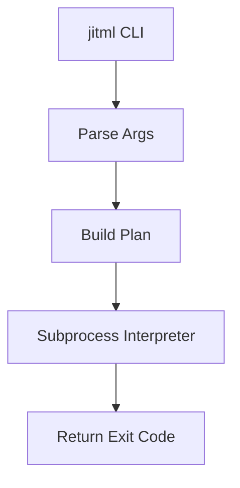

# Documentation Standards

**Status**: Authoritative source
**Supersedes**: N/A
**Referenced by**: ../README.md, ../HASKELL_CLI_TOOL.md, ../DEVELOPMENT_PLAN/README.md, ../DEVELOPMENT_PLAN/development_plan_standards.md, ../DEVELOPMENT_PLAN/phase-0-planning-documentation.md, ../DEVELOPMENT_PLAN/phase-1-haskell-cli-surface.md, engineering/README.md, engineering/cli_command_surface.md, engineering/code_quality.md, engineering/unit_testing_policy.md, engineering/haskell_code_guide.md, engineering/determinism_contract.md, engineering/cluster_topology.md, engineering/daemon_architecture.md, engineering/jit_codegen_architecture.md, engineering/numerical_core.md, engineering/training_workloads.md, engineering/checkpoint_format.md, engineering/purescript_frontend.md
**Generated sections**: documentation-standards.generated-section-index

> **Purpose**: Single Source of Truth (SSoT) for writing and maintaining
> documentation across the jitML repository.

---

## 1. Philosophy

### SSoT-First

Every concept has exactly one canonical document. Other documents may reference
but never duplicate.

The CLI doctrine lives at [../HASKELL_CLI_TOOL.md](../HASKELL_CLI_TOOL.md). The
development plan lives at [../DEVELOPMENT_PLAN/README.md](../DEVELOPMENT_PLAN/README.md).
Project-specific engineering doctrine lives under [engineering/](./engineering/).
Operator-facing project intent lives at [../README.md](../README.md).

### Development Plan Authority

`../DEVELOPMENT_PLAN/README.md` is the single source of truth for phase order,
sprint status, blockers, remaining work, validation closure, and cleanup
ownership.

Documents under this directory may explain architecture, doctrine, and
verification boundaries, but they must link back to the development plan instead
of maintaining competing status ledgers.

### DRY + Link Liberally

- Never copy-paste content between documents.
- Use relative links with section anchors.
- Prefer deep links: `./engineering/determinism_contract.md#per-substrate-floating-point-semantics`.

### Separation of Concerns

- **Engineering docs** (`engineering/`): architecture, design decisions,
  patterns, verification boundaries.
- **CLI docs** (generated under `cli/`): API documentation, command schema,
  generated tables, manpages, completion scripts.
- **Reference docs** (the doctrine, the development plan): authoritative rules.

---

## 2. Naming Conventions

### Primary Rule: snake_case

All documentation files under `documents/` use `snake_case.md`:

- `documentation_standards.md`
- `cli_command_surface.md`
- `determinism_contract.md`
- `cluster_topology.md`
- `daemon_architecture.md`

### Allowed Exceptions (ALL-CAPS)

- `README.md`
- `CLAUDE.md`
- `AGENTS.md`
- `LICENSE`
- `HASKELL_CLI_TOOL.md`

### Development Plan Suite

The repository-root `DEVELOPMENT_PLAN/` directory defines its own internal
structure and maintenance rules under
[../DEVELOPMENT_PLAN/development_plan_standards.md](../DEVELOPMENT_PLAN/development_plan_standards.md).
That plan suite uses `phase-N-kebab-case-title.md` and a few specific
ALL-CAPS-style filenames (`README.md`, `00-overview.md`) by deliberate
exception; the rest of the plan suite uses lowercase `snake_case` /
`kebab-case` as well.

---

## 3. Required Header Metadata

Every document must include:

```markdown
# Document Title

**Status**: [Authoritative source | Reference only | Deprecated]
**Supersedes**: [N/A | path/to/old/doc.md]
**Referenced by**: [comma-separated list of consumers]
**Generated sections**: [comma-separated list of generated-section keys | none]

> **Purpose**: One-sentence description.
```

### Status Values

| Status | Meaning |
|--------|---------|
| `Authoritative source` | This is the SSoT for this topic |
| `Reference only` | Points to authoritative sources |
| `Deprecated` | Scheduled for removal |

### `**Generated sections**:` Metadata Field

Mandatory in every governed document. The value is either `none` or a
comma-separated list of the `<key>` portion of every generated-region marker
pair the document contains (see Section 11). Marker text inside inline code,
tables, or fenced examples is documentation, not a generated region. The lint
pass owned by `jitml docs check` enforces that the metadata and the generated
region markers physically present in the file agree: declaring `none` when
generated-region markers are present is a lint failure, and declaring a key
whose markers are missing is a lint failure. The reference list of generated
sections per file is the `GeneratedSectionRule` registry described in
[../HASKELL_CLI_TOOL.md → Generated
Artifacts](../HASKELL_CLI_TOOL.md).

---

## 4. Cross-Referencing Rules

### Relative Links with Anchors

```markdown
See [the per-substrate floating-point semantics](./engineering/determinism_contract.md#per-substrate-floating-point-semantics).
```

### Bidirectional Links

When document A references document B, document B's `Referenced by` should
include A.

---

## 5. Duplication Rules

### Never Copy

- Configuration examples.
- Code snippets that exist in the source.
- The doctrine's own prescriptions — engineering docs cite the doctrine
  section by name; they do not paste its text.

### Always Link

```markdown
For sprint status and cleanup ownership, see
[Development Plan](../DEVELOPMENT_PLAN/README.md).
For CLI patterns, see [Haskell CLI doctrine](../HASKELL_CLI_TOOL.md).
```

---

## 6. Code Examples (Markdown)

### Always Specify Language

```haskell
-- File: src/JitML/Service/BootConfig.hs
data BootConfig = BootConfig
    { bootSubstrate    :: !Substrate
    , bootResidency    :: !Residency
    , bootInferenceMode :: !InferenceMode
    }
```

### File Path Comment

First line of code blocks should indicate source:

```haskell
-- File: src/JitML/RL/Loop.hs  -- Actual source file
```

Or for teaching examples:

```haskell
-- Example: Hypothetical training pipeline
trainStep :: Policy -> Batch -> ReaderT Env IO Policy
```

### Current-Surface Examples Only

Code examples must not use:

- removed paths or deprecated CLI flags.
- unsupported toolchains or bridge layers.
- stale commands that bypass the public `jitml` surface.

---

## 7. Function Documentation

```haskell
-- | Derive a per-experiment seed from a master seed and an experiment index.
--
-- Splitmix64 is reproducible across substrates and bijective in
-- `experimentIndex` for any fixed `masterSeed`.
mix :: Word64 -> Word32 -> Word64
```

---

## 8. Mermaid Diagram Standards

### Allowed Types

- `flowchart TB` (top-bottom)
- `flowchart LR` (left-right)
- `graph TB` / `graph LR`
- `stateDiagram-v2`

### Forbidden

- Dotted lines (`-.->`)
- Subgraphs
- Complex nesting

### Example



---

## 9. Anti-Patterns

### Vague Status Values

- BAD: `**Status**: WIP`
- GOOD: `**Status**: Authoritative source`

### Copy-Pasted Content

- BAD: Duplicating the doctrine's `Subprocess` ADT definition.
- GOOD: Linking to
  [../HASKELL_CLI_TOOL.md → Architecture → Subprocesses as Typed
  Values](../HASKELL_CLI_TOOL.md).

### Examples Pointing at Removed Paths

- BAD: After a CLI verb is renamed, `See the legacy verb...`.
- GOOD: `See ../DEVELOPMENT_PLAN/legacy-tracking-for-deletion.md for the
  removal record`.

---

## 10. Intent Ownership

This SSoT co-owns documentation-topology doctrine intention.

- Owned statement: SSoT ownership, bidirectional links, and non-duplication
  rules are mandatory for all new doctrinal content.
- Linked dependents: `engineering/README.md`,
  `../DEVELOPMENT_PLAN/development_plan_standards.md`.

---

## 11. Generated Sections

This section documents the generated-sections discipline mandated by
[../HASKELL_CLI_TOOL.md → Generated Artifacts](../HASKELL_CLI_TOOL.md) and
[../HASKELL_CLI_TOOL.md → Project-level documentation
standards](../HASKELL_CLI_TOOL.md). The doctrine is the authoritative source
for the underlying registry shape, marker conventions, paired check/write
commands, and drift enforcement; this section restates the contract for
documentation contributors who do not need to read the full doctrine.

### Marker Conventions

Generated sections are delimited by paired sentinel comments in the host
syntax of the target file. The marker key is dotted, hierarchical, and unique
across the `GeneratedSectionRule` registry.

| File type | Start marker | End marker |
|-----------|--------------|------------|
| Markdown | `<!-- jitml:<key>:start -->` | `<!-- jitml:<key>:end -->` |
| YAML | `# jitml:<key>:start` | `# jitml:<key>:end` |
| Haskell | `-- jitml:<key>:start` | `-- jitml:<key>:end` |
| C / C++ / Rust | `// jitml:<key>:start` | `// jitml:<key>:end` |
| PureScript | `-- jitml:<key>:start` | `-- jitml:<key>:end` |
| Dhall | `-- jitml:<key>:start` | `-- jitml:<key>:end` |

Example: a generated route table inside `engineering/cluster_topology.md`
might look like:

```markdown
<!-- jitml:cluster.routes:start -->
| Path prefix | Upstream | Rewrite |
|---|---|---|
| `/` | `jitml-demo:80` | (none) |
<!-- jitml:cluster.routes:end -->
```

### Authoritative List of Files with Generated Regions

The single source of truth is the in-code `GeneratedSectionRule` registry
consumed by `jitml docs check` and `jitml docs generate`. Every file that
contains markers must declare its keys in its `**Generated sections**:`
metadata field (Section 3); the lint pass enforces agreement.

The currently scheduled registry entries:

<!-- jitml:documentation-standards.generated-section-index:start -->
| Generation target | Marker key prefix | Owning sprint |
|-------------------|-------------------|---------------|
| Root README command tree and command registry | `command-tree`, `command-registry` | Sprint 1.2 / Sprint 1.3 |
| CLI command reference | `cli-commands.reference`, `cli-commands.help-blocks` | Sprint 1.2 / Sprint 1.3 |
| Generated section index in this file | `documentation-standards.generated-section-index` | Sprint 1.3 |
| Cluster route table | `cluster.routes` | Sprint 3.4 |
| Numerical-core catalog tables | `numerics.layers`, `numerics.activations`, `numerics.spectral`, `numerics.optimizers`, `numerics.schedulers`, `numerics.losses` | Sprint 6.1 / 6.2 / 6.3 / 6.4 / 6.5 / 6.6 |
| Daemon endpoint and config table | `daemon.surface` | Sprint 5.3 |
| RL algorithm catalog table | `training.rl.catalog` | Sprint 9.3 |
| Hyperparameter tuning tables | `training.tune.samplers`, `training.tune.schedulers`, `training.tune.pruners` | Sprint 9.7 |
| Cross-language types (TypeScript / PureScript mirrors of Haskell ADTs) | `cross-language-types.*` | Sprint 11.2 |
<!-- jitml:documentation-standards.generated-section-index:end -->

### How to Regenerate

Run `jitml docs generate` to splice the current renderer output between every
marker pair declared in the registry. Hand edits between markers are reverted
on the next regenerate and fail `jitml docs check` until reverted.

The check command emits the doctrine's three-element error message on drift:

1. The file path that drifted.
2. The marker key (so the contributor knows which renderer is responsible).
3. A literal remedy hint: `` Run `jitml docs generate` to update. ``

### How to Add a New Generated Section

The doctrine's five-step extension protocol:

1. Define or extend the renderer in the relevant Haskell library module under
   `src/JitML/Generated/`.
2. Add the marker pair to the target file using the conventions above.
3. Register a new `GeneratedSectionRule` or `TrackedGeneratedPath` entry in
   the in-code registry at `src/JitML/Generated/Registry.hs` or
   `src/JitML/Generated/Paths.hs`.
4. Run `jitml docs generate` to populate the section.
5. Confirm `jitml docs check` and `cabal test` pass.

### Fully Generated, Do-Not-Hand-Edit Paths

A separate tracked-generated-paths registry names files that are owned wholly
by code generators (no markers required because the entire file is
generated). The `trackingGeneratedPaths` registry in
`src/JitML/Generated/Paths.hs` is the authoritative source, with
`jitml docs check` refusing drift on generated paths now and `jitml lint files`
adding file-hygiene enforcement in Sprint `1.4`:

- `documents/cli/commands.md`
- `share/man/man1/jitml.1`
- `share/man/man1/jitml-*.1`
- `share/completion/bash/jitml`
- `share/completion/zsh/_jitml`
- `share/completion/fish/jitml.fish`
- `web/src/Generated/Contracts.purs`
- `chart/templates/httproute-*.yaml`
- `chart/templates/grafana-dashboard-*.yaml`
- `kind/cluster-*.yaml`

The current registry contents are the authoritative source; future
fully-generated paths must be added there in the same change that introduces
them. The `jitml-haskell-style` suite also checks the renderer-source modules named
by the registry for forbidden non-deterministic inputs such as timestamps,
random IDs, locale-dependent ordering, terminal-width state, and environment-
derived paths.

---

## Cross-References

- [Engineering docs index](./engineering/README.md)
- [Development Plan](../DEVELOPMENT_PLAN/README.md)
- [HASKELL_CLI_TOOL.md](../HASKELL_CLI_TOOL.md) — canonical CLI doctrine
- [CLAUDE.md](../CLAUDE.md) — AI assistant guidelines
- [AGENTS.md](../AGENTS.md) — agent guidelines
- [README.md](../README.md) — project intent and command surface
