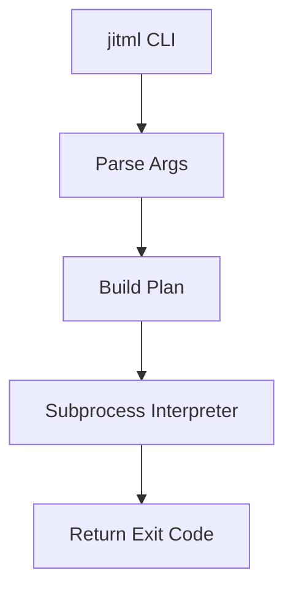

# Documentation Standards

**Status**: Authoritative source
**Supersedes**: N/A
**Referenced by**: ../README.md, ../AGENTS.md, ../CLAUDE.md, ../DEVELOPMENT_PLAN/README.md, ../DEVELOPMENT_PLAN/development_plan_standards.md, engineering/README.md, engineering/checkpoint_format.md, engineering/numerical_core.md, engineering/determinism_contract.md, engineering/run_contract.md, engineering/product_completion_contract.md, engineering/jit_codegen_architecture.md, engineering/unit_testing_policy.md, engineering/cli_command_surface.md
**Generated sections**: documentation-standards.generated-section-index

> **Purpose**: Single source of truth for how documentation is named, structured, linked, and maintained across the jitML repository.

---

## TL;DR

Governed documents state **current implemented behavior and target contracts in
the same document**, in present-tense declarative voice, with the boundary
explicitly labeled. A target statement must never read as an already-implemented
claim. Mutable phase/sprint status, dependency order, and dated validation
evidence stay in `../DEVELOPMENT_PLAN/`, never duplicated into topic docs. Every
governed document carries a metadata block; topic docs use `**Referenced by**:`
(a curated, non-reciprocal navigation list) and root docs use `**Canonical
homes**:`. The mechanical floor is enforced by `jitml docs check` (`## Validation`).

This doctrine mirrors the family governance shape shared with
`hostbootstrap` (which jitML consumes for its host/bootstrap layer); jitML keeps
its own standard here and adds the generated-section machinery hostbootstrap does
not use.

---

## 1. Metadata Block

Document metadata uses the metadata block below, not YAML front-matter. The
`# Title` is the first non-empty line; the purpose blockquote follows the fields.

### Governed topic documents (everything under `documents/`)

```markdown
# Document Title

**Status**: Authoritative source | Supporting reference | Draft
**Supersedes**: N/A | relative/path/to/old.md
**Referenced by**: [name](relative/link.md), [other](relative/other.md)
**Generated sections**: none | comma-separated generated-region keys

> **Purpose**: One-sentence description.
```

- All five elements are required. `**Supersedes**:` is `N/A` when nothing is
  superseded.
- `**Referenced by**:` is a **curated, non-exhaustive** ownership/navigation list
  of documents that conceptually consume this page's contract. It is **not a
  mechanically reciprocal graph**: a listed consumer need not contain a literal
  return link, and you do not manufacture a reciprocal link merely to satisfy
  metadata. Prune an entry when the named document no longer consumes the
  contract.
- `**Generated sections**:` is jitML-specific and mandatory: `none`, or the
  comma-separated `<key>` of every generated-region marker pair the file contains
  (see [§9 Generated Sections](#9-generated-sections)). `jitml docs check`
  enforces that the declared keys and the physical markers agree.

### Governed root documents (`README.md`, `AGENTS.md`, `CLAUDE.md`)

```markdown
# Title

**Status**: Governed orientation document | Governed entry document
**Supersedes**: N/A | short statement of the root-level duplication this replaces
**Canonical homes**: [documents/...](documents/...), [DEVELOPMENT_PLAN/README.md](DEVELOPMENT_PLAN/README.md)
**Generated sections**: none | comma-separated generated-region keys   ← only if the root doc hosts generated regions

> **Purpose**: One-sentence description.
```

- Root docs replace `**Referenced by**:` with `**Canonical homes**:`, which points
  *outward* to the documents that own each topic the root doc summarizes.
- `README.md` uses `**Status**: Governed orientation document`; `AGENTS.md` and
  `CLAUDE.md` use `**Status**: Governed entry document`.
- Root docs summarize and link; they do not become parallel canonical homes for a
  design or engineering topic, and they carry no status ledger.
- `**Generated sections**:` appears on a root doc only when it physically hosts
  generated regions (the root `README.md` hosts the command-tree/registry
  regions); otherwise it is omitted.

### Status Values

Topic documents (closed set):

| Status | Meaning |
|--------|---------|
| `Authoritative source` | This file is the canonical home (SSoT) for its topic |
| `Supporting reference` | Index/navigation or secondary material that links to a source of truth |
| `Draft` | Not yet canonical |

Root documents (closed set):

| Status | Meaning |
|--------|---------|
| `Governed orientation document` | `README.md` — orientation layer that summarizes and links |
| `Governed entry document` | `AGENTS.md` / `CLAUDE.md` — entry rules that summarize and link |

Vague status labels (`WIP`, `Current`, `Final`) are forbidden; forward/planned
work is not a document-status concept — it lives in the plan's phase status and in
this doctrine's `## Current Status` sections.

---

## 2. Broad Doctrine Structure

Broad governed docs that define repository doctrine use stronger structure than a
short reference page:

- include `## TL;DR` or `## Executive Summary` when the topic is broad;
- include **`## Current Status`** when implemented behavior and target direction
  appear in the same document (see §3);
- include **`## Validation`** when a gate (the code-check, a test runner, or the
  doc validator) proves the contract, naming the exact command;
- use explicit tables or matrices when ownership, substrate behavior, or a model
  summary is part of the contract;
- answer directly, when relevant: what is the rule, what is current versus target,
  how is it validated.

---

## 3. Current vs Target Content Doctrine

This is the heart of the doctrine.

- **State implemented behavior and target contracts declaratively, and label the
  boundary between them.** Keep implementation chronology out of governed topic
  documents.
- A **target statement must never read as an already-implemented claim.** When a
  target conflicts with current code, the owning phase stays Active rather than the
  doc describing the unbuilt state as supported.
- When current and target mix, a **`## Current Status`** section is mandatory: it
  states, succinctly, what is implemented today versus what the owning phase(s)
  will make true, and links to the owning phase(s) in `../DEVELOPMENT_PLAN/`.
- A topic document may summarize a current defect **only as needed** to prevent its
  target contract from being mistaken for implemented behavior.
- **Keep mutable phase/sprint status, dependency order, closure criteria, and dated
  implementation evidence in `../DEVELOPMENT_PLAN/`.** Topic docs carry the durable
  contract, not a second status ledger and not dated test counts.

WRONG/RIGHT (a WRONG example is always paired with the reason):

- WRONG: "The checkpoint wire is one self-describing envelope." — reads as
  implemented while V1/V2/V3 still ship. RIGHT: under `## Current Status`, "Today
  the wire carries V1/V2/V3 envelopes; Phase `235` collapses them to one
  self-describing envelope (target)."

---

## 4. Source of Truth and Authority Boundaries

- `../DEVELOPMENT_PLAN/README.md` owns phase order, current implementation status,
  closure criteria, and is the single cross-phase status source of truth.
- `documents/` owns architecture and engineering guidance (the durable contract).
- `README.md` is a governed orientation layer and points to canonical documents
  instead of duplicating them; `AGENTS.md` and `CLAUDE.md` are governed entry
  documents that stay aligned with the repository rules they summarize.
- When current-state or closure claims in `documents/` conflict with
  `../DEVELOPMENT_PLAN/`, reconcile the governed docs to the plan; `documents/` is
  never a parallel implementation-status authority.
- Exact test counts and real-run results are dated validation evidence owned by the
  sprint whose gate produced them, never a second "current suite" status in a topic
  or orientation doc.
- jitML **consumes** `hostbootstrap` for its host/bootstrap layer; this standard
  links to that repository for the bootstrap contract rather than re-owning it.

---

## 5. Taxonomy

The canonical documentation root is `documents/`. Its current top-level categories:

```text
documents/
├── README.md
├── documentation_standards.md
├── cli/            # generated CLI reference surface
└── engineering/    # architecture, design decisions, verification boundaries
```

Rules:

- `documents/` is the only canonical documentation root; a `docs/` directory is
  **not** introduced.
- The allowed top-level categories are `cli` and `engineering`. `architecture`,
  `operations`, and `research` are reserved names for future categories and may be
  added only in the same change that creates the directory and updates this file
  and `documents/README.md`.
- CLI docs under `cli/` are generated (command schema, tables, manpages,
  completion scripts) and are owned by the tracked-generated-paths registry.

---

## 6. Naming and Linking

- File names under `documents/` are lowercase `snake_case` with a `.md` suffix.
  Only `README.md` is exempt from the case rule; `AGENTS.md`, `CLAUDE.md`, and
  `LICENSE` are the permitted ALL-CAPS root names.
- Relative Markdown links are required for in-repo references; use deep links with
  section anchors, e.g.
  `./engineering/determinism_contract.md#per-substrate-floating-point-semantics`.
- Each governed doc links to at least one other governed source.
- Module names, commands, paths, types, and binaries use backticks.
- **Never copy** configuration, source snippets, doctrine text, or the typed
  run-plan / delivery / lifecycle / evidence / journal shapes between docs — cite
  the owner (e.g. [engineering/run_contract.md](engineering/run_contract.md)) by
  section name/anchor. The `DEVELOPMENT_PLAN/` phase suite defines its own internal
  naming under
  [../DEVELOPMENT_PLAN/development_plan_standards.md](../DEVELOPMENT_PLAN/development_plan_standards.md).

---

## 7. Code Examples

- Always specify the language fence, and put a source-path comment on the first
  line (`-- File: src/JitML/...`) or an `-- Example:` marker for teaching snippets.
- **Current-surface examples only**: code examples must not use removed paths,
  deprecated CLI flags, unsupported toolchains/bridge layers, or stale commands
  that bypass the public `jitml` surface. A renamed/removed surface is pointed at
  [../DEVELOPMENT_PLAN/legacy-tracking-for-deletion.md](../DEVELOPMENT_PLAN/legacy-tracking-for-deletion.md),
  not shown as usable.

---

## 8. Mermaid Diagram Standards

Allowed: `flowchart TB`, `flowchart LR`, `graph TB`, `graph LR`, `stateDiagram-v2`.
Forbidden: dotted lines (`-.->`), subgraphs, complex nesting.


```mermaid
flowchart TB
    CLI[jitml CLI] --> Parser[Parse Args]
    Parser --> Plan[Build Plan]
    Plan --> Subprocess[Subprocess Interpreter]
    Subprocess --> Result[Return Exit Code]
```

---

## 9. Generated Sections

jitML owns a generated-section machinery hostbootstrap does not use; it stays.
The README is the authoritative source for the generated artifact surface; this
section records the local marker conventions, paired check/write commands, and
drift enforcement.

### Marker Conventions

Generated sections are delimited by paired sentinel comments; the marker key is
dotted, hierarchical, and unique across the `GeneratedSectionRule` registry. The
current implementation supports Markdown HTML comments only:

| File type | Start marker | End marker |
|-----------|--------------|------------|
| Markdown | `<!-- jitml:<key>:start -->` | `<!-- jitml:<key>:end -->` |

Do not add non-Markdown host-syntax sentinels until `JitML.Generated.Registry` and
`JitML.Docs.Check` support writing and checking that syntax. Marker text inside
inline code, tables, or fenced examples is documentation, not a generated region.

### Authoritative List of Files with Generated Regions

The single source of truth is the in-code `GeneratedSectionRule` registry consumed
by `jitml docs check` and `jitml docs generate`. Every file that contains markers
must declare its keys in its `**Generated sections**:` metadata field (§1).

The currently scheduled registry entries:

<!-- jitml:documentation-standards.generated-section-index:start -->
| Generation target | Marker key prefix | Owning sprint |
|-------------------|-------------------|---------------|
| Root README command tree and command registry | `command-tree`, `command-registry` | Sprint 1.2 / Sprint 1.3 |
| CLI command reference | `cli-commands.reference`, `cli-commands.help-blocks` | Sprint 1.2 / Sprint 1.3 |
| Generated section index in this file | `documentation-standards.generated-section-index` | Sprint 1.3 |
| Cluster route table | `cluster.routes` | Sprint 3.4 |
| Numerical-core catalog tables | `numerics.layers`, `numerics.activations`, `numerics.spectral`, `numerics.optimizers`, `numerics.schedulers`, `numerics.losses` | Sprint 6.1 / 6.2 / 6.3 / 6.4 / 6.5 / 6.6 |
| Daemon endpoint and config table | `daemon.surface` | Sprint 5.3 |
| RL algorithm catalog table | `training.rl.catalog` | Sprint 9.3 |
| Hyperparameter tuning tables | `training.tune.samplers`, `training.tune.schedulers`, `training.tune.pruners` | Sprint 9.7 |
| PureScript contract file | `web.contracts.purescript` | Sprint 11.2 |
| Chart HTTPRoutes | `chart.routes.*` | Sprint 3.4 |
| Grafana dashboard ConfigMaps | `chart.grafana.*` | Sprint 4.5 |
| Prometheus scrape config | `chart.prometheus.scrape` | Sprint 4.5 |
| Cross-language types (TypeScript / PureScript mirrors of Haskell ADTs) | `cross-language-types.*` | Sprint 11.2 |
<!-- jitml:documentation-standards.generated-section-index:end -->

### How to Regenerate

Run `jitml docs generate` to splice the current renderer output between every
marker pair declared in the registry. Hand edits between markers are reverted on
the next regenerate and fail `jitml docs check` until reverted. On drift the check
emits the file path, the marker key, and the remedy `` Run `jitml docs generate` to
update. ``

### How to Add a New Generated Section

1. Define or extend the renderer under `src/JitML/Generated/` (or
   `src/JitML/Docs/Render.hs`).
2. Add the Markdown marker pair to the target file, or add a whole-file artifact to
   the tracked-generated-paths registry when the target is not Markdown.
3. Register a `GeneratedSectionRule` / `TrackedGeneratedPath` in
   `src/JitML/Generated/Registry.hs` or `src/JitML/Generated/Paths.hs`.
4. Run `jitml docs generate` to populate the section.
5. Confirm `jitml docs check` passes; run `jitml test` / `cabal test`, and style +
   code-quality separately with container-only `jitml lint *` / `jitml check-code`.

### Fully Generated, Do-Not-Hand-Edit Paths

The `trackingGeneratedPaths` registry in `src/JitML/Generated/Paths.hs` is the
authoritative source for whole-file generated artifacts; `jitml docs check` refuses
drift on them:

- `documents/cli/commands.md`
- `share/man/man1/jitml.1`
- `share/completion/bash/jitml`, `share/completion/zsh/_jitml`, `share/completion/fish/jitml.fish`
- `web/src/Generated/Contracts.purs`
- `chart/templates/httproute-*.yaml`, `chart/templates/grafana-dashboard-*.yaml`, `chart/templates/prometheus-scrapeconfig-jitml.yaml`

---

## 10. Brevity

If a governed document grows past roughly 300 lines, ask whether it should split.
Two focused documents are easier to skim than one combined one.

---

## 11. Update Rules

Keep the owning doc and the affected phase document changing together:

- when the checkpoint wire, admission, or supervised runtime changes, update
  [engineering/checkpoint_format.md](engineering/checkpoint_format.md) (and the
  determinism/JIT docs it deep-links) and the affected phase document in the same
  change;
- when the numerical core / layer catalog changes, update
  [engineering/numerical_core.md](engineering/numerical_core.md) and the affected
  phase document;
- when the public `jitml` CLI surface changes, regenerate
  [cli/commands.md](cli/commands.md) and update
  [engineering/cli_command_surface.md](engineering/cli_command_surface.md);
- when the run/protocol/evidence contract changes, update
  [engineering/run_contract.md](engineering/run_contract.md) and the affected phase
  document;
- when repository-level workflow rules change, review `README.md`, `AGENTS.md`, and
  `CLAUDE.md` in the same change.

---

## 12. Anti-Patterns

- Vague status labels (`WIP`, `Current`, `Final`) — use the closed Status enums (§1).
- Copy-pasted config, source, doctrine text, or typed contract shapes — link the
  owner instead (§6).
- Examples pointing at removed/renamed paths presented as usable — point at the
  legacy-tracking record (§7).
- A parallel status ledger, dated test counts, or migration chronology inside a
  topic or orientation doc — that belongs in `../DEVELOPMENT_PLAN/` (§3, §4).
- A target statement phrased as an implemented claim (§3).
- A manufactured reciprocal backlink added only to satisfy `**Referenced by**:` (§1).
- YAML front-matter, or a `docs/` directory (§1, §5).

---

## 13. Validation

The mechanical documentation floor is the `JitML.Docs.Check` module
(`src/JitML/Docs/Check.hs`), run by `jitml docs check` and the `jitml lint docs`
target, and exercised by `test/unit/Main.hs`. It verifies:

- required metadata lines for governed topic documents
  (`Status`/`Supersedes`/`Referenced by`/`Generated sections`/purpose);
- required metadata lines for governed **root** documents
  (`Status`/`Supersedes`/`Canonical homes`/purpose), for `README.md`, `AGENTS.md`,
  and `CLAUDE.md`;
- generated-section marker/metadata reconciliation and whole-file
  tracked-generated-path integrity;
- the closure-claim scan (`src/JitML/Lint/Docs.hs`): governed docs must not assert
  current product closure (`production ready`, `all phases done`, `no-caveat product
  complete`, …) while the product phases are not all Done — dated historical
  evidence and prohibitions are exempt when their block names them as such;
- the canonical `documents/` taxonomy (top-level categories ∈ `cli`, `engineering`)
  and lowercase `snake_case` naming under `documents/` (`README.md` exempt).

`**Referenced by**:` existence is checked; **backlink reciprocity is deliberately
not enforced** (§1). Run `jitml docs check` after any governed-doc edit; run
`jitml check-code` for the Haskell quality gate and `jitml test jitml-unit
--linux-cpu` for the doc-validator tests.

---

## Cross-References

- [Engineering docs index](./engineering/README.md)
- [Development Plan](../DEVELOPMENT_PLAN/README.md) — phase order, status, closure
- [README.md](../README.md) — project orientation and CLI doctrine
- [CLAUDE.md](../CLAUDE.md), [AGENTS.md](../AGENTS.md) — governed entry documents
